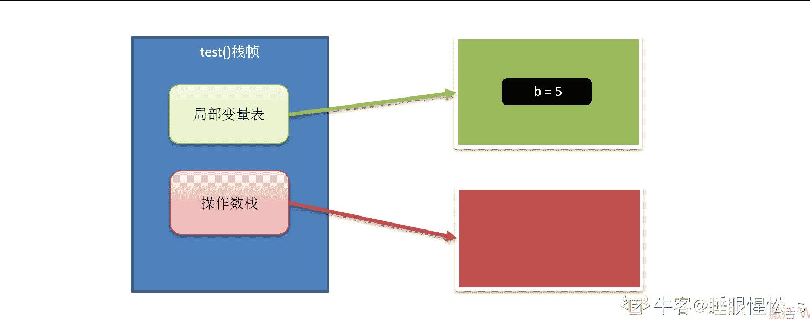

# 用友 2018 秋招 Java 笔试题（三）

## 1

下列可作为 java 语言标识符的是（）

正确答案: A B C   你的答案: 空 (错误)

```cpp
a1
```

```cpp
$1
```

```cpp
_1
```

```cpp
11
```

本题知识点

Java 工程师 用友 Java 2018

讨论

[MercyZhou](https://www.nowcoder.com/profile/9724200)

Java 语言提供了很多修饰符，主要分为以下两类：1、访问修饰符 **    default** (即默认，什么也不写）: 在同一包内可见，不使用任何修饰符。使用对象：类、接口、变量、方法。**    private** : 在同一类内可见。使用对象：变量、方法。 **注意：不能修饰类（外部类）****    public** : 对所有类可见。使用对象：类、接口、变量、方法**    protected** : 对同一包内的类和所有子类可见。使用对象：变量、方法。 **注意：不能修饰类（外部类）**。2、非访问修饰符，包括但不限于：

    **static** 修饰符，用来修饰类方法和类变量。

    **final** 修饰符，用来修饰类、方法和变量，final 修饰的类不能够被继承，修饰的方法不能被继承类重新定义，修饰的变量为常量，是不可修改的。

    **abstract** 修饰符，用来创建抽象类和抽象方法。

    **synchronized** 和 **volatile** 修饰符，主要用于线程的编程。本题应该是想考标识符：Java 标识符由数字，字母和下划线（_），美元符号（$）或人民币符号（￥）组成。在 Java 中是区分大小写的，而且还要求首位不能是数字。最重要的是，Java[关键字](https://baike.baidu.com/item/%E5%85%B3%E9%94%AE%E5%AD%97)不能当作 Java 标识符。 

发表于 2019-09-24 21:54:04

* * *

[白起丶](https://www.nowcoder.com/profile/815173790)

1.  标识符的组成元素是字母（a-z，A-Z），数字（0~9），下划线（_）和美元符号（$）。
2.  标识符不能以数字开头。
3.  java 的标识符是严格区分大小写的。
4.  标识符的长度可以是任意的。
5.  关键字以及 null、true、false 不能用于自定义的标识符。

发表于 2020-06-10 16:38:28

* * *

[爱编程的小石头](https://www.nowcoder.com/profile/830331930)

标识符和修饰符是两个东西吧？

发表于 2019-09-19 00:44:44

* * *

## 2

character 流和 byte 流的的说法错误的是

正确答案: A B D   你的答案: 空 (错误)

```cpp
每次读入的字节数不同
```

```cpp
前者带有缓冲，后者没有。
```

```cpp
前者是字符读入，后者是字节读入。
```

```cpp
二者没有区别，可以互换。
```

本题知识点

Java 工程师 用友 Java 2018

讨论

[霄霄霄霄霄.](https://www.nowcoder.com/profile/164030487)

字符流和字节流每次读入的字节数是不确定的，可能相同也可能不相同；字符流和字节流都有缓冲流

发表于 2019-10-01 20:30:59

* * *

[学不会 Java](https://www.nowcoder.com/profile/951786921)

Java 的流操作分为字节流和字符流两种。字节流与字符流主要的区别是他们的处理方式字节流是最基本的，所有的 InputStream 和 OutputStream 的子类都是,主要用在处理二进制数据，它是按字节来处理的。但实际中很多的数据是文本，又提出了字符流的概念，它是按虚拟机的 encode 来处理，也就是要进行字符集的转化
这两个之间通过 InputStreamReader,OutputStreamWriter 来关联，实际上是通过 byte[]和 String 来关联。在实际开发中出现的汉字问题实际上都是在字符流和字节流之间转化不统一而造成的。
字节流---->字符流
字节流转化为字符流，实际上就是 byte[]转化为 String 时，
public String(byte bytes[], String charsetName)
有一个关键的参数字符集编码，通常我们都省略了，那系统就用操作系统的 lang
字符流---->字节流

```cpp
字符流转化为字节流，实际上是 String 转化为 byte[]时，byte[] String.getBytes(String charsetName)也是一样的道理至于 java.io 中还出现了许多其他的流，按主要是为了提高性能和使用方便，如 BufferedInputStream,PipedInputStream 等
```

常识：

对于 GBK 编码标准，英文占用 1 个字节，中文占用 2 个字节
对于 UTF-8 编码标准，英文占用 1 个字节，中文占用 3 个字节
对于 Unicode 编码标准，英文中文都是 2 个字节。这也是为什么叫做 unicode

发表于 2019-09-15 00:31:19

* * *

[不大仙](https://www.nowcoder.com/profile/473254804)

字符流和字节流每次读入的字节数是不确定的，可能相同也可能不相同
例 FileInputStream 的 read() 方法每次读入一个字节，read(byte b[]) 每次读入 b.length 个字节
    FileReader   的 read()方法每次读入一个字符，read(char cbuf[], int offset, int length)每次读入 length 个字符
另外，字符流和字节流读入一个 ASCII 字符，字节数是相同的
例 UTF-8 字符编码中一个汉字占三个字节，数字 1 占一个字节，用字符流读入的数字 1 长度为一个字节，用字节流读入的数字 1 长度也为一个字节

编辑于 2019-09-10 17:08:40

* * *

## 3

Java 网络程序设计中,下列正确的描述是（）

正确答案: A D   你的答案: 空 (错误)

```cpp
Java 网络编程 API 建立在 Socket 基础之上
```

```cpp
Java 网络接口只支持 tcP 以及其上层协议
```

```cpp
Java 网络接口只支持 UDP 以及其上层协议
```

```cpp
Java 网络接口支持 IP 以上的所有高层协议
```

本题知识点

Java 工程师 用友 Java 2018

讨论

[MC 枫少](https://www.nowcoder.com/profile/4171070)

下面由 MC 枫少为您解答:
一个"只"字暴露了这道题哪个是错的

发表于 2020-04-22 18:46:37

* * *

[归墨](https://www.nowcoder.com/profile/74777823)

UDP

> Java 的 java.net 包中，提供了两个类 DatagramSocket 和 DatagramPacket 来支持 UDP 的数据报（Datagram）通信其中 DatagramSocket 用于在程序之间建立传送数据报的通信通道，DatagramPacket 则用来表示一个数据报。DatagramSocket 发送的每个包都需要指定地址，而 DatagramPacket 则是在首次创建时指定地址，以后所有数据的发生都通过此 socket。UDP 的客户端编程也是 4 个部分：建立连接、发送数据、接受数据和关闭连接。[`blog.csdn.net/qq_38180223/article/details/81502584`](https://blog.csdn.net/qq_38180223/article/details/81502584)

TCP

> Java 实现 TCP 数据传输涉及到的类有 Socket、ServerSocket；TCP 分客户端服务端，而 UDP 不分客户端服务端[`blog.csdn.net/yy455363056/article/details/80210461`](https://blog.csdn.net/yy455363056/article/details/80210461)

发表于 2019-11-29 09:49:48

* * *

[就不给你佛](https://www.nowcoder.com/profile/657108121)

socket 就对 tcp 协议的一个套接字 套接字也可以简单的理解成接口， 不过相对接口而言， 是针对于网络主机的， 更基础

发表于 2019-09-06 09:28:16

* * *

## 4

有关线程的哪些叙述是对的（）

正确答案: B C D   你的答案: 空 (错误)

```cpp
一旦一个线程被创建，它就立即开始运行。
```

```cpp
使用 start()方法可以使一个线程成为可运行的，但是它不一定立即开始运行。
```

```cpp
当一个线程因为抢先机制而停止运行，它可能被放在可运行队列的前面。
```

```cpp
一个线程可能因为不同的原因停止并进入就绪状态。
```

本题知识点

Java 工程师 用友 Java 2018

讨论

[98 年饭崽](https://www.nowcoder.com/profile/56600133)

我自己最开始的时候只选了 BD 没选 C。看评论里面也对 C 存疑，通过书籍查证 C 是可以选的。在抢先式系统下，由高优先级的线程参与调度。分为 2 种情况：1.若多个线程都处于就绪状态，则具有高优先级的线程会在低优先级之前得到执行；
2.在当前线程的运行过程中，如果有较高级别的线程准备就绪，则正在运行的较低级别的线程将被挂起，转到较高级别的线程运行，直到结束后又会转到原来被挂起的线程。第二种情况就描述了 C 所代表的情况，可以看到当较高级别的线程抢去运行权并运行完成之后，是先将权利转给原来的线程的，所以 C 是正确的。

发表于 2020-03-17 16:16:08

* * *

[大星星和小猩猩](https://www.nowcoder.com/profile/9374535)

**一个新创建的线程并不是自动的开始运行的**，必须调用它的 start()方法使之将线程放入可运行态(runnable state)，这只是意味着该线程可被 JVM 的线程调度程序调度而不是意味着它可以立即运行。
**线程的调度是抢先式的，而不是分时间片式的。**
具有比当前运行线程高优先级的线程可以使当前线程停止运行而进入就绪状态。
**不同优先级的线程间是抢先式的，而同级线程间是轮换式的。**
**一个线程停止运行可以是因为不同原因，可能是因为更高优先级线程的抢占，也可能是因为调用 sleep()方法。**
**而即使是因为抢先而停止也不一定就进入可运行队列的前面，因为同级线程是轮换式的，它的运行可能就是因为轮换，而它因抢占而停止后只能在轮换队列中排队而不能排在前面。**

发表于 2020-05-03 11:09:23

* * *

[好久不见甚是想念 201903252208246](https://www.nowcoder.com/profile/579482016)

D 选项 Java 线程中的 Thread.yield( )方法，译为线程让步。顾名思义，就是说当一个线程使用了这个方法之后，它就会把自己 CPU 执行的时间让掉，

让自己或者其它的线程运行，注意是让自己或者其他线程运行，并不是单纯的让给其他线程。

        yield()的作用是让步。它能让当前线程由“运行状态”进入到“就绪状态”，从而让其它具有相同优先级的等待线程获取执行权；但是，并不能保

证在当前线程调用 yield()之后，*其它具有相同优先级的线程就一定能获得执行权；也有可能是当前线程又进入到“运行状态”继续运行！*

编辑于 2019-10-22 18:45:21

* * *

## 5

下面关于变量及其范围的陈述哪些是不正确的（）

正确答案: B C   你的答案: 空 (错误)

```cpp
实例变量是类的成员变量
```

```cpp
实例变量用关键字 static 声明
```

```cpp
在方法中定义的局部变量在该方法被执行时创建
```

```cpp
局部变量在使用前必须被初始化
```

本题知识点

Java 工程师 用友 Java 2018

讨论

[HW 柯可](https://www.nowcoder.com/profile/943949859)

**A.类的成员变量包括****实例变量****和****类变量****（静态变量）,****成员方法包括实例方法和类方法（静态方法）。** **A 正确****B.类变量（静态变量）用关键字 static 声明，B 错误****C.方法中的局部变量在****方法被调用加载时开始入栈时创建，****方法入栈创建栈帧包括局部变量表操作数栈，局部变量表存放局部变量****，并非在执行该方法时被创建，C 错误****D.局部变量被使用前必须初始化，否则程序报错。D 正确**

编辑于 2019-12-17 18:15:47

* * *

[笔墨桑](https://www.nowcoder.com/profile/485624)

```cpp
C:在方法中定义的局部变量在该方法被执行时创建

```

是错误的不是局部变量在该方法被执行/调用时创建，而是应该为在该变量被声明并赋值时创建，可以理解为“当代码执行到该变量被赋值的代码时才被创建”栈会为每个方法在运行的时候分配一块独立的栈帧内存区域，栈帧又包含“局部变量表”、“操作数栈”、“动态链接”以及“方法出口”四个部分。举例说明：

```cpp
public class Demo {

	public void test() {
		int a;
		int b = 5;
		int c = b + 4;
		a = 2;
	}

	public static void main(String[] args) {
		Demo demo = new Demo();
		demo.test();
	}
}
```

定义了一个 Demo 类，其中有一个测试主方法 main 以及一个 test()方法那么在执行 main 的时候，内存分配如下
其中我们只看 test()桢栈中具体的流程首先我们使用 javac Demo.java 来生成 Demo.class 文件，然后通过执行 javap -c Demo 来查看执行原理，这里我只截取 test()方法部分
其中

```cpp
0：iconst_5,表示将一个 int 类型的常量 5，压入操作数栈中
```


```cpp
1：istore_2,表示将这个 int 值从栈中取出，存储到局部变量 _2 中（代码为变量 b）
```



```cpp
2：iload_2,表示将变量 2，int 类型的值取出，压到操作数栈
```


```cpp
3：iconst_4,表示将一个 int 类型的常量 4，压入操作数栈中

```

   ```cpp
4：iadd,执行 int 类型的加***将操作数栈的 4 和 5 从栈中弹出并相加，将结果压入操作数栈中

```

  ```cpp
5：istore_3,表示将这个 int 值从栈中取出，存储到局部变量 _3 中（代码为变量 c）
```


```cpp
6：iconst_2,表示将一个 int 类型的常量 2，压入操作数栈中

```


```cpp
7：istore_1,表示将这个 int 值从栈中取出，存储到局部变量 _1 中（代码为变量 a）

```


```cpp
8：return,方法结束，返回
```

以上可以看出，虽然 int a;在第一行就声明了 a 变量，但是直到给 a 赋值之后，才会在局部变量表中给 a 分配内存空间我们可以把赋值的代码删掉，再看看执行流程

```cpp
public class Demo {

	public void test() {
		int a;
		int b = 5;
		int c = b + 4;
	}

	public static void main(String[] args) {
		Demo demo = new Demo();
		demo.test();
	}
}
```


这次我们可以看出，并没有对 a 就行任何操作，也就证明了“只有当给变量赋值的时候才会分配内存空间”的说法。以上 ps：我也是刚刚学到这里，如有说的不对之处望大家指出，一起探讨学习

> 参考：[小白都能看得懂的 Java 虚拟机内存模型][`zhuanlan.zhihu.com/p/98337005`](https://zhuanlan.zhihu.com/p/98337005)[通过 javap 命令分析 java 汇编指令][`www.jianshu.com/p/6a8997560b05`](https://www.jianshu.com/p/6a8997560b05)

编辑于 2020-02-05 16:50:19

* * *

[IDEA2022.4.2](https://www.nowcoder.com/profile/181223548)

c 选项应该是在线程为该方法创建栈桢时被创建，而不是方法执行时创建

编辑于 2019-09-17 08:17:02

* * *

## 6

以下关于 final 关键字说法错误的是（）

正确答案: A C   你的答案: 空 (错误)

```cpp
final 是 java 中的修饰符，可以修饰类、接口、抽象类、方法和属性
```

```cpp
final 修饰的类肯定不能被继承
```

```cpp
final 修饰的方法不能被重载
```

```cpp
final 修饰的变量不允许被再次赋值
```

本题知识点

Java 工程师 用友 Java 2018

讨论

[追风筝的人哈桑](https://www.nowcoder.com/profile/478417353)

1.final 修饰变量，则等同于常量 2.final 修饰方法中的参数，称为最终参数。3.final 修饰类，则类不能被继承 4.final 修饰方法，则方法不能被重写。5.final 不能修饰抽象类
6.final 修饰的方法可以被重载 但不能被重写

发表于 2019-06-11 16:45:49

* * *

[越刷题越幸运](https://www.nowcoder.com/profile/47400333)

又忘记重载和重写的不同了，写一个评论加深印象。重载指可以有同样修饰符、返回值、方法名，但参数个数或顺序不同的方法。重写指子类继承父类后，重写父类的方法。final 的方法可以被重载，不能被重写。

发表于 2019-09-22 09:46:14

* * *

[zx_](https://www.nowcoder.com/profile/399207094)

D 还有有点问题呀，final 修饰的变量，分为基本类型变量和引用类型变量，基本是不可修改的，但是引用类型，指向的对象是不可变的，对象里面的成员变量是可变的

发表于 2020-07-27 11:47:09

* * *

## 7

JDK1.7 版本之前，接口和抽象类描述正确的有（ ）

正确答案: B C   你的答案: 空 (错误)

```cpp
抽象类没有构造函数。
```

```cpp
接口没有构造函数。
```

```cpp
抽象类不允许多继承。
```

```cpp
接口中的方法可以有方法体。
```

本题知识点

Java 工程师 用友 Java 2018

讨论

[HW 柯可](https://www.nowcoder.com/profile/943949859)

**A.抽象类可以有构造方法,只是不能直接创建抽象类的实例对象而已**
**B.在接口中 不可以有构造方法,在接口里写入构造方法时，编译器提示：Interfaces cannot have constructors。**
**C.Java 不允许类多重继承**
**D.jdk1.8 后接口中的方法可以有方法体，jdk1.8 之前不可以有方法体**

编辑于 2020-01-06 17:09:10

* * *

[要喝手磨咖啡](https://www.nowcoder.com/profile/547420649)

JDK1.8 后，接口中可以有静态方法，静态方法必须有方法体。

发表于 2019-09-08 12:22:26

* * *

[tizzyt](https://www.nowcoder.com/profile/2066095)

题目应该标明是 java7 之前，如果是 java8 之后接口中的方法可以有方法体

发表于 2019-05-29 20:37:09

* * *

## 8

Java 中的集合类包括 ArrayList、LinkedList、HashMap 等类，下列关于集合类描述正确的是（）

正确答案: A B D   你的答案: 空 (错误)

```cpp
ArrayList 和 LinkedList 均实现了 List 接口
```

```cpp
ArrayList 的访问速度比 LinkedList 快
```

```cpp
添加和删除元素时，ArrayList 的表现更佳
```

```cpp
HashMap 实现 Map 接口，它允许任何类型的键和值对象，并允许将 null 用作键或值
```

本题知识点

Java 工程师 用友 Java 2018

讨论

[JohnLinOne](https://www.nowcoder.com/profile/196082408)

ArrayList 插入和现有项的删除开销很大,除非在末端 LinkedList 插入和删除开销很小 ArrayList 和 LinkedList 都是实现了 List 接口 HashMap 可以用 null 值和空字符串作为 K,不过只能有一个

发表于 2019-09-26 09:59:40

* * *

[bilibili~chan](https://www.nowcoder.com/profile/9315682)

这个 D 选项 允许任何类型的键和值对象 基本数据类型就是不行的呀 为什么是对的

发表于 2019-07-13 10:36:33

* * *

[快乐的博格巴](https://www.nowcoder.com/profile/4993477)

这公司的题没有一个能说明白的。

发表于 2019-05-31 23:01:47

* * *

## 9

下面哪些具体实现类可以用于存储键，值对，并且方法调用提供了基本的多线程安全支持：()

正确答案: A E   你的答案: 空 (错误)

```cpp
java.util.ConcurrentHashMap
```

```cpp
java.util.Map
```

```cpp
java.util.TreeMap
```

```cpp
java.util.SortMap
```

```cpp
java.util.Hashtable
```

```cpp
java.util.HashMap
```

本题知识点

Java 工程师 用友 Java 2018

讨论

[小小小菜 bird](https://www.nowcoder.com/profile/672201874)

概括一下：

发表于 2020-04-30 15:33:19

* * *

[丶晨曦](https://www.nowcoder.com/profile/954598721)

Hashtable 的方法都是 synchrnized 修饰的线程安全，ConcurrentHashMap 并发容器，JDK7 采用分段锁，JDK8 采用 CAS 算法，线程安全，建议使用，Connections 工具类提供了一个方法 synchrnizedMap 可以把 Map 同步，本质就是给每一个方法加上 synchrnized 关键字进行同步

发表于 2019-10-01 14:48:19

* * *

[百思不得姐](https://www.nowcoder.com/profile/697603280)

| ConcurrentHashMap 简称 CHMCHM 允许并发的读和线程安全的更新操作在执行写操作时， CHM 只锁住部分的 Map 并发的更新是通过内部根据并发级别将 Map 分割成小部分实现的高的并发级别会造成时间和空间的浪费，低的并发级别在写线程多时会引起线程间的竞争 CHM 的所有操作都是线程安全 CHM 返回的迭代器是弱一致性， fail-safe 并且不会抛出 ConcurrentModificationException 异常 CHM 不允许 null 的键值可以使用 CHM 代替 HashTable，但要记住 CHM 不会锁住整个 Map 详细参考[`www.jianshu.com/p/863542dcbd5b`](https://www.jianshu.com/p/863542dcbd5b) |

其他除了 Hashtable，其他是非线性安全的。

发表于 2019-09-05 17:18:54

* * *

## 10

下面的 Java 赋值语句哪些是有错误的 （）

正确答案: B C F   你的答案: 空 (错误)

```cpp
int i =1000;
```

```cpp
float f = 45.0;
```

```cpp
char s = ‘\u0639’
```

```cpp
Object o = ‘f’;
```

```cpp
String s = "hello,world\0";
```

```cpp
Double d = 100;
```

本题知识点

Java 工程师 用友 Java 2018

讨论

[晴空 201909251701653](https://www.nowcoder.com/profile/727528061)

有一说一，C 没加分号啊

发表于 2019-10-05 16:35:05

* * *

[张晋](https://www.nowcoder.com/profile/9550644)

最后一个选项 F 项，很多人都没解释清楚。 首先，double d =100; 是不会错的，double 是 8 个字节 64 位，int 是 4 个字节，32 位。所以 int 转 double，32 位转 64 位，肯定是不会错的。那 F 项错在哪里？仔细看是 Double 不是 double 哦，所以这道题考的是 java 自动装箱，对于 Integer 和 Double 的自动装箱，只能装对应的数据类型，不对应就会报错。java 中 100 默认是 int 型,而不是 byte，short 和 long;100.0 默认是 double，而不是 float。想了解 int 装箱，请大家仔细阅读这篇文章：[关于 int 装箱更多问题](https://blog.csdn.net/zhangjin1120/article/details/116329647)。而装箱远比这个复杂，看下面。

```cpp
Integer i=100;//没有问题
Integer i2=100.0;//报红杠，因为默认是 double
Integer i3=(byte)100;//报红杠

Short s = (byte) 100;//没有问题，是不是很神奇？说明上面的规律对 Short 不适用

Double d=100; //报红杠
Double d=100.0;//没有问题
Double d=100.0f;//报红杠

double d=100;//没有问题，100 是 int 类型，自动转换为 double.
Double d=Double.valueOf("100"); //正确
Double d=Double.valueOf(100);//正确
Double d=new Double(100);//正确
```

编辑于 2021-05-01 14:34:12

* * *

[Ninewind](https://www.nowcoder.com/profile/679784857)

选项 F 是自动装箱， 装箱过程中调用的是 Double 类的 valueOf( double d )方法， 而这里是 100 为 int 型， 所以编译会“cannot convert from int to Double”。

编辑于 2019-09-15 14:37:07

* * *

## 11

当子类中定义的成员变量和父类中的成员变量同名时，子类的成员变量 1 了父类的成员变量

你的答案 (错误)

1 参考答案 (1) 隐藏 或 覆盖

本题知识点

Java 工程师 用友 Java 2018

讨论

[牛客 725284163 号](https://www.nowcoder.com/profile/725284163)

隐藏

发表于 2020-10-11 17:58:51

* * *

[明成 0120](https://www.nowcoder.com/profile/612100052)

重写又称为覆写，用在这里说的通  但就不知道是否符合规范了

发表于 2019-10-16 19:40:34

* * *

[逮虾户 201906050906650](https://www.nowcoder.com/profile/667835700)

重写

发表于 2019-10-10 19:54:40

* * *

## 12

在 Java 程序运行时，系统自动通过 System 类创建三个静态的 I/O 对象，它们是 1、2、3 标准输入流对象

你的答案 (错误)

123 参考答案 (1) InputStream
(2) 标准输出流对象 OutputStream
(3) 标准错误流对象 ErrorStream

本题知识点

Java 工程师 用友 Java 2018

讨论

[风华 201805291911137](https://www.nowcoder.com/profile/2362499)

System.out System.in System.error

发表于 2021-03-13 13:47:29

* * *

[华灯初上、旧人可安°](https://www.nowcoder.com/profile/268564525)

其实题目中的"标准输入流"应该是答案里的内容,我感觉是这样

发表于 2019-12-13 17:32:45

* * *

[newSpring(me)](https://www.nowcoder.com/profile/416562835)

怎么最后又说标准输入流？

发表于 2019-12-11 23:36:50

* * *

## 13

Java 中如果一个 public 类的 protected 方法的可见性是 1。

你的答案 (错误)

1 参考答案 (1) 声明该方法的类及其子类都可以访问该方法

本题知识点

Java 工程师 用友 Java 2018

讨论

[风华 201805291911137](https://www.nowcoder.com/profile/2362499)

同一包中的类，以及不同包中的子类

发表于 2021-03-13 13:48:52

* * *

[offer 拿到手抽筋](https://www.nowcoder.com/profile/366691672)

 本类，本包，子类这样不行吗

发表于 2019-06-19 11:13:43

* * *

## 14

Java 自带的序列化框架中，实现接口 java.io.1 程序可以定制序列化和反序列化的过程。

你的答案 (错误)

1 参考答案 (1) Serializable

本题知识点

Java 工程师 用友 Java 2018

讨论

[杯小年](https://www.nowcoder.com/profile/5414042)

Serializable

编辑于 2019-09-29 19:46:33

* * *

[Hello 典](https://www.nowcoder.com/profile/1324853)

serializable

发表于 2020-11-20 21:33:03

* * *

[ロサ](https://www.nowcoder.com/profile/428648843)

serializable

发表于 2020-01-02 20:23:35

* * *

## 15

下面这段程序循环运行的次数是 1

```cpp
for (int i = 1; i >= 0; i = i + i) {
System.out.println(i);
}
```

你的答案 (错误)

1 参考答案 (1) 31

本题知识点

Java 工程师 用友 Java 2018

讨论

[追风筝的人哈桑](https://www.nowcoder.com/profile/478417353)

i 的类型为整型 int,范围为-2³¹ 到 2³¹-1,当程序运行完第 31 次后 i 的值超出范围,此时 i 的值变为负数(int 范围内),程序停止运行

发表于 2019-06-11 17:00:18

* * *

[编程小海浪](https://www.nowcoder.com/profile/797024057)

这谁顶得住

发表于 2019-09-29 08:50:23

* * *

## 16

编写函数，获取两段字符串的最长公共子串的长度，例如：S1= GCCCTAGCCAGDE ，S2= GCGCCAGTGDE，这两个序列的最长公共子串是 GCCAG。

你的答案

本题知识点

Java 工程师 用友 2018

讨论

[烟雨青衫客](https://www.nowcoder.com/profile/701098688)

```cpp
public static String maxSame (String s1, String s2) {
    String subString = "";
    int start = 0;
    int end = 0;

    for (int i = 0; i < s2.length(); i++) {
        for (int j = i+1; j < s2.length(); j++) {
            if (j - i > end - start && s1.indexOf(s2.substring(i, j)) >=0 ) {
                start = s1.indexOf(s2.substring(i, j));
                end = start+j-i;
            }
        }
    }
    return subString=s1.substring(start,end);
}
```

发表于 2019-08-12 11:05:55

* * *

[YL,](https://www.nowcoder.com/profile/826877749)

使用 BF 暴力匹配：

```cpp
    private static String getMaxLenth(String s1, String s2) {

        String resultStr = "";

        if (s1.length() > s2.length()){
            return getMaxLenth(s2,s1);
        }

        for (int i = 0; i < s1.length(); i++) {
            for (int j = i; j <=s1.length() ; j++) {
                 String sub = s1.substring(i,j);

                 if (s2.contains(sub) && sub.length() > resultStr.length()){
                    resultStr = sub;
                 }
            }
        }

        return resultStr;
    }

```

发表于 2019-07-17 20:16:01

* * *

## 17

请用自己熟悉的高级语言编程，统计整数 n 以二进制数表示时，它包含的 0 的个数。例如 n = 10 时，其二进制数 1010 包含的 0 的个数为 2。

你的答案

本题知识点

Java 工程师 用友 2018

讨论

[YL,](https://www.nowcoder.com/profile/826877749)

```cpp
    private static int getZeroNumber(int i) {

        int num = 0;
        while (i > 0){
            if ((i & 1) == 0){
               num++;
            }
            i >>= 1;
        }

        return num;
    }

```

发表于 2019-07-15 20:38:01

* * *

[brilliantspark](https://www.nowcoder.com/profile/472160315)

public static void main(String[] args) {

        Scanner sn = new Scanner(System.in);
        System.out.println("请输入数字：");
        long num = sn.nextLong();
        int c = 0;
        while(num > 0){
            if((num & 1)==0){
                c++;
            }
            num>>=1;
        }
        System.out.println(c);
    }

发表于 2019-08-15 16:27:13

* * *

## 18

已知一个整数数组 A[n]，写出算法实现将奇数元素放在数组的左边，将偶数放在数组的右边，且奇数升序排列，偶数降序排列，并给出时间复杂度和空间复杂度。

你的答案

本题知识点

Java 工程师 用友 2018

讨论

[老洋](https://www.nowcoder.com/profile/132325203)

```cpp
public static void quickSort(Integer[] arr){
        int left = 0;                
        int right = arr.length - 1;
        while (left < right){
            while (arr[left] % 2 != 0) left++;
            while (arr[right] % 2 == 0) right--;
            if(left < right) {
                int tmp = arr[left];
                arr[left] = arr[right];
                arr[right] = tmp;
            }
        }

        Arrays.sort(arr, 0, left);  //升序奇数区

        Arrays.sort(arr, left  , arr.length, new Comparator<Integer>() {
            public int compare(Integer integer, Integer t1) {   //降序偶数区
                return t1 - integer;
            }
        });
    }
```

 发表于 2020-03-20 22:37:32

* * *

[qian321](https://www.nowcoder.com/profile/316919522)

java 代码： ```cpp
public static void main(String[] args) {
	int[] arr = {1,52,9,6,23,4,3,7};
	int m = 0;
	int n = arr.length-1;
	for(int i = 0; i < arr.length; i++){
		if(arr[m] % 2 == 1){
		    m++;
	    }
	    if (arr[n] % 2 == 0) {
			n--;
		}
	    if ( m < n) {
			int x = arr[m];
			arr[m] = arr[n];
			arr[n] = x;
		}
	}
	for (int i = 0; i < arr.length; i++) {
		if (arr[i] % 2 == 1) {
			for (int j = i; j < arr.length; j++) {
				if (arr[i] > arr[j] && arr[j] % 2 == 1) {
					int p = arr[i];
					arr[i] = arr[j];
                    arr[j] = p;
				}
			}
		}
		if (arr[i] % 2 == 0) {
			for (int j = i; j < arr.length; j++) {
				if (arr[i] < arr[j] && arr[j] % 2 == 0) {
					int p = arr[i];
					arr[i] = arr[j];
					arr[j] = p;
				}
			}
		}
	}
}
``` 

发表于 2019-09-16 16:05:55

* * *

[brilliantspark](https://www.nowcoder.com/profile/472160315)

public static void main(String[] args) {
        Scanner sn = new Scanner(System.in);

        System.out.println("请输入数组：");

        String s = sn.nextLine();
        String[] sp = s.split(",");
        String t = "";

        int l=sp.length;
        String odd = "";
        String even = "";;
        // 奇偶分离
        for (int j = 0; j < sp.length; j++) {
            long num = Long.parseLong(sp[j]);
            if (num % 2 == 1) {
                odd+=sp[j];
                odd+=",";
            }else{
                even+=sp[j];
                even+=",";
            }

        }
        //然后偶数排序
        String odd2 = odd.substring(0,odd.length()-1);
        String[] odd1 = odd2.split(",");
        String even2 = even.substring(0,even.length()-1);
        String[] even1 = even2.split(",");
        for(int h=0;h<odd1.length;h++){
            for(int k=0;k<odd1.length;k++){
                if(Long.parseLong(odd1[h])<Long.parseLong(odd1[k])){
                    t=odd1[h];
                    odd1[h]=odd1[k];
                    odd1[k]=t;
                }

            }
        }
        //然后奇数排序
        for(int h=0;h<even1.length;h++){
            for(int k=0;k<even1.length;k++){
                if(Long.parseLong(even1[h])>Long.parseLong(even1[k])){
                    t=even1[h];
                    even1[h]=even1[k];
                    even1[k]=t;
                }

            }
        }
         //然后拼接一起
        String a="";

        for(int k=0;k<odd1.length;k++){
            a+=odd1[k];
        }

        for(int h=0;h<even1.length;h++){
            a+=even1[h];
        }

        System.out.print(a);

    }

发表于 2019-08-15 17:36:39

* * *

## 19

已知关系模式：

Student(S#,Sname,Sage,Ssex) 学生表，

Course(C#,Cname,T#) 课程表，

SC(S#,C#,score) 成绩表，

Teacher(T#,Tname) 教师表 。

其中，S#代表学生号，C#代表课程号，T#代表教师号。

根据上述描述，请写出如下的查询语句：

1、查询“001”课程比“002”课程成绩高的所有学生的学号；2、查询至少有一门课与学号为“1001”的同学所学相同的同学的学号和姓名；3、查询每门功成绩最好的前两名

你的答案

本题知识点

Java 工程师 用友 2018

讨论

[树街猫 o(=•ェ•=)m](https://www.nowcoder.com/profile/2309609)

1\.

select * from SC s1, SC s2 where s1.S# = s2.S# and s1.C# = '001' and s2.C# = '002 and s1.score > s2.score

2. select distinct S.S#,S.Sname from S,SC where C# in (select C# from SC where S# = "1001") and S.S# = SC.S# 3\.select m.* , n.C# , n.score from Student m, SC n where m.S# = n.S# and n.score in
(select top 3 score from sc where C# = n.C# order by score desc) order by n.C# , n.score desc

发表于 2019-08-18 20:19:32

* * *