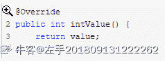
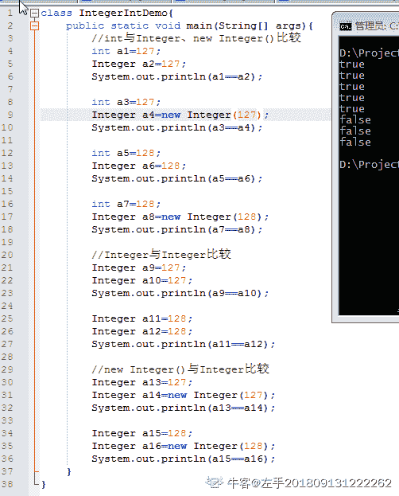
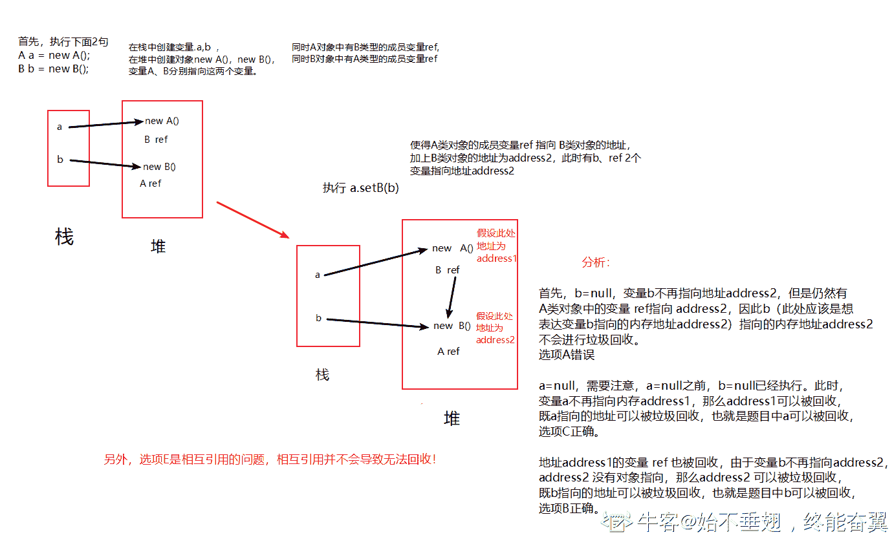
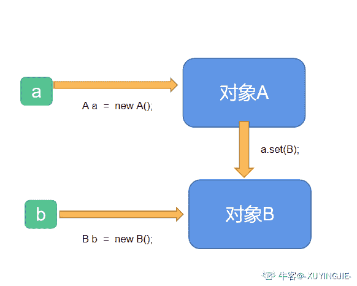
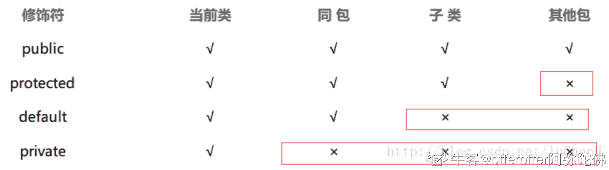
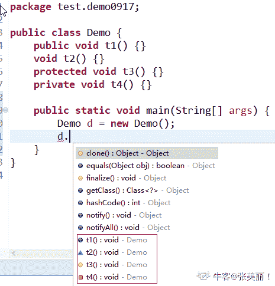
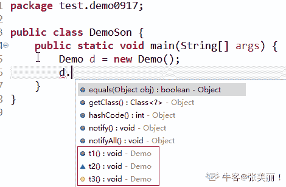
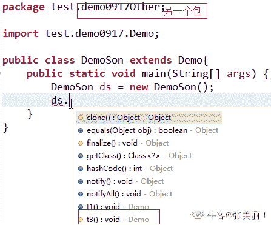

# 用友 2018 秋招 Java 笔试题（五）

## 1

以下哪种 JAVA 得变量声明方式可以避免程序在多线程竞争情况下读到不正确的值(  )

正确答案: A B   你的答案: 空 (错误)

```cpp
volatile
```

```cpp
static volatile
```

```cpp
synchronized
```

```cpp
static
```

本题知识点

Java 工程师 用友 Java 2018

讨论

[拼命也要幸福](https://www.nowcoder.com/profile/171607642)

synchronized 不是修饰变量的 它修饰方法或代码块或对象

发表于 2019-08-24 10:22:21

* * *

[字节国际化内推仔](https://www.nowcoder.com/profile/401183690)

完全没看到题目说的是 变量声明方式，所以想都没想就选择了 synchronized

发表于 2019-10-10 08:55:01

* * *

[wy666666](https://www.nowcoder.com/profile/847254957)

线程安全性比较关键的两个点：内存可见性和操作原子性 如果你不修改值，可以使用 private static final int , final 可以保证内存可见性语义。对于原生变量，final 修饰后不可更改，从而也不存在操作原子性的问题。 如果你只是想单纯地进行赋值，而不进行复合操作，那么可以使用 volatile int. volatile 可以确保内存可见性，但是无法确保原子性，所以不支持复合操作的线程安全性。 如果你想进行复合操作，可以使用 AtomicInteger 这个原子类，支持 CAS 操作，可确保内存可见性和操作原子性。

发表于 2020-02-07 11:42:57

* * *

## 2

以下代码的运行结果是什么(  )

```cpp
class Supper{     
 public int get()    
  {          
System.out.println("Supper");         
 return 5;     
 }    
 }     
public class Sub{     
 public int get()    
 {         
 System.out.println("Sub");        
 return new Integer("5");          }      
 public static void main(String args[]) {          
 new Supper().get();        
   new Sub().get();          }   
  }
```

正确答案: A   你的答案: 空 (错误)

```cpp
Supper Sub
```

```cpp
Supper 5 Sub
```

```cpp
Supper 5 5 Sub
```

```cpp
Supper Sub 5 5
```

本题知识点

Java 工程师 用友 Java 2018

讨论

[kk 白云苍狗](https://www.nowcoder.com/profile/981755873)

newSupper().get()和 newSub().get()只调用了 get()方法，又没有打印输出 get()返回的数值，所以肯定没有 5

发表于 2019-09-05 22:14:51

* * *

[牛客 9172514 号](https://www.nowcoder.com/profile/9172514)

我做了 600 多道题，才遇到这么一个多选题可以选一个选项的（所以虽然觉得 A 之外其他都不对但还是选了一个

发表于 2019-09-08 10:46:34

* * *

[coders_nw](https://www.nowcoder.com/profile/986690268)

自信选 A😂

发表于 2019-12-02 14:21:55

* * *

## 3

以下 JAVA 程序的运行结果是什么(  )

```cpp
public static void main(String[] args) {
    Object o1 = true ? new Integer(1) : new Double(2.0);
    Object o2;
    if (true) {
    o2 = new Integer(1);
    } else {
        o2 = new Double(2.0);
    }
    System.out.print(o1);
    System.out.print(" ");         
    System.out.print(o2);
}
```

正确答案: D   你的答案: 空 (错误)

```cpp
1 1
```

```cpp
1.0 1.0
```

```cpp
1 1.0
```

```cpp
1.0 1
```

本题知识点

Java 工程师 用友 Java 2018

讨论

[abserver](https://www.nowcoder.com/profile/252944924)

答案选 D。三元操作符如果遇到可以转换为数字的类型，会做自动类型提升。比如

```cpp
Object o1 = (false) ? new Double(1.0) : new Integer(2);
System.out.println(o1);

```

会打印 2.0

编辑于 2019-07-07 14:11:52

* * *

[zouxxyy](https://www.nowcoder.com/profile/452736254)

兄弟们，记得住吗？

```cpp
byte b = 1;
char c = 1;
short s = 1;
int i = 1;

// 三目，一边为 byte 另一边为 char，结果为 int
// 其它情况结果为两边中范围大的。适用包装类型
i = true ? b : c; // int
b = true ? b : b; // byte
s = true ? b : s; // short

// 表达式，两边为 byte,short,char，结果为 int 型
// 其它情况结果为两边中范围大的。适用包装类型
i = b + c; // int
i = b + b; // int
i = b + s; // int

// 当 a 为基本数据类型时，a += b，相当于 a = (a) (a + b)
// 当 a 为包装类型时， a += b 就是 a = a + b
b += s; // 没问题
c += i; // 没问题

// 常量任君搞，long 以上不能越
b = (char) 1 + (short) 1 + (int) 1; // 没问题
// i = (long) 1 // 错误
```

编辑于 2020-07-02 23:04:00

* * *

[YL,](https://www.nowcoder.com/profile/826877749)

三元操作符类型的转换规则：
1.若两个操作数不可转换，则不做转换，返回值为 Object 类型
2.若两个操作数是明确类型的表达式（比如变量），则按照正常的二进制数字来转换，int 类型转换为 long 类型，long 类型转换为 float 类型等。
3.若两个操作数中有一个是数字 S,另外一个是表达式，且其类型标示为 T，那么，若数字 S 在 T 的范围内，则转换为 T 类型；若 S 超出了 T 类型的范围，则 T 转换为 S 类型。
4.若两个操作数都是直接量数字，则返回值类型为范围较大者符合 4，所以选 D.

发表于 2019-07-13 19:34:00

* * *

## 4

以下哪种 JAVA 的变量表达式使得变量 a 和变量 b 具有相同的内存引用地址(  )

正确答案: A B   你的答案: 空 (错误)

```cpp
String a = "hello"; String b = "hello";
```

```cpp
Integer a; Integer b = a;
```

```cpp
int a = 1; Integer b = new Integer(1);
```

```cpp
int a = 1; Integer b = 1;
```

本题知识点

Java 工程师 用友 Java 2018

讨论

[不大仙](https://www.nowcoder.com/profile/473254804)

内存引用地址，是指栈中存放的地址，来指向堆中的某个位置。
int 是基本类型，数据直接存放在栈中，不存在内存引用地址的说法
==
A 对  指向常量池里的"hello"。
B 对  题中没说声明的 a 是局部变量。
C 错  int a =1;并不指向堆中，它只有值，没有引用地址，Integer b =new Integer(1);指向堆中地址为 1 的位置。
D 错  原因同 C

编辑于 2019-09-09 14:37:50

* * *

[左手 201809131222262](https://www.nowcoder.com/profile/337184788)

**首先结论：****（1）int 与 Integer、new Integer()进行==比较时，结果永远为 true****（2）Integer 与 new Integer()**进行==**比较时，结果永远为 false****（3）Integer 与 Integer**进行==**比较时，看范围；在大于等于-128 小于等于 127 的范围内为 true，在此范围外为 false。**下面是解析过程：**1**.Integer 与 int 比较时，Integer 会有拆箱的过程，我们可以看看拆箱的代码：直接返回的就是 value，因此 int 与 Integer 以及 new Integer()进行  ==比较时结果都是 true。**2**.Integer a=n 时，如果 n 大于等于-128 小于等于 127 时，会直接从 IntegerCache 中取，不在这个范围内，会 new 一个对象，所以 Integer 与 new Integer 进行 ==比较时，结果都是 false。**3**.Integer 与 Integer 比较，需要看范围，如果在-128~127(包含-128，不包含 127)范围内，因为都是从 IntegerCache 中取值，所以相等；若不在这个范围内，则都要去 new 一个对象，所以结果为 false。**附上计算结果：**
**关于 D 选项，我想单独回答一下：****D 选项我认为是错误的，a==b 结果虽然结果是 true，但是要注意的是，这是一个 int 与 Integer 的比较，Integer 会进行拆箱，拆箱的结果是 int 型的，这就相当于两个 int 型之间的比较，而基本数据类型之间的比较，比较的是*数值*，所以结果是 true，但并不表示两者的内存地址相等。个人看法，如有错误，欢迎指出。**

编辑于 2020-03-16 10:55:48

* * *

[蜡笔没有心](https://www.nowcoder.com/profile/1685418)

基本数据类型，如果声明在方法内，则存储在方法栈中，如果在类内声明，则存储在堆中；如果是引用类型，则声明在方法中时，通过方法栈指向堆，声明在类中时存储在堆中，指向值存储区域

发表于 2020-05-13 18:48:01

* * *

## 5

下面哪些具体实现类可以用于存储键，值对，并且方法调用提供了基本的多线程安全支持：(  )

正确答案: A E   你的答案: 空 (错误)

```cpp
java.util.ConcurrentHashMap
```

```cpp
java.util.Map
```

```cpp
java.util.TreeMap
```

```cpp
java.util.SortMap
```

```cpp
java.util.Hashtable
```

```cpp
java.util.HashMap
```

本题知识点

Java 工程师 用友 Java 2018

讨论

[哥哥 1111111](https://www.nowcoder.com/profile/855980244)

线程安全的类有 hashtable concurrentHashMap synchronizedMap

发表于 2019-09-04 21:21:46

* * *

[OfferOverFlowError](https://www.nowcoder.com/profile/1686028)

java.util.concurrent.ConcurrentHashMap 线程安全 java.util.Map 接口 java.util.TreeMapjava.util.SortedMap 接口 java.util.Hashtable 线程安全
java.util.HashMap

发表于 2019-10-28 19:34:17

* * *

[猫饼饼](https://www.nowcoder.com/profile/929894486)

ConcurrentHashMap 键值对不可以为空，线程安全 java.util.Map 是一个接口 java.util.TreeMap 键值对不可以为空，非线程安全 java.util.SortedMap 这是个接口并且扩展了 Map 接口，它确保条目按升序键维护。 java.util.Hashtable 键值对不可以为空，线程安全 java.util.HashMap 键值对可以为空，非线程安全

发表于 2020-03-11 21:22:13

* * *

## 6

关于下面程序，哪些描述是正确的: (  )

```cpp
 public class While {
    public void loop() {
        int x= 10;
        while ( x )  {
            System.out.print("x minus one is " + (x - 1));
            x -= 1;
        }
    }
}
```

正确答案: B   你的答案: 空 (错误)

```cpp
行 1 有语法错误
```

```cpp
行 4 有语法错误
```

```cpp
行 5 有语法错误
```

```cpp
行 6 有语法错误
```

```cpp
行 2 有语法错误,loop 是关键字
```

```cpp
程序能够正常编译和运行
```

本题知识点

Java 工程师 用友 Java 2018

讨论

[回首](https://www.nowcoder.com/profile/572067)

这个题主要考 while（）中表达式的判断，在 C 语言中大于 0 的 int 值都会被认为是 true，而 java 中没有这个机制，必须是 boolean 类型的。

发表于 2019-11-05 10:25:56

* * *

[IDEA2022.4.2](https://www.nowcoder.com/profile/181223548)

while()括号里参数必须是布尔类型，要么 true 要么 false

编辑于 2020-07-25 07:30:42

* * *

[steve_nashNo1](https://www.nowcoder.com/profile/994963719)

loop 不是 java 的关键字问题出在 wile( boolean )  x 是一个 int 形的变量 不是 Boolean 值 所有编译不通过

发表于 2019-08-13 19:43:25

* * *

## 7

根据下面这个程序的内容，判断哪些描述是正确的：（ ）

```cpp
public class Test {
    public static void main(String args[]) {
        String s = "tommy";
        Object o = s;
        sayHello(o); //语句 1
        sayHello(s); //语句 2
    }
    public static void sayHello(String to) {
        System.out.println(String.format("Hello, %s", to));
    }
    public static void sayHello(Object to) {
        System.out.println(String.format("Welcome, %s", to));
    }
}
```

正确答案: C D   你的答案: 空 (错误)

```cpp
这段程序有编译错误
```

```cpp
语句 1 输出为:Hello, tommy
```

```cpp
语句 2 输出为:Hello, tommy
```

```cpp
语句 1 输出为:Welcome, tommy
```

```cpp
语句 2 输出为:Welcome, tommy
```

```cpp
根据选用的 Java 编译器不同，这段程序的输出可能不同
```

本题知识点

Java 工程师 用友 Java 2018

讨论

[weifei0506](https://www.nowcoder.com/profile/184088105)

Java 语言是静态多分派，动态单分派的。如果是重载方法之间的选择，则是使用静态类型。如果是父类与子类之间的重写方法的选择，则是使用动态类型。如 A a = new B(); 会使用类型 B 去查找重写的方法，使用类型 A 去查找重载的方法。所以此题的输出分别为

```cpp
Welcome, tommy
Hello, tommy
```

发表于 2020-07-06 16:32:17

* * *

[韩兴 zZ](https://www.nowcoder.com/profile/8522942)

没意思没意思  上边是 s o 顺序  调用方法就变成 o s 了   真的没意思

发表于 2019-09-16 18:48:02

* * *

[无心 z](https://www.nowcoder.com/profile/9463107)

单纯从函数的重载来看这个题没什么好说的，但是 Object 和 String 存在继承关系，所以这题就考的就是关于函数重载可能出现的二义性：编译器不知道选择哪一个函数。因为无论是 s 还是 o 都可以选择 public static void sayHello(Object to)。

如果代码出现了这种可能出现二义性的代码，编译器就会去寻找最适配的选项进行执行，所以 s 会选择 public static void sayHello(String to),因为 s 选择这一个方法可以不经过任何的隐式转化，所以在这里选择这一个方法最适配。

编辑于 2020-04-04 14:55:54

* * *

## 8

下面哪些描述是正确的：（  ）

```cpp
public class Test {
    public static class A {
        private B ref;
        public void setB(B b) {
            ref = b;
        }
    }
    public static Class B {
        private A ref;
        public void setA(A a) {
            ref = a;
        }
    }
    public static void main(String args[]) {
    …
        start();
    ….
    }
    public static void start() { A a = new A();
        B b = new B();
        a.setB(b);
        b = null; //
        a = null;
    …
    }
} 
```

正确答案: B C   你的答案: 空 (错误)

```cpp
b = null 执行后 b 可以被垃圾回收
```

```cpp
a = null 执行后 b 可以被垃圾回收
```

```cpp
a = null 执行后 a 可以被垃圾回收
```

```cpp
a,b 必须在整个程序结束后才能被垃圾回收
```

```cpp
类 A 和类 B 在设计上有循环引用，会导致内存泄露
```

```cpp
a, b 必须在 start 方法执行完毕才能被垃圾回收
```

本题知识点

Java 工程师 用友 Java 2018

讨论

[ThinkingOverflow](https://www.nowcoder.com/profile/165701207)



发表于 2020-04-08 16:56:33

* * *

[人余月半子](https://www.nowcoder.com/profile/514787832)

b = null 时，B 对象还被 A 对象引用着，不能别回收。a  = null 时，b 在之前已经为空，A 对象可以被回收，此时，B 对象不被引用了也可以被回收了

发表于 2020-03-09 13:24:50

* * *

[abserver](https://www.nowcoder.com/profile/252944924)

答案 BC。内存如下：a -> "a(b)"
b -> "b"a 引用指向一块空间，这块空间里面包含着 b 对象 b 引用指向一块空间，这块空间是 b 对象 A 选项，b = null 执行后 b 可以被垃圾回收。这里"b 可以被垃圾回收"中的 b 指的是引用 b 指向的内存。这块内存即使不被引用 b 指向，还是被引用 a 指向着，不会被回收。
B 选项，a = null 执行后 b 可以被垃圾回收。从代码中可以看到，a = null 是在 b = null 后执行的，该行执行后，引用 a 和 b 都没有指向对象，对象会被回收。C 选项，同理。

发表于 2019-07-07 14:34:34

* * *

## 9

关于下面这段 Java 程序，哪些描述是正确的：（ ）

```cpp
public class ThreadTest extends Thread {
    public void run() {
        System.out.println("In run");
        yield();
        System.out.println("Leaving run");
    }
    public static void main(String []argv) {
        (new ThreadTest()).start();
    }
}
```

正确答案: C   你的答案: 空 (错误)

```cpp
程序运行输出只有 In run
```

```cpp
程序运行输出只有 Leaving run
```

```cpp
程序运行输出先有 In run 后有 Leaving run
```

```cpp
程序运行输出先有 Leaving run 后有 In run
```

```cpp
程序没有任何输出就退出了
```

```cpp
程序将被挂起，只能强制退出
```

本题知识点

Java 工程师 用友 Java 2018

讨论

[IDEA2022.4.2](https://www.nowcoder.com/profile/181223548)

我来看看有多少人被不定项选择给迷惑了

发表于 2019-09-19 08:29:56

* * *

[kenyon](https://www.nowcoder.com/profile/9309962)

Thread.yield()方法作用是：暂停当前正在执行的线程对象，并执行其他线程。

yield()应该做的是让当前运行线程回到可运行状态，以允许具有相同优先级的其他线程获得运行机会。因此，使用 yield()的目的是让相同优先级的线程之间能适当的轮转执行。但是，实际中无法保证 yield()达到让步目的，因为让步的线程还有可能被[线程调度](https://www.baidu.com/s?wd=%E7%BA%BF%E7%A8%8B%E8%B0%83%E5%BA%A6&tn=SE_PcZhidaonwhc_ngpagmjz&rsv_dl=gh_pc_zhidao)程序再次选中。

结论：yield()从未导致线程转到等待/睡眠/阻塞状态。在大多数情况下，yield()将导致线程从运行状态转到可运行状态，但有可能没有效果。

发表于 2019-06-12 22:30:29

* * *

[加油，蜕变，幸福](https://www.nowcoder.com/profile/934837461)

yield 是线程礼让， 没有多个线程，不需要礼让

发表于 2019-11-14 15:14:25

* * *

## 10

在 HTTP 请求响应 header 中，以下哪些状态码表示请求失败(  )

正确答案: B C D   你的答案: 空 (错误)

```cpp
200
```

```cpp
500
```

```cpp
502
```

```cpp
404
```

本题知识点

Java 工程师 用友 网络基础 2018

讨论

[给我感谢信吧](https://www.nowcoder.com/profile/520290006)

HTTP 请求状态码：

*   200：请求被正常处理
*   204：请求被受理但没有资源可以返回
*   206：客户端只是请求资源的一部分，服务器只对请求的部分资源执行 GET 方法，相应报文中通过 Content-Range 指定范围的资源。
*   301：永久性重定向
*   302：临时重定向
*   303：与 302 状态码有相似功能，只是它希望客户端在请求一个 URI 的时候，能通过 GET 方法重定向到另一个 URI 上
*   304：发送附带条件的请求时，条件不满足时返回，与重定向无关
*   307：临时重定向，与 302 类似，只是强制要求使用 POST 方法
*   400：请求报文语法有误，服务器无法识别
*   401：请求需要认证
*   403：请求的对应资源禁止被访问
*   404：服务器无法找到对应资源
*   500：服务器内部错误
*   502：服务器挂了

*   503：服务器正忙

编辑于 2019-08-01 09:35:29

* * *

[牛客 787596094 号](https://www.nowcoder.com/profile/787596094)

BCD

发表于 2021-03-17 09:42:11

* * *

## 11

64 位操作系统理论上最多可以管理 1GB 内存。

你的答案 (错误)

1 参考答案 (1) 17179869184

本题知识点

Java 工程师 用友 操作系统 2018

讨论

[🐯201905251557370](https://www.nowcoder.com/profile/273109574)

理论上的寻址空间为 2 的 64 次方 bit,换算大概 171 亿 GB。

发表于 2019-08-27 15:09:31

* * *

[vccorz](https://www.nowcoder.com/profile/7445036)

我 tm 从计算器上复制的：17,179,869,184 结果错了。淦

发表于 2022-01-27 01:41:16

* * *

## 12

一个台阶总共有 10 级，如果一次可以跳 1 级，也可以跳 2 级。求总共有 1 总跳法？

你的答案 (错误)

1 参考答案 (1) 55

本题知识点

Java 工程师 用友 智力题 数学运算 2018

讨论

[微雪的早晨](https://www.nowcoder.com/profile/751943486)

只有 1 级台阶，1 个 1 步，则有 1 种；只有 2 级台阶，2 个 1 步，1 个 2 步，则有 2 种；有 10 级台阶，10 个 1 步，0 个 2 步，1 种；8 个 1 步，1 个 2 步，C（1，9）=9 种；6 个 1 步，2 个 2 步，C（2，8）=28 种；4 个 1 步，3 个 2 步，C（3，7）=35 种；2 个 1 步，4 个 2 步，C（4，6）=15 种；0 个 1 步，5 个 2 步，C（5，5）=1 种。

发表于 2019-06-04 18:11:00

* * *

[_ooops_](https://www.nowcoder.com/profile/756272361)

```cpp
其实就是在问第 10 个斐波那契数是多少
那么显而易见，第 10 个数字是 55
```

发表于 2020-01-27 13:35:50

* * *

[音乐有了差一个你](https://www.nowcoder.com/profile/4818746)

感觉是题目没表达清楚，如果人站在地平线上，则是 89，如果站在第一级楼梯，则后面再走 9 级，则是 55

编辑于 2019-06-25 09:37:57

* * *

## 13

SQL92 标准定义的最严格的事务级别是？1

你的答案 (错误)

1 参考答案 (1) Serializable (顺序执行)

本题知识点

Java 工程师 用友 数据库 2018

讨论

[bilibili~chan](https://www.nowcoder.com/profile/9315682)

回答可串行化也是正确的

发表于 2019-07-13 13:05:04

* * *

[月灯 uuu](https://www.nowcoder.com/profile/395308697)

Serializable

编辑于 2021-03-16 11:05:48

* * *

[拼命也要幸福](https://www.nowcoder.com/profile/171607642)

为了保证线程安全，这是数据库隔离级别中最高的

发表于 2020-02-10 00:24:00

* * *

## 14

Java 中如果一个 public 类的 protected 方法的可见性是 1

你的答案 (错误)

1 参考答案 (1) 声明该方法的类及其子类都可以访问该方法

本题知识点

Java 工程师 用友 Java 2018

讨论

[你的 offer 对我打了烊](https://www.nowcoder.com/profile/598309941)



发表于 2020-03-04 14:18:06

* * *

[张美丽！](https://www.nowcoder.com/profile/3467416)

 protected 修饰的方法的可见性：①在本类中②在同一个包下，可访问到 protected 修饰的方法 ③作为子类，可以访问到父类里 protected 修饰的方法-----------------------------------同时也说下其他方法，做个比较：public 方法：类内、本包、子类、包外皆可访问到。protected 方法：类内、本包、子类。default 方法（不加修饰）：类内、本包。private 方法：类内。

发表于 2019-09-17 16:53:51

* * *

[NoOfferException](https://www.nowcoder.com/profile/1554976)

还可以被所在包其他类访问

发表于 2019-09-17 12:34:30

* * *

## 15

JSON 是一种非常流行的文本格式的数据编码方式，下面有一个 Java 类 Person   

```cpp
public class Person { private String name; private int age;     private boolean married;  public Person(String name, int age, boolean married) { this.name = name; this.age = age; this.married = married; } public String getName() { return name; } public void setName(String n) { this.name = n;     }  public void setAge(int a) { this.age = a;     }  public int getAge() { return age;     }  public void setMarried(boolean flag) { this.married = flag;     }  public isMarried() { return married; } }
```

  把下面这个对象 ps
Person[] ps = new Person[] {new Person(“tommy”, 16, false”)}

用 JSON 表式出来（JSON 种不用表示类型信息，只表示结构信息即可） 

你的答案

本题知识点

Java 工程师 用友 2018

讨论

[MuceBall](https://www.nowcoder.com/profile/904572947)

```cpp
[
    {
       "name":"tommy",
        "age":16,
        "married":false   
    }
]
```

发表于 2019-07-24 21:36:11

* * *

## 16

SQL 性能优化
Customer 表定义如下
CREATE TABLE `test01` (
    custid` int(10) NOT NULL,
    custname` varchar(100) NOT NULL,
    date` datetime default NULL,
    money` int(10) default NULL,
    PRIMARY KEY  (`custid`),
    KEY `index_test01_custname` (`custname`),
    KEY `index_test01_custname_union` (`money`,` date`,`custname`,),
)
secondinfo 表定义如下
CREATE TABLE `test02` (
  secid` int(10) NOT NULL,
  firstid` int(10) NOT NULL,
  custid` int(10) default NULL,
  PRIMARY KEY (`secid`),
  KEY `Index_test02_custid` (`custid `)
)
下列 SQL 执行速度比较慢，请分析原因并做优化：1)    SELECT  *  FROM  test01  WHERE  substring(custname,1,4)='beizhi';2)    SELECT  *  FROM  test01  WHERE  money/30<1000; 3)    SELECT  *  FROM  test01  WHERE  custname=3721; 
4)    SELECT * FROM test02 s WHERE s.custid NOT IN (SELECT c.custid FROM test01 c);
5)    select * from test01 where money<1000
union
select * from test01 where date >’20150101’;

你的答案

本题知识点

Java 工程师 用友 2018

讨论

[地久天长](https://www.nowcoder.com/profile/574216735)

1. SELECT  *  FROM  test01  WHERE  substring(custname,1,4)='beizhi'; //where 后使用函数会导致索引失效 改为： SELECT  *  FROM  test01  WHERE  custname like ‘beizhi%';2. SELECT  *  FROM  test01  WHERE  money/30<1000; //应把左边运算放到右边改为：SELECT  *  FROM  test01  WHERE  money<1000*30; 3.SELECT  *  FROM  test01  WHERE  custname=3721; //语法错误改为：SELECT  *  FROM  test01  WHERE  custname=’3721‘;4. SELECT * FROM test02 s WHERE s.custid NOT IN (SELECT c.custid FROM test01 c);//not in  使用也会导致索引失效改为：select * fron test02 a left join test01 b on a.custid=b.custid where b.custid=null5.应改为：select * from test01 where money<1000 and  date >’20150101’

发表于 2019-06-13 00:19:13

* * *

[郫县男子计院](https://www.nowcoder.com/profile/328790495)

先用程序把数据处理好再来更新数据库不好吗

发表于 2020-02-27 16:31:19

* * *