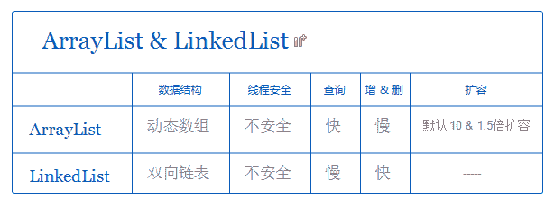

# 用友 2018 秋招 Java 笔试题（六）

## 1

在 java 中重写方法应遵循规则的包括（）

正确答案: B C   你的答案: 空 (错误)

```cpp
访问修饰符的限制一定要大于被重写方法的访问修饰符
```

```cpp
可以有不同的访问修饰符
```

```cpp
参数列表必须完全与被重写的方法相同
```

```cpp
必须具有不同的参数列表
```

本题知识点

Java 工程师 用友 Java 2018

讨论

[人余月半子](https://www.nowcoder.com/profile/514787832)

两同两小一大原则：

1.  两同：方法名和参数列表相同
2.  两小：返回值或声明异常比父类小（或相同）   
3.  一大：访问修饰符比父类的大（或相同）

发表于 2019-10-20 12:58:08

* * *

[锌镉熔融](https://www.nowcoder.com/profile/992762161)

**方法重写**

*   参数列表必须完全与被重写方法的相同；
*   返回类型必须完全与被重写方法的返回类型相同；
*   访问权限不能比父类中被重写的方法的访问权限更低。例如：如果父类的一个方法被声明为 public，那么在子类中重写该方法就不能声明为 protected。
*   父类的成员方法只能被它的子类重写。
*   声明为 final 的方法不能被重写。
*   声明为 static 的方法不能被重写，但是能够被再次声明。
*   子类和父类在同一个包中，那么子类可以重写父类所有方法，除了声明为 private 和 final 的方法。
*   子类和父类不在同一个包中，那么子类只能够重写父类的声明为 public 和 protected 的非 final 方法。
*   重写的方法能够抛出任何非强制异常，无论被重写的方法是否抛出异常。但是，重写的方法不能抛出新的强制性异常，或者比被重写方法声明的更广泛的强制性异常，反之则可以。
*   构造方法不能被重写。
*   如果不能继承一个方法，则不能重写这个方法。

**方法重载**
 ***   被重载的方法必须改变参数列表(参数个数或类型或顺序不一样)；
*   被重载的方法可以改变返回类型；
*   被重载的方法可以改变访问修饰符；
*   被重载的方法可以声明新的或更广的检查异常；
*   方法能够在同一个类中或者在一个子类中被重载。
*   无法以返回值类型作为重载函数的区分标准。** 

发表于 2019-05-29 23:03:46

* * *

[慢冷呀](https://www.nowcoder.com/profile/51096468)

```cpp
方法重写要注意的事项：
    1.方法重写时， 方法名与形参列表必须一致。
    2.方法重写时，子类的权限修饰符必须要大于或者等于父类的权限修饰符。
    3.方法重写时，子类的返回值类型必须要小于或者等于父类的返回值类型。
    4.方法重写时， 子类抛出的异常类型要小于或者等于父类抛出的异常类型。
            Exception(大)
            RuntimeException(小)

```

发表于 2019-07-25 01:03:16

* * *

## 2

有订单表 orders，包含字段用户信息 userid，字段产品信息 productid，以下语句能够返回至少被订购过两次的 productid？（）

正确答案: D   你的答案: 空 (错误)

```cpp
select productid from orders where count（productid）>1
```

```cpp
select productid from orders where max（productid）>1
```

```cpp
select productid from orders where having count（productid）>1 group by productid
```

```cpp
select productid from orders group by productid having count（productid）>1
```

本题知识点

Java 工程师 用友 数据库 SQL 2018

讨论

[牛妹](https://www.nowcoder.com/profile/826546)

难度：2

答案:D

  查看全部)

编辑于 2021-08-30 19:59:11

* * *

[老木头人](https://www.nowcoder.com/profile/433148040)

where 不可以直接连接聚合函数

发表于 2020-02-26 12:42:45

* * *

[牛客 403422741 号](https://www.nowcoder.com/profile/403422741)

使用 having 语句是因为 where 无法与计算函数连用

发表于 2020-03-10 18:59:18

* * *

## 3

Java 中的集合类包括 ArrayList 、 LinkedList 、 HashMap 等，下列关于集合类描述正确的是？（）

正确答案: A B D   你的答案: 空 (错误)

```cpp
ArrayList 和 LinkedList 均实现了 List 接口
```

```cpp
ArrayList 访问速度比 LinkedList 快
```

```cpp
随机添加和删除元素时，ArrayList 的表现更加快速
```

```cpp
HashMap 实现 Map 接口，它允许任何类型的键和值对象，并允许将 NULL 用作键或值
```

本题知识点

Java 工程师 用友 Java 2018

讨论

[申田曰](https://www.nowcoder.com/profile/71701109)

**A、HashMap 实现了 Map 接口的，它的 Key 和 Value 都可以是 null，但是 Hashtable 种，Key 和 Value 都不能是 null。****B、ArrayList 与 LinkedList 都实现了 List 接口，继承了 AbstractList 类。****C、ArrayList 底层是动态数组是实现，随机位置添加和删除，都需要移动数组的数据，而 LinkedList 底层是双向链表，只需要修改 Node 节点的引用。****D、随机访问数组要比链表块。****下面放一张 ArrayList 和 LinkedList 的区别表：**

发表于 2020-06-15 23:19:00

* * *

[秋风萧瑟，忆往昔](https://www.nowcoder.com/profile/6481904)

我咋记得基础类型不能当做 hashmap 的 key 和 value?

发表于 2019-08-02 18:20:27

* * *

[ThinkingOverflow](https://www.nowcoder.com/profile/165701207)

关于 D：首先，说一下 HashMap 与 Hashtable

1）HashMap 不能保证元素的顺序，HashMap 能够将键设为 null，也可以将值设为 null。但是，HashMap 中只能有一个键作为 null，但是可以有多个 value 为 null；

2）与之对应的是 Hashtable,(注意大小写：不是 HashTable)，Hashtable 不能将键和值设为 null，否则运行时会报空指针异常错误；

3）HashMap 线程不安全，Hashtable 线程安全；

    其次，HashMap 中是不允许使用基本数据类型作为 key 与 value 的，其实和 HashMap 底层的存储原理有关，HashMap 存储数据的特点是：无序、无索引、不能存储重复元素。    存储元素采用的是 hash 表存储数据，每存储一个对象的时候，都会调用其 hashCode()方法，算出其 hash 值，如果相同，则认为是相同的数据，直接不存储，如果 hash 值不同，则再调用其 equals 方法进行比较，如果返回 true，则认为是相同的对象，不存储，如果返回 false，则认为是不同的对象，可以存储到 HashMap 集合中。    对于 HashMap，首先会判断其 key 与 HashMap 中存储的元素是否相同，不同再判断 value 是否相同，2 个都不相同就会认为这个键值对在 HashMap 中不存在，将其放入。

    之所以 key 与 value 不能为基本数据类型，则是因为基本数据类型不能调用其 hashcode()方法和 equals()方法，进行比较，所以 HashMap 集合的 key 与 value 只能为引用数据类型，不能为基本数据类型，可以使用基本数据类型的包装类，例如 Integer Double 等。

发表于 2020-04-20 02:57:16

* * *

## 4

将一组无序的正整数重新排列成有序序列,其方法有()

正确答案: B C D   你的答案: 空 (错误)

```cpp
拓扑排序
```

```cpp
快速排序
```

```cpp
堆排序
```

```cpp
基数排序
```

本题知识点

Java 工程师 用友 排序 *2018* *讨论

[追风筝的人哈桑](https://www.nowcoder.com/profile/478417353)

由某个集合上的一个偏序得到该集合上的一个全序，这个操作称之为拓扑排序。其它三个都是可以对无序的正整数排序。

发表于 2019-07-11 10:41:35

* * *

[不做人了](https://www.nowcoder.com/profile/250145)

拓扑排序 和图有关 图不是集合

发表于 2020-05-04 12:17:52

* * *

## 5

Java1.8 版本之前的前提，Java 特性中,abstract class 和 interface 有什么区别（）

正确答案: A B D   你的答案: 空 (错误)

```cpp
抽象类可以有构造方法，接口中不能有构造方法
```

```cpp
抽象类中可以有普通成员变量，接口中没有普通成员变量
```

```cpp
抽象类中不可以包含静态方法，接口中可以包含静态方法
```

```cpp
一个类可以实现多个接口，但只能继承一个抽象类。
```

本题知识点

Java 工程师 用友 Java 2018

讨论

[HelloBikeHarrison](https://www.nowcoder.com/profile/798947849)

A B D 显然都是对的。主要说 C 选项：在 JDK1.8 之前的版本（不包括 JDK1.8），接口中不能有静态方法，抽象类中因为有普通方法，故也可以有静态方法。在 JDK1.8 后（包括 JDK1.8），在抽象类中依旧可以有静态方法，同时在接口中也可以定义静态方法了。以下代码在 JDK1.8 之后是没有问题的（可以通过接口名来调用静态方法  ：Main.prinf(); ）：

```cpp
public interface Demo{
    public static void print() {  System.out.println("Hello World!");  }
}

```

PS：在 JDK1.7，接口中只包含抽象方法，使用 public abstract  修饰。

```cpp
public interface Demo{
    public abstract void method();
}
```

在 JDK1.8，接口中新加了默认方法和静态方法：        默认方法：使用 default 修饰，在接口的实现类中，可以直接调用该方法，也可以重写该方法。        静态方法：使用 static 修饰，通过接口直接调用。

```cpp
public interface Demo{
    //默认方法
    public default void method(){
        System.out.println("default method...");
    }

    //静态方法
    public static void print(){
        System.out.println("static method...");
    }
}
```

在 JDK1.9，接口中新加了私有方法，使用 private 修饰，私有方法供接口内的默认方法调用。

```cpp
public interface Demo{
    private void method() {
        System.out.println("Hello World!");
    }
} 
```

编辑于 2021-04-01 16:00:50

* * *

[人余月半子](https://www.nowcoder.com/profile/514787832)

接口和抽象类的区别：
1.接口的方法默认为 public abstract ,接口中的变量默认为 public static final，在 java8 之前所有的方法不能有实现
抽象类中可以有非抽象方法
2.一个类可以实现多个接口，但只能继承一个抽象类
3.一个类实现接口，要实现该接口的所有抽象方法。
4.接口不能被实例化，但可以声明，但是必须引用一个实现该接口的对象。
抽象类可以有构造方法，但是不能被直接通过 new 进行实例化。但可以通过子类继承，实例化子类的时候抽象类也会被实例化。
这其实用到了多态，向上转型。父类引用指向子类对象。
5.从设计层面来说，抽象类是对类的抽象，是一种模板设计，接口是行为的抽象，是一种行为的规范。

发表于 2019-10-19 18:08:34

* * *

[姚博 vinson](https://www.nowcoder.com/profile/2577961)


版权声明：本文为 CSDN 博主「鹿与森呀」的原创文章，遵循 CC 4.0 BY-SA 版权协议，转载请附上原文出处链接及本声明。
原文链接：[`blog.csdn.net/weixin_38207722/article/details/96422920`](https://blog.csdn.net/weixin_38207722/article/details/96422920)

发表于 2020-01-22 20:34:40

* * *

## 6

下面描述中正确的为（）

正确答案: C D   你的答案: 空 (错误)

```cpp
线性表的逻辑顺序与物理顺序总是一致的。
```

```cpp
线性表的顺序存储表示优于链式存储表示。
```

```cpp
线性表若采用链式存储表示时所有结点之间的存储单元地址可连续可不连续。
```

```cpp
二维数组是其数组元素为线性表的线性表。
```

本题知识点

Java 工程师 用友 链表 *2018* *讨论

[offer 拿到手抽筋](https://www.nowcoder.com/profile/366691672)

A 线性表有两种存储方式，一种是顺序表一种是链式表，只有用顺序表时，逻辑顺序才和物理顺序一致 B 顺序存储在内存中是连续的，缺点插入较慢，不可扩容。链式存储并不是连续的，但是因为指向所以占用内存较大。没有特定比较，很难说谁更好

发表于 2019-06-18 19:56:20

* * *

[beef_potato](https://www.nowcoder.com/profile/741313368)

A    链表存储的逻辑顺序不一定与物理顺序一致。

发表于 2019-06-08 23:20:01

* * *

[青年阿兵](https://www.nowcoder.com/profile/6605864)

D 答案应该错误吧，文字游戏：二维数组相当于元素是线性表的线性表，所以其元素是线性表

发表于 2019-06-12 11:27:08

* * *

## 7

下面哪些是对非称加密算法（）

正确答案: C D   你的答案: 空 (错误)

```cpp
DES
```

```cpp
AES
```

```cpp
DSA
```

```cpp
RSA
```

本题知识点

加密和安全

讨论

[有劲？](https://www.nowcoder.com/profile/953391971)

es 对称 sa 非对称

发表于 2019-06-12 09:29:27

* * *

[我的天鸭](https://www.nowcoder.com/profile/243498)

研表究明，汉字的序顺并不能影阅响读题目。

发表于 2019-09-05 15:35:26

* * *

[不屈洋哥](https://www.nowcoder.com/profile/2714875)

常见的加密[算法](http://lib.csdn.net/base/31)可以分成三类，对称加密算法，非对称加密算法和 Hash 算法。

对称加密

    指加密和解密使用相同密钥的加密算法。对称加密算法的优点在于加解密的高速度和使用长密钥时的难破解性。

常见的对称加密算法：DES、3DES、DESX、Blowfish、IDEA、RC4、RC5、RC6 和 AES

非对称加密

    指加密和解密使用不同密钥的加密算法，也称为公私钥加密。

常见的非对称加密算法：RSA、ECC（移动设备用）、Diffie-Hellman、El Gamal、DSA（数字签名用）

Hash 算法

    Hash 算法特别的地方在于它是一种单向算法，用户可以通过 Hash 算法对目标信息生成一段特定长度的唯一的 Hash 值，却不能通过这个 Hash 值重新获得目标信息。因此 Hash 算法常用在不可还原的密码存储、信息完整性校验等。

常见的 Hash 算法：MD2、MD4、MD5、HAVAL、SHA、SHA-1、HMAC、HMAC-MD5、HMAC-SHA1

发表于 2021-05-14 10:45:08

* * *

## 8

关于数据结构，下面叙述中正确的是（）

正确答案: B D   你的答案: 空 (错误)

```cpp
直接选择排序是一种稳定的排序方法
```

```cpp
哈弗曼树带权路径长度最短的树，路径上权值较大的结点离根较近
```

```cpp
拓扑排序是指结点值得有序排序
```

```cpp
当从一个最小堆中删除一个元素时，需要把堆尾元素填补到堆顶位置，然后再按条件把它逐层向下调整到合适位置
```

本题知识点

Java 工程师 用友 树 排序 *2018* *讨论

[Mgfxl](https://www.nowcoder.com/profile/323621520)

(1)冒泡排序冒泡排序就是把小的元素往前调或者把大的元素往后调。比较是相邻的两个元素比较，交换也发生在这两个元素之间。所以，如果两个元素相等，我想你是不会再无聊地把他们俩交换一下的；如果两个相等的元素没有相邻，那么即使通过前面的两两交换把两个相邻起来，这时候也不会交换，所以相同元素的前后顺序并没有改 变，所以冒泡排序是一种稳定排序算法。(2)选择排序选择排序是给每个位置选择当前元素最小的，比如给第一个位置选择最小的，在剩余元素里面给第二个元素选择第二小的，依次类推，直到第 n-1 个元素，第 n 个 元素不用选择了，因为只剩下它一个最大的元素了。那么，在一趟选择，如果当前元素比一个元素小，而该小的元素又出现在一个和当前元素相等的元素后面，那么 交换后稳定性就被破坏了。比较拗口，举个例子，序列 5 8 5 2 9， 我们知道第一遍选择第 1 个元素 5 会和 2 交换，那么原序列中 2 个 5 的相对前后顺序就被破坏了，所以选择排序不是一个稳定的排序算法。(3)插入排序插入排序是在一个已经有序的小序列的基础上，一次插入一个元素。当然，刚开始这个有序的小序列只有 1 个元素，就是第一个元素。比较是从有序序列的末尾开 始，也就是想要插入的元素和已经有序的最大者开始比起，如果比它大则直接插入在其后面，否则一直往前找直到找到它该插入的位置。如果碰见一个和插入元素相 等的，那么插入元素把***的元素放在相等元素的后面。所以，相等元素的前后顺序没有改变，从原无序序列出去的顺序就是排好序后的顺序，所以插入排序是稳 定的。(4)快速排序快速排序有两个方向，左边的 i 下标一直往右走，当 a[i] <= a[center_index]，其中 center_index 是中枢元素的数组下标，一般取为数组第 0 个元素。而右边的 j 下标一直往左走，当 a[j] > a[center_index]。如果 i 和 j 都走不动了，i <= j, 交换 a[i]和 a[j],重复上面的过程，直到 i>j。 交换 a[j]和 a[center_index]，完成一趟快速排序。在中枢元素和 a[j]交换的时候，很有可能把前面的元素的稳定性打乱，比如序列为 5 3 3 4 3 8 9 10 11， 现在中枢元素 5 和 3(第 5 个元素，下标从 1 开始计)交换就会把元素 3 的稳定性打乱，所以快速排序是一个不稳定的排序算法，不稳定发生在中枢元素和 a[j] 交换的时刻。(5)归并排序归并排序是把序列递归地分成短序列，递归出口是短序列只有 1 个元素(认为直接有序)或者 2 个序列(1 次比较和交换),然后把各个有序的段序列合并成一个有 序的长序列，不断合并直到原序列全部排好序。可以发现，在 1 个或 2 个元素时，1 个元素不会交换，2 个元素如果大小相等也没有人故意交换，这不会破坏稳定 性。那么，在短的有序序列合并的过程中，稳定是否受到破坏？没有，合并过程中我们可以保证如果两个当前元素相等时，我们把处在前面的序列的元素保存在结 果序列的前面，这样就保证了稳定性。所以，归并排序也是稳定的排序算法。(6)基数排序基数排序是按照低位先排序，然后收集；再按照高位排序，然后再收集；依次类推，直到最高位。有时候有些属性是有优先级顺序的，先按低优先级排序，再按高优 先级排序，最后的次序就是高优先级高的在前，高优先级相同的低优先级高的在前。基数排序基于分别排序，分别收集，所以其是稳定的排序算法。(7)希尔排序(shell)希尔排序是按照不同步长对元素进行插入排序，当刚开始元素很无序的时候，步长最大，所以插入排序的元素个数很少，速度很快；当元素基本有序了，步长很小， 插入排序对于有序的序列效率很高。所以，希尔排序的时间复杂度会比 o(n²)好一些。由于多次插入排序，我们知道一次插入排序是稳定的，不会改变相同元 素的相对顺序，但在不同的插入排序过程中，相同的元素可能在各自的插入排序中移动，最后其稳定性就会被打乱，所以 shell 排序是不稳定的。(8)堆排序我们知道堆的结构是节点 i 的孩子为 2*i 和 2*i+1 节点，大顶堆要求父节点大于等于其 2 个子节点，小顶堆要求父节点小于等于其 2 个子节点。在一个长为 n 的序列，堆排序的过程是从第 n/2 开始和其子节点共 3 个值选择最大(大顶堆)或者最小(小顶堆),这 3 个元素之间的选择当然不会破坏稳定性。但当为 n /2-1, n/2-2, ...1 这些个父节点选择元素时，就会破坏稳定性。有可能第 n/2 个父节点交换把后面一个元素交换过去了，而第 n/2-1 个父节点把后面一个相同的元素没 有交换，那么这 2 个相同的元素之间的稳定性就被破坏了。所以，堆排序不是稳定的排序算法。综上，得出结论: 选择排序、快速排序、希尔排序、堆排序不是稳定的排序算法，而冒泡排序、插入排序、归并排序和基数排序是稳定的排序算法。

发表于 2019-06-08 13:54:28

* * *

[你的 offer 对我打了烊](https://www.nowcoder.com/profile/598309941)

不稳定的排序：快 些 选 堆（快速排序，希尔排序，选择排序，堆排序）

发表于 2020-02-27 21:37:39

* * *

[Michael264](https://www.nowcoder.com/profile/54836329)

拓扑排序是结点的逻辑排序。

发表于 2019-08-16 22:26:06

* * *

## 9

（）完成对数据库数据的建表与更新

正确答案: B C   你的答案: 空 (错误)

```cpp
DCL
```

```cpp
DDL
```

```cpp
DML
```

```cpp
DQL
```

本题知识点

Java 工程师 用友 数据库 2018 C++工程师 牛客

讨论

[Wizey](https://www.nowcoder.com/profile/4571996)

DML（data manipulation language），数据操作语言，如增删该查 DDL（data definition language），数据定义语言，如建表删表，修改表字段（改变表结构）DCL（data control language），数据控制语言，如权限授权

发表于 2019-06-08 08:26:42

* * *

[等等周星星](https://www.nowcoder.com/profile/4590879)

DML（data manipulation language），数据操作语言，如增删该查 DDL（data definition language），数据定义语言，如建表删表，修改表字段（改变表结构）DCL（data control language），数据控制语言，如权限授权 DQL（data query language），数据查询语言

发表于 2019-08-30 09:17:33

* * *

[YuuLi](https://www.nowcoder.com/profile/6163632)

DDL

发表于 2019-06-11 13:34:37

* * *

## 10

关于以下代码的说明，正确的是（  ）

```cpp
 class StaticStuff{
     static int x=10;
     static { 
            x+=5;
        }
     public static void main（String args[ ]）{
         System.out.println(“x=” + x);
     }
     static { x/=3;}
 }
```

正确答案: C   你的答案: 空 (错误)

```cpp
3 行与 9 行不能通过编译，因为缺少方法名和返回类型
```

```cpp
9 行不能通过编译，因为只能有一个静态初始化器
```

```cpp
编译通过，执行结果为：x=5
```

```cpp
编译通过，执行结果为：x=3
```

本题知识点

Java 工程师 用友 Java 2018

讨论

[abserver](https://www.nowcoder.com/profile/252944924)

先执行：

```cpp
static int x = 10；
```

再执行两个静态块：

```cpp
static { x+=5; }
static { x/=3; }

```

最后执行 main()：

```cpp
System.out.println(“x=” + x);
```

所以 x = 10  ->  x = x +5 = 15  ->  x = x / 3 = 5 打印 x=5

编辑于 2019-07-09 20:44:40

* * *

[我是复读机](https://www.nowcoder.com/profile/162099353)

java 初始化的加载顺序为：

父类静态成员变量 父类静态代码块 子类静态成员变量 子类静态代码块 父类非静态成员变量，父类非静态代码块，父类构造函数，子类非静态成员变量，子类非静态代码块，子类构造函数

发表于 2020-01-26 20:24:49

* * *

[IDEA2022.4.2](https://www.nowcoder.com/profile/181223548)

我来看看有多少人被不定项给迷惑了

发表于 2019-10-02 20:09:30

* * *

## 11

Java 中线程的几种状态是()。

你的答案

本题知识点

Java 工程师 用友 2018

讨论

[теплый](https://www.nowcoder.com/profile/351824109)

六种状态:1.新建状态 2.可运行状态----又分为两小状态 1)就绪状态  2)运行状态 3.等待状态 4.计时等待状态 5.阻塞状态 6.终止状态

发表于 2019-05-30 11:23:31

* * *

[拼命也要幸福](https://www.nowcoder.com/profile/171607642)

6 种 1 初始状态  创建了线程但未启动 2 可运行状态/就绪状态  其他线程调用了该对象的 main 方法，线程位于可运行线程池中，等待被线程调度机制选中 3 运行状态 被线程调度机制从线程池中选中 4 阻塞状态 线程因为某种原因放弃了 CPU 的使用权 5 超时等待状态： 会在指定的时间内自行返回 6 终止状态 线程执行完毕

发表于 2020-02-07 16:44:17

* * *

[等等周星星](https://www.nowcoder.com/profile/4590879)

1.新建状态 2.就绪状态 3.运行状态 4.阻塞状态 5.死亡状态

发表于 2019-08-30 09:22:17

* * *

## 12

下面程序的运行结果是什么（）

```cpp
public class TestAA{
    public static void main(String[] args) {
        Integer f1 = 100, f2 = 100, f3 = 150, f4 = 150;
        System.out.println(f1 == f2);
        System.out.println(f3 == f4);
    }
}
```

你的答案

本题知识点

Java 工程师 用友 2018

讨论

[窗口~呆望☆](https://www.nowcoder.com/profile/2135917)

f1==f2,这里会给 f2 自动装箱，因为是在-128-127 之间，所以不用 new 新的对象了，直接引用常量池的对象。故他们指向的是同一个对象，是 true;    f3==f4,f3 f4 不在-128-127 之间，所以各自在堆中开辟新的空间，指向的不是同一对象，为 false。

发表于 2019-05-29 22:34:12

* * *

[闪电五连鞭*接化发](https://www.nowcoder.com/profile/738410426)

Integer f1 = 100, f2 = 100, f3 = 150, f4 = 150;这段代码会进行自动装箱,即 Integer.valueOf(int n);f1 = Integer.valueOf(100);f2 = Integer.valueOf(100);
当 n 不在[-128,127]之间时,会创建一个 Integer 对象, new Integer(n);-----可以参考源码
f3 = new Integer(500);f4 = new Integer(500);所以运行结果为:
truefalse

发表于 2019-07-05 20:33:45

* * *

## 13

Java 克隆方式有哪几种？

你的答案

本题知识点

Java 工程师 用友 2018

讨论

[Mgfxl](https://www.nowcoder.com/profile/323621520)

（1）、对象实现 Cloneable 接口并重写 Object 类中的 clone()方法（浅克隆方式）； （2）、对象实现 Serializable 接口，通过对象的序列化和反序列化实现克隆（此方法可以实现真正的深度克隆）

发表于 2019-06-08 16:43:10

* * *

## 14

简述 Java NIO 和 IO 的主要区别？

你的答案

本题知识点

Java 工程师 用友 2018

讨论

[ToCoding](https://www.nowcoder.com/profile/84192147)

| IO | NIO |
| 面向流 | 面向缓冲 |
| 阻塞 IO | 非阻塞 IO |
| 无 | 选择器 |

发表于 2019-06-05 16:18:54

* * *

## 15

简述 Java 内存模型？

你的答案

本题知识点

Java 工程师 用友 2018

讨论

[offer 拿到手抽筋](https://www.nowcoder.com/profile/366691672)

你确定这是 java 内存模型？？？  Java 内存模型是 JMM，线程之间的主内存和本地内存那些啊！！！

发表于 2019-06-18 19:23:00

* * *

[拼命也要幸福](https://www.nowcoder.com/profile/171607642)

Java 内存模型简称 JMM，本身是一个抽象概念并不真实存在，描述的是一种规范，通过这组规范定义了程序中各个变量的访问方式。规定所有变量都存储在主内存中，主内存是共享内存区域，所有线程都可以访问，但是线程对变量的操作（比如读取赋值）必须在工作内存中进行。首先要将变量从主内存中拷贝到自己的工作内存中，然后再对变量进行操作，操作完成后写回主内存，不能直接操作主内存中的变量。工作内存是每个线程的私有区域，不同线程无法访问对方的工作内存，线程之间的通信要通过主内存完成。

发表于 2020-02-07 20:19:49

* * *

[闷死作大死](https://www.nowcoder.com/profile/433851177)

别把 jmm 与 jvm 运行时内存搞混了

发表于 2019-07-22 20:07:55

* * *

## 16

两个乒乓球队进行比赛，各出三人。甲队为 a,b,c 三人，乙队为 x,y,z 三人。已抽签决定比赛名单。有人向队员打听比赛的名单。a 说他不和 x 比，c 说他不和 x,z 比，请编程序找出三队赛手的名单

你的答案

本题知识点

Java 工程师 用友 2018

讨论

[Mgfxl](https://www.nowcoder.com/profile/323621520)

public class Test18 {
    public static void main(String[] args) {
        char a,b,c;
        for(a = 'x'; a <= 'z'; a++) {
            for(b = 'x'; b <= 'z'; b++) {
                if(a != b) {   //避免参赛队员重复比赛
                    for(c = 'x'; c <= 'z'; c++) {
                        if(a != c && b != c) {      //避免参赛队员重复比赛
                            if(a != 'x' && c != 'x' && c != 'z') {   //根据题意判断
                                System.out.println("a 和" + a + "，b 和" + b + "，c 和" + c + "进行比赛");
                            }
                        }
                    }
                }
            }
        }
    }
}

发表于 2019-06-08 16:45:40

* * *

[allende](https://www.nowcoder.com/profile/745992324)

```cpp
import java.util.ArrayList;
import java.util.List;
public class Main {
	public static void main(String[] args) {
		 List<String> a = new ArrayList<String>();
		 List<String> b = new ArrayList<String>();
		 List<String> c = new ArrayList<String>();
		 a.add("y");
		 a.add("z");
		 b.add("x");
		 b.add("y");
		 b.add("z");
		 c.add("y");

		 a.removeAll(c);
		 b.removeAll(c);
		 b.removeAll(a);

		 System.out.println("a 的对手：");
		 System.out.println(a.get(0));
		 System.out.println("b 的对手：");
		 System.out.println(b.get(0));
		 System.out.println("c 的对手：");
		 System.out.println(c.get(0));
	}
}
```

发表于 2019-10-17 21:57:21

* * *

[Doctor.Zhu](https://www.nowcoder.com/profile/9059351)

    public static void main(String[] args) {
        // TODO Auto-generated method stub
        char a = 0, b = 0, c = 0, str;
        for (str = 'x'; str <= 'z'; str++) {//x 到 z
            if (str != 'x' && str != 'z') {//c 不和 x，z 比
                c = str;
            }
        }
        for (str = 'x'; str <= 'z'; str++) {
            if (str != 'x' && str != c) {//a 不和 x 比，且不与 c 对手一样
                a = str;
            }
        }
        for (str = 'x'; str <= 'z'; str++) {
            if (str != a && str != c) {//b 不与 a，c 对手一样
                b = str;
            }
        }
        System.out.println("a 的对手"+a);
        System.out.println("b 的对手"+b);
        System.out.println("c 的对手"+c);
       转载自：[`blog.csdn.net/weixin_44485744/article/details/92812165`](https://blog.csdn.net/weixin_44485744/article/details/92812165)

发表于 2019-08-28 17:02:54

* * *

## 17

写出两种 Singleton(单例模式)的实现代码，并说明其特点

你的答案

本题知识点

Java 工程师 用友 2018

讨论

[布朗](https://www.nowcoder.com/profile/6273663)

```cpp
(1)DCL 双检查锁机制
//使用双检查锁机功能，成功地解决了“懒汉模式”遇到多线程的问题。DCL 也是大多数多线程结合单例模式使用的解决方案。
public class Singleton {
    private volatile static Singleton uniqueInstance;

    private Singleton(){
    }

    public static Singleton getInstance() {
        if(uniqueInstance == null) {
            synchronized (Singleton.class) {
                if(uniqueInstance == null) {
                    uniqueInstance = new Singleton();
                }
            }
        }

        return uniqueInstance;
    }
}

(2)静态内部类方式
//只用通过显式调用 getInstance()方法时，才会显式装载 SingletonHandler 类，从而实例化 uniqueInstance（只用第一次使用这个单例的实例的时候才加载，同时不会有线程安全问题）。
public class Singleton {
    private static class SingletonHandler {
        private static final Singleton uniqueInstance = new Singleton();
    }

    private Singleton(){
    }

    public static Singleton getInstance() {
        return SingletonHandler.uniqueInstance;
    }
}

```

发表于 2019-05-31 14:31:00

* * *

[теплый](https://www.nowcoder.com/profile/351824109)

//1.饿汉模式 public class Singleton1{    private static Singleton1 a = new Singleton1();    public static Singleton1 getSingleton1(){retrun a;         }}//2.懒汉模式 public class Singleton2{    private static Singleton2 a ;    public static Singleton2 getSingleton2(){            if(a==null){                a = new Singleton2();
            }
           retrun a;
        }}饿汉模式是线程安全的而懒汉模式存在安全问题,如需解决需添加双重检查锁机制

发表于 2019-05-30 11:44:25

* * *

## 18

简要实现一个多线程消息队列实现类

你的答案

本题知识点

Java 工程师 用友 2018

讨论

[теплый](https://www.nowcoder.com/profile/351824109)

class A impements Runnable{    public void run(){         System.out.println(Thread.currn**.getName()+"运行中");
        }
    public static void main(String[] args){        new Thread("t1").start();        new Thread("t2").start();        new Thread("t3").start();
       }
}

发表于 2019-05-30 11:48:40

* * *

[大抵算个名字](https://www.nowcoder.com/profile/394981254)

| publicclassProvide implementsRunnable{    Msg s;    Provide(Msg m){    s=m;   }    publicvoidrun(){    }    }publicclassMsg{             List s=newLinkedList();  }publicclassConsumer implementsRunnable{     publicvoidrun(){    }    } |

发表于 2019-07-15 22:55:47

* * ****