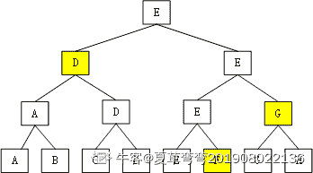
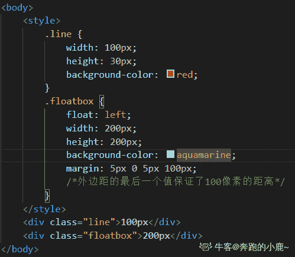
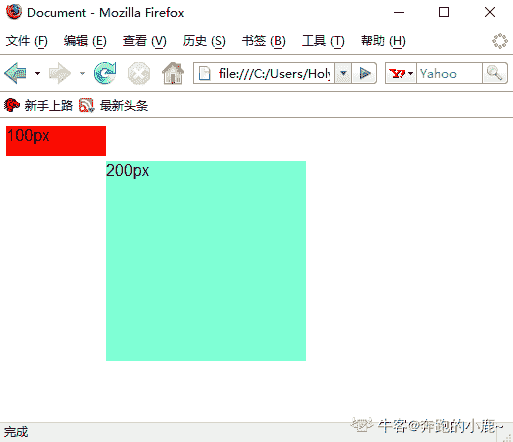
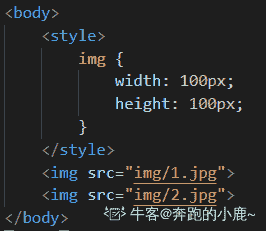
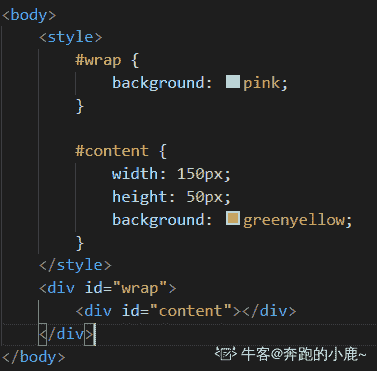
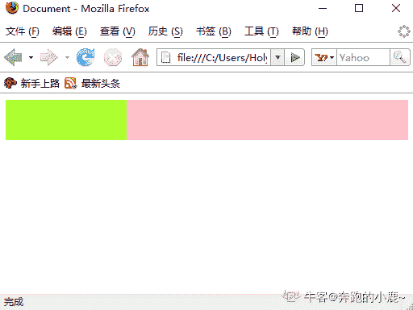

# 用友 2016 校招 web 前端笔试题

## 1

在 HTML 中，样式表按照应用方式可以分为三种类型，其中不包括（     ）

正确答案: D   你的答案: 空 (错误)

```cpp
内嵌样式表
```

```cpp
行内样式表
```

```cpp
外部样式表文件
```

```cpp
类样式表
```

本题知识点

前端工程师 用友 HTML 2016 CSS

讨论

[feeling201911161352252](https://www.nowcoder.com/profile/519379747)

多选题。。。。。。。。。。

发表于 2019-11-22 11:34:54

* * *

[半个头像的女同学](https://www.nowcoder.com/profile/825204336)

我反选了。。。。

发表于 2020-04-30 16:06:45

* * *

[ず东隅已逝╊桑榆未晚](https://www.nowcoder.com/profile/1403602)

多远，看错了，说不正确的，结果都选正确的去了

发表于 2020-11-19 20:15:54

* * *

## 2

下面有关 CSS 中 link 和 @import 的区别，描述错误的是（     ）

正确答案: D   你的答案: 空 (错误)

```cpp
link 属于 XHTML 标签，而 @import 完全是 CSS 提供的一种方式
```

```cpp
当一个页面被加载的时候，link 引用的 CSS 会同时被加载，而 @import 引用的 CSS 会等到页面全部被下载完再被加载
```

```cpp
link 在支持 CSS 的浏览器上都支持而 @import 只在 5.0 以上的版本有效
```

```cpp
当使用 JavaScript 控制 DOM 去改变样式的时候，只能使用 @import 方式
```

本题知识点

前端工程师 用友 2016 CSS

讨论

[轩辕乖](https://www.nowcoder.com/profile/546439778)

```cpp
关于 link 与@import 的区别:
区别 1：link 是 XHTML 标签，除了加载 CSS 外，还可以定义 RSS 等其他事务；@import 属于 CSS 范畴，只能加载 CSS。
区别 2：link 引用 CSS 时，在页面载入时同时加载；@import 需要页面网页完全载入以后加载。
区别 3：link 是 XHTML 标签，无兼容问题；@import 是在 CSS2.1 提出的，低版本的浏览器不支持。
区别 4：link 支持使用 Javascript 控制 DOM 去改变样式；而@import 不支持。
```

编辑于 2019-09-23 18:32:12

* * *

[于指缝间慢慢流逝](https://www.nowcoder.com/profile/9091941)

**D 选项**可以通过 JS 操作 DOM ，插入 link 标签来改变样式；由于 DOM 方法是基于文档的，无法使用@import 的方式插入样式
**C 选项**@import 是 CSS2.1 才有的语法，故只可在 IE5+ 才能识别；link 标签作为 HTML 元素，不存在兼容性问题。c 选项  浏览器 5.0 以上的版本  是不是不够严谨，明明是 IE5.0 以上，不是所有浏览器

发表于 2019-12-30 11:27:24

* * *

[Rober 点点](https://www.nowcoder.com/profile/963616569)

link 和 import 区别
本质区别：link 是 html 标记提供的一种方式，import 是 css 提供的一种方式
加载顺序：link 的方式可以让结构和样式同时加载，import 是先加载结构后加载样式，所以在网速过慢的时候会看见网页内容闪烁的情况
兼容问题：link 没有兼容问题，import 一些老的版本的浏览器不支持（尤其是低版本 IE）
控制 DOM 区别：link 可以被 DOM 控制，而 import 不能被控制

发表于 2021-08-18 22:44:41

* * *

## 3

在大数据量场景下，以下哪种 js 中字符串连接方式较为高效（     ）

正确答案: C   你的答案: 空 (错误)

```cpp
a+=b
```

```cpp
a = a+b
```

```cpp
Array.join()
```

```cpp
Array.push()
```

本题知识点

前端工程师 用友 Javascript 2016

讨论

[飙哈哈](https://www.nowcoder.com/profile/287703874)

+的处理机制是：新建一个临时字符串，将新字符串赋值为 a+b，然后返回这个临新字符串并同时销毁原始字符串，所以字符串连接效率较低。所以用 Array.join()不会新建临时字符串效率更高。（当然以上效率问题仅存在于低版本浏览器 ie7-及以下，现在的新浏览器基本上都解决了这个问题，效率差不多）所以在面试时遇到这种题时告诉面试官分两种情况：旧浏览器（ie7-）下用 join()会高效，而新版本浏览器下除了做变量缓存外不需要做别的优化。这样可以侧面表达对刘拉你兼容有所了解。---哈哈哈查到的

发表于 2019-09-20 09:17:53

* * *

[Ares_cn](https://www.nowcoder.com/profile/117502877)

[摘自网络]

1.  在旧浏览器（ie7-）下用 join 会更高效。

2.  在现代浏览器，尽量用"+",更高效。

3.  当然，在少数现代浏览器里 “+” 不一定会比 join 快（如，safari 5.0.5，opera 11.10)

4.  本身是字符串数组的，直接 join 会更好。

5.  在"+"与 concat 之间，当然是优选使用"+"，方便又直观又高效。

发表于 2020-02-28 21:06:22

* * *

[liyongleihf2006](https://www.nowcoder.com/profile/813198111)

Array.join 是 undefined 啊；Array.prototype 上面才有 join 吧 你这个题写的就有问题

发表于 2019-12-04 18:02:35

* * *

## 4

在一个有 8 个 int 数据的数组中，随机给出数组的数据，找出最大和第二大元素一定需要进行几次比较（     ）

正确答案: B   你的答案: 空 (错误)

```cpp
8
```

```cpp
9
```

```cpp
10
```

```cpp
11
```

本题知识点

前端工程师 用友 数组 2016

讨论

[夏草弯弯 201908022136994](https://www.nowcoder.com/profile/634301217)

将 8 个数据俩俩分组比较，需要 7 次得到最大元素，假设为 E，那么第二大元素的取值范围为图中的黄色部分，需要 2 次比较得出，所以一共是 9 次。 

发表于 2019-11-27 15:37:31

* * *

[秋招加油呀！](https://www.nowcoder.com/profile/619525727)

第一次分组 8 个分成 4 组 两两一组 比 4 次 第二次分组为上面比较下来的 4 个还是两两分组 分 2 组 第三次分组就剩下两个直接比较出了最大 这时一共比较了 4+2+1=7 次 接着拿第三次分组中与最大比较的那个数分别和 之前与最大那个数比较过的数比较 分别是第一次分组有一个 第二次分组有一个 7+2=9

发表于 2019-09-03 00:51:39

* * *

[。。。。。。20180704222275](https://www.nowcoder.com/profile/732320387)

构建大顶推。使用大顶推的时间复杂度考虑。

发表于 2020-04-27 00:31:38

* * *

## 5

下面有关 html 结构正确的有（     ）

正确答案: A B C   你的答案: 空 (错误)

```cpp
<ul><li></li></ul>
```

```cpp
<ol><li></li></ol>
```

```cpp
<dl><dt></dt><dd></dd></dl>
```

```cpp
<table><tr></tr><td></td></table>
```

本题知识点

前端工程师 用友 HTML 2016

讨论

[狗佳蛋](https://www.nowcoder.com/profile/296981211)

td 标签要嵌套在 tr 里面

发表于 2019-10-27 11:59:46

* * *

[-兜-](https://www.nowcoder.com/profile/868091519)

<tr> table row, <th> table head, <td> tabel body <dl> 定义列表（definition list），<dt>定义列表中的项目（即术语部分（definition term））。<dd> 定义列表中定义条目的定义部分（definition definition）。

发表于 2020-04-02 11:22:05

* * *

[牛儿棒棒棒](https://www.nowcoder.com/profile/779069310)

```cpp
<table> <tr>
    <th>表头</th>
  </tr>
  <tr>
    <td>表格单元格</td>
  </tr> </table> 
```

发表于 2021-12-13 21:16:43

* * *

## 6

下列关于背景定位属性 background-position 说法正确的是（     ）

正确答案: A B D   你的答案: 空 (错误)

```cpp
该属性可有两个取值，第一个取值为背景图像与其容器在水平方向上的距离，第二个取值为背景图像与其容器在垂直方向上的距离
```

```cpp
若只有一个取值，则其第二个取值默认为 50%
```

```cpp
若此取值用百分数表示，如：20% 60%，则表示此背景图像离其容器左边的距离为整个容器宽度的 20%，离容器上边的距离为整个容器高度的 60%
```

```cpp
若属性取值用 left、center、right、top、bottom 表示，则该属性取值的顺序可以颠倒，否则其取值顺序不能颠倒
```

本题知识点

前端工程师 用友 2016 CSS

讨论

[js 我来了](https://www.nowcoder.com/profile/954719781)

**Background-position 属性**

用处：配合 background-image 属性一起使用，用于设置背景图片在盒子中的位置

参数：xpos ypos |x% y% |x y 三种,

如果只写第一个水平方向的参数，第二个垂直方向的参数会默认为：

center|50%|容器高度的一半 px

Xpos：规定水平方向的对齐方式,值有 left,right,center

Ypos：规定垂直方向的对齐方式,值有 top,bottom,center

x%:规定图片水平方向的距离。你会不会以为这个 x%就是父级容器宽度的 x%？那你就想错了哦，这里的 x%指的是父级容器的宽度减去图片的宽度后的差值的 x%。举个栗子：background-position：50%，20%；图片的宽度为     imgwidth：100px；高度为     imgheight：100px；容器的宽度为     conwidth：200px；高度为     conheight：200px；那么此时图片的左顶点距离容器的左顶点的水平距离就是(conwidth-imgwidth)*50%=50px,而不是 conwidth*50%=100px；(很好理解的吧，不然盒子宽度 200px，图片宽度 100px，又距离左边 100px，岂不是 50%没实现水平居中而紧靠右了吗？)由此也可以算出图片的左顶点距离容器的左顶点的垂直距离为 20px

y%:对应 x%

x:图片距离容器水平方向距离

y:图片距离容器垂直方向距离

编辑于 2019-10-09 22:38:15

* * *

[wangxiaofen](https://www.nowcoder.com/profile/9698805)

A：正确✔，两个值分别是水平和垂直位置

B：正确✔，三种设置方式都是若只有一个值，那第二个值默认都是 50%；
C：错误❌，实际上的位置计算方式为：x = (对象的宽度 - 图像的宽度) * x%; y = (对象的高度 - 图像的高度) * y%;

所以 为整个容器宽度的 20% 这种说法错误

D：正确✔

发表于 2020-05-05 11:17:53

* * *

[JsonWang0102](https://www.nowcoder.com/profile/482834539)

```cpp
20% 60%  是相对图片本身大小而言
```

发表于 2019-06-16 22:54:18

* * *

## 7

关于 HttpSession 对象，哪些说法是正确的（     ）

正确答案: C D   你的答案: 空 (错误)

```cpp
如果会话一段时间没有活动，就会无效
```

```cpp
每次用户做出请求时都会创建一个新会话
```

```cpp
可以用 servlet 的一个特定调用置会话无效
```

```cpp
同一个浏览器做出的多个请求可以访问同一个会话对象
```

本题知识点

前端工程师 用友 网络基础 2016

讨论

[fizzlq](https://www.nowcoder.com/profile/640460777)

A:session 的生命周期：从进入网站开始，到离开网站结束 B:session 为每一个用户只会创建一次会话 C:httpsession.invalidatesession()方法的作用：1 使会话无效 2 使 session 绑定得对象全部解绑 D:在一次生命周期内，所有请求访问同一个个 session

发表于 2019-09-10 19:38:02

* * *

## 8

下列关于数据库安全性的类型和一般措施的叙述中，哪些是正确的（     ）

正确答案: A B D   你的答案: 空 (错误)

```cpp
数据库的安全性威胁会导致丧失或削弱数据库的完整性、可用性、机密性
```

```cpp
一般 DBMS 包含一个数据库安全和授权子系统，用于负责数据库的安全性功能以避免发生未授权的访问
```

```cpp
自主安全性机制用于对多级安全性进行控制
```

```cpp
基于角色的访问控制可用于数据库安全性控制
```

本题知识点

前端工程师 用友 数据库 2016

讨论

[72%](https://www.nowcoder.com/profile/999727528)

数据库安全性机制：1\. 自主安全性机制：通过权限在用户之间传递，使用户自己来管理数据库；**（权限）**2\. 强制安全性机制：通过对数据和用户强制分类，使不同类别的用户能访问到不同类型的数据；**（数据分类）**3\. 推断控制机制：防止推断出不该被知道的数据；**（推断****）**4\. 数据加密存储机制：对数据加密。**（加密）****多级安全是指：给每一类数据设定一个安全级别，同时给每一类用户也设定安全级别，以此来控制什么级别的数据能被什么级别的用户访问。**

发表于 2019-12-26 21:31:08

* * *

[阿柴](https://www.nowcoder.com/profile/1077189)


发表于 2019-10-16 20:32:04

* * *

[柳橙 z](https://www.nowcoder.com/profile/228020560)

完美避开正确答案🙈

发表于 2019-09-20 15:34:31

* * *

## 9

如果在 catalog.htm 中包含如下代码，则该 HTML 文档 IE 浏览器中打开后，用户单击此链接<A HREF="#novel">小说</a>将(     )

正确答案: C   你的答案: 空 (错误)

```cpp
使页面跳转到同一文件夹下名为“novel.html”的 HTML 文档
```

```cpp
使页面跳转到同一文件夹下名为“小说.html”的 HTML 文档
```

```cpp
使页面跳转到 catalog.htm 包含名为“novel”的锚记处
```

```cpp
使页面跳转到同一文件夹下名为“小说.html”的 HTML 文档中名为“novel”的锚记处
```

本题知识点

前端工程师 用友 HTML 2016

讨论

[牛客 178799987 号](https://www.nowcoder.com/profile/178799987)

| *URL* | 超链接的 URL。可能的值： 
*   绝对 URL - 指向另一个站点（比如 href="[`www.example.com/index.htm`](http://www.example.com/index.htm)"）
*   相对 URL - 指向站点内的某个文件（href="index.htm"）
*   锚 URL - 指向页面中的锚（href="#top"）

 |

发表于 2021-03-11 23:18:34

* * *

[wayne1103](https://www.nowcoder.com/profile/461096992)

```cpp
<a href="xxx.html#id 名">跳转到同目录下的 xxx.html 中的指定 id 名处</a>
```

发表于 2021-03-18 13:54:51

* * *

[牛客 692606674 号](https://www.nowcoder.com/profile/692606674)

href=#x nane 会跳转到同文件夹下 nane.html 的锚点 x 处

发表于 2020-04-21 21:42:35

* * *

## 10

HTML5 之前的 HTML 版本是（     ）

正确答案: A   你的答案: 空 (错误)

```cpp
HTML 4.01
```

```cpp
HTML 4
```

```cpp
HTML 4.1
```

```cpp
HTML 4.9
```

本题知识点

前端工程师 用友 HTML 2016

讨论

[九十九天的士兵](https://www.nowcoder.com/profile/203367848)

好像这样的题目没啥子意义

发表于 2019-09-29 13:28:12

* * *

[牛客 795006991 号](https://www.nowcoder.com/profile/795006991)

上知天文，下晓地理

发表于 2021-07-27 10:09:16

* * *

[blue、`](https://www.nowcoder.com/profile/699657391)

HTML1.0~2.0(1989~1991)>HTML3(1995)>HTML4(1998)>HTML4.01(1999)>XHTML1.0(2001)>HTML5(终极版本)。 所以答案应该是 AB

发表于 2021-08-01 21:37:52

* * *

## 11

以下可将一对象的背景色透明度改为 80%的声明是（     ）

正确答案: D   你的答案: 空 (错误)

```cpp
filter:alpha:(opacity=80);
```

```cpp
filter:alpha: opacity=80;
```

```cpp
filter:alpha:(opacity:80);
```

```cpp
filter:alpha(opacity=80);
```

本题知识点

前端工程师 用友 HTML 2016

讨论

[安如水](https://www.nowcoder.com/profile/788092848)

ie 兼容性写法，filter:alpha(opacity:80);平时就用这一种，没接触过其他写法由此可见 IE 就是花里胡哨，愿天下程序员早日摆脱 IE 这个魔鬼

发表于 2019-09-16 09:04:26

* * *

[yatesZou](https://www.nowcoder.com/profile/359474048)

真狗啊，不不定向选择题，结果答案是单选题，靠

发表于 2020-08-16 10:04:29

* * *

[aSuncat](https://www.nowcoder.com/profile/359143087)

一、设置不透明度：opacity1、ie

*   ```cpp
    filter:alpha(opacity:80);

    ```

2、其他浏览器 *   ```cpp
    filter:alpha(opacity=80);
    ``` 

发表于 2021-10-26 11:03:44

* * *

## 12

以下哪种现象在 FireFox2.0 中会存在（     ）

正确答案: B   你的答案: 空 (错误)

```cpp
双倍边距的问题
```

```cpp
图片间隙的问题
```

```cpp
父元素不能自适应子元素高度
```

```cpp
其他说法都不对
```

本题知识点

前端工程师 用友 HTML 2016 CSS

讨论

[奔跑的小鹿~](https://www.nowcoder.com/profile/974414133)

维基百科上搜 FF2.0 有一类目是指 FireFox 2.0，题目 FF2.0 应该指的是火狐浏览器 2.0 版本。**Mozilla Firefox 2**是**Firefox**的版本，[Firefox](https://en.wikipedia.org/wiki/Firefox)是由[Mozilla Corporation](https://en.wikipedia.org/wiki/Mozilla_Corporation)在 2006 年 10 月 24 日发布的[网络浏览器](https://en.wikipedia.org/wiki/Web_browser)。Mozilla 于 2008 年 12 月 18 日终止了对 Firefox 2 的支持。详细介绍：[`en.wikipedia.org/wiki/Firefox_2`](https://en.wikipedia.org/wiki/Firefox_2)因为该版本早已经过时了，因此上文只有下载对应版本自己测试，网上找不到资料的。下载地址：[`ftp.mozilla.org/pub/firefox/releases/2.0/`](https://ftp.mozilla.org/pub/firefox/releases/2.0/)上述的几个问题常见于老 IE,我们还是可以了解下的。双倍边距的问题：[`blog.csdn.net/lzy_1515/article/details/4768336`](https://blog.csdn.net/lzy_1515/article/details/4768336)因为该版本火狐浏览器调试器过于简陋，所以用了一个元素表示它的左边距距离。经测试，无双边距问题。

图片间隙的问题：[`blog.csdn.net/XYFcute/article/details/77894682`](https://blog.csdn.net/XYFcute/article/details/77894682)经测试，该版本同样存在图片间隙问题

父元素不能自适应子元素高度，测试如下
Firefox2 父元素是能够自适应子元素高度的。综上，该答案应选 B。不才，如果有遗漏或错误的地方，欢迎指正。

编辑于 2020-06-08 10:22:30

* * *

[牛客 777459450 号](https://www.nowcoder.com/profile/777459450)

我只知道 FF14 =_=

发表于 2019-12-20 18:50:08

* * *

[banmax](https://www.nowcoder.com/profile/204197941)

FF 2.0 是什么？

发表于 2019-09-24 17:36:22

* * *

## 13

Html 中，列举几个“行内元素、块级元素、 可变元素，分别列举三个即可

你的答案

本题知识点

前端工程师 用友 2016

## 14

简述 CSS 的盒子模型

你的答案

本题知识点

前端工程师 用友 2016

讨论

[刘琦 201905100927139](https://www.nowcoder.com/profile/702775772)

标准盒模型:由外到内依次是 margin,border,padding,content.

发表于 2019-10-31 19:23:54

* * *

## 15

请编写一个 JavaScript 函数 parseQueryString，它的用途是把 URL 参数解析出来，如：var url =“http://witmax.cn/index.php?key0=0&key1=1&key2=2”;取得 Key0，key1,key2 值

你的答案

本题知识点

前端工程师 用友 2016

## 16

请描述一下 cookies，sessionStorage 和 localStorage 的区别

你的答案

本题知识点

前端工程师 用友 2016

## 17

HTML5 中如何嵌入音频？

你的答案

本题知识点

前端工程师 用友 2016

## 18

如何垂直居中一个浮动元素？

你的答案

本题知识点

前端工程师 用友 2016

## 19

请用 JS 判断一个字符串如：abcdefgaddda 中出现次数最多的字符，统计这个次数

你的答案

本题知识点

前端工程师 用友 2016

讨论

[祯民](https://www.nowcoder.com/profile/463267767)

```cpp
String.prototype.maxCounts = function(){
        var res = [], maxCh = '', max = 0;
        for(let i = 0; i < this.length; i++){
            var ch = this[i];
            if(res[ch] == null){
                res[ch] = 1;
            }else{
                res[ch]++;
            }
            if(res[ch] > max){
                max = res[ch];
                maxCh = ch;
            }
        }
        return "出现次数最多的字符为" + maxCh + ",出现次数为" + max;
    }
    document.write("abcdefgaddda".maxCounts());
```

发表于 2019-09-20 09:39:34

* * *

## 20

CSS 引入的方式有哪些

你的答案

本题知识点

前端工程师 用友 2016

讨论

[懒洋洋 201809121118591](https://www.nowcoder.com/profile/457914513)

1\. 外联样式 2.内联样式 3.行内样式

发表于 2020-12-14 16:59:05

* * *

[蒲公英想养花](https://www.nowcoder.com/profile/596900263)

四种：style 属性、style 标签、link 属性、@import 引入

发表于 2020-05-08 14:25:25

* * *

[橘子橘子橘子皮](https://www.nowcoder.com/profile/8604073)

外链式，行内式，嵌入式

发表于 2020-02-01 08:29:13

* * *

## 21

列出浏览器对象模型中对象，并简要说明其用途。

你的答案

本题知识点

前端工程师 用友 2016

## 22

现在公司开发的手机轻应用感觉页面加载速度很慢，想让你协助分析页面加载缓慢的原因，请你根据你现有的知识进行相应的论述一下浏览器加载过程，并写出相应办法解决加载缓慢的问题

你的答案

本题知识点

前端工程师 用友 2016