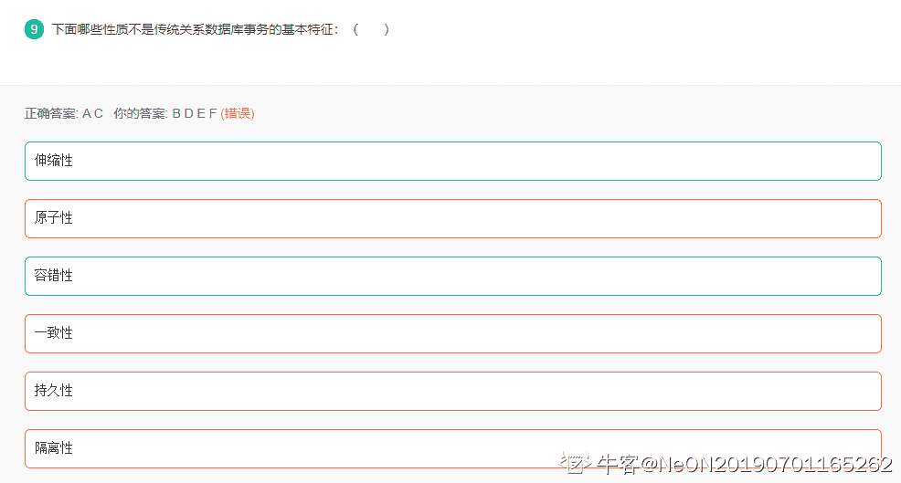
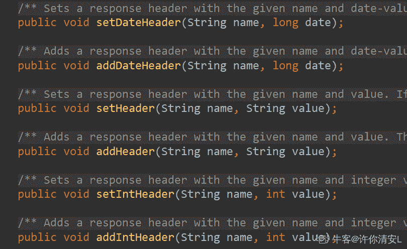
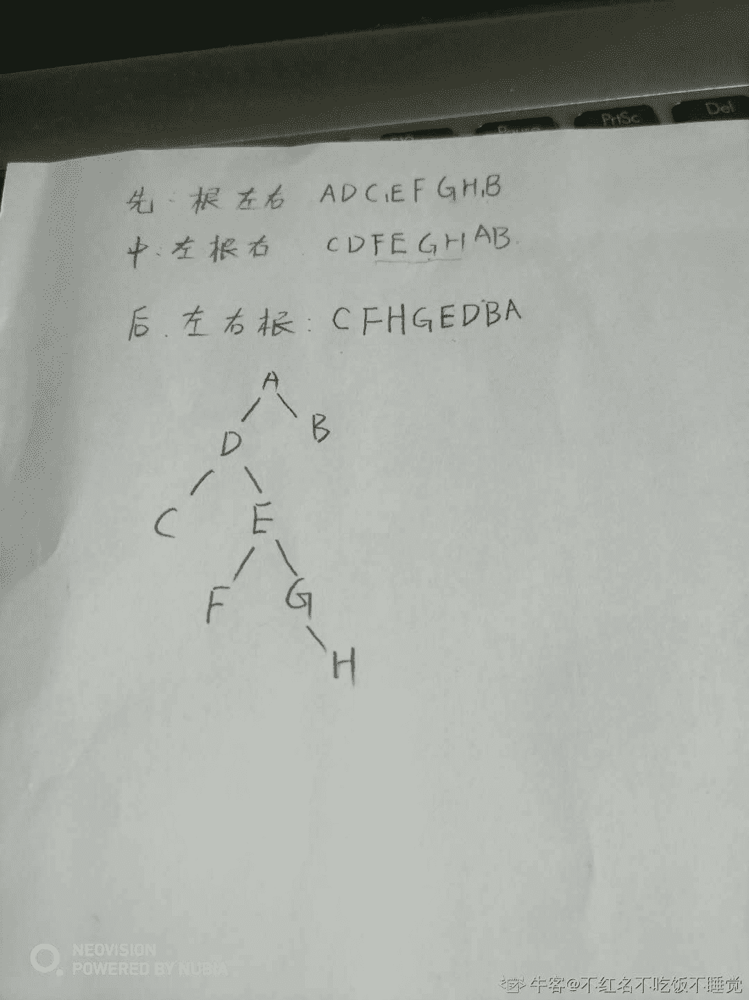
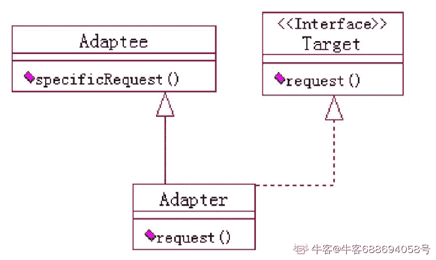
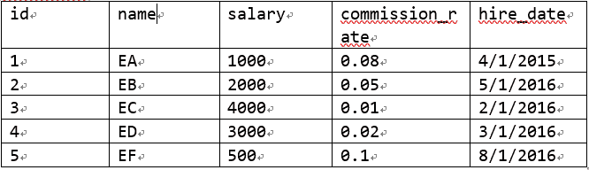
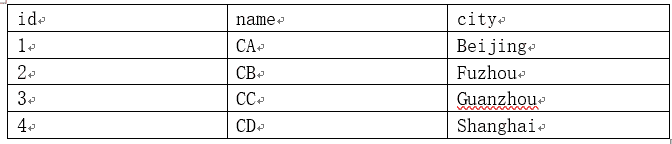
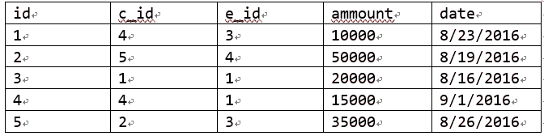

# 用友 2017 校招 web 前端笔试题（一）

## 1

下列哪些是与数据库管理相关的技术：     (         )

正确答案: A B D F   你的答案: 空 (错误)

```cpp
RDBMS
```

```cpp
NoSQL
```

```cpp
Nginx
```

```cpp
NewSQL
```

```cpp
ActiveMQ
```

```cpp
HBase
```

本题知识点

前端工程师 用友 数据库 2017

讨论

[牛客 149347611 号](https://www.nowcoder.com/profile/149347611)

A. RDBMS：（Relational Database Management System）关系数据库管理系统 B. NoSQL：非关系型的数据库 C. Nginx：是一个高性能的 HTTP 和反向***web 服务器，同时也提供了 IMAP/POP3/SMTP 服务 D. NewSQL：新型关系型数据库 E. ActiveMQ：Apache 下的一个中间件 F. Hbase：是一个分布式的面向列的数据库故选：A B D F

发表于 2019-12-28 21:19:42

* * *

[我是奇葩大大咧咧光芒万](https://www.nowcoder.com/profile/878645583)

HBase X-Pack 支持：HBase API(包括 RestServerThriftServer)、关系 Phoenix SQL、时序 OpenTSDB、全文 Solr、时空 GeoMesa、图 HGraph、分析 Spark on HBase，是阿里云首个支持多模式的分布式数据库，且协议 100%兼容开源协议。

发表于 2019-10-17 18:18:58

* * *

## 2

下面哪些产品或技术支持 WEB 应用的部署和运行：(        )

正确答案: B C E   你的答案: 空 (错误)

```cpp
Kafka
```

```cpp
WebSphere
```

```cpp
Jetty
```

```cpp
Cassandra
```

```cpp
NodeJS
```

```cpp
Spark
```

本题知识点

前端工程师 用友 2017

## 3

下面哪些技术是用来处理 XML 文件的技术 (        )

正确答案: A B F   你的答案: 空 (错误)

```cpp
DOM
```

```cpp
STAX
```

```cpp
JSON
```

```cpp
XSLT
```

```cpp
YAML
```

```cpp
SAX
```

本题知识点

前端工程师 用友 2017

## 4

关于 HTTP，下面哪些描述是准确的 (          )

正确答案: B D E F   你的答案: 空 (错误)

```cpp
HTTP 协议上只能传输 HTML 格式的数据的超文本传输协议
```

```cpp
HTTP 是建立在 TCP 协议之上的应用层协议
```

```cpp
HTTP 协议是为长连接设计的协议
```

```cpp
HTTP 是基于请求/响应模型设计的协议
```

```cpp
HTTP 协议是一种明文协议，不够安全
```

```cpp
HTTP 协议支持多种方法，如 HEAD, DELETE, PUT, TRACE, GET,POST
```

本题知识点

前端工程师 用友 网络基础 2017

讨论

[🎉201909271532691](https://www.nowcoder.com/profile/726764891)

请求响应模型 就是 C/S 模型

发表于 2020-02-25 15:50:12

* * *

[延大 _ 王星星](https://www.nowcoder.com/profile/395313099)

HTTP1.0 定义了三种请求方法： GET, POST 和 HEAD 方法。
HTTP1.1 新增了五种请求方法：OPTIONS, PUT, DELETE, TRACE 和 CONNECT 方法所以 F 选择正确

发表于 2020-05-22 12:19:56

* * *

[Sobering](https://www.nowcoder.com/profile/983435451)

个人理解，http 起初只有非持久性连接。

http 报文是面向文本的，报文中的每个字段都是 ASCII 码串

发表于 2019-10-31 18:03:00

* * *

## 5

下面哪些性质不是传统关系数据库事务的基本特征：（       ）

正确答案: A C   你的答案: 空 (错误)

```cpp
伸缩性
```

```cpp
原子性
```

```cpp
容错性
```

```cpp
一致性
```

```cpp
持久性
```

```cpp
隔离性
```

本题知识点

前端工程师 用友 数据库 2017

讨论

[Olivia•](https://www.nowcoder.com/profile/440884689)

四大特性（ACID）：
1、原子性（Atomic）
事务的操作作为整体执行，要么全部执行，要么全部失败
2、一致性（Consistency）
数据在事务执行之前和执行之后，处于一致状态
3、隔离性（Isolation）
多个事务之间是隔离的，互不影响
4、永久性（Durability）
一旦事务提交了，对数据库的修改是永久性的

发表于 2020-02-07 23:45:23

* * *

[NeON20190701165262](https://www.nowcoder.com/profile/210779994)

又翻车了，是“不是”，不是“是”😑

发表于 2021-12-03 18:45:47

* * *

[Gustavo.W](https://www.nowcoder.com/profile/151408094)

这个题考察事务的 ACID 特性题目陷阱在于，求的是 “不是” 传统关系数据库事务的基本特征的

发表于 2021-09-09 16:31:04

* * *

## 6

关于虚函数，下面哪些描述是正确的 （        ）

正确答案: D F   你的答案: 空 (错误)

```cpp
虚函数是实现方法重载的工具
```

```cpp
Java 中所有的函数都是虚函数
```

```cpp
通过虚函数，类体系获得了多态性支持
```

```cpp
虚函数必须在子类中实现
```

```cpp
虚函数不能够被子类继承
```

```cpp
在 C++中，基类的析构函数建议为虚析构函数
```

本题知识点

前端工程师 用友 C++ Java 前端工程师 用友 2017

讨论

[Bri0117](https://www.nowcoder.com/profile/291010799)

1\. **Java 虚函数**

虚函数的存在是为了多态。

Java 中其实没有虚函数的概念，它的**普通函数**就相当于**C++的虚函数**，动态绑定是 Java 的默认行为。如果 Java 中不希望某个函数具有虚函数特性，可以加上**final 关键字**变成**非虚函数**

PS: 其实 C++和 Java 在虚函数的观点大同小异，异曲同工罢了。

2\. **Java 抽象函数(****纯虚函数**)
 抽象函数或者说是纯虚函数的存在是为了定义接口。Java 中纯虚函数形式为：abstract void print();
PS: 在抽象函数方面 C++和 Java 还是换汤不换药。

发表于 2019-09-11 09:41:06

* * *

[Tommey 周](https://www.nowcoder.com/profile/822887624)

什么是虚函数？简单地说，那些被 virtual 关键字修饰的成员函数，就是虚函数，java 中普通成员函数就是虚函数，

A. 两者在概念和使用方式上当然是不同的。如果是涉及的是同个类中的对象，那就是的重载。如果两个类是父类与子类的关系，调用的函数是它们都有的，那么是虚函数调用

B. 可以加上 final 关键字变成非虚函数

C. 在 C++中，基类指针可以指向派生类对象，以及基类中拥有虚函数，是支持多态性的前提，但虚函数的存在是为了多态。

D. 如果不是纯虚函数，也就是基类不是抽象类的话，虚函数在子类中可以不实现！

E. 虚函数（virtual）：可以由子类继承并重写的函数，后期绑定

F. 假设基类中采用的是非虚析构函数，当删除基类指针指向的派生类对象时就不会触发动态绑定，因而只会调用基类的析构函数，而不会调用派生类的析构函数。那么在这种情况下，派生类中申请的空间就得不到释放从而产生内存泄漏。

发表于 2019-10-21 00:41:36

* * *

[我的天鸭](https://www.nowcoder.com/profile/243498)

只要同时出现了 C/C++ Java 的 tag，题目就变得一言难尽。这题为什么 C 错 D 对？？？

发表于 2019-09-05 15:37:49

* * *

## 7

计算机在内存中存储数据时使用了大端(bigendian)、小端(littleendian)模式，请分别问 0X123456 在大端模式下，首个字节是：(          )

正确答案: D   你的答案: 空 (错误)

```cpp
0X23
```

```cpp
0X34
```

```cpp
0X56
```

```cpp
0X12
```

```cpp
0X1
```

```cpp
0X6
```

本题知识点

前端工程师 用友 操作系统 2017

讨论

[codegitz](https://www.nowcoder.com/profile/828158542)

大端满足人的习惯思维，小端恰好相反

发表于 2019-10-30 12:48:08

* * *

[甜树果子二号](https://www.nowcoder.com/profile/543920445)

大端方式：地位地址对应高位数据，高位地址对应地位数据；小端方式与大端方式相反，另外注意题目要求，问的是首个“字节”。

发表于 2019-12-01 21:46:16

* * *

[炫歌](https://www.nowcoder.com/profile/622959792)

就一个对的 你给我来个不确定选项  坑啊

发表于 2020-06-28 14:43:32

* * *

## 8

在并发程序开发中为了避免竞争，系统允许多少个进程同时进入一个临界区(        )

正确答案: D   你的答案: 空 (错误)

```cpp
不超过计算机 CPU 的总核心数
```

```cpp
不超过计算机 CPU 的物理核心数
```

```cpp
8
```

```cpp
1
```

```cpp
16
```

```cpp
0
```

本题知识点

前端工程师 用友 操作系统 2017

讨论

[牛客 419477351 号](https://www.nowcoder.com/profile/419477351)

选一个那你多选题个毛线

发表于 2021-12-23 18:57:02

* * *

[望云鸽](https://www.nowcoder.com/profile/941490215)

0 个不行么

发表于 2019-11-26 14:34:00

* * *

[抠脚大汉 4](https://www.nowcoder.com/profile/7544433)

临界区资源只能有一个访问

发表于 2019-11-11 15:57:45

* * *

## 9

下面 HttpServletResponse 方法调用，那些给客户端回应了一个定制的 HTTP 回应头：(          )

正确答案: A B   你的答案: 空 (错误)

```cpp
response.setHeader("X-MyHeader", "34");
```

```cpp
response.addHeader("X-MyHeader", "34");
```

```cpp
response.setHeader(new HttpHeader("X-MyHeader", "34"));
```

```cpp
response.addHeader(new HttpHeader("X-MyHeader", "34"));
```

```cpp
response.addHeader(new ServletHeader("X-MyHeader", "34"));
```

```cpp
response.setHeader(new ServletHeader("X-MyHeader", "34"));
```

本题知识点

用友 2017 Java

讨论

[许你清安 L](https://www.nowcoder.com/profile/195264425)



```cpp
HttpServletResponse（接口）就只是提供了这么几个方法声明来设置响应头的数据。
```

发表于 2021-10-23 11:16:51

* * *

[新人 1](https://www.nowcoder.com/profile/82717620)

1、同名 Header 可以有多个 ，Header[] getHeaders(String name)。
2、运行时使用的是第一个， Header getFirstHeader(String name)。
3、addHeader，如果同名 header 已存在，则追加至原同名 header 后面。
4、setHeader，如果同名 header 已存在，则覆盖一个同名 header。

发表于 2019-11-20 10:34:30

* * *

[okarin](https://www.nowcoder.com/profile/354853372)

出后硬说前，话说我是来刷计算机网络的...

编辑于 2019-11-20 10:10:30

* * *

## 10

关于 Java 中的数组，下面的一些描述，哪些描述是准确的：（        ）

正确答案: A C F   你的答案: 空 (错误)

```cpp
数组是一个对象，不同类型的数组具有不同的类
```

```cpp
数组长度是可以动态调整的
```

```cpp
数组是一个连续的存储结构
```

```cpp
一个固定长度的数组可类似这样定义: int array[100]
```

```cpp
两个数组用 equals 方法比较时，会逐个便利其中的元素，对每个元素进行比较
```

```cpp
可以二维数组，且可以有多维数组，都是在 Java 中合法的
```

本题知识点

前端工程师 用友 Java 2017

讨论

[弱楓](https://www.nowcoder.com/profile/272340785)

```cpp
public static void main(String[] args) {
        int[] i = new int[]{1,2,3};
        int[] j = new int[]{1,2,3};
        int[] k = i;
        int[] array = new int[100];
        double[] array_1 = new double[100];
        System.out.println(array);
        System.out.println(array_1);
        System.out.println(i.equals(j));
        System.out.println(i.equals(k));
    }
```

输出结果

```cpp
[I@6d6f6e28
[D@135fbaa4
false
true
```

A 数组是对象，因为可以调用方法，从上面的输出结果可以看出不同类型的数组具有不同的类 B 数组长度是不能动态调整的 C Java 中的数组中的数据是连续存储在一块内存中的，所以可以通过下标(即偏移量)的方式访问 D 固定长度的数组定义如上 E 查看源码可以知道数组的 equals 方法是 object 的 equals，比较的是内存地址 F java 可以有***数组

发表于 2019-09-05 20:32:44

* * *

[越刷题越幸运](https://www.nowcoder.com/profile/47400333)

```cpp
int[] array=new int [100]; int array[]=new int [100];
```

正确的声明方式

编辑于 2019-09-11 11:26:44

* * *

[甜树果子二号](https://www.nowcoder.com/profile/543920445)

Arrays.equal()可以比较数组元素。

发表于 2019-10-31 09:05:35

* * *

## 11

有对夫妻生了三个孩子，其中一个是男孩，请猜猜老二是女孩的概率是多少？

你的答案

本题知识点

前端工程师 用友 2017

## 12

给定一串数字，5 15 1115 3115 132115 ..., 从第一个数字开始，第二个数字 15，表示第一个数值是“1 个 5”，第三数字表示第二个数字按数字顺序由“1 个 1 和 1 个 5 构成，第四个数字表示第三个数字是按数字顺序由“3 个 1 和 1 个 5 构成”，依此规律，后一个数字是前一个数字的这种形式的编码。假设第一个数字为 1，那么问第六个数字是: ______________

你的答案

本题知识点

前端工程师 用友 2017

讨论

[hello201903261057737](https://www.nowcoder.com/profile/628070715)

3122111 11 21 1211 111221 312211

发表于 2019-10-12 21:22:17

* * *

## 13

36 进制，A-Z,分别表示 10 到 35, 请问 1976 经过 36 进制编码后是什么数字 ___________

你的答案

本题知识点

前端工程师 用友 2017

## 14

已知一颗二叉树，如果先序遍历的节点顺序是：ADCEFGHB，中序遍历是：CDFEGHAB，则                  后续遍历序列的结果为 _________________

你的答案

本题知识点

前端工程师 用友 2017

讨论

[dragonlogin](https://www.nowcoder.com/profile/2071677)



发表于 2019-10-17 09:22:44

* * *

[初生牛犊求职路](https://www.nowcoder.com/profile/591919692)

C F H G E D B A 今晚笔试刚做了

发表于 2019-10-17 21:03:07

* * *

## 15

如果 X 大于 0 并小于 65536，用移位法计算 X 乘以 17 的值, 请给出计算过程 ___________

你的答案

本题知识点

前端工程师 用友 2017

## 16

关系型数据库中 primary key 和 foreign key 的区别

你的答案

本题知识点

前端工程师 用友 2017

## 17

Java 中 HashMap 和 Hashtable 的区别，对作为 key 的数据对象有什么建议？

你的答案

本题知识点

前端工程师 用友 2017

讨论

[一个人走~](https://www.nowcoder.com/profile/290796807)

。。

发表于 2019-08-09 14:50:13

* * *

[he1Jgo-boy](https://www.nowcoder.com/profile/173050610)

hashMap 不是线性安全的类，hashtable 是线性安全的

发表于 2019-08-09 14:50:11

* * *

## 18

介绍一下 Java 中线程的状态 。

你的答案

本题知识点

前端工程师 用友 2017

## 19

下面一段 JavaScript 代码

```cpp
var myObject = {
foo: "bar",
func: function() {
var self = this;
console.log("outer func:  this.foo = " + this.foo);
console.log("outer func:  self.foo = " + self.foo);
(function() {
console.log("inner func:  this.foo = " + this.foo);
console.log("inner func:  self.foo = " + self.foo);
}());
}
};
myObject.func()
```

请打出输出的信息

你的答案

本题知识点

前端工程师 用友 2017

## 20

描述一下 Adapter 设计模式的意图和使用方法，并用 UML 图描述一下这种设计模式

你的答案

本题知识点

前端工程师 用友 2017

讨论

[牛客 688694058 号](https://www.nowcoder.com/profile/688694058)

为了使不匹配的类在一起工作，实现了目标类的接口

发表于 2021-07-27 11:11:53

* * *

## 21

实现一个堆栈数据结构，堆栈中存储的为整型数，要求提供 push, pop, peek 方法，并且堆栈没有容量限制（假设内存够用），注意不要使用外部的数据结构 

你的答案

本题知识点

前端工程师 用友 2017

## 22

对称二叉树，是一种二叉树，具有对称的性质，如：

     1

    /   \

  2     2

  / \     / \

3   4 4   3

现在给定一个二叉树的根节点，节点存储的值为整型数，请实现一个算法判断该二叉树是否为对称二叉树

你的答案

本题知识点

前端工程师 用友 2017

## 23

Fibonacci 函数是这样的一个函数 f(0)=0, f(1)=1, f(n)=f(n-1)+f(n-2), 其中 n 为大于等于 2 的自然数,f(n)为第 n 个 Fibonannci 数。现在需要一个方法，在需要的时候才获取第 n 个 Fibonannci 数，由于 Fibonacci 函数的特殊性，获取 f(n)，需要从 0..n-1 全部的 Fibonannci 数计算出来，这显然是耗时耗资源的，因此设计上准备采用缓存技术提升效率，请实现这样一个算法，使用缓存技术加速 Fibonannci 数的计算。

你的答案

本题知识点

前端工程师 用友 2017

## 24

有一个数据库，包括销售员表(sale_reps), 客户表(Customer)和订单表(Order), 它们的数据如下：

sale_reps：ID，名字，薪水， 提成比例， 雇佣日期

客户:ID, 名称，城市

订单：ID, 客户 ID, 签单雇员 ID,金额， 签单日期问题 1：写一个程序,统计每一个销售员获得的总的提成，输出列包括销售员的 ID,名字、提成金额问题 2: 写一个程序， 统计没有实现签单的销售员，输出包括销售员的 ID 和名字

你的答案

本题知识点

前端工程师 用友 2017

## 25

两个矩形，矩形 1(xl1, yt1, xr1, yb1)，矩形 2（xl2，yt2, xr2, yb2），坐标 xl,yt 表示左上角坐标， 小 xr, yb 表示右下角坐标，求它们一起覆盖的总面积

你的答案

本题知识点

前端工程师 用友 2017