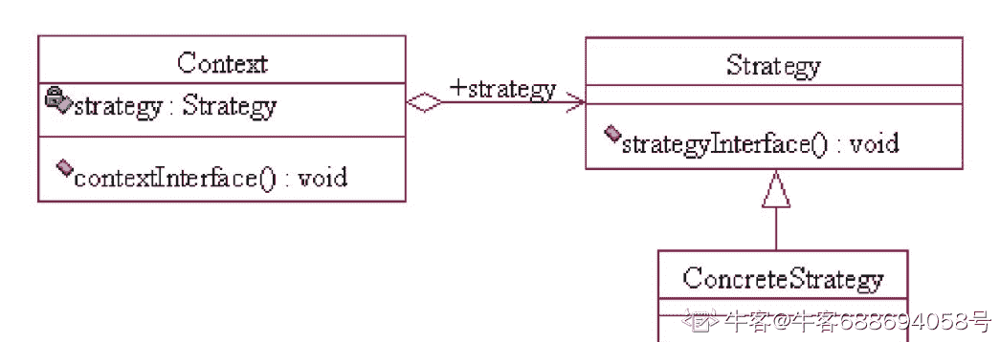

# 用友 2017 校招 web 前端笔试题（二）

## 1

下列哪些是 HTML5 相关的框架或类库：(         )

正确答案: B D E   你的答案: 空 (错误)

```cpp
spring-core
```

```cpp
RactiveJS
```

```cpp
Dubbo
```

```cpp
Bootstrap
```

```cpp
AngularJS
```

```cpp
Hibernate
```

本题知识点

前端工程师 用友 HTML 2017

讨论

[程 xu 终结者](https://www.nowcoder.com/profile/1113222)

做的时候，是只认识 ReactiveJS、Bootstrap、AngularJS 这三个。查了一下：Spring 框架是一个开放源代码的[J2EE](https://baike.baidu.com/item/J2EE/110838)应用程序框架
Dubbo 是一款高性能、轻量级的开源 Java RPC 框架
Hibernate 是一个开放源代码的对象关系映射框架，它对[JDBC](https://baike.baidu.com/item/JDBC/485214)进行了非常轻量级的对象封装，它将 POJO 与数据库表建立映射关系，是一个全自动的 orm 框架

发表于 2019-12-17 15:28:26

* * *

[沛沛大神](https://www.nowcoder.com/profile/555486962)

就认识这三个

发表于 2019-09-20 16:06:25

* * *

[终究还是迟了](https://www.nowcoder.com/profile/707520278)

不知道 ractivejs

发表于 2020-01-14 18:59:05

* * *

## 2

从 WEB 应用的角度，一个应用都需要维护一些不同作用范围的状态， 请问下面哪些状态作用域是 WEB 应用特有的：(        )

正确答案: A D F   你的答案: 空 (错误)

```cpp
会话作用域
```

```cpp
全局作用域
```

```cpp
线程本地
```

```cpp
请求作用域
```

```cpp
本地
```

```cpp
应用上下文
```

本题知识点

前端工程师 用友 2017 HTML CSS

讨论

[是可乐吖](https://www.nowcoder.com/profile/783345293)

Web 程序对象作用域： 常用的有三个：请求作用域，会话作用域，应用上下文。 请求作用域 req 范围最小，需要的资源最少，作用当前请求 session 会话作用于本次对话，每个对话都有 JSessionID， ServletContext 作用域范围大：web 应用中所有都能够访问，生命周期和 web 容器一样长，维护所需资源多。 在满足需求内耗费的资源越小越好

发表于 2020-08-02 23:29:36

* * *

[元无心](https://www.nowcoder.com/profile/224444564)

所以这都是什么翻译……

发表于 2020-10-21 08:42:14

* * *

[牛客 825863933 号](https://www.nowcoder.com/profile/825863933)

请求作用域 会话作用域 应用上下文

发表于 2020-12-07 19:09:07

* * *

## 3

关于 XML，JSON、HTML5 下面哪些描述是错误的 (       )

正确答案: B D E   你的答案: 空 (错误)

```cpp
JSON 比 XML 在数据编码上 JSON 更具有效率，更节约空间
```

```cpp
HTML5 是一种特殊的 XML
```

```cpp
XML 对数据的类型描述表达比 JSON 更丰富
```

```cpp
HTML5 在跨系统交互面是一种理想的交换格式
```

```cpp
XML 比 JSON 更能表达结构化数据
```

```cpp
存在一些数据库，直接支持 XML 或 JSON 数据的操作，如 mongodb, postgresql
```

本题知识点

前端工程师 用友 2017

## 4

有六个元素 6，5，4，3，2，1 的顺序进栈，问下列哪一个不是合法的出栈序列？（        ）

正确答案: C   你的答案: 空 (错误)

```cpp
5 4 3 6 1 2
```

```cpp
4 5 3 1 2 6
```

```cpp
3 4 6 5 2 1
```

```cpp
2 3 4 1 5 6
```

```cpp
6 5 4 3 2 1
```

```cpp
2 3 4 5 6 1
```

本题知识点

前端工程师 用友 栈 *2017* *讨论

[👿👿ld](https://www.nowcoder.com/profile/699926755)

A: 6 入栈 5 入栈，5 出栈，4 入栈 4 出栈，3 入栈 3 出栈，6 出栈，2 入栈 1 入栈，1 出栈 2 出栈。 B: 6 入栈 5 入栈 4 入栈，4 出栈 5 出栈，3 入栈 3 出栈，2 入栈 1 入栈，1 出栈 2 出栈，6 出栈。 C: 6 入栈 5 入栈 4 入栈 3 入栈，3 出栈 4 出栈，此时 6 不能比 5 先出栈，故 C 错误。 D: 6 入栈 5 入栈 4 入栈 3 入栈 2 入栈，2 出栈 3 出栈 4 出栈,1 入栈 1 出栈，5 出栈 6 出栈。 E: 6 入栈 6 出栈，5 入栈 5 出栈，4 入栈 4 出栈…………1 入栈 1 出栈。 F: 6 入栈 5 入栈 4 入栈 3 入栈 2 入栈，2 出栈 3 出栈 4 出栈 5 出栈 6 出栈，1 入栈 1 出栈

发表于 2019-11-06 09:39:11

* * *

[HengV](https://www.nowcoder.com/profile/158271087)

看成 1，2，3，4，5，6 顺序进栈的有没有？😂😂

发表于 2020-07-18 17:14:25

* * *

## 5

关于索引下面哪些描述是正确的：（        ）

正确答案: B E F   你的答案: 空 (错误)

```cpp
索引是为了提高查询效率的，通过建立索引查询效率会得到提高
```

```cpp
索引对数据插入的效率有一定的影响
```

```cpp
唯一索引是一种特殊的索引，表中的行的物理顺序与索引顺序一致，且不允许两行数据在索引列上有相同的值
```

```cpp
每个表都必须具有一个主键索引
```

```cpp
对于数据重复度高，值范围有限的列如果建索引建议使用位图索引
```

```cpp
可以在多个列上建立联合索引
```

本题知识点

前端工程师 用友 数据库 2017

讨论

[KKLLKKLL](https://www.nowcoder.com/profile/843952875)

链接：[`www.nowcoder.com/questionTerminal/0a8290669cc6477ebae43cbc979f0786?orderByHotValue=1&page=1&onlyReference=false`](https://www.nowcoder.com/questionTerminal/0a8290669cc6477ebae43cbc979f0786?orderByHotValue=1&page=1&onlyReference=false)
来源：牛客网

A 选项 并不是建立了索引就会提高索引查找速度

B 选项  唯一索引的列的物理顺序 并不和索引顺序一致，只有聚集索引列的物理顺序和逻辑顺 序 一致，一个表也只能有一个聚集索引

D 选项个人认为是对的，对于 MySQL 而言，当创建一个主键是默认创建一个主键索引，如果在创建表时没有显式地定义主键,则 InnoDB 存储引擎会按如下方式选择或创建主键:

1 首先判断表中是否有非空的唯一索引,如果有,则该列即为主键.

2 如果不符合上述条件,InnoDB 存储引擎自动创建一个 6 字节大小的指针.所以每个表必有一个主键索引，若有不当之处，欢迎指正。转载自 牛客网 风中沉思（同一道题在牛客网为什么讨论不一样。。。）

发表于 2020-03-27 13:33:58

* * *

[Suo_Long](https://www.nowcoder.com/profile/878955003)

A 哪里有问题

发表于 2019-12-23 00:59:24

* * *

[wyn_365](https://www.nowcoder.com/profile/518029179)

**我强烈建议，退出吧，应试教育 这样的文字游戏，卡点啊，真的是烦啊 这种自多的**

发表于 2021-10-08 15:19:04

* * *

## 6

下面有关位运算的一些结论哪些是正确的 （          ）

正确答案: A D   你的答案: 空 (错误)

```cpp
十二进制数 81 的二进制数为: 01100001
```

```cpp
十进制数 11 的补码为：11110101
```

```cpp
十进制数 76 和 81 异或的结果为十进制数 28
```

```cpp
位运算(A|B)&C = (A&C)|(B&C)
```

```cpp
加法运算等同于位或运算，如 A+B=A|B
```

```cpp
与二进制数 00101101 等值的十六进制数是 2C
```

本题知识点

用友 编程基础 *2017* *讨论

[BlackCarDriver](https://www.nowcoder.com/profile/1425406)

AD。-11 的补码才是 11110101。

编辑于 2021-02-20 10:43:33

* * *

[日子照样过编码不能停](https://www.nowcoder.com/profile/3053713)

&

正数补码为其原码

发表于 2020-04-25 13:24:18

* * *

[Xuzhengk](https://www.nowcoder.com/profile/832939024)

正整数的补码难道不和其原码相同？

发表于 2020-01-07 15:03:15

* * *

## 7

下面关于进程和线程的描述，错误的是（       ）

正确答案: D E   你的答案: 空 (错误)

```cpp
进程是资源分配和拥有的单位,同一个进程内的线程共享进程的资源。
```

```cpp
每个线程都有其运行的栈，每个线程都需要一部分内存开销，主要内存开销由栈大小决定
```

```cpp
每个进程有自己独立的地址空间，线程共享进程地址空间，线程间通信更为方便
```

```cpp
进程和线程都具有良好的数据封装和保护机制，进程和线程的强制退出都是安全没有副作用的
```

```cpp
线程比进程消耗的资源更多，但是线程切换的开销比进程小,线程具有更好的效率
```

```cpp
一个进程结束，其中的所有线程都会退出，系统不允许没有关联进程的线程运行
```

本题知识点

前端工程师 用友 操作系统 2017

讨论

[鹏秋](https://www.nowcoder.com/profile/876726649)

呃，看错题了，看成正确的了。

发表于 2019-12-20 09:18:16

* * *

[ciciya](https://www.nowcoder.com/profile/103083176)

线程比进程消耗资源少

发表于 2019-10-29 18:09:10

* * *

[你说是就是](https://www.nowcoder.com/profile/223530205)

a 也有问题吧，线程才是资源调度和分配的基本单位。进程是拥有资源的基本单位

发表于 2020-03-31 21:22:30

* * *

## 8

下面哪些条件下，计算机抖动振荡不会发生：(      )

正确答案: C F   你的答案: 空 (错误)

```cpp
cpu 速度大幅提高，非常快
```

```cpp
IO 效率提升
```

```cpp
程序的工作区的内存页，在主存中保持
```

```cpp
单一进程运行，不存在多进程调度
```

```cpp
计算机的 CPU 核数足够多
```

```cpp
内存足够大，不使用交换空间
```

本题知识点

前端工程师 用友 操作系统 2017

讨论

[阿文 lalala](https://www.nowcoder.com/profile/494688998)

这是百科上的一句话，从第一句我们可以看出要想减少计算机抖动振荡，要么增加内存，要么进程的存储块数在内存中都能能放下在计算机操作系统的抖动，又叫颠簸。如果分配给进程的存储块数量小于进程所需要的最小值，进程的运行将很频繁地产生[缺页中断](https://baike.baidu.com/item/%E7%BC%BA%E9%A1%B5%E4%B8%AD%E6%96%AD/5029040)，这种频率非常高的页面置换现象称为抖动。在请求分页存储管理中，可能出现这种情况，即对刚被替换出去的页，立即又要被访问。需要将它调入，因无空闲内存又要替换另一页，而后者又是即将被访问的页，于是造成了系统需花费大量的时间忙于进行这种频繁的页面交换，致使系统的实际效率很低，严重导致系统瘫痪，这种现象称为抖动现象。详见[`baike.baidu.com/item/%E6%8A%96%E5%8A%A8/5253230`](https://baike.baidu.com/item/%E6%8A%96%E5%8A%A8/5253230)

发表于 2019-09-11 13:17:02

* * *

[72%](https://www.nowcoder.com/profile/999727528)

只要存在页面调度和置换就有可能存在页面抖动。让抖动一定不发生的办法只有使用足够大的内存，将进程需要的所有数据一次性导入内存。

发表于 2019-12-12 21:13:53

* * *

[来回跳跃](https://www.nowcoder.com/profile/224911037)

抖动是指在页面管理中反复调入调出同一页面的现象，产生这种现象的原因是分配给进程的页面不够。那么再来看，无论是提高 CPU 数量还是速度，又或者是提高 I/O 效率，其并不会影响内存的大小，当然可能会缩短进程在内存中的运行时间（进程运行速度变快了），但是由于内存不变，所以分配的进程的页面是一样多的，抖动会一样发生（但抖动时间变短，可以认为是同一段坑洼的小路，原来是步行通过，后来变成骑自行车通过了，但该有的抖动一样不会少）。而单一进程运行并不会使抖动消失，因为抖动发生主要是因为进程调度和缺页，即便没有进程调度了，如果内存不够大的话还是很有可能发生缺页，试想一下十年前的电脑运行 GTA4 游戏的时候，就算运行这一个游戏也未必供得起，同样会有抖动。而工作区的内存页保持在主存则减少了缺页的发生，内存足够大则可以分配给不同进程足够的内存页，那么进程调度和缺页均会减少，那么抖动发生的次数必然会减小。

发表于 2022-03-12 09:32:44

* * *

## 9

JavaWEB 中有一个类，当会话种邦定了属性或者删除了属性时，他会得到通知，这个类是：(          )

正确答案: A   你的答案: 空 (错误)

```cpp
HttpSessionAttributeListener
```

```cpp
HttpSessionBindingListener
```

```cpp
HttpSessionObjectListener
```

```cpp
HttpSessionListener;
```

```cpp
HttpSession
```

```cpp
HttpSessionActivationListener
```

本题知识点

前端工程师 用友 2017

## 10

关于 Java 中的 ClassLoader 下面的哪些描述是错误的：(         )

正确答案: B D F   你的答案: 空 (错误)

```cpp
默认情况下，Java 应用启动过程涉及三个 ClassLoader: Boostrap, Extension, System
```

```cpp
一般的情况不同 ClassLoader 装载的类是不相同的，但接口类例外，对于同一接口所有类装载器装载所获得的类是相同的
```

```cpp
类装载器需要保证类装载过程的线程安全
```

```cpp
ClassLoader 的 loadClass 在装载一个类时，如果该类不存在它将返回 null
```

```cpp
ClassLoader 的父子结构中，默认装载采用了父优先
```

```cpp
所有 ClassLoader 装载的类都来自 CLASSPATH 环境指定的路径
```

本题知识点

前端工程师 用友 Java 2017

讨论

[咸鱼小哲](https://www.nowcoder.com/profile/8534200)

A、java 中类的加载有 5 个过程，加载、验证、准备、解析、初始化；这便是类加载的 5 个过程，而类加载器的任务是根据一个类的全限定名来读取此类的二进制字节流到 JVM 中，然后转换为一个与目标类对应的 java.lang.Class 对象实例，在虚拟机提供了 3 种类加载器，引导（Bootstrap）类加载器、扩展（Extension）类加载器、系统（System）类加载器（也称应用类加载器）。A 正确 B、一个类，由不同的类加载器实例加载的话，会在方法区产生两个不同的类，彼此不可见，并且在堆中生成不同 Class 实例。所以 B 前面部分是正确的，后面接口的部分真的没有尝试过，等一个大佬的讲解吧；C、类加载器是肯定要保证线程安全的；C 正确 D、装载一个不存在的类的时候，因为采用的双亲加载模式，所以强制加载会直接报错，D 错误 java.lang.SecurityException: Prohibited package name: java.langE、双亲委派模式是在 Java 1.2 后引入的，其工作原理的是，如果一个类加载器收到了类加载请求，它并不会自己先去加载，而是把这个请求委托给父类的加载器去执行，如果父类加载器还存在其父类加载器，则进一步向上委托，依次递归，请求最终将到达顶层的启动类加载器，如果父类加载器可以完成类加载任务，就成功返回，倘若父类加载器无法完成此加载任务，子加载器才会尝试自己去加载，这就是双亲委派模式，即每个儿子都很懒，每次有活就丢给父亲去干，直到父亲说这件事我也干不了时，儿子自己想办法去完成，所以默认是父装载，E 正确
F、自定义类加载器实现 继承 ClassLoader 后重写了 findClass 方法加载指定路径上的 class，F 错误

编辑于 2019-09-11 20:51:09

* * *

[归墨](https://www.nowcoder.com/profile/74777823)

类加载器不加载接口

发表于 2019-11-26 10:19:09

* * *

[ouuojun](https://www.nowcoder.com/profile/736592372)

完美错过所以正确答案😂

发表于 2019-09-23 10:34:24

* * *

## 11

有一个苹果，两个人通过抛硬币决定由谁吃，规则是抛到硬币正面的那个人吃到苹果，请问后一个抛硬币的人吃到苹果的概率为 ______________

你的答案

本题知识点

前端工程师 用友 2017

讨论

[abner112](https://www.nowcoder.com/profile/520010259)

后抛赢概率是 1/3。。。。 解法 1，利用公式，第一次先抛赢概率/第一次后抛赢概率=第二次先抛赢概率/第二次后抛赢概率。 设 a 赢概率 p，代入第一次先抛赢概率。b 赢概率 1-p，代入第一次先抛赢概率。第二次，a 跟 b 先后角色反转，b 赢概率 1-p，代入第二次先赢概率。a 抛一次有 0.5 被 a 赢了，a 赢概率剩余 p-0.5，代入第二次后赢概率。 p/（1-p）=（1-p）/（p-0.5），， 应该是解得 p 等于 2/3。.................. 解法 2，利用公式，第一轮先抛赢概率/剩余赢概率=第二轮先抛赢概率/剩余赢概率。 设 a 赢概率 p，代入第一轮先抛赢概率。剩余赢概率 1，代入。第二轮，双方都抛了一次，a 有 0.5 概率赢了，b 有 0.25 概率赢了，剩余赢概率为 1-0.5-0.25，代入。a 赢概率剩余 p-0.5，代入。 p/1=（p-0.5）/（1-0.5-0.25） 应该是解得 p 等于 2/3。..................

发表于 2019-12-12 15:47:40

* * *

## 12

分析下面几个字符串的编码规律：123->112123ab  -> aabufsoft-> uufufsufsoufsofufsoftyonyou -> yyoyonyonyyonyoyonyou 请给出字符串“Programmer”的编码结果或者简单描述一些编码规律

你的答案

本题知识点

前端工程师 用友 2017

## 13

一个小球从 h 米高处自由落下,每次着地后都反弹到前一次高度的 1/n,求小球经过的总路程 ___________

你的答案

本题知识点

前端工程师 用友 2017

## 14

若二叉查找树（Binary Search Tree）有三个节点，对应于三个不同的值 A、B、C，画 c 出所有的 BST 构造

你的答案

本题知识点

前端工程师 用友 2017

## 15

程序： int x = 100; int y = 50; if(x >80 || ++y > 50) x = x + y;问 x 等于多少，为什么。

你的答案

本题知识点

前端工程师 用友 2017

## 16

查询时，走表扫描和索引扫描有什么区别，谈一下对他们的理解？

你的答案

本题知识点

前端工程师 用友 2017

## 17

PreparedStatement 比 Statement 有什么优势？什么时后不适用使用 PreparedStatement?

你的答案

本题知识点

前端工程师 用友 2017

## 18

什么是自动垃圾回收?有了自动垃圾回收，程序员还要关心内存管理吗?

你的答案

本题知识点

前端工程师 用友 2017

## 19

下面一段 JavaScript 代码

```cpp
var globalVar = "abc";
var x = { foo : 1};
var y = {bar : "hello"}
(function() {
delete x.foo;
console.log(x.foo);
delete globalVar;
console.log(glovalVar);
var yobj = Object.create(y);
delete yobj.x;
console.log(yobj.x);
})();
```

请打出输出的信息

你的答案

本题知识点

前端工程师 用友 2017

## 20

描述一下策略设计模式的意图和使用方法，并用 UML 图描述一下这种设计模式

你的答案

本题知识点

前端工程师 用友 2017

讨论

[牛客 688694058 号](https://www.nowcoder.com/profile/688694058)

意图：针对一组算法，将每一个算法封装到具有共同接口的类中，使得他们在客户端中可以被相互替换使用方法：要定义一个共同接口的类，在客户端可以引用 

发表于 2021-07-27 11:06:08

* * ***