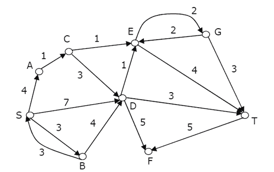
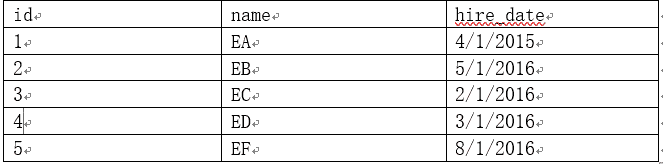
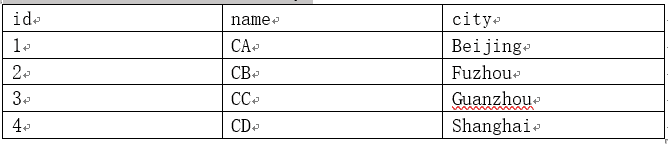
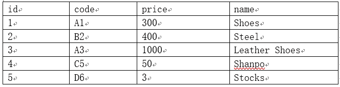
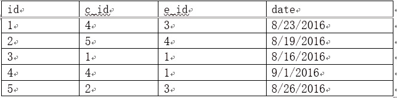
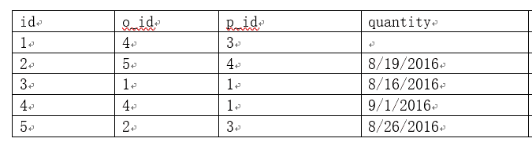

# 用友 2017 校招 web 前端笔试题（三）

## 1

在 Web 应用的集群中，经常用到一个 WEB 服务器，作为反向代理，请问下面哪些技术可以用作反向代理：(          )

正确答案: A C E   你的答案: 空 (错误)

```cpp
Apache Web Server
```

```cpp
JQuery
```

```cpp
Squid
```

```cpp
Tomcat
```

```cpp
Nginx
```

```cpp
Hadoop
```

本题知识点

前端工程师 用友 2017

## 2

REST 风格的服务已经被广泛的普及和采纳，下面关于 REST 风格服务的描述，哪些是正确的：（         ）

正确答案: B D F   你的答案: 空 (错误)

```cpp
REST 风格的服务，数据以 HTTP 协议交换，数据编码格式为 JSON 数据格式
```

```cpp
REST 风格的服务，充分利用了 HTTP 的方法语义，实现服务的语义，如 PUT, DELETE, GET, POST 等
```

```cpp
REST 风格的服务很适合服务器之间进行高效的通信
```

```cpp
REST 风格的服务非常符合现代 WEB 应用的需要，能够实现有效的前后端分离模式
```

```cpp
REST 风格的服务比 SOAP-WebService 更具有效率,并且具有更强大的语义表达能力
```

```cpp
REST 服务建议把服务当作资源，每个资源都有唯一的 URI 标识，通过这个 URI 标识访问和控制 REST 服务
```

本题知识点

前端工程师 用友 2017

## 3

下面的语言中哪些语言是动态语言(       )

正确答案: B   你的答案: 空 (错误)

```cpp
C
```

```cpp
JavaScript
```

```cpp
C++
```

```cpp
CSS
```

```cpp
Java
```

```cpp
Objective-C
```

本题知识点

前端工程师 用友 Javascript 2017

讨论

[十字路口上方向你来选](https://www.nowcoder.com/profile/918012753)

静态语言（强类型语言）

静态语言是在编译时变量的数据类型即可确定的语言，多数静态类型语言要求在使用变量之前必须声明数据类型。 
例如：C++、Java、Delphi、C#等。

动态语言（弱类型语言）

动态语言是在运行时确定数据类型的语言。变量使用之前不需要类型声明，通常变量的类型是被赋值的那个值的类型。 
例如 PHP/ASP/Ruby/Python/Perl/ABAP/SQL/JavaScript/Unix Shell 等等。

发表于 2019-09-07 23:48:53

* * *

[牛客 379504956 号](https://www.nowcoder.com/profile/379504956)

比如，对于 C 语言来说，int 就是整型，对于 JavaScript，var 可以定义很多类型的数据

发表于 2021-09-16 16:26:45

* * *

[老蔡老瘦了](https://www.nowcoder.com/profile/711056976)

动态语言就是数据类型声明时不明确，后面可随需要进行数据类型的改变。静态语言则是声明即确定

发表于 2021-07-23 20:03:10

* * *

## 4

下面关于数据库范式的说法哪些是正确的：（       ）

正确答案: A D E   你的答案: 空 (错误)

```cpp
关系型数据库设计必须符合第一范式，在这种范式下一个数据列只能有一个值
```

```cpp
数据库设计范式的引入，提高了数据库访问的效率
```

```cpp
数据库表设计[学号，学生姓名、年龄、性别、课程号、课程名称 课程学分]满足第二范式，但不满足第三范式
```

```cpp
满足第四范式必然满足第三范式，满足第三范式必然满足第二范式
```

```cpp
通过数据范式的引入，可以减少数据冗余，消除数据操作异常
```

```cpp
数据库设计时，符合的范式的等级越高越好
```

本题知识点

前端工程师 用友 数据库 2017

讨论

[你今天学到了啥](https://www.nowcoder.com/profile/969193193)

我感觉这尼玛哪儿是在考数据库，分明是在考语文

发表于 2019-11-29 16:18:21

* * *

[欢乐马仔](https://www.nowcoder.com/profile/128647518)

可参考以下链接： https://www.cnblogs.com/ktao/p/7775100.html

发表于 2019-10-14 09:41:04

* * *

[⁶^^](https://www.nowcoder.com/profile/659401517)

 1NF:列值一个，原子性，不能是集合等；2NF：消除部分函数依赖，即实体属性完全函数依赖于关键字
3NF：消除传递函数依赖 BCNF：消除对主码子集的依赖
高层范式满足低层范式

发表于 2019-10-06 16:18:54

* * *

## 5

下面的一些说法哪些是正确的：(        )

正确答案: B C   你的答案: 空 (错误)

```cpp
缓存策略中基于 LRU 的淘汰策略，在缓存满时，会把最近进入缓存的数据先淘汰，以保持高的命中率
```

```cpp
中缀表达式 A+(B+C)*D 的后缀表但式为: ABC+D*+
```

```cpp
堆栈是一种 LIFO 的数据结构
```

```cpp
高级语言通过编译或者即时编译(JIT)后成为汇编语言被机器装载执行
```

```cpp
TCP 协议和 UDP 协议都在 IP 协议之上，TCP 是面向连接的,UDP 是面向非连接的，但无论 TCP 还是 UDP 建立通信都需要一次握手，以确保对方的端口已经打开
```

```cpp
现代的操作系统一般都分为用户态和内核态，用户态和内核态的切换是经常发生的，程序员不需要对内核态和用户态的切换进行编程关注
```

本题知识点

前端工程师 用友 栈 *2017* *讨论

[王之盾](https://www.nowcoder.com/profile/678560566)

堆是什么，我懂。栈是什么，我懂。你把他们俩凑在一块儿，我看不懂。

发表于 2020-04-02 14:24:26

* * *

[sweet9251](https://www.nowcoder.com/profile/785424706)

一般的编译器，是先将高级语言转换成汇编语言（中间代码），然后在汇编的基础上优化生成 OBJ 目标代码，最后 Link 成可执行文件 UDP 通讯有四个参数：源 IP、源端口、目的 IP 和目的端口。而 TCP 通讯至少有有六个参数：源 IP、源端口、目的 IP 和目的端口，以及序列号和应答号。
序列号和应答号是 TCP 通讯特有的参数，TCP 通讯利用序列号和应答号来保持和确认数据的关联与正确性，是在三次握手中确定的，不正确的序列号和应答号会导致无法正常通讯。因此对 TCP 连接的连接概念可以简单理解成为同 UDP 通讯相比，用序列号和应答号确定了相互之间的连接特征，来保证数据传输的正确性。 UDP 直接发送消息就可以了.,不需要建立连接  那么我们如何实现内核态和用户这种机制态的呢？

```cpp

		1.  1.我们知道内核态和用户态的区别就是对于资源的访问权限不一样。那么我们如何实现这样的权限？这需要对程序执行的每一条指令进行检查才能完成,  这种检查就是地址翻译。程序发出一条指令都需要经过这个地址翻译过程，从而我们通过控制翻译，就可以限制程序对资源的访问。2.而内核态对所有资源都有特权,  所以内核程序都是直接绕过内存地址翻译而直接执行特权指令。

``` 

发表于 2019-09-11 11:35:16

* * *

[Despacito007](https://www.nowcoder.com/profile/893487814)

一道题考了网络编程 数据结构 编译原理 通信协议和操作系统...

发表于 2020-10-23 21:24:17

* * *

## 6

关于内存管理的描述，下面哪些描述是正确的（       ）

正确答案: C D   你的答案: 空 (错误)

```cpp
现代操作系统都引入了虚拟内存技术，在虚拟内存下机制下，每个进程都似乎拥有全部的内存资源，但其实是以一种隔离的方式共同使用同样的底层无物理内存，因此虚拟内存提高了程序的运行效率
```

```cpp
Java 中所有用户数据的内存都是分配在 Java 的堆内存中的
```

```cpp
C 语言通过 malloc 和 free 分配内存，通过 realloc 对一个地址指向的内存在分配
```

```cpp
当系统内存管理中出现频繁的页面换入换出时，系统地性能会大受影响
```

```cpp
内存是现代计算机 CPU 能访问的最快的存储单元，所以尽量的把数据放入内存能够提升数据访问效率
```

```cpp
现代语言提供了内存的垃圾回收机制后，操作系统的内存管理不再是必须的了
```

本题知识点

前端工程师 用友 操作系统 2017

讨论

[JJ 剑](https://www.nowcoder.com/profile/3252406)

（A）的话对于单个程序来讲，若无虚拟内存，他的程序以及数据都会全部装进（如果可以的话）内存，而引入虚拟内存机制以后，会发生缺页中断，反而影响其运行效率，所以最后一句话的说法应该不太合理！

发表于 2019-11-14 17:36:27

* * *

[乔乔 201909151609884](https://www.nowcoder.com/profile/632930974)

A 为什么不对呢？

发表于 2019-09-23 20:59:18

* * *

[Finalize](https://www.nowcoder.com/profile/942626508)

c 选项说法也有问题吧，free 函数不是回收内存的吗？

发表于 2020-03-07 14:54:23

* * *

## 7

下面哪些特性不是 HTML5 新引入的特性：(        )

正确答案: C E   你的答案: 空 (错误)

```cpp
audio 和 video 支持
```

```cpp
Canvas
```

```cpp
AJAX
```

```cpp
localStorage
```

```cpp
ES6
```

```cpp
WebSocket
```

本题知识点

前端工程师 用友 HTML 2017

讨论

[祯民](https://www.nowcoder.com/profile/463267767)

WebSocket 是 HTML5 开始提供的一种在单个 TCP 连接上进行全双工通讯的协议。

WebSocket 使得客户端和服务器之间的数据交换变得更加简单，允许服务端主动向客户端推送数据。在 WebSocket API 中，浏览器和服务器只需要完成一次握手，两者之间就直接可以创建持久性的连接，并进行双向数据传输。

发表于 2019-09-27 16:26:55

* * *

[tlltll](https://www.nowcoder.com/profile/984905694)

我选了 ABDF，完美避开正确选项😂😂

发表于 2020-09-20 14:25:30

* * *

[木青蜂](https://www.nowcoder.com/profile/225108753)

Ajax（AsynchronousJavaScriptand XML），直译为“异步的 JavaScript 与 XML 技术”，是一种创建交互式网页应用的网页开发技术，用于创建快速***页，由杰西·詹姆士·贾瑞特所提出。与传统的 Web 应用相比，Ajax 通过浏览器与服务器进行少量的数据交换就可以实现网页的异步更新，在不重新加载整个网页的情况下，即可对网页进行更新。

发表于 2020-08-24 17:12:11

* * *

## 8

JSP 中提供了一些内置的对象，可以访问不同作用范围中的数据，请问下面哪些描述是正确的：（        ）

正确答案: A C E   你的答案: 空 (错误)

```cpp
只有在 jsp 允许会话的时候，jsp 才会提供内置对象 session
```

```cpp
request 内置对象存放请求级的数据，我们可以保存 request 对象，在处理下次请求时再把保存的 request 拿出来，以建立请求之间的关系
```

```cpp
pageContext 内置对象通常存放页面级的变量，经常被用于 tag 开发中，为页面变量赋值，JSP 页面可以直接使用这些变量
```

```cpp
response 是一个内置对象，它用于存储该次 WEB 请求的共享数据
```

```cpp
application 是一个内置对象，它管理整个应用共享的数据
```

```cpp
session 和 application 是性能杀手，应该慎用
```

本题知识点

前端工程师 用友 2017

## 9

Java 是一门支持反射的语言,基于反射为 Java 提供了丰富的动态性支持，下面关于 Java 反射的描述，哪些是错误的：(          )

正确答案: A D F   你的答案: 空 (错误)

```cpp
Java 反射主要涉及的类如 Class, Method, Filed,等，他们都在 java.lang.reflet 包下
```

```cpp
通过反射可以动态的实现一个接口，形成一个新的类，并可以用这个类创建对象，调用对象方法
```

```cpp
通过反射，可以突破 Java 语言提供的对象成员、类成员的保护机制，访问一般方式不能访问的成员
```

```cpp
Java 反射机制提供了字节码修改的技术，可以动态的修剪一个类
```

```cpp
Java 的反射机制会给内存带来额外的开销。例如对永生堆的要求比不通过反射要求的更多
```

```cpp
Java 反射机制一般会带来效率问题，效率问题主要发生在查找类的方法和字段对象，因此通过缓存需要反射类的字段和方法就能达到与之间调用类的方法和访问类的字段一样的效率
```

本题知识点

前端工程师 用友 Java 2017

讨论

[HCh1018](https://www.nowcoder.com/profile/235241453)

反射指的是在运行时能够分析类的能力的程序。
反射机制可以用来：1.在运行时分析类的能力--检查类的结构--所用到的就是**java.lang.reflect 包中的 Field、Method、Constructor，**分别用于描述类的与、方法和构造器。A 中的**Class 类在 java.lang 中**。2.在运行时查看对象。3.实现通用的数组操作代码。**反射机制的功能：**在运行时判断任意一个对象所属的类；在运行时构造任意一个类的对象；在运行时判断任意一个类所具有的成员变量和方法；在运行时调用任意一个对象的方法；生成动态***。**反射机制常见作用：**动态加载类、动态获取类的信息（属性、方法、构造器）；动态构造对象；动态调用类和对象的任意方法、构造器；动态调用和处理属性；获取泛型信息（新增类型：ParameterizedType,GenericArrayType 等）；处理注解（反射 API:getAnnotationsdeng 等）。**反射机制性能问题：**
反射会降低效率。void setAccessible(boolean flag):是否启用访问安全检查的开关，true 屏蔽 Java 语言的访问检查，使得对象的私有属性也可以被查询和设置。禁止安全检查，可以提高反射的运行速度。
可以考虑使用：cglib/javaassist 操作。上述资料来源：《Java 核心技术 卷 I》，网络课程资料。

发表于 2019-09-06 16:24:11

* * *

[还没睡呢](https://www.nowcoder.com/profile/742532381)

A ：Filed、Method Constructor 分别分别用与描述类的与、方法和构造器。 在 Java.lang.reflet 包中而 Class 而是在 Java.lang 中

B：是对的 ，动态代理就是通过实现接口的 ，然后我们可以通过类的路径可以的到类的全部信息。（可以看下动态代理的原理：https://blog.csdn.net/qq_44968635/article/details/93986222?ops_request_misc=%257B%2522request%255Fid%2522%253A%2522158400259819725211944322%2522%252C%2522scm%2522%253A%252220140713.130056874..%2522%257D&request_id=158400259819725211944322&biz_id=0&utm_source=distribute.pc_search_result.none-task）

C：反射的概念中提到过 反射可以通过类的路径来得到该类的全部信息。

D：反射可以动态的调用类和对象的任意方法

E：反射的缺点是对性能有影响

F：反射会降低效率，可是设置禁止安全检查，来提高反射的运行速度；

反射常见的作用有：动态加载类、动态获取类的信息（属性、方法、构造器）；

动态构造对象；动态调用类和对象的任意方法、构造器；

动态调用和处理属性；

获取泛型信息；处理注解

编辑于 2020-03-12 16:48:05

* * *

[为道日损](https://www.nowcoder.com/profile/8232679)

ADF 解析：
A.Class 类在 java.lang 包下；B.正确 C.通过反射，可以突破 Java 语言提供的对象成员、类成员的保护机制，访问一般方式不能访问的成员，通过 setAccessible 设置 true 屏蔽访问检查；D.反射是用来访问类和实例化，并不能进行修剪字节码。
E.反射的确比普通的创建对象要消耗性能，需要查找对应的字符串所在的类，遍历方法，判断变量和函数的属性等等 F.提高 java 反射的效率并不是通过缓存方法和变量，而是设置 setAccessible 设置 true 屏蔽访问检查

发表于 2020-07-21 16:36:15

* * *

## 10

文具盒中有红色笔 3 至，蓝色笔 2 支，随机挑出两只笔，画两个圆圈，问都是红色的概率是多少：

你的答案

本题知识点

前端工程师 用友 2017

## 11

请问按照下面的排列规律，空白处应该是什么：e9  179  262  (    )  63d a18

你的答案

本题知识点

前端工程师 用友 2017

## 12

下面程序段的时间复杂度为 ________。(n>1)

```cpp
sum=1；
for (i=0;sum<n;i++) 
sum+=1
```

你的答案

本题知识点

前端工程师 用友 2017

## 13

在下图中找到从 S 节点开始，到达目标节点 T，请根据 Dijkstra 最短路径算法，找出一条最短路径。图中的边上的数字是两个节点的距离，箭头方向只是示意走动方向，不代表单向连通

你的答案

本题知识点

前端工程师 用友 2017

## 14

猴子第一天摘下若干个桃子，当即吃了一半，还不瘾，又多吃了一个,第二天早上又将剩下的桃子吃掉一半，又多吃了一个。以后每天早上都吃了前一天剩的一半零一个。到第 10 天早上想再吃时，见只剩下一个桃子了。求第一天共摘了多少（也可以用程序说明一下计算过程，不用最终结果）

你的答案

本题知识点

前端工程师 用友 2017

## 15

什么是数据库视图？物化视图和普通视图的区别？

你的答案

本题知识点

前端工程师 用友 2017

## 16

位运算是常见的运算，计算机内部运算时所有的数都是以二进制进行表达的，移位运算是常见的运算，移位包括左移和右移，右移时包括符号右移和无符号右移，现在有个八位的整数-4， 请问在符号右移两位和无符号右移两位的十进制数值分别是多少：

你的答案

本题知识点

前端工程师 用友 2017

## 17

下面这个 HTML 和 JavaScript 程序结合的片断：

```cpp
<button>Button 1!
</button><button>Button 2!
</button><button>Button 3!
</button>var prizes = ['IPHONE', 'Football', 'BMW'];
for (var btnNum = 0; btnNum < prizes.length; btnNum++) {
document.getElementById('btn-' + btnNum).onclick = function() {
console.log(prizes[btnNum]);
};
}
```

你的答案

本题知识点

前端工程师 用友 2017

## 18

Java 核心类库中的 HashSet 和 TreeSet 有什么区别？

你的答案

本题知识点

前端工程师 用友 2017

## 19

请问工厂方法模式和抽象工厂模式有什么区别？

你的答案

本题知识点

前端工程师 用友 2017

讨论

[辰汐](https://www.nowcoder.com/profile/567855609)

**工厂方法模式： 一个抽象产品类，可以派生出多个具体产品类。  一个抽象工厂类，可以派生出多个具体工厂类。    每个具体工厂类只能创建一个具体产品类的实例。  抽象工厂模式： 多个抽象产品类，每个抽象产品类可以派生出多个具体产品类。    一个抽象工厂类，可以派生出多个具体工厂类。    每个具体工厂类可以创建多个具体产品类的实例。         区别： 工厂方法模式只有一个抽象产品类，而抽象工厂模式有多个。    工厂方法模式的具体工厂类只能创建一个具体产品类的实例，而抽象工厂模式可以创建多个。**

**摘自知乎**

发表于 2019-06-23 14:27:12

* * *

## 20

实现一个单向顺序链表，链表中存储的数据为整型数，要求提供 add、contains 和 remove 方法，表示新增和删除结点，链表没有容量限制（假设内存够用）

你的答案

本题知识点

前端工程师 用友 2017

## 21

删除一个字符串中前面出现过的字符，只保留首次出现的字符， 例如

"hello  it is a test and you can do it will"。

输出结果为："helo itsandyucw"

你的答案

本题知识点

前端工程师 用友 2017

## 22

贷款是个复杂的流程，中间会遇到各种审批环节，在一个审批过程中，只要有一个环节审批不通过，整个贷款就会被否决， 假设贷款申请类为 Loan,贷款人的信用信息和本次贷款的背景、以及审批过程的流程数据存在 LoanContext 审批接口为：

```cpp
public interface IApprove  
{
 boolean
approve(LoanContext ctx,  Loan loan);
}
```

1). 请设计这么一个系统称为 LoanManager，支持动态的添加审批环节，支持这种审批业务。

2). 如果审批算法发生变化，比如中间审批，只要老板审批通过，不管其他审批是否审批通过系统都审批通过，为了适应这种需求，需要动态的修改和调整审批算法，你要如何重构代码呢？

你的答案

本题知识点

前端工程师 用友 2017

## 23

有一个数据库，包括雇员表(employee), 客户表(customer)、产品表和订单表(Order), 订单明细(orderline) 它们的数据如下：

雇员表：ID，名字(name)， 雇佣日期(hire_date) 客户:ID, 名称(name)，城市(city) 产品表：ID,产品编码(code)，价格(price)，名称(name)

 订单：ID, 客户 ID(c_id), 签单雇员 ID(e_id), 签单日期

 订单明细：ID, 订单 ID(o_id), 产品 id(p_id), 订单数量(quantity)

 问题 1: 写一个程序，统计产品的畅销情况,显示产品的编码、名称，销售数量

问题 2：统计最具价值员工,最具价值员工是销售订单总额最大的员工,显示员工名字和销售金额 

你的答案

本题知识点

前端工程师 用友 2017

## 24

平面中给定一个点，和一条线段，判断这个点是否在这个线段上，假设点类为

```cpp
class Point {
  int x;
  int y;
}
```

线段两个点位 v1, v2, 需要测试的点位 p, 请实现一个简单的程序判断这个点是否在线段上

你的答案

本题知识点

前端工程师 用友 2017*