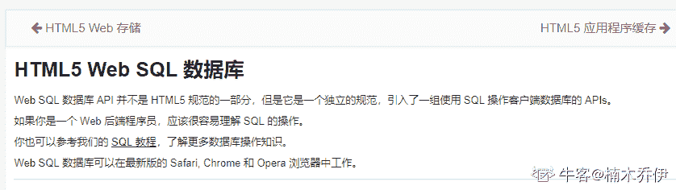
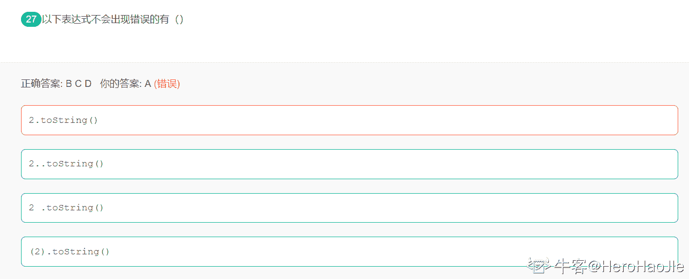

# 用友 2018 校招 web 前端笔试题（二）

## 1

下列描述正确的是（）

正确答案: A D   你的答案: 空 (错误)

```cpp
HTML 指的是超文本标记语言（Hyper Text Markup Language）
```

```cpp
<a href="url" target="new">可以打开新窗口
```

```cpp
可以插入图片
```

```cpp
<body background="background.gif">可以插入背景图
```

本题知识点

前端工程师 用友 HTML 2018

讨论

[橘子橘子橘子皮](https://www.nowcoder.com/profile/8604073)

b:打开新窗口 target=“_blank”c:插入图片： src="image.gif"d:第一次见，不过试了可以的

发表于 2020-01-29 17:48:08

* * *

[灵魂的尽头](https://www.nowcoder.com/profile/162411872)

谁出的题

发表于 2019-09-24 16:04:48

* * *

[li_super](https://www.nowcoder.com/profile/2896062)

BC 选项描述不清楚

发表于 2019-07-05 15:37:20

* * *

## 2

下列 html tag 中属于块级元素（block element）有（）

正确答案: B D   你的答案: 空 (错误)

```cpp
span
```

```cpp
ol
```

```cpp
img
```

```cpp
ul
```

本题知识点

前端工程师 用友 HTML 2018

讨论

[方圆几里 11](https://www.nowcoder.com/profile/195682106)

行内元素：行内大多为描述性标记，<span>...</span><a>...</a><b>...</b><i>...</i>

块级元素：块级元素大多为结构性标记，<table>...</table> 表格<form>...</form> 表单 <h1>...</h1> 标题一级<h2>...</h2> 标题二级<h3>...</h3> 标题三级<h4>...</h4> 标题四级 <p>...</p> 段落

发表于 2020-07-28 09:42:27

* * *

[牛客 517312571 号](https://www.nowcoder.com/profile/517312571)

块级元素: 标题 列表 ol ul li dl dt dd 排版 p div hr center pre 表格 table 表单 form

发表于 2020-09-29 11:33:05

* * *

[益阳雷佳音](https://www.nowcoder.com/profile/549218159)

妈的有时候又是行内块元素可以，有时候其他题目又不可以，都不知道怎么选了

发表于 2020-09-08 09:40:27

* * *

## 3

在下列的 HTML 中，哪个可以添加背景颜色？ ()

正确答案: C D   你的答案: 空 (错误)

```cpp
<body color="yellow">
```

```cpp
<background>yellow</background>
```

```cpp
<body bgcolor="yellow">
```

```cpp
<body style="background-color:yellow" >
```

本题知识点

前端工程师 用友 HTML 2018

讨论

[陈喆 Joey](https://www.nowcoder.com/profile/951582617)

bgcolor 是 body 标签的一个属性，用于设置 body 的背景色

发表于 2019-09-13 09:12:26

* * *

[WEBJ2EE](https://www.nowcoder.com/profile/3930151)

CDC 这种写法，再 HTML5 已不推荐

发表于 2019-12-22 13:50:46

* * *

[Akirako](https://www.nowcoder.com/profile/319234410)

<body style="background-color: #c6faf1" > </body> 设置 body 背景颜色没问题。但是，C 选项实践后能很好理解，可能是因为不常见吧，所以不知道。D 选项中的 / 有必要吗？在我的 WebStorm 软件里这样写就提示错误了呀。

发表于 2020-09-26 14:20:00

* * *

## 4

属于 html5 新增规范的有（）

正确答案: C D E   你的答案: 空 (错误)

```cpp
cookie
```

```cpp
websql
```

```cpp
sessionStorage
```

```cpp
localStorage
```

```cpp
WebSocket
```

本题知识点

前端工程师 用友 HTML 2018

讨论

[牛客 686335737 号](https://www.nowcoder.com/profile/686335737)

WebSocket 是 HTML5 开始提供的一种在单个 TCP 连接上进行全双工通讯的协议。

WebSocket 使得客户端和服务器之间的数据交换变得更加简单，允许服务端主动向客户端推送数据。在 WebSocket API 中，浏览器和服务器只需要完成一次握手，两者之间就直接可以创建持久性的连接，并进行双向数据传输。

发表于 2020-03-20 00:35:04

* * *

[楠木乔伊](https://www.nowcoder.com/profile/170885608)



发表于 2019-09-08 08:20:36

* * *

[Cxyyy](https://www.nowcoder.com/profile/619404512)

websql 并不是 HTML5 规范的一部分，而是一个独立的规范，可以用来做一些离线应用

发表于 2020-11-05 12:55:41

* * *

## 5

下列描述正确的有（）

正确答案: B C D   你的答案: 空 (错误)

```cpp
p {text-size:bold} 可以使字体变粗
```

```cpp
a {text-decoration:none} 可以使超链接没有下划线
```

```cpp
text-transform:capitalize 使首字母变为大写
```

```cpp
border-width:10px 1px 5px 20px 可以使容器的上边框 10 像素、下边框 5 像素、左边框 20 像素、右边框 1 像素
```

本题知识点

前端工程师 用友 2018 CSS

讨论

[然然 201906051709105](https://www.nowcoder.com/profile/751719972)

A 错是因为 font-weight:bold 这个是可以使字体变粗的样式

发表于 2019-06-28 17:48:02

* * *

[ぃGavin](https://www.nowcoder.com/profile/804640198)

D 这个解析就很奇葩，明明知道上右下左，一看解释没按顺序，直接 pass 了


发表于 2020-11-26 16:54:12

* * *

[郑**](https://www.nowcoder.com/profile/831241574)

A：能使字体变粗的 css 样式为 font-weight:bold，其中 font-weight 的值有 bolder（特粗体）、bold（加粗）、normal（正常）、lighter（细体），当然 font-weight 的值还可以用数值（100~900，必须为整百）进行表示 B：text-direction 是对文字添加修饰的属性，值为：none（ 默认值，没有修饰）、underline（在文本下面添加下划线）,常用的就这两个当然还有其他不常用的值，可以自行查阅；
C： text-transform 用来设置文本的大小写，值为：none（默认值，不设置）、capitalize（使文本中的每个单词的首字母大写）、uppercase（将文本中的内容转换成大写）、 lowercase（ 将文本中的内容转换成小写）；D：border-weight 的 4 个值代表的是分别是上边框、右边框、下边框、左边框的宽度

发表于 2020-02-20 22:15:40

* * *

## 6

在 CSS 中下列哪些属性可以继承的.( )

正确答案: A D   你的答案: 空 (错误)

```cpp
font-size
```

```cpp
border
```

```cpp
padding
```

```cpp
color
```

本题知识点

前端工程师 用友 2018 CSS

讨论

[Three_Stone](https://www.nowcoder.com/profile/67073033)

继承：html 元素可以从父元素那里继承一部分 css 属性，即使当前元素没有定义该属性。 1.css 可以和不可以继承的属性 不可继承的：display、margin、border、padding、background、height、min-height、max-height、width、min-width、max-width、overflow、position、left、right、top、bottom、z-index、float、clear、table-layout、vertical-align、page-break-after、page-bread-before 和 unicode-bidi。 所有元素可继承：visibility 和 cursor。 内联元素可继承：letter-spacing、word-spacing、white-space、line-height、color、font、font-family、font-size、font-style、font-variant、font-weight、text-decoration、text-transform、direction。 终端块状元素可继承：text-indent 和 text-align。 列表元素可继承：list-style、list-style-type、list-style-position、list-style-image。 表格元素可继承：border-collapse。

发表于 2019-09-22 16:55:10

* * *

[若丶相見](https://www.nowcoder.com/profile/203986803)

css 中的 UL 属性是什么属性？？？

发表于 2019-09-05 21:08:22

* * *

[_ 是清风🐾](https://www.nowcoder.com/profile/61789870)

一般莱山区，跟文字字体有关的属性可以继承 颜色大小一类的

发表于 2019-09-27 18:36:36

* * *

## 7

CSS3 新增特性有（）

正确答案: B C D   你的答案: 空 (错误)

```cpp
font-size
```

```cpp
@media
```

```cpp
@keyframes
```

```cpp
flexbox
```

本题知识点

前端工程师 用友 2018 CSS

讨论

[-兜-](https://www.nowcoder.com/profile/868091519)

[css3 新增特性](https://www.cnblogs.com/sunyang-001/p/10957925.html)

1、CSS3 选择器

2、CSS3 边框(Borders)

3、CSS3 背景

4、CSS3 渐变

5、CSS3 文本效果

6、CSS3 字体(@font-face 规则)

7、CSS3 转换和变形

1）2D 转换方法

2）3D 转换属性

8、CSS3 过度（transition 属性）

9、CSS3 动画（@keyframes 规则 animation 属性）

10、CSS3 多列

11、CSS3 盒模型

12、CSS3 伸缩布局盒模型(弹性盒子)（flexbox）

13、CSS3 多媒体查询（@media）

发表于 2020-04-17 15:38:09

* * *

[Yxq_ 玖柒](https://www.nowcoder.com/profile/813037976)

原来选一个对了，也是错的？

发表于 2019-09-22 15:12:45

* * *

[寄你泰梅](https://www.nowcoder.com/profile/522627466)

flexbox 是新增元素

发表于 2019-09-18 23:37:38

* * *

## 8

在 ES6 规范中，以下类型哪些属于基本数据类型（）

正确答案: A B C D   你的答案: 空 (错误)

```cpp
String
```

```cpp
Null
```

```cpp
Undefined
```

```cpp
Symbol
```

本题知识点

前端工程师 用友 Javascript 2018

讨论

[你能带我去哪？](https://www.nowcoder.com/profile/506272392)

*   基本数据类型（原始数据类型）：Number,String, Null, Undefined,  Boolean，Symbol（es6 新增）
*   引用数据类型：Object，Function 

编辑于 2019-10-08 16:19:48

* * *

[轩辕乖](https://www.nowcoder.com/profile/546439778)

1.  在 ES6 ***有 7 种基本数据类型：undefined、null、Boolean、String、Number、Object、Symbol
2.  undefined（未定义）：表示变量未初始化，属性不存在，函数没有返回值
3.  null（空值）：表示变量为空值
4.  Boolean（布尔值）：true 或 false
5.  String（字符串）：单引号字符串 ‘’ 或 双引号字符串 ""
6.  Number（数值）：范围 [-2⁵³, 2⁵³]
7.  Object（对象）：表示属性的集合，其中每个属性由“名/值对”构成
8.  Symbol（符号）：表示独一无二（ES6 新增）

发表于 2019-09-11 19:14:54

* * *

[星宙](https://www.nowcoder.com/profile/494943201)

官方文档所给出的解释
最新的 ECMAScript 标准定义了 8 种数据类型：

*   七种基本数据类型:
    *   布尔值（Boolean），有 2 个值分别是：true 和 false.
    *   null ， 一个表明 null 值的特殊关键字。 JavaScript 是大小写敏感的，因此 null 与 Null、NULL 或变体完全不同。
    *   undefined ，和 null 一样是一个特殊的关键字，undefined 表示变量未赋值时的属性。
    *   数字（Number），整数或浮点数，例如： 42 或者 3.14159。
    *   任意精度的整数 (BigInt) ，可以安全地存储和操作大整数，甚至可以超过数字的安全整数限制。
    *   字符串（String），字符串是一串表示文本值的字符序列，例如："Howdy" 。
    *   代表（Symbol） ( 在 ECMAScript 6 中新添加的类型).。一种实例是唯一且不可改变的数据类型。
*   以及对象（Object）。

编辑于 2021-07-14 11:58:17

* * *

## 9

以下表达式不会出现错误的有（）

正确答案: B C D   你的答案: 空 (错误)

```cpp
2.toString()
```

```cpp
2..toString()
```

```cpp
2 .toString()
```

```cpp
(2).toString()
```

本题知识点

前端工程师 用友 Javascript 2018

讨论

[小🐮客](https://www.nowcoder.com/profile/990177409)

数字后面.会被解析为小数点，而 B、C、D 则规避了这种情况。

发表于 2019-10-07 19:02:10

* * *

[HeroHaoJIe](https://www.nowcoder.com/profile/377450739)

**就**离谱**



发表于 2020-09-20 21:28:44

* * *

[祯民](https://www.nowcoder.com/profile/463267767)

2.toString()将会优先将小数点解析为数字小数点 2..toString()因为连续的两个小数点不符合 number 的格式规则，第二个小数点才会被解析为调用方法

发表于 2019-09-26 09:53:36

* * *

## 10

下列符合 ES6 规范的语法有

正确答案: A B C D E   你的答案: 空 (错误)

```cpp
let x=10
```

```cpp
const pi=3.1415926
```

```cpp
let s=Symbol()
```

```cpp
Object.assign(target,source1,source2)
```

```cpp
function *helloWorld(){yield ‘hello’; yield  ’world’;return ‘ending’}
```

本题知识点

前端工程师 用友 Javascript 2018

讨论

[旺仔大馒头](https://www.nowcoder.com/profile/8019634)

全选。
AB 比较简单，变量的赋值，正确
C：Symbol 的用法
Symbol 值通过 Symbol 函数生成。这就是说，对象的属性名现在可以有两种类型，一种是原来就有的字符串，另一种就是新增的 Symbol 类型。凡是属性名属于 Symbol 类型，就都是独一无二的，可以保证不会与其他属性名产生冲突。

```cpp
let s = Symbol();
```

D. Object.assign()方法：
Object.assign 方法用于对象的合并，将源对象（source）的所有可枚举属性，复制到目标对象（target）。

```cpp
const target = { a: 1 };

const source1 = { b: 2 };
const source2 = { c: 3 };

Object.assign(target, source1, source2);
target // {a:1, b:2, c:3}
```

Object.assign 方法的第一个参数是目标对象，后面的参数都是源对象。

E. Generator 函数
形式上，Generator 函数是一个普通函数，但是有两个特征。一是，function 关键字与函数名之间有一个星号；二是，函数体内部使用 yield 表达式，定义不同的内部状态（yield 在英语里的意思就是“产出”）。

```cpp
function* helloWorldGenerator() {
  yield 'hello';
  yield 'world';
  return 'ending';
}

var hw = helloWorldGenerator();
```

发表于 2019-09-07 16:55:56

* * *

[我有 1 只小毛驴](https://www.nowcoder.com/profile/955027508)

Symbol 类型属于 ES6 中新增的基本数据类型之一，内部没有 construtor 构造器，不能使用 new 关键字创建

发表于 2019-11-15 10:23:43

* * *

[杨子晨 1968](https://www.nowcoder.com/profile/212481252)

D. Object.assign()方法：
Object.assign 方法用于对象的合并，将源对象（source）的所有可枚举属性，复制到目标对象（target）。

| 1234567 | const target = { a: 1 };const source1 = { b: 2 };const source2 = { c: 3 };Object.assign(target, source1, source2);target // {a:1, b:2, c:3} |

Object.assign 方法的第一个参数是目标对象，后面的参数都是源对象。

E. Generator 函数
形式上，Generator 函数是一个普通函数，但是有两个特征。一是，function 关键字与函数名之间有一个星号；二是，函数体内部使用 yield 表达式，定义不同的内部状态（yield 在英语里的意思就是“产出”）。

发表于 2019-11-16 17:24:47

* * *

## 11

html5 正确的 doctype 为：1。

你的答案 (错误)

1 参考答案 (1) <!DOCTYPE html>

本题知识点

前端工程师 用友 HTML 2018

讨论

[HMR⁶⁶⁶](https://www.nowcoder.com/profile/770364686)

是一种文档声明，告诉浏览器用哪一种 html 版本显示页面

发表于 2019-10-26 23:31:10

* * *

[满城花祭泪](https://www.nowcoder.com/profile/993017732)

<!doctype html>每个 html 代码的开头，表示 html 的版本

发表于 2019-11-26 15:20:13

* * *

[牛客 706005164 号](https://www.nowcoder.com/profile/706005164)

文档声明位于 html 标签上面，告诉浏览器 html 的版本

发表于 2020-03-15 17:47:28

* * *

## 12

viewport 有 width、height、user-scalable 等属性;其中 Initial-scale 属性为：1。

你的答案 (错误)

1 参考答案 (1) 设置页面的初始缩放值，为一个数字，可以带小数。

本题知识点

前端工程师 用友 HTML 2018

讨论

[WJSHEAN](https://www.nowcoder.com/profile/3136260)

初始缩放比 页面初次加载时的缩放比

发表于 2020-01-03 09:11:56

* * *

## 13

函数

```cpp
for(var i = 0; i < 10; i++) {
setTimeout((function(e) {
return function( ) {
console.log(e);
}
})(i), 1000)
}
```

的输出结果为：1

你的答案 (错误)

1 参考答案 (1) 0，1，2，3，4，5，6，7，8，9

本题知识点

前端工程师 用友 Javascript 2018

讨论

[蝼蚁 201906051743343](https://www.nowcoder.com/profile/53387591)

题干代码相当于如下写法：

```cpp
for(var i = 0; i < 10; i++) {
setTimeout((function(e) {
let e=null;
return function( ) {
console.log(e);
}
})(i), 1000)
}
```

产生上述结果的原因主要是因为形成了闭包，同过自执行函数传递进来的变量相当于是在 return 的函数的作用域的上一级声明了一个局部变量 e,当函数执行时，会一级一级的向上查找，当查找到上一级时的发现存在局部变量 e,就不再向上查找了，因此返回的结果时 0，1，2，3......

发表于 2019-10-16 15:49:28

* * *

[夜尽灬天明丶](https://www.nowcoder.com/profile/778746584)

console 不是竖着的吗

发表于 2019-10-09 23:19:07

* * *

## 14

如下代码，newState 的输出结果为 1。

```cpp
const actions = ['a', 'b', 'c'];
const newState =
actions.reduce(
    ( (prevState, action) => prevState +
action )
);
```

你的答案 (错误)

1 参考答案 (1) abc

本题知识点

前端工程师 用友 Javascript 2018

讨论

[南鱼星⭐微笑海](https://www.nowcoder.com/profile/6839558)

initState 没有定义，不会报错吗？

发表于 2019-08-28 11:19:50

* * *

[牛客 477800392 号](https://www.nowcoder.com/profile/477800392)

该题正确写法应如下：const actions = ['a', 'b', 'c'];const newState =actions.reduce(( (prevState, action) => prevState +action ),// initState);console.log(newState);数组中的 reduce 方法可以用于数组求和，其中第一个参数是每次累加后的值，第二个参数是每次遍历的元素

发表于 2020-06-27 10:22:02

* * *

## 15

写出一个只匹配英文和数字并只能是英文开头的正则表达式 1。

你的答案 (错误)

1 参考答案 (1) /^[A-Za-z][A-Za-z0-9]*$/

本题知识点

前端工程师 用友 Javascript 2018

讨论

[牛客 489172889 号](https://www.nowcoder.com/profile/489172889)

```cpp
^[a-zA-Z][a-zA-Z\d]+
```

发表于 2020-06-24 23:52:58

* * *

[Jerryyuer](https://www.nowcoder.com/profile/915190451)

/^[a-z][a-z0-9]*/i

发表于 2020-04-01 02:50:51

* * *

[WEBJ2EE](https://www.nowcoder.com/profile/3930151)

写出一个只匹配英文和数字并只能是英文开头的正则表达式/^[a-zA-Z][a-zA-Z0-9]*/

发表于 2019-12-14 09:59:39

* * *

## 16

写出一个函数输出当天的系统时间，格式为“今天日期是：8/23/2017”

function DateDemo(){

  var d, s="今天日期是：";

你的答案

本题知识点

前端工程师 用友 2018

讨论

[建成啊](https://www.nowcoder.com/profile/233581173)

function DateDemo() {let year = new Date().getFullYear()let month = new Date().getMonth()+1let date = new Date().getDate()return `今天日期是：${date}/${month}/${year}`}
console.log(DateDemo());

发表于 2019-07-04 23:18:12

* * *

## 17

给下列 object 数组进行排序（排序条件是每个元素对象的属性个数）

```cpp
var a = {
  name: 'hanzichi',
  age: 10,
  location: 'china'
};

var b = {
  name: 'curry'
};

var c = {
  name: 'kobe',
  sex: 'male'
};

```

你的答案

本题知识点

前端工程师 用友 2018

讨论

[南鱼星⭐微笑海](https://www.nowcoder.com/profile/6839558)

```cpp
var a = {
    name: 'hanzichi',  age: 10,  location: 'china' };  var b = {
    name: 'curry' };  var c = {
    name: 'kobe',  sex: 'male' }; var object = [a, b, c]; console.log(object.sort((a, b) => { return Object.keys(a).length - Object.keys(b).length
}));
```

发表于 2019-08-28 11:21:23

* * *

## 18

在一个移动 app 中如何实现滚动加载商品数据（属性有 name、price、stock_num、imgUrl）并缓存。（原生、js 代码均可）

你的答案

本题知识点

前端工程师 用友 2018