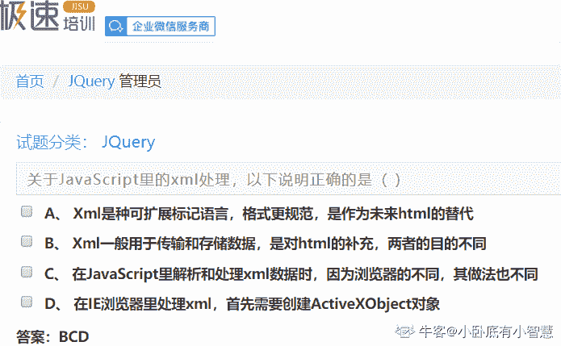

# 用友 2018 校招 web 前端笔试题（三）

## 1

以下可以被子元素继承的属性是 ()

正确答案: A D   你的答案: 空 (错误)

```cpp
font-size
```

```cpp
margin
```

```cpp
padding
```

```cpp
color
```

本题知识点

前端工程师 用友 HTML 2018 CSS

讨论

[fei 卡丘](https://www.nowcoder.com/profile/872490114)

与文字相关的属性一般都可以继承

发表于 2019-11-03 22:27:56

* * *

[阿德在学习](https://www.nowcoder.com/profile/992192426)

文字与颜色可以继承

发表于 2019-11-29 11:02:58

* * *

[冲鸭嘛](https://www.nowcoder.com/profile/49406879)

文字和大小可以被继承

发表于 2019-10-06 15:36:10

* * *

## 2

以下哪些存储方式可以实现浏览器内多个标签页之间通信？（）

正确答案: A C D   你的答案: 空 (错误)

```cpp
localStorage
```

```cpp
sessionStorage
```

```cpp
cookie
```

```cpp
indexedDB
```

本题知识点

前端工程师 用友 2018

讨论

[事情一件一件去处理](https://www.nowcoder.com/profile/2567601)

cookie 一般由服务器生成，可设置失效时间。如果在浏览器端生成 Cookie，默认是关闭浏览器后失效 localStorage 永久保存 indexedDB 用于客户端存储大量结构化数据，indexedDB 就是一个非关系型数据库 sessionStorage 仅在当前会话下有效，关闭页面或浏览器后被清除

发表于 2019-08-29 19:54:07

* * *

## 3

以下属于 JS 基本数据类型的选项是 ()

正确答案: A B D   你的答案: 空 (错误)

```cpp
undefined
```

```cpp
number
```

```cpp
interface
```

```cpp
symbol
```

本题知识点

前端工程师 用友 Javascript 2018

讨论

[门头沟传达室值班员](https://www.nowcoder.com/profile/405066145)

 JavaScript 语言的 6 种原始数据类型：undefined、null、布尔值（boolean）、字符串（string）、数值（number）、symbol 引用数据类型：对象（object）由于 js 的 bug, typeof null 为 'object'。 除了 null 以外，其余原始数据类型均可用 typeof 判断，针对引用数据类型，可以用 instanceof 进行判断

发表于 2019-09-27 22:29:27

* * *

[我心独舞](https://www.nowcoder.com/profile/405204482)

symbol 应该属于基本数据类型吧，es6 新增的

发表于 2019-09-09 19:17:05

* * *

[嗄哩露吖](https://www.nowcoder.com/profile/855236810)

js 的基本数据类型是：Undefined Null String Number Booleanes6 中的基本数据类型是：Undefined  Null String Number Boolean Object Symbol 所以 es6 和 js 还是有区别的吗？？？希望能有大神给个解答呀~~

发表于 2019-09-18 10:33:03

* * *

## 4

有关会话跟踪技术描述正确的是 ()

正确答案: A B C D   你的答案: 空 (错误)

```cpp
Cookie 是 Web 服务器发送给客户端的一小段信息，客户端请求时，可以读取该信息发送到服务器端
```

```cpp
关闭浏览器意味着会话 ID 丢失，但所有与原会话关联的会话数据仍保留在服务器上，直至会话过期
```

```cpp
隐藏表单域在客户端不可见，但可以获取到此表单的属性值
```

```cpp
在禁用 Cookie 时可以使用 URL 重写技术跟踪会话
```

本题知识点

前端工程师 用友 2018

## 5

属于 HTML5 标签语意化的元素有 ()

正确答案: A D   你的答案: 空 (错误)

```cpp
article、footer
```

```cpp
block
```

```cpp
section、banner
```

```cpp
header、nav
```

本题知识点

前端工程师 用友 HTML 2018

讨论

[🌎miss 孙](https://www.nowcoder.com/profile/36934954)

html5 手册语义化标签：

article

section

aside

hgroup

header

footer

nav

time

mark

figure

figcaption

contextmenu+menu

发表于 2019-10-20 09:57:24

* * *

[WEBJ2EE](https://www.nowcoder.com/profile/3930151)

block、banner 干脆就不是 HTML5 元素；

发表于 2019-12-22 13:17:42

* * *

[元无心](https://www.nowcoder.com/profile/224444564)

HTML 根本就没有 banner 这个元素……

发表于 2020-10-03 09:28:32

* * *

## 6

关于 JavaScript 里的 xml 处理，以下说法正确的是 ()

正确答案: B C D   你的答案: 空 (错误)

```cpp
Xml 是种可扩展标记语言，格式更规范，是作为未来 html 的替代
```

```cpp
Xml 一般用于传输和存储数据，是对 html 的补充，两者的目的不同
```

```cpp
在 JavaScript 里解析和处理 xml 数据时，因为浏览器的不同，其做法也不同
```

```cpp
在 IE 浏览器里处理 xml，首先需要创建 ActiveXObject 对象
```

本题知识点

前端工程师 用友 Javascript 2018

讨论

[高高手](https://www.nowcoder.com/profile/566035028)

**1.什么是 XML?**

> XML 指可扩展标记语言（**EXtensible Markup Language**）
> XML 是一种标记语言，很类似 HTML
> XML 的设计宗旨是传输数据，而非显示数据
> XML 标签没有被预定义。您需要自行定义标签。
> XML 被设计为具有自我描述性。
> XML 是 W3C 的推荐标准

* * *

**2.XML 与 HTML 的主要差异**

> XML 不是 HTML 的替代。
> 
> XML 和 HTML 为不同的目的而设计：
> 
> XML 被设计为传输和存储数据，其焦点是数据的内容。
> 
> HTML 被设计用来显示数据，其焦点是数据的外观。
> 
> HTML 旨在显示信息，而 XML 旨在传输信息。

发表于 2019-09-14 18:34:10

* * *

[Tienw](https://www.nowcoder.com/profile/992942680)

不是 IE 5,6 创建 XHR 对象才用 ActivXObject("Microsoft.XMLHTTP)么，IE7+及其他 Browser 都是 window.XMLHttpRequest()

发表于 2019-09-21 01:02:02

* * *

[小卧底有小智慧](https://www.nowcoder.com/profile/8991612)



发表于 2019-11-16 09:20:41

* * *

## 7

关于页面响应式布局说法正确的是 ( )

正确答案: B C   你的答案: 空 (错误)

```cpp
使用 HTML5 的语义化标签
```

```cpp
可以使用 bootsrap 框架
```

```cpp
可以利用 media query 媒体查询功能
```

```cpp
以上说法都正确
```

本题知识点

前端工程师 用友 2018 HTML

讨论

[元无心](https://www.nowcoder.com/profile/224444564)

建议 bootstrap 的题单独拿出来考。

发表于 2020-10-07 09:22:55

* * *

[咚咚呱](https://www.nowcoder.com/profile/735469384)

这题目扯淡呢？难道不用 bs 就不是响应式了吗？我用 flex 布局不行？

发表于 2020-11-04 08:54:49

* * *

[乱不能](https://www.nowcoder.com/profile/265499033)

B 答案感觉有点牵强，用了 bootstrap 框架也不一定是响应式布局啊。。。

发表于 2021-08-09 15:06:25

* * *

## 8

下面关于 this 对象的理解正确的是 ()

正确答案: A B D   你的答案: 空 (错误)

```cpp
在不手动改变 this 指向的前提下，this 总是指向函数的直接调用对象
```

```cpp
如果有 new 关键字，this 指向 new 出来的那个对象
```

```cpp
this 总是指向函数的间接调用者
```

```cpp
IE 中 attachEvent 中的 this 总是指向全局对象 window
```

本题知识点

前端工程师 用友 Javascript 2018

讨论

[燃烧黎明](https://www.nowcoder.com/profile/567164937)

箭头函数被你吃了?

发表于 2020-04-12 18:28:15

* * *

[gerorgiafab](https://www.nowcoder.com/profile/732650532)

1.在事件中，this 指向触发这个事件的对象（特殊的是：IE 中的 attachEvent 中的 this 总是指向全局对象 window）。2.this 总是指向函数的直接调用者（而非间接调用者）3.new 后面就是构造函数，构造函数中的 this 指向的就是当前的对象 

发表于 2019-09-19 11:05:09

* * *

[高高手](https://www.nowcoder.com/profile/566035028)

非间接调用者不是直接调用者吗？？？

发表于 2019-09-21 22:01:48

* * *

## 9

关于 HTTP 状态码说法正确的是 ()

正确答案: C D   你的答案: 空 (错误)

```cpp
404 表示正常返回信息
```

```cpp
302 表示永久性重定向
```

```cpp
503 表示服务器端暂时无法处理请求
```

```cpp
403 表示禁止访问
```

本题知识点

前端工程师 用友 网络基础 2018

讨论

[木各十八子](https://www.nowcoder.com/profile/932028242)

HTTP 状态码含义：

3** 重定向，要进一步操作才能完成请求

*   301：moved permanently 资源永久移动

*   302：moved temporarily 资源临时移动

*   304：not modified 资源未被修改

4** 客户端错误

*   400：bad request 请求出现语法错误

*   401：unauthorized 未经授权

*   403：forbidden 服务器收到请求，但拒绝提供服务
*   404：not found 资源不存在

5** 服务器错误

*   500：internal server error 服务器出现错误

*   503：service unavailable 服务器超负荷或停机维护，暂时不能处理客户端请求

编辑于 2019-12-30 20:38:59

* * *

[炫歌](https://www.nowcoder.com/profile/622959792)

我想问一下  这玩意咋记忆啊  就 404  知道是啥。  其他的不常见，过一段时间就忘了。

发表于 2020-07-21 17:29:39

* * *

[…Zrr](https://www.nowcoder.com/profile/286063209)

403 不是客户端可以请求，服务器拒绝执行？？所以 c？？

发表于 2020-10-08 14:55:51

* * *

## 10

Node.js 中使用 NPM 的说法正确的是 ()

正确答案: A D   你的答案: 空 (错误)

```cpp
可以安装和管理项目的依赖
```

```cpp
不可以通过 package.json 文件来管理项目信息，配置脚本
```

```cpp
不能够指明依赖项的具体版本号
```

```cpp
可以通过 package.json 指明项目依赖的具体版本
```

本题知识点

前端工程师 用友 2018

讨论

[三杯水儿](https://www.nowcoder.com/profile/90304585)

    npm 是一个连接 js 和操作系统的桥梁，也叫做 Node 包管理器（Node Package Manager ）。通常下载 Nodejs 时，npm 便会包含在内。    通过 npm install 命令(简写 npm i )安装各种包（或框架）。

```cpp
npm install 包名  
```

    下载成功后的各种依赖包会放在文件夹 node_modules 下，也同时生成并更新一个 package.json 文件（记录了各种依赖包的名称 name、包的版本号 version 等其它信息）。

发表于 2021-01-04 22:09:33

* * *

## 11

请列出 input 标签的 type 属性都可以设置哪些值（至少四种）。

你的答案

本题知识点

前端工程师 用友 2018

讨论

[牛客 43952141 号](https://www.nowcoder.com/profile/43952141)

text password submit radio chekbox

发表于 2020-02-18 15:00:16

* * *

## 12

数据和 UI 的双向绑定和单向绑定有什么区别。

你的答案

本题知识点

前端工程师 用友 2018

## 13

说说 React 中 state 和 props 的区别是什么。

你的答案

本题知识点

前端工程师 用友 2018

讨论

[凡星仔](https://www.nowcoder.com/profile/8217703)

state 是控制组件内部状态，可以通过 setState 来改变状态 props 是组件接收参数，是不可改变的值

发表于 2020-07-13 09:36:46

* * *

## 14

 JavaScript 中改变 this 关键字指向都有哪些方式。

你的答案

本题知识点

前端工程师 用友 2018

## 15

编写 JavaScript 函数，其唯一的输入参数为 URL 字符串，函数返回一个对象。返回对象中的属性包括 URL 中的全部查询字符串（Query）字段。例如，输入字符串 “[`www.yonyoucloud.com?name=yonyou&location=beijing`](https://www.yonyoucloud.com/?name=yonyou&location=beijing)” 返回 { name: “yonyou”, location: “beijing” }

你的答案

本题知识点

前端工程师 用友 2018

讨论

[牛客 173041621 号](https://www.nowcoder.com/profile/173041621)

弄

发表于 2020-07-14 13:27:41

* * *

[建成啊](https://www.nowcoder.com/profile/233581173)

let str = '[`www.yonyoucloud.com?name=yonyou&location=beijing`](https://www.yonyoucloud.com?name=yonyou&location=beijing)'// 返回 { name: “yonyou”, location: “beijing” }function sliceParams(str){let params = str.indexOf("?")let res = str.substring(params+1)let arr = res.split("&")let _obj = {}for(let obj of arr){let _arr = obj.split("=")_obj[_arr[0]] = _arr[1]}return _obj}
console.log(sliceParams(str));

发表于 2019-07-04 21:51:20

* * *

## 16

 请基于以下代码实现功能：点击 1000 个 span 元素中的任意一个，将元素内的值 alert 弹出即可。

```cpp
<div id=“box”>
    <span> 1 </span><span> 2
</span><span> 3 </span>…<span> 1000 </span>
</div>
```

你的答案

本题知识点

前端工程师 用友 2018

讨论

[建成啊](https://www.nowcoder.com/profile/233581173)

for(let i = 1; i <= 1000; i++){    let span = document.createElement("span")    span.innerHTML = i    document.body.appendChild(span)}document.body.onclick = function(e){    if (e.target.tagName == 'BODY') {    return false    } else {console.log(e.target.innerHTML);    }}

发表于 2019-07-04 22:04:22

* * *

## 17

请封装 JavaScript 中的数组内置方法 sort()，实现快速降序排序，如： var arr = [45, 32, ‘12’, 39, ‘59’];

你的答案

本题知识点

前端工程师 用友 2018

讨论

[建成啊](https://www.nowcoder.com/profile/233581173)

var arr = [45, 32, '12', 39, '59'];let arrLen = arr.length; //保存数组长度 function sortDesc(array){let _arr = [] //由大到小依次 push 到此数组 let index = 0 //最大值的索引// 将原数组中所有值的类型转为字符串 arr = arr.map(v => v.toString())
for (let i = 0; i < arrLen; i++) {// 获取最大值 let max = Math.max(...arr).toString()// 获取最大值对应的索引 index = arr.indexOf(max)// 将最大值 push 到新数组 _arr.push(max)// 从原数组中删除最大值 arr.splice(index,1)}return _arr}
console.log(sortDesc(arr));

发表于 2019-07-04 22:38:00

* * *