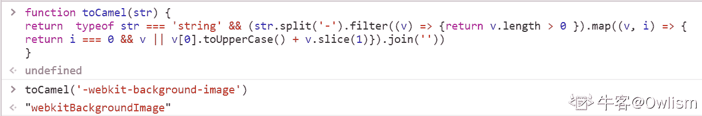

# 用友 2019 校招 web 前端笔试题（一）

## 1

TCP/IP 协议规定为几层？

正确答案: A   你的答案: 空 (错误)

```cpp
4 层
```

```cpp
5 层
```

```cpp
6 层
```

```cpp
7 层
```

本题知识点

前端工程师 用友 网络基础 2019

讨论

[悦千言](https://www.nowcoder.com/profile/320259883)


发表于 2019-09-25 12:06:33

* * *

[yl233](https://www.nowcoder.com/profile/85770921)

链接：[`www.nowcoder.com/questionTerminal/5bc54d17b77b41b6b92a6990fc9f1e46`](https://www.nowcoder.com/questionTerminal/5bc54d17b77b41b6b92a6990fc9f1e46)
来源：牛客网
[TCP/IP 协议](http://baike.baidu.com/view/7649.htm)，或称为 TCP/IP 协议栈，或互联网协议系列。TCP/IP 协议栈（按[TCP/IP 参考模型](http://baike.baidu.com/view/1792 敏感词.htm)划分），TCP/IP 分为 4 层，不同于 OSI，他将 OSI 中的会话层、表示层规划到应用层。

*   [应用层](http://baike.baidu.com/view/239619.htm)FTP SMTP HTTP ...
*   [传输层](http://baike.baidu.com/view/239605.htm)TCP UDP
*   IP 网络层 IP ICMP IGMP
*   [网络接口层](http://baike.baidu.com/view/4022168.htm)ARP RARP[以太网](http://baike.baidu.com/view/848.htm)[令牌环](http://baike.baidu.com/view/54261.htm)FDDI ...

包含了一系列构成互联网基础的[网络协议](http://baike.baidu.com/view/16603.htm)。

发表于 2019-06-16 21:58:38

* * *

[牛客 183385324 号](https://www.nowcoder.com/profile/183385324)


发表于 2020-03-04 12:24:29

* * *

## 2

在以下四个 WWW 网址中，哪一个网址不符合 WWW 网址书写规则？

正确答案: D   你的答案: 空 (错误)

```cpp
www.yonyou.com
```

```cpp
www.yonyou.org.cn
```

```cpp
www.yonyou.net.jp
```

```cpp
www.yonyou.cn.edu
```

本题知识点

前端工程师 用友 网络基础 2019

讨论

[小芥末](https://www.nowcoder.com/profile/225153930)

[.cn](https://baike.baidu.com/item/.cn)代表中国，以.cn 结尾即中国国内域名，适用于其国内各机构、企业，常称为英文国内顶级域名，.CN 类英文域名。1997 年 12 月 31 日诞生并开通。注册局为[CNNIC](https://baike.baidu.com/item/CNNIC)。按国家规定划分六类二级域名，后缀：
.com.cn .net.cn .org.cn .gov.cn .edu.cn。现在已开放.cn 二级域名注册。

发表于 2019-06-24 09:10:08

* * *

[一只想要 Offer 的菜鸡](https://www.nowcoder.com/profile/156022867)

WWW 网址中，用来表示国家的域名应该放在最后一部分。cn 应该放最后

发表于 2019-08-12 17:04:49

* * *

[牛客 183385324 号](https://www.nowcoder.com/profile/183385324)

**.jp** is the [Internet](https://en.wikipedia.org/wiki/Internet) [country code](https://en.wikipedia.org/wiki/Country_code) [top-level domain](https://en.wikipedia.org/wiki/Top-level_domain) ([ccTLD](https://en.wikipedia.org/wiki/CcTLD)) for [Japan](https://en.wikipedia.org/wiki/Japan). 

发表于 2020-03-04 12:49:20

* * *

## 3

Linux 系统中建立一个新文件可以使用的命令为？

正确答案: D   你的答案: 空 (错误)

```cpp
chmod
```

```cpp
more
```

```cpp
cp
```

```cpp
touch
```

本题知识点

用友 Linux 2019

讨论

[菜粥](https://www.nowcoder.com/profile/5293318)

Linux touch 命令用于修改文件或者目录的时间属性，包括存取时间和更改时间。**若文件不存在，系统会建立一个新的文件。**

发表于 2020-09-08 16:11:57

* * *

[四月的紫色花](https://www.nowcoder.com/profile/858930982)

chmod 赋权限

more 类似于 cat，内容较多时可一页一页的翻看

cp 复制

touch 可创建文件

发表于 2019-12-05 22:28:15

* * *

[名字只是一个称呼](https://www.nowcoder.com/profile/691497524)

Linux touch 命令用于修改文件或者目录的时间属性，包括存取时间和更改时间。若文件不存在，系统会建立一个新的文件；Linux/Unix 的文件调用权限分为三级 : 文件拥有者、群组、其他。利用 chmod 可以藉以控制文件如何被他人所调用； Linux more 命令类似 cat ，不过会以一页一页的形式显示，更方便使用者逐页阅读，而最基本的指令就是按空白键（space）就往下一页显示，按 b 键就会往回（back）一页显示，而且还有搜寻字串的功能（与 vi 相似），使用中的说明文件，请按 h ；Linux cp 命令主要用于复制文件或目录 

发表于 2019-10-12 10:08:18

* * *

## 4

单位中存在关系 R(员工号，姓名，职位，职级)，假设职级可以由职位唯一确定，以下正确使用第三范式规范化的是

正确答案: C   你的答案: 空 (错误)

```cpp
R1（员工号，姓名） R2（职位，职级）
```

```cpp
R1（员工号，姓名） R2（员工号，职位，职级）
```

```cpp
R1（员工号，姓名，职位） R2（职位，职级）
```

```cpp
以上均不对
```

本题知识点

前端工程师 用友 数据库 2019

讨论

[cMo](https://www.nowcoder.com/profile/120428046)

第三范式，要求非关键字段对主键唯一依赖，非关键字段间是相互独立的。

发表于 2019-09-03 20:00:36

* * *

[夏花爱秋叶](https://www.nowcoder.com/profile/4085682)

第三范式消除了传递函数依赖，员工号可以确定职位，员工号不能确定职级，而职位可以确定职级，所以存在传递函数依赖

发表于 2020-02-19 10:56:41

* * *

[喜一阿夏](https://www.nowcoder.com/profile/646204872)

a 选项中两个表没有联系在一起

发表于 2020-09-08 20:47:03

* * *

## 5

以下什么模型引入了“风险驱动”的思想，适用于大规模的内部开发项目？

正确答案: C   你的答案: 空 (错误)

```cpp
原型模型
```

```cpp
增量模型
```

```cpp
螺旋模型
```

```cpp
喷泉模型
```

本题知识点

前端工程师 用友 软件工程 2019

讨论

[牛客 424300615 号](https://www.nowcoder.com/profile/424300615)

螺旋模型是增加了风险分析的 快速原型模型 和 瀑布模型的混合

发表于 2019-12-05 21:03:20

* * *

[牛客 183385324 号](https://www.nowcoder.com/profile/183385324)

原型： 瀑布+迭代喷泉：面对对象生命周期模型增量螺旋

发表于 2020-03-04 13:05:14

* * *

[張曉文 20190926213209](https://www.nowcoder.com/profile/771323144)

c

发表于 2019-09-26 21:39:01

* * *

## 6

下面有关 JavaScript 中 call 和 apply 的描述，错误的是？

正确答案: C   你的答案: 空 (错误)

```cpp
apply 传入的是一个参数数组，也就是将多个参数组合成为一个数组传入
```

```cpp
call 与 apply 都属于 Function.prototype 的一个方法，所以每个 function 实例都有 call、apply 属性
```

```cpp
两者传递的参数不同，call 函数第一个参数都是要传入给当前对象的对象，apply 不是
```

```cpp
call 传入的则是直接的参数列表。call 方法可将一个函数的对象上下文从初始的上下文改变为由 thisObj 指定的新对象。
```

本题知识点

前端工程师 用友 Javascript 2019

讨论

[one154](https://www.nowcoder.com/profile/8495710)

做个搬运工，不用百度了，一看就能理解

https://wy310.cn/2019/12/18/what-is-call-and-apply/

发表于 2019-12-30 08:49:05

* * *

[yzl520](https://www.nowcoder.com/profile/936059832)

【摘自 JavaScript 高级程序设计】

函数还有两个方法：apply()和 call()。这两个方法都会以指定的 this 值来调用函数，即会设置调用函数时函数体内 this 对象的值。apply()方法接收两个参数：函数内 this 的值和一个参数数组。第二个参数可以是 Array 的实例，但也可以是 arguments 对象。来看下面的例子：

```cpp
function sum(num1, num2) {
  return num1 + num2;
}

function callSum1(num1, num2) {
  return sum.apply(this, arguments); // 传入 arguments 对象
}

function callSum2(num1, num2) {
  return sum.apply(this, [num1, num2]); // 传入数组
}

console.log(callSum1(10, 10));  // 20
console.log(callSum2(10, 10));  // 20
```

在这个例子中，callSum1()会调用 sum()函数，将 this 作为函数体内的 this 值（这里等于 window，因为是在全局作用域中调用的）传入，同时还传入了 arguments 对象。callSum2()也会调用 sum()函数，但会传入参数的数组。这两个函数都会执行并返回正确的结果。

> 注意 在严格模式下，调用函数时如果没有指定上下文对象，则 this 值不会指向 window。除非使用 apply()或 call()把函数指定给一个对象，否则 this 的值会变成 undefined。

call()方法与 apply()的作用一样，只是传参的形式不同。第一个参数跟 apply()一样，也是 this 值，而剩下的要传给被调用函数的参数则是逐个传递的。换句话说，通过 call()向函数传参时，必须将参数一个一个地列出来，比如：

```cpp
function sum(num1, num2) {
  return num1 + num2;
}

function callSum(num1, num2) {
  return sum.call(this, num1, num2);
}

console.log(callSum(10, 10)); // 20
```

这里的 callSum()函数必须逐个地把参数传给 call()方法。结果跟 apply()的例子一样。到底是使用 apply()还是 call()，完全取决于怎么给要调用的函数传参更方便。如果想直接传 arguments 对象或者一个数组，那就用 apply()；否则，就用 call()。当然，如果不用给被调用的函数传参，则使用哪个方法都一样。

apply()和 call()真正强大的地方并不是给函数传参，而是控制函数调用上下文即函数体内 this 值的能力。考虑下面的例子：

```cpp
window.color = 'red';
let o = {
  color: 'blue'
};

function sayColor() {
  console.log(this.color);
}

sayColor();             // red

sayColor.call(this);    // red
sayColor.call(window);  // red
sayColor.call(o);       // blue
```

这个例子是在之前那个关于 this 对象的例子基础上修改而成的。同样，sayColor()是一个全局函数，如果在全局作用域中调用它，那么会显示"red"。这是因为 this.color 会求值为 window.color。如果在全局作用域中显式调用 sayColor.call(this)或者 sayColor.call(window)，则同样都会显示"red"。而在使用 sayColor.call(o)把函数的执行上下文即 this 切换为对象 o 之后，结果就变成了显示"blue"了。

使用 call()或 apply()的好处是可以将任意对象设置为任意函数的作用域，这样对象可以不用关心方法。在前面例子最初的版本中，为切换上下文需要先把 sayColor()直接赋值为 o 的属性，然后再调用。而在这个修改后的版本中，就不需要这一步操作了。

编辑于 2020-09-25 22:08:11

* * *

[旺仔大馒头](https://www.nowcoder.com/profile/8019634)

C apply 和 call 传入的第一个参数都是需要指向的对象，也就是传入给当前函数的对象。对于剩余参数，apply 传入的是一个参数列表，也就是数组，而 call 传入的是一个一个的参数。

发表于 2019-09-07 17:07:51

* * *

## 7

下列哪个方法不能改变自身数组？

正确答案: B   你的答案: 空 (错误)

```cpp
splice
```

```cpp
concat
```

```cpp
sort
```

```cpp
pop
```

本题知识点

前端工程师 用友 Javascript 2019

讨论

[天天打游戏梦毕业吗？](https://www.nowcoder.com/profile/791230386)

concat 连接数组但是不改变院数组，splice 删除数据会改变数组，sort 排序会改变数组，pop 出栈返回最后一个最后一个元素，改变数组

发表于 2019-09-15 20:48:02

* * *

[牛客 183385324 号](https://www.nowcoder.com/profile/183385324)

1\. splice(): array.splice(index, how_many, item1...itemX)// This method change original array. In addition, it used to add or delete items and then returns the removed items.2\. sort(): 25 is bigger than 100, since 2 > 1. // This method change original array.3.pop(): used to remove the last item.
// shift() used to remove the first one.// This method change original array.4.concat(): used to join two or more arrays.// It does not change the existing arrays, and just return the joined array.

发表于 2020-02-26 22:14:07

* * *

[Thesunkomorebi](https://www.nowcoder.com/profile/64880475)

**splice() **方法通过**删除或替换现有元素或者原地添加新的元素**来修改数组,并以数组形式返回被修改的内容。此方法**会改变原数组**。 ```cpp
const months = ['Jan', 'March', 'April', 'June'];
months.splice(1, 0, 'Feb');
// 在索引为 1 的地方开始插入 Feb
console.log(months);
// 输出结果后的 months 数组: ["Jan", "Feb", "March", "April", "June"]

months.splice(4, 1, 'May');
/* 
在索引号为 4 的地方替换 1 个元素，
注意此时的数组已经经过上面的插入操作变成了["Jan", "Feb", "March", "April", "June"]
*/
console.log(months);
// 输出结果后的 months 数组: ["Jan", "Feb", "March", "April", "May"]
``` **concat()** 用于连接两个或多个数组 返回新数组 ```cpp
const array1 = ['a', 'b', 'c'];
const array2 = ['d', 'e', 'f'];
const array3 = array1.concat(array2);
console.log(array3);

/*
输出结果: Array ["a", "b", "c", "d", "e", "f"]
输出的是两个数组连接之后的结果，并没有改变 array1 和 array2 的原有数组
*/
```

**sort()**对数组进行排序，返回的是排序后的数组。请注意，数组已原地排序，并且不进行复制。所以原有数组会发生变化**pop()**方法从数组中删除最后一个元素，并返回该元素的值。此方法更改数组的长度。所以原有数组也会发生改变 ```cpp
const plants = ['broccoli', 'cauliflower', 'cabbage', 'kale', 'tomato'];
console.log(plants.pop());
// 输出结果为: "tomato"

console.log(plants);
// 此时的数组: ["broccoli", "cauliflower", "cabbage", "kale"]
``` 

发表于 2021-08-25 08:53:54

* * *

## 8

如何获取下面表单 select 域的选择部分的文本？

```cpp
<form name="formA">
<select name="a" size="1" id=”obj”>
<option value="a">1</option>
<option value="b">2</option>
<option value="c">3</option>
</select>
</form> 
```

正确答案: D   你的答案: 空 (错误)

```cpp
obj. value
```

```cpp
obj.options[obj.selectedIndex].value
```

```cpp
obj.text
```

```cpp
obj.options[obj.selectedIndex].text
```

本题知识点

前端工程师 用友 Javascript 2019

讨论

[周周🎍](https://www.nowcoder.com/profile/465685578)

要注意审题，是获取所选的文本，而不是获取所选的值。

发表于 2020-06-18 08:14:40

* * *

[牛客 96247384 号](https://www.nowcoder.com/profile/96247384)

id 选择器，可直接选择 obj.value 返回当前 option 节点的 valueobj.text    返回当前 option 节点的文本 obj,options    获得 obj 下的所有 options 节点，为一个类数组 obj.selectedIndex   返回当前 option 节点的索引

发表于 2020-10-13 11:28:04

* * *

[张博 1123](https://www.nowcoder.com/profile/317525110)

获取文本效果为 text

发表于 2019-09-23 20:59:03

* * *

## 9

以下哪一个不是 JavaScript 的数据类型：

正确答案: C   你的答案: 空 (错误)

```cpp
String
```

```cpp
Boolean
```

```cpp
Integer
```

```cpp
Undefined
```

本题知识点

前端工程师 用友 Javascript 2019

讨论

[牛客 994884878 号](https://www.nowcoder.com/profile/994884878)

NNUSBN:NullN:NumberU:UndefinedS:StringB:Boolean

发表于 2020-11-05 23:53:38

* * *

[求一个 offer，please](https://www.nowcoder.com/profile/6148827)

JavaScript 的数据类型分为两种：原始类型（即基本数据类型）和对象类型（即引用数据类型）：

*   基本类型：String、Number、Boolean、Null、Undefined、Symbol
*   引用类型：Object、Array、Function

发表于 2020-07-27 16:34:50

* * *

[大白鹅蛋](https://www.nowcoder.com/profile/711391788)

Integer 是 int 的一个封装类。javascript 是一种弱类型语言，定义变量时不需要指明特定的数据类型。javascript 中的数据类型有 Undefined,Null,Boolean,Number.这些属于基本类型。Object, Array, Function 属于引用类型。string 类型有些特殊，因为字符串具有可变的大小，所以显然它不能被直接存储在具有固定大小的变量中。由于效率的原因，我们希望 JS 只复制对字符串的引用，而不是字符串的内容。但是另一方面，字符串在许多方面都和基本类型的表现相似，而字符串是不可变的这一事实（即没法改变一个字符串值的内容），因此可以将字符串看成行为与基本类型相似的不可变引用类型

发表于 2019-06-24 11:31:19

* * *

## 10

执行以下程序，输出结果为（）

```cpp
var a = '30';
var b = 8
console.log(a % b );
```

正确答案: B   你的答案: 空 (错误)

```cpp
undefined
```

```cpp
6
```

```cpp
"6"
```

```cpp
null
```

本题知识点

前端工程师 用友 Javascript 2019

讨论

[yl233](https://www.nowcoder.com/profile/85770921)

运算中，+号，数字隐式转换成字符串。其余的运算符号是字符串隐式转换成数字。

发表于 2019-06-16 22:07:42

* * *

[牛客 424417053 号](https://www.nowcoder.com/profile/424417053)

除了加法的时候数字会转换为字符串进行字符串进行拼接，其他时候字符串和数字都是字符串转换为数字进行运算

发表于 2021-06-26 17:00:42

* * *

[💋古城旧梦](https://www.nowcoder.com/profile/802522183)

防不胜防

发表于 2019-10-13 16:32:32

* * *

## 11

下列关于 JavaScript 模块化的描述，错误的是（）

正确答案: B   你的答案: 空 (错误)

```cpp
AMD 推崇依赖前置，CMD 推崇依赖就近
```

```cpp
Sea.js 遵循 AMD 规范，RequireJS 遵循 CMD 规范
```

```cpp
主流的模块化包括 CommonJS,AMD,CMD 等
```

```cpp
模块化有利于管理模块间的依赖，更依赖模块的维护
```

本题知识点

前端工程师 用友 Javascript 2019

讨论

[Owlism](https://www.nowcoder.com/profile/529934192)

AMD 和 CMD 都是浏览器端的 js 模块化规范，分别由 require.js 和 sea.js 实现。 CommonJS 是服务器端的 js 模块化规范，由 NodeJS 实现。

编辑于 2019-07-11 14:05:08

* * *

[我才是谭亮](https://www.nowcoder.com/profile/1491282)

SeaJs 遵循 CMD 规范为通用模块规范，RequireJs 遵循 AMD 规范为异步模块规范。CMD 依赖就近，AMD 依赖前置。 ```cpp
//CMD Common Module Definition define(function(require, exports, module) {
    var a = require('./a')
    a.doSomething()
    //...
    var b = require('./b') // 依赖可以就近书写
    b.doSomething()
    // ... 
    })

//AMD Asynchronous Module Definition define(['./a', './b'], function(a, b) { // 依赖必须一开始就写好
    a.doSomething()
    //...
    b.doSomething()
    //...
    })
``` 

发表于 2019-09-13 14:22:50

* * *

[点点点点点点不点点点点点](https://www.nowcoder.com/profile/863564998)

require.js 属于遵循 AMD 规范

发表于 2019-10-14 23:56:01

* * *

## 12

请阅读以下代码

```cpp
var obj = {};
obj.log = console.log;
obj.log.call(console,this);
```

该代码在浏览器中执行，输出的日志结果是什么？

正确答案: B   你的答案: 空 (错误)

```cpp
undefined
```

```cpp
window
```

```cpp
console
```

```cpp
obj
```

本题知识点

前端工程师 用友 Javascript 2019

讨论

[吴锦超](https://www.nowcoder.com/profile/385289798)

正确答案是 B。这道题看似在考 this 的绑定问题，实际上是通过 this 绑定为幌子，考察非严格模式下 JavaScript 语句中“this”默认指向全局对象（window）。题目的关键点在第 3 行，我们知道，this 绑定的优先级是 new>bind>call(apply)>obj.func()>默认绑定。也就是说 obj.log.call(console, this)语句中，实际上 log 函数内的 this 实际上指代的是 console（这也是本题最大的陷阱！）。然而实际上这一语句中 obj.log.call(console, this)这一语句中打印的 this 是在外部传进去的，和函数内的 this 对象根本没有关系！也就是说此时 log 函数内的 this 指代 console，但是打印的是从外面传进去的 this 对象，也就是 window！为了证明这一点，读者朋友们可以把 obj.log.call(console, this)中的 console 改成任意一个对象，然后在非严格模式下执行，会发现结果都是 window。

编辑于 2020-01-04 17:26:12

* * *

[爱喝水的潇洒哥](https://www.nowcoder.com/profile/131198719)

obj.log = console.log;//在本行中 obj 对象中创建了一个函数（即 console.log）的引用 log，因为是个这个函数的引用如果想要执行可以有两种方法，第一种是后边加（），第二种是使用 apply（）或者 call（），二者第一个参数都是 this，接下来的参数 apply 是参数数组或者是"arguments"，而 call 的参数是直接的参数值 obj.log.call(console,this);//如上所述，call 的第二个参数是要被传入 obj.log()的参数，这行代码其实可等价于 console.log(this)，而因为这三行代码都是在 global 环境下定义的（不是函数中的局部变量），所以 this 就是 window.至于第一个参数为什么是 console 而不是 this，我觉得 console 被按照 this 处理了，我试了试，替换后的执行结果相同

发表于 2019-09-24 04:24:54

* * *

[小小子.](https://www.nowcoder.com/profile/304999885)

call 方法是用来改变 this 指向的，调用该方法的 obj 方法 log 中的 this 不再指向 obj。没用明确指向的 this 都指向顶层对象 window

发表于 2019-09-30 15:30:40

* * *

## 13

页面有一个按钮

正确答案: B   你的答案: 空 (错误)

```cpp
document.getElementById('button1').style.backgroundcolor="red";
```

```cpp
document.getElementById('button1').style.backgroundColor="red";
```

```cpp
document.getElementByIds('button1')[0].style.backgroundcolor="red";
```

```cpp
document.getElementByIds('button1')[0].style.backgroundColor="red";
```

本题知识点

前端工程师 用友 Javascript 2019

讨论

[清宁修瑾](https://www.nowcoder.com/profile/885589305)

做完我开始怀疑，我是不是瞎了

发表于 2020-08-24 11:05:26

* * *

[一只想要 Offer 的菜鸡](https://www.nowcoder.com/profile/156022867)

js 中只有驼峰命名的 backgroundColor，而 css 中才能使用 background-color 这个拓展接口

发表于 2019-08-12 20:35:56

* * *

[夜听雪](https://www.nowcoder.com/profile/505468540)

Id 是唯一的，只有 ById()，没有 ByIds()，

发表于 2019-07-17 20:04:56

* * *

## 14

下面有关 JavaScript 常见事件触发情况的描述错误的是？

正确答案: D   你的答案: 空 (错误)

```cpp
onchange：用户改变域的内容
```

```cpp
onkeypress：某个键盘的键被按下或按住
```

```cpp
onmousedown：某个鼠标按键被按下
```

```cpp
onblur：元素获得焦点
```

本题知识点

前端工程师 用友 Javascript 2019 浩鲸云 2020

讨论

[楠楠南南](https://www.nowcoder.com/profile/207271028)

onblur 事件会在对象失去焦点时发生。 Onblur 经常用于 Javascript 验证代码，一般用于表单输入框。

发表于 2019-07-11 13:48:40

* * *

[嚼不烂的野草](https://www.nowcoder.com/profile/253184420)

onfocus 才是获取焦点时触发

发表于 2019-10-12 15:44:05

* * *

[于指缝间慢慢流逝](https://www.nowcoder.com/profile/9091941)

onkeypress 事件会在键盘按键被按下并释放一个键时发生。按下不是[onkeydown](https://www.runoob.com/jsref/event-onkeydown.html)么

发表于 2020-01-03 11:06:17

* * *

## 15

以下代码执行的结果

```cpp
for(var i=0;i<3;++i){
    setTimeout(function(){
        console.log(i)；
    },100);
}
```

正确答案: C   你的答案: 空 (错误)

```cpp
0，1，2
```

```cpp
1，2，3
```

```cpp
3，3，3
```

```cpp
0，0，0
```

本题知识点

前端工程师 用友 Javascript 2019

讨论

[沐风-](https://www.nowcoder.com/profile/731605007)

每次 for 循环的时候 setTimeout 都会执行，因为 setTimeout 是异步函数，里面的 function 则不会立即执行，而是会被放入任务队列，因此放了 3 次；for 循环的 3 次执行完之后,，i 变为 3，也就是每次循环，i 都会被后一个 i 值覆盖，然后全部执行任务队列中的函数，所以就是输出 3 个 3。 编辑于 2019-09-22 11:04:31

* * *

[前端小学鸡](https://www.nowcoder.com/profile/344332461)

这道题涉及了异步、作用域、闭包 settimeout 是异步执行，100ms 后往任务队列里面添加一个任务，只有主线上的全部执行完，才会执行任务队列里的任务，当主线执行完成后，i 是 3，所以此时再去执行任务队列里的任务时，i 全部是 3 了。对于打印 3 次是： 每一次 for 循环的时候，settimeout 都执行一次，但是里面的函数没有被执行，而是被放到了任务队列里面，等待执行，for 循环了 3 次，就放了 3 次，当主线程执行完成后，才进入任务队列里面执行。

发表于 2020-03-22 15:03:04

* * *

[一只想要 Offer 的菜鸡](https://www.nowcoder.com/profile/156022867)

需要注意 var 如果换成 let 就不一样了

发表于 2019-08-12 20:41:52

* * *

## 16

下列哪个样式定义后,内联(非块状)元素可以定义宽度和高度

正确答案: B   你的答案: 空 (错误)

```cpp
display:inline
```

```cpp
display:block
```

```cpp
display:none
```

```cpp
display:inherit
```

本题知识点

前端工程师 用友 HTML 2019 CSS

讨论

[异代『』添嬌](https://www.nowcoder.com/profile/591696292)

```cpp

	block:将行级别元素转为块级别元素

		inline:将块级别元素转为行级别元素

		inline-block:不能自动换行,但是可以设置宽高

```

发表于 2019-07-02 20:17:02

* * *

[Kim_Yang](https://www.nowcoder.com/profile/7969867)

行级元素（内联元素）

元素特点：

1.  内容决定所站位置 
2.  **不可以通过 css 改变宽高 **

语法格式：

```cpp
display:inline 
```

代表元素：

```cpp
<span> <strong> <em> <a> <del>
```

块级元素

元素特点：

1.  独占一行   
2.  **可以通过 css 改变宽高 **

语法格式：

```cpp
display: block 
```

代表元素：

```cpp
<div> <p> <ul> <li> <ol> <form> <address>
```

行级块元素

元素特点：

1.  内容决定所站位置 
2.  **可以通过 css 改变宽高 **

语法格式：

```cpp
display: inline-block 
```

代表元素：

```cpp

```

编辑于 2021-01-10 15:35:03

* * *

[JOY—MJq](https://www.nowcoder.com/profile/923806603)

内联元素加上 display：block;后被块级化。块级元素一般是其他元素的容器，可容纳内联元素和其他块状元素，块状元素排斥其他元素与其位于同一行，宽度(width)高度(height)起作用。因此，可以定义其宽度和高度。

发表于 2021-07-22 21:41:04

* * *

## 17

sessionStorage 保存数据的方法正确的是（）。

正确答案: A   你的答案: 空 (错误)

```cpp
sessionStorage.setItem(“键名”,”键值”);
```

```cpp
sessionStorage.saveItem(“键值”,”键名”);
```

```cpp
sessionStorage.saveItem(“键名”,”键值”);
```

```cpp
sessionStorage.setItem(“键值”,”键名”);
```

本题知识点

前端工程师 用友 2019

讨论

[林夕 201909061459586](https://www.nowcoder.com/profile/690553552)

只要记住两点，设置一般用 set 开头， 获取采用 get 开头;
对于键值的话，一般都是 (key, value)的形式；

发表于 2019-09-21 16:45:55

* * *

## 18

如果一个 HTML 文档内含有阿拉伯文，则应该？

正确答案: B   你的答案: 空 (错误)

```cpp
使用 GBK 编码
```

```cpp
使用 utf-8 编码
```

```cpp
使用 iso-8859-2 编码
```

```cpp
将阿拉伯文转为图片并嵌入到文档内
```

本题知识点

前端工程师 用友 HTML 2019

讨论

[大白鹅蛋](https://www.nowcoder.com/profile/711391788)

UTF-8（8-bit Unicode Transformation Format，万国码）。用在网页上可以同一页面显示中文简体繁体及其它语言（如英文，日文，韩文）。 GBK 是汉字编码，是双字节码，可表示繁体字和简体字。 ISO8859-2 字符集，也称为 Latin-2，收集了 东欧 字符。 Unicode 是国际组织制定的可以容纳世界上所有文字和符号的字符编码方案。目前的 Unicode 字符分为 17 组编排，0x0000 至 0x10FFFF，每组称为平面（Plane），而每平面拥有 65536 个码位，共 1114112 个。然而目前只用了少数平面。UTF-8、UTF-16、UTF-32 都是将数字转换到程序数据的编码方案。

编辑于 2019-06-24 11:42:28

* * *

[陳呼呼](https://www.nowcoder.com/profile/437148815)

UTF-8、UTF-16、UTF-32 都是将数字转换到程序数据的编码方案。

发表于 2020-06-10 10:38:57

* * *

[Hayle](https://www.nowcoder.com/profile/416498138)

utf-8:万国码

发表于 2021-04-19 09:15:06

* * *

## 19

下面关于 CSS 布局的描述，不正确的是？

正确答案: D   你的答案: 空 (错误)

```cpp
块级元素实际占用的宽度与它的 width 属性有关；
```

```cpp
块级元素实际占用的宽度与它的 border 属性有关；
```

```cpp
块级元素实际占用的宽度与它的 padding 属性有关；
```

```cpp
块级元素实际占用的宽度与它的 background 属性有关。
```

本题知识点

前端工程师 用友 2019 CSS

讨论

[三千繁华不及你眉眼](https://www.nowcoder.com/profile/7545565)

标准盒模型的宽度：（margin+padding+border）*2 + width 所以说与 background 无关

发表于 2019-09-08 20:06:40

* * *

[爱自己的修罗](https://www.nowcoder.com/profile/452079222)

不正确的 orz

发表于 2020-08-23 16:48:01

* * *

[清平乐啊](https://www.nowcoder.com/profile/662425960)

盒子模型

发表于 2020-07-25 15:10:10

* * *

## 20

下列定义的 CSS 中，哪个权重是最低的？

正确答案: C   你的答案: 空 (错误)

```cpp
#game .name
```

```cpp
#game .name span
```

```cpp
#game div
```

```cpp
#game div.name
```

本题知识点

前端工程师 用友 2019 CSS

讨论

[一只想要 Offer 的菜鸡](https://www.nowcoder.com/profile/156022867)

a：100 + 10 = 110b：100 + 10 + 1 = 111c：100 + 1 = 101d：100 + 1 + 10 = 111

发表于 2019-08-12 21:13:33

* * *

[yl233](https://www.nowcoder.com/profile/85770921)

权重
style 1000 行内样式
id 100
class 10
element 1 标签

权重越大，优先级越高
CSS 选择器优先级是指“基础选择器”的优先级：
ID > CLASS > ELEMENT > *

发表于 2019-06-16 22:17:18

* * *

[皮卡丘站起来](https://www.nowcoder.com/profile/138624559)

权重越大优先级越高

发表于 2020-03-31 16:03:15

* * *

## 21

css 中经常有类似 background-image 这种通过 - 连接的字符，通过 javascript 设置样式的时候需要将这种样式转换成 backgroundImage 驼峰格式，请完成此转换功能。

输入：-webkit-background-image

输出：webkitBackgroundImage

你的答案

本题知识点

前端工程师 用友 2019

讨论

[Owlism](https://www.nowcoder.com/profile/529934192)

```cpp
function toCamel(str) {
return  typeof str === 'string' && (str.split('-').filter((v) => {return v.length > 0 }).map((v, i) => { return i === 0 && v || v[0].toUpperCase() + v.slice(1)}).join(''))
}
```



编辑于 2019-11-10 00:04:06

* * *

[多云转晴丶 201907251105911](https://www.nowcoder.com/profile/661442028)

```cpp

		function hump(cssStr){

		if(typeof cssStr !== 'string') return;

		var reg = /\-([a-z])/g;

		return cssStr.replace(/^\-/,'').replace(reg,function(match,p1){

		return p1.toLocaleUpperCase();

		});

		}

```

发表于 2019-07-25 12:04:19

* * *

[浪险](https://www.nowcoder.com/profile/683173318)

```cpp
var formatStyle=function(str){
  if(typeof str !== "string"){
    return
  }  var str=str.split("-").slice(1)
    for(let i=1;i<str.length;i++){
    str[i]=str[i].slice(0,1).toUpperCase()+str[i].slice(1)
    } return str.join("")
}
console.log(formatStyle("-webkit-background-image"))
```

编辑于 2019-08-16 17:44:51

* * *

## 22

请实现一个简单的事件机制，能够实现对事件的触发和监听。

如：EventEmitter.on(); EventEmitter.trigger();

你的答案

本题知识点

前端工程师 用友 2019

讨论

[GrayJay](https://www.nowcoder.com/profile/187441049)

```cpp
function EventEmit() {
    var obj = {}
    var eventNames = []
    var pid = 0

    function on(eventName, callback) {
        if (eventName in obj) {
            obj[eventName].callbacks.push(callback)  }
        else {
            obj[eventName]= {
                pid: pid++,
                callbacks: []
            }
            obj[eventName].callbacks.push(callback)
            eventNames.push(eventName)
        }
    }

    function trigger(eventName) {
        for( var i in obj) {
            if(i == eventName) {
                obj[eventName].callbacks.map(function (callback) {
                    callback()
                })
            }
        }

    }
    return {
        on: on,
        trigger: trigger
   }
}

```

编辑于 2019-06-27 14:40:25

* * *

[小宇点](https://www.nowcoder.com/profile/217429291)

```cpp
const EventEmitter = {
    on:function(type,handle){
        //创建一个缓存
        this.cache = {};
        console.log(this);
        //判断是否有这个类型的事件
        if(!this.cache[type]){
            //没有则创建一个
            this.cache[type] = [handle];
        }else{
            //已经存在就推入
            this.cache[type].push(handle);
        }
    },
    trigger:function(type){
        //判断是否传入了参数，如果传入了就把它填进一个数组中
        var params = arguments.length > 1 ? Array.prototype.slice.call(arguments, 1) : [];
        if(this.cache[type]){
            this.cache[type].forEach(item => {
                //执行函数，并将参数传入
                item(params);
            })
        }
    }
}
```

发表于 2020-04-24 00:00:56

* * *

[牛客 378745591 号](https://www.nowcoder.com/profile/378745591)

```cpp
   class EventEmitter {
  constructor() {
    this.obj = {}
  }

  on(eventName) {
    for (let n in this.obj) {
      if (n == eventName) {
        this.obj[n].cbs.map(cb => {
          cb()
        })
      }
    }
  }

  emit(eventName, cb) {
    let obj = this.obj
    if (eventName in obj) {
      obj[eventName].cbs.push(cb)
    } else {
      obj[eventName] = {
        cbs: []
      }
      obj[eventName].cbs.push(cb)
    }
  }
}

let eventEmitter = new EventEmitter()
// 发布
eventEmitter.emit('test', () => {
  console.log("定义了时间")
})
// 订阅
eventEmitter.on('test')
```

发表于 2020-08-17 09:59:38

* * *