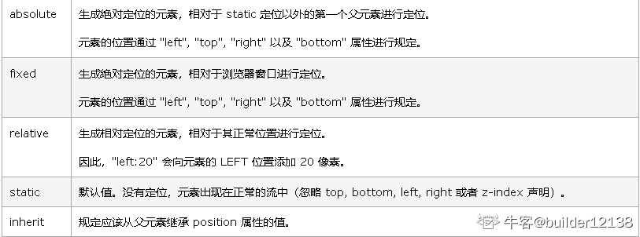
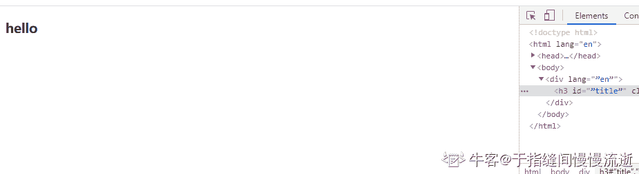
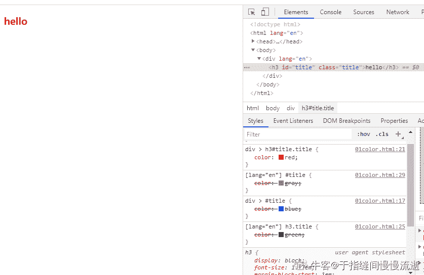
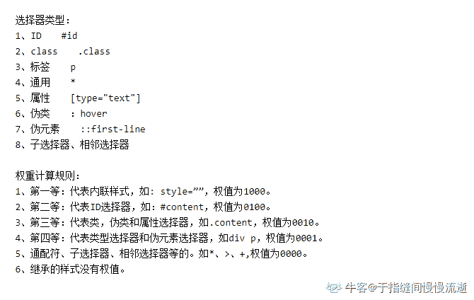

# 用友 2019 校招 web 前端笔试题（二）

## 1

从 2 到 5 中选两个数，第一个数较大，将两数之和告诉甲，两数之差告诉乙，两个人根据自己手上的数都算不出来答案，求这两个数分别是多少？

正确答案: C   你的答案: 空 (错误)

```cpp
5，3
```

```cpp
5，2
```

```cpp
4，3
```

```cpp
4，2
```

本题知识点

数学运算

讨论

[JsonWang0102](https://www.nowcoder.com/profile/482834539)

两数之和的情况：5、6、7、7、8、9，出现两次 7 两数之差的情况：1、2、3、1、2、1，出现两次 1，两次 2 将选项依次带入，只有 4、3 符合

发表于 2019-06-17 12:47:50

* * *

[大贤贤](https://www.nowcoder.com/profile/243979791)

C 选项中，甲得到的两数之和为 7 ， 乙得到的两数之差为 1 ，因此甲从 2 到 5 这四个数中，能组成两数之和为 7 的组合有 （5 , 2） 和 （4 , 3） ，乙组成两数之差为 1 的组合有 （3 , 2） ， （4 , 3） 和 （5 ， 4） ，因此两个人都算不出答案

发表于 2019-08-07 15:04:07

* * *

[Cronus_f](https://www.nowcoder.com/profile/331552187)

共有五种情况 3.2 4.3/4.2 5.4/5.3/5.2 两数之和为 5.7.6.9.8.7 两数之差为 1.1.2.1.2.3 因此对于甲而言：7 出现两次，无法确定 对于乙而言：1 出现三次，无法确定 所以两个数和为 7，差为 1，第一个数较大，只能为（4，3）

发表于 2019-10-28 12:46:19

* * *

## 2

在向 1988 个有序顺序表中插入一个新元素，并保持原来的顺序不变，平均要移动的元素次数是？

正确答案: C   你的答案: 空 (错误)

```cpp
992
```

```cpp
993
```

```cpp
994
```

```cpp
995
```

本题知识点

前端工程师 用友 栈 *2019* *讨论

[时文康](https://www.nowcoder.com/profile/101764790)

最多 1988 次（插在首位），最少 0 次（插在末尾）共 1988/2 次

发表于 2019-10-17 18:36:11

* * *

[刘瑶瑶 611](https://www.nowcoder.com/profile/649469601)

在 n 个有序顺序表中插入一个新元素，并保持原来的顺序不变，平均要移动的元素次数是 n/2

发表于 2019-06-18 16:17:30

* * *

[_ 老地方](https://www.nowcoder.com/profile/290616569)

二分之 n

发表于 2019-11-15 00:12:14

* * *

## 3

在堆排序算法中我们用一个数组 A 来模拟二叉树 T，如果该 A[0]存放的是 T 的根节点，那么 AK（左节点）的父亲节点是（）？（选项向下取整）

正确答案: A   你的答案: 空 (错误)

```cpp
(K-1)/2
```

```cpp
K/2
```

```cpp
(K+1)/2
```

```cpp
都不对
```

本题知识点

前端工程师 用友 树 2019

讨论

[你说是就是](https://www.nowcoder.com/profile/223530205)

本来从 1 开始的话应该是 k/2 取下界，不过这里从 0 开始，就要减 1

发表于 2019-10-11 17:57:41

* * *

[科大 15 届软工代言人](https://www.nowcoder.com/profile/393908307)

本题强调从 0 开始且 k 为左节点，那么 k 为奇数，按照向下取整，则(k-1)/2 等于 k/2。有问题嘛？

发表于 2021-04-23 21:25:40

* * *

[牛客 712307054 号](https://www.nowcoder.com/profile/712307054)

左节点的是（K-1）/2，右节点的是（K-2）/2，因为这里没有（K-2）/2，所有只能选（K-1）/2

发表于 2020-08-19 10:27:58

* * *

## 4

用数组 M[0..N-1] 用来表示一个循环队列， FRONT 指向队头元素，REAR 指向队尾元素的后一个位置，则当前队列中的元素个数是几个？（注：队列总的元素数不会超过队列大小）

正确答案: C   你的答案: 空 (错误)

```cpp
rear-front+1
```

```cpp
rear-front-1
```

```cpp
(rear-front+n)%n
```

```cpp
(rear-front)%n
```

本题知识点

前端工程师 用友 数组 2019

讨论

[大贤贤](https://www.nowcoder.com/profile/243979791)

因为是循环链表 rear 不一定就比 front 地址高 所以有可能 rear-fornt 得到结果是负数 所以为了正确性起见需要+n 再%n

发表于 2019-08-07 15:06:17

* * *

[Joker2720](https://www.nowcoder.com/profile/210202720)

队空条件：front == rear 队满条件：(rear+1) %QueueSize == front 队列长度：(rear—front + QueueSize) % QueueSize

编辑于 2022-02-05 19:42:33

* * *

[eurekais](https://www.nowcoder.com/profile/895694431)

因为 rear 指向为下一个地址，所以当 front>rear 时 rear-front=已经存入的个数

发表于 2020-11-25 20:57:19

* * *

## 5

字符串 "YONYOU"，有几种不同的全排列方式？

正确答案: A   你的答案: 空 (错误)

```cpp
180
```

```cpp
720
```

```cpp
120
```

```cpp
540
```

本题知识点

前端工程师 用友 字符串 *2019* *讨论

[漠景](https://www.nowcoder.com/profile/357609081)

如果六个字母不同则有 A[6]⁶ 种方法但有两个字母重复，一个字母重复是除以 2，两个就是 A[6]⁶ /4=180

发表于 2019-09-10 21:39:24

* * *

[大贤贤](https://www.nowcoder.com/profile/243979791)

简单的概率学首先有 6 个位置先排 N ,U 有 6*5=30 种再排 Y,Y 只有 4 个坑了有 4*3/2=6 种最后 2 个位置给 O,O，所以总共 30*6=180 种

发表于 2019-08-07 15:10:42

* * *

[youaregenius](https://www.nowcoder.com/profile/1442508)

先拍出现一次的字母，再排出现两次的字母，一共是 A6²C[4]²C[2]²

发表于 2019-09-27 10:04:28

* * *

## 6

文件传输使用的协议是？

正确答案: B   你的答案: 空 (错误)

```cpp
SMTP
```

```cpp
FTP
```

```cpp
UDP
```

```cpp
TELNET
```

本题知识点

前端工程师 用友 网络基础 2019

讨论

[在线等待](https://www.nowcoder.com/profile/571254155)

SMTP：邮件传输协议，工作在应用层 FTP：文件传输协议，工作在应用层 UDP：用户数据报协议，工作在传输层 TELNET：是 TCP/IP 协议中的一员，是 Internet 远程登录服务的标准协议和主要方式，工作在应用层

发表于 2020-06-06 10:47:05

* * *

[大贤贤](https://www.nowcoder.com/profile/243979791)

纯概念，上过计算机网络的都知道，文件传输协议（File Transfer Protocol，FTP）是用于在网络上进行文件传输的一套标准协议

发表于 2019-08-07 15:12:29

* * *

[jackenLeu](https://www.nowcoder.com/profile/337748390)

b

发表于 2019-11-16 20:51:57

* * *

## 7

信号传输速率单位一般为？

正确答案: B   你的答案: 空 (错误)

```cpp
b
```

```cpp
b/s
```

```cpp
mhz/s
```

```cpp
mps
```

本题知识点

前端工程师 用友 网络基础 2019

讨论

[东封](https://www.nowcoder.com/profile/874414295)

信号传输速率是指单位时间内所传输的数据量多少。为了能够统一度量，可以采用两种方法作为传输速率的单位。 一种是码元速率，单位时间内传输的码元个数，单位为波特（baud），所以也称波特率。一个数字脉冲为一个码元。若码元的宽度为 T 秒，则 B=1/T。 另一种是数据传输速率，每秒钟内传输的信息量，单位为比特/秒（b/s 或 bps），所以也称比特率。若码元可取的离散值的个数为 M，则 T=Ts*㏒M，R=Rs/㏒M,其中 Ts 为发一个二进制符号所需要的时间

发表于 2019-08-11 16:07:05

* * *

[炫歌](https://www.nowcoder.com/profile/622959792)

注意题目说的是传输速率  传输 一定和比特相关   速率一定和时间相关  综上选  B    

发表于 2020-10-25 18:28:56

* * *

[猫猫要当攻城狮](https://www.nowcoder.com/profile/48452620)

B

发表于 2021-05-24 10:25:35

* * *

## 8

退出交互模式的 Shell，应键入？

正确答案: C   你的答案: 空 (错误)

```cpp
^q
```

```cpp
exit
```

```cpp
quit
```

本题知识点

前端工程师 用友 shell 2019

讨论

[东封](https://www.nowcoder.com/profile/874414295)

功能说明：退出目前的 shell。 语　　法：exit [状态值] 补充说明：执行 exit 可使 shell 以指定的状态值退出。若不设置状态值参数，则 shell 以预设值退出。状态值 0 代表执行成功，其他值代表执行失败。exit 也可用在 script，离开正在执行的 script，回到 shell。

发表于 2019-08-11 16:09:27

* * *

## 9

在 MYSQL 数据库中，以下哪条语句用于统计 BOOK 表中的记录总数？

正确答案: D   你的答案: 空 (错误)

```cpp
select sum(*) from book;
```

```cpp
select max(*) from book;
```

```cpp
select avg(*) from book;
```

```cpp
select count(*) from book;
```

本题知识点

前端工程师 用友 数据库 2019

讨论

[东封](https://www.nowcoder.com/profile/874414295)

总数指的是多少记录数，不是记录中某属性值之和，所以用 count

发表于 2019-08-11 16:10:31

* * *

[牛客 692485106 号](https://www.nowcoder.com/profile/692485106)

Sum 求和，max 取最大值，avg 求平均数，count 计数

发表于 2022-01-02 09:06:42

* * *

[牛客 235775633 号](https://www.nowcoder.com/profile/235775633)

sum 加减 max 最大值 avg 平均

发表于 2021-09-05 23:14:50

* * *

## 10

一个软件评测机构，某天检测的软件产品数为 10，其中有缺陷的软件产品有 6 个，缺陷总数为 3 个，则单位缺陷数是？

正确答案: A   你的答案: 空 (错误)

```cpp
0.3
```

```cpp
0.5
```

```cpp
0.6
```

```cpp
其他均不对
```

本题知识点

前端工程师 用友 软件工程 2019

讨论

[求一个 offfer 上岸](https://www.nowcoder.com/profile/934850440)

软件的单位缺陷数是基于产品的总体测试总数计算的。单位缺陷数=缺陷总数/软件产品总数。故在本题中：3/10=0.3。

发表于 2019-09-06 19:33:13

* * *

[Xinchang_WANG](https://www.nowcoder.com/profile/133103886)

请问 6 个缺陷产品，3 个缺陷总数，怎么分？？？一个产品半个？

发表于 2020-07-15 20:50:06

* * *

[₍₍ง(*Ӧ)ว⁾⁾](https://www.nowcoder.com/profile/609594099)

是从问题种类来处理问题

发表于 2020-11-24 15:16:22

* * *

## 11

以下属于非块级元素的是（）

正确答案: D   你的答案: 空 (错误)

```cpp
form
```

```cpp
li
```

```cpp
h5
```

```cpp
input
```

本题知识点

前端工程师 用友 HTML 2019

讨论

[楠楠南南](https://www.nowcoder.com/profile/207271028)

块级元素： div、p、h1-h6、form、ul、ol、dl、dt、dd、li、table、tr、td、th、hr 行内元素： span、img、a、label、code、input、abbr、em、b、big、cite、i、q、textarea、select、small、sub、sup，strong、u

发表于 2019-07-11 14:26:36

* * *

[牛客 887057786 号](https://www.nowcoder.com/profile/887057786)

行内块元素也属于行内元素吗

发表于 2021-01-15 16:49:33

* * *

[小火柴的蓝色梦想](https://www.nowcoder.com/profile/598664151)

选择 D

发表于 2019-06-27 11:26:29

* * *

## 12

下列关于 link 和 @import 的使用，说法不正确的是（）

正确答案: B   你的答案: 空 (错误)

```cpp
页面被加载的时，link 引用的 CSS 会同时被加载，而 @import 引用的 CSS 会等到页面被加载完再加载
```

```cpp
link、@import 均支持使用 JS 控制 DOM 去改变样式
```

```cpp
@import 就只能加载 CSS，link 标签还可以定义 RSS 等
```

```cpp
@import 是 CSS2.1 提出的，只在 IE5 以上才能被识别，而 link 是 XHTML 标签，无兼容问题
```

本题知识点

前端工程师 用友 HTML 2019 CSS

讨论

[大白鹅蛋](https://www.nowcoder.com/profile/711391788)

1.从属关系区别 @import 是 CSS 提供的语法规则，只有导入样式表的作用；link 是 HTML 提供的标签，不仅可以加载 CSS 文件，还可以定义 RSS、rel 连接属性等。 2.加载顺序区别 加载页面时，link 标签引入的 CSS 被同时加载；@import 引入的 CSS 将在页面加载完毕后被加载。 3.兼容性区别 @import 是 CSS2.1 才有的语法，故只可在 IE5+ 才能识别；link 标签作为 HTML 元素，不存在兼容性问题。 4.DOM 可控性区别 可以通过 JS 操作 DOM ，插入 link 标签来改变样式；由于 DOM 方法是基于文档的，无法使用@import 的方式插入样式。 5.权重区别 link 引入的样式权重大于@import 引入的样式。

发表于 2019-06-24 16:51:08

* * *

[牛客 141039347 号](https://www.nowcoder.com/profile/141039347)

1\. 加载页面时，link 标签引入的 CSS 被同时加载；@import 引入的 CSS 将在页面加载完毕后被加载。 2\. @import 引入的样式，会被层叠掉了。其虽然后被加载，却会在解析(解析)完毕后置于样式表顶部，最终渲染时自然会被下面的同名样式层叠。 https://juejin.cn/post/6844903581649207309#heading-0

编辑于 2021-09-06 15:00:14

* * *

[再坚持一点吖🙆](https://www.nowcoder.com/profile/909281683)

@import 不支持使用 js 去控制 DOM 改变样式

发表于 2021-08-03 16:50:18

* * *

## 13

setTimeout(“go()”, 10);表示的意思是()

正确答案: C   你的答案: 空 (错误)

```cpp
间隔 10 秒后，go()函数执行一次
```

```cpp
go()函数持续调用 10 次
```

```cpp
间隔 10 毫秒后，go()函数执行一次
```

```cpp
间隔 10 分钟后，go()函数执行一次
```

本题知识点

前端工程师 用友 Javascript 2019

讨论

[嚯嚯嚯嘿嘿嘿](https://www.nowcoder.com/profile/5304986)

setTimeout()方法接收两个参数，第一个参数可以是包含 JavaScript 代码的字符串，或者是一个函数。第二个参数表示等待多长时间的毫秒数将当前任务添加到队列中。
所以：setTimeout(“go()”, 10);  //等待 10 毫秒执行 go 函数 setTimeout(go, 10);       //等待 10 毫秒执行 go 函数 setTimeout(go(), 10);    //立即执行 go 函数

发表于 2019-10-26 16:45:29

* * *

[祖安文科状元 1 号](https://www.nowcoder.com/profile/911784231)

并不是执行吧，只是放入任务队列

发表于 2019-09-09 00:12:47

* * *

[xc_silence](https://www.nowcoder.com/profile/204319422)

关于引号问题：

1.  带引号，该方法在**全局环境**中寻找；
2.  不带引号，该方法在**局部环境**中寻找。

```cpp
;(function () {
  function fn() {
    alert(2)
  }
  setTimeout('fn()', 1000); // 全局变量 打印 1
  setTimeout(fn, 1000); // 局部变量 打印 2
})()

function fn(){
  alert(1)
}
```

编辑于 2020-08-28 11:52:28

* * *

## 14

在 JavaScript 中，下列不属于数组方法的是()

正确答案: D   你的答案: 空 (错误)

```cpp
concat()
```

```cpp
sort()
```

```cpp
reverse()
```

```cpp
length()
```

本题知识点

前端工程师 用友 Javascript 2019

讨论

[巷口等风](https://www.nowcoder.com/profile/901076316)

大概是因为 length 是数组的属性，不是方法，所以选 length,而且 length 是不加括号的

发表于 2019-08-24 19:01:02

* * *

[大贤贤](https://www.nowcoder.com/profile/243979791)

```cpp
reverse()
```

颠倒数组中元素的顺序：

var fruits = ["Banana", "Orange", "Apple", "Mango"];
fruits.reverse();

*fruits* 结果输出：

Mango,Apple,Orange,Banana

发表于 2019-08-07 15:16:55

* * *

[narutuko](https://www.nowcoder.com/profile/581362543)

concat() 数组的连接 sort() 数组的排序 reverse() 数组的倒序 length 是数组的属性 通过 Array.length 获取数组的长度

发表于 2021-04-24 18:19:41

* * *

## 15

添加哪个属性可以使超出的文字部分变成「…」()

正确答案: B   你的答案: 空 (错误)

```cpp
white-space: normal;
```

```cpp
text-overflow: ellipsis;
```

```cpp
overflow: hidden;
```

```cpp
overflow: auto;
```

本题知识点

前端工程师 用友 2019 CSS

讨论

[每天都要努力呀！](https://www.nowcoder.com/profile/956413803)

 ```cpp
white-space: normal|pre|nowrap|pre-wrap|pre-line|inherit;  
```

*   **white-space**: 属性设置如何处理元素内的空白
*   **normal**: 默认。空白会被浏览器忽略。
*   **pre**: 空白会被浏览器保留。其行为方式类似 HTML 中的 pre 标签。
*   **nowrap**: 文本不会换行，文本会在在同一行上继续，直到遇到 br 标签为止。
*   **pre-wrap**: 保留空白符序列，但是正常地进行换行。
*   **pre-line**: 合并空白符序列，但是保留换行符。

*   **inherit**: 规定应该从父元素继承 white-space 属性的值。

text-overflow: clip|ellipsis|*string*;

| 值 | 描述 |
| clip | 修剪文本。 |
| ellipsis | 显示省略符号来代表被修剪的文本。 |
| *string* | 使用给定的字符串来代表被修剪的文本。 |

overflow 属性有以下值：

| 值 | 描述 |
| visible | 默认值。内容不会被修剪，会呈现在元素框之外。 |
| hidden | 内容会被修剪，并且其余内容是不可见的。 |
| scroll | 内容会被修剪，但是浏览器会显示滚动条以便查看其余的内容。 |
| auto | 如果内容被修剪，则浏览器会显示滚动条以便查看其余的内容。 |
| inherit | 规定应该从父元素继承 overflow 属性的值。 | 

发表于 2019-09-11 09:46:39

* * *

[star-chen](https://www.nowcoder.com/profile/610950260)

这个不应该配合 overflow 属性嘛

发表于 2020-04-04 18:13:01

* * *

## 16

下列对符号所表示的意义解释错误的是 ()

正确答案: C   你的答案: 空 (错误)

```cpp
ˆ(尖号)匹配字符串的开头
```

```cpp
$(美元符号)匹配字符串的结尾
```

```cpp
?(问号)匹配前面的子表达式一次或多次
```

```cpp
\(反斜杠)对特殊字符的特殊元字符含义进行转义
```

本题知识点

前端工程师 用友 Javascript 2019

讨论

[haoge588](https://www.nowcoder.com/profile/348096585)

* ：出现零到多次+： 出现一到多次？：出现零次或者一次 .  : 除了\n 以外的任意字符{n} : 出现 n 次{n,} : 出现 n 到多次{n,m} : 出现 n 到 m 次 var reg=/⁰.2$/; //以 0 开头，以 2 结尾，中间可以是\n 以外的任意字符

发表于 2019-09-24 08:41:21

* * *

[为爱痴狂](https://www.nowcoder.com/profile/777407465)

^ : 匹配字符串的开头；$ : 匹配字符串的结尾；* ; 出现零次到多次；+ ：出现一次到多次；？: 出现零次或一次；. : 除了\n 以外的任意字符{n} : 出现 n 次；{n,m}: 出现 n 到 m 次；{n,}: 出现 n 次到多次

发表于 2020-09-27 15:59:39

* * *

[李溏](https://www.nowcoder.com/profile/2297190)

{n}          n 次
{1,3}       1~3 次
{1,}        1 到多次
+           1 到多次
?           0 到一次*           0 到多次^           匹配一行开始
$          匹配一行结束字符类      [abc]   /[abc]/  匹配"abc"中任意一个字符
      [^abc]  /[^abc]/  匹配非"abc"中任意一个字符
      .     任意字符（除了换行符）
      \w    任意字符   [a-zA-Z0-9]    
      \W    任意非字符  [^a-zA-Z0-9]
      \s    任意空白符  
      \S    任意非空白符  
      \d    任意数字    [0-9]
      \D    任意非数字  [⁰-9]

发表于 2020-08-20 09:35:31

* * *

## 17

以下不属于 javascript 中的数据类型的选项是 ()

正确答案: C   你的答案: 空 (错误)

```cpp
Undefined
```

```cpp
Number
```

```cpp
Interface
```

```cpp
Symbol
```

本题知识点

前端工程师 用友 Javascript 2019

讨论

[leaf 在这里](https://www.nowcoder.com/profile/662960573)

基本类型有： String Number Boolean Null Undefined Symbol(es6 新增 表示独一无二的值) 引用类型：Object Array Function

编辑于 2019-09-19 16:38:56

* * *

[桂森滨](https://www.nowcoder.com/profile/111344767)

答案为 C 值类型  undefined、string、number、boolean、symbol 引用类型  Array 数组 object 对象 function 函数  （注意 typeof null === ‘object’）

发表于 2020-03-25 15:45:57

* * *

[牛客 117223949 号](https://www.nowcoder.com/profile/117223949)

C interface 是 js 中的保留字

发表于 2020-07-08 15:07:12

* * *

## 18

下列不属于 javascript 中查找元素的方法的是()

正确答案: A   你的答案: 空 (错误)

```cpp
getElementByClassName()
```

```cpp
getElementsByTagName()
```

```cpp
getElementById()
```

```cpp
getElementsByName()
```

本题知识点

前端工程师 用友 Javascript 2019

讨论

[旺仔大馒头](https://www.nowcoder.com/profile/8019634)

选择 A 错在 Elements。因为这个方法可以返回一组节点。

1.  A. 获取所有指定类名的元素：getElementsByClassName
    var x = document.getElementsByClassName("example");

    *   定义和使用
        getElementsByClassName() 方法返回文档中所有指定类名的元素集合，作为 NodeList 对象。
        NodeList 对象代表一个有顺序的节点列表。NodeList 对象 我们可通过节点列表中的节点索引号来访问列表中的节点(索引号由 0 开始)。
    *   提示： 你可以使用 NodeList 对象的 length 属性来确定指定类名的元素个数，并循环各个元素来获取你需要的那个元素。
2.  B getElementsByTagName() 方法可返回带有指定标签名的对象的集合。

    *   语法
        document.getElementsByTagName(tagname)
    *   说明
        getElementsByTagName() 方法返回元素的顺序是它们在文档中的顺序。
        *   如果把特殊字符串 "*" 传递给 getElementsByTagName() 方法，它将返回文档中所有元素的列表，元素排列的顺序就是它们在文档中的顺序。

1.  C getElementById() 方法可返回对拥有指定 ID 的第一个对象的引用。
    *   语法
        document.getElementById(id)
    *   说明
        HTML DOM 定义了多种查找元素的方法，除了 getElementById() 之外，还有 getElementsByName() 和 getElementsByTagName()。
    *   不过，如果您需要查找文档中的一个特定的元素，最有效的方法是 getElementById()。
    *   在操作文档的一个特定的元素时，最好给该元素一个 id 属性，为它指定一个（在文档中）唯一的名称，然后就可以用该 ID 查找想要的元素。

1.  D getElementsByName() 方法可返回带有指定名称的对象的集合。
    *   语法
        document.getElementsByName(name)
        该方法与 getElementById() 方法相似，但是它查询元素的 name 属性，而不是 id 属性。
    *   另外，因为一个文档中的 name 属性可能不唯一（如 HTML 表单中的单选按钮通常具有相同的 name 属性），所有 getElementsByName() 方法返回的是元素的数组，而不是一个元素。

编辑于 2019-09-06 15:53:38

* * *

[大贤贤](https://www.nowcoder.com/profile/243979791)

getElementsByClassName() 好坑哦少个 s 什么鬼题

发表于 2019-08-07 15:29:08

* * *

[点点点点点点不点点点点点](https://www.nowcoder.com/profile/863564998)

getElementById

getElementsByTagName

getElementsByClassName

getElementsByName

编辑于 2019-10-14 23:49:11

* * *

## 19

下列关于 HttpCode 说法不正确的是()

正确答案: B   你的答案: 空 (错误)

```cpp
404: 服务器找不到请求的网页
```

```cpp
302: 请求的网页已永久移动到新位置
```

```cpp
500: 服务器内部错误
```

```cpp
200: 服务器已成功处理了请求
```

本题知识点

前端工程师 用友 网络基础 2019

讨论

[ADE_](https://www.nowcoder.com/profile/153401914)

•  200：请求被正常处理 •  204：请求被受理但没有资源可以返回 •  206：客户端只是请求资源的一部分，服务器只对请求的部分资源执行 GET 方法，相应报文中通过 Content-Range 指定范围的资源。 •  301：永久性重定向 •  302：临时重定向 •  303：与 302 状态码有相似功能，只是它希望客户端在请求一个 URI 的时候，能通过 GET 方法重定向到另一个 URI 上 •  304：发送附带条件的请求时，条件不满足时返回，与重定向无关 •  307：临时重定向，与 302 类似，只是强制要求使用 POST 方法 •  400：请求报文语法有误，服务器无法识别 •  401：请求需要认证 •  403：请求的对应资源禁止被访问 •  404：服务器无法找到对应资源 •  500：服务器内部错误 •  502：服务器挂了•  503：服务器正忙

发表于 2019-09-23 23:23:17

* * *

[门头沟传达室值班员](https://www.nowcoder.com/profile/405066145)

```cpp
302 ：请求的网页已临时移动到新位置
```

```cpp
301 ：请求的网页已永久移动到新位置
```

发表于 2019-07-15 20:44:28

* * *

[jackenLeu](https://www.nowcoder.com/profile/337748390)

c

发表于 2019-11-16 20:53:40

* * *

## 20

下边与 http 缓存无关的头字段是()

正确答案: C   你的答案: 空 (错误)

```cpp
Expires
```

```cpp
Last-Modified
```

```cpp
Content-Length
```

```cpp
ETag
```

本题知识点

前端工程师 用友 网络基础 2019

讨论

[看海的小宇~](https://www.nowcoder.com/profile/926914251)

坚持住，要刷完啊

发表于 2020-02-20 15:13:33

* * *

[楠楠南南](https://www.nowcoder.com/profile/207271028)

Http 缓存头 Expires ：它通常的使用格式是 Expires:Fri ,24 Dec 2027 04:24:07 GMT，后面跟的是日期和时间，超过这个时间后，缓存的内容将失效 Last-Modified / If-Modified：一般服务端在响应头中返回一个 Last-Modified 字段，告诉浏览器这个页面的最后修改时间 Etag/If-None-Match：用于验证缓存有效性

发表于 2019-07-11 14:34:05

* * *

[牛客 787596094 号](https://www.nowcoder.com/profile/787596094)

C

发表于 2021-03-17 09:20:12

* * *

## 21

关于 Array 数组对象的说法不正确的是（）

正确答案: B   你的答案: 空 (错误)

```cpp
push()向数组的末尾添加一个或更多元素，并返回新的长度
```

```cpp
pop()删除并返回数组的第一个元素
```

```cpp
unshift()向数组的开头添加一个或更多元素，并返回新的长度
```

```cpp
join()把数组的所有元素放入一个字符串
```

本题知识点

前端工程师 用友 数组 2019

讨论

[💓FaLoFr，](https://www.nowcoder.com/profile/799309062)

一、push 方法是向数组末尾添加一个或者多个元素，并返回新的长度 二、pop 方法删除数组的最后一个元素，把数组的长度减 1，并且返回它被删除元素的值，如果数组变为空，则该方法不改变数组，返回 undefine 值 三、unshift()方法是向数组的开头添加一个或多个元素，并且返回新的长度 四、shift()方法和 unshift()方法恰恰相反。该方法用于把数组的第一个元素从其中删除，并返回被删除的值。如果数组是空的，shift()方法将不进行任何操作，返回 undefined 的值。 五,join()方法用于把数组中的所有元素放入一个字符串。元素是通过指定的分隔符进行分隔的。

编辑于 2019-11-01 09:28:09

* * *

[Madaovo](https://www.nowcoder.com/profile/161910075)

```cpp
pop()删除并返回数组的最后一个元素
```

发表于 2019-07-08 11:05:05

* * *

[黑闪⚡](https://www.nowcoder.com/profile/962532797)

数组有这功能？

发表于 2020-04-11 20:44:20

* * *

## 22

关于 position 定位，下列说法错误的是()

正确答案: A B   你的答案: 空 (错误)

```cpp
fixed 元素，可定位于相对于浏览器窗口的指定坐标，它始终是以 body 为依据
```

```cpp
relative 元素以它原来的位置为基准偏移，在其移动后，原来的位置不再占据空间
```

```cpp
absolute 的元素，如果它的 父容器设置了 position 属性，并且 position 的属性值为 absolute 或者 relative，那么就会依据父容器进行偏移
```

```cpp
fixed 属性的元素在标准流中不占位置
```

本题知识点

前端工程师 用友 2019 CSS

讨论

[刘柏炎](https://www.nowcoder.com/profile/419138661)

fixed 不以 body 为依据，只以浏览器窗口为依据。

编辑于 2021-03-18 10:28:01

* * *

[builder12138](https://www.nowcoder.com/profile/153237677)



发表于 2019-10-22 16:36:51

* * *

[moonpielu](https://www.nowcoder.com/profile/702190736)

绝对定位和固定定位会脱离标准文档流 相对定位不会

发表于 2020-04-30 11:40:56

* * *

## 23

关于浮动元素，下面说法错误的是()

正确答案: D   你的答案: 空 (错误)

```cpp
如果有多个浮动元素，浮动元素会按顺序排下来而不会发生重叠的现象
```

```cpp
浮动元素会尽可能地向顶端对齐、向左或向右对齐
```

```cpp
如果有非浮动元素和浮动元素同时存在，并且非浮动元素在前，则浮动元素不会高于非浮动元素
```

```cpp
行内元素与浮动元素发生重叠，其边框，背景和内容都会显示在浮动元素之下
```

本题知识点

前端工程师 用友 2019 CSS

讨论

[呆头鹅丶](https://www.nowcoder.com/profile/414900042)

**浮动元素重叠**1、行内元素与浮动元素发生重叠，边框、背景、内容都会显示在浮动元素之上
2、块级元素与浮动元素发生重叠，边框、背景会显示在浮动元素之下，内容会显示在浮动元素之上 

发表于 2019-11-20 10:57:12

* * *

[前端是个坑](https://www.nowcoder.com/profile/689268508)

D 选项  [`www.jianshu.com/p/8223fb64bb40`](https://www.jianshu.com/p/8223fb64bb40)

发表于 2019-10-15 16:59:27

* * *

[肖宇晨](https://www.nowcoder.com/profile/43293287)

1、行内元素与浮动元素发生重叠，边框、背景、内容都会显示在浮动元素之上
2、块级元素与浮动元素发生重叠，边框、背景会显示在浮动元素之下，内容会显示在浮动元素之上 3、若不浮动的是块级元素，那么浮动的元素将显示在其上方 4、若不浮动的是行内元素或者行内块元素，那么浮动的元素不会覆盖它，而是将其挤往左方

发表于 2020-12-08 19:35:20

* * *

## 24

下列说法错误的是()

正确答案: A   你的答案: 空 (错误)

```cpp
设置 display:none 后的元素只会导致浏览器的重排而不会重绘
```

```cpp
设置 visibility:hidde 后的元素只会导致浏览器重绘而不会重排
```

```cpp
设置元素 opacity:0 之后，也可以触发点击事件
```

```cpp
visibility:hidden 的元素无法触发其点击事件
```

本题知识点

前端工程师 用友 HTML 2019

讨论

[每天都要努力呀！](https://www.nowcoder.com/profile/956413803)

display：none 指的是元素完全不陈列出来，不占据空间，涉及到了 DOM 结构，故产生 reflow 与 repaint
visibility：hidden 指的是元素不可见但存在，保留空间，不影响结构，故只产生 repaint，但不可触发绑定事件 opacity=0：指的是元素不可见但存在，保留空间，不影响结构，并且，如果该元素已经绑定一些事件，如 click 事件，那么点击该区域，也能触发点击事件的

发表于 2019-09-20 09:42:10

* * *

[艾利略](https://www.nowcoder.com/profile/385807283)

重排一定重绘，重绘不一定重拍

发表于 2020-02-21 09:47:37

* * *

[门头沟传达室值班员](https://www.nowcoder.com/profile/405066145)

```cpp
设置 display:none 后的元素会导致浏览器的重排重绘
```

发表于 2019-07-15 20:50:39

* * *

## 25

以下代码中文字的最终颜色描述正确的是()

```cpp
<style>
     div > #title{color: blue;}
     div > h3#title.title{color: red;}
     [lang=”en”] h3.title{color: green;}
     [lang=”en”] #title{color: gray;}
 </style>
 <div lang=”en”>
     <h3 id=”title” class=”title”>hello</h3>
 </div>
```

正确答案: B   你的答案: 空 (错误)

```cpp
blue
```

```cpp
red
```

```cpp
green
```

```cpp
gray
```

本题知识点

前端工程师 用友 HTML 2019 CSS

讨论

[于指缝间慢慢流逝](https://www.nowcoder.com/profile/9091941)

①题目有误题目的引号使用了中文，所以无法识别类、id 属性。文字的颜色为默认黑色
②结果为红色修改为英文引号后输出为红色字体
选择器的权重如下
 h3#title.title 同一个标签各种属性写在一起权重依次想加（以前没见过这种写法，自己的见识甚是浅啊。。）
 ```cpp
div > #title{color: blue;}             //标签+id = 100+1 = 101
div > h3#title.title{color: red;}         //标签+标签+id+类 = 1+1+100+10=112
[lang=”en”] h3.title{color: green;}        //属性+标签+类 = 10+1+10 =21
[lang=”en”] #title{color: gray;}         //属性+id = 10+100 = 110
```

ps：CSS 的选择器进制是 256 进制。 

发表于 2019-12-31 12:59:15

* * *

[浪险](https://www.nowcoder.com/profile/683173318)

css 优先级，可以给选择器分配权值：

1.  id 选择器的权值为 100
2.  class、属性和伪类选择器的权值为 10
3.  标签选择器、伪元素的权值为 1
4.  权值较大的优先级越高
5.  比较样式时，将对应的选择器权值相加，大的优先级高
6.  权值相同的，根据从上往下的原则，后定义的优先级高
7.  特殊！important，优先级最高

```cpp
div > #title{color: blue;}..................101
div > h3#title.title{color: red;}...........112
[lang=”en”] h3.title{color: green;}........21
[lang=”en”] #title{color: gray;}...........110
```

编辑于 2020-02-04 12:43:24

* * *

[nobody 丶](https://www.nowcoder.com/profile/902764383)

```cpp
<style>
     div > #title{color: blue;} /* 标签 1 + ID100 = 101 */
     div > h3#title.title{color: red;} /* 标签 1 + 标签 1 + ID100 + 类 10 = 112 */
     [lang=”en”] h3.title{color: green;} /* 属性 10 + 标签 1 + 类 10 = 21 */
     [lang=”en”] #title{color: gray;} /* 属性 10 + ID100 = 110 */
</style>
```

发表于 2020-08-10 13:09:09

* * *

## 26

请判断一个字符串出现次数最多的字符及出现次数？

输入：const str = 'asddfgdfwwqeweqwezczxcsdfgdgd';

输出：’d’, 出现 6 次

你的答案

本题知识点

前端工程师 用友 2019

讨论

[¥¥¥](https://www.nowcoder.com/profile/6910209)

```cpp
function count(str){
    var max = 0; 
    var obj = {};
    var maxStr = '';
    for(var i = 0; i < str.length; i++){
        var charAt = str.charAt(i);
        if(obj[charAt]){
            obj[charAt]++;
        }else{
            obj[charAt]= 1;
        }
    }
    for(let i in obj){
          if(obj[i]>max){
            max = obj[i];
            maxStr = i;
            }
        }
    return maxStr +','+'出现'+max+'次'; 
}

```

发表于 2019-08-21 18:26:59

* * *

[无忧河边的城里人](https://www.nowcoder.com/profile/395914524)

const str = 'asddfgdfwwqeweqwezczxcsdfgdgd';const arr = str.split('');var arr1=[];var ress=[];for (i=0;i<arr.length;i++){if (arr1.indexOf(arr[i])==-1){arr1.push(arr[i]);}}for (i=0;i<arr1.length;i++){var a=arr1[i];var res=arr.filter(item => item == a);ress.push(res.length);}var result = Math.max.apply(null,ress);var lala=ress.indexOf(result);console.log(arr1[lala]);console.log(result);

发表于 2019-08-16 14:57:01

* * *

[SSeeing](https://www.nowcoder.com/profile/278594310)

```cpp
var myStr = 'asddfgdfwwqeweqwezczxcsdfgdgd';
function checkBox(str){
    var arr = str.split('');  //先将字符串转换为数组（方便遍历）
    var arr1=[];//存字符
    var ress=[];//存字符出现的次数
    for (i=0;i<arr.length;i++){ 
    if (arr1.indexOf(arr[i])==-1){
        arr1.push(arr[i]);     //arr 去重，并存储在 arr1 中
    }
    }
    for(i=0;i<arr.length;i++){
        var k = arr1.indexOf(arr[i]);  //遍历 arr,拿到 arr 中出现的字符在 arr1 中的索引号 
        if(k!=-1){
            if(ress[k]==undefined){
                ress[k]= 0;
            }
        ress[k]++;  //ress 数组是用来存储 arr1 中对应索引号位置字符出现的次数的。
        }
    }
    var maxNum = ress.reduce(function(pre,cur,index,value){ //在 ress 中找到出现最多的字符的次数
        if(pre>cur){
            return pre;
        }else{
            return cur;
        }
    })
    var aIndex = ress.indexOf(maxNum);//在 ress 中找到索引号，提供给 arr1 寻找对应的字符
    return "'"+arr1[aIndex]+"'"+",出现"+maxNum+'次';
}
checkBox(myStr);
```

发表于 2019-09-08 00:27:11

* * ***