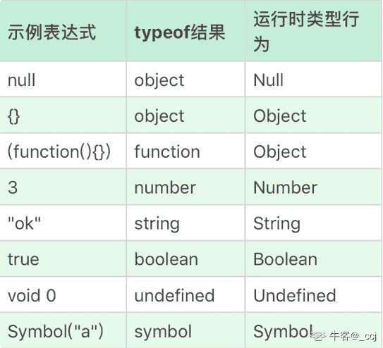

# 用友 2019 校招 web 前端笔试题（三）

## 1

1 元钱一瓶汽水，喝完后两个空瓶换一瓶汽水，问：你有 20 元钱，最多可以喝到几瓶汽水？

正确答案: C   你的答案: 空 (错误)

```cpp
37
```

```cpp
38
```

```cpp
39
```

```cpp
40
```

本题知识点

前端工程师 用友 智力题 数学运算 2019 管理培训生 牛客 2020

讨论

[-贼羊](https://www.nowcoder.com/profile/394072952)

我就想喝 20 瓶不行么，老子喝不动那么多

发表于 2020-03-10 20:31:48

* * *

[不喜欢番茄的西红柿](https://www.nowcoder.com/profile/783757177)

直接要 40 瓶子喝完给钱，喝完剩下 40 个瓶子，抵扣 20 瓶，加上 20 块钱，打我我就跑！！

发表于 2020-07-09 19:55:52

* * *

[♂桀骜™](https://www.nowcoder.com/profile/75581733)

如果考虑借瓶子的话？考虑不考虑还能捡到瓶子呢？

发表于 2019-10-06 16:45:56

* * *

## 2

假设你只有 100MB 的内存，需要对 1GB 的数据进行排序，最合适的算法是？

正确答案: A   你的答案: 空 (错误)

```cpp
多路归并排序
```

```cpp
快速排序
```

```cpp
希尔排序
```

```cpp
计数排序
```

本题知识点

排序 *讨论

[潇元紫](https://www.nowcoder.com/profile/799021943)

除了归并，都需要完全输入数据，so

发表于 2019-10-22 17:29:28

* * *

[牛客 586167617 号](https://www.nowcoder.com/profile/586167617)

总数据量大于内存存储范围，数据无法一次装入内存进行排序，后三种排序都需要内存中有完整的数据才能实现。 可以用归并排序不断交换外部数据与内部数据的方式实现

发表于 2020-01-29 16:53:11

* * *

[爱学习的腾微陆](https://www.nowcoder.com/profile/286727886)

只有 100Mb 内存，但是有 1GB 数据。那么只能选择外部排序.

发表于 2019-10-12 19:41:11

* * *

## 3

1.  有一段楼梯台阶有 11 级台阶，以友友的脚力一步最多只能跨 3 级，请问友友登上这段楼梯有多少种不同的走法？

正确答案: B   你的答案: 空 (错误)

```cpp
476
```

```cpp
504
```

```cpp
924
```

```cpp
271
```

本题知识点

数学运算

讨论

[Silvia🌵](https://www.nowcoder.com/profile/968905765)

如果用 n 表示台阶的级数，a n 表示某人走到第 n 级台阶时，所有可能不同的走法，容易得到：

① 当 n=1 时，显然只要 1 种跨法，即 a 1=1。

② 当 n=2 时，可以一步一级跨，也可以一步跨二级上楼，因此，共有 2 种不同的
跨法,即 a 2=2。

③ 当 n=3 时，可以一步一级跨，也可以一步三级跨，还可以第一步跨一级，第二步跨二级或第一步跨二级，第二步跨一级上楼，因此，共有 4 种不同的跨法，即 a 3=4。

④ 当 n=4 时， 分三种情况分别讨论跨法：

如果第一步跨一级台阶，那么还剩下三级台阶，由③可知有 a3 =4（种）跨法。

如果第一步跨二级台阶，那么还剩下二级台阶，由②可知有 a2 =2（种）跨法。

如果第一步跨三级台阶，那么还剩下一级台阶，由①可知有 a1 =1（种）跨法。

根据[加法原理](https://www.baidu.com/s?wd=%E5%8A%A0%E6%B3%95%E5%8E%9F%E7%90%86&tn=SE_PcZhidaonwhc_ngpagmjz&rsv_dl=gh_pc_zhidao)，有 a 4= a1 +a2 +a3 =1+2+4=7

类推 ，有

a5= a2 +a3+a4 =2+4+7=13

a6= a3 +a4+a5 =4+7+13=24

a7= a4 +a5+a6=7+13+24=44

a8= a5 +a6 +a7 =13+24+44=81

a9= a6+a7+a8 =24+44+81=149

[a10](https://www.baidu.com/s?wd=a10&tn=SE_PcZhidaonwhc_ngpagmjz&rsv_dl=gh_pc_zhidao)= a7 +a8 +a9=44+81+149=274
a11=a8+a9+a10=81+149+274=504 一般地，有 an=an-1+an-2+an-3

发表于 2019-11-02 08:36:27

* * *

[梦不遥](https://www.nowcoder.com/profile/316733915)

我是英语系的，快七年都没碰过数学了，这个真的太难为我了，这次蒙对只是侥幸😥

发表于 2020-03-08 15:33:35

* * *

[JsonWang0102](https://www.nowcoder.com/profile/482834539)

```cpp

```
let f1 = 1, f2 = 2, f3 = 4, result = 0; for (let i = 4; i <= 11; i++) {
    result = f1 + f2 + f3;  f1 = f2;  f2 = f3;  f3 = result; }
console.log(result); 
```cpp

```

发表于 2019-06-17 10:51:28

* * *

## 4

指针 p 指向单链表 L 中的非尾部结点，则下列选项中表示删除 p 的后继结点的是？

正确答案: D   你的答案: 空 (错误)

```cpp
p = p.next
```

```cpp
p =null
```

```cpp
p.next=null
```

```cpp
p.next = p.next.next
```

本题知识点

前端工程师 用友 链表 *2019* *讨论

[木易 yr](https://www.nowcoder.com/profile/8769797)

删除 p 的后继，直接把 p.next 跳过就好

发表于 2019-09-22 01:34:23

* * *

[菜鸡上路（已消毒）](https://www.nowcoder.com/profile/907621113)

我以为删除其后继结点就是删除后面所有的结点，这个题表达不清楚

发表于 2020-03-22 15:37:59

* * *

[Tavi](https://www.nowcoder.com/profile/311907710)

我认为删除它之后的所有节点呢

发表于 2020-02-27 14:31:31

* * *

## 5

当线性表的元素总数基本稳定，且很少进行插入和删除操作，但要求以最快的速度取线性表中的元素时，应采用什么存储结构？

正确答案: A   你的答案: 空 (错误)

```cpp
顺序表
```

```cpp
单链表
```

```cpp
循环链表
```

```cpp
双链表
```

本题知识点

前端工程师 用友 链表 *2019* *讨论

[甜树果子二号](https://www.nowcoder.com/profile/543920445)

顺序表是在计算机内存中以数组的形式保存的线性表。

发表于 2019-09-27 21:09:19

* * *

[lotoze](https://www.nowcoder.com/profile/219425958)

插入、删除和存用链表最快，直接找地址引用，取则用顺序表因为要遍历，

发表于 2019-08-09 14:47:15

* * *

[菜菜菜菜鸟](https://www.nowcoder.com/profile/746630065)

我不理解

发表于 2022-03-15 19:13:11

* * *

## 6

在 TCP/IP 协议簇中， 下面什么协议属于网络层的无连接协议？

正确答案: A   你的答案: 空 (错误)

```cpp
IP
```

```cpp
SMTP
```

```cpp
UDP
```

```cpp
TCP
```

本题知识点

前端工程师 用友 网络基础 2019

讨论

[夏花爱秋叶](https://www.nowcoder.com/profile/4085682)

http 是应用层，udp 是传输层，ip 是网络层的，都是无连接协议

发表于 2019-09-17 08:33:59

* * *

[球球♠](https://www.nowcoder.com/profile/719130107)

IP 是网络层无连接协议 UDP 是传输层无连接协议

发表于 2019-06-24 11:00:10

* * *

[Colossus 丶](https://www.nowcoder.com/profile/920182024)

IP 网络层 SMTP 应用层 简单邮件传输协议 UDP 传输层 用户数据协议 TCP 传输层 传输控制协议

发表于 2019-08-02 21:25:38

* * *

## 7

下面选项中那个不是数据链路层的主要功能

正确答案: D   你的答案: 空 (错误)

```cpp
提供对物理层的控制
```

```cpp
差错控制
```

```cpp
流量控制
```

```cpp
决定传输报文的最佳路由
```

本题知识点

前端工程师 用友 网络基础 2019

讨论

[树读 201907090035521](https://www.nowcoder.com/profile/184937990)

物理层的基本功能： 利用传输介质为数据链路层提供物理连接，实现比特流的透明传输。 数据链路层的基本功能： 通过各种控制协议，将有差错的物理信道变为无差错的、能可靠传输数据帧的数据链路。 网络层基本功能： 通过路由选择算法，为报文或分组通过通信子网选择最适当的路径。

发表于 2019-10-06 20:00:59

* * *

[球球♠](https://www.nowcoder.com/profile/719130107)

网络层负责决定传输报文的最佳路由

发表于 2019-06-24 11:22:05

* * *

[jackenLeu](https://www.nowcoder.com/profile/337748390)

d

发表于 2019-11-16 20:50:27

* * *

## 8

Linux 系统中在给定文件中查找与设定条件相符字符串的命令为？

正确答案: A   你的答案: 空 (错误)

```cpp
grep
```

```cpp
gzip
```

```cpp
find
```

```cpp
sort
```

本题知识点

前端工程师 用友 Linux 2019

讨论

[TTTYYY](https://www.nowcoder.com/profile/6775505)

grep：查找文件内的内容 gzip：压缩文件，文件经压缩后会增加.gz 扩展名 find：在指定目录下查找文件 sort：排序

发表于 2020-04-08 13:28:36

* * *

[圣-保罗](https://www.nowcoder.com/profile/242342894)

注意题目是在文件内查找，也就是查找文件里面的内容，用 grep

发表于 2019-10-09 01:05:35

* * *

[黑闪⚡](https://www.nowcoder.com/profile/962532797)

管道符

发表于 2020-05-18 19:00:46

* * *

## 9

在高并发，事物等场景下，MYSQL5.6 数据库默认使用哪种存储引擎？

正确答案: B   你的答案: 空 (错误)

```cpp
Myisam
```

```cpp
InnoDB
```

```cpp
Memory
```

```cpp
ndbCluster
```

本题知识点

前端工程师 用友 数据库 2019

讨论

[宁馨儿 201903101208671](https://www.nowcoder.com/profile/750087185)

Mysql 在 V5.1 之前默认存储引擎是 MyISAM；在此之后默认存储引擎是 InnoDB

发表于 2019-11-11 19:05:38

* * *

[ITJiang](https://www.nowcoder.com/profile/404753543)

mysql 常用的数据库引擎：innodb 和 XtraDB 

发表于 2019-07-28 15:18:33

* * *

[闲鱼总算翻了身](https://www.nowcoder.com/profile/909589300)

MyISAM 引擎不支持事务

发表于 2021-07-24 22:37:27

* * *

## 10

软件按照设计的要求，在规定时间和条件下达到不出故障、持续运行的要求的质量特性称为？

正确答案: C   你的答案: 空 (错误)

```cpp
完整性
```

```cpp
正确性
```

```cpp
可靠性
```

```cpp
可用性
```

本题知识点

前端工程师 用友 软件工程 2019

讨论

[牛客 452786185 号](https://www.nowcoder.com/profile/452786185)

c

发表于 2020-11-24 15:24:13

* * *

[o 一横一腊︿](https://www.nowcoder.com/profile/804499903)

可用性被定义为系统的一个属性，它说明系统已准备好，马上就可以使用。换句话说，高度可用的系统在任何给定的时刻都能及时地工作。 可靠性是指系统可以无故障地持续运行，是一个持续的状态。与可用性相反，可靠性是根据时间段而不是任何时刻来进行定义的。

发表于 2020-08-29 18:37:40

* * *

[牛客 98363000 号](https://www.nowcoder.com/profile/98363000)

可靠性

发表于 2019-09-26 19:55:07

* * *

## 11

下列说法正确的是()

正确答案: B C D   你的答案: 空 (错误)

```cpp
每个 JS 对象一定对应一个原型对象，并从原型对象继承属性和方法
```

```cpp
对象的 __proto__ 指向自己构造函数的 prototype
```

```cpp
Object.prototype. __proto__=== null，说明原型链到 Object.prototype 终止
```

```cpp
表达式 Function.prototype.__proto__.__proto__ === null 的运行结果为 true
```

本题知识点

前端工程师 用友 Javascript 2019

讨论

[秋风的回答](https://www.nowcoder.com/profile/61118206)

Object.create(null)怎么说

发表于 2019-07-15 21:04:16

* * *

[Scarlett8](https://www.nowcoder.com/profile/680883624)

> A 选项

如果是使用 Object.create(null)创建的空对象,是没有对应原型对象的,所以这个答案不够严谨!

> B 选项

```cpp
// 对于我来说答案改成这样会好理解点: 对象的 _proto_ 指向构造自己的函数的 prototype
function foo() {};
var a = new foo();
console.log(a.__proto__, foo.prototype);
```

> C 选项

Object 已经没有对应的原型了

> D 选项

Function 对应的原型是 Object,而 Object 没有对应的原型了,所以为 null

编辑于 2020-06-17 18:00:13

* * *

[逗比拉格朗日](https://www.nowcoder.com/profile/4827010)

不是可以建立无原型的对象嘛

发表于 2019-06-20 22:28:30

* * *

## 12

下列关于性能优化说法正确的是()

正确答案: A B D   你的答案: 空 (错误)

```cpp
减少 http 请求次数
```

```cpp
减少 DOM 操作
```

```cpp
尽量可能的使用 css expression
```

```cpp
少用全局变量、缓存 dom 节点查找结果
```

本题知识点

前端工程师 用友 2019

讨论

[夏花爱秋叶](https://www.nowcoder.com/profile/4085682)

因为 css 表达式不符合标准，降低了 web 性能，提高了被攻击面(以前不会说攻击 css 的)，所以 css 表达式已经被废弃了

发表于 2019-09-17 09:24:35

* * *

[Colossus 丶](https://www.nowcoder.com/profile/920182024)

css expression 动态属性 css 表达式

发表于 2019-08-02 21:40:23

* * *

## 13

下列哪些属性是不可以被继承的()

正确答案: A B C   你的答案: 空 (错误)

```cpp
margin
```

```cpp
position
```

```cpp
float
```

```cpp
font-size
```

本题知识点

前端工程师 用友 HTML 2019

讨论

[夏花爱秋叶](https://www.nowcoder.com/profile/4085682)

可以被继承的属性主要有文本(font-)，颜色(背景颜色不可以！)，列表(list-style-type)，元素可见性 visibility

发表于 2019-09-17 09:27:06

* * *

[offer 快来我怀里~](https://www.nowcoder.com/profile/452892052)

可以被继承的属性： 字体系列：font-family，font-size，font-style，font-weight，font-stretch，font-size-adjust； 列表相关：list-style，list-style-image，list-style-position，list-style-type，list-style-color； 文本系列：text-indent，text-align，line-height，word-spaceing，letter-spacing，text-transform，direction，color； 元素可见性：visibility； 表格布局：caption-side，border-collapse，border-spacing，empty-cells，table-layout； 生成内容：quotes； 光标属性：cursor； 页面样式：page，page-break-inside，Windows，orphans； 声音样式属性：speak、speak-punctuation、speak-numeral、speak-header、speech-rate、volume、voice-family、pitch、pitch-range、stress、richness、、azimuth、elevation。

编辑于 2019-12-06 01:13:53

* * *

[w_ 小白](https://www.nowcoder.com/profile/570172784)

position:inherit; ????

发表于 2019-09-16 17:00:33

* * *

## 14

下面关注 this 对象的理解正确的是 ()

正确答案: A B D   你的答案: 空 (错误)

```cpp
在不改变 this 指向的前提下，this 总是指向函数的直接调用者
```

```cpp
如果有 new 关键字，this 指向 new 出来的那个对象
```

```cpp
this 总是指向函数的非间接调用者
```

```cpp
IE 中 attachEvent 中的 this 总是指向全局对象 Window
```

本题知识点

前端工程师 用友 Javascript 2019

讨论

[校门口卖红薯的老汉](https://www.nowcoder.com/profile/81604158)

C 选项错在 ”**总是**“，apply,call 就可以改变 this 指向

发表于 2019-10-09 17:35:20

* * *

[燃烧黎明](https://www.nowcoder.com/profile/567164937)

A 没人说?箭头函数如果写在对象方法中，内部 this 指向也不是该对象

发表于 2020-08-12 23:50:54

* * *

[123qwer.1](https://www.nowcoder.com/profile/567724293)

fn.call(obj)   fn 是非间接调用者但是 this 指向的是 obj

发表于 2020-03-29 13:07:52

* * *

## 15

下列选项中可以实现浏览器内多个页签之间通讯的是（）

正确答案: A B   你的答案: 空 (错误)

```cpp
cookie
```

```cpp
localStorage
```

```cpp
sessionStorage
```

```cpp
iframe
```

本题知识点

前端工程师 用友 2019

讨论

[夏花爱秋叶](https://www.nowcoder.com/profile/4085682)

浏览器页面之间通信
1\. 服务器方式就是通过提交表单更新服务器端的数据，然后另一个页面去获取更新后的数据就可以实现通信
2\. 第一个页面通过 localStorge.setItem()来实现存储在浏览器本地，另一个页面通过 localStorge.getItem()来获取被存储的数据
3\. 第一个页面把要存储的信息存储到 cookie 中，然后另一个页面通过 setInterval 来实现定时获取
4\. sessionStorage 是会话级别的，每个页签都有单独的存储空间，所以不能实现页面之间的通信

编辑于 2020-02-16 22:40:05

* * *

## 16

以下哪些请求头可以实现请求的缓存（）

正确答案: A C D   你的答案: 空 (错误)

```cpp
Cache-Control
```

```cpp
Cookie
```

```cpp
Etag
```

```cpp
If-Modified-Since
```

本题知识点

前端工程师 用友 2019

讨论

[夏花爱秋叶](https://www.nowcoder.com/profile/4085682)

当资源第一次被访问的时候，http 返回 200 的状态码，并在头部携带上当前资源的一些描述信息，如

Last-Modified     // 指示最后修改的时间
Etag                     // 指示资源的状态唯一标识
Expires               // 指示资源在浏览器缓存中的过期时间

接着浏览器会将文件缓存到 Cache 目录下，并同时保存文件的上述信息

当第二次请求该文件时，浏览器会先检查 Cache 目录下是否含有该文件，如果有，并且还没到 Expires 设置的时间，即文件还没有过期，那么此时浏览器将直接从 Cache 目录中读取文件，而不再发送请求

如果文件此时已经过期，则浏览器会发送一次 HTTP 请求到 WebServer，并在头部携带上当前文件的如下信息

If-Modified-Since  Thu, 26 Nov 2009 13:50:19 GMT
If-None-Match       ”8fb8b-14-4794674acdcc0″

即 把上一次修改的时间，以及上一次请求返回的 Etag 值一起发送给服务器。服务器在接收到这个请求的时候，先解析 Header 里头的信息，然后校验该头部信 息。 如果该文件从上次时间到现在都没有过修改或者 Etag 信息没有变化，则服务端将直接返回一个 304 的状态，而不再返回文件资源，状态头部如下

(Status-Line)      HTTP/1.1 304 Not Modified
Date                Thu, 26 Nov 200914:09:07 GMT
Server              Apache/2.2.11 (Unix)PHP/5.2.9
Connection          Keep-Alive
Keep-Alive          timeout=5, max=100
Etag                “8fb8b-14-4794674acdcc0″

这样，就能够很大程度上减少网络带宽以及提升用户的浏览器体验。 当然，如果服务器经过匹配发现文件修改过了，就会将文件资源返回，并带上新文件状态信息。Cache-Control:告诉缓存机制对这个对象的缓存时间，`max-age=0 表示每次都强制刷新，max-age=3600 则表示一个小时后这个缓存才过期`

编辑于 2019-09-17 10:56:44

* * *

## 17

如果让你来实现前端的 MVVM 框架，View 层需要支持不同终端的不同交互，下面哪些设计模式不太适合用来实现这个需求（）

正确答案: A   你的答案: 空 (错误)

```cpp
单例模式
```

```cpp
观察者模式
```

```cpp
适配器模式
```

```cpp
代理模式
```

本题知识点

前端工程师 用友 设计模式 2019

讨论

[牛客 205208482 号](https://www.nowcoder.com/profile/205208482)

代理模式相当于中介模式，需求是解决兼容问题，适配器模式是对的，

发表于 2020-08-31 11:33:25

* * *

[myorange](https://www.nowcoder.com/profile/381116)

C: 适配器模式主要解决接口不兼容问题，肯定可以的。B: 观察者模式：不同观察者都各自实现了带有渲染方法的接口，供发布者调用。A: 单例模式肯定不行。D: 代理模式呢？

发表于 2020-04-12 21:00:32

* * *

[闲鱼总算翻了身](https://www.nowcoder.com/profile/909589300)

 适配器模式主要解决接口不兼容问题；代理模式是控制对对象的访问；这个前端框架我确实没听说过

发表于 2021-07-31 14:09:05

* * *

## 18

以下哪些动画效果无法通过贝塞尔曲线 cubic-bezier 实现（）

正确答案: C   你的答案: 空 (错误)

```cpp
linear
```

```cpp
ease
```

```cpp
fade-in
```

```cpp
ease-out
```

本题知识点

前端工程师 用友 2019

讨论

[每天都要努力呀！](https://www.nowcoder.com/profile/956413803)

transition-timing-function: linear|ease|ease-in|ease-out|ease-in-out|cubic-bezier(*n*,*n*,*n*,*n*);

| 值 | 描述 |
| linear | 规定以相同速度开始至结束的过渡效果（等于 cubic-bezier(0,0,1,1)）。 |
| ease | 规定慢速开始，然后变快，然后慢速结束的过渡效果（cubic-bezier(0.25,0.1,0.25,1)）。 |
| ease-in | 规定以慢速开始的过渡效果（等于 cubic-bezier(0.42,0,1,1)）。 |
| ease-out | 规定以慢速结束的过渡效果（等于 cubic-bezier(0,0,0.58,1)）。 |
| ease-in-out | 规定以慢速开始和结束的过渡效果（等于 cubic-bezier(0.42,0,0.58,1)）。 |
| cubic-bezier(*n*,*n*,*n*,*n*) | 在 cubic-bezier 函数中定义自己的值。可能的值是 0 至 1 之间的数值。 |

发表于 2019-09-11 10:11:22

* * *

[A 白衣苍狗](https://www.nowcoder.com/profile/76833808)

fade-in 和 fade-out 为淡入淡出效果，

发表于 2019-09-15 10:05:28

* * *

[猫猫儿](https://www.nowcoder.com/profile/862913360)

fade-in 和 fade-out 为淡入淡出效果，transition-timing-function: linear|ease|ease-in|ease-out|ease-in-out|cubic-bezier(n,n,n,n); linear 规定以相同速度开始至结束的过渡效果 （等于 cubic-bezier(0,0,1,1)）。 ease 规定慢速开始，然后变快，然后慢速结束的过渡效果（cubic-bezier(0.25,0.1,0.25,1)）。ease-in 规定以慢速开始的过渡效果（等于 cubic-bezier(0.42,0,1,1)）。 ease-out 规定以慢速结束的过渡效果（等于 cubic-bezier(0,0,0.58,1)）。 ease-in-out 规定以慢速开始和结束的过渡效果（等于 cubic-bezier(0.42,0,0.58,1)）。cubic-bezier(n,n,n,n)在 cubic-bezier 函数中定义自己的值。可能的值是 0 至 1 之间的数值。

编辑于 2019-11-08 17:53:25

* * *

## 19

为了达到移动设备的理想 viewport，可以用 meta 标签对 viewport 进行控制，meta 标签内不可以控制下面哪些属性（）

正确答案: C   你的答案: 空 (错误)

```cpp
initial-scale
```

```cpp
user-scalable
```

```cpp
max-width
```

```cpp
minimum-scale
```

本题知识点

前端工程师 用友 HTML 2019

讨论

[懒惰的虫子+](https://www.nowcoder.com/profile/551916855)

一个常用的针对移动网页优化过的页面的 viewport meta 标签大致如下：

```cpp
<meta  name="viewport"  content="width=device-width, initial-scale=1.0">
```

*   width：控制 viewport 的大小，可以指定的一个值，如 600，或者特殊的值，如 device-width 为设备的宽度（单位为缩放为 100% 时的 CSS 的像素）。
*   height：和 width 相对应，指定高度。
*   initial-scale：初始缩放比例，也即是当页面第一次 load 的时候缩放比例。
*   maximum-scale：允许用户缩放到的最大比例。
*   minimum-scale：允许用户缩放到的最小比例。
*   user-scalable：用户是否可以手动缩放。

发表于 2019-11-04 16:13:23

* * *

[Eve︶墨](https://www.nowcoder.com/profile/5515645)

meta 标签内 **不可以  **控制下面哪些属性**，题目说的不可以！！！，不是可以**

发表于 2020-02-26 15:34:30

* * *

[SallyShan](https://www.nowcoder.com/profile/529083637)

<meta name="viewport" content="width=device-width,initial-scale=1,minimum-scale=1,maximum-scale=1,user-scalable=no" />答案应该是 **ABD**

发表于 2019-09-04 11:14:43

* * *

## 20

以下哪些表达式的结果为 true（）

正确答案: A C D   你的答案: 空 (错误)

```cpp
undefined == null
```

```cpp
isNaN("100")
```

```cpp
parseInt("1a") === 1
```

```cpp
[] instanceof Array
```

本题知识点

前端工程师 用友 Javascript 2019

讨论

[夏花爱秋叶](https://www.nowcoder.com/profile/4085682)

// 1\. isNaN()函数用来判断一个数是否是 NaN;
            // 只有一个值是 NaN 或者能被转换为 NaN 的时候才返回 true 
            console.log(isNaN('e'));//true,因为 e 可以被转换为 NaN 
            console.log(isNaN('11'));//false,因为字符串可以被转换为数字,不能被转为 NaN 
            console.log(isNaN(null));//false,因为 null 可以被转换为 0,不能被转为 NaN 
            console.log(isNaN(NaN));// true,NaN 返回 true

            // 2\. parseInt(string,raix)函数有两个参数
            // 2.1 注意:string 字符串只会被解析从第一个字符开始直到不是数字的字符部分
            console.log(parseInt('223'));//223
            // 2.2 当字符串中间存在非数字,那么就只解析前面是数字的部分字符
            console.log(parseInt('22e3'));//22
            // 2.3 如果字符串中第一个字符就不是数字,那么返回 NaN 
            console.log(parseInt('e21'));//NaN

            // 对于 parseInt()函数还有一个易考点,就是利用数组的下标,还记得 parseInt()函数的第二个参数吗？
            // 2.4 parseInt()函数的第二个参数指的就是进制,这个参数小于 2 或者大于 36 的时候,都会返回 NaN 
            console.log(parseInt(1,1));//NaN ,因为第二个参数是 1 表示 1 进制<2,所以错误
            console.log(parseInt(1,2));//1,因为表示二进制 =2,在范围内
            // 2.5 我们一般都是省略这个参数的,这个时候就是默认为 10 进制
            console.log(parseInt(99));//99
            // 2.6 我们第二个参数使用 0 的时候也是使用十进制
            console.log(parseInt(99,0));//99
            // 2.7 如果第一个参数前缀使用 0x/0X 则表示使用 16 进制
            console.log(parseInt(0x99));//153=16*9+9
            console.log(parseInt(0x99,10));//如果第一个参数使用了 0x 表示十六进制,那么第二个参数设置了值也无效

            // 2.8 看一个实例,对于数组
            var arr=[1,2,3,2,5];
            console.log(arr.map(parseInt));//[1, NaN, NaN, 2, NaN]
            // arr.map 方法就是对于数组 arr 里面的每一项都去使用方法里面的函数,最后返回新数组
            // 因为 map 方***有索引,所以实际上就是 
            parseInt(1,0);//1,因为 0 表示十进制
            parseInt(2,1);//1 进制<2，所以错啦!
            parseInt(3,2);// 2 进制,但是 3 不在 0——2 范围内(3 应该改为 11),所以不符合 2 进制要求
            parseInt(2,3);//符合,因为三进制是 0-3,而 2 在范围内
            parseInt(5,4);//4 进制不包括 5,所以 NaN

发表于 2019-09-17 13:47:56

* * *

[牛客 424351855 号](https://www.nowcoder.com/profile/424351855)

1 和 l 傻傻分不清楚

发表于 2020-09-11 11:15:19

* * *

[内推学姐](https://www.nowcoder.com/profile/291358634)

1、如果都是字母， 返回：NaNparseInt("abc", 10)  //返回 NaN2、如果都是数字，则返回整数 parseInt("123", 10)   //返回 1233、如果字母和数字都存在(1)、以数字开头，则取截止到第一个字母出现之前的所有数字进行转换 parseInt("12x2bc", 10)   // 返回：12(2)、如果参数“string”，以字母开头，直接返回 NaN （10 进制中字母不是一个有效的的表示）parseInt("df2bc", 10)  //返回 NaN

发表于 2020-09-20 19:16:30

* * *

## 21

下面不属于 JavaScript 的基本数据类型的是( )

正确答案: B C   你的答案: 空 (错误)

```cpp
String
```

```cpp
Function
```

```cpp
Integer
```

```cpp
undefined
```

本题知识点

前端工程师 用友 Javascript 2019

讨论

[Jerryyuer](https://www.nowcoder.com/profile/915190451)

nnusb -- s
纳尼 USB  -- 是 
null number string undefined boolean   --  es6 新增 symbol

发表于 2020-04-01 02:36:53

* * *

[朗个里啷个啷啷 dada](https://www.nowcoder.com/profile/481752203)

> JavaScript ***有七种内置数据类型，包括基本类型和对象类型。

基本类型分为以下六种：

*   string（字符串）
*   boolean（布尔值）
*   number（数字）
*   symbol（符号）
*   null（空值）
*   undefined（未定义）

1.  string 、number 、boolean 和 null undefined 这五种类型统称为原始类型
2.  ymbol 是 ES6 中新增的数据类型，symbol 表示独一无二的值
3.  null 和 undefined 通常被认为是特殊值，这两种类型的值唯一，就是其本身。

发表于 2019-09-25 10:47:46

* * *

[玲珑丶](https://www.nowcoder.com/profile/735012647)

你家基本数据类型 string 是大写的 S?

发表于 2020-09-30 12:03:55

* * *

## 22

x={x:1};y={y:1};z=1;n='1'下面结果为 true 的是( )

正确答案: D   你的答案: 空 (错误)

```cpp
x===y
```

```cpp
x==y
```

```cpp
z===n
```

```cpp
z==n
```

本题知识点

前端工程师 用友 Javascript 2019

讨论

[点点点点点点不点点点点点](https://www.nowcoder.com/profile/863564998)

两个对象不相等 除非指向同一个对象地址

恒等不会进行数据类型转换

双等会进行数据类型转换，字符串转换成数值在进行对比

发表于 2019-10-14 23:36:21

* * *

[延东 s](https://www.nowcoder.com/profile/974510926)

x,y 是不同的对象，地址不同，zn 值同，类型不同

发表于 2019-08-15 12:00:50

* * *

[123qwer.1](https://www.nowcoder.com/profile/567724293)

这题考察两点：1.值类型和引用类型的值改变问题 2.==和===的问题。每一个{}都相当于在内存开辟一个新空间，因此栈中存的地址指针是不可能相等的。而==可以进行隐式转换

发表于 2020-03-29 13:13:45

* * *

## 23

Math.round(-2019.5)的结果是

正确答案: B   你的答案: 空 (错误)

```cpp
2019
```

```cpp
-2019
```

```cpp
2020
```

```cpp
-2020
```

本题知识点

前端工程师 用友 Javascript 2019

讨论

[SallyShan](https://www.nowcoder.com/profile/529083637)

Math.round(）函数返回一个数字四舍五入后最接近的整数如果参数的小数部分大于 0.5，四舍五入到相邻的绝对值更大的整数如果参数的小数部分小于 0.5，四舍五入到相邻的绝对值更小的整数 如果参数的小数部分等于 0.5，四舍五入到相邻的在正无穷（+∞）方向上的整数。例：x=Math.round(2019.49) ;      //2019 x=Math.round(2019.5);         //2020 x=Math.round(-2019.5);        //-2019 x=Math.round(-2019.51);      //-2020 

发表于 2019-09-04 15:14:17

* * *

[哦哦哦 22](https://www.nowcoder.com/profile/388894)

math.round() 方法，原来的数字加上 0.5，再向下取整 https://blog.csdn.net/zhoushumin157016/article/details/51984436

发表于 2020-05-14 13:18:59

* * *

[李涤生](https://www.nowcoder.com/profile/1813247)

本地主要考察 Math 的几个取整方法，Math.ceil  向上取整 Math.floor  向下取整 Math.round  四舍五入取整

发表于 2020-02-11 10:12:30

* * *

## 24

以下输出结果为 object 的是( )

正确答案: A C   你的答案: 空 (错误)

```cpp
typeof null
```

```cpp
typeof undefined
```

```cpp
typeof []
```

```cpp
typeof 5
```

本题知识点

前端工程师 用友 Javascript 2019

讨论

[_ccj](https://www.nowcoder.com/profile/5396154)



发表于 2020-07-24 13:53:31

* * *

[旺仔大馒头](https://www.nowcoder.com/profile/8019634)

选择 AC。

A. typeof null // object
B. typeof undefined // undefined
C. typeof [] // object
D. typeof 5 // number

发表于 2019-09-07 16:52:06

* * *

[牛客 465355649 号](https://www.nowcoder.com/profile/465355649)

array object null 都为 Object

发表于 2019-12-05 16:35:57

* * *

## 25

下面匹配整数的正则表达式中，正确的是( )

正确答案: A   你的答案: 空 (错误)

```cpp
(-?[1-9]\d*)|0
```

```cpp
[1-9]\d*
```

```cpp
-[1-9]\d*
```

```cpp
[1-9]\d*|0
```

本题知识点

前端工程师 用友 Javascript 正则表达式 2019

讨论

[其龙](https://www.nowcoder.com/profile/504214614)

服了，做的那么多有争议，出题的人认为 0 不是整数。小学数学体育老师教的

发表于 2019-07-27 18:00:45

* * *

[祯民](https://www.nowcoder.com/profile/463267767)

我把 ABCD 全选了，A 正负数，B 正数，C 负数，D 正数或者 0，加起来不就是所有的整数。。。我认为正确的写法应该是 (-?[1-9]\d*)|0，这样就对了

发表于 2019-10-01 20:26:30

* * *

[voiddme](https://www.nowcoder.com/profile/488598165)

我觉得正确的写法是 (-?[1-9]\d*)|(0)-?[1-9]\d* 无法匹配 0-?[0-9]\d* 将匹配 -0

发表于 2019-07-17 19:02:43

* * *

## 26

求字符串 'hello world' 对应的 ASCII 码数组，并按照编码大小逆序。

输入：'hello world’

输出：[119, 114, 111, 111, 108, 108, 108, 104, 101, 100, 32]

你的答案

本题知识点

前端工程师 用友 2019

讨论

[Three_Stone](https://www.nowcoder.com/profile/67073033)

function String2ASCII(str){
    let n = str.length;
    let res = [];
    for(let i=0;i<n;i++){
        res.push(str.charCodeAt(i));
    }
    return res.sort((a,b)=>(b-a));
}
```cpp`````
String2ASCII("hello world")
[119, 114, 111, 111, 108, 108, 108, 104, 101, 100, 32]

发表于 2019-09-10 23:53:55

* * *

[spring-breeze](https://www.nowcoder.com/profile/688356177)

```cpp
function getASCII(str) {
  return str
    .split('')
    .map((v) => v.charCodeAt(0))
    .sort((a, b) => b - a);
}
```

发表于 2020-06-26 13:30:10

* * *

[小宇点](https://www.nowcoder.com/profile/217429291)

```cpp
function asUnicode(str){
    let arr = [];
    for(let i = 0; i < str.length; i++){
        let num = str[i].charCodeAt();
        arr.push(num);
    }
    return const newArr = arr.sort((a, b) => b - a);
}
```

发表于 2020-04-12 23:40:46

* * ****