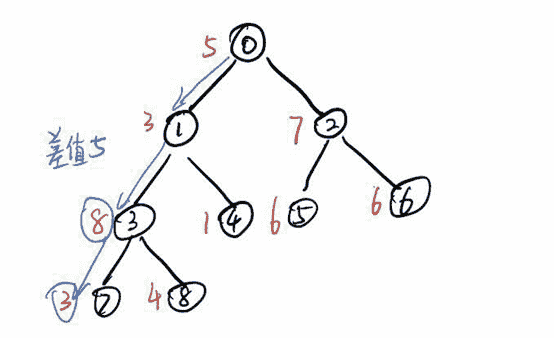

# Shopee 2019 校招部分编程题汇总

## 1

shopee 的办公室非常大，小虾同学的位置坐落在右上角，而大门却在左下角，可以把所有位置抽象为一个网格（门口的坐标为 0，0），小虾同学很聪明，每次只向上，或者向右走，因为这样最容易接近目的地，但是小虾同学不想让自己的 boss 们看到自己经常在他们面前出没，或者迟到被发现。他决定研究一下如果他不通过 boss 们的位置，他可以有多少种走法？

本题知识点

Java 工程师 C++工程师 安卓工程师 iOS 工程师 运维工程师 前端工程师 算法工程师 PHP 工程师 测试工程师 Shopee 数学 动态规划 golang 工程师 2019

讨论

[sky 游荡](https://www.nowcoder.com/profile/543255165)

玛德，开始推反了，想错了，一直过 50%贼气。

```cpp
x,y,n = map(int,input().split())
dpc = [[1 for j in range(y+1)]for j in range(x+1)]
for _ in range(n):
    i,j = map(int,input().split())
    dpc[i][j] = 0
for i in range(1,x+1):
    for j in range(1,y+1):
        if dpc[i][j]!=0:
            dpc[i][j] = dpc[i-1][j]+dpc[i][j-1]
print(dpc[-1][-1])
```

发表于 2020-04-22 21:38:36

* * *

[Justina201902231405279](https://www.nowcoder.com/profile/64376978)

```cpp
#include<iostream>
using namespace std;

int main() {
    int x, y, n;
    cin >> x >> y >> n;
    long long int dp[30 + 1][30 + 1] = {0};
    for (int i = 0; i < n; i++) {
        int x, y;
        cin >> x >> y;
        dp[x][y] = -1;
    }
    for (int i = 0;i <= x;i ++) dp[i][0] = 1;
    for (int j = 0;j <= y;j ++) dp[0][j] = 1;
    for (int i = 1; i <= x; i++) {
        for (int j = 1; j <= y; j++) {
            if (dp[i][j] == -1) continue;
            if (dp[i - 1][j] != -1) dp[i][j] += dp[i - 1][j];
            if (dp[i][j - 1] != -1) dp[i][j] += dp[i][j - 1];
        }
    }
    cout << dp[x][y] << endl;
    return 0;
}

```

发表于 2019-07-21 23:25:17

* * *

[Gelivabilities](https://www.nowcoder.com/profile/6330381)

```cpp
[x,y,n]=[int(t) for t in input().split()]
M=[[1 for j in range(y+1)]for i in range(x+1)]
for i in range(n):
    [a,b]=[int(t) for t in input().split()]
    M[a][b]=0

def myfun(M,x,y):
    for i in range(x+1):
        for j in range(y+1):
            if M[i][j]==0 or (i==0 and j==0):continue
            M[i][j]=(0 if i==0 else M[i-1][j])+(0 if j==0 else M[i][j-1])
    return M[x][y]

print(myfun(M,x,y))
```

发表于 2019-06-28 18:49:22

* * *

## 2

 shopee 的零食柜，有着各式各样的零食，但是因为贪吃，小虾同学体重日益增加，终于被人叫为小胖了，他终于下定决心减肥了，他决定每天晚上去操场跑两圈，但是跑步太累人了，他想转移注意力，忘记痛苦，正在听着音乐的他，突然有个想法，他想跟着音乐的节奏来跑步，音乐有 7 种音符，对应的是 1 到 7，那么他对应的步长就可以是 1-7 分米，这样的话他就可以转移注意力了，但是他想保持自己跑步的速度，在规定时间 m 分钟跑完。为了避免被累死，他需要规划他每分钟需要跑过的音符，这些音符的步长总和要尽量小。下面是小虾同学听的歌曲的音符，以及规定的时间，你能告诉他每分钟他应该跑多少步长？ 

本题知识点

C++工程师 golang 工程师 iOS 工程师 安卓工程师 运维工程师 前端工程师 算法工程师 测试工程师 PHP 工程师 Java 工程师 Shopee 2019 动态规划

讨论

[╰執筆☆](https://www.nowcoder.com/profile/765722265)

谁来解释下 到底什么意思  读不懂题目

发表于 2019-09-12 18:15:22

* * *

[海淀区彭于晏](https://www.nowcoder.com/profile/887697398)

```cpp
/*
这个题目的实际含义就是：
（1）把一个长度为 n 的数组，顺序不变的情况下划分为 m 个子数组，可以理解为长度为 n 的数组中插入 m-1 个 split
（2）在所有划分方案中，找到一种方案使得 m 个子数组中的和最大的子数组的和尽可能的小
*/

#include <vector>
#include <iostream>

using namespace std;

void split(vector<int>& v, int n, int m, int l, int r){
    int mid = 0;
    int last = 0;
    while(l <= r){
        mid = (l+r) / 2;
        int cnt = 0;
        for(int i=0;i<n;){
            int sum = 0;
            while(i < n && sum + v[i] <= mid){
                sum += v[i];
                i++;
            }
            cnt ++;
            if(cnt > m){
                break;
            }
        }
        if(cnt > m){
            l = mid + 1;
        }
        else{
            last = mid;    //记录最后一次符合题意的 mid
            r = mid - 1;
        }
    }
    cout << last << endl;
}

int main(){
    int n, m;
    cin >> n >> m;
    vector<int> v(n);
    int max = 0;
    int sum = 0;
    for(int i=0;i<n;i++){
        cin >> v[i];
        if(v[i] > max){
            max = v[i];
        }
        sum += v[i];
    }
    //输出的数字一定是[max, sum]之间的
    //当 m==n 的时候，每个子数组一个值，子数组和最大就是 max
    //当 1==m 的时候，整个数组分为一个子数组，子数组和最大就是 sum
    split(v, n, m, max, sum);
    return 0;
}
```

虽然没有通过所有测试用例，但是我相信肯定是测试用例不对！

发表于 2019-09-13 15:25:55

* * *

[TainyHu](https://www.nowcoder.com/profile/874568389)

首先说下结果，自测结果通过，但提交结果运行超时，case 通过率 14.29%。说明思路基本正确，但是代码需要改进，代码的时间复杂度 O(N²)。刚看时不懂题在说什么，后面看大家的讨论有点懂问题是什么。用自己的话说下，输入是这样：

```cpp
8 5 6 5 6 7 6 6 3 1
```

第一个元素 8 是后面数据长度。第二个元素 5 是要求最后的数据长度。第三个以及之后的组成需要处理的数据。也就是 

```cpp
6 5 6 7 6 6 3 1
```

是数据。共 8 个元素，要把这 8 个元素变为 5 个，但是总和不能变，每次个数-1 时，合并相邻元素之和最小的数。也就是当 8 个元素变成 7 个时，相邻元素和最小的是最后的 2 个，所以 3 与 1 相加为 4，加入链表中，而之前的 3，1 被删掉了，合并后会成为下面的数据：

```cpp
6 5 6 7 6 6 4
```

然后之后的就是 6 和 4：

```cpp
6 5 6 7 6 10
```

之后 6 和 5：

```cpp
11 6 7 6 10
```

此时数据元素为要求的 5 个，所以合并接受，要求的结果就是这组数据中最大的那个。那就是 11。返回 11 就是结果了。
Java 的实现代码如下

```cpp
import java.util.ArrayList;
import java.util.Scanner;

class Solution {
    public int getMinStep(int n, int m, ArrayList<Integer> arr) {
        int minIndex1 = 0;
        int minIndex2 = 1;
        int minSum;
        while (arr.size() != m) {
            minSum = Integer.MAX_VALUE;
            for (int i = 0, j = i + 1; i < arr.size() - 1 && j < arr.size(); i++, j++) {
                if (minSum > arr.get(i) + arr.get(j)) {
                    minSum = arr.get(i) + arr.get(j);
                    minIndex1 = i;
                    minIndex2 = j;
                }

            }
            arr.set(minIndex1, minSum);
            arr.remove(minIndex2);

            /*for (int i = 0; i < arr.size(); i++) {
                System.out.print(arr.get(i) + " ");
            }
            System.out.println(minSum+"_");*/
        }
        int result = this.getMaxInt(arr, n);
        return result;
    }

    public int getMaxInt(ArrayList<Integer> arr, int n) {
        int result = arr.get(0);
        for (int i = 0; i < arr.size(); i++) {
            if (result < arr.get(i)) {
                result = arr.get(i);
            }
        }
        return result;
    }
}

public class Main {
    public static void main(String[] args) throws Exception {
        Scanner sc = new Scanner(System.in);
        int n = sc.nextInt();
        int m = sc.nextInt();
        ArrayList<Integer> arr = new ArrayList<>();
        for (int i = 0; i < n; i++) {
            arr.add(sc.nextInt());
        }
        /*for (int i = 0; i < n; i++) {
            System.out.println(arr[i]);
        }*/
        //完成初始数据采集
        Solution solution = new Solution();
        int result = solution.getMinStep(n, m, arr);
        System.out.println(result);
    }
}
```

发表于 2020-02-08 21:48:59

* * *

## 3

在 Linux Shell 命令下通配符'*'表示 0 个或多个字符, 现编写一段代码实现通配符'*'的功能，注意只需要实现'*', 不用实现其他通配符。

本题知识点

Java 工程师 C++工程师 安卓工程师 iOS 工程师 运维工程师 前端工程师 算法工程师 PHP 工程师 测试工程师 Shopee 字符串 *查找 *哈希 *golang 工程师 2019*** ***讨论

[nbgao](https://www.nowcoder.com/profile/211289)

```cpp
#include <bits/stdc++.h>
using namespace std;

string s, t;
set<int> S;

void DFS(int i, int j){
    if(j==t.length())
        S.insert(i);
    if(i==s.length())
        return;
    if(s[i]==t[j])
        DFS(i+1, j+1);
    else if(t[j]=='*'){
        DFS(i, j+1);
        DFS(i+1, j);
        DFS(i+1, j+1);
    }
    return;
}

int main(){
    cin>>t>>s;
    bool flag = false;
    for(int i=0;i<s.length();i++){
        if(s[i]==t[0] || t[0]=='*'){
            DFS(i, 0);
            if(!S.empty()){
                flag = true;
                for(set<int>::iterator it=S.begin();it!=S.end();it++)
                    if(*it>i)
                        cout<<i<<" "<<*it-i<<endl;
            }
            S.clear();
        }
    }
    if(!flag)
        cout<<-1<<" "<<0<<endl;
    return 0;
}
```

发表于 2020-01-15 01:29:52

* * *

[牛客 372964232 号](https://www.nowcoder.com/profile/372964232)

c++抄的 offer

```cpp
#include<iostream>
#include<vector>
using namespace std;
int Core(string &str1, string &str2, int left, int right,int start, int len)
{
    int res = false;
    if(str1[left] == '\0')
    {
        cout << start << " " << len << endl; 
        return true;
    }
    if(str1[left] != '\0' && str2[right] == '\0') return false;
    //当通配字符不是*时候，判断两个个字符是否相等
    if(str1[left] != '*')
    {
        if(str1[left] != str2[right]) return false;
        else 
        {
           res = Core(str1, str2, left+1, right+1, start, len+1);
        }
    }
    //当通配字符是*时候，通配字符向后移动或者查找字符向后移动
    else
    {
        //这里要注意不能用||因为一旦第一个条件成立第二个条件不会被执行
        bool tem1 = Core(str1, str2, left+1, right, start, len) ;
        bool tem2 = Core(str1, str2, left, right+1,start, len+1);
        res = tem1||tem2;

    }
    return res;
}
int main()
{

    string str1;
    string str2;
    cin >> str1 >> str2;
    if(str1 == "*")
    {
        for(int i = 0; i < str2.size();i++)
        {
            for(int j = 1; j + i <= str2.size();j++)
            {
                cout << i << " " << j << endl;
            }
        }
        return 0;
    }
    bool res = false;
    for(int i = 0; i < str2.size();i++) 
    {
        if(Core(str1, str2, 0,i,i,0)) res = true;
    }
    if(!res) cout << -1 << " " << 0 << endl;
    return 0;
}

```

发表于 2019-08-04 15:28:22

* * *

[木析](https://www.nowcoder.com/profile/4198192)

暴力居然也可以过？？一开始做的时候都没敢往上写，看了评论区才试了下居然过了？？

```cpp
#include<iostream>
#include<stdio.h>
#include<string>
#include<cstring>
#include<vector>
#include<algorithm>
#include<math.h>
using namespace std;
bool check(string p,string s) {
    int len1=p.size();
    int len2=s.size();
    vector<vector<bool>> dp(len1+1,vector<bool>(len2+1,false)); //dp[i][j]表示 p[0...i-1]和 s[0...j-1]是否匹配
    dp[0][0]=true;
    for(int i=1;i<=len1;++i) {
        if(p[i-1]=='*')
            dp[i][0]=dp[i-1][0];
    }
    for(int i=1;i<=len1;++i) {
        for(int j=1;j<=len2;++j) {
            if(p[i-1]==s[j-1]) {
                dp[i][j]=dp[i-1][j-1];
            } else {
                if(p[i-1]=='*') {
                    dp[i][j]=dp[i-1][j] || dp[i][j-1];
                } else {
                    dp[i][j]=false;
                }
            }
        }
    }
    return dp[len1][len2];
}
int main()
{
    string p;
    cin>>p;
    string s;
    cin>>s;
    if(p.size()==0) {
        cout<<"-1 0"<<endl;
        return 0;
    }
    int len=s.size();
    if(p=="*") {
        for(int i=0;i<len;++i) {
            for(int j=1;i+j<=len;++j) {
                cout<<i<<" "<<j<<endl;
            }
        }
        return 0;
    }
    bool flag=false;
    for(int i=0;i<len;++i) {
        if(s[i]!=p[0] && p[0]!='*')
            continue;
        for(int j=1;i+j<=len;++j) {
            if(check(p,s.substr(i,j))) {
                cout<<i<<" "<<j<<endl;
                flag=true;
            }
        }
    }
    if(!flag)
        cout<<"-1 0"<<endl;
    return 0;
}
```

发表于 2021-07-04 17:28:24

* * *

## 4

 Shopee 物流会有很多个中转站。在选址的过程中，会选择离用户最近的地方建一个物流中转站。

假设给你一个二维平面网格，每个格子是房子则为 1，或者是空地则为 0。找到一个空地修建一个物流中转站，使得这个物流中转站到所有的房子的距离之和最小。 能修建，则返回最小的距离和。如果无法修建，则返回 -1。

 若范围限制在 100*100 以内的网格，如何计算出最小的距离和？

当平面网格非常大的情况下，如何避免不必要的计算？ 

本题知识点

Java 工程师 C++工程师 安卓工程师 iOS 工程师 运维工程师 前端工程师 算法工程师 PHP 工程师 测试工程师 Shopee 数组 穷举 模拟 golang 工程师 2019

讨论

[胡桃夹子的梦想](https://www.nowcoder.com/profile/757264)

```cpp
// 所有 1 点到达某个 0 点(x,y)的距离和 = 每行 1 点的数量 * 行间距 + 每列 1 点的数量 * 列间距
// 所以我们只需分别记录每行和每列 1 的数量和所有 0 点的坐标即可
#include <iostream>
#include <vector>
#include <limits>
using namespace std;

int main(){
    int n;
    cin >> n;
    //分别存储每行的 1 和每列的 1 数量
    vector<vector<int> > cnts(2, vector<int> (n, 0)); 
    //候选点（0 点）的坐标
    vector<pair<int, int> > points;
    int cnt, temp;
    for(int i = 0; i<n; ++i){
        for(int j = 0; j<n; ++j){
            cin >> temp;
            //记录每行和每列的 1 的数量
            if(temp) {
                ++cnts[0][i];
                ++cnts[1][j];
            }
            else{
                //将 0 点的坐标记录到 points 中
                points.push_back(make_pair(i, j));
            }
        }
    }
    if(points.empty()){
        cout << -1 << endl;
    }
    else{
        //计算每个 0 坐标的距离和，得到最大值
        int min = numeric_limits<int>::max(), cur_dist;
        for(auto pnt : points){
            cur_dist = 0;
            //pnt.first 横坐标，对应其他行的 1 之和，表示纵向路径和
            //pnt.second 纵坐标，对应其他列的 1 之和，表示横向路径和
            for(int i = 0; i<n; ++i){
                if(i!=pnt.first) cur_dist += abs(i-pnt.first)*cnts[0][i];
                if(i!=pnt.second) cur_dist += abs(i-pnt.second)*cnts[1][i];
            }
            if(cur_dist<min) min = cur_dist;
        }
        cout << min << endl;
    }
    return 0;
}
```

编辑于 2020-07-27 14:23:36

* * *

[nbgao](https://www.nowcoder.com/profile/211289)

```cpp
#include <bits/stdc++.h>
using namespace std;

struct P{
    int x,y;
};

int main(){
    int n;
    cin>>n;
    int G[n][n];
    vector<P> a,b;
    for(int i=0;i<n;i++)
        for(int j=0;j<n;j++){
            cin>>G[i][j];
            if(G[i][j]==1)
                a.push_back(P{i,j});
            else
                b.push_back(P{i,j});
        }

    if(b.size()==0)
        cout<<-1<<endl;
    else{
        int Min=INT_MAX;
        for(int i=0;i<b.size();i++){
            int s = 0;
            for(int j=0;j<a.size();j++)
                s += abs(a[j].x-b[i].x) + abs(a[j].y-b[i].y);
            Min = min(Min, s);
        }
        cout<<Min<<endl;
    }
    return 0;
}
```

发表于 2019-11-27 00:38:55

* * *

[Bostonpigeons](https://www.nowcoder.com/profile/4126418)

```cpp
n² 做法
二维变一维
先计算 x 轴上每个点的贡献
然后先计算 y 轴上每个点的贡献
最后计算每个所有点的贡献，求出最小值。

#include<iostream>
#include<algorithm>
#include<cstring>
#include<map>
#include<bits/stdc++.h>
using namespace std;
int z[1005][1005];
int x[1005];
int y[1005];
int vx[1005],vy[1005];
int main()
{
  //  freopen("in","r",stdin);
    int n;
    cin>>n;
    int t;
    int sum=0;
    for(int i=0;i<n;i++){
        for(int j=0;j<n;j++){
            cin>>z[i][j];
            if(z[i][j]==1){
                x[i]++;
                y[j]++;
                sum++;
            }
        }
    }
    int sumx=0;
    int numx=0;
    for(int i=0;i<n;i++){
        numx+=(x[i]*(i+1));
    }
    for(int i=0;i<n;i++){
        numx-=(sum-sumx);
        numx+=sumx;
        vx[i]=numx;
        sumx+=x[i];
       // cout<<vx[i]<<' '<<numx<<' '<<sumx<<endl;
    }
    int sumy=0;
    int numy=0;
    for(int i=0;i<n;i++){
        numy+=(y[i]*(i+1));
    }
    for(int i=0;i<n;i++){
        numy-=(sum-sumy);
        numy+=sumy;
        vy[i]=numy;
        sumy+=y[i];
    }

    int maxn=100000000;
    for(int i=0;i<n;i++ ){
        for(int j=0;j<n;j++){
            if(z[i][j]==0){
                //cout<<vx[i]+vy[j]<<endl;
                maxn=min(maxn,vx[i]+vy[j]);
            }
        }
    }
    if(maxn==100000000)
    cout<<-1<<endl;
    else cout<<maxn<<endl;
    return 0;
}

```

发表于 2019-06-29 16:27:08

* * *

## 5

Shopee 的 Orange Day
Shopee 每个月都有属于大家的节日，每到这个时候，大家都会穿着橙色的 T 恤，吃着水果蛋糕，做着游戏。瞧，今天又是 Orange Day 了，吃货小虾同学早早的来到现场，看看有没有什么吃的，刚刚走进去就发现我们的前台 mm 愁眉苦脸的看着挂满礼物的发财树，细看发现，发财树的树枝因为承重不均，东倒西歪。是时候展现真正的技术啦，小虾同学，马上走上去，让前台 mm 把挂礼物的方案拿出来，前台 mm 拿出一大叠方案，小虾同学顿时傻眼了，但是他马上想到了一个方法，写一个程序判断每种方案的承重误差，把不合格的都干掉就行了。经过分析，把发财树抽象为一颗树。只要发财树的从顶部到各个叶子的各个路径上面的最大最小重量的差值在方案的误差范围内，就可以正常承重。

输入第一行表示数据样例数 T，表示接下来会有 T 个相同格式的样例输入

每个样例输入如下

输入的第一行输入 n,（2 ≤ n ≤ 100000，节点的编号为 0 到 n-1,0 为根节点）组成，

第二行有 n 个数，表示每个节点挂的礼物的重量 w（1<= w<= 1000）
下面是 n-1 行，每行有两个整数，第一个数表示父节点的编号，第二个数表示子节点的编号

输出最大差值。

你的答案

本题知识点

Java 工程师 C++工程师 安卓工程师 iOS 工程师 运维工程师 前端工程师 算法工程师 PHP 工程师 测试工程师 Shopee golang 工程师 2019

讨论

[JJJJJin](https://www.nowcoder.com/profile/190689917)

```cpp
n = int(input())
w = list(map(int, input().split())) #输入每个节点的礼物重量
num = [list(map(int, input().split())) for i in range(n-1)] #输入父节点+子节点

for i in num:
    fa = i[0]
    son = i[1]
    weight = float('-inf')
    weight_tem = abs(w[fa] - w[son])
    if weight_tem > weight:
        weight = weight_tem

print(weight)
```

发表于 2020-07-20 22:16:11

* * *

[呷脯呷脯](https://www.nowcoder.com/profile/32854682)

```cpp
//参照 kakifuu 大佬的做法，我觉得他构建树的时候有点迷，没看明白，
//于是就借鉴了一下思路，利用回溯方法来做这道题，自己随便写了个测试用例至少是通过了
//望大佬们指正！

public class ChristmasTree {
    static int sum = 0;
    static int max = Integer.MIN_VALUE;
    static class Node{
        int val;
        List<Node> children;
        Node(int val){
            this.val = val;
            children = new ArrayList<>();
        }
        public void addChild(Node node){
            children.add(node);
        }
    }

    public static void dfs(Node node){
        sum += node.val;
        if(node.children.size()==0){
            max = Math.max(max,sum);
        }else{
            for(int i=0;i<node.children.size();i++){
                dfs(node.children.get(i));
            }
        }
        sum-=node.val;

    }

    public static void main(String[] args) {
        System.out.println("请输入节点总数：");
        Scanner scanner = new Scanner(System.in);
        int n = scanner.nextInt();
        Node[] nodes = new Node[n];
        System.out.println("请输入每个结点的重量：");
        for(int i=0;i<n;i++){
            int val = scanner.nextInt();
            nodes[i] = new Node(val);
        }

        //构建树
        System.out.println("请输入父子节点编号：");
        for(int i=0;i<n-1;i++){
            int parentNum = scanner.nextInt();
            int childNum = scanner.nextInt();
            nodes[parentNum].addChild(nodes[childNum]);
        }
        dfs(nodes[0]);
        System.out.println("最大重量为："+max);
    }
}

```

```cpp
请输入节点总数：
5
请输入每个结点的重量：
5 3 7 8 1
请输入父子节点编号：
0 1
0 2
1 3
1 4
最大重量为：16
```

编辑于 2020-07-14 10:40:05

* * *

[Slippers_](https://www.nowcoder.com/profile/53354801)

```cpp
import java.util.*;

// 深度遍历，用栈实现

public class Main {

    static class point{
        int old, young;
        point(int old, int young){ this.old = old; this.young = young; }
    }

    public static void main(String[] args) {
        Scanner in = new Scanner(System.in);
        int t = in.nextInt();
        while(t-- != 0){
            int n = in.nextInt();
            int[] weight = new int[n];
            for(int i = 0; i < n; i++) weight[i] = in.nextInt();
            Map<Integer, LinkedList<Integer>> map = new HashMap();
            for(int i = 0; i < n - 1; i++) {
                int tmpOld = in.nextInt(); int tmpYoung = in.nextInt();
                LinkedList<Integer> tmpList = map.get(tmpOld);
                if(tmpList == null) tmpList = new LinkedList<>();
                tmpList.add(tmpYoung);
                map.put(tmpOld, tmpList);
            }
            for(int i = 0; i < map.size(); i++){
                System.out.println(i + "  " + map.get(i).toString());
            }

            LinkedList<point> stack = new LinkedList<>();
            point p = new point(0, 0);
            // 深度遍历
            int max = 0;
            Vector<Integer> nums = new Vector<>();
            while(stack.size() != 0 || p != null){
                while(p != null){
                    stack.add(p);
                    nums.add(weight[p.young]);
                    int pYoung = p.young;
                    if(map.get(p.young) != null && map.get(p.young).size() != 0) {
                        p = new point(pYoung, map.get(pYoung).poll());
                    }
                    else p = null;
                }
                System.out.println("走到最底： " + nums.toString());
                Object[] numsArr = nums.toArray();
                Arrays.sort(numsArr);
                max = Math.max((Integer) numsArr[numsArr.length - 1] - (Integer) numsArr[0], max);
                System.out.println("max: " + max);
                if(stack.size() != 0){
                    p = stack.removeLast();
                    if(p.old == 0 && p.young == 0){
                        System.out.println("最大差值为： " + max); return;
                    }
                    p = stack.getLast();
                    nums.remove(nums.size() - 1);
                    System.out.println("移走元素后：" + nums.toString());
                    int pYoung = p.young;
                    if(map.get(p.young) != null && map.get(p.young).size() != 0){
                        p = new point(pYoung, map.get(pYoung).poll());
                    }
                    else {
                        p = null;
                    }
                }
            }

        }

    }
}
```

发表于 2020-03-28 00:52:03

* * ****