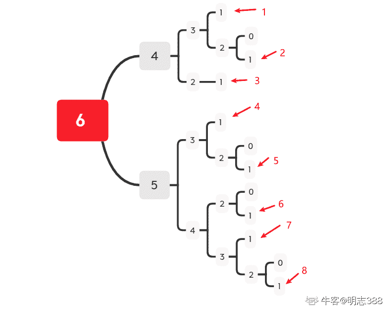
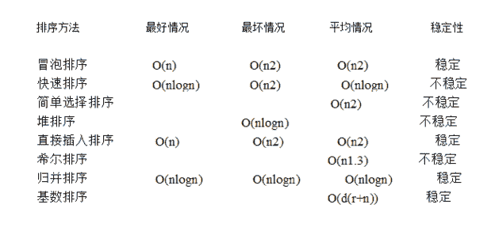
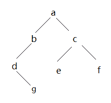
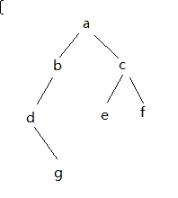

# 英语流利说 2019 秋招技术类笔试题

## 1

SQL 查询中，只有满足联接条件的记录才包含在查询结果中，这种联接为 ____。 

正确答案: C   你的答案: 空 (错误)

```cpp
左联接
```

```cpp
右联接
```

```cpp
内部联接
```

```cpp
完全联接
```

本题知识点

Java 工程师 C++工程师 安卓工程师 iOS 工程师 运维工程师 前端工程师 算法工程师 PHP 工程师 测试工程师 流利说 2019

讨论

[LeeReindeer](https://www.nowcoder.com/profile/237745022)

*   Inner join：又称为等值连接，只选择满足条件的行
*   Outer join：外连接会保存没有关联的行
    *   left outer join：保存左边表的所有行
    *   right outer join：保存右边表的所有行
    *   full join：保存所有没有关联的行，当某行在另一个表中没有匹配行时，则另一个表的列为空值

编辑于 2019-06-26 20:19:35

* * *

[zhoutiantian](https://www.nowcoder.com/profile/160776496)

内联接就是指，两个表都有满足条件的数据会被查询出来

发表于 2019-06-18 10:58:43

* * *

[牛客 111530261 号](https://www.nowcoder.com/profile/111530261)

内部链接的概念可以自己再看看

发表于 2020-12-28 11:35:28

* * *

## 2

编号为 1 至 10 个果盘中，每盘都盛有水果，共盛放 100 个。其中第一盘里有 16 个，并且编号相邻的三个果盘中水果数的合都相等，求第 8 盘中水果最多可能有几个？

正确答案: B   你的答案: 空 (错误)

```cpp
11
```

```cpp
12
```

```cpp
13
```

```cpp
14
```

本题知识点

Java 工程师 C++工程师 安卓工程师 iOS 工程师 运维工程师 前端工程师 算法工程师 PHP 工程师 测试工程师 流利说 2019

讨论

[ajune](https://www.nowcoder.com/profile/415709869)

感觉答案有问题
1,4,7,10 的盘子水果个数相同，每个里面 16 个还剩下 100-16*4=36 个 2,3；5,6；8,9 的和数相同，为 12，由于每个盘子都有水果，第 8 盘则最多有 11 个

发表于 2019-06-15 11:37:24

* * *

[abserver](https://www.nowcoder.com/profile/252944924)

正确答案：11 由：相邻三个和相等  -> 盘中有相等个数的：1-4   2-5   3-6   4-7   5-8   6-9   7-10-> 盘中有相等个数的：1-4-7-10   2-5-8   3-6-9 由：第 1 个盘子有 16 个->  1-4-7-10 组有 64 个由：总共 100 个->  2-5-8 3-6-9 两组的和为 36 个由：每个盘子至少 1 个->  3x + 3y = 36，x>0, y>0->  y = 12 - x, x>0, y>0->  x < 12-> x 的最大取值为 11

发表于 2019-07-09 15:03:40

* * *

[今昔何夕.](https://www.nowcoder.com/profile/8577087)

4*16 + 3( x+y) =100，x+y =12，每个盘都有水果，所以 x,y＜12。答案为 11。

发表于 2019-06-18 12:35:30

* * *

## 3

```cpp
int foo(int n) {
    if (n < 2) return n;
    return foo(n - 1) + foo(n - 2);
}
```

当 n = 6 时，函数的返回值是（）

正确答案: C   你的答案: 空 (错误)

```cpp
5
```

```cpp
7
```

```cpp
8
```

```cpp
1
```

本题知识点

C++工程师 流利说 2019 C 语言

讨论

[SZU_QicaiHuang](https://www.nowcoder.com/profile/985959958)



发表于 2020-12-04 22:41:24

* * *

[华一](https://www.nowcoder.com/profile/127072686)

Fibonacci 数列

发表于 2019-06-19 10:56:33

* * *

[Doctor.Zhu](https://www.nowcoder.com/profile/9059351)

根据递归式可以得到：foo(1)+foo(0)+ foo(1)+foo(1)+foo(0)+foo(1)+foo(0)+foo(1)+foo(0)+foo(1)+foo(1)+foo(1) = 8

发表于 2019-06-14 21:40:02

* * *

## 4

以下哪个输出序列不可能是二叉查找树（Binary Search Tree）后序遍历的输出。

正确答案: D   你的答案: 空 (错误)

```cpp
1, 2, 3, 4, 5
```

```cpp
5, 4, 3, 2, 1
```

```cpp
1, 3, 2, 4, 5
```

```cpp
1, 2, 5, 3, 4
```

本题知识点

Java 工程师 C++工程师 安卓工程师 iOS 工程师 运维工程师 前端工程师 算法工程师 PHP 工程师 测试工程师 流利说 2019

讨论

[Suu_ 翠時期](https://www.nowcoder.com/profile/9968237)

对于二叉查找树的后序遍历序列，最后一位是它的根结点，那从左往右数，第一个比这个根结点大的结点就属于根结点的右子树（二叉排序树的一个结点的右子树上的结点都大于它自己，而左子树则都小于它自己）因此在这个结点后面不会存在比根结点小的数字

编辑于 2019-08-03 20:19:58

* * *

[abserver](https://www.nowcoder.com/profile/252944924)

假设输入的数组是二叉查找树的后序遍历，分步骤分析思路：    1 对于一个数组输入：{e1, e2, e3, e4, e5}，最后一个结点 e5 是父节点，其余元素分成两派：左子树，右子树(分派依据是比根结点大/小)    2 对左右子树重复使用 1 的规则。
可以看到，这是递归的算法。以选项 C 为例：    输入：{1, 3, 2, 4, 5}，最后一个结点 5 是父结点，发现有左子树，没有右子树，规模调整为{1, 3, 2}
    输入：{1, 3, 2}，最后一个结点 2 是父节点，有左子树，右子树，且没有孙结点，问题规模调整为{1}，{3}    由以上两次输入分析可以画出这颗二叉搜索树：                5
               /  
            2
           /  \
         1    3
以选项 D 为例：    输入：{1, 2, 5, 3, 4}，最后一个结点 4 是父结点，发现剩下元素不能成为左右子树两派，故该输入不是二叉查找树的后序遍历。

发表于 2019-07-11 14:34:19

* * *

[小小苏苏](https://www.nowcoder.com/profile/7509553)

二叉查找树,左儿子小于根,右儿子大于根

发表于 2019-06-20 15:37:17

* * *

## 5

有一次数学比赛，共有 A，B 和 C 三道题目。所有人都至少解答出一道题目，总共有 25 人。在没有答出 A 的人中，答出 B 的人数是答出 C 的人数的两倍；单单答出 A 的人，比其他答出 A 的人总数多 1；在所有只有答出一道题目的人当中，答出 B 和 C 的人数刚好是一半。

求只答出 B 的人数。

正确答案: C   你的答案: 空 (错误)

```cpp
4
```

```cpp
5
```

```cpp
6
```

```cpp
8
```

本题知识点

Java 工程师 C++工程师 安卓工程师 iOS 工程师 运维工程师 前端工程师 算法工程师 PHP 工程师 测试工程师 流利说 2019

讨论

[saltyfishzj](https://www.nowcoder.com/profile/316978082)

提供一种解法，欢迎讨论所有人至少答出一道题，所以答对的情况有 A,B,C,AB,AC,BC,ABC 7 种情况没有答出 A 的人中，答出 B 的人数是答出 C 的人数的两倍，即 B+BC = 2(C+BC);单单答出 A 的人，比其他答出 A 的人总数多 1，即 A = 1+AB+AC+ABC;
只答出一道题目的人当中，答出 B 和 C 的人数刚好是一半，即 A = B+C;
一共 25 人，可得 A+B+C+(A-1)+(B-2*C) = 25  ==>  4*B+C = 26;B>2*C 所以 B=6,C=2,A=8（B=5 时 C=6 不满足条件，B=7 时 C<0 不满足条件），还可得出 BC=2，AB+AC+ABC=7

发表于 2019-06-17 19:00:18

* * *

[Strive~~](https://www.nowcoder.com/profile/573926722)

答对题出现的情况：A，B，C，AC，AB，BC，ABC 七种。
x ：只答出 A 的人；
y ：没有答出 A 的所有答出 C 的人；
2y ：没有答出 A 的所有答出 B 的人；（在没有答出 A 的人中，答出 B 的人数是答出 C 的人数的两倍）
z ：答出 BC 题的人；
方程①：x+(x-1)+(2y-z)+(y-z)+z=25;
方程②：((2y-z)+(y-z))*2=x+(2y-z)+(y-z);
由两式可得：9y-5z=26;
假设 z=1,z=2,z=3;获得一组解：z=2,y=4，所以只答出 B 的人数为 6（=2*4-2）；

发表于 2019-06-23 11:14:55

* * *

## 6

快速排序的平均时间复杂度为 __ ，最坏情况下的时间复杂度为 __。

正确答案: C   你的答案: 空 (错误)

```cpp
O(n)；O(n²)
```

```cpp
O(n)；O(nlogn)
```

```cpp
O(nlogn)；O(n²)
```

```cpp
O(nlogn)；O(nlogn)
```

本题知识点

Java 工程师 C++工程师 安卓工程师 iOS 工程师 运维工程师 前端工程师 算法工程师 PHP 工程师 测试工程师 流利说 2019

讨论

[东封](https://www.nowcoder.com/profile/874414295)



发表于 2019-07-18 20:41:10

* * *

## 7

下列对于数据库索引的说法一定是错误的: 

正确答案: C   你的答案: 空 (错误)

```cpp
对于只有很少数据值的列，不应该创建索引
```

```cpp
全表扫描不一定比使用索引的执行效率低
```

```cpp
索引不会影响表的删除操作效率
```

```cpp
主键一定包含一个唯一索引
```

本题知识点

Java 工程师 C++工程师 安卓工程师 iOS 工程师 运维工程师 前端工程师 算法工程师 PHP 工程师 测试工程师 流利说 2019

讨论

[随便看看啊](https://www.nowcoder.com/profile/903114229)

如果要删除的字段与建立索引的字段相同，删除效率会提高，如果不同，效率降低。

发表于 2019-07-01 11:20:58

* * *

[西湖看雪](https://www.nowcoder.com/profile/373129627)

A、B 选项有异曲同工之妙。如果使用索引，每次查询数据，将对磁盘进行一次读取。也就是说，查询数据条目数等于磁盘读取数。如果进行全表扫描，对磁盘的读取数，取决于数据块的大小。当遇到想读取的数据量比较大的时候，索引读取给磁盘造成的负担将会远大于全盘读取对磁盘造成的负担，而读存磁盘的速率正是当前总速率的瓶颈。对于 D 选项，要搞清楚几个概念。主码、主键、候选码。首先主码就是主键，其次候选码是可以标识一个元组的最小属性集合。举个例子来说，有一个表格【城市名、街道名、邮政编码、商铺】，在这里【城市名、街道名】、【邮政编码、街道名】都是候选码，而主码可以从他们两个中挑选一个，可以是前者，也可以是后者。候选码可以有多个，主码只能有一个。主码只有一个，不允许有空值，它一定包含一个不含空值的索引。

发表于 2019-08-19 17:02:49

* * *

## 8

已知一棵二叉树的先序遍历序列和中序遍历序列分别是 abdgcef、dgbaecf，求二叉树的后序遍历序列 。

正确答案: D   你的答案: 空 (错误)

```cpp
dgbecfa
```

```cpp
gdbecfa
```

```cpp
dgbfeca
```

```cpp
gdbefca
```

本题知识点

Java 工程师 C++工程师 安卓工程师 iOS 工程师 运维工程师 前端工程师 算法工程师 PHP 工程师 测试工程师 流利说 2019

讨论

[R-LLLLLLLLLLLLLLL](https://www.nowcoder.com/profile/521492615)



发表于 2019-06-15 15:30:15

* * *

[Smile～～～～～～](https://www.nowcoder.com/profile/5899395)

***遍历的先后顺序***

先序遍历（根左右）中序遍历（左根右）后序遍历（左右根）

发表于 2019-06-24 17:37:24

* * *

[紫溪明](https://www.nowcoder.com/profile/628368209)

通过前序和中序确定 root 和左子树、右子树，然后重建二叉树

发表于 2019-06-20 21:10:18

* * *

## 9

TCP 三次握手的过程，accept 发生在三次握手哪个阶段？

正确答案: D   你的答案: 空 (错误)

```cpp
第一次握手
```

```cpp
第二次握手
```

```cpp
第三次握手
```

```cpp
三次握手后
```

本题知识点

Java 工程师 C++工程师 安卓工程师 iOS 工程师 运维工程师 前端工程师 算法工程师 PHP 工程师 测试工程师 流利说 2019

讨论

[起一个响亮的名字 zzz](https://www.nowcoder.com/profile/145950000)

第一次握手：客户端发送 syn 包(syn=j)到服务器。 
第二次握手：服务器收到 syn 包，必须确认客户的 SYN（ack=j+1），同时自己也发送一个 ASK 包（ask=k）。 
第三次握手：客户端收到服务器的 SYN＋ACK 包，向服务器发送确认包 ACK(ack=k+1)。 
三次握手完成后，客户端和服务器就建立了 tcp 连接。这时可以调用 accept 函数获得此连接

发表于 2019-07-29 20:50:33

* * *

[向程序学编程](https://www.nowcoder.com/profile/95577843)

这个有点不清楚， a 发给 b，a 要发送一个 seq 为 100 和确认号 ack； 然后，b 发给 a1 和 2 和 3 三个数据，还有一个序列号和确认号，这时 ack 为 101，也有一个 seq，好像是 aeq 控制传送量，若为 2； 最后，a 再给 b 发，a 发现 b 只接受了两个，再控制 seq，继续发 3，ack=seq+1 模糊印象，不对的请大家指正

发表于 2019-06-18 02:16:26

* * *

## 10

以下 http 状态码中哪一个是永久重定向？

正确答案: A   你的答案: 空 (错误)

```cpp
301
```

```cpp
302
```

```cpp
303
```

```cpp
307
```

本题知识点

Java 工程师 C++工程师 安卓工程师 iOS 工程师 运维工程师 前端工程师 算法工程师 PHP 工程师 测试工程师 流利说 2019

讨论

[^_²⁰¹⁹⁰²²⁵¹⁴⁵¹⁷⁹⁸](https://www.nowcoder.com/profile/151637244)

常用的状态码：

1XX：通知

2XX: 成功

3XX 重定向

1.  [301 Moved Permanently](https://baike.baidu.com/item/HTTP%E7%8A%B6%E6%80%81%E7%A0%81/5053660?fr=aladdin#3_2)
2.  ▪ [302 Move Temporarily](https://baike.baidu.com/item/HTTP%E7%8A%B6%E6%80%81%E7%A0%81/5053660?fr=aladdin#3_3)
3.  [303 See Other](https://baike.baidu.com/item/HTTP%E7%8A%B6%E6%80%81%E7%A0%81/5053660?fr=aladdin#3_4)
4.  [307 Temporary Redirect](https://baike.baidu.com/item/HTTP%E7%8A%B6%E6%80%81%E7%A0%81/5053660?fr=aladdin#3_8)

4XX：客户端错误

5XX 服务端错误

编辑于 2019-06-20 10:32:59

* * *

[诺心妍](https://www.nowcoder.com/profile/113749366)

HTTP 协议的响应报文由状态行、响应头部和响应包体组成，其响应状态码总体描述如下：

1xx：指示信息--表示请求已接收，继续处理。

2xx：成功--表示请求已被成功接收、理解、接受。

3xx：重定向--要完成请求必须进行更进一步的操作。

4xx：客户端错误--请求有语法错误或请求无法实现。

5xx：服务器端错误--服务器未能实现合法的请求。

常见状态代码、状态描述的详细说明如下。

200 OK：客户端请求成功。

206 partial content 服务器已经正确处理部分 GET 请求，实现断点续传或同时分片下载，该请求必须包含 Range 请求头来指示客户端期望得到的范围

300 multiple choices（可选重定向）:被请求的资源有一系列可供选择的反馈信息，由浏览器/用户自行选择其中一个。

301  moved permanently（永久重定向）：该资源已被永久移动到新位置，将来任何对该资源的访问都要使用本响应返回的若干个 URI 之一。

302 move temporarily(临时重定向)：请求的资源现在临时从不同的 URI 中获得，

304：not modified :如果客户端发送一个待条件的 GET 请求并且该请求以经被允许，而文档内容未被改变，则返回 304,该响应不包含包体（即可直接使用缓存）。

403 Forbidden：服务器收到请求，但是拒绝提供服务。

t Found：请求资源不存在，举个例子：输入了错误的 URL。

发表于 2019-07-16 09:33:29

* * *

[如此 201809271455765](https://www.nowcoder.com/profile/291246999)

| 分类 | 分类描述 |
| 1** | 信息，服务器收到请求，需要请求者继续执行操作 |
| 2** | 成功，操作被成功接收并处理 |
| 3** | 重定向，需要进一步的操作以完成请求 |
| 4** | 客户端错误，请求包含语法错误或无法完成请求 |
| 5** | 服务器错误，服务器在处理请求的过程中发生了错 
下面是常见的 HTTP 状态码：

*   200 - 请求成功
*   301 - 资源（网页等）被永久转移到其它 URL
*   404 - 请求的资源（网页等）不存在
*   500 - 内部服务器错误

 |

发表于 2019-07-12 11:32:38

* * *

## 11

Java 线程中关于 wait 和 sleep 方法相关的描述正确的是？

正确答案: D   你的答案: 空 (错误)

```cpp
它们都会让当前线程释放锁。
```

```cpp
它们都是 Thread 类里面的方法。
```

```cpp
wait 方法用于线程间通信，调用后不会释放锁。
```

```cpp
sleep 方法强制线程休眠，但不会释放锁。
```

本题知识点

Java 工程师 C++工程师 安卓工程师 iOS 工程师 运维工程师 前端工程师 算法工程师 PHP 工程师 测试工程师 流利说 2019

讨论

[李武华](https://www.nowcoder.com/profile/780772419)

Wait 是 object 方法释放锁 sleep 是 thread 类方法 不释放锁

发表于 2019-07-07 20:58:46

* * *

[joyh](https://www.nowcoder.com/profile/661382648)

wait 会释放锁

发表于 2019-07-06 19:49:33

* * *

[vickyZhang.](https://www.nowcoder.com/profile/4874810)

wait 是 object 类

发表于 2019-06-16 08:57:29

* * *

## 12

以下哪个不是产生死锁的必要条件？

正确答案: C   你的答案: 空 (错误)

```cpp
互斥条件：一个资源每次只能被一个进程使用
```

```cpp
请求与保持条件：一个进程因请求资源而阻塞时，对已获得的资源保持不放
```

```cpp
先来先服务条件：多个进程在等待同一资源时，资源将优先分配给先请求者
```

```cpp
循环等待条件：若干进程之间形成一种头尾相接的循环等待资源关系
```

本题知识点

Java 工程师 C++工程师 安卓工程师 iOS 工程师 运维工程师 前端工程师 算法工程师 PHP 工程师 测试工程师 流利说 2019

讨论

[文跃](https://www.nowcoder.com/profile/655152628)

死锁产生的 4 个必要条件
    1、互斥：某种资源一次只允许一个进程访问，即该资源一旦分配给某个进程，其他进程就不能再访问，直到该进程访问结束。
    2、占有且等待：一个进程本身占有资源（一种或多种），同时还有资源未得到满足，正在等待其他进程释放该资源。
    3、不可抢占：别人已经占有了某项资源，你不能因为自己也需要该资源，就去把别人的资源抢过来。
    4、循环等待：存在一个进程链，使得每个进程都占有下一个进程所需的至少一种资源。

发表于 2019-06-25 08:55:47

* * *

## 13

数字证书不包含（   ）。

正确答案: B   你的答案: 空 (错误)

```cpp
颁发机构的名称
```

```cpp
证书持有者的私有密钥信息
```

```cpp
证书的有效期
```

```cpp
CA 签发证书时所使用的签名算法
```

本题知识点

Java 工程师 C++工程师 安卓工程师 iOS 工程师 运维工程师 前端工程师 算法工程师 PHP 工程师 测试工程师 流利说 2019

讨论

[诺心妍](https://www.nowcoder.com/profile/113749366)

1）概念：

数字证书是数字证书在一个身份和该身份的持有者所拥有的公/私钥对之间建立了一种联系，由认证中心（CA）或者认证中心的下级认证中心颁发的。根证书是认证中心与用户建立信任关系的基础。在用户使用数字证书之前必须首先下载和安装。

认证中心是一家能向用户签发数字证书以确认用户身份的管理机构。为了防止数字凭证的伪造，认证中心的公共密钥必须是可靠的，认证中心必须公布其公共密钥或由更高级别的认证中心提供一个电子凭证来证明其公共密钥的有效性，后一种方法导致了多级别认证中心的出现。

2）数字证书颁发过程：

数字证书颁发过程如下：用户产生了自己的密钥对，并将公共密钥及部分个人身份信息传送给一家认证中心。认证中心在核实身份后，将执行一些必要的步骤，以确信请求确实由用户发送而来，然后，认证中心将发给用户一个数字证书，该证书内附了用户和他的密钥等信息，同时还附有对认证中心公共密钥加以确认的数字证书。当用户想证明其公开密钥的合法性时，就可以提供这一数字证书。

3）内容：

数字证书的格式普遍采用的是 X.509V3 国际标准，一个标准的 X.509 数字证书包含以下一些内容：

1、证书的版本信息；

2、证书的序列号，每个证书都有一个唯一的证书序列号；

3、证书所使用的签名算法；

4、证书的发行机构名称，命名规则一般采用 X.500 格式；

5、证书的有效期，通用的证书一般采用 UTC 时间格式；

6、证书所有人的名称，命名规则一般采用 X.500 格式；

7、证书所有人的公开密钥；

8、证书发行者对证书的签名。

发表于 2019-07-16 10:48:45

* * *

## 14

TCP 的连接如何建立，又是如何关闭？

正确答案: A   你的答案: 空 (错误)

```cpp
3 次握手, 4 次挥手
```

```cpp
3 次握手, 3 次挥手
```

```cpp
2 次握手, 3 次挥手
```

```cpp
4 次握手, 4 次挥手
```

本题知识点

Java 工程师 C++工程师 安卓工程师 iOS 工程师 运维工程师 前端工程师 算法工程师 PHP 工程师 测试工程师 流利说 2019

讨论

[文廷钰](https://www.nowcoder.com/profile/32499407)

TCP 建立连接是通过三次握手，关闭连接是四次挥手

发表于 2020-06-17 09:35:24

* * *

[牛客 527375325 号](https://www.nowcoder.com/profile/527375325)

建立一个 TCP 连接 　　TCP 使用三次握手 （ three-way handshake ） 协议来建立连接，下图描述了三次握手的报文序列。这三次握手为： 请求端（通常称为客户）发送一个 SYN 报文段（ SYN 为 1 ）指明客户打算连接的服务器的端口，以及初始顺序号（ ISN ）。 服务器发回包含服务器的初始顺序号的 SYN 报文段（ SYN 为 1 ）作为应答。同时，将确认号设置为客户的 ISN 加 1 以对客户的 SYN 报文段进行确认（ ACK 也为 1 ）。 客户必须将确认号设置为服务器的 ISN 加 1 以对服务器的 SYN 报文段进行确认（ ACK 为 1 ），该报文通知目的主机双方已完成连接建立。 　 　发送第一个 SYN 的一端将执行主动打开（ active open ），接收这个 SYN 并发回下一个 SYN 的另一端执行被动打开（ passive open ）。另外， TCP 的握手协议被精心设计为可以处理同时打开（ simultaneous open ），对于同时打开它仅建立一条连接而不是两条连接。因此，连接可以由任一方或双方发起，一旦连接建立，数据就可以双向对等地流动，而没有所谓的主从关系。 　 　三次握手协议是连接两端正确同步的充要条件。因为 TCP 建立在不可靠的分组传输服务之上，报文可能丢失、延迟、重复和乱序，因此协议必须使用超时和重传机制。如果重传的连接请求和原先的连接请求在连接正在建立时到达，或者当一个连接已经建立、使用和结束之后，某个延迟的连接请求才到达，就会出现问题。采用三次握手协议（加上这样的规则：在连接建立之后 TCP 就不再理睬又一次的连接请求）就可以解决这些问题。 　　三次握手协议可以完成两个重要功能：它确保连接双方做好传输准备，并使双方统一了初始顺序号。初始顺序号是在握手期间传输顺序号并获得确认：当一端为建立连接而发送它的 SYN 时，它为连接选择一个初始顺序号；每个报文段都包括了顺序号字段和确认号字段，这使得两台机器仅仅使用三个握手报文就能协商好各自的数据流的顺序号。一般来说， ISN 随时间而变化，因此每个连接都将具有不同的 ISN 。 关闭一个 TCP 连接 　　TCP 连接建立起来后，就可以在两个方向传送数据流。当 TCP 的应用进程再没有数据需要发送时，就发关闭命令。 TCP 通过发送控制位 FIN=1 的数据片来关闭本方数据流，但还可以继续接收数据，直到对方关闭那个方向的数据流，连接就关闭。 　　TCP 协议使用修改的三次握手协议来关闭连接， 如图 3-11 所示，即终止一个连接要经过 4 次握手。这是因为 TCP 的半关闭（ half-close ）造成的。由于一个 TCP 连接是全双工（即数据在两方向上能同时传递），因此每个方向必须单独地进行关闭。关闭的原则就是当一方完成它的数据发送任务后就能发送一个 FIN 来终止这个方向连接。当一端收到一个 FIN ，它必须通知应用层另一端已经终止了那个方向的数据传送。发送 FIN 通常是应用层进行关闭的结果。

编辑于 2020-06-15 12:58:42

* * *

## 15

TCP 连接有多重状态，如何在系统中查看某个连接的状态 ？

正确答案: B   你的答案: 空 (错误)

```cpp
ping
```

```cpp
netstat
```

```cpp
ifconfig
```

```cpp
traceroute
```

本题知识点

Java 工程师 C++工程师 安卓工程师 iOS 工程师 运维工程师 前端工程师 算法工程师 PHP 工程师 测试工程师 流利说 2019

讨论

[诺心妍](https://www.nowcoder.com/profile/113749366)

(1) ping ：连接是否正常，主要测试抖动，丢包率 (2) netstat ：某个连接的状态(3) ifconfig：显示或配置网络的设备(4) traceroute：跟踪数据包到达主机所经过的路由工具 

编辑于 2019-07-16 14:32:02

* * *

[405200856](https://www.nowcoder.com/profile/405200856)

TCP 连接有多重状态，netstat 可以在系统中查看某个连接的状态

发表于 2019-07-16 16:20:06

* * *

## 16

http 状态码中，(  )表示访问成功，(  )表示坏请求，(  )表示服务不可用。

正确答案: A   你的答案: 空 (错误)

```cpp
2xx, 4xx, 5xx
```

```cpp
1xx, 4xx, 3xx
```

```cpp
2xx, 4xx, 3xx
```

```cpp
3xx, 1xx, 4xx
```

本题知识点

Java 工程师 C++工程师 安卓工程师 iOS 工程师 运维工程师 前端工程师 算法工程师 PHP 工程师 测试工程师 流利说 2019

讨论

[陈信宏](https://www.nowcoder.com/profile/946120457)

HTTP 1.1 中的状态码被分为五大类： 100-199 用于指定客户端应相应的某些动作。 
200-299 用于表示请求成功。 
300-399 用于已经移动的文件并且常被包含在定位头信息中指定新的地址信息。 
400-499 用于指出客户端的错误。 
500-599 用于支持服务器错误。

发表于 2019-06-20 21:00:16

* * *

## 17

使用 SQL 命令将学生表 STUDENT 中的学生年龄 AGE 字段的值增加 1 岁，应该使用的命令是? 

正确答案: B   你的答案: 空 (错误)

```cpp
REPLACE AGE WITH AGE＋1;
```

```cpp
UPDATE STUDENT SET AGE＝AGE＋1;
```

```cpp
UPDATE STUDENT AGE WITH AGE＋1;
```

```cpp
UPDATE SET AGE WITH AGE＋1;
```

本题知识点

Java 工程师 C++工程师 安卓工程师 iOS 工程师 运维工程师 前端工程师 算法工程师 PHP 工程师 测试工程师 流利说 2019

讨论

[空罐少女](https://www.nowcoder.com/profile/3759302)

这没什么好说的吧

发表于 2019-10-12 21:39:23

* * *

## 18

在关系数据库中，建立数据库表时，将年龄字段值限制在 0～18 岁之间的这种约束属于 ___。

正确答案: C   你的答案: 空 (错误)

```cpp
实体完整性约束
```

```cpp
参照完整性约束
```

```cpp
域完整性约束
```

```cpp
视觉完整性约束
```

本题知识点

Java 工程师 C++工程师 安卓工程师 iOS 工程师 运维工程师 前端工程师 算法工程师 PHP 工程师 测试工程师 流利说 2019 golang 工程师 大数据开发工程师 信息技术岗 安全工程师 数据分析师 数据库工程师 游戏研发工程师 区块链 测试开发工程师 伴鱼少儿英语 2021

讨论

[诺心妍](https://www.nowcoder.com/profile/113749366)

实体完整性：以主码作为唯一性标识，且主属性不能取空值参照完整性：若属性 F 是基本关系 R 的外码，它与基本关系 S 的主码 K 相对应，则外码必须取空值或者等于 S 中某个元组的主码值任何关系数据库都应该支持实体完整性和参照完整性用户定义完整性（域完整性）：不同的关系数据库系统其应用环境的不同，往往还需要一些特殊的条件，用户定义的完整性就是指针对某一具体关系数据库的约束条件，它反映某一具体应用所涉及的数据必须满足的语义要求。

发表于 2019-07-16 14:29:14

* * *

[牛客 2817416 号](https://www.nowcoder.com/profile/2817416)

 1.  **实体完整性：**主键唯一且不能为空
2.  **参照完整性：**外键必须取之于主键，可以为空，可以重复

**任何关系数据库都应该支持实体完整性和参照完整性****   3\. 用户定义完整性（域完整性）**：用户自定义约束，比如性别只能取三个值==>‘男’，‘女’，‘保密’**   4\. 关键字完整性**：这不是用户自定义的约束，而是默认的，比如，某个字段设置为了 date 类型，那么该列的值就必须是 date 类型，比如，某个字段设置为 char(64),说明该列值最多保存 64 个字符（注意是字符，不是字节，这点面试题可能会问到 varchar，和 char 区别）。当我们存放的字符数多于 64，就会自动截取 64 个字符。


发表于 2019-08-21 12:58:45

* * *

## 19

以下哪种方式不被用来解耦？

正确答案: B   你的答案: 空 (错误)

```cpp
delegate
```

```cpp
mutex
```

```cpp
NotificationCenter
```

```cpp
block
```

本题知识点

Java 工程师 C++工程师 安卓工程师 iOS 工程师 运维工程师 前端工程师 算法工程师 PHP 工程师 测试工程师 流利说 2019

讨论

[闷死作大死](https://www.nowcoder.com/profile/433851177)

delegate: 可以映射成***模式, 可以解耦 mutex: synchronized 的底层应用, 好像和解耦没啥关系 NotificationCenter: 可以映射成发布/订阅模式, 可以实现订阅者和发布者间的解耦 block: 不知道是该翻译成块呢? 还是阻塞呢? 这俩都想不到和解耦有什么关系

发表于 2019-08-19 07:32:11

* * *

[忽然之间默认](https://www.nowcoder.com/profile/794290299)

Mutex 类就是 C++中实现互斥锁的类，互斥锁有可重入和不可重入之分：mutex 是不可重入的互斥锁，recursive_mutex 是可重入的互斥锁；加上上锁时间的限定后，就有了另外两个互斥锁：mutex_timed, recursive_timed_mutex，分别是可重入/不可重入的互斥锁。
---------------------
作者：onlyongwang
来源：CSDN
原文：https://blog.csdn.net/onlyongwang/article/details/82468082
版权声明：本文为博主原创文章，转载请附上博文链接！

发表于 2019-07-17 19:51:10

* * *

## 20

第一台支持 64 位 CPU 的 iPhone 是？

正确答案: C   你的答案: 空 (错误)

```cpp
iPhone 4s
```

```cpp
iPhone 5
```

```cpp
iPhone 5s
```

```cpp
iPhone 6
```

本题知识点

Java 工程师 C++工程师 安卓工程师 iOS 工程师 运维工程师 前端工程师 算法工程师 PHP 工程师 测试工程师 流利说 2019

讨论

[就叫一张白纸](https://www.nowcoder.com/profile/514983894)

这是蔡徐坤出的题目吗？？？？？？

发表于 2019-10-05 13:49:31

* * *

[李武华](https://www.nowcoder.com/profile/780772419)

怀疑是不是流利说得题目 这么考？

发表于 2019-07-07 21:01:41

* * *

[百万萝莉过大江](https://www.nowcoder.com/profile/1917338)

这题只能说：*********！

发表于 2019-07-30 21:58:03

* * *

## 21

客户投诉 英语流利说 APP 懂你英语课程 请求失败，请分析可能的原因以及解决方案，至少 3 点。

你的答案

本题知识点

Java 工程师 C++工程师 安卓工程师 iOS 工程师 运维工程师 前端工程师 算法工程师 PHP 工程师 测试工程师 流利说 2019

讨论

[GrayJay](https://www.nowcoder.com/profile/187441049)

1\. 原因：网络出错。 解决方案：检查手机网络状况 2\. 原因：错误的请求。 解决方案：查看前端是否出现意外的 bug 导致请求出错。3\. 原因：服务器忙等。解决方案：使用高并发处理请求。4\. 原因：客户权限出现问题。解决方案：检查客户是否已登录，或者具有权限。5\. 原因：服务器后台接口出错。解决方案：查看后台接口运行情况。6\. 原因：前端处理数据出错。解决方案：查看前端代码逻辑。7\. 原因：版本升级导致的接口更换。解决方案：查看版本号和先版本号的差异。8\. 原因：服务器无返回数据。解决方案：检查数据库状态。9\. 原因：请求超时。解决方案：查看是否出现请求超时的情况。10\. 原因：服务器掉线。解决方案：重启服务器。11\. 原因：前端逻辑出错。解决方案：查看服务器逻辑。12\. 原因：机主强制关闭

发表于 2019-06-19 19:29:22

* * *

[唐灵巧](https://www.nowcoder.com/profile/114578196)

1.会员过期 2.操作方式不当 3.没联网

发表于 2019-08-13 22:39:38

* * *

[向代码进击的小怪兽](https://www.nowcoder.com/profile/463075916)

首先，需要保证客户已经成功购买懂你英语课程。如果客户已经购买了懂你英语课程的话，请求课程失败可能有以下几点原因:1.原因：客户账户未登录，解决方案：检查自己的账户是否已登陆成功；2.原因：手机信号不佳，导致 app 页面刷新不及时，解决方案：建议连接 wifi 或者换个好点的网络；3.原因：购买了付费课程，app 后台未及时更新客户的账单状态，解决方案：可以通过 app 或者微信公众号寻找客服反馈问题。

发表于 2019-08-06 10:45:52

* * *

## 22

输入一个整形数组（可能有正数和负数），求数组中连续子数组（最少有一个元素）的最大和。要求时间复杂度为 O(n)。

本题知识点

Java 工程师 C++工程师 iOS 工程师 安卓工程师 运维工程师 前端工程师 算法工程师 PHP 工程师 测试工程师 流利说 数组 动态规划 贪心 2019

讨论

[拿 offer 拿到手软 666](https://www.nowcoder.com/profile/6764086)

```cpp
#include <iostream>
using namespace std;

int main() {
    int n;
    cin >> n;
    int curmax = 0, imax = -999;
    int tmp;
    for (int i = 0; i < n; i++) {
        cin >> tmp;
        curmax += tmp;
        imax = max(imax, curmax);
        curmax = max(curmax, 0);
    }
    cout << imax << endl;
    return 0;
}

```

编辑于 2019-06-14 21:36:03

* * *

[SteveNolan](https://www.nowcoder.com/profile/1809899)

```cpp
import java.util.*;
public class Main {
    public static void main(String[] args) {
        Scanner sc = new Scanner(System.in);

        int N = sc.nextInt();
        int[] nums = new int[N];
        for (int i = 0; i < N; i++) {
            nums[i] = sc.nextInt();
        }

        int max = nums[0],sum = 0;
        for(int i = 0;i < nums.length;i++){
            sum += nums[i];
            //更新
            if(sum > max)
                max = sum;
            //sum 并不是记录最大连续和，只记录大于零的和，只要连续和小于 0
            //则重新开始计算和，因为 nums[i]加上一个负数肯定比它本身小
            if(sum < 0){
                sum = 0;
            }
        }
        System.out.println(max);
    }
}
```

发表于 2019-07-29 17:06:12

* * *

[小青蛙黄杨](https://www.nowcoder.com/profile/567703300)

题目要求最大和，可以使用“穷举法”来遍历所有连续的子数组来完成，但它的复杂度是 O(n²)，不符合出题者的要求。既然是求最大和，那它就是在找寻最优解，这个过程并不需要遍历所有连续子数组。通常可以使用动态规划对问题进行“减治”，降低复杂度。

原题显然等价于“对数组中的任意元素，若我们知道以它作为最后一个元素的所有连续子数组的最大和是多少，那么原问题的解就是在这 n 个最大和中最大的那个。”

再来看如何求解“对数组中的任意元素，若我们知道以它作为最后一个元素的所有连续子数组的最大和是多少”。因为有了 2 个限制条件“连续”、“它是最后一个”，那么问题又可以再次“减治”，等价于“若我们知道它上一个元素作为最后一个元素的所有连续子数组的最大和是多少，只要它不是负数，那么此问题就是它加上最后一个元素的值，否则直接用最后一个元素的值即可”。

发表于 2019-07-21 10:41:55

* * *