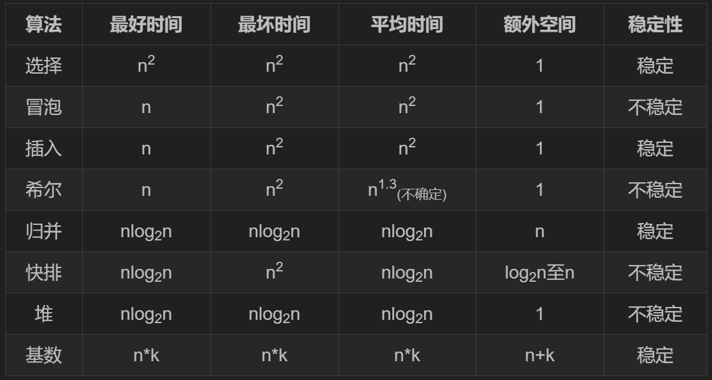
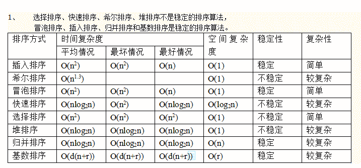
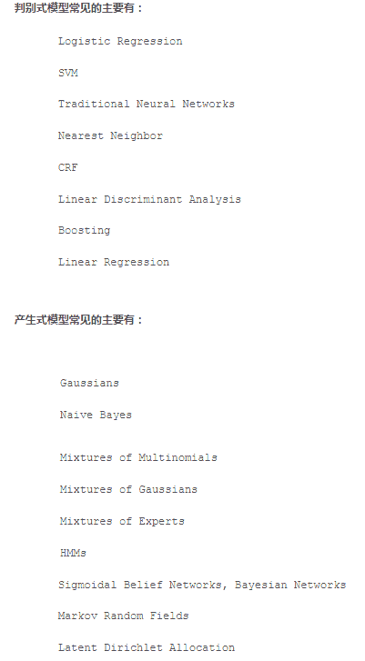
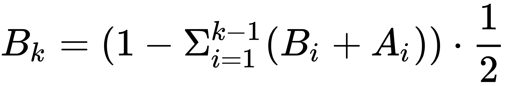
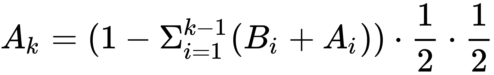
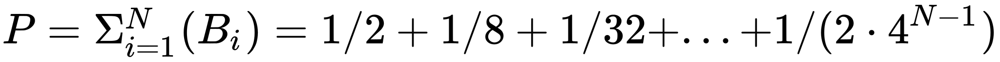
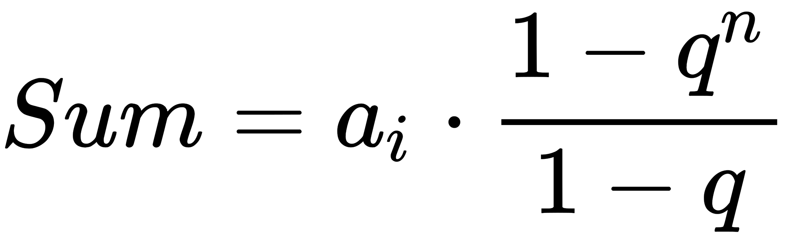
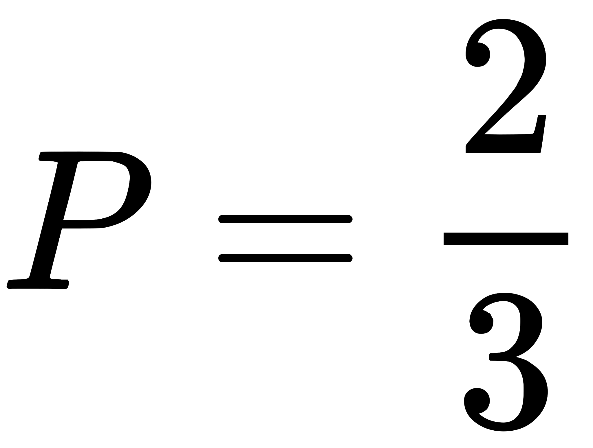

# iHandy2019 校招-机器学习/算法工程师笔试题

## 1

计算斐波那契数列第 n 项的函数定义如下：

```cpp
int fib(int n){ 
     if(n==0) 
        return 1; 
     else if(n==1) 
        return 2; 
     else 
        return fib(n-1)+fib(n-2);
}
```

若执行函数调用表达式 fib(9),函数 fib 被调用的次数是：

正确答案: B   你的答案: 空 (错误)

```cpp
107
```

```cpp
109
```

```cpp
139
```

```cpp
177
```

本题知识点

算法工程师 iHandy 2019 大数据开发工程师

讨论

[杨小白 23521](https://www.nowcoder.com/profile/459222251)

对于小数据量的 n 来说 f(1) 调用 1 次 f(2) 调用 3 次 f(3) 调用 5 次 f(4) 调用 9 次
发现一个规律：从 n=3 开开始，调用次数为前两次和加 1 即：f(3) =f(2) +f(1) +1=5      f(4) =f(3) +f(4) +1=9      f(5) =f(4) +f(3) +1=15      f(6) =f(5) +f(4) +1=25      f(7) =f(6) +f(5) +1=41       f(8) =f(7) +f(6) +1=67       f(9) =f(8) +f(7) +1=109

发表于 2019-06-27 12:20:54

* * *

[创始元灵](https://www.nowcoder.com/profile/220889961)

f(9)=f(8)+f(7)+1=109f(8)=f(7)+f(6)+=67f(7)=f(6)+f(5)+1=41f(6)=f(5)+f(4)+1=25f(5)=f(4)+f(3)+1=15f(4)=f(3)+f(2)+1=9f(3)=f(2)+f(1)+1=5f(2)调用 3 次 f(1)调用 1 次

发表于 2019-07-10 11:32:32

* * *

[李大胆🐈](https://www.nowcoder.com/profile/685341152)

对于小数据量的 n 来说 f(1) 调用 1 次 f(2) 调用 3 次 f(3) 调用 5 次 f(4) 调用 9 次
发现一个规律：从 n=3 开开始，调用次数为前两次和加 1 即：f(3) =f(2) +f(1) +1=5f(4) =f(3) +f(4) +1=9f(5) =f(4) +f(3) +1=15f(6) =f(5) +f(4) +1=25f(7) =f(6) +f(5) +1=41f(8) =f(7) +f(6) +1=67f(9) =f(8) +f(7) +1=109

编辑于 2019-07-30 08:40:33

* * *

## 2

下面程序的执行结果是（）

```cpp
#include <iostream>
using namespace std;

void fun1(int& x) {
    x++;
}

void fun2(int x) {
    x++;
}

int main() {
    int abc = 13;
    fun1(abc);
    printf("%d\n", abc);
    fun2(abc);
    printf("%d\n", abc);
}
```

正确答案: B   你的答案: 空 (错误)

```cpp
13，13
```

```cpp
14，14
```

```cpp
13，14
```

```cpp
14，15
```

本题知识点

算法工程师 iHandy 2019 大数据开发工程师 C++

讨论

[清水 201906141719980](https://www.nowcoder.com/profile/665089438)

fun1 传入的是 X 的地址，进行++操作会直接改变 x 的值，进行 fun1 操作后 x 变为 14，fun2 中的 x 是形参，不会改变实参 x 的值，因此输出 14，14

发表于 2019-07-09 08:57:43

* * *

[offer 都给我来](https://www.nowcoder.com/profile/421668521)

fun1 引用传递，fun2 值传递

发表于 2019-07-10 21:26:31

* * *

[冰冰 2020](https://www.nowcoder.com/profile/905652098)

fun1 传入的是 X 的地址，进行++操作会直接改变 x 的值，进行 fun1 操作后 x 变为 14，fun2 中的 x 是形参，不会改变实参 x 的值，因此输出 14，14

发表于 2019-07-18 13:22:18

* * *

## 3

三次握手方法用于

正确答案: A   你的答案: 空 (错误)

```cpp
传输层连接的建立
```

```cpp
数据链路层的流量控制
```

```cpp
传输层的重复检测
```

```cpp
传输层的流量控制
```

本题知识点

算法工程师 iHandy Java 工程师 C++工程师 安卓工程师 iOS 工程师 运维工程师 前端工程师 PHP 工程师 测试工程师 2019 大数据开发工程师

讨论

[石健聪](https://www.nowcoder.com/profile/515210417)

TCP 传输层的连接

发表于 2019-06-28 12:25:14

* * *

## 4

假设磁头当前位于第 99 道，正在向磁道序号增加的方向移动。现有一个磁道访问请求序列为 33，59，13，77，123，170，160，185，采用 SCAN 调度(电梯调度)算法得到的磁道访问序列是(    )

正确答案: B   你的答案: 空 (错误)

```cpp
123，77，59，33，13，160，170，185
```

```cpp
123，160，170，185，77，59，33，13
```

```cpp
123，160，170，185，13，33，59，77
```

```cpp
13，33，59，77，123，160，170，185
```

本题知识点

算法工程师 iHandy 2019 大数据开发工程师

讨论

[遇见不相见](https://www.nowcoder.com/profile/488035187)

考查磁盘的调度算法。
电梯调度的思想：从移动臂当前位置开始沿着臂的移动方向去选择离当前移动臂最近的那个柱面的访问者，如果沿臂的移动方向无请求访问时，就改变臂的移动方向再选择。但在本题中，磁头正在向磁道序号增加的方向移动。
首先，磁头选择与当前磁头所在磁道距离最近的请求作为首次服务的对象(123)，当磁头沿途相应访问请求序列直到达到一端末(123，160，170，185)，再反向移动响应另一端的访问请求(77，59，33，13)。

发表于 2019-07-12 11:08:55

* * *

[放男孩的小烟花](https://www.nowcoder.com/profile/245703316)

因为是增加，离 99 最近的大数是 123,然后一直找到最大，再返回找比 99 小的最大数，直到最后

发表于 2019-07-12 03:36:49

* * *

[冰冰 2020](https://www.nowcoder.com/profile/905652098)

考查磁盘的调度算法。
电梯调度的思想：从移动臂当前位置开始沿着臂的移动方向去选择离当前移动臂最近的那个柱面的访问者，如果沿臂的移动方向无请求访问时，就改变臂的移动方向再选择。但在本题中，磁头正在向磁道序号增加的方向移动。
首先，磁头选择与当前磁头所在磁道距离最近的请求作为首次服务的对象(123)，当磁头沿途相应访问请求序列直到达到一端末(123，160，170，185)，再反向移动响应另一端的访问请求(77，59，33，13)。

发表于 2019-07-18 13:25:53

* * *

## 5

已知二叉树的前序序列是 ABCDEFGH，中序序列是 CBEDFAGH，其后序序列是?

正确答案: B   你的答案: 空 (错误)

```cpp
CFEDBHGA
```

```cpp
CEFDBHGA
```

```cpp
CEFBDGHA
```

```cpp
DFECBHAG
```

本题知识点

算法工程师 iHandy 2019 大数据开发工程师

讨论

[FEELTHEAIR](https://www.nowcoder.com/profile/6109303)

        A
      /   \
    B     G
  /  \       \
C    D      H
      /  \
    E     F 分析方法：先确定根节点，分为左右树，同理再迭代

发表于 2019-07-10 11:34:30

* * *

[Dengyy](https://www.nowcoder.com/profile/512309936)

前序遍历：根左右；中序遍历：左根右。第 1 轮：A 为根，中序序列 CBEDF 为左子树，GH 为右子树，前序序列删除 A 操作。第 2 轮：右子树 GH，根 G、右 H；左子树 CBEDF 中 B 为根，即 C 为左子树，EDF 为右子树。第 3 轮：右子树 EDF 中，D 为根，E 为左子树，F 为右子树。第 4 轮：根据二叉树，输出后序序列为 CEFDBHGA

编辑于 2020-03-10 16:17:10

* * *

[冰冰 2020](https://www.nowcoder.com/profile/905652098)

 前、中、后序遍历是针对“根节点”而言的。前序遍历首先访问根结点，然后遍历左子树，最后遍历右子树。中序遍历首先遍历左子树，然后访问根结点，最后遍历右子树。后序遍历首先遍历左子树，然后遍历右子树，最后访问根节点。         A      /   \
    B     G
  /  \       \
C    D      H
      /  \
    E     F 分析方法：先确定根节点，分为左右树，同理再迭代

发表于 2019-07-18 13:27:58

* * *

## 6

下面哪个选项中哪一项属于确定性算法

正确答案: A   你的答案: 空 (错误)

```cpp
PCA
```

```cpp
k-means
```

```cpp
都不是
```

本题知识点

算法工程师 iHandy 2019

讨论

[DATAHONOR](https://www.nowcoder.com/profile/243209478)

首先参考维基百科给出的确定性算法的定义：In [computer science](https://en.wikipedia.org/wiki/Computer_science), a **deterministic algorithm** is an [algorithm](https://en.wikipedia.org/wiki/Algorithm) which, given a particular input, will always produce the same output, with the underlying machine always passing through the same sequence of states。简单来说，确定性算法就是对于一样的输入，我们总是可以得到一样的输出。
K-means: 不确定算法。按照定义，从结果上看，就是同样的数据集多次运行 K-means 算***得到不同的结果（聚类），所以其不是确定算法。从其算法原理看，其不确定性在于我们必须随机选择初始的聚类中心，之后再进行迭代，所以会产生不同的结果。PCA：确定算法。原因在与，PCA 的本质在于求解一个方差最大化问题，给定数据集，最优问题的解是确定且唯一的。

发表于 2019-07-17 15:36:05

* * *

[earnestbin](https://www.nowcoder.com/profile/7680222)

确定性算法是指没有随机数生成的算法

发表于 2019-07-11 23:31:38

* * *

[LongXiaJun](https://www.nowcoder.com/profile/252937)

PCA：组成分分析，是常见的降维方法，是确定性算法，第一次运行结果和第 n 次结果一致，不会受运行次数的影响。K-means: 聚类算法，每次运行会随机初始化 k 个聚类中性点，因此算法结果具有随机性，不是确定性算法

发表于 2019-07-02 18:03:34

* * *

## 7

关于 ensemble learning，下面说法正确的是

正确答案: A   你的答案: 空 (错误)

```cpp
单个模型之间有低相关性
```

```cpp
在集成学习中使用“平均权重”会好于使用“投票”
```

```cpp
单个模型都是使用同一算法
```

本题知识点

算法工程师 iHandy 2019

讨论

[大佬求带。。](https://www.nowcoder.com/profile/248966335)

感觉不对啊，A 选项，GBDT 和 xgboost 树之间有相关性啊。。。

发表于 2019-06-30 17:02:32

* * *

[FEELTHEAIR](https://www.nowcoder.com/profile/6109303)

周志华的西瓜树上面有解释，单个模型的独立性越强，预测精度越高，有证明！

发表于 2019-07-10 11:36:04

* * *

[DATAHONOR](https://www.nowcoder.com/profile/243209478)

就问题而言，B，C 显然是不对的，A 是有一定的合理性的。
首先，Ensamble Learning 主要就是包括 Boosting 与 Bagging, 此外还包括 Bagging 的加强版 random forest(西瓜书称其为“Bagging 的一个拓展变体”)， 还有专注于基学习器结合策略的 stacking 等。（根据西瓜书）集成学习优越性，是由基学习器本身的准确性和差异性(diversity)决定的。理想的的基学习器具有较高的准确性（保证模型想对的方向集成）和较大的差异性（保证模型充分考虑各种情况）。理想情况下，就是基学习器完全独立的情况，我们可以证明随着集成中个体学习器数目的上升，集成的错误率将以指数级下降，最终趋向于 0。但是即使是 Bagging 也不可能得到完全独立的个体， 但是我们希望他们之间的相关性越小越好（在足够小的时候，可以认为近似独立的感觉:-). 这也是 A 的合理性所在。至于 Boosting,了解并不多，感觉是因为 Boosting 本身就是一种连续的迭代的方式来生成一系列个体学习器，所以其相关性几乎是嵌入算法内的？不能通过其他方法调整这种相关性的。

发表于 2019-07-17 15:54:40

* * *

## 8

决策树的父节点和子节点的熵的大小关系是什么

正确答案: C   你的答案: 空 (错误)

```cpp
两者相等
```

```cpp
子节点的熵更大
```

```cpp
父节点的熵更大
```

```cpp
不确定
```

本题知识点

算法工程师 iHandy 2019

讨论

[earnestbin](https://www.nowcoder.com/profile/7680222)

熵是描述混乱程度的，父结点熵肯定大于子结点的熵

编辑于 2021-02-24 11:11:06

* * *

[奔腾的小马达](https://www.nowcoder.com/profile/224349141)

决策树分解策略是保证子结点的熵小于父结点的熵。但“子结点的熵”是该父结点所有孩子结点的熵的总和，因此，并保证任意一个子节点的熵都小于父结点熵。

发表于 2019-06-28 17:36:07

* * *

[创始元灵](https://www.nowcoder.com/profile/220889961)

在特征选择时，应该给父节点信息增益最大的节点，而信息增益的计算为 IG(Y|X) = H(Y) - H(Y/X)，H(Y/X) 为该特征节点的条件熵， H(Y/X) 越小，即该特征节点的属性对整体的信息表示越“单纯”，IG 更大。 则该属性可以更好的分类。H(Y/X) 越大，属性越“紊乱”，IG 越小，不适合作为分类属性。

发表于 2019-07-10 14:25:51

* * *

## 9

测得某个采用按需调页策略的计算机系统部分状态数据为：CPU 利用率 5%，用于交换空间的磁盘利用率 95%，其他 I/O 设备利用率 5%。试问，这种情况下（    ）能提高 CPU 的利用率。

正确答案: A C   你的答案: 空 (错误)

```cpp
增大内存的容量
```

```cpp
增大磁盘交换区的容量
```

```cpp
减少多道程序的度数
```

```cpp
使用更快速的磁盘交换区
```

本题知识点

算法工程师 iHandy 2019 大数据开发工程师

讨论

[一闪一闪的大橘子🍊](https://www.nowcoder.com/profile/8442705)

个人理解：由题目可以得出，大部分的运行时间都耗费在交换操作上，也就是说物理内存太小导致数据经常需要换入换出，因此需要提高内存大小，此外 CPU 和 IO 的的占用率都很低表示 CPU 一次读取的太多的程序放入内存中，因此需要降低多道程序的度数（个数）。

发表于 2019-07-08 16:41:14

* * *

[创始元灵](https://www.nowcoder.com/profile/220889961)

CPU 利用率 5%，用于交换空间的磁盘利用率 95%，其他 I/O 设备利用率 5%。**CPU 利用率****：****运行的程序占用的 CPU 资源，表示机器在某个时间点的运行程序的情况。**[**使用率**](https://baike.so.com/doc/5382543-5618902.html)**越高，说明机器****在这个时间上运行了很多程序****，反之较少。****CPU 是负责运算和处理的，内存是交换数据的。**
**1.**可以看出 CPU 利用率低；**3**.I/O 设备利用率低（**减少多道程序的度数**）CPU 一次读取的太多的程序放入内存中，因此需要降低多道程序的度数 2.交换空间的磁盘利用率高（增大内存的容量）交换空间利用率高，因此需要扩大数据交换空间（增大内存的容量）

发表于 2019-07-10 16:09:43

* * *

## 10

对以下各搜索树进行删除操作，哪些树在最坏情况下时间复杂度不超过 O(log(n))?其中 n 为关键码的数量。 

正确答案: A C   你的答案: 空 (错误)

```cpp
AVL 树
```

```cpp
伸展树
```

```cpp
红黑树
```

```cpp
二叉查找树
```

本题知识点

算法工程师 iHandy 2019 大数据开发工程师

讨论

[创始元灵](https://www.nowcoder.com/profile/220889961)

**A.** AVL 树是最先发明的自平衡二叉查找树。在 AVL 树中任何节点的两个子树的高度最大差别为一，所以它也被称为高度平衡树。查找、插入和删除在**平均和最坏情况下都是 O(log n)**。**B**.伸展树(Splay Tree)，也叫分裂树，是一种二叉排序树，它能在 O(log n)内完成插入、查找和删除操作。伸展树支持所有的二叉树操作。**伸展树不保证最坏情况下的时间复杂度为 O(logN)。伸展树的时间复杂度边界是均摊的**。**C**.红黑树(Red Black Tree) 是一种自平衡二叉查找树，它虽然是复杂的，**但它的最坏情况运行时间也是非常良好的，并且在实践中是高效的: 它可以在 O(log n)时间内做查找，插入和删除**，这里的 是树中元素的数目。**D**.在二叉查找树中查询元素的最优时间复杂度是 O(logN)即在满二叉树的情况下,**最坏时间复杂度是 O(n)**即除叶子节点外每个节点只有一个子节点,

发表于 2019-07-10 16:25:51

* * *

[零葬](https://www.nowcoder.com/profile/75718849)

只要保证树是平衡的就可以满足最坏时间复杂度不超过 O(logn)，即 AVL 树和红黑树。B 和 D 都属于二叉排序树，因此有可能得到 O(n)的时间复杂度。

发表于 2021-01-04 12:01:57

* * *

## 11

下列排序算法中，最坏时间复杂度是 O(n log(n)) 的是？

正确答案: C D   你的答案: 空 (错误)

```cpp
快速排序
```

```cpp
插入排序
```

```cpp
归并排序
```

```cpp
堆排序
```

本题知识点

算法工程师 iHandy Java 工程师 C++工程师 安卓工程师 iOS 工程师 运维工程师 前端工程师 PHP 工程师 测试工程师 2019 大数据开发工程师

讨论

[牛客 1220952 号](https://www.nowcoder.com/profile/1220952)



发表于 2019-07-09 17:29:28

* * *

[创始元灵](https://www.nowcoder.com/profile/220889961)



发表于 2019-07-10 16:31:37

* * *

[Bean 冷的心](https://www.nowcoder.com/profile/411517301)

**《忆排序 面试我最强》 作者：马士兵 选炮插， 快归堆希统计姬， n 方 n 老 n 一三， 对 n 加 k n 乘 k, 不稳稳稳不稳稳， 不稳不稳稳稳稳。**

发表于 2019-07-17 09:38:40

* * *

## 12

面哪些选项对 K 折交叉验证的描述是正确的

正确答案: A B C   你的答案: 空 (错误)

```cpp
增大 K 将导致交叉验证结果时需要更多的时间
```

```cpp
更大的 K 值相比于小 K 值将对交叉验证结构有更高的信心
```

```cpp
如果 K=N，那么其称为留一交叉验证，其中 N 为验证集中的样本数量
```

本题知识点

算法工程师 iHandy 2019

讨论

[泰山弟子](https://www.nowcoder.com/profile/5398374)

C 扯蛋，难道 N 不包括训练集中的样本数量？

发表于 2019-07-17 20:50:34

* * *

[FEELTHEAIR](https://www.nowcoder.com/profile/6109303)

留一法就是每次只留下一个样本做测试集，其它样本做训练集，如果有 n 个样本，则需要训练 n 次，测试 n 次。

发表于 2019-07-10 13:15:57

* * *

[盏茶作酒](https://www.nowcoder.com/profile/6817686)

c 不是很对吧，留一法， n＝k,n 为全部样本的数量，

发表于 2019-07-07 17:39:01

* * *

## 13

以下哪些模型方法属于生成式模型

正确答案: A D   你的答案: 空 (错误)

```cpp
Hidden Markov Model
```

```cpp
SVM
```

```cpp
Logistic Regression
```

```cpp
Latent Dirichlet Allocation
```

本题知识点

算法工程师 iHandy 2019

讨论

[FEELTHEAIR](https://www.nowcoder.com/profile/6109303)

生成式模型

*   判别式分析
*   朴素贝叶斯
*   K 近邻(KNN)
*   混合高斯模型
*   隐马尔科夫模型(HMM)
*   贝叶斯网络
*   Sigmoid Belief Networks
*   马尔科夫随机场(Markov Random Fields)
*   深度信念网络(DBN)
*   LDA

判别式模型

*   线性回归(Linear Regression)
*   逻辑斯蒂回归(Logistic Regression)
*   神经网络(NN)
*   支持向量机(SVM)
*   高斯过程(Gaussian Process)
*   条件随机场(CRF)
*   CART(Classification and Regression Tree)

发表于 2019-07-10 15:03:11

* * *

[创始元灵](https://www.nowcoder.com/profile/220889961)



发表于 2019-07-10 16:39:31

* * *

## 14

在神经网络训练过程中，为什么会出现梯度消失的问题？如何防止？

你的答案

本题知识点

算法工程师 iHandy 2019

讨论

[lixxxxxx](https://www.nowcoder.com/profile/937184612)

 神经网络在训练的时候随着网络层数的加深,激活函数的输入值的整体分布逐渐往激活函数的取值区间上下限靠近,从而导致在反向传播时低层的神经网络的梯度消失。  防止：

1）使用 relu、LRelu、ELU、maxout 等激活函数。  sigmoid 函数的梯度会随着 x 的增大或减小和消失，而 relu 不会。  2）使用批规范化 

通过规范化操作将输出信号 x 规范化到均值为 0，方差为 1，保证网络的稳定性。从上述分析可以看到，反向传播中有 w 的存在，所以 w 的大小影响了梯度的消失和爆炸，BN 就是通过对每一层的输出规范为均值和方差一致的方法，消除了 w 带来的放大和缩小的影响，进而解决梯度消失和爆炸的问题 

发表于 2019-06-26 09:56:44

* * *

[可怜可怜吧，给个 offer 吧](https://www.nowcoder.com/profile/538556489)

关于梯度消失，以 sigmoid 函数为例子，sigmoid 函数使得输出在[0,1]之间。

事实上 x 到了一定大小，经过 sigmoid 函数的输出范围就很小了

如果输入很大，其对应的斜率就很小，我们知道，其斜率（梯度）在反向传播中是权值学习速率。所以就会出现如下的问题，

**在深度网络中，如果网络的激活输出很大，其梯度就很小，学习速率就很慢。假设每层学习梯度都小于最大值 0.25，网络有 n 层，因为链式求导的原因，第一层的梯度小于 0.25 的 n 次方，所以学习速率就慢，对于最后一层只需对自身求导 1 次，梯度就大，学习速率就快。**

这会造成两个影响：

1.  在一个很大的深度网络中，浅层基本不学习，权值变化小，后面几层一直在学习，结果就是，后面几层基本可以表示整个网络，失去了深度的意义。
2.  造成网络无法收敛。

**如何解决梯度消失问题？**

*   **relu, dropout 等小技巧**，第二波深度学习算法已经基本抛弃了预训练的做法。引入 RELU 代替 sigmoid 激活函数。
*   **ResNet** 深度残差学习（deepresidual learning）进一步避免了梯度消失（其实是把高阶特征和低阶做融合）。
*   **归一初始化** 各层输入归一化，使得可以收敛的网络的深度提升为原来的十倍。

编辑于 2019-07-26 09:13:13

* * *

[创始元灵](https://www.nowcoder.com/profile/220889961)

在神经网络中出现梯度消失的原因主要是：激活函数的选择导致、权重初始化值的选择问题防止梯度消失：
预训练加微调
梯度剪切
权重正则化
使用 relu、LRelu、ELU、maxout 等激活函数
使用 BatchNormlization
使用残差网络
使用 LSTM 网络

发表于 2019-07-10 16:50:56

* * *

## 15

假设有一支手枪，每次扣动扳机，会有 50%的概率发射子弹，50%的概率不会发射子弹。现在甲和乙轮流使用这支手枪朝对方射击，直到其中一方中弹。如果甲先开枪，最终乙先中弹的概率是多大？请给出计算过程和结果。

你的答案

本题知识点

算法工程师 iHandy 2019

讨论

[lixxxxxx](https://www.nowcoder.com/profile/937184612)

p = 1/2+(1/2)³+(1/2)⁵+...=2/3

发表于 2019-06-26 09:57:03

* * *

[zhyiddd](https://www.nowcoder.com/profile/571702376)

考虑第一轮 乙先中弹概率 1/2 甲先 1/4 都不中弹 1/4。如果都不中弹，就要进入第二轮，实际上与第一轮等效。假设全过程乙先中弹概率为 p，那么 p=1/2+1/4*p。 所以 p=2/3

发表于 2019-08-10 01:39:25

* * *

[石头君](https://www.nowcoder.com/profile/543678372)

| 发枪 | 甲 | 乙 | 甲  | 乙 | 甲  | 乙 | 甲  | 乙 |
| 甲中弹概率*A*[*i*] | / | 1/4 | / | 1/16 | / | 1/64 | / | 1/256 |
| 乙中弹概率*B*[*i*] | 1/2 | / | 1/8 | / | 1/32 | / | 1/128 | / |

    在每一次的射击中，A 射击 B，因为子弹发射与不发射的概率均为 1/2，所以 B 的中弹概率与生存概率也相等。    乙在第*k*次(*k*>1)甲射击的过程中的中弹概率与生存概率都为
   
其中，*B*[*i*]为甲第 i 次射击时，乙中弹的概率。*A*[*i*]为乙第 i 次射击时，甲中弹的概率。甲在第*k*次(*k*>1)乙射击的过程中，则是乙在甲第*k*次射击时已生存的条件下才会发生的，所以其中弹概率与生存概率都为
        因此，乙中弹的概率为，*N*趋近于无穷大  由等比数列的求和公式    所以乙首先中弹的概率为  

发表于 2019-06-30 17:27:52

* * *

## 16

给定一列非负整数，求这些数连接起来能组成的最大的数。

本题知识点

算法工程师 iHandy Java 工程师 C++工程师 安卓工程师 iOS 工程师 运维工程师 前端工程师 PHP 工程师 测试工程师 排序 *贪心 数学 2019* *讨论

[拿 offer 拿到手软 666](https://www.nowcoder.com/profile/6764086)

```cpp
# include <iostream>
# include <string>
# include <vector>
# include <algorithm>
using namespace std;
bool compare(string &a, string &b){
    return (a+b) > (b+a);
}
int main(){
    int n;
    cin >> n;
    vector<string> str(n,"");
    for (int i =0;i<n;i++){
        cin >> str[i];
    }
    sort(str.begin(), str.end(), compare);
    string res;
    for (auto c : str){
        res += c;
    }
    cout << res <<endl;
    return 0;
}
```

发表于 2019-06-25 18:37:36

* * *

[cincin 是菜鸡](https://www.nowcoder.com/profile/936525172)

leetcode179 题

发表于 2019-06-30 16:12:00

* * *

[紫气](https://www.nowcoder.com/profile/5398851)

```cpp
import java.util.ArrayList;
import java.util.List;
import java.util.Scanner;

public class Main {
    public static void main(String[] args) {
        Scanner sc = new Scanner(System.in);
        int length = sc.nextInt();
        String result = "";
        List<String> list = new ArrayList<>();
        for(int i = 0; i < length; i++){
            list.add(sc.next());
        }
        sc.close();
        list.sort((String s1, String s2) -> s1.startsWith(s2) ? 1 : s2.startsWith(s1) ? -1 : -s1.compareTo(s2));
        if(list.size() > 0 && !"0".equals(list.get(0)))
            for(String s : list) result +=  s;

        System.out.print(result.equals("") ? "0" : result);
    }

}

```

编辑于 2019-07-16 16:34:42

* * **