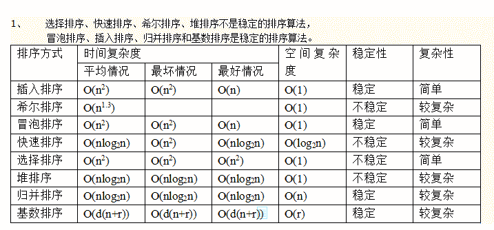

# iHandy2019 校招-大数据开发工程师笔试题

## 1

HDFS 中负责数据存储的是

正确答案: B   你的答案: 空 (错误)

```cpp
NameNode
```

```cpp
DataNode
```

```cpp
SecondaryNameNode
```

```cpp
JobTracker
```

本题知识点

算法工程师 iHandy 大数据开发工程师 2019

讨论

[一只菜鸟变菜鸡](https://www.nowcoder.com/profile/718863006)

在 Hadoop1.0 时代，namenode 是哈 hdfs 的主，负责管理从节点 DataNode，通过心跳来确认从节点是否存活，namenode 不存数据，只保存元数据，数据存储在 DataNode 中，同时从节点会默认对数据进行 3 分备份，数据会存在一个个的 block 上，1.0block 默认大小为 64M，2.0  128M。并保存在不同的节点上（机架感知策略），secondarynamenode（ssn）听起来很像是主节点 namanode 的备份，其实不是，ssn 是数据的热备份，是元数据持久化的过程，其实就是为了数据的备份和恢复，但是 ssn 有一个缺陷，就是他保存元数据并不能完全同步，因此出现故障还是可能丢失一部分数据（1.0）。在 Hadoop2.0，hdfs2.0 时代，引用了 HA(高可用），和 zookeeper 开进一步保障了数据的安全，namenade 也变成了两个 active namenode 和 standby namenode，通过 JN 来同步数据，保证了 active namenode 挂点 zookeeper 可以迅速让 standby namenode 上位并保证数据的不丢失。同时，Hadoop1.0jobtracker 是主节点，就近原则，因此和 namenode 在一台机器上，负责任务调度和资源分配，1.0 的通病，单点故障，因此 2.0 引入了 yarn，将 jobtracker 的权能进行了拆解

编辑于 2019-07-28 15:56:26

* * *

[创始元灵](https://www.nowcoder.com/profile/220889961)

1.Namenode    是整个文件系统的管理节点。它维护着 1.整个文件系统的文件目录树，2.文件/目录的元信息和每个文件对应的数据块列表。3.接收用户的操作请求。
2.Datanode
负责存储数据的，提供真实文件数据的存储服务。
文件块（block）：最基本的存储单位。对于文件内容而言，一个文件的长度大小是 size，那么从文件的０偏移开始，按照固定的大小，顺序对文件进行划分并编号，划分好的每一个块称一个 Block。
HDFS 默认 Block 大小是 128MB，以一个 256MB 文件，共有 256/128=2 个 Block. 不同于普通文件系统的是，HDFS 中，如果一个文件小于一个数据块的大小，并不占用整个数据块存储空间。

发表于 2019-07-17 09:41:28

* * *

[超爱吃香菇的小姑娘](https://www.nowcoder.com/profile/653788698)

HDFS 集群有一个 NameNode 和一些 DataNode。NameNode 管理文件系统的元数据，DataNode 存储实际的数据。

发表于 2019-07-14 20:59:10

* * *

## 2

下面关于 Hive 的说法正确的是？

正确答案: A   你的答案: 空 (错误)

```cpp
Hive 是基于 Hadoop 的一个数据仓库工具，可以将结构化的数据文本映射为一张数据库表，并提供简单的 SQL 查询功能
```

```cpp
Hive 可以直接使用 SQL 语句进行相关操作
```

```cpp
Hive 能够在大规模数据集上实现低延迟快速的查询
```

```cpp
Hive 在加载数据过程中不会对数据进行任何的修改，只是将数据移动到 HDFS 中 Hive 设定的目录下
```

本题知识点

算法工程师 iHandy 大数据开发工程师 2019

讨论

[林木木 201808111447470](https://www.nowcoder.com/profile/182938699)

外部表不会加载数据到指定目录

发表于 2019-08-22 21:23:45

* * *

[ycy 加油啊](https://www.nowcoder.com/profile/86425035)

D 应该也是对的/

发表于 2019-07-25 23:09:36

* * *

[一只菜鸟变菜鸡](https://www.nowcoder.com/profile/718863006)

感觉 D 也是对的啊，默认保存在 hdfs 的/user/warehouse/hive 中，通过 Hadoop fs -ls /user/warehouse/hive 就可以查看到啊，hive 的本质就是 MapReduce，因此它的速度不可能很快，hive 是可以使用 hql 语句，但是和传统 sql 有一定的区别

发表于 2019-07-28 15:59:26

* * *

## 3

关于 Yarn，下列哪个叙述是错误的？

正确答案: B   你的答案: 空 (错误)

```cpp
用户向 Yarn 提交程序
```

```cpp
ResourceManager 管理每个节点上的资源
```

```cpp
Application Master 向 Resource Manager 注册和申请资源
```

```cpp
ResourceManager 为应用程序分配 Container
```

本题知识点

算法工程师 iHandy 大数据开发工程师 2019

讨论

[一只菜鸟变菜鸡](https://www.nowcoder.com/profile/718863006)

用户通过 client 向 yarn 提交程序，也就是把程序提交到 resourcemanager（RM）上，RM 将任务分配个 NodeManager(NM)，NM 中的 container 启动一个 applicationMaster（AM），AM 向 RM 提交申请，提交需要的资源，内存，CPU 等，RM 分配资源重新将任务分配个 NM，NM 启动一个 container，container 中的 AM 开始执行任务。也就是说 RM 管理的是 NM，通过心跳确认是否存活。

发表于 2019-07-28 16:03:39

* * *

[sugarhit](https://www.nowcoder.com/profile/598224351)

😁Yarn 中 Manager 整理😁：ResourceManager：对全局资源（resource）进行管理，包括节点和整体（包括任务等）NodeManager：负责单台节点上的资源。（包括但不限于 CPU、内存等）Application Manager、Application master 负责对应用进行管理。*AM 的产生：用户向 ResourceManager 发送应用提交程序，RM 为其分配 Node（带 NM）并运行 AM 程序；AM 根据 Application 具体需求向 RM 再申请更多资源执行程序。RM 向 Application 分配资源时综合考虑平台整体性能，负载等因素。

发表于 2019-08-23 20:42:39

* * *

[offer 快点来找我](https://www.nowcoder.com/profile/5756321)

管理的不是节点，而是 nodeManager

发表于 2019-07-05 15:36:55

* * *

## 4

计算斐波那契数列第 n 项的函数定义如下：

```cpp
int fib(int n){ 
     if(n==0) 
        return 1; 
     else if(n==1) 
        return 2; 
     else 
        return fib(n-1)+fib(n-2);
}
```

若执行函数调用表达式 fib(9),函数 fib 被调用的次数是：

正确答案: B   你的答案: 空 (错误)

```cpp
107
```

```cpp
109
```

```cpp
139
```

```cpp
177
```

本题知识点

算法工程师 iHandy 2019 大数据开发工程师

讨论

[杨小白 23521](https://www.nowcoder.com/profile/459222251)

对于小数据量的 n 来说 f(1) 调用 1 次 f(2) 调用 3 次 f(3) 调用 5 次 f(4) 调用 9 次
发现一个规律：从 n=3 开开始，调用次数为前两次和加 1 即：f(3) =f(2) +f(1) +1=5      f(4) =f(3) +f(4) +1=9      f(5) =f(4) +f(3) +1=15      f(6) =f(5) +f(4) +1=25      f(7) =f(6) +f(5) +1=41       f(8) =f(7) +f(6) +1=67       f(9) =f(8) +f(7) +1=109

发表于 2019-06-27 12:20:54

* * *

[创始元灵](https://www.nowcoder.com/profile/220889961)

f(9)=f(8)+f(7)+1=109f(8)=f(7)+f(6)+=67f(7)=f(6)+f(5)+1=41f(6)=f(5)+f(4)+1=25f(5)=f(4)+f(3)+1=15f(4)=f(3)+f(2)+1=9f(3)=f(2)+f(1)+1=5f(2)调用 3 次 f(1)调用 1 次

发表于 2019-07-10 11:32:32

* * *

[李大胆🐈](https://www.nowcoder.com/profile/685341152)

对于小数据量的 n 来说 f(1) 调用 1 次 f(2) 调用 3 次 f(3) 调用 5 次 f(4) 调用 9 次
发现一个规律：从 n=3 开开始，调用次数为前两次和加 1 即：f(3) =f(2) +f(1) +1=5f(4) =f(3) +f(4) +1=9f(5) =f(4) +f(3) +1=15f(6) =f(5) +f(4) +1=25f(7) =f(6) +f(5) +1=41f(8) =f(7) +f(6) +1=67f(9) =f(8) +f(7) +1=109

编辑于 2019-07-30 08:40:33

* * *

## 5

下面程序的执行结果是（）

```cpp
#include <iostream>
using namespace std;

void fun1(int& x) {
    x++;
}

void fun2(int x) {
    x++;
}

int main() {
    int abc = 13;
    fun1(abc);
    printf("%d\n", abc);
    fun2(abc);
    printf("%d\n", abc);
}
```

正确答案: B   你的答案: 空 (错误)

```cpp
13，13
```

```cpp
14，14
```

```cpp
13，14
```

```cpp
14，15
```

本题知识点

算法工程师 iHandy 2019 大数据开发工程师 C++

讨论

[清水 201906141719980](https://www.nowcoder.com/profile/665089438)

fun1 传入的是 X 的地址，进行++操作会直接改变 x 的值，进行 fun1 操作后 x 变为 14，fun2 中的 x 是形参，不会改变实参 x 的值，因此输出 14，14

发表于 2019-07-09 08:57:43

* * *

[offer 都给我来](https://www.nowcoder.com/profile/421668521)

fun1 引用传递，fun2 值传递

发表于 2019-07-10 21:26:31

* * *

[冰冰 2020](https://www.nowcoder.com/profile/905652098)

fun1 传入的是 X 的地址，进行++操作会直接改变 x 的值，进行 fun1 操作后 x 变为 14，fun2 中的 x 是形参，不会改变实参 x 的值，因此输出 14，14

发表于 2019-07-18 13:22:18

* * *

## 6

表的组成内容包括

正确答案: B   你的答案: 空 (错误)

```cpp
查询和字段
```

```cpp
字段和记录
```

```cpp
记录和窗体
```

```cpp
报表和字段
```

本题知识点

Java 工程师 C++工程师 安卓工程师 iOS 工程师 运维工程师 前端工程师 算法工程师 PHP 工程师 测试工程师 iHandy 2019 大数据开发工程师

讨论

[F8023Y](https://www.nowcoder.com/profile/616806788)

Access 数据库中，表是数据实际存储的对象，实现了逻辑层次上的关系。它由行和列组成，每一行称为一个记录，每一列称为一个字段，所以也可以说表是由字段和记录组成的。

发表于 2019-07-18 14:22:36

* * *

[ahuuua](https://www.nowcoder.com/profile/3527191)

在关系数据库中关系是一个二维表，每一行称为一个元组，每一列称为一个属性 。在 access 关系数据库中，用表来实现关系，表的每一行称作一条记录，对应关系模型中的元组，每一列称作一个字段，对应关系模型中的属性

发表于 2019-07-15 20:27:43

* * *

[丁香姑娘](https://www.nowcoder.com/profile/734451659)

记录和窗体，这个得死记

发表于 2019-06-28 18:22:16

* * *

## 7

三次握手方法用于

正确答案: A   你的答案: 空 (错误)

```cpp
传输层连接的建立
```

```cpp
数据链路层的流量控制
```

```cpp
传输层的重复检测
```

```cpp
传输层的流量控制
```

本题知识点

算法工程师 iHandy Java 工程师 C++工程师 安卓工程师 iOS 工程师 运维工程师 前端工程师 PHP 工程师 测试工程师 2019 大数据开发工程师

讨论

[石健聪](https://www.nowcoder.com/profile/515210417)

TCP 传输层的连接

发表于 2019-06-28 12:25:14

* * *

## 8

在文件的索引节点中存放直接索引指针 10 个，一级和二级索引指针各 1 个。磁盘块大小为 1KB，每个索引指针占 4 个字节。若某文件的索引节点已在内存中，则把该文件偏移量（按字节编址）为 12345 和 987654 处所在的磁盘块读入内存，需访问的磁盘块个数分别是（    ）

正确答案: C   你的答案: 空 (错误)

```cpp
1, 2
```

```cpp
1, 3
```

```cpp
2, 3
```

```cpp
2, 4
```

本题知识点

算法工程师 iHandy 大数据开发工程师 2019

讨论

[小小长颈鹿](https://www.nowcoder.com/profile/563242884)

10 个直接索引指针指向的磁盘数据块大小为 10*1kb=10kb 一个索引指针 4b 每个磁盘块可以放索引指针共 1kb/4b=256 个一级索引指向的磁盘数据块为 256*1kb=256kb 二级索引指向的磁盘数据块为 256*256*1kb=2¹⁶kb=64Mb10kb(10240)<12345 B<256kb 所以在一级索引 需一次访存得到存储地址，再次访存取出数据，共 2 次访存 256kb(262144)<987654 B<256*256kb 所以在二级索引，需两次访存找到存储地址，再次访存取出数据，共 3 次访存 

发表于 2019-07-30 20:19:34

* * *

[asleepyfish](https://www.nowcoder.com/profile/614344180)

应该是 1 次和三次，访问 1234 因为是直接索引，直接根据内存中索引节点访问磁盘一次即可而 307400 在二级索引里，先访问磁盘两次找到存放盘块，再去找出那个盘块 一共是 2+1=3 次

发表于 2020-07-31 01:05:07

* * *

## 9

假设磁头当前位于第 99 道，正在向磁道序号增加的方向移动。现有一个磁道访问请求序列为 33，59，13，77，123，170，160，185，采用 SCAN 调度(电梯调度)算法得到的磁道访问序列是(    )

正确答案: B   你的答案: 空 (错误)

```cpp
123，77，59，33，13，160，170，185
```

```cpp
123，160，170，185，77，59，33，13
```

```cpp
123，160，170，185，13，33，59，77
```

```cpp
13，33，59，77，123，160，170，185
```

本题知识点

算法工程师 iHandy 2019 大数据开发工程师

讨论

[遇见不相见](https://www.nowcoder.com/profile/488035187)

考查磁盘的调度算法。
电梯调度的思想：从移动臂当前位置开始沿着臂的移动方向去选择离当前移动臂最近的那个柱面的访问者，如果沿臂的移动方向无请求访问时，就改变臂的移动方向再选择。但在本题中，磁头正在向磁道序号增加的方向移动。
首先，磁头选择与当前磁头所在磁道距离最近的请求作为首次服务的对象(123)，当磁头沿途相应访问请求序列直到达到一端末(123，160，170，185)，再反向移动响应另一端的访问请求(77，59，33，13)。

发表于 2019-07-12 11:08:55

* * *

[放男孩的小烟花](https://www.nowcoder.com/profile/245703316)

因为是增加，离 99 最近的大数是 123,然后一直找到最大，再返回找比 99 小的最大数，直到最后

发表于 2019-07-12 03:36:49

* * *

[冰冰 2020](https://www.nowcoder.com/profile/905652098)

考查磁盘的调度算法。
电梯调度的思想：从移动臂当前位置开始沿着臂的移动方向去选择离当前移动臂最近的那个柱面的访问者，如果沿臂的移动方向无请求访问时，就改变臂的移动方向再选择。但在本题中，磁头正在向磁道序号增加的方向移动。
首先，磁头选择与当前磁头所在磁道距离最近的请求作为首次服务的对象(123)，当磁头沿途相应访问请求序列直到达到一端末(123，160，170，185)，再反向移动响应另一端的访问请求(77，59，33，13)。

发表于 2019-07-18 13:25:53

* * *

## 10

已知二叉树的前序序列是 ABCDEFGH，中序序列是 CBEDFAGH，其后序序列是?

正确答案: B   你的答案: 空 (错误)

```cpp
CFEDBHGA
```

```cpp
CEFDBHGA
```

```cpp
CEFBDGHA
```

```cpp
DFECBHAG
```

本题知识点

算法工程师 iHandy 2019 大数据开发工程师

讨论

[FEELTHEAIR](https://www.nowcoder.com/profile/6109303)

        A
      /   \
    B     G
  /  \       \
C    D      H
      /  \
    E     F 分析方法：先确定根节点，分为左右树，同理再迭代

发表于 2019-07-10 11:34:30

* * *

[Dengyy](https://www.nowcoder.com/profile/512309936)

前序遍历：根左右；中序遍历：左根右。第 1 轮：A 为根，中序序列 CBEDF 为左子树，GH 为右子树，前序序列删除 A 操作。第 2 轮：右子树 GH，根 G、右 H；左子树 CBEDF 中 B 为根，即 C 为左子树，EDF 为右子树。第 3 轮：右子树 EDF 中，D 为根，E 为左子树，F 为右子树。第 4 轮：根据二叉树，输出后序序列为 CEFDBHGA

编辑于 2020-03-10 16:17:10

* * *

[冰冰 2020](https://www.nowcoder.com/profile/905652098)

 前、中、后序遍历是针对“根节点”而言的。前序遍历首先访问根结点，然后遍历左子树，最后遍历右子树。中序遍历首先遍历左子树，然后访问根结点，最后遍历右子树。后序遍历首先遍历左子树，然后遍历右子树，最后访问根节点。         A      /   \
    B     G
  /  \       \
C    D      H
      /  \
    E     F 分析方法：先确定根节点，分为左右树，同理再迭代

发表于 2019-07-18 13:27:58

* * *

## 11

Spark 中的 Stage 的 Task 的数量由什么决定 

正确答案: A   你的答案: 空 (错误)

```cpp
Partition
```

```cpp
Job
```

```cpp
Stage
```

```cpp
TaskScheduler
```

本题知识点

算法工程师 iHandy 大数据开发工程师 2019

讨论

[一只菜鸟变菜鸡](https://www.nowcoder.com/profile/718863006)

task 是 stage 下的一个任务执行单元，一般来说，一个 rdd 中有多少个 partition 就有多少个 task，因为一个 task 知识处理一个 partition 上的数据

发表于 2019-07-28 16:11:53

* * *

[放男孩的小烟花](https://www.nowcoder.com/profile/245703316)

stage 中的 task 数由分区数来决定

发表于 2019-07-12 03:38:04

* * *

## 12

关于 Spark 广播变量，下面哪个是错误的

正确答案: C   你的答案: 空 (错误)

```cpp
任何函数调用
```

```cpp
是只读的
```

```cpp
存储在磁盘或 HDFS
```

本题知识点

算法工程师 iHandy 大数据开发工程师 2019

讨论

[一只菜鸟变菜鸡](https://www.nowcoder.com/profile/718863006)

如果是 broadcast 广播变量的话，没记错应该是通过设置的吧。每个函数都可以调用，且是只读的，如果是***好像是 MEMORY_AND_DISK 吧，也就是说会优先存放于内存，内存不够会溢写到磁盘上，我记得还有 MERORY_ONLY 模式，DISK_ONLY 模式，好几种模式，但是不会存放在 hdfs 中

发表于 2019-07-28 16:19:07

* * *

[offer 快点来找我](https://www.nowcoder.com/profile/5756321)

只存在 hdfs

发表于 2019-07-05 15:58:28

* * *

## 13

测得某个采用按需调页策略的计算机系统部分状态数据为：CPU 利用率 5%，用于交换空间的磁盘利用率 95%，其他 I/O 设备利用率 5%。试问，这种情况下（    ）能提高 CPU 的利用率。

正确答案: A C   你的答案: 空 (错误)

```cpp
增大内存的容量
```

```cpp
增大磁盘交换区的容量
```

```cpp
减少多道程序的度数
```

```cpp
使用更快速的磁盘交换区
```

本题知识点

算法工程师 iHandy 2019 大数据开发工程师

讨论

[一闪一闪的大橘子🍊](https://www.nowcoder.com/profile/8442705)

个人理解：由题目可以得出，大部分的运行时间都耗费在交换操作上，也就是说物理内存太小导致数据经常需要换入换出，因此需要提高内存大小，此外 CPU 和 IO 的的占用率都很低表示 CPU 一次读取的太多的程序放入内存中，因此需要降低多道程序的度数（个数）。

发表于 2019-07-08 16:41:14

* * *

[创始元灵](https://www.nowcoder.com/profile/220889961)

CPU 利用率 5%，用于交换空间的磁盘利用率 95%，其他 I/O 设备利用率 5%。**CPU 利用率****：****运行的程序占用的 CPU 资源，表示机器在某个时间点的运行程序的情况。**[**使用率**](https://baike.so.com/doc/5382543-5618902.html)**越高，说明机器****在这个时间上运行了很多程序****，反之较少。****CPU 是负责运算和处理的，内存是交换数据的。**
**1.**可以看出 CPU 利用率低；**3**.I/O 设备利用率低（**减少多道程序的度数**）CPU 一次读取的太多的程序放入内存中，因此需要降低多道程序的度数 2.交换空间的磁盘利用率高（增大内存的容量）交换空间利用率高，因此需要扩大数据交换空间（增大内存的容量）

发表于 2019-07-10 16:09:43

* * *

## 14

对以下各搜索树进行删除操作，哪些树在最坏情况下时间复杂度不超过 O(log(n))?其中 n 为关键码的数量。 

正确答案: A C   你的答案: 空 (错误)

```cpp
AVL 树
```

```cpp
伸展树
```

```cpp
红黑树
```

```cpp
二叉查找树
```

本题知识点

算法工程师 iHandy 2019 大数据开发工程师

讨论

[创始元灵](https://www.nowcoder.com/profile/220889961)

**A.** AVL 树是最先发明的自平衡二叉查找树。在 AVL 树中任何节点的两个子树的高度最大差别为一，所以它也被称为高度平衡树。查找、插入和删除在**平均和最坏情况下都是 O(log n)**。**B**.伸展树(Splay Tree)，也叫分裂树，是一种二叉排序树，它能在 O(log n)内完成插入、查找和删除操作。伸展树支持所有的二叉树操作。**伸展树不保证最坏情况下的时间复杂度为 O(logN)。伸展树的时间复杂度边界是均摊的**。**C**.红黑树(Red Black Tree) 是一种自平衡二叉查找树，它虽然是复杂的，**但它的最坏情况运行时间也是非常良好的，并且在实践中是高效的: 它可以在 O(log n)时间内做查找，插入和删除**，这里的 是树中元素的数目。**D**.在二叉查找树中查询元素的最优时间复杂度是 O(logN)即在满二叉树的情况下,**最坏时间复杂度是 O(n)**即除叶子节点外每个节点只有一个子节点,

发表于 2019-07-10 16:25:51

* * *

[零葬](https://www.nowcoder.com/profile/75718849)

只要保证树是平衡的就可以满足最坏时间复杂度不超过 O(logn)，即 AVL 树和红黑树。B 和 D 都属于二叉排序树，因此有可能得到 O(n)的时间复杂度。

发表于 2021-01-04 12:01:57

* * *

## 15

下列排序算法中，最坏时间复杂度是 O(n log(n)) 的是？

正确答案: C D   你的答案: 空 (错误)

```cpp
快速排序
```

```cpp
插入排序
```

```cpp
归并排序
```

```cpp
堆排序
```

本题知识点

算法工程师 iHandy Java 工程师 C++工程师 安卓工程师 iOS 工程师 运维工程师 前端工程师 PHP 工程师 测试工程师 2019 大数据开发工程师

讨论

[牛客 1220952 号](https://www.nowcoder.com/profile/1220952)


发表于 2019-07-09 17:29:28

* * *

[创始元灵](https://www.nowcoder.com/profile/220889961)



发表于 2019-07-10 16:31:37

* * *

[Bean 冷的心](https://www.nowcoder.com/profile/411517301)

**《忆排序 面试我最强》 作者：马士兵 选炮插， 快归堆希统计姬， n 方 n 老 n 一三， 对 n 加 k n 乘 k, 不稳稳稳不稳稳， 不稳不稳稳稳稳。**

发表于 2019-07-17 09:38:40

* * *

## 16

在 10 亿个 unsigned int 数中，如何判断一个给定的数是不是在其中？

你的答案

本题知识点

算法工程师 iHandy 大数据开发工程师 2019

讨论

[lixxxxxx](https://www.nowcoder.com/profile/937184612)

把 10 亿个数中的每一个用 32 位的二进制来表示。假设这 10 亿个数开始放在一个文件中。
 然后将这 10 亿个数分成两类:
      1.最高位为 0
      2.最高位为 1
    并将这两类分别写入到两个文件中，其中一个文件中数的个数<=5 亿，而另一个>=5 亿（这相当于折半了）；
与要查找的数的最高位比较并接着进入相应的文件再查找
    再然后把这个文件为又分成两类:
      1.次最高位为 0
      2.次最高位为 1
    并将这两类分别写入到两个文件中，其中一个文件中数的个数<=2.5 亿，而另一个>=2.5 亿（这相当于折半了）；
    与要查找的数的次最高位比较并接着进入相应的文件再查找。
    .......
    以此类推，就可以找到了,而且时间复杂度为 O(logn)。

发表于 2019-07-01 10:22:26

* * *

[我是好人 x](https://www.nowcoder.com/profile/695232730)

bitmap

发表于 2020-03-21 18:06:20

* * *

[游戏锦鲤-桃](https://www.nowcoder.com/profile/869442096)

十亿个数，2 的 31 次方大概是 21 亿，可以装下所有的数。所以申请 2 的 31 次方个位覆盖这十亿个数，然后存在的数上的位为 1，不存在为 0，然后依次进行比较。所以大概内存占用 2 的 28 次方个字节=256MB。

发表于 2019-11-27 09:24:34

* * *

## 17

请描述一下 Hadoop 的 shuffle 过程

你的答案

本题知识点

算法工程师 iHandy 大数据开发工程师 2019

讨论

[可乐不加冰💤](https://www.nowcoder.com/profile/928920280)

Hadoop 的 shuffle 过程分为 Map 端和 Reduce 端。Map 端：Map 端会处理输入数据并产生中间结果，这个中间结果会写到本地磁盘，而不是 HDFS。每个 Map 的输出会先写到内存缓冲区中，当写入的数据达到设定的阈值时，系统将会启动一个线程将缓冲区的数据写到磁盘，这个过程叫做 spill。

在 spill 写入之前，会先进行二次排序，首先根据数据所属的 partition 进行排序，然后每个 partition 中的数据再按 key 来排序。partition 的目是将记录划分到不同的 Reducer 上去，以期望能够达到负载均衡，以后的 Reducer 就会根据 partition 来读取自己对应的数据。接着运行 combiner(如果设置了的话)，combiner 的本质也是一个 Reducer，其目的是对将要写入到磁盘上的文件先进行一次处理，这样，写入到磁盘的数据量就会减少。最后将数据写到本地磁盘产生 spill 文件(spill 文件保存在{mapred.local.dir}指定的目录中，Map 任务结束后就会被删除)。

最后，每个 Map 任务可能产生多个 spill 文件，在每个 Map 任务完成前，会通过多路归并算法将这些 spill 文件归并成一个文件。至此，Map 的 shuffle 过程就结束了。 Reduce 端：reduceTask 根据自己的分区号，去各个 mapTask 机器上取相应的结果分区文件，reduceTask 会取到同一个分区的来自不同 mapTask 的结果文件，reduceTask 会将这些文件再进行合并（归并排序）。至此，Reduce 的 shuffle 过程就结束了。

发表于 2019-07-16 14:36:52

* * *

[李杨天梅](https://www.nowcoder.com/profile/120118548)

Hadoop 的 shuffle 过程：    Hadoop 的 shuffle 分为 map 端和 reduce 端的 shuffle。map 端的 shuffle：
     map 对输入的数据进行处理之后生成的输出数据首先存储在环形缓存区中，当容量达到了设定的阈值后，向磁盘溢出即 spill，在向磁盘溢出之前，先对输出数据按 key 进行分区，分区数量与 reduce 个数对应，分区之后再对将数据 key 进行排序，如果有 conbiner，会对分区内的数据进行聚合，每个 map 任务会产生多个 spill 文件，在 map 任务结束之前，通过多路归并算法将这些 spill 文件归并成一个文件；    reduce 端 shuffle：
    reduce 端会定期向 resourcemanager 获取 map 的输出位置，复制 map 输出数据中对应的 partition 到本地。在复制 map 输出的同时就进行合并即将从各个 map 的输出进行排序并合并，最后将整合的文件交给 reduce 处理。

发表于 2019-08-06 18:50:05

* * *

[超爱吃香菇的小姑娘](https://www.nowcoder.com/profile/653788698)

```cpp
Hadoop 的 shuffle 过程：
```

```cpp
Hadoop 的 shuffle 过程就是从 map 端输出到 reduce 端输入之间的过程。是 Hadoop 中最核心的部分。
```

```cpp
Map 端：map 过程的输出是写入本地磁盘而不是 HDFS，但是一开始数据并不是直接写入磁盘而是缓冲在内存中，缓存的好处就是减少磁盘 I/O 的开销，提高合并和排序的速度。在编写 map 函数的时候要尽量减少内存的使用，为 shuffle 过程预留更多的内存，因为该过程是最耗时的过程。
```

```cpp
Ruduce 端：当 Reducer 的输入文件确定后，整个 Shuffle 操作才最终结束。之后就是 Reducer 的执行了，最后 Reducer 会把结果存到 HDFS 上。
```

发表于 2019-07-14 22:35:36

* * *

## 18

给定一个可能由任意数量的字母和空格组成的字符串序列，序列中每个只包含字母，不包含任何空格的子序列称为一个单词。请输出一个序列中最后一个单词的长度。

本题知识点

Java 工程师 C++工程师 安卓工程师 iOS 工程师 运维工程师 前端工程师 算法工程师 PHP 工程师 测试工程师 iHandy 字符串 *2019 大数据开发工程师* *讨论

[Chrety](https://www.nowcoder.com/profile/994602167)

```cpp
print(len(input().split()[-1]))
```

发表于 2019-08-02 10:56:51

* * *

[Bostonpigeons](https://www.nowcoder.com/profile/4126418)

```cpp

	直接输出最后一个字符串长度。

	#include<iostream>

	#include<string>

	usingnamespacestd;

	intmain()

	{

	    string s;

	    while(cin>>s) ;

	    cout<<s.length()<<endl;

	}

```

发表于 2019-07-02 23:10:53

* * *

[offer 都给我来](https://www.nowcoder.com/profile/421668521)

```cpp
defmain():
    s=input()
    ls=s.split()
    print(len(ls[-1]))

if__name__=='__main__':
    main()

```

编辑于 2019-07-10 21:24:51

* * **