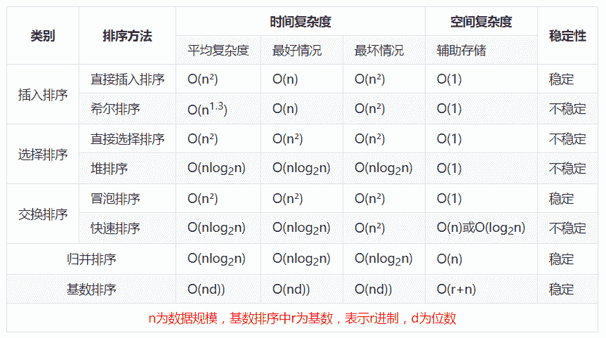

# 小鹏汽车 2020 秋招 Java 笔试题目

## 1

Java 表达式"13 & 17"的结果是什么?（）

正确答案: D   你的答案: 空 (错误)

```cpp
30
```

```cpp
13
```

```cpp
17
```

```cpp
1
```

本题知识点

Java 工程师 小鹏汽车 Java 2020

讨论

[Ebbie](https://www.nowcoder.com/profile/355292099)

&运算符：两个数都转为二进制，然后从两个数的最高位进行与运算，两个都为真（1），结果才为真（1），否则为假（0）13：01101
17：10001
结果：00001，既为 1

发表于 2019-07-03 11:16:20

* * *

[忆令](https://www.nowcoder.com/profile/690858502)

&在 Java 中是位运算符，如果相对应位都是 1，则结果为 1，否则为 0。13 和 17 都为单数，所以二进制后最后一位都是 1，所以结果为 1

发表于 2019-07-02 18:31:34

* * *

[牛客 175204101 号](https://www.nowcoder.com/profile/175204101)

单纯是不会

发表于 2019-10-05 02:40:46

* * *

## 2

下面关于 Java package 的描述，哪个是正确的:（）I. 包不提供将所有类名分区为更易管理的块的机制.II. 包提供可见性控制机制.III. 包的一个重要属性是包内定义的所有类都可以通过该包外的代码访问.IV. 声明为包的一部分的类的.class 文件可以存储在多个目录中.

正确答案: B   你的答案: 空 (错误)

```cpp
只有 I
```

```cpp
只有 II
```

```cpp
只有 III
```

```cpp
只有 IV
```

本题知识点

Java 工程师 小鹏汽车 Java 2020

讨论

[Daxin。](https://www.nowcoder.com/profile/647186584)

这种题感觉看不懂题目意思 挺难受的

发表于 2019-12-23 01:24:19

* * *

[阳光下的米雪](https://www.nowcoder.com/profile/916856937)

为了更好地组织类，Java 提供了包机制，用于区别类名的命名空间。

**包的作用**

*   1、把功能相似或相关的类或接口组织在同一个包中，方便类的查找和使用。

*   2、如同文件夹一样，包也采用了树形目录的存储方式。同一个包中的类名字是不同的，不同的包中的类的名字是可以相同的，当同时调用两个不同包中相同类名的类时，应该加上包名加以区别。因此，包可以避免名字冲突。

*   3、包也限定了访问权限，拥有包访问权限的类才能访问某个包中的类。

Java 使用包（package）这种机制是为了防止命名冲突，访问控制，提供搜索和定位类（class）、接口、枚举（enumerations）和注释（annotation）等。

发表于 2019-07-15 17:48:58

* * *

[鱼泡泡-菜鸟成长记](https://www.nowcoder.com/profile/504722264)

Java 提供了包机制，用于区别类名的命名空间，访问控制包名必须与相应的字节码所在的目录结构相吻合。

发表于 2019-07-07 19:20:40

* * *

## 3

以下表达式的类型和值（注意整数除法）是（）

```cpp
-5 + 1/4 + 2*-3 + 5.0
```

正确答案: D   你的答案: 空 (错误)

```cpp
int -3
```

```cpp
int -4
```

```cpp
double -5.5
```

```cpp
double -6.0
```

本题知识点

Java 工程师 小鹏汽车 Java 2020 C++

讨论

[鱼泡泡-菜鸟成长记](https://www.nowcoder.com/profile/504722264)

在进行运算的时候会自动向较高级别转换**short s1= 1; s1 = s1 + 1;**
这句话编译会报错，因为 s1+1 会自动转换成 int 类型进行计算，需要类型强制转换

发表于 2019-07-07 19:25:24

* * *

[XDZX](https://www.nowcoder.com/profile/476454317)

Java 中/是取整，别和数学里的搞混了

发表于 2020-09-02 01:20:42

* * *

[一等搜查官](https://www.nowcoder.com/profile/816795995)

-5+0-6+5.0=-6.0

发表于 2019-07-01 12:53:01

* * *

## 4

下面哪个描述正确? （）

正确答案: C   你的答案: 空 (错误)

```cpp
程序中的注释越多，程序运行得越快。
```

```cpp
int 是 java.lang 包中可用的类的名称
```

```cpp
类总是有一个构造函数（可能由 java 编译器自动提供）
```

```cpp
实例变量名称只能包含字母和数字
```

本题知识点

Java 工程师 小鹏汽车 Java 2020

讨论

[COLA201803240727762](https://www.nowcoder.com/profile/4997957)

A.肯定错 B.int 是 java 的基础类型，并不是类 C.正确 D.还可能有一些符号如：_   &

发表于 2019-07-09 17:20:17

* * *

[菜呵呵](https://www.nowcoder.com/profile/158502009)

默认自动生成无参构造, 如果手动添加了构造方法, 默认的就会消失

发表于 2019-07-02 20:41:58

* * *

[心峰要努力](https://www.nowcoder.com/profile/51319609)

B：int 是基本类型，Integer 才是类，Integer 是 int 的封装类 D：除了字母和数字，还可以包含下划线 _ 和美元符号 $

发表于 2021-02-03 19:25:54

* * *

## 5

以下哪个命令用于查看 tar（backup.tar）文件的内容而不提取它?（）

正确答案: B   你的答案: 空 (错误)

```cpp
tar -xvf backup.tar
```

```cpp
tar -tvf backup.tar
```

```cpp
tar -svf backup.tar
```

```cpp
none of these
```

本题知识点

Java 工程师 小鹏汽车 Java 2020

讨论

[寻觅 201904140716355](https://www.nowcoder.com/profile/474067470)

[linux 中 tar 命令用法](https://www.cnblogs.com/newcaoguo/p/5896975.html)

把常用的 tar 解压命令总结下，当作备忘：

tar

-c: 建立压缩档案
-x：解压
-t：查看内容
-r：向压缩归档文件末尾追加文件
-u：更新原压缩包中的文件

这五个是独立的命令，压缩解压都要用到其中一个，可以和别的命令连用但只能用其中一个。下面的参数是根据需要在压缩或解压档案时可选的。

-z：有 gzip 属性的
-j：有 bz2 属性的
-Z：有 compress 属性的
-v：显示所有过程
-O：将文件解开到标准输出

下面的参数-f 是必须的

-f: 使用档案名字，切记，这个参数是最后一个参数，后面只能接档案名。

# tar -cf all.tar *.jpg 
这条命令是将所有.jpg 的文件打成一个名为 all.tar 的包。-c 是表示产生新的包，-f 指定包的文件名。

# tar -rf all.tar *.gif 
这条命令是将所有.gif 的文件增加到 all.tar 的包里面去。-r 是表示增加文件的意思。

# tar -uf all.tar logo.gif 
这条命令是更新原来 tar 包 all.tar 中 logo.gif 文件，-u 是表示更新文件的意思。

# tar -tf all.tar 
这条命令是列出 all.tar 包中所有文件，-t 是列出文件的意思

# tar -xf all.tar 
这条命令是解出 all.tar 包中所有文件，-x 是解开的意思

压缩

*   tar –cvf jpg.tar *.jpg  将目录里所有 jpg 文件打包成 tar.jpg
*   tar –czf jpg.tar.gz *.jpg   将目录里所有 jpg 文件打包成 jpg.tar 后，并且将其用 gzip 压缩，生成一个 gzip 压缩过的包，命名为 jpg.tar.gz
*   tar –cjf jpg.tar.bz2 *.jpg 将目录里所有 jpg 文件打包成 jpg.tar 后，并且将其用 bzip2 压缩，生成一个 bzip2 压缩过的包，命名为 jpg.tar.bz2
*   tar –cZf jpg.tar.Z *.jpg   将目录里所有 jpg 文件打包成 jpg.tar 后，并且将其用 compress 压缩，生成一个 umcompress 压缩过的包，命名为 jpg.tar.Z
*   rar a jpg.rar *.jpg rar 格式的压缩，需要先下载 rar for linux
*   zip jpg.zip *.jpg   zip 格式的压缩，需要先下载 zip for linux 

解压

*   tar –xvf file.tar  解压 tar 包
*   tar -xzvf file.tar.gz 解压 tar.gz
*   tar -xjvf file.tar.bz2   解压 tar.bz2
*   tar –xZvf file.tar.Z   解压 tar.Z
*   unrar e file.rar 解压 rar
*   unzip file.zip 解压 zip

总结

1.  *.tar 用 tar –xvf 解压
2.  *.gz 用 gzip -d 或者 gunzip 解压
3.  *.tar.gz 和*.tgz 用 tar –xzf 解压
4.  *.bz2 用 bzip2 -d 或者用 bunzip2 解压
5.  *.tar.bz2 用 tar –xjf 解压
6.  *.Z 用 uncompress 解压
7.  *.tar.Z 用 tar –xZf 解压
8.  *.rar 用 unrar e 解压
9.  *.zip 用 unzip 解压

linux 下最常用的打包程序就是 tar 了，使用 tar 程序打出来的包我们常称为 tar 包，tar 包文件的命令通常都是以.tar 结尾的。生成 tar 包后，就可以用其它的程序来进行压缩。

1．命令格式：

tar[必要参数][选择参数][文件] 

2．命令功能：

用来压缩和解压文件。tar 本身不具有压缩功能。他是调用压缩功能实现的 

3．命令参数：

必要参数有如下：

-A 新增压缩文件到已存在的压缩

-B 设置区块大小

-c 建立新的压缩文件

-d 记录文件的差别

-r 添加文件到已经压缩的文件

-u 添加改变了和现有的文件到已经存在的压缩文件

-x 从压缩的文件中提取文件

-t 显示压缩文件的内容

-z 支持 gzip 解压文件

-j 支持 bzip2 解压文件

-Z 支持 compress 解压文件

-v 显示操作过程

-l 文件系统边界设置

-k 保留原有文件不覆盖

-m 保留文件不被覆盖

-W 确认压缩文件的正确性

可选参数如下：

-b 设置区块数目

-C 切换到指定目录

-f 指定压缩文件

--help 显示帮助信息

--version 显示版本信息

4．常见解压/压缩命令

tar 
解包：tar xvf FileName.tar
打包：tar cvf FileName.tar DirName
（注：tar 是打包，不是压缩！）

.gz
解压 1：gunzip FileName.gz
解压 2：gzip -d FileName.gz
压缩：gzip FileName

.tar.gz 和 .tgz
解压：tar zxvf FileName.tar.gz
压缩：tar zcvf FileName.tar.gz DirName

.bz2
解压 1：bzip2 -d FileName.bz2
解压 2：bunzip2 FileName.bz2
压缩： bzip2 -z FileName

.tar.bz2
解压：tar jxvf FileName.tar.bz2
压缩：tar jcvf FileName.tar.bz2 DirName

.bz
解压 1：bzip2 -d FileName.bz
解压 2：bunzip2 FileName.bz
压缩：未知

.tar.bz
解压：tar jxvf FileName.tar.bz
压缩：未知

.Z
解压：uncompress FileName.Z
压缩：compress FileName

.tar.Z
解压：tar Zxvf FileName.tar.Z
压缩：tar Zcvf FileName.tar.Z DirName

.zip
解压：unzip FileName.zip
压缩：zip FileName.zip DirName

.rar
解压：rar x FileName.rar
压缩：rar a FileName.rar DirName 

5．使用实例

实例 1：将文件全部打包成 tar 包

命令：

tar -cvf log.tar log2012.log

tar -zcvf log.tar.gz log2012.log

tar -jcvf log.tar.bz2 log2012.log

发表于 2019-07-12 14:04:09

* * *

[DonLex](https://www.nowcoder.com/profile/33263099)

*   -s 还原文件的顺序和备份文件内的存放顺序相同。
*   -t 列出备份文件的内容。
*   -v 显示指令执行过程。
*   -f 指定压缩文件
*   -x 从备份文件中还原文件。

发表于 2019-07-03 21:18:25

* * *

[轰鸣](https://www.nowcoder.com/profile/2610941)

对于基本不运维的工程师来讲，偶尔用到这些命令都是面向百度运维吧🤣🤣🤣🤣


发表于 2019-10-14 17:16:59

* * *

## 6

下面的程序将来打印什么?（）

```cpp
public class TestIncr {
    public static void main(String args[]) {
        int i = 0;
        i = i++ + i;
        System.out.println("I =" +i);
    }
}
```

正确答案: A   你的答案: 空 (错误)

```cpp
I = 1
```

```cpp
I = 2
```

```cpp
I = 3
```

```cpp
编译出错
```

本题知识点

Java 工程师 小鹏汽车 Java 2020

讨论

[Bean 冷的心](https://www.nowcoder.com/profile/411517301)

觉得选 d 的请点赞

发表于 2019-07-03 15:57:39

* * *

[月朗心惜](https://www.nowcoder.com/profile/9551369)

这题没有大家想的那么简单。 上机实测 int i = 0; i++ +i//值为 1 i++ +0//值为 0 ---- int i = 1; i++ +i//值为 3 i++ +0//值为 1 结论:不是大家说的 i+i 然后 i++ 是更复杂的 i++时其实是 i=_i+1 先运算了++此时 i 值已经变了，但是 i++ +i 时其实运算的是 _i+i。 对没错，i++做运算时取的是运算前的值，但他本身会执行。

发表于 2020-01-15 19:23:12

* * *

[我就是个废物](https://www.nowcoder.com/profile/547101875)

我相信很多人会不懂为什么是 A 首先，在 i = i++ + i 中，先执行的是 i++ ，此时式子可为 i = 0 + i 然后再进行后一步 +i ，因为前面执行了 i++ ，所以这个 i 的值已经 +1 了那么最后这个式子就是 i = 0 + 1 ，话不多说，直接上代码看吧

编辑于 2020-04-10 11:07:09

* * *

## 7

在 Java 中，什么是 Garbage Collection?（）

正确答案: C   你的答案: 空 (错误)

```cpp
自动删除在程序中导入但未使用的任何包
```

```cpp
JVM 检查任何 Java 程序的输出并删除任何没有意义的东西
```

```cpp
当对象的所有引用都消失后，对象使用的内存将自动回收
```

```cpp
操作系统定期删除系统上可用的所有 java 文件
```

本题知识点

Java 工程师 小鹏汽车 Java 2020

讨论

[要变小黑的小白](https://www.nowcoder.com/profile/657692)

完蛋，只知道 GC 不知道 GC 的全程是什么😂

发表于 2020-05-07 15:43:57

* * *

[蜗牛狂奔](https://www.nowcoder.com/profile/419205957)

这道题 C 的描述也有问题吧，就是“当对象的所有引用都消失”有问题，gc 回收的是不能和 gc roots 引用链连接的对象。这道题的歧义在于：如果两个对象之间有循环依赖，但是又不在引用链上，还是会回收的。

发表于 2019-09-11 19:01:18

* * *

[WYWIDWTGU](https://www.nowcoder.com/profile/112371466)

最会的一题，最近在看 jvm🌚

发表于 2019-07-16 19:12:44

* * *

## 8

下面哪个描述正确? （）

正确答案: A   你的答案: 空 (错误)

```cpp
echo $$返回登录 shell 的 PID 和 echo $？ 返回上一个命令的状态
```

```cpp
echo $$返回上一个命令和 echo $的状态？ 返回登录 shell 的 PID
```

```cpp
echo $$和 echo $？ 返回一些无意义的整数值
```

```cpp
所有陈述都是错误的
```

本题知识点

Java 工程师 小鹏汽车 2020

讨论

[DingYu](https://www.nowcoder.com/profile/646808631)

在[`www.cnblogs.com/perfy/p/8472987.html`](https://www.cnblogs.com/perfy/p/8472987.html) 复制的内容哈 省的大家再去切出去找啦！

```cpp
shell 中的特殊变量：
变量名
含义
$0
shell 或 shell 脚本的名字
$*
以一对双引号给出参数列表
$@
将各个参数分别加双引号返回
$#
参数的个数
$_
代表上一个命令的最后一个参数
$$
代表所在命令的 PID
$!
代表最后执行的后台命令的 PID
$?
代表上一个命令执行后的退出状态  echo $? 如果返回值是 0，就是执行成功；如果是返回值是 0 以外的值，就是失败。
```

发表于 2019-08-01 22:11:42

* * *

[紫气](https://www.nowcoder.com/profile/5398851)

echo $$ 当前登录 shell 的 PIDecho $? 最后运行的命令的结束代码（返回值）即执行上一个指令的返回值 (显示最后命令的退出状态。0 表示没有错误，其他任何值表明有错误)

发表于 2019-07-02 11:57:00

* * *

[wangyajie](https://www.nowcoder.com/profile/496184)

这个跟 shell 解析器有关系,此题参考意义不大

发表于 2019-07-10 11:15:45

* * *

## 9

以下那个数据结构是适用于"数据必须以相反的顺序存储然后检索" ? （）

正确答案: A   你的答案: 空 (错误)

```cpp
Stack
```

```cpp
Queue
```

```cpp
List
```

```cpp
Liink List
```

本题知识点

Java 工程师 小鹏汽车 Java 2020

讨论

[小王子的梦想](https://www.nowcoder.com/profile/712725053)

栈-先进后出(比喻:坐电梯) 队列-先进先出(水管) list-链表(怎么存就怎么取)

发表于 2019-07-10 00:19:10

* * *

[牛客 501953184 号](https://www.nowcoder.com/profile/501953184)

意思就是存的顺序 与取出来的顺序完全相反
Stack 栈  先进后出
Queue 队列  先进先出
List 集合  有下标  存的顺序与取得的顺序一致
LinedList 类 是 Queue 的子类  存的顺序与取得的顺序一致

发表于 2019-12-12 10:18:35

* * *

[hpt 学习中](https://www.nowcoder.com/profile/7030223)

数据必须以相反的顺序存储然后检索：比如 ：存入 1，2，3，4，5，6。取出：6，5，4，3，2，1

发表于 2019-07-23 09:46:33

* * *

## 10

关于 finally,下面哪个描述正确? （）

正确答案: B   你的答案: 空 (错误)

```cpp
在 catch 块之前但在 try 块之后执行 finally 块
```

```cpp
finally 块会被执行无论是否抛出异常
```

```cpp
只有在执行 catch 块之后才执行 finally 块
```

```cpp
都不是
```

本题知识点

Java 工程师 小鹏汽车 Java 2020

讨论

[hpt 学习中](https://www.nowcoder.com/profile/7030223)

结果
即使在 try 中产生异常也会执行。第二种特殊情况：
结果
即使在 try 中 return 也会执行 finally 中的结果第三种特殊情况：


发表于 2019-07-23 09:56:20

* * *

[哈哈哈 201802231037653](https://www.nowcoder.com/profile/6225079)

如果 try 或者 catch 里有 System.exit(0);这段，就不会执行 finally 了吧 System.exit(status);这个方法是用来结束当前正在运行中的 java 虚拟机。

发表于 2019-07-02 16:59:55

* * *

[sjh123](https://www.nowcoder.com/profile/272256735)

try catch fianlly 语句书写格式：     一定要有 try；catch/finally 可以任选一个执行顺序：    先执行 try    catch 中如果捕捉到异常则执行，反之不执行     然后执行 finally 严格意义上来说，finally 并不是在任何条件下都会执行的：     如 try 块未被执行；执行 try 时线程中断；执行时断电断网等如果 try catch finally 中有 return 语句时的执行顺序：     基本同上，但是如果 try catch 中有 return 语句则先将数值保存并不返回，等到 finally 中全部执行完（如果 finally 中有 return 则直接返回结束），则返回 try catch 中的 return 值

编辑于 2020-06-03 16:21:38

* * *

## 11

多重继承的概念在 Java 中实现是通过如下哪些？（）I. 扩展两个或多个类 II. 扩展一个类并实现一个或多个接口。III. 实现两个或更多接口。

正确答案: B   你的答案: 空 (错误)

```cpp
只有 I &amp;II
```

```cpp
只有 II &amp; III
```

```cpp
只有 III
```

```cpp
都是
```

本题知识点

Java 工程师 小鹏汽车 Java 2020

讨论

[HW 柯可](https://www.nowcoder.com/profile/943949859)

Java 只支持单继承，实现多重继承三种方式：（1）直接实现多个接口 （2）扩展(extends)一个类然后实现一个或多个接口  （3）通过内部类去继承其他类

编辑于 2019-12-05 15:09:08

* * *

[joyh](https://www.nowcoder.com/profile/661382648)

术语还是懂得太少了，扩展一个类是 extend 啊

发表于 2019-07-06 19:07:02

* * *

[℡201711232353333](https://www.nowcoder.com/profile/8115347)

多重继承，三种实现方式，使用多层继承，接口，内部类

发表于 2019-10-13 17:27:46

* * *

## 12

以下类定义中的错误是什么？（）

```cpp
abstract class xy
{
    abstract sum (int x, int y) { }
}

```

正确答案: C   你的答案: 空 (错误)

```cpp
没有错误
```

```cpp
类标题未正确定义
```

```cpp
方法没有正确定义
```

```cpp
没有定义构造函数
```

本题知识点

Java 工程师 小鹏汽车 Java 2020

讨论

[阿呆的呆](https://www.nowcoder.com/profile/5227440)

1、抽象方法不能有方法体，这是规定 2、该方法缺少返回值，只有构造没有返回值

发表于 2019-07-27 14:54:50

* * *

[好滴](https://www.nowcoder.com/profile/590257087)

抽象方法不能有方法体，只能申明

发表于 2019-07-04 18:45:32

* * *

[奔跑的丶小胖子](https://www.nowcoder.com/profile/77555644)

抽象方法没有方法体，只有声明。 abstract sum (int x, int y);

编辑于 2019-07-19 19:35:23

* * *

## 13

针对下面的代码块,哪个 equal 为 true:（）

```cpp
String s1 = "xiaopeng" ;
String s2 = "xiaopeng" ;
String s3 =new String (s1);

```

正确答案: A   你的答案: 空 (错误)

```cpp
s1 == s2
```

```cpp
s1 = s2
```

```cpp
s2 == s3
```

```cpp
都不正确
```

本题知识点

Java 工程师 小鹏汽车 Java 2020

讨论

[小王子的梦想](https://www.nowcoder.com/profile/712725053)

string 是 final 修饰的，会将创建的变量放入字符串常量池，当再创建同样的字符串时，发现常量池中有则直接使用

发表于 2019-07-10 00:22:14

* * *

[hpt 学习中](https://www.nowcoder.com/profile/7030223)

String s 1 = "xiaopeng",这种定义字符串的方式，首先看看字符串常量池中是否有“xiaopeng"如果有就就直接从常量池中取，没有则将“xiaopeng"放到常量池中。String s2 = 'xiaopeng"，常量池中有”xiaopeng",直接取值。string s3 = new String("xiaopeng");直接在堆中产生一个字符串“xiaopeng”.所以 s1 和 s2 地址一样，和 s3 地址不一样

编辑于 2019-07-23 09:01:24

* * *

[飞鸟与她](https://www.nowcoder.com/profile/9158041)

通过`String s1 = "xiaopeng" ;`会将字符串自动放入常量池中

发表于 2019-07-02 10:49:47

* * *

## 14

下面字段声明中哪一个在 interface 主体内是合法的? （）

正确答案: B   你的答案: 空 (错误)

```cpp
private final static int answer = 42;
```

```cpp
public static int answer = 42;
```

```cpp
final static answer = 42;
```

```cpp
int answer;
```

本题知识点

Java 工程师 小鹏汽车 Java 2020

讨论

[特务依昂](https://www.nowcoder.com/profile/521646787)

在接口中，属性都是默认 public static final 修饰的，所以：    A（错误）：不能用 private 修饰；
    B（正确）：在接口中，属性默认 public static final，这三个关键字可以省略；
    C（错误）：没写属性的类型；
    D（错误）：final 修饰的属性必须赋值；

发表于 2019-07-15 23:13:55

* * *

[今年一定跳槽](https://www.nowcoder.com/profile/1924821)

接口中的属性在不提供修饰符修饰的情况下，会自动加上 public static final 注意（在 1.8 的编译器下可试）：（1）属性不能用 private，protected,default 修饰，因为默认是 public（2）如果属性是基本数据类型，需要赋初始值，若是引用类型，也需要初始化，因为默认有 final 修饰，必须赋初始值；（3）接口中常规的来说不能够定义方法体，所以无法通过 get 和 set 方法获取属性值，所以属性不属于对象，属于类（接口），因为默认使用 static 修饰。

编辑于 2019-08-12 07:41:41

* * *

[IDEA2022.4.2](https://www.nowcoder.com/profile/181223548)

我估计有些马大哈没看数据类型选了 C

发表于 2019-09-06 15:38:34

* * *

## 15

基本的 Java 语言函数存储在以下哪个 java 包中？（）

正确答案: A   你的答案: 空 (错误)

```cpp
java.lang
```

```cpp
java.io
```

```cpp
java.net
```

```cpp
java.util
```

本题知识点

Java 工程师 小鹏汽车 Java 2020

讨论

[热爱学习的小怪兽。](https://www.nowcoder.com/profile/769640169)

java.lang 包包含

*   包装类
*   String 类
*   Math 类     ——    包含函数
*   Class 类
*   Object 类

 发表于 2019-08-02 13:11:11

* * *

[AlQNM](https://www.nowcoder.com/profile/778717720)

java.lang   提供 java**基础类**，例如：Object\Math\String\StringBuffer\System\Tread 等，这是我们最常用的**包包**，但是我们并不常见到她，因为我们不需要将她手动导入；java.util     提供包括集合框架、事件模型、日期时间、等等的使用**工具类；**java.io       提供通过文件系统、数据流和序列化提供系统的**输入输入；**java.net     提供实时**网络**应用和开发的类；java.sql     提供使用 java 语言访问并处理存储在数据源中的**数据 API；**java.awt  和  java.swing  提供了**GUI**开发与设计的类，awt 提供了创建界面和绘制图形图像的所有类，swing 包提供了一组“轻量级”的组件，尽量让这些组件在所有平台上的工作方式相同；java.text    提供了与自然语言无关的方式来处理文本日期、数字和消息的类和接口。

发表于 2021-08-22 15:46:23

* * *

[夜是故乡明](https://www.nowcoder.com/profile/6432095)

根据题意 Java**语言**函数，lang 为 language（语言）的缩写

发表于 2020-10-31 22:14:33

* * *

## 16

以下哪个类包含方法 flush()？（）

正确答案: B   你的答案: 空 (错误)

```cpp
InputStream
```

```cpp
OutputStream
```

```cpp
A 和 B 选项都包含
```

```cpp
A  和 B 选项都不包含
```

本题知识点

Java 工程师 小鹏汽车 Java 2020

讨论

[莫得感情 0offer](https://www.nowcoder.com/profile/5309396)

flush（）函数强制将缓冲区中的字符流、字节流等输出，目的是如果输出流输出到缓冲区完成后，缓冲区并没有填满，那么缓冲区将会一直等待被填满。所以在关闭输出流之前要调用 flush（）。

发表于 2019-07-03 15:48:04

* * *

[编程小海浪](https://www.nowcoder.com/profile/797024057)

//——————–flush()的作用————————–

笼统且错误的回答：

缓冲区中的数据保存直到缓冲区满后才写出，也可以使用 flush 方法将缓冲区中的数据强制写出或使用 close()方法关闭流，关闭流之前，缓冲输出流将缓冲区数据一次性写出。flash()和 close()都使数据强制写出，所以两种结果是一样的，如果都不写的话，会发现不能成功写出

针对上述回答，给出了精准的回答

FileOutPutStream 继承 outputStream,并不提供 flush()方法的重写所以无论内容多少 write 都会将二进制流直接传递给底层操作系统的 I/O,flush 无效果而 Buffered 系列的输入输出流函数单从 Buffered 这个单词就可以看出他们是使用缓冲区的,应用程序每次 IO 都要和设备进行通信，效率很低，因此缓冲区为了提高效率，当写入设备时，先写入缓冲区，等到缓冲区有足够多的数据时，就整体写入设备

使用 BufferedXXXStream。默认缓冲区大小是 8K。读的时候会一直填满缓冲区（或者文件读取完毕），写的时候也是等缓冲区满了之后（或者执行 flush 操作）才将内容送入内核缓冲区。效率高的原因就是避免了每读一个字节都要陷入操作系统内核（这是个耗时的操作）。具体代码，题主自己查 API 吧。

再附上来自百度知道的一段问题回答。

flush()意思是把缓冲区的内容强制的写出。 因为操作系统的某些机制，为了防止一直不停地磁盘读写，所以有了延迟写入的概念,(注意不要和 frush()刷新混淆了)，主要用在 IO 中，即清空缓冲区数据，一般在读写流(stream)的时候，数据是先被读到了内存中，再把数据写到文件中，当你数据读完的时候不代表你的数据已经写完了，因为还有一部分有可能会留在内存这个缓冲区中。这时候如果你调用了 close()方法关闭了读写流，那么这部分数据就会丢失，所以应该在关闭读写流之前先 flush()。。

在网络 web 服务器上也是，为了防止写一个字节就发送一个消息，所以有缓冲区的概念，比如 64K 的内存区域，缓冲区写满了再一次性写入磁盘之中（或者发送给客户端浏览器）。

flush 方法一般是程序写入完成时执行。随后跟着 close 方法。例如：

[?](https://www.jb51.net/article/132470.htm#)

| 12345 | // 取得输出流。当然，看具体环境。PrintWriter out = Util.getWriter();out.println("输出一些信息，可能很多");out.flush();out.close(); |

简单来说，flush（）方法是输出储存在内存中全部的内容（批量输出）。 常用比如 FileWriter 类中就是一个典型，除了可以使用 flush 输出，最后调用 close 方法也会批量输出。

[?](https://www.jb51.net/article/132470.htm#)

| 123456789 | importjava.io.FileWriter;importjava.io.IOException;publicclassA04 {    publicstaticvoidmain(String args[]) {        FileWriter fw;        try{            fw =newFileWriter("C:\\try.txt");            fw.write("Hello");            //fw.close(); //这句话不加，无法写入文件，文件空白！ System.out.println("OK"); } catch (IOException e) { // TODO Auto-generated catch block e.printStackTrace(); } } } |

发表于 2019-09-07 19:36:08

* * *

[ThinkingOverflow](https://www.nowcoder.com/profile/165701207)

1）对于字符写出流，如 FileWriter，必须要使用到 flush 将字符缓冲区的内容写到文件中。字符缓冲区的数据是按字符算的，必须集齐一个字符（汉字是 2 个字符或者 3 个字符）的数据才能将数据写入文件；

2）对于字节写出流，如 FileOutputStream 等，他们可以直接把数据写入文件，不需要用到 flush()刷新，因为他们是一个字节一个字节写入的。但是，字节写出流也有 flush()方法（继承自父类 OutoutStream）为何字节流的类要提供 flush()这个方法呢？查看 API 知道，OutputStream 的直接子类有：FileOutputStream, FilterOutputStream, ObjectOutputStream, OutputStream, PipedOutputStream，ByteArrayOutputStream 等，其中绝大部重写 flush 方法的子类调用的还是父类的空的 flush 方法。我们查看 FilterOutputStream 的子类 BufferedOutputStream 重写的 flush 方法，调用了 flushBuffer()方法，可以知道构造器的默认缓冲区是 8k，如果读取的文件小于 8k 而没有调用 flush 方法，就不会将缓冲数据写到输出流，文件内容为空。

**我之前一直以为字节流是没有 flush()方法的，MARK！**


编辑于 2020-04-25 23:05:27

* * *

## 17

以下哪个事件会导致线程销毁？（）

正确答案: D   你的答案: 空 (错误)

```cpp
调用方法 sleep()
```

```cpp
调用方法 wait()
```

```cpp
start()方法的执行结束
```

```cpp
run()方法的执行结束
```

本题知识点

Java 工程师 小鹏汽车 Java 2020

讨论

[阿阿牛](https://www.nowcoder.com/profile/327715682)


发表于 2019-07-05 15:37:09

* * *

[微风中慢飘](https://www.nowcoder.com/profile/123570435)

A. 调用 sleep()方***让线程进入睡眠状态---睡眠指定的时间后再次执行；B. 调用 wait()方***让线程进入等待状态 ----等待别的线程执行 notify()或 notifyAll()唤醒后继续执行；C.调用 start()方***让线程进入就绪状态---得到 CPU 时间就执行线程；D.run()方法是线程的具体逻辑方法，执行完，线程就结束。

发表于 2019-07-05 18:20:38

* * *

[特务依昂](https://www.nowcoder.com/profile/521646787)

看 API 中红框里的这句话，start 方***开启一个新的线程执行 run 方法，所以 start 方法执行完，不代表 run 方法执行完，线程也不一定销毁！所以 C 错误~

编辑于 2019-07-15 23:00:30

* * *

## 18

尝试编译以下程序会产生怎么样的结果？（）

```cpp
public class MyClass {
    long var;
    public void MyClass(long param) { var = param; }//(1)
    public static void main(String[] args) {
        MyClass a, b;
        a =new MyClass();//(2)
        b =new MyClass(5);//(3)
    }
}

```

正确答案: C   你的答案: 空 (错误)

```cpp
编译错误将发生在（1），因为构造函数不能指定返回值
```

```cpp
编译错误将发生在（2），因为该类没有默认构造函数
```

```cpp
编译错误将在（3）处发生，因为该类没有构造函数，该构造函数接受一个 int 类型的参数
```

```cpp
该程序将正确编译和执行
```

本题知识点

Java 工程师 小鹏汽车 Java 2020

讨论

[Bean 冷的心](https://www.nowcoder.com/profile/411517301)

这道题一定要看仔细了，MyClass 方法并不是构造参数，而是返回类型为 void 的普通方法，普通方法自然需要实例化对象然后去调用它，所以 124 不对，第三个是正确的，因为没有带参数的构造器，所以自然不能传一个 int 进去。

发表于 2019-07-03 16:32:21

* * *

[Pine201907041743545](https://www.nowcoder.com/profile/893288377)

```cpp

	构造方法就是：public 类名， 没有方法修饰符 

	所以 (1)  处就是一个普通方法

	所以该类没有带参数构造方法 ，编译报错

```

编辑于 2019-07-08 11:33:59

* * *

[Wrilen](https://www.nowcoder.com/profile/1146722)

（1）虽然方法名和类名相同，不过由于 void 的修饰，所以它并不是一个构造方法，只是一个普通方法。因此题类仍然只有默认的无参构造器，（3）向构造方法中传入一个参数故而有误。

发表于 2019-07-02 18:03:02

* * *

## 19

关于修饰语的使用，以下哪一项是正确的? （）

正确答案: B   你的答案: 空 (错误)

```cpp
如果没有为成员声明指定可访问性修饰符（public，protected 和 private），则该成员只能访问其类的包中的类及其类的子类的任何位置
```

```cpp
您无法指定局部变量的可访问性。它们只能在声明它们的区域内访问
```

```cpp
类的子类必须与它们扩展的类位于同一个包中 D)上面提到的都不是
```

本题知识点

Java 工程师 小鹏汽车 Java Java 工程师 小鹏汽车 2020

讨论

[朝西 FaceWest](https://www.nowcoder.com/profile/987426291)

这题 D 选项都被 C 选项吃进去了

发表于 2019-07-12 15:20:17

* * *

[特务依昂](https://www.nowcoder.com/profile/521646787)

没有被 public，protected，private 修饰的类成员，只有同一个包里的类中可以访问，其余都不行；

编辑于 2019-07-15 23:23:14

* * *

[纽克张](https://www.nowcoder.com/profile/36348232)

方法内的变量称为局部变量，则这道题就很简单了

发表于 2019-07-11 21:34:32

* * *

## 20

在各自最优条件下,对 N 个数进行排序,哪个算法复杂度最低的是? （）

正确答案: A   你的答案: 空 (错误)

```cpp
插入排序
```

```cpp
快速排序
```

```cpp
堆排序
```

```cpp
归并排序
```

本题知识点

Java 工程师 小鹏汽车 Java 2020

讨论

[阿呆的呆](https://www.nowcoder.com/profile/5227440)



发表于 2019-07-27 14:30:00

* * *

[韩酸](https://www.nowcoder.com/profile/8039276)

插入排序：最佳 O（N）快速排序：最佳 O（NlogN）堆    排序：最佳 O（NlogN）归并排序：最佳 O（NlogN）因此选择插入排序。

发表于 2019-07-02 08:29:36

* * *

[寻觅 201904140716355](https://www.nowcoder.com/profile/474067470)

对于插入排序，最优条件就是本身有序，所以循环一遍就好了。

发表于 2019-07-12 14:12:24

* * *