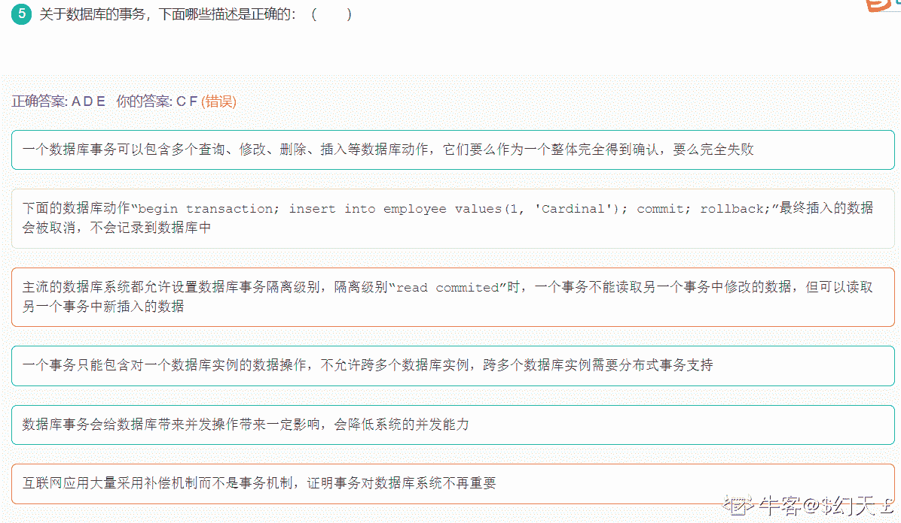

# 用友 2017web 前端试题（四）

## 1

下面哪些中间件产品提供了 JSP 和 Servlet 的服务：(           )

正确答案: B D   你的答案: 空 (错误)

```cpp
NGINX
```

```cpp
Tomcat
```

```cpp
Apache Web Server
```

```cpp
Jetty
```

```cpp
ActiveMQ
```

```cpp
RabbitMQ
```

本题知识点

前端工程师 用友 2017

讨论

[辰锅锅](https://www.nowcoder.com/profile/822015803)

**，不是 web 前端的题！做了两道就提交不做了！

发表于 2019-07-11 16:25:05

* * *

[小🐮客](https://www.nowcoder.com/profile/990177409)

警告，这套题好垃圾！！！

发表于 2019-09-09 10:41:55

* * *

## 2

下面关于 WebService 的哪些描述是正确的：（          ）

正确答案: B E   你的答案: 空 (错误)

```cpp
WEB Service 的传输协议必须是 HTTP，否则不能称之为 WebService
```

```cpp
XML Security 题 gogmde1 机制是 WebService 中的 XML 数据安全的基本机制
```

```cpp
Apache AXIS 是一种流行的 WebService 框架
```

```cpp
SOAP-RPC 比 JSON-RPC 在数据处理上更具有效率
```

```cpp
SOAP WebService 通过 WSDL 描述接口， WSDL 支持对 WebService 进行人机可识别的描述
```

```cpp
WebService 的数据格式通过 XSLT 进行精确的描述，每个元素的格式及其数据类型都可描绘清晰
```

本题知识点

前端工程师 用友 2017

## 3

下面关于面向对象的一些理解哪些是错误的(            )

正确答案: C   你的答案: 空 (错误)

```cpp
面向对象的最重要的特性是支持继承、封装和多态
```

```cpp
系统设计应该遵循开闭原则，系统应该稳定不不可修改，但应支持通过继承、组合等方式进行扩展
```

```cpp
函数式的语言必然是面向对象的语言
```

```cpp
面向对象设计时，每个类的职责应该单一，不要再一个类中引入过多的接口
```

```cpp
过程式语言和面向对象的语言各有其优势，过程式语言更加灵活，面向对象语言更加强调抽象和封装
```

```cpp
Java 和 C++都是静态类型的面向对象编程语言
```

本题知识点

前端工程师 用友 Java 2017 C++

讨论

[人余月半子](https://www.nowcoder.com/profile/514787832)

**程序设计六大原则**

**1、开闭原则（Open Close Principle）**开闭原则的意思是：**对扩展开放，对修改关闭**。在程序需要进行拓展的时候，不能去修改原有的代码，实现一个热插拔的效果。简言之，是为了使程序的扩展性好，易于维护和升级。**2、里氏代换原则（Liskov Substitution Principle）**里氏代换原则是面向对象设计的基本原则之一。 里氏代换原则中说，任何基类可以出现的地方，子类一定可以出现。LSP 是继承复用的基石，只有当派生类可以替换掉基类，且软件单位的功能不受到影响时，基类才能真正被复用，而派生类也能够在基类的基础上增加新的行为。里氏代换原则是对开闭原则的补充。实现开闭原则的关键步骤就是抽象化，而基类与子类的继承关系就是抽象化的具体实现，所以里氏代换原则是对实现抽象化的具体步骤的规范。**3、依赖倒转原则（Dependence Inversion Principle）**这个原则是开闭原则的基础，具体内容：针对接口编程，依赖于抽象而不依赖于具体。**4、接口隔离原则（Interface Segregation Principle）**这个原则的意思是：使用多个隔离的接口，比使用单个接口要好。它还有另外一个意思是：降低类之间的耦合度。由此可见，其实设计模式就是从大型软件架构出发、便于升级和维护的软件设计思想，它强调降低依赖，降低耦合。**5、迪米特法则，又称最少知道原则（Demeter Principle）**最少知道原则是指：一个实体应当尽量少地与其他实体之间发生相互作用，使得系统功能模块相对独立。**6、合成复用原则（Composite Reuse Principle）**合成复用原则是指：尽量使用合成/聚合的方式，而不是使用继承

发表于 2020-06-24 09:43:06

* * *

[lhang-21 届](https://www.nowcoder.com/profile/327306892)

一种多选的感觉，然后就强行多选了一个

发表于 2019-09-19 17:06:44

* * *

[明光桥顶级学渣](https://www.nowcoder.com/profile/4339036)

【摘抄】动态类型语言是指在运行期间才去做数据类型检查的语言，也就是说，在用动态类型的语言编程时，永远也不用给任何变量指定数据类型，该语言会在你第一次赋值给变量时，在内部将数据类型记录下来。Python 和 Ruby 就是一种典型的动态类型语言，其他的各种脚本语言如 VBScript 也多少属于动态类型语言。

发表于 2019-11-21 00:09:05

* * *

## 4

下面关于二分查找的叙述争正确的是:   （        ）

正确答案: D   你的答案: 空 (错误)

```cpp
表必须有序，表可以顺序方式存储，也可以链表方式存储
```

```cpp
表必须有序且表中数据必须是整型，实型或字符型
```

```cpp
表必须有序，而且只能从小到大排列
```

```cpp
表必须有序，且表只能以顺序方式存储
```

```cpp
表不需要有序，只要符合小堆和大堆的数据排列要求即可
```

```cpp
表不需要有序，但存储必须是顺序存储
```

本题知识点

前端工程师 用友 查找 *2017* *讨论

[wwwwxxxx](https://www.nowcoder.com/profile/363259333)

被不定项骗了的报个到

发表于 2019-10-09 02:21:54

* * *

[WarriorFromLongAgo](https://www.nowcoder.com/profile/520873155)

A 错误的原因，不可以以链表方式存储，因为链表不知道中点在什么位置，他只能从头遍历找到中间的位置 B，字符你想做什么 C，可以不是从小到大，也可以从大到小，只需要有序就可以了 EF，必须有序

发表于 2019-10-28 19:03:44

* * *

[通关小菜鸟](https://www.nowcoder.com/profile/9896771)

B 项表中数据必须是整型，实型或字符型，但没有保证表中的数据类型必须是同一类型

发表于 2020-06-19 08:59:12

* * *

## 5

关于数据库的事务，下面哪些描述是正确的：（        ）

正确答案: A D E   你的答案: 空 (错误)

```cpp
一个数据库事务可以包含多个查询、修改、删除、插入等数据库动作，它们要么作为一个整体完全得到确认，要么完全失败
```

```cpp
下面的数据库动作“begin transaction; insert into employee values(1, 'Cardinal'); commit; rollback;”最终插入的数据会被取消，不会记录到数据库中
```

```cpp
主流的数据库系统都允许设置数据库事务隔离级别，隔离级别“read commited”时，一个事务不能读取另一个事务中修改的数据，但可以读取另一个事务中新插入的数据
```

```cpp
一个事务只能包含对一个数据库实例的数据操作，不允许跨多个数据库实例，跨多个数据库实例需要分布式事务支持
```

```cpp
数据库事务会给数据库带来并发操作带来一定影响，会降低系统的并发能力
```

```cpp
互联网应用大量采用补偿机制而不是事务机制，证明事务对数据库系统不再重要
```

本题知识点

前端工程师 用友 数据库 2017

讨论

[拉拉呢呢](https://www.nowcoder.com/profile/695518448)

B 事务提交后就不能回滚了 C 隔离级别 commit 对别的事务插入，更新的行只能在其提交后读取。

发表于 2020-03-15 11:02:54

* * *

[$幻天￡](https://www.nowcoder.com/profile/234238713)

可能这就是菜***

发表于 2020-08-04 15:25:47

* * *

[牛客 562698409 号](https://www.nowcoder.com/profile/562698409)

数据库事务的四种隔离级别 Read uncommitted 一个事务可以读取另个未提交事务的数据 Read committed 一个事务要等另个事物提后才能读取数据 Repeatable read 在开始读取数据时，不再允许修改操作 Serializable 事务串行化顺序执行，可以避免脏读不可重复读和幻读

发表于 2021-03-13 11:26:25

* * *

## 6

关于 XML，下面哪些描述是错误的：(          )

正确答案: B   你的答案: 空 (错误)

```cpp
每个合格的 XML 都有唯一的根元素
```

```cpp
XML 和 Java,C/C++一样是门编程语言
```

```cpp
XML 的格式上是要求严格的，每个元素的开闭必须完整，不允许交叉开闭，如
```

```cpp
XML 常用于 WebService 中用来做数据交换的标准
```

```cpp
XML 中元素是大小写敏感的
```

```cpp
XML 中的数据可以通过 XPATH 检索查询
```

本题知识点

前端工程师 用友 2017 HTML

讨论

[zzpdai](https://www.nowcoder.com/profile/444875706)

好家伙除了正确的都选了

发表于 2020-09-10 23:39:55

* * *

[爱自己的修罗](https://www.nowcoder.com/profile/452079222)

XPath 是一门在 XML 文档中查找信息的语言。

XPath 是 XSLT 中的主要元素。

XQuery 和 XPointer 均构建于 XPath 表达式之上复制 W3c

发表于 2020-08-23 14:31:04

* * *

[牛客 625582737 号](https://www.nowcoder.com/profile/625582737)

错误的。。

发表于 2020-08-26 13:54:26

* * *

## 7

下面关于计算机和操作系统的一些描述哪些是正确的（         ）

正确答案: A E   你的答案: 空 (错误)

```cpp
CPU 根据程序计数器(PC)从内存中装载指令到 CPU 中执行
```

```cpp
PCI 总线负责把虚拟内存地址转化为物理内存地址并进行访问
```

```cpp
进程间通信时，每次通信的消息必须是固定大小的
```

```cpp
用来实现同步的工具有很多，比如 SEMAPHORE， PIPE
```

```cpp
如果外设要请求 CPU 提供服务时，需要向其发送中断信号
```

```cpp
Linux 操作系统是微内核架构的
```

本题知识点

前端工程师 用友 操作系统 2017

讨论

[王槿岩](https://www.nowcoder.com/profile/836537849)

答案：AE 对于 D 项，要区别清楚 并发中的同步方法 和 进程间通信方法，一种是制约关系，一种是协作关系。信号量为并发同步手段；管道为进程间通信手段，并没有专门针对并发情况实现同步的含义。

发表于 2020-01-06 09:43:27

* * *

[offer。](https://www.nowcoder.com/profile/193867016)

linux 是宏内核

发表于 2019-10-21 10:06:00

* * *

[ciciya](https://www.nowcoder.com/profile/103083176)

linux 是单内核（强内核，宏内核），进程同步应该可以用信号量，管道，同问 D 是为什么不选呢？

发表于 2019-10-29 18:03:26

* * *

## 8

下面关于 WEB 开发中，常见的技术和问题描述正确的是：(         )

正确答案: C   你的答案: 空 (错误)

```cpp
CSS selector 中，支持按照元素的 id 选择，元素的名称进行选择，元素的 class 属性进行选择，比如 “#div .red”就是选择 CSS class 属性中包括 red 的所有的 div 元素
```

```cpp
JSON 是一种以 JavaScript 语法表示的数据对象格式，比如描述一个学生，包括，其中，姓名，年龄就可以这样表达 {name: "John"， age: 18}
```

```cpp
HTML 页面中的第一个指令： 表明这是一个符合 HTML5 标准的页面
```

```cpp
不同的浏览器对 HTML 渲染的方式稍有差异，但是所有的主流浏览器都支持 JavaScript 语言，而且提供的 JavaScript 的编程环境都是一致的
```

```cpp
HTML 页面装载时，首先把整个 HTML 页面下载下来，再根据 HTML 中出现的顺序依次下载它引用的外部的 JavaScript 代码和图片资源，最后才执行页面中的 JavaScript 代码
```

```cpp
JavaScript 中的函数就是一个对象，每个函数对象都继承了 JavaScript 的 Function 类
```

本题知识点

前端工程师 用友 2017 HTML CSS

讨论

[娜娜赛](https://www.nowcoder.com/profile/511281130)

A.“#div .red”就是选择 CSS class 属性中包括 red 的**所有 Id 为 div 元素**B.{**"name"**: "John"， **"age"**: 18},json 数据中的键都需要添加**""(双引号）**
D.不同浏览器提供的**编程环境不一致**，所以在编程时才要使用 -ms、-webkit、-moz 来实现不同浏览器的兼容性 E.JS 文件**按在 HTML 中引入的顺序依次载入**（不是最后载入），在载入后马上执行，执行时会阻塞页面后续的内容（包括页面的渲染、其它资源的下载）F.**箭头函数**不能调用 Funciton 的 bind、apply、call 方法（Function 类具有的方法），**没有继承 Function 类**

发表于 2020-09-27 14:28:53

* * *

[微燃](https://www.nowcoder.com/profile/58543324)

c 难道第一行不能是符合 html4 标准的格式？

发表于 2020-08-27 19:49:35

* * *

[来一个西安的 offer](https://www.nowcoder.com/profile/717788289)

选了 ABDEF....

发表于 2020-08-06 10:52:28

* * *

## 9

下面关于 JavaWEB 的一些概念哪些是正确的：（         ）

正确答案: A C D E   你的答案: 空 (错误)

```cpp
每个 WEB 请求都可以被拦截，拦截方法是通过 ServletFilter，并进行适当的配置
```

```cpp
HttpServletResponse 的 sendRedirect 和 forward 都是从一个页面切换到另一个页面，它们设计的目标和意图是一致的
```

```cpp
所有保存在会话的数据都应该是实现 Serializable 接口的，这样中间件能够更友好的处理会话数据
```

```cpp
所有的 JSP 都是 Servlet, JSP 能完成的工作 Servlet 一定能够完成
```

```cpp
现代的 JavaWEB 应用已经对文件支持了，能够直接从 HttpServletRequest 的 getPart 等方法中访问上传得文件
```

```cpp
可以通过 ServletConfig 获取应用的所有配置信息
```

本题知识点

前端工程师 用友 2017

## 10

关于 Java 的一些概念，下面哪些描述是正确的：(        )

正确答案: B F   你的答案: 空 (错误)

```cpp
所有的 Java 异常和错误的基类都是 java.lang.Exception, 包括 java.lang.RuntimeException
```

```cpp
通过 try … catch … finally 语句，finally 中的语句部分无论发生什么异常都会得到执行
```

```cpp
java 中所有的数据都是对象
```

```cpp
Java 通过垃圾回收回收不再引用的变量，垃圾回收时对象的 finallize 方法一定会得到执行
```

```cpp
Java 是跨平台的语言，无论通过哪个版本的 Java 编写的程序都能在所有的 Java 运行平台中运行
```

```cpp
Java 通过 synchronized 进行访问的同步，synchronized 作用非静态成员方法和静态成员方法上同步的目标是不同的
```

本题知识点

前端工程师 用友 Java 2017

讨论

[枳橘 7 号](https://www.nowcoder.com/profile/723297514)

A.Error 和 Exception 都是集成 Throwable,其中 Exception 又被 IOException 和 RuntimeException 继承/n B.finally 语句是无论发生什么异常都会执行的，并且如果 try、catch 中有 return 语句，且 finally 中也有 return 语句，则 finally 会覆盖前面的 return。值得注意的是，如果 try catch 中有 System.exit(0)的话，就会提前退出 C.java 中有基本数据类型，如 int，boolean,他们的包装对象是 Integer 和 Boolean，所以不是万物皆对象 D.首先，垃圾回收的优先级相当低。另外，即使垃圾回收器工作，finalize（）也不一定得到执行，这是由于程序中的其他线程的优先级远远高于执行 finalize（）函数线程的优先级。或者说，如果是等待清理队列中如果又被调用，则不会执行 finallize（）。所以说：Java 通过垃圾回收回收不再引用的变量，垃圾回收时对象的 finallize（）不一定会得到执行。 E.java 是跨平台的语言，这个主要是由于有针对不同平台的 JVM，而 JVM 可以无差别的执行字节码（.class 文件).但是，平台无关并不意味着版本无关，对于高版本编译器编写的 java 程序可能无法在低版本的 java 平台中运行。 F.Synchroized 修饰非静态方法，是对调用该方法的对象加锁，Synchroized 修饰静态方法，是对类加锁（因为类会调用它，）

编辑于 2019-12-21 22:21:20

* * *

[字节跳动可内推](https://www.nowcoder.com/profile/970401073)

A:Java 中所有错误和异常的父类是 java.lang.ThrowableB：基本数据类型不是对象，不能用 new 的方法获取，但是每个基本数据类型都对应着封装类型，这些封装类型为了解决基本数据类型面向对象用的。C:Java 垃圾回收器负责回收无用对象占据的内存资源,但对象没有使用 new 获取了一块特殊区域，这块特殊区域的回收使用 finallize（）D：Java 跨平台是因为有 JVM 的存在，Java 的三个版本的运行需要各自不同的环境。

发表于 2019-09-07 09:49:26

* * *

[OfferOverFlowError](https://www.nowcoder.com/profile/1686028)

FSynchronized 修饰非静态方法，实际上是对调用该方法的对象加锁，俗称“对象锁” Synchronized 修饰静态方法，实际上是对该类对象加锁，俗称“类锁”。

发表于 2019-09-07 19:59:27

* * *

## 11

二维数组 A[0..5,0..6]的每个元素占五个字节，将其按列优先次序存储在起始地址为 1000 的内存单元中，则元素 A[5，4]的地址是多少：

你的答案

本题知识点

前端工程师 用友 2017

讨论

[-LLLjr_](https://www.nowcoder.com/profile/886845118)

一个内存单元就是一字节 A[5,4]按列优先的顺序来算 在他前面 是 A[0,0]-A0,6、A[1,0]-A[1,6]、A[2,0]-A[2,6]、A[3,0]-A[3.6]、A[4,0]-A[4,6]、A[5,0]-A5,3

600

发表于 2019-07-14 20:27:43

* * *

[sj007](https://www.nowcoder.com/profile/342860469)

loc(aij)=loc(a00)+[(j*m)+ⅰ]*d 按列展开公式 1000+（4*6+5）*5=1145

发表于 2021-12-14 10:09:30

* * *

## 12

小张预见用友软件的股票在下一个交易日的 8 个交易时间的交易价格，这 8 个交易时间的价格按时序排列为[100, 108, 90, 88, 101, 80 89, 86]，假设他只能买一次，卖一次,，请问它如何操作获利才能最大

你的答案

本题知识点

前端工程师 用友 2017

讨论

[多云转晴。](https://www.nowcoder.com/profile/7051265)

为啥不是 88 买，101 卖啊

发表于 2019-07-25 14:02:02

* * *

[牛客 458675402 号](https://www.nowcoder.com/profile/458675402)

要考虑本金吗？股票应该不是只能买一份吧获利我觉得应该是 单份获利*份数

发表于 2021-09-11 09:12:32

* * *

[风吹幡动，是风动还是幡动？是心动](https://www.nowcoder.com/profile/2041203)

按顺序，查找两个数之间的最大差值，即利润

```cpp
var arr = [100, 108, 90, 88, 101, 80, 89, 86];
var max = 0,first = 0 , end = 0;
arr.forEach((item, i)=> {
	for(var j = i + 1; j<arr.length; j++){
        if(arr[j] - item> max) {
			max = arr[j] - item;
			first = i;
			end = j;
		}
	}
	if(i == arr.length-1) {
		console.log('在第'+ first +'次买入，'+'在第'+ end +'次卖出，'+'可获得最高利润' + max);
	}
})
```

发表于 2019-08-22 22:09:54

* * *

## 13

一颗二叉树，共有 300 个节点，请问该二叉树的最大高度和最小高度分别为多少高。

你的答案

本题知识点

前端工程师 用友 2017

讨论

[zgtnf](https://www.nowcoder.com/profile/932456216)

原来高度是从 1 开始计算的

发表于 2019-08-24 19:38:21

* * *

[王珂🌻](https://www.nowcoder.com/profile/209651364)

首先每一个节点都只有一个子节点，一条长线。所以最大为 300 最小的话，考虑每层都排满的二叉树，2 的 8 次方为 256。还剩 44。再加下层，所以为 9。

发表于 2019-08-14 20:18:11

* * *

## 14

有如下递归函数 f(n)，其时间复杂度为？

```cpp
int f(int n){
int sum = 0;
for(int i=0; i
sum = sum + i;
return f(n/2) + f((n+1)/2) + sum;
}
```

你的答案

本题知识点

前端工程师 用友 2017

## 15

折叠一批纸鹤，甲同学单独折叠需要 9 分钟，乙同学单独折叠需要 30 分钟，丙折叠需要 45 分钟，则甲、乙，丙三同学共同折叠需要多少分钟

你的答案

本题知识点

前端工程师 用友 2017

讨论

[Gangan](https://www.nowcoder.com/profile/6038051)

[`www.zybang.com/question/0643fbb255100943c60abe7719a4c9d2.html`](https://www.zybang.com/question/0643fbb255100943c60abe7719a4c9d2.html)

发表于 2019-08-05 13:31:22

* * *

[牛客 88576226 号](https://www.nowcoder.com/profile/88576226)

可是乙同学需要 30 个小时（滑稽）

发表于 2020-03-27 20:34:02

* * *

[微愧宏守](https://www.nowcoder.com/profile/948182458)

甲：9x=sum  //x:甲的速度乙：30y=sum  //y:乙的速度
丙：45z=sum  //z:丙的速度 x=1/9 * sum
y=1/30 * sum
z=1/45 * sum 三人一起干：总速度：v=(1/9+1/30+1/45) *sum 一起干的时间 time=sum/( (1/9+1/30+1/45) *sum ) = 6

发表于 2019-11-07 16:45:25

* * *

## 16

在 SQL 中有一些数据集合的操作，通过数据集合能够获取两个数据集结合后的目标数据集，请列举出你所了解的 SQL 重的集合操作并简单解释？

你的答案

本题知识点

前端工程师 用友 2017

## 17

位运算是常见的运算，计算机内部运算时所有的数都是以二进制进行表达的，移位运算是常见的运算，移位包括左移和右移，右移时包括符号右移和无符号右移，现在有个八位的整数-4， 请问在符号右移两位和无符号右移两位的十进制数值分别是多少：

你的答案

本题知识点

前端工程师 用友 2017

讨论

[等时钟成长](https://www.nowcoder.com/profile/287469491)

对于有符号整数，每一次右移操作，高位补充的是 1；
对于无符号整数，每一次右移操作，高位补充的则是 0；

发表于 2019-07-05 19:46:49

* * *

[在下王老七](https://www.nowcoder.com/profile/6378521)

有符号整数应该是每一次右移，高位补充符号位吧？

发表于 2020-02-16 17:14:44

* * *

## 18

JavaScript 中的.call 和.apply 方法有什么区别？

你的答案

本题知识点

前端工程师 用友 2017

讨论

[欢迎来到祖安](https://www.nowcoder.com/profile/299382008)

1.共同点 ：call 和 apply 都是改变 this 的指向；call 和 apply 都是立即执行函数。2.不同点 ：call 的第二个参数传的是数组，apply 的第二个参数传的是参数列表。

发表于 2019-07-07 20:07:01

* * *

## 19

Java 中的 HashMap.entrySet().iterator()和 CoucurrentHashMap.entrySet().iterate()返回的迭代器有什么共同点和不同点？

你的答案

本题知识点

前端工程师 用友 2017

## 20

请描述一下模板方法模式的意图和你对模板模式的理解？

你的答案

本题知识点

前端工程师 用友 2017

## 21

现在有一个堆栈的数据结构，该堆栈有两个方法 push 方法和 pop 方法，请利用这个堆栈实现一个队列，该队列有三个个方法 enqueue、dequeue、empty(是否为空),假设这些数据结构中维护的为整数

```cpp
class  Stack {
public:
void push(int v);
int pop();
bool empty();
}
```

你的答案

本题知识点

前端工程师 用友 2017

## 22

给一个单词，写一个程序找到这个单词中的字符的排列组合情况，例如 AAA, 只有一个排列 AAA, AAC 有 AAC,CAA,ACA，又如 ABC,有 ABC，BAC，CBA，BCA，ACB，CAB 等几种排列。

你的答案

本题知识点

前端工程师 用友 2017

讨论

[蚂蚁大安全内推](https://www.nowcoder.com/profile/691037648)

vector <string>result;
void solution(string str, int begin) {
    if (str.size() <= 0)    return;
    if (begin == str.size() - 1) {
        int len = result.size();
        for (int i = 0;i < len;i++) {
            if (result[i] == str)
                return;
        }
        result.push_back(str);
    }
    for (int i = begin;i < str.size();i++) {
        char temp = str[i];
        str[i] = str[begin];
        str[begin] = temp;
        solution(str, begin + 1);
        temp = str[i];
        str[i] = str[begin];
        str[begin] = temp;
    }
}//如需根据字典序输出，则自定义 cmp，然后对 result 使用 sort 即可

发表于 2019-12-03 08:57:36

* * *

## 23

现在有个数据处理系统,支持处理很多种类型的数据：

```cpp
struct Data
{
int type;
void* payload;
}
class DataProcessSystem
{
public:
void process(Data* data);
}
```

由于不同数据类型的数据处理有不同的方式，因此架构时设计出了数据处理器一个接口对数据进行处理

```cpp
class IDataProcess
{
public:
virtual void doProcess(Data* data) = 0;
}
```

程序员为此开发了大量的实现，每个实现都是处理某种数据类型的单条数据。但是现在随着业务的变化,法能够接受批量的数据，但处理的基本数据类型没有变化。基于上面的需求描述，请设计一个系统，编程语言不限，每个基本数据类型的处理实现可以忽略，但必须把关键类的关键部分用这种编程语言表达出来。

你的答案

本题知识点

前端工程师 用友 2017

## 24

有一个学习管理系统，其中有三个表：学生表(student), 课程表(course), 学习表(study)学生表包括：学生标识(id),(学生学号)code,学生的姓(lastname),学生的名字(firstname),学生的出生日期(birthday)课程表，包括：课程 id, 课程编码(code),课程名称(title)学习表，包括: 学习情况 id, 学生 id(s_id),课程 id(c_id),学生学习成绩(performance)./问题 1: 哪些表，哪些字段应该建立唯一索引问题 2：统计各门课程中，成绩“最好”的学生,要求显示课程编码，课程名称，学生编码，学生名称，学习成绩

你的答案

本题知识点

前端工程师 用友 2017

## 25

平面中的矩形 struct Rect {int x; //顶点坐标 xint y; //顶点坐标 yint w; //高 int h; /宽}现在有两个矩形，请写一个程序判断这两个矩形是否有交集(isIntersect)

你的答案

本题知识点

前端工程师 用友 2017</string>*