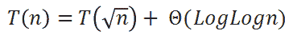
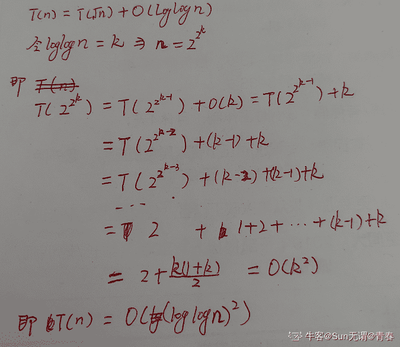
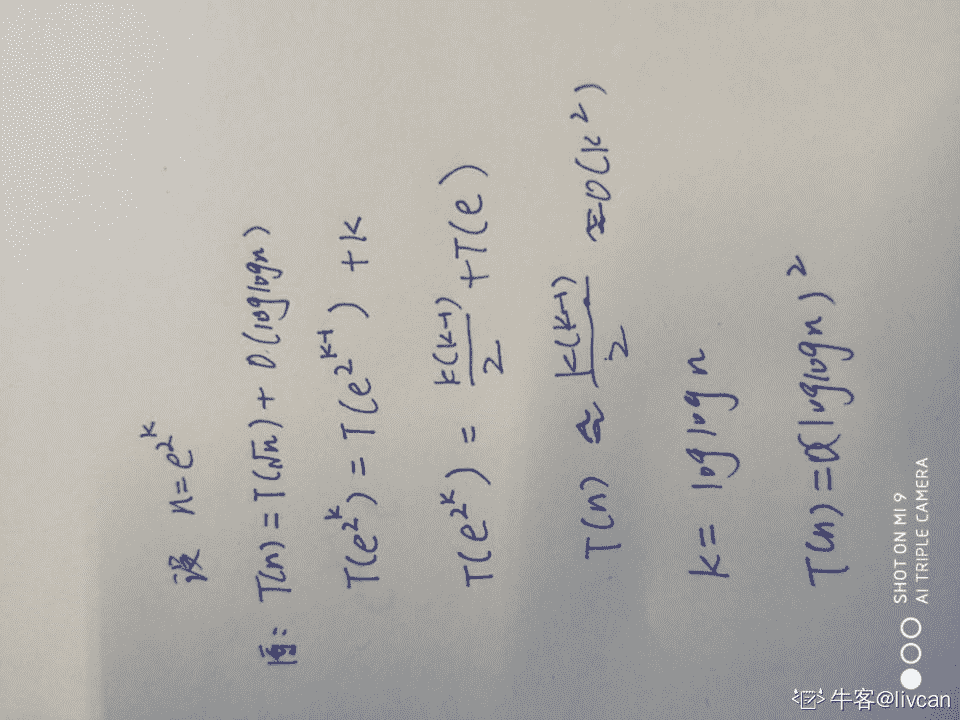
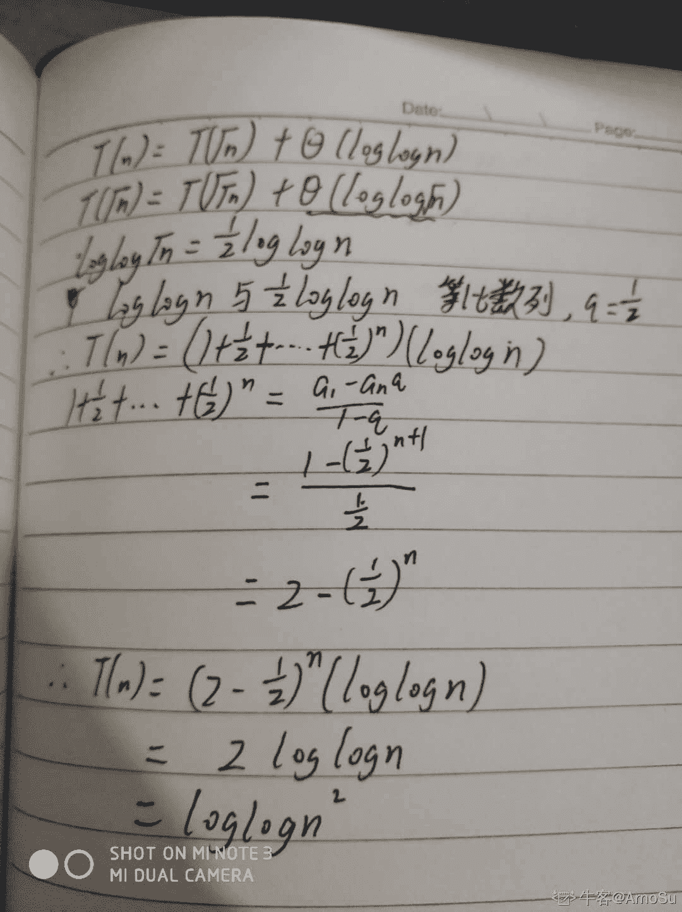
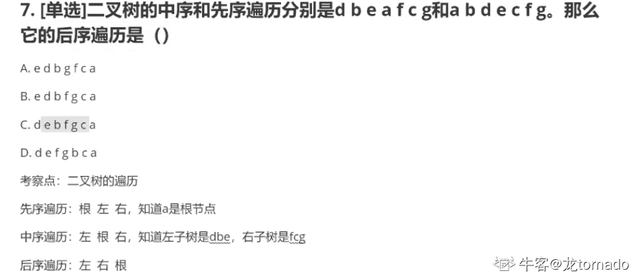
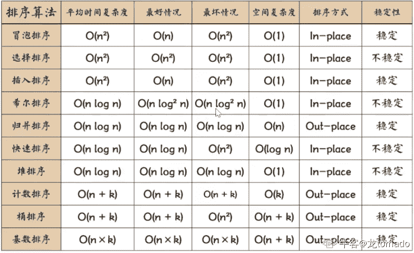

# 旷视科技 2019 实习生春招研发工程师笔试

## 1

考虑下面递归表达式：

那么（）

正确答案: A   你的答案: 空 (错误)

本题知识点

Java 工程师 C++工程师 安卓工程师 iOS 工程师 运维工程师 前端工程师 算法工程师 测试工程师 旷视 递归 PHP 工程师 2019

讨论

[Sun 无谓@青春](https://www.nowcoder.com/profile/814801115)



发表于 2020-05-17 10:51:38

* * *

[livcan](https://www.nowcoder.com/profile/396876976)



发表于 2019-09-09 22:30:34

* * *

[ArnoSu](https://www.nowcoder.com/profile/945485530)



发表于 2020-04-23 11:25:33

* * *

## 2

对于一个含 n 个元素的无序数组，构建一个大顶堆（Max-Heap），该操作的时间复杂度是？

正确答案: A   你的答案: 空 (错误)

```cpp
O(n)
```

```cpp
O(n²)
```

```cpp
O(log(n))
```

```cpp
O(nlog(n))
```

本题知识点

算法工程师 旷视 复杂度 2019

讨论

[java 狼人](https://www.nowcoder.com/profile/264003299)

初始化建堆时间复杂度是 O(n),排序重建堆时间复杂度则为 nlog(n)，觉得麻烦记住就好了，答案需要推导，详见 https://blog.csdn.net/qq_34228570/article/details/80024306

发表于 2019-11-03 13:10:15

* * *

[小六喜欢赵小刀](https://www.nowcoder.com/profile/860595925)

我咋觉得选

```cpp
O(nlog n)

```

而不是选 O(n)求大佬解答

发表于 2020-06-18 21:54:03

* * *

[不要把我当工具人](https://www.nowcoder.com/profile/531522761)

建堆有 2 种方法 1.HeapInsert: 假定我们事先不知道有多少个元素，通过不断往堆里面插入元素进行调整来构建堆。这种插入建堆的时间复杂度是 O(NlogN) 2.Heapify: 从最后一个非叶子节点一直到根结点进行堆化的调整。如果当前节点小于某个自己的孩子节点（大根堆中），那么当前节点和这个孩子交换。这种建堆的时间复杂度是 O(N)

发表于 2021-12-07 10:26:58

* * *

## 3

在 32 位机器中，假设在地址 0x100 位置存储了一个 int 值 100，那么在 0x103 地址里面存的字节值用十进制表示是 1

你的答案 (错误)

1 参考答案 (1) 4

本题知识点

Java 工程师 C++工程师 安卓工程师 iOS 工程师 运维工程师 前端工程师 算法工程师 旷视 编程基础 *编译和体系结构 PHP 工程师 测试工程师 2019* *讨论

[SHIELD--HYDRA](https://www.nowcoder.com/profile/727126424)

答案不对吧。一个内存地址里存放的数怎么也是个字节呀。int 100 换成 16 进制是 0x 00 00 00 64 大端模式是 64 00 00 00 小端模式是 00 00 00 64 怎么会答案出来一个 4，半个字节？？

发表于 2019-09-06 20:58:16

* * *

[这个 ID 没人用](https://www.nowcoder.com/profile/785032005)

大端模式：是指数据的高字节保存在内存的低地址中，而数据的低字节保存在内存的高地址中小端模式，是指数据的高字节保存在内存的高地址中，而数据的低字节保存在内存的低地址中无论是 32 位机还是 64 位机 int 都占 4 字节，int 100 写成二进制是 0110 0100，一共 8 位，所以高 24 位为 0。所以小端模式 0x103 地址存的是 0 大端模式 0x103 地址存的是 0110 0100  等于十进制 100

发表于 2020-08-14 21:04:19

* * *

[YETA](https://www.nowcoder.com/profile/3810005)

10 进制：1002 进制：0110 010016 进制：6 4 大端格式：0 0 6 4 小端格式：4 6 0 0

发表于 2019-07-24 17:40:45

* * *

## 4

三种不同的图书单价为 10 元，15 元，20 元。某学校计划恰好用 500 元购买上述图书 30 本，那么不同的购书方案有 1 种。

你的答案 (错误)

1 参考答案 (1) 11

本题知识点

Java 工程师 C++工程师 安卓工程师 iOS 工程师 运维工程师 前端工程师 算法工程师 测试工程师 旷视 数学运算 PHP 工程师 2019

讨论

[abserver](https://www.nowcoder.com/profile/252944924)

列出题目的条件(以及隐含条件):{x + y + z = 30
2x + 3Y + 4z = 100
x, y, z >= 0
}得到>>{z = 10 + x  y = 20 - 2x
x, y, z >= 0
}>>{10 + x >= 0
20 - 2x >= 0
x >= 0
}>>{0 <= x <= 10
}>>购买方案有[0, 10]共 11 种。

编辑于 2019-07-26 16:41:15

* * *

[牛客 290573605 号](https://www.nowcoder.com/profile/290573605)

进过化简，Z 的表达式为以下两种：

Z＝20-1/2y

Z＝10+x，

x,y 均大于等于零，故 Z 的取值范围为 10-20，共有 11 种

发表于 2020-03-22 12:56:11

* * *

[夸克 201810060029261](https://www.nowcoder.com/profile/764666445)

```cpp
public class Test {
        public static void main(String[] args) {
            int a=10;
            int b=15;
            int c=20;
            int cout=0;

            for (int i = 0; i <= 50; i++) {
                for (int j = 0; j < 34; j++) {
                    for (int k = 0; k <= 25; k++) {
                        if (a*i+b*j+c*k==500&&i+j+k==30){
                            cout++;
                            System.out.println("10 元："+i+" 本---"+"15 元："+j+" 本---"+"20 元："+k+" 本 "+"方案现有"+cout+"种");
                        }
                    }
                }
            }
        }

}
```

打印的结果 10 元：0 本---15 元：20 本---20 元：10 本 方案现有 1 种
10 元：1 本---15 元：18 本---20 元：11 本 方案现有 2 种
10 元：2 本---15 元：16 本---20 元：12 本 方案现有 3 种
10 元：3 本---15 元：14 本---20 元：13 本 方案现有 4 种
10 元：4 本---15 元：12 本---20 元：14 本 方案现有 5 种
10 元：5 本---15 元：10 本---20 元：15 本 方案现有 6 种
10 元：6 本---15 元：8 本---20 元：16 本 方案现有 7 种
10 元：7 本---15 元：6 本---20 元：17 本 方案现有 8 种
10 元：8 本---15 元：4 本---20 元：18 本 方案现有 9 种
10 元：9 本---15 元：2 本---20 元：19 本 方案现有 10 种
10 元：10 本---15 元：0 本---20 元：20 本 方案现有 11 种

发表于 2019-09-17 21:11:19

* * *

## 5

下列 c++程序的输出是：

```cpp
#include <iostream>
using namespace std;
int main(  )
{
    int x = 10;
    int& ref = x;
    ref = 20;
    cout << "x= " << x << endl;
    x = 30;
    cout << "ref=" << ref << endl;

```

输出结果 x =1, ref =2

你的答案 (错误)

12 参考答案 (1) 20
(2) 30

本题知识点

Java 工程师 C++工程师 安卓工程师 iOS 工程师 运维工程师 前端工程师 算法工程师 测试工程师 旷视 C++ PHP 工程师 2019

讨论

[啊啊啊，求 offer](https://www.nowcoder.com/profile/9741160)

C++中， &表示取别名，所以这里，x 和 ref 实际上操作的是同一个对象

发表于 2019-07-29 15:56:36

* * *

[零葬](https://www.nowcoder.com/profile/75718849)

&修饰变量 ref 表示其与 x 指向的是同一块内存地址，修改他们两的任意一个都会使得另一个的值发生变化

发表于 2021-02-13 17:23:23

* * *

[Chimannnn](https://www.nowcoder.com/profile/721085661)

ref 是 x 的别名，指向同一存储空间

一个修改，二者一起修改

发表于 2020-03-26 15:54:45

* * *

## 6

盒子 A 有 2 个红球和 3 个蓝球， 盒子 B 有 3 个红球和 1 个蓝球。按照以下方式选择一个球：

1） 选择一个盒子。选择盒子 A 和盒子 B 的概率分别是 1 / 3， 2 / 3

2） 从上一步选的盒子里选择一个球。该盒子里所有球被选择的概率是相等的。

如果最后选出来的球是红球，那它是从盒子 A 中选出来的概率是（）

正确答案: A   你的答案: 空 (错误)

```cpp
4 / 19
```

```cpp
5 / 19
```

```cpp
2 / 9
```

```cpp
19 / 30
```

本题知识点

Java 工程师 C++工程师 安卓工程师 iOS 工程师 运维工程师 前端工程师 算法工程师 测试工程师 旷视 概率统计 *PHP 工程师 2019 概率论与数理统计* *讨论

[我真的信赖口牙](https://www.nowcoder.com/profile/178945223)

P(A|红)=P(红|A)*P(A)/P(红）P(红|A)=2/5P(A)=1/3P(红)=1/3*2/5+2/3*3/4

发表于 2019-07-30 15:52:28

* * *

[零葬](https://www.nowcoder.com/profile/75718849)

根据条件概率公式：P(A|红)=P(红|A)*P(A)/P(红）=2/5*1/3/(2/5*1/3+3/4*2/3)=4/19

发表于 2021-02-13 17:24:36

* * *

[Labbitzy](https://www.nowcoder.com/profile/318342239)

4/19

发表于 2020-09-11 12:57:39

* * *

## 7

二叉树的中序和先序遍历分别是 d b e a f c g 和 a b d e c f g。那么它的后序遍历是（）

正确答案: C   你的答案: 空 (错误)

```cpp
e d b g f c a
```

```cpp
e d b f g c a
```

```cpp
d e b f g c a
```

```cpp
d e f g b c a
```

本题知识点

Java 工程师 C++工程师 安卓工程师 iOS 工程师 运维工程师 前端工程师 算法工程师 测试工程师 旷视 树 PHP 工程师 2019

讨论

[杨莓](https://www.nowcoder.com/profile/647763450)

先序：根 左 右

中序：左 根 右

后序：左 右 根

由先序 **a** b d e c f g ，可知根为 a

由中序 d b e **a** f c g ，可知左树为 d b e ，右树为 f c g

于是，左树的后序为 d e b ，右树的后序为 f g c

因此，这棵树的后序为

d e b f g c **a**

发表于 2019-09-05 18:13:25

* * *

[Nearme](https://www.nowcoder.com/profile/3749733)

根据先序和中序遍历可以快速判断 a 是根结点，而 f 是属于右子树的，故 D 错误，而不论先序还是后序，在遍历时，在同一双亲结点下，左子树和右子树结点的遍历顺序不变，因此 e 不可能在 d 前面，只有 C 选项符合要求

发表于 2019-09-07 22:38:38

* * *

[tornado123](https://www.nowcoder.com/profile/886762484)



发表于 2020-08-06 21:54:58

* * *

## 8

关于 C 语言中的 float，下面哪种说法正确的是 （）

正确答案: A   你的答案: 空 (错误)

```cpp
x 的二次方大于等于 0,对于 float 变量 x 总成立
```

```cpp
float 变量加法满足交换律
```

```cpp
条件 0.9f == 0.9 的值为真
```

```cpp
条件 9 == 0.9*10 的值为真
```

本题知识点

C++工程师 旷视 2019 C 语言

讨论

[InitialD_](https://www.nowcoder.com/profile/199894734)

先说结论：**A 选项正确**1、C/C++中浮点数由符号位、阶码和尾数构成，其二进制表示并不直接对应浮点数的大小，因此**浮点数类型不能进行位运算**，否则编译器报错；所以**如果 A 选项正确，其指的应该是 x 的二次幂；而不是 x 与 2 进行逐位异或**......

> 拜托题目上传者把选项写清楚，复制时正确替换 HTML 的特殊符号（即"&gt"应改为大于号">"），“x²”应该明确写成“x * x”或“x 的二次方”或其他不会导致歧义的形式。

2、 B 不一定正确。**虽然****浮点数标准****IEEE 754**满足加法和乘法的交换律，不满足加法结合律，**但是****C++标准不保证****IEEE 754 标准的实现**，于是 C++编译器也不保证浮点数 a+b 的结果等于 b+a，*具**体参见 [`stackoverflow.com/questions/24442725/is-floating-point-addition-commutative-in-c`](https://stackoverflow.com/questions/24442725/is-floating-point-addition-commutative-in-c) 以及《**深入理解计算机系统（第三版）**》2.4.5 节，浮点运算。*3、C、D 错误。浮点数存在误差，直接比较大小往往不是预期的结果；通常引入一个比要求精度还要小几个数量级的实数 epsilon 来帮助比较大小。在我的机器上，精度取 1e-8，0.9f == 0.9 为假（0.9f 是单精度浮点，精度比 0.9 低）：

```cpp
#include<cstdio>
#include<cmath> //fabs()，返回浮点数的绝对值
const double EPS = 1e-8; //1e-7
int main()
{
    //代码输出 True: 9 == 0.9*10;
    //若放宽精度至 1e-7,则两个表达式都为真
    if(fabs(0.9f - 0.9) < EPS) puts("True: 0.9f == 0.9");
    if(fabs(9 - 0.9*10) < EPS) puts("True: 9 == 0.9*10");
    return 0;
}
```

编辑于 2021-03-26 10:26:15

* * *

[Farrell](https://www.nowcoder.com/profile/666481842)

float 类型不满***换律。 比如（1e20+（-1e20））+3.14=3.14，前两项很明显得 0，所以结果为 3.14。 但如果交换顺序（1e20+（（-1e20）+3.14）），很明显后两项里 3.14 比-1e20 的绝对值小很多，后两项结果为-1e20，最终整个式子的结果为 0。 所以 float 类型不满***换律

发表于 2019-10-30 20:45:16

* * *

[刘江江](https://www.nowcoder.com/profile/1984381)

第一个什么意思啊  没看懂

发表于 2019-07-24 16:22:24

* * *

## 9

与用于将虚拟地址转换为物理地址的单级页表相比，多级页表更好是因为（）

正确答案: B   你的答案: 空 (错误)

```cpp
它减少了读取或写入内存的访问时间。
```

```cpp
它有助于减少实现进程的虚拟地址空间所需的页表大小。
```

```cpp
它是翻译后备缓冲区所必需的
```

```cpp
它有助于减少页面替换算法中的页面错误数量。
```

本题知识点

Java 工程师 C++工程师 安卓工程师 iOS 工程师 运维工程师 前端工程师 算法工程师 测试工程师 旷视 操作系统 PHP 工程师 2019

讨论

[caixiongg](https://www.nowcoder.com/profile/5433275)

多级页表在虚拟地址空间打满 4G 时，不会减少页表大小，反而会增加一个页目录（4K）空间，它的优点在于：01 不需要连续的 4M 页表空间，也就是它的页表可以是离散的页构成的 02 如果虚拟地址没有打满 4G 则可以只给使用的虚拟地址分配页表，从而可以减少页表所需空间，比如 4M 虚拟地址，只需要一个页目录+一个页表即可，共占 8k 空间，另外多级页表的不足在于内存训址时 要多一次内存访问（先访问页目录，然后访问页表拿到物理页地址，然后访问内存） 参考：http://blog.csdn.net/ibless/article/details/81275009

发表于 2020-09-18 22:39:05

* * *

[tornado123](https://www.nowcoder.com/profile/886762484)

与用于将虚拟地址转换为物理地址的单级页表相比，多级页表更好是因为 它有助于减少实现进程的虚拟地址空间所需要的页表大小。
考察点：虚拟地址转换原理，例如寻址 4G 空间，单极页表需要 4M（每块 4K，需要 1M 地址，每个地址 4B）
        多级页表可以动态索引，对 4M 空间再次建表索引，需要 4K.

发表于 2020-08-06 21:57:04

* * *

[2022 考研计算机科学与技术](https://www.nowcoder.com/profile/148719156)

典型的用空间换时间的操作，这样做虽然提高了直接访问也表的准确性，一一对应，但多级列表本身就要占空间，分级越多占用越大。

发表于 2021-01-11 10:24:13

* * *

## 10

归并排序相对于快速排序的优点不包括（）

正确答案: C   你的答案: 空 (错误)

```cpp
是稳定的
```

```cpp
最坏的情况更高效
```

```cpp
空间复杂度低
```

```cpp
不会退化
```

本题知识点

排序 *讨论

[Chrety](https://www.nowcoder.com/profile/994602167)

C
归并排序所需的额外空间为 n

发表于 2019-07-24 17:26:05

* * *

[c++新手](https://www.nowcoder.com/profile/345072514)

不会退化大概 就是快速排序会有最差的情况（初始条件已经排序好的情况下） 时间复杂度退化为 o(n²)  而归并排序不会退化 无论初始条件什么情况时间复杂度都是 0(nlogn)

发表于 2020-06-01 10:27:43

* * *

[tornado123](https://www.nowcoder.com/profile/886762484)

分享一下这张表。我觉得按照这张表，好像 B 也是错的。不过 C 最明显。

发表于 2020-08-06 21:59:07

* * *

## 11

在 TCP/IP 协议模型中，下列常用的协议，哪一个属于网络层（）

正确答案: C   你的答案: 空 (错误)

```cpp
TCP
```

```cpp
DHCP
```

```cpp
ICMP
```

```cpp
HTTP
```

本题知识点

Java 工程师 C++工程师 安卓工程师 iOS 工程师 运维工程师 前端工程师 算法工程师 测试工程师 旷视 网络基础 PHP 工程师 2019

讨论

[更爱百事可乐](https://www.nowcoder.com/profile/6586649)

TCP:传输层协议     --**传输控制协议**，传输效率低，可靠性强 DHCP:应用层协议   --**动态主机配置协议，**发现协议中的引导文件名、空终止符、属名或者空,DHCP 供应协议中的受限目录路径名 Options –可选参数字段，参考定义选择列表中的选择文件 ICMP：网络层协议 HTTP:应用层协议  --**超文本传输协议**，最基本的客户机/服务器的访问协议；浏览器向服务器发送请求，而服务器回应相应的网页

发表于 2019-07-24 20:24:53

* * *

[年少挽滑稽世无双](https://www.nowcoder.com/profile/730848335)

DHCP 属于计算机网络应用层协议

发表于 2020-05-25 23:53:11

* * *

[jackenLeu](https://www.nowcoder.com/profile/337748390)

c

发表于 2019-11-16 20:41:37

* * *

## 12

在下列操作系统给进程分配的资源中，哪些是不在进程内部的线程间共享的？（）

正确答案: B C   你的答案: 空 (错误)

```cpp
堆
```

```cpp
栈
```

```cpp
寄存器
```

```cpp
代码段
```

本题知识点

Java 工程师 C++工程师 安卓工程师 iOS 工程师 运维工程师 前端工程师 算法工程师 测试工程师 旷视 操作系统 PHP 工程师 2019

讨论

[更爱百事可乐](https://www.nowcoder.com/profile/6586649)

[`blog.csdn.net/u014558484/article/details/52550678`](https://blog.csdn.net/u014558484/article/details/52550678)**独享的资源有 a. 栈 栈是独享的 b. 寄存器 **

发表于 2019-07-24 17:21:24

* * *

[tornado123](https://www.nowcoder.com/profile/886762484)

这里的寄存器，并不是指硬件方面的，而是指软件方面的寄存器不能共享。

发表于 2020-08-06 22:00:54

* * *

[征途是一百级大牛](https://www.nowcoder.com/profile/803324974)

线程独享栈和寄存器

发表于 2021-12-23 01:14:29

* * *

## 13

C++中，关于 new 运算符的错误的描述是？（）

正确答案:   你的答案: 空 (错误)

```cpp
运算符 new 可以用来动态创建对象和对象数组
```

```cpp
使用运算符 new 创建对象时，会调用类的构造函数
```

```cpp
使用 new 运算符创建的对象使用完成后会自动销毁并回收
```

```cpp
使用运算符 new 创建对象数组时必须定义初始值
```

本题知识点

Java 工程师 C++工程师 安卓工程师 iOS 工程师 运维工程师 前端工程师 算法工程师 测试工程师 旷视 C++ PHP 工程师 2019

讨论

[牛客职导官方账号](https://www.nowcoder.com/profile/897353)

【正确答案】C D
【解析】A  查看全部)

编辑于 2021-11-18 08:46:15

* * *

[只想划水](https://www.nowcoder.com/profile/743029166)

**new 为 C++ 类对象分配内存时，将在分配内存后调用对象的构造函数。****仅当类具有默认构造函数时，new 运算符才会创建对象的数组。**

发表于 2019-08-17 20:54:06

* * *

[南浦草儿](https://www.nowcoder.com/profile/858162654)

使用 new 创建的要用 delete 回收

发表于 2020-05-19 00:18:21

* * *

## 14

在 intel CPU 上，以下多线程对 int 型变量 x 的操作，哪几个不是原子操作，假定变量的地址都是对齐的。（）

正确答案: A B C   你的答案: 空 (错误)

```cpp
x=y
```

```cpp
x++
```

```cpp
++x
```

```cpp
x=1
```

本题知识点

Java 工程师 C++工程师 安卓工程师 iOS 工程师 运维工程师 前端工程师 算法工程师 测试工程师 旷视 PHP 工程师 2019

讨论

[@君不知](https://www.nowcoder.com/profile/144257314)

D 中 1 是立即数可以直接写入，ABC 中均包含了取数写回等多个操作

发表于 2019-07-27 22:54:10

* * *

[只想划水](https://www.nowcoder.com/profile/743029166)

原子操作（Atomic operations）不可中断的一个或一系列操作。 发表于 2019-08-17 20:55:37

* * *

[tornado123](https://www.nowcoder.com/profile/886762484)

考点是原子操作，主要用于多线程开发是需要注意的问题。原子操作：不可中断的一个或者一系列的动作。例如，上面的 D.x=1 直接复制，一步到位，并不会有中断一条指令的危险； 而其他选项，例如 x=y, 这条指令需要把 y 读取，再写入 x 中，不止一步，会有中断的危险，即不是原子操作。

发表于 2020-08-06 22:04:10

* * *

## 15

在当下比较流行的分布式数据处理平台 Spark 中，有一些常用的高阶算子，比如说 flatMap, filter, groupByKey 等等；它们中的某些算子会触发 shuffle 操作，所谓 shuffle，粗略的可以理解为要处理的数据集的内部分区需要进行重排，而不是原地计算。下面哪个算子会引起 shuffle？ （）

正确答案: C D   你的答案: 空 (错误)

```cpp
map
```

```cpp
count
```

```cpp
sortByKey
```

```cpp
join
```

本题知识点

Java 工程师 C++工程师 安卓工程师 iOS 工程师 运维工程师 前端工程师 算法工程师 PHP 工程师 测试工程师 旷视 Spark 2019

讨论

[喜欢到处溜达的家伙](https://www.nowcoder.com/profile/459405568)

spark 中会导致 shuffle 操作的有以下几种算子、

1、repartition 类的操作：比如 repartition、repartitionAndSortWithinPartitions、coalesce 等
2、byKey 类的操作：比如 reduceByKey、groupByKey、sortByKey 等
3、join 类的操作：比如 join、cogroup 等

发表于 2020-08-07 21:48:22

* * *

[风尘子曰](https://www.nowcoder.com/profile/613954133)

1.repartition 类的操作：比如 repartition、repartitionAndSortWithinPartitions、coalesce 等
2.byKey 类的操作：比如 reduceByKey、groupByKey、sortByKey 等
3.join 类的操作：比如 join、cogroup 等

发表于 2020-03-13 11:03:01

* * *

[牛客 502783625 号](https://www.nowcoder.com/profile/502783625)

Count 是 action，忽略了

发表于 2021-11-08 04:45:52

* * *

## 16

给定一棵二叉树，返回其右视图列表：即从二叉树右侧看过去，从上到下每层看到的最右边的值的数组。需要实现的函数头如下：

```cpp
vector<int> rightView(TreeNode* root);
TreeNode 定义如下：
class TreeNode {
        TreeNode *left, *right;
        int val;
};
Input：[5, 6, 9, null, null, 7, 8]  （层次遍历表示法）
Output：[5, 9, 8]
```

你的答案

本题知识点

Java 工程师 C++工程师 安卓工程师 iOS 工程师 运维工程师 前端工程师 算法工程师 测试工程师 旷视 树 PHP 工程师 2019

讨论

[零葬](https://www.nowcoder.com/profile/75718849)

```cpp
private ArrayList<Integer> rightSideView(TreeNode root){
    ArrayList<Integer> viewList = new ArrayList<>();
    if(root == null) return viewList;
    Queue<TreeNode> queue = new  LinkedList<TreeNode>();
    queue.offer(root);
    while(!queue.isEmpty()){
        int queueLength = queue.size();
        for(int i = 0; i < queueLength; i++){
            TreeNode node = queue.poll();
            if(node.left != null)
                queue.offer(node.left);
            if(node.right != null)
                queue.offer(node.right);
            if(i == queueLength - 1) viewList.add(node.val);
        }
    }
    return viewList;
}
```

采用宽度优先搜索，每次保存每一层树的最后一个节点即可

发表于 2021-02-13 16:02:14

* * *

[张启明](https://www.nowcoder.com/profile/287893265)

```cpp
import java.io.BufferedReader;
import java.io.IOException;
import java.io.InputStreamReader;
import java.util.ArrayList;
import java.util.Arrays;
import java.util.LinkedList;
import java.util.Queue;
/**
这道题 因为 input 输入  所以把整套流程实现一下
*/
public class Tree<T> {
    private TreeNode<T> root ;
    public Tree(){
        this.root = null;
    }
    public Tree(T[] value){
        this.root = getTree(value);
    }
    private TreeNode<T> getTree(T[] value){
        TreeNode<T> p = new TreeNode<>(value[0]);
        TreeNode<T> q = p;
        Queue<TreeNode<T>> queue = new LinkedList<TreeNode<T>>();
        int i=0;
        while (p!=null){
            if(2*i+1<value.length){
                p.left = new TreeNode<>(value[2*i+1]);
                queue.add(p.left);
            }
            if (2*i+2<value.length){
                 p.right = new TreeNode<>(value[2*i+2]);
                queue.add(p.right);
            }
            p = queue.poll();
            i+=1;
        }
        return q;
    }

    /**
     * 层次遍历
     */
    public void getSort(TreeNode<T> p){
        Queue<TreeNode<T>> queue = new LinkedList<TreeNode<T>>();
        while (p!=null){
            System.out.print(p.getValue().toString()+" ");
            if(p.left!=null){
                queue.add(p.left);
            }
            if(p.right!=null){
                queue.add(p.right);
            }
            p = queue.poll();
        }

    }
/**
关键目标函数  也是使用层次遍历的思想  遍历的第 1/3/7/15....2N-1 项即为目标

*/
    public ArrayList getSolution(TreeNode<T> p){
        Queue<TreeNode<T>> queue = new LinkedList<TreeNode<T>>();
        ArrayList list = new ArrayList();
        int i=1;
        while (p!=null){
            if(isG(i)){
                list.add(p.getValue());
            }
            i++;
            if(p.left!=null){
                queue.add(p.left);
            }
            if(p.right!=null){
                queue.add(p.right);
            }
            p = queue.poll();
        }
        return list;
    }
    /*判断  如果是层次遍历的话  遍历的第 1/3/7/15....2N-1 项即为目标，这里判断 i 是否符合*/
    private static int n =2;
    public static boolean isG(int i){
            if(i==n-1&&i!=0){
                n=n*2;
                return true;
            }else
                return false;
    }
    public static void main(String[] args) throws IOException {
        BufferedReader bf = new BufferedReader(new InputStreamReader(System.in));
        String str = bf.readLine();
        bf.close();
        String[] value = str.substring(1,str.length()-1).split("\\,");
       // System.out.println(Arrays.toString(value));
        Tree<String> tree = new Tree<String>(value);
        //tree.getSort(tree.root);
        //System.out.println();
        System.out.println(tree.getSolution(tree.root).toString());
       // for(int i=0;i<10;i++){
        //    if(isG(i)){
         //       System.out.println(i);
         //  }
        //}
    }
}

```

编辑于 2019-08-10 20:05:22

* * *

[张云超](https://www.nowcoder.com/profile/3386783)

```cpp
public class RightView {
    List<Integer> list = new ArrayList<>();
    private int[] recurse(Node root) {    
        if (root == null) {
            return switchIntArray(list);
        }
        list.add(root.val);
        if (root.right != null) {
            return recurse(root.right);
        } else if (root.left != null) {
            return recurse(root.left);
        } else {
            return switchIntArray(list);
        }
    }
    class Node{
        Node left,right;
        int val;
        Node(int val) {
            this.val = val;
        }
    }
    private int[] switchIntArray(List<Integer> list) {
        int[] array = new int[list.size()];
        for(int i = 0;i<list.size();i++){
            array[i] = list.get(i);
        }
        return array;
    }
}

```

发表于 2019-08-08 20:21:02

* * *

## 17

给定一个非负整数组，给出乘积和小于 K 的子串数目。

```cpp
Input : [1, 2, 3, 4]
          k = 10
Output :11
The subsequences are {1}, {2}, {3}, {4},
{1, 2}, {1, 3}, {1, 4}, {2, 3}, {2, 4},
{1, 2, 3}, {1, 2, 4}

Input  : [4, 8, 7, 2]
      k = 50
Output : 9
```

你的答案

本题知识点

Java 工程师 C++工程师 安卓工程师 iOS 工程师 运维工程师 前端工程师 算法工程师 测试工程师 旷视 C++ PHP 工程师 2019

讨论

[哟，我喜欢](https://www.nowcoder.com/profile/8095403)

01 背包

```cpp
//dp[i] 表示积为 i 的组合有 dp[i]个
vector<int> dp(k, 0); dp[1]=1;
bool flag=0;
for (int i = 0; i < n; i++) {
    // 先不考虑 1
    if(data[i]==1) {
        flag = 1;
        continue;
    }
    for (int j = k-1; j>0; j--) {
        if (dp[j] > 0 && j * data[i] < k ) {
            dp[j * data[i]] += dp[j];
        }
    }
}   
int res = accumulate(dp.begin()+2, dp.end(), 0); 
if(flag) // 如果有 1
    res = 2*res+1;
```

发表于 2019-08-06 17:27:00

* * *

[YETA](https://www.nowcoder.com/profile/3810005)

```cpp
public class Main {   public static int getNumberOfMultiplySmallerThanK(int[] array, int k, int index, int multiply) {  //递归退出条件  if (index >= array.length) {  return multiply < k ? 1 : 0;  }   //索引为 index 的数要  return getNumberOfMultiplySmallerThanK(array, k, index + 1, multiply * array[index]) + //索引为 index 的数不要  getNumberOfMultiplySmallerThanK(array, k, index + 1, multiply);  }   public static void main(String[] args) {  System.out.println(getNumberOfMultiplySmallerThanK(new int[]{1, 2, 3, 4}, 10, 0, 1) - 1);  System.out.println(getNumberOfMultiplySmallerThanK(new int[]{4, 8, 7, 2}, 50, 0, 1) - 1);  } }
```

发表于 2019-07-24 17:01:55

* * *

[胡洪滔](https://www.nowcoder.com/profile/246538303)

```cpp
import itertools
a=input()
b=input()
a=list(a)
count=0 lt=[] for j in range(len(a)):
    l=j+1  for i in itertools.combinations(a,l):
        lt.append(i) for i in lt:
    y = 1  for k in i:
            y=1*y*int(k) if y<b:
            count=count+1 print count
```

编辑于 2019-10-09 15:32:29

* * ****