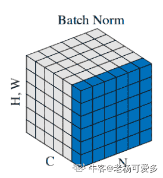

# 旷视科技 2019 实习生春招算法研究员笔试（线下）

## 1

下列容器中，哪些容器按 key 查找的复杂度为 O(log(n)) ?

正确答案: B C   你的答案: 空 (错误)

```cpp
std::unordered_set
```

```cpp
std::multimap
```

```cpp
std::map
```

```cpp
std::deque
```

本题知识点

算法工程师 旷视 复杂度 2019 C++

讨论

[秋招加油 o](https://www.nowcoder.com/profile/890968755)

STL 库中，map 和 multimap 底层都是红黑树实现的，两者的不同在于 multimap 允许重复的可以，而 map 中不行。红黑树的查找复杂度为 O(log(n))unodered_map/_set 底层是哈希表实现的，查找复杂度为 O(1)

发表于 2019-09-06 15:19:43

* * *

[牛客 257569856 号](https://www.nowcoder.com/profile/257569856)

为什么 java 里面有你呀🙃

发表于 2020-04-30 12:19:21

* * *

[IDEA2022.4.2](https://www.nowcoder.com/profile/181223548)

第一反应这是顺丰的题，这次打脸了🙄

发表于 2019-09-01 16:10:50

* * *

## 2

现有一 1920*1080 的单通道图像，每个像素用 float32 存储，对其进行 4 个 3*3 核的卷积(无 padding)，卷积核如下：

```cpp
1 1 1 1 1 0 0 1 1 0 1 0
1 0 1 1 1 1 1 1 1 1 1 1
1 1 1 0 1 1 1 1 0 0 1 0
```

若原图像由于量化问题出现了 100 个 INFINITY，而其他的值都在(-1,1)区间内，则卷积的结果至少有多少个 NaN?（）

正确答案: B   你的答案: 空 (错误)

```cpp
256
```

```cpp
284
```

```cpp
296
```

```cpp
324
```

本题知识点

算法工程师 旷视 深度学习 2019

讨论

[十七安画生](https://www.nowcoder.com/profile/9347442)


因为 INFINITY 与 0 相乘为 NaN，与除了乘以 0 以外的任何四则运算，得到的结果仍然是 INFINITY。题目问的是至少有多少个，那么我们就考虑 nan 最少的情况下的 INFINITY 分布位置，如图所示。
第一个卷积核的 4 条边都不为 0，因此 nan 的个数为 0 第二个卷积核有两个对称的角为 0，因此一个（（10+11）+（13+12））* 2 = 92 第三个与第二个相同为 92 个第四个卷积核的 4 个角都为 0，因此 0 会与所有的数相乘，相当于从上到下，从左到右，都会被 0 扫描一遍，因此 25*4=1000+92+92+100=284 个

编辑于 2020-04-18 14:30:17

* * *

[NightmareVoid](https://www.nowcoder.com/profile/931222577)

这题有点无语。。。。出现这种情况不都是首先调整预处理方法消除 inf 嘛

发表于 2020-07-21 18:41:26

* * *

[菜🐔本🐔](https://www.nowcoder.com/profile/187429530)

都不知道你们在说个啥

发表于 2020-04-18 19:21:06

* * *

## 3

BatchNorm 层对于 input batch 会统计出 mean 和 variance 用于计算 EMA。如果 input batch 的 shape 为(B, C, H, W)，统计出的 mean 和 variance 的 shape 为: （）

正确答案: B   你的答案: 空 (错误)

```cpp
B * 1 * 1 * 1
```

```cpp
1 * C * 1 * 1
```

```cpp
B * C * 1 * 1
```

```cpp
1 * 1 * 1 * 1
```

本题知识点

算法工程师 旷视 深度学习 2019

讨论

[牛客 926566 号](https://www.nowcoder.com/profile/926566)

B 代表图像的 batch，即多少张图像一个 batch。C 代表图像的通道数。
BN 是对多张图像的同一通道做 Normalization
所以有多少通道就有多少个 mean 和 variance

发表于 2019-07-27 15:35:08

* * *

[努力找到工作，保持积极乐观](https://www.nowcoder.com/profile/753849801)

先看一下卷积实现原理，对于 in_c 个通道的输入图，如果需要经过卷积后输出 out_c 个通道图，那么总共需要 in_c * out_c 个卷积核参与运算。参考下图：BN 层的目的本就是用于归一化，所以显而易见要保证通道数 C 不变，其余长宽为 0

发表于 2019-07-26 13:42:36

* * *

[老杨可爱多](https://www.nowcoder.com/profile/218884031)

BN 相当于将图像中的 H,W,N（batchsize）归一化成一维的立方体

发表于 2021-07-02 09:33:49

* * *

## 4

可以解决 Overfitting 的方法（）

正确答案: A B D   你的答案: 空 (错误)

```cpp
Dropout
```

```cpp
BatchNorm
```

```cpp
增加模型参数量
```

```cpp
增加数据量
```

本题知识点

算法工程师 旷视 2019

讨论

[努力找到工作，保持积极乐观](https://www.nowcoder.com/profile/753849801)

**判断方法**
过拟合（over-fitting），机器学习模型或者是深度学习模型在训练样本中表现得过于优越，导致在验证数据集以及测试数据集中表现不佳。出现这种现象的主要原因是训练数据中存在噪音或者训练数据太少。
过拟合问题，根本的原因则是特征维度(或参数)过多，导致拟合的函数完美的经过训练集，但是对新数据的预测结果则较差。
**常见原因**
1）建模样本选取有误，如样本数量太少，选样方法错误，样本标签错误等，导致选取的样本数据不足以代表预定的分类规则；
2）样本噪音干扰过大，使得机器将部分噪音认为是特征从而扰乱了预设的分类规则；
3）假设的模型无法合理存在，或者说是假设成立的条件实际并不成立；
4）参数太多，模型复杂度过高；
5）对于决策树模型，如果我们对于其生长没有合理的限制，其自由生长有可能使节点只包含单纯的事件数据(event)或非事件数据(no event)，使其虽然可以完美匹配（拟合）训练数据，但是无法适应其他数据集。
6）对于神经网络模型：
a)对样本数据可能存在分类决策面不唯一，随着学习的进行,，BP 算法使权值可能收敛过于复杂的决策面；
b)权值学习迭代次数足够多(Overtraining)，拟合了训练数据中的噪声和训练样例中没有代表性的特征。**解决方法**
1）在神经网络模型中，可使用权值衰减的方法，即每次迭代过程中以某个小因子降低每个权值。
2）**提前终止迭代训练**：选取合适的停止训练标准，使对机器的训练在合适的程度；
3）**保留验证数据集，对训练成果进行验证**；
4）**获取额外数据进行交叉验证**；
5）**正则化**，即在进行目标函数或代价函数优化时，在目标函数或代价函数。如 L1L2 正则化，Batch Normalization 正则化 6）**Bagging 和 Boosting  **Bagging 和 Boosting 是机器学习中的集成方法，多个模型的组合可以弱化每个模型中的异常点的影响，保留模型之间的通性，弱化单个模型的特性。7) **增加噪声 **这也是深度学习中的一种避免过拟合的方法（没办法，深度学习模型太复杂，容易过拟合），添加噪声的途径有很多，可以在输入数据上添加，增大数据的多样性，可以在权值上添加噪声，这种方法类似于 L2 正则化。8)**权值共享  **权值共享最常见的就是在卷积神经网络中，权值共享的目的旨在减小模型中的参数，同时还能较少计算量。在循环神经网络中也用到了权值共享

发表于 2019-07-26 13:57:08

* * *

## 5

ResNet-50 有多少个卷积层? （）

正确答案: B   你的答案: 空 (错误)

```cpp
48
```

```cpp
49
```

```cpp
50
```

```cpp
51
```

本题知识点

算法工程师 旷视 深度学习 2019

讨论

[Triumph20190804135270](https://www.nowcoder.com/profile/88191642)

ResNet-50 就是因为它有 50 层网络，这 50 层里只有一个全连接层，剩下的都是卷积层，所以是 50-1=49

发表于 2019-09-08 09:21:48

* * *

[如果没有人看着我那该多快乐](https://www.nowcoder.com/profile/569308407)

resnet-34 和 resnet-50 都是有四组 block，每组分别是 3 4 6 3 个 block，resnet-34 的每个 block 里面有两个卷积层，resnet-50 的每个 block 里面有三个，另外这两个网络的最开始都有一个单独的卷积层（3+4+6+3）*3+1=49 

发表于 2019-07-30 17:46:27

* * *

## 6

给定一个卷积层 C in * C out * H k * W k  (H k * W k 为 kernel shape), output feature  map shape 为 H * W，其 FLOPs 为 1，参数量为 2 (1 乘累加 = 2 FLOPs)

你的答案 (错误)

12 参考答案 (1) FLOPs = 2 * (C in * H k * W k + 1) * C out * H * W
(2) Params = (C in * H k * W k + 1) * C out

本题知识点

算法工程师 旷视 深度学习 2019

讨论

[许涛 201905111335535](https://www.nowcoder.com/profile/497838463)

考虑 basie 后的 FLOPs 应该是 2 * (C in * H k * W k ) * C out * H * W 吧

发表于 2019-07-30 18:41:02

* * *

[努力找到工作，保持积极乐观](https://www.nowcoder.com/profile/753849801)

[`blog.csdn.net/sinat_34460960/article/details/84779219`](https://blog.csdn.net/sinat_34460960/article/details/84779219)
[`blog.csdn.net/wweiainn/article/details/80231792`](https://blog.csdn.net/wweiainn/article/details/80231792)

编辑于 2019-07-26 14:34:26

* * *

[AksIrving](https://www.nowcoder.com/profile/113217524)

[`zhuanlan.zhihu.com/p/144938518`](https://zhuanlan.zhihu.com/p/144938518)

发表于 2020-07-27 15:41:59

* * *

## 7

以下程序的时间复杂度为 1

```cpp
for (i = 1; i <= n; ++i) {
    for (j = 1; j <= i; ++j) {
        x = 0;
        for (k = 1; k <= n; ++k) {
            x += a * b;
        }
    }
}
```

你的答案 (错误)

1 参考答案 (1) O(n³)

本题知识点

算法工程师 旷视 复杂度 2019

讨论

[Chrety](https://www.nowcoder.com/profile/994602167)

3 个从一到 n 的 for 循环，

发表于 2019-07-24 17:12:21

* * *

[会飞的地鼠](https://www.nowcoder.com/profile/654568914)

n+2n+3n......n*n， 共 n(n+n²)/2，取最高项得到 O(n³)。

发表于 2019-09-08 22:22:58

* * *

[Leon73_](https://www.nowcoder.com/profile/591335363)

n*(1*n+2*n+...+n*n)=n*[n(n+n*n)/2]=O(n³)

发表于 2020-08-10 14:35:12

* * *

## 8

YUV420 是一种不同于 RGB 的图像存储方式，每个像素由 Y,U,V 三个值描述，它与 RGB 的对应关系如下：

```cpp
Y = 0.299*R + 0.587*G + 0.114*B
U = (B-Y)/1.772
V = (R-Y)/1.402
```

每个像素的 Y 值都会被存储，而 U 和 V 会进行一次 2*2 的采样，即每组 2*2 的四个像素使用同一个 U 值和 V 值。存储时，所有的 Y 值会被行优先存储，然后所有的 U 值会被行优先存储，然后所有的 V 值会被行优先存储，最终连接成为一段数据段。令 data[i]表示被存储到第 i 个值(从 0 开始编号)，现在我们想获取一个 720*1280 图像的 523 行 1177 列(行和列从 0 开始编号)的 G 像素值请 用 data 写 出 这 个 值 的 表 达 式 ( 系 数 保 留 4 位 小数)1

你的答案 (错误)

1 参考答案 (1) 标 准 答 案 1( 直 接 计 算 ) ： data[670617]-0.3441*data[1089228]- 0.7141*data[1319628] ；标 准 答 案 2( 背 的 系 数 ) ： data[670617]-0.3455*data[1089228]- 0.7169*data[1319628]

本题知识点

算法工程师 旷视 2019

讨论

[如果没有人看着我那该多快乐](https://www.nowcoder.com/profile/569308407)

由转换式子可以得出
可以算出 G 对于 Y U V 的系数 1 0.3441  0.7141 最主要的是 Y U V 的数值位置，Y 的矩阵是相同大小，所以位置为  1280*523+1177=670617Y 矩阵的最后一个一个值位置为 1280*720=921600U 和 V 都是 2*2 采样，长宽为原图的一半，所以 U 的位置为   921600+640*261+588=1089228 同样方法算出 V 的位置  1319628

发表于 2019-07-30 18:19:59

* * *

[大乐乐天](https://www.nowcoder.com/profile/621592459)

U 和 V 都是 2*2 采样，长宽不是应该为原图的 1/4 吗

发表于 2019-08-12 23:35:31

* * *

[晨海 201907281448400](https://www.nowcoder.com/profile/806321829)

为什么计算 Y 的时候不是 1280*522+1177 呢？那个像素处在第 523 行，计算存储的的时候应该是 522 行加上自己所处的列数的偏移量啊？因为从 0 开始编号还需要减一，Y 的矩阵是相同大小，所以位置为  1280*522+1177-1=669336Y 矩阵的最后一个一个值位置为 1280*720-1=921600 -1U 和 V 都是 2*2 采样，长宽为原图的一半，所以 U 的位置为   921600+640*261+向上取整（1177/2）-1=1089228 同样方法算出 V 的位置 

编辑于 2019-08-06 21:31:28

* * *

## 9

某摄像机分辨率为 1920*1080，在室内环境中被架设在 5m 高的展台顶部，视角稍向下进行摄影，若最远处（距离相机关于地面垂足约 30m）的安全出口在视频中大约高 200 像素，则该场景下能够拍到的人的正脸高度范围大约是 1 像素(填写大致区间)

你的答案 (错误)

1 参考答案 (1) 20~300 像素

本题知识点

算法工程师 旷视 2019

讨论

[努力找到工作，保持积极乐观](https://www.nowcoder.com/profile/753849801)

先计算人脸大概 18.5cm * 20cm=370[平方厘米](https://www.baidu.com/s?wd=%E5%B9%B3%E6%96%B9%E5%8E%98%E7%B1%B3&tn=SE_PcZhidaonwhc_ngpagmjz&rsv_dl=gh_pc_zhidao)指示牌大概有

1.359*149*23mm

2、355*145*23mm

3、360*145*25mm

4、238*266*45mm 按比例算，没有标准答案这个

发表于 2019-07-26 14:55:07

* * *

## 10

IEEE754 规定规约型单精度浮点数由 1 位符号位，8 位指数值和 23 位分数值构成。指数偏移值为 127，分数值默认整数部分为 1，只存储小数部分。例：十进制浮点数-12.5,转换为二进制为(-1100.1)2=(-1.1001)2×2³，符号位为 1，指数值为 3+127=130=0x82，分数值为 0x480000，连接后存储为 0xC1480000；问十进制浮点数 52.625 和十进制浮点数 526.25 进行按位或操作得到的十进制浮点数是 1

你的答案 (错误)

1 参考答案 (1) 13540

本题知识点

算法工程师 旷视 2019

讨论

[权御天下 201809202026962](https://www.nowcoder.com/profile/650502590)

先解释一下连接的过程.以题目所给例子，连接过程如下：————————————————————————————————————符号(1 bit)  指数(8 bit)              分数(23 bit,16 进制在最高位补 0)1(负号)       1000,0010(0x82)   (0)100,1000,0000,0000,0000,0000(0x480000)合起来就是 1100,0001,0100,1000,0000,0000,0000,0000 化成 16 进制就是 0xC148————————————————————————————————————（1）按照题意，52.625 换成浮点编码过程如下，末尾的 0 此处省略，为了看得更清楚，小数点用*表示：先化成二进制 110100*101  去掉最高位（即整数位的 1）得到其指数是 5,加上偏移量（5+127）得 132，对应的 2 进制表示为 1000,0100(0x84) 同样后面的分数部分(0)101,0010,1000(0x528)————————————————————————————————————符号(1 bit)  指数(8 bit)              分数(23 bit,16 进制在最高位补 0)0(正号)       1000,0100(0x84)   (0)101,0010,1000,0000,0000,0000(0x528000)将其连接起来就是 0100,0010,0101,0010,1000,0000,0000,0000(0x42528000)
————————————————————————————————————（2）同上，526.25 的浮点二进制编码如下————————————————————————————————————符号(1 bit)  指数(8 bit)              分数(23 bit,16 进制在最高位补 0)0(正号)       1000,1000(0x88)   (0)000,0011,1001,0000,0000,0000(0x528000)将其连接起来就是 0100,0100,0000,0011,1001,0000,0000,0000(0x44039000)————————————————————————————————————（3）将两个 2 进制编码按位或运算 0100,0010,0101,0010,1000,0000,0000,0000 0100,0100,0000,0011,1001,0000,0000,0000 —————————————————————0100,0110,0101,0011,1001,0000,0000,0000（4）反向将 2 进制编码换成 10 进制数符号(1 bit)  指数(8 bit)              分数(23 bit,16 进制在最高位补 0)
0                 1000,1100            ()101,0011,1001,0000,0000,0000 0 代表正数，1000,1100(2)-127(10)=13 指数是 13，接下来将分数部分还原。先将分数分成前 13 位和后 10 位，则前 13 位为去掉最高位 1 的整数部分，后 10 位为小数部分 1,0100,1110,0100*0000,0000,00 然后将最高位的 1 补上，最后转换成 10 进制就得到最终结果 1354011,0100,1110,0100*0000,0000,00 ————————————————8192+4096+1024+128+64+32+4=13540

发表于 2019-08-07 16:27:37

* * *

## 11

编写程序，求 n 个节点的二叉树有多少种形态。

你的答案

本题知识点

算法工程师 旷视 树 2019

讨论

[努力找到工作，保持积极乐观](https://www.nowcoder.com/profile/753849801)

```cpp
#include<stdio.h>
void main()
{
    long long f[];
    f[0]=1;
    f[1]=1;
    for(int i=2;i<n;i++)
        {
        f[i]=0;
        for(j=1;j<i;j++)
            {
                f[i]+=f[j-1]*f[i-j];
             }
                                                                                                                                                                                     [
        }
}
```

发表于 2019-07-26 11:14:34

* * *

[零葬](https://www.nowcoder.com/profile/75718849)

利用数学定义计算卡特兰数

```cpp
class Solution {
    public int numTrees(int n) {
        long C = 1;
        for(int i = 1; i < n; i++)
            C = C*2*(2*i + 1)/(i + 2);
        return (int)C;
    }
}
```

发表于 2020-10-26 10:06:24

* * *

[ZarekVane](https://www.nowcoder.com/profile/303379339)

```cpp
#include <stdio.h>
#define N 51
int main()
{
    long long dp[N];
    int n;
    scanf("%d", &n);

    dp[0] = dp[1] = 1;
    for (int i = 2; i <= n; ++i)
    {
        dp[i] = 0;
        for (int j = 0; j <= i; ++j)
        {
            dp[i] += dp[j] * dp[i - j - 1];
        }
    }

    printf("%d\n", dp[n]);
    return 0;
}

```

编辑于 2019-12-30 22:48:25

* * *

## 12

给定一个卷积层 C in * C out * H k * W k，  以及输入 feature map C in * H * W，我们希望将该卷积操作转化为一次矩阵乘，以便使用一些矩阵计算优化策略，请设计转换方法。

你的答案

本题知识点

算法工程师 旷视 2019

讨论

[努力找到工作，保持积极乐观](https://www.nowcoder.com/profile/753849801)

| 123 | img2colMat A: (H * W) * (C in *  H k * W k ）Mat B: (C in *  H k * W k ）* (C out ) |

发表于 2019-07-26 14:56:09

* * *