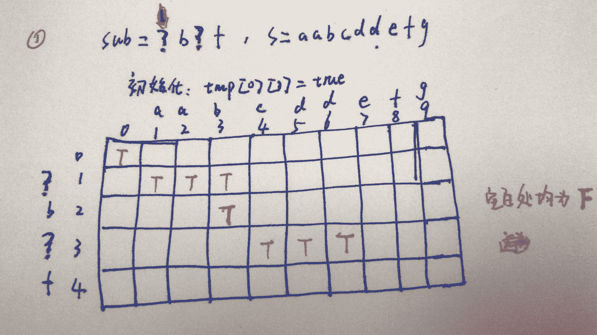
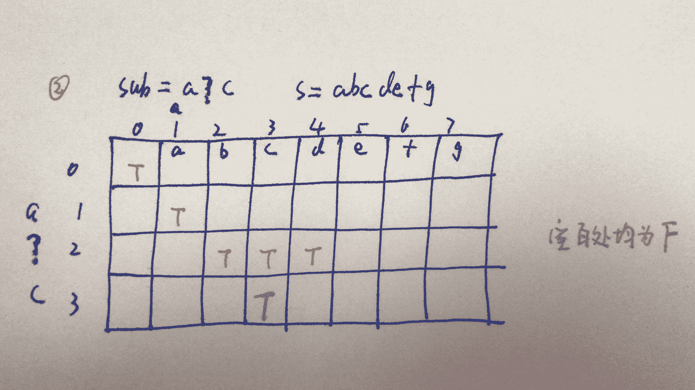

# 深信服 2019 春招技术岗部分编程题汇总

## 1

从字符串 string 开始完整匹配子串 sub，返回匹配到的字符个数。

sub 中如果出现'?'表示可以匹配一到三个除'\0'以外的任意字符。
如果 sub 还有找不到匹配的字符，则说明不能完整匹配。

如果能完整匹配，返回匹配到的字符个数，如果有多种匹配方式，返回匹配字符数最少的那个，如果不能完整匹配，返回-1

本题知识点

Java 工程师 C++工程师 安卓工程师 iOS 工程师 运维工程师 前端工程师 算法工程师 PHP 工程师 测试工程师 深信服

讨论

[Stubb](https://www.nowcoder.com/profile/44965266)

我这里用动态规划说一下思路吧
一下两张表分别是匹配不成功和成功的 dp 表



由图片可知道，如果匹配成功那么最后一行肯定存在 true。（很容易理解，如果匹配成功那么 sub 肯定匹配到了最后一个字符(即最后一行)，那么最后一行肯定存在 true）。因此只需要从头到尾遍历最后一行，如果遇到了第一个 true，那么对应的 j 值就是最短的匹配字符长度。如果要求最大匹配长度。最后一行从后往前遍历，遇到的第一个等于 true 的 j 值就是最大长度。
至于如何匹配，那就对应代码看就好了、下面附上代码

```cpp
import java.util.Scanner;
public class Main {

    public static void main(String[] args) {
        Scanner sc = new Scanner(System.in);
        while (sc.hasNext()) {
            String s = sc.next();
            String sub = sc.next();
            int num[]=new int[1];
            if (isMatch(s, sub,num)) {
                System.out.println(num[0]);
            } else {
                System.out.println("-1");
            }
        }
    }

    public static Boolean isMatch(String s, String sub,int num[]) {
        boolean tmp[][]=new boolean[sub.length()+1][s.length()+1];
        tmp[0][0]=true;
        for (int i = 1; i < tmp.length; i++) {
            int index=0;
            if (sub.charAt(i-1)=='?') {
                index=3;
            }
            for (int j = i; j < tmp[0].length; j++) {
                if (index>0) {
                    if (s.charAt(j-1)!='\u0000' && (tmp[i-1][j-1]||tmp[i][j-1])) {
                        tmp[i][j]=true;
                        index--;
                    }else if (s.charAt(j-1)=='\u0000') {
                        tmp[i][j]=false;
                        index=0;    
                    } 
                }
                else {
                    if (s.charAt(j-1)==sub.charAt(i-1)) {
                        tmp[i][j]=tmp[i-1][j-1];
                    }
                    else {
                        tmp[i][j]=false;
                    }
                }
            }
        }
        for (int i = 0; i < tmp.length; i++) {
            for (int j = 0; j < tmp[0].length; j++) {
                System.out.print(tmp[i][j]+" ");
            }
            System.out.println();
        }

        int len=tmp.length-1;
        for (int j = 1; j < tmp[0].length; j++) {
            if (tmp[len][j]==true) {
                num[0]=j;
                return true;
            }
        }
        return false;
    }
}
```

发表于 2019-08-09 18:06:14

* * *

[七月呀呀呀](https://www.nowcoder.com/profile/935024408)

#include <iostream>using namespace std;

string s1,s2;
int len1,len2;
int fun(int index1,int index2)
{
    while(index1<len1&&index2<len2)
    {
        if(s2[index2]!='?'&&s1[index1]!=s2[index2])
            return -1;

        if(index1-index2>3)
            return -1;
        if(s1[index1]==s2[index2])
        {
            index1++;
            index2++;
            continue;
        }
        if(s2[index2]=='?'&&s1[index1]!='\0')
        {
            if(s1[index1+1]==s2[index2+1])
            {
                int temp=0;

                if((temp=fun(index1+1,index2+1))!=-1)
                {
                    return temp;
                }
                else
                {
                    index1++;
                }
            }
            else
                index1++;
        }
    }
    if(index2!=len2)
    {
        return -1;
    }
    else
    {
        return index1;
    }

}
int main()
{
    cin>>s1>>s2;
    len1=s1.length();
    len2=s2.length();
    if(len1==0||len2==0)
    {
        cout<<0<<endl;
        return 0;
    }
    cout<<fun(0,0)<<endl;
    //getchar();
    return 0;
}

发表于 2019-07-30 13:53:25

* * *

[wengmq](https://www.nowcoder.com/profile/766769871)

#include <iostream>#include<cstring>
using namespace std;

int func(char*str , char* sub)
{
    int i=0,j=0;//i j 分别用来表示 str、sub 比较时的下标 
    int x = 0; //x 用来表示？已经代替的字符个数 
    int count = 0;//count 表示满足的字符个数

    while(i<strlen(str) && j<strlen(sub))
    {
        if(str[i] == sub[j])
        {
            i++;
            j++;
            count++;
            x = 0;
        }

        else if(sub[j] != '?')
            break;

        else    //sub[j] = '?'
        {
            while(str[i] != sub[j] && x<3)  
            {
                i++;
                if(!x) j++; //第一次 x=0 时，sub 的下标也向后移动一个 
                x++;
                count++;
            }
            x=0;
        }
    }

    if(j == strlen(sub))
        return count;
    else 
        return -1;
}

int main()
{
    char str[1005];
    char sub[105];
    cin>>str>>sub;
    cout<<func(str,sub);
    return 0;

}

发表于 2020-02-13 00:48:40

* * *

## 2

有 K 种颜色的小球(K<=10)，每种小球有若干个，总数小于 100 个。
现在有一个小盒子，能放 N 个小球(N<=8)，现在要从这些小球里挑出 N 个小球，放满盒子。
想知道有哪些挑选方式。注：每种颜色的小球之间没有差别。

请按数字递增顺序输出挑选小球的所有方式。

如有 3 种颜色，每种颜色小球的个数分别为 a:1,b:2,c:3，挑出 3 个小球的挑法有：
003,012,021,102,111,120

本题知识点

Java 工程师 C++工程师 安卓工程师 iOS 工程师 运维工程师 前端工程师 算法工程师 PHP 工程师 测试工程师 深信服

讨论

[Moveon!](https://www.nowcoder.com/profile/190068140)

经过调试终于得到 100 分！通过数组实现存储取球情况，刚开始提交代码 70 分内存过载，后来将代码中的多余情况排除掉后所有测试案例通过！

```cpp
#include <iostream>
#include<vector>
#include<numeric>
using namespace std;
struct node{
	int num;
	vector<vector<int> > v;
};
int main(){
	int K, N,Ki;
	cin >> K >> N;
	vector<node> ball(K);
	for(int i=0;i<K;i++){
		node p;
		cin>>Ki;
		ball[i].num=Ki;
	}
	if(K==1) cout<<N<<endl;
	else {
		vector<int> tmpv;
		for(int i=0;i<=ball[0].num;i++)	{
			tmpv.push_back(i);
			ball[0].v.push_back(tmpv);
			tmpv.clear();
		}
		for(int i=1;i<K;i++){	
			for(int j=0;j<ball[i-1].v.size();j++){
				for(int k=0;k<=ball[i].num;k++){
					tmpv=ball[i-1].v[j];
					tmpv.push_back(k);
					if(i==K-1){
						if(accumulate(tmpv.begin(),tmpv.end(),0)==N){
							for(int l=0;l<tmpv.size();l++) cout<<tmpv[l];
							cout<<endl;
						}
					}
					else {
						if(accumulate(tmpv.begin(),tmpv.end(),0)<=N) ball[i].v.push_back(tmpv);
					}
					tmpv.clear();
				}
			}
		}
	}
}
```

编辑于 2019-09-17 00:53:54

* * *

[牛客 779592784 号](https://www.nowcoder.com/profile/779592784)

C++递归  100%通过

```cpp
#include<iostream>
(720)#include<string>
#include<iomanip>
using namespace std;
int box[10];
int kind, sum;
void jisuan(int num,int box_id,long long X)
{
    long long  M = 1;
    if (num == 0)
    {
        return;
    }
    for (int q = 0; q < (kind - box_id) - 1; q++)
    {
        M = M * 10;
    }
    for (int i = 0; i <= box[box_id]; i++)
    {
        if (num == i)
        {
            cout << setfill('0') << setw(kind) << *right<< X + i * M<<endl;
        }
        if (i < num)
        {
            if (box_id != kind - 1)
            jisuan(num - i, box_id + 1, X + i * M);
        }
    }

}
int main()
{
    cin >> kind >> sum;
    for (int i = 0; i < kind; i++)
    {
        cin >> box[i];
    }
    jisuan(sum,0,0);
}
```

编辑于 2020-03-24 11:52:01

* * *

[cdf](https://www.nowcoder.com/profile/7051860)

使用回溯法，nums 记录当前小球剩余的数量，ans 是当前的答案，nums 减 1 时 ans 增加 1，len 记录当前的长度，使用 set 来对答案进行排序。

```cpp
#include <bits/stdc++.h>
using namespace std;
int k,n;
vector<int> nums;
set<string > ret;
void dfs(int index,int len,string &ans){
    if(len==n){
        ret.insert(ans);return ;
    }
    for (int i=index;i>=0;i--){
        if(nums[i]>0){
            ans[i]++,nums[i]--;
            dfs(i,len+1,ans);
            nums[i]++,ans[i]--;            
        }
    }
}
int main(){
    ios::sync_with_stdio(false);
    cin>>k>>n;
    int temp;
    for (int i=0;i<k;i++){
        cin>>temp;
        nums.push_back(temp);
    }
    string ans(k,'0');
    dfs(k-1,0,ans);
    for (auto s:ret)
        cout<<s<<endl;
}

```

发表于 2020-03-03 19:09:45

* * *

## 3

8x8 的棋盘上，布有黑白两色棋子，白子先下，当白子下 N 手后，棋盘上最多有可能留下多少颗白子？

下法规则：
1.每次落子后，以该棋子为中心的 8 个方向(米字形的 8 条直线)，如果有同色棋子，
且两个同色棋子之间连续排列着若干个异色棋子，无空白及同色棋子。则，这次落子可以把这些夹在中间的异色棋子全部翻色（即黑变白，白变黑）。

2\. 黑白子交错落子。

3\. 如果一个位置上有棋子，不能继续在该位置上落子；

4\. 如果一个位置上落子后，不能翻对手的棋子，则该位置不能落子；

1 表示黑色，2 表示白色，0 表示空白未落子
白棋落子后，棋盘变化情况如下所示：
0 0 0 0 0 0 0 0         0 0 0 0 0 0 0 0 
0 0 0 0 0 0 0 0         0 0 0 0 0 0 0 0 
0 0 0 0 0 0 0 0         0 0 0 0 0 0 0 0 
0 0 0 1 2 0 0 0    =>   0 0 0 1 2 0 0 0 
0 0 0 2 1 0 0 0         0 0 0 2 2 2 0 0 
0 0 0 0 0 0 0 0         0 0 0 0 0 0 0 0 
0 0 0 0 0 0 0 0         0 0 0 0 0 0 0 0 
0 0 0 0 0 0 0 0         0 0 0 0 0 0 0 0 

0 0 0 0 0 0 0 0         0 0 0 0 0 0 0 0 
0 0 0 0 0 0 0 0         0 0 0 0 0 0 0 0 
0 0 0 0 0 0 0 0         0 0 0 0 0 0 0 0 
0 0 0 1 2 0 0 0    =>   0 0 0 1 2 0 0 0 
0 0 1 2 1 2 0 0         0 0 1 2 1 1 1 0 
0 0 0 0 0 0 0 0         0 0 0 0 0 0 0 0 
0 0 0 0 0 0 0 0         0 0 0 0 0 0 0 0 
0 0 0 0 0 0 0 0         0 0 0 0 0 0 0 0 

本题知识点

Java 工程师 C++工程师 安卓工程师 iOS 工程师 运维工程师 前端工程师 算法工程师 PHP 工程师 测试工程师 深信服

讨论

[Daya_Jin](https://www.nowcoder.com/profile/6334038)

这种逻辑题做起来还有点意思，这题目有两个坑要说一下，一是边界的棋子无法反转，二是初始棋盘不一定是最终状态。因为写的时候不知道输入样例还有第二个坑，只过了 90%，最后一个样例就是考察对初始棋盘的处理，懒得改了。

```cpp
import sys

hands = int(sys.stdin.readline().strip())

board = [list(map(int, sys.stdin.readline().strip().split()))
         for _ in range(8)]

res = 0
for row in range(8):
    for col in range(8):
        if board[row][col] == 2:
            res += 1

directions = [[-1, 1], [0, 1], [1, 1], [1, 0],
              [1, -1], [0, -1], [-1, -1], [-1, 0]]  # 八个方向基向量

def flip(board, coords):
    '''
    翻转棋盘
    :param board:
    :param coords: 需要翻转的棋子坐标
    :return: 翻转的棋子数量
    '''
    for row, col in coords:
        board[row][col] = board[row][col] % 2 + 1
    return len(coords)

def valid(board, row, col, color):
    '''
    检查当前坐标落子的有效性
    :param board: 棋盘
    :param row,col: 落子坐标
    :param color: 落子颜色
    :return: 可以被翻转棋子的坐标列表
    '''
    res = list()

    if board[row][col] != 0:  # 已存在棋子
        return res

    for dx, dy in directions:
        single_line_res = list()  # 单方向扫描到的异色棋子
        for t in range(1, 9):  # 基向量的倍率
            s_row, s_col = row + t * dx, col + t * dy

            # 该方向走到边界或遇到空
            if s_row < 0&nbs***bsp;s_row > 7 \
                   &nbs***bsp;s_col < 0&nbs***bsp;s_col > 7 \
                   &nbs***bsp;board[s_row][s_col] == 0:
                break
            # 遇到同色棋子
            elif board[s_row][s_col] == color:
                res.extend(single_line_res)
                single_line_res = list()  # 清空
                break
            # 异色棋子
            else:
                single_line_res.append([s_row, s_col])

    return res

def dfs(step, cur_res, color, board):
    global res, hands
    res = max(cur_res, res)

    if step == hands and color == 1:
        return

    for row in range(8):
        for col in range(8):
            coords = valid(board, row, col, color)
            if coords:
                board[row][col] = color  # 落子
                cur_res_bak = cur_res  # 备份用于状态还原

                if color == 2:
                    cur_res += 1
                    cur_res += flip(board, coords)
                else:
                    cur_res -= flip(board, coords)

                next_step = step + color % 2
                next_color = color % 2 + 1
                dfs(next_step, cur_res, next_color, board)

                # 状态还原
                board[row][col] = 0
                flip(board, coords)
                cur_res = cur_res_bak

    return

dfs(1, res, 2, board)
print(res)
```

发表于 2020-06-06 16:02:59

* * *

[零葬](https://www.nowcoder.com/profile/75718849)

8×8 的棋盘，题目的背景还是比较符合生活的。直接用回溯法穷举所有的可能性，模拟整个下棋的过程，在白子的剩余步数为 0 时更新棋盘上的最大白子数就可以了。思路很简单，但是 debug 的时候还挺麻烦的，需要耐心调试。

```cpp
import java.io.BufferedReader;
import java.io.InputStreamReader;
import java.io.IOException;
import java.util.LinkedList;
import java.util.Iterator;

public class Main {
    static int maxCount = 0;
    static int[] dx = {1, -1, 0, 0, 1, -1, 1, -1};
    static int[] dy = {1, -1, 1, -1, 0, 0, -1, 1};
    public static void main(String[] args) throws IOException {
        BufferedReader br = new BufferedReader(new InputStreamReader(System.in));
        int n = Integer.parseInt(br.readLine());
        int[][] grid = new int[8][8];
        int count = 0;      // 初始白子数
        for(int i = 0; i < 8; i++){
            String[] line = br.readLine().split(" ");
            for(int j = 0; j < 8; j++){
                grid[i][j] = Integer.parseInt(line[j]);
                if(grid[i][j] == 2) {
                    count++;
                }
            }
        }
        dfs(grid, n, 2, count);
        System.out.println(maxCount);
    }

    private static void dfs(int[][] grid, int rest, int color, int count){
        if(rest == 0) {
            // 没有剩余步数了就更新白子数
            maxCount = Math.max(maxCount, count);
            return;
        }
        // 尝试落子到各个位置
        for(int i = 0; i < 8; i++){
            for(int j = 0; j < 8; j++){
                if(grid[i][j] != 0) {
                    continue;
                }
                grid[i][j] = color;    // 落子
                // 如果在该位置落子，有哪些位置的棋子可以反转
                LinkedList<int[]> flipPos = getPosForFlip(grid, i, j, color);
                if(!flipPos.isEmpty()){
                    flip(grid, flipPos);
                    if(color == 2){  // 如果当前为白子，flipPos 的长度为翻转新增的白子数
                        // 这一步下的白子，剩余步数减 1，下一步下黑子
                        dfs(grid, rest - 1, 1, count + 1 + flipPos.size());
                    }else{  // 如果当前为黑子，flipPos 的长度为翻转减少的白子数
                        // 这一步下的黑子，剩余步数不减少，下一步下白子
                        dfs(grid, rest, 2, count - flipPos.size());
                    }
                }
                // 回溯
                grid[i][j] = 0;
                flip(grid, flipPos);
            }
        }
    }

    private static LinkedList<int[]> getPosForFlip(int[][] grid, int i, int j, int color) {
        LinkedList<int[]> candicates = new LinkedList<>();
        for(int k = 0; k < 8; k++){    // 走的方向
            LinkedList<int[]> tempCandicates = new LinkedList<>();
            for(int step = 1; step <= 8; step++){    // 沿着这一方向走的步数
                int x = i + step * dx[k], y = j + step * dy[k];
                // 越界或不存在棋子
                if(x < 0 || x > 7 || y < 0 || y > 7 || grid[x][y] == 0)
                    break;
                if(grid[x][y] == color){
                    // 遇到同色棋子，才能把中间异色棋子的位置加入结果集
                    candicates.addAll(tempCandicates);
                    break;       // 一个方向不能无限制翻转下去
                }else{
                    // 遇到异色棋子，先收集位置
                    tempCandicates.add(new int[]{x, y});
                }
            }
        }
        return candicates;
    }

    private static void flip(int[][] grid, LinkedList<int[]> list){
        if(list.isEmpty()) return;
        Iterator<int[]> iterator = list.iterator();
        while(iterator.hasNext()){
            int[] pos = iterator.next();
            if(grid[pos[0]][pos[1]] == 1){
                grid[pos[0]][pos[1]] = 2;
            }else if(grid[pos[0]][pos[1]] == 2){
                grid[pos[0]][pos[1]] = 1;
            }
        }
    }
}
```

编辑于 2021-12-07 15:36:35

* * *

[2358666](https://www.nowcoder.com/profile/2358666)

问题分析

棋盘很小(8*8)，且玩家只能在合法的位置落子，因此推测游戏的状态数可能不多，于是尝试直接 dfs 枚举所有可能的情况。

代码实现

为了方便使用了全局变量，不过并不推荐这么做……

代码里出现的函数：

*   find：从当前位置和方向出发，查找第一个颜色等于 clr 的棋子
*   set：从当前位置和方向出发，把前 cnt 个棋子的颜色置为 clr

```cpp
#include <cstdio>
#include <cstring>
#include <algorithm>
using namespace std;

int n;
int ans;

int find(int board[][8], int i, int j, int di, int dj, int clr, int rev) {
    i += di;
    j += dj;
    int cnt = 1;
    while(0 <= i && i < 8 && 0 <= j && j < 8) {
        if(board[i][j] == clr) {
            return cnt;
        }
        else if(board[i][j] != rev) {
            return 0;
        }
        i += di;
        j += dj;
        cnt++;
    }
    return 0;
}
void set(int board[][8], int i, int j, int di, int dj, int cnt, int clr) {
    for(int x = 0; x < cnt; x++) {
        board[i][j] = clr;
        i += di;
        j += dj;
    }
}
void dfs(int cnt_step, int board[][8]) {
    if(cnt_step == n) {
        int cur = 0;
        for(int i = 0; i < 8; i++) {
            for(int j = 0; j < 8; j++) {
                if(board[i][j] == 2) {
                    cur++;
                }
            }
        }
        ans = max(ans, cur);
    }
    else {
        int clr = 2 - (cnt_step % 2);
        int rev = 3 - clr;
        int nxt_board[8][8];
        for(int i = 0; i < 8; i++) {
            for(int j = 0; j < 8; j++) {
                if(board[i][j] == 0) {
                    bool flag = false;
                    for(int di = -1; di <= 1; di++) {
                        for(int dj = -1; dj <= 1; dj++) {
                            if(di == 0 && dj == 0) {
                                continue;
                            }
                            int cnt = find(board, i, j, di, dj, clr, rev);
                            if(cnt > 1) {
                                if(!flag) {
                                    memcpy(nxt_board, board, sizeof(int) * 64);
                                    flag = true;
                                }
                                set(nxt_board, i, j, di, dj, cnt, clr);
                            }
                        }
                    }
                    if(flag) {
                        dfs(cnt_step + 1, nxt_board);
                    }
                }
            }
        }
    }
}
int main() {
    scanf("%d", &n);
    n = 2 * n - 1;
    int board[8][8];
    for(int i = 0; i < 8; i++) {
        for(int j = 0; j < 8; j++) {
            scanf("%d", &board[i][j]);
        }
    }
    ans = 0;
    dfs(0, board);
    printf("%d\n", ans);
    return 0;
}
```

发表于 2019-08-21 01:21:22

* * *

## 4

一个长方体，长宽高分别为 x,y,z，都为自然数。

现在要把若干个相同的长方体摆成高为 N 的一根柱形体。

每层摆 1 个，如果两种摆法的高度是一样的，则认为这两种摆法等价，所以每层只有三种摆法。

求一共有多少种摆法。

本题知识点

Java 工程师 C++工程师 安卓工程师 iOS 工程师 运维工程师 前端工程师 算法工程师 PHP 工程师 测试工程师 深信服

讨论

[七月呀呀呀](https://www.nowcoder.com/profile/935024408)

#include <iostream>#include<stdio.h>
#include<string.h>
#include<algorithm>
using namespace std;
int n, a[3];
int res = 0;

void fun(int h)
{
    if (h == n)
    {
        res++;
        return;
    }
    if (h > n)
        return;
    for (int i = 0; i < 3; i++)
    {
        fun(h + a[i]);
    }
}
int main()
{
    cin >> n;
    cin >> a[0] >> a[1] >> a[2];
    sort(a, a + 3);
    fun(0);
    cout << res << endl;

    getchar();
    return 0;
}

发表于 2019-08-04 22:29:23

* * *

[Hachiko123456](https://www.nowcoder.com/profile/404334034)

```cpp
设 dp[i][j]为第 i 层，高度为 j 的方案数，那么第 i+1 层的高度为 j+x j+y j+z 的方案数都等于第 i 层的
方案数，所以可以得出递推式为：
dp[i+1][j+x]+=dp[i][j]
dp[i+1][j+y]+=dp[i][j]
dp[i+1][j+z]+=dp[i][j]
再把高度为 n 的方案数加起来得出总和即可。
代码为：
import java.util.*;
public class Main{
    public static void main(String[] args){
        Scanner sc=new Scanner(System.in);
        int n=sc.nextInt();
        int x=sc.nextInt();
         int y=sc.nextInt();
         int z=sc.nextInt();
        int[][] dp=new int[200][400];
        dp[1][x]=1;
        dp[1][y]=1;
        dp[1][z]=1;
        for(int i=2;i<200;i++){
            for(int j=0;j<300;j++){
                dp[i][j+x]+=dp[i-1][j];
                dp[i][j+y]+=dp[i-1][j];
                dp[i][j+z]+=dp[i-1][j];
            }
        }
        int sum=0;
        for(int i=0;i<200;i++){
            sum+=dp[i][n];
        }
        System.out.println(sum);
        sc.close();
    }
}  
```

发表于 2019-07-28 10:34:42

* * *

[零葬](https://www.nowcoder.com/profile/75718849)

递归求解，每次分别尝试以长、宽、高作为高度来摆放，只要剩余高度为 0 就表示生成了一种可行的方案

```cpp
import java.io.BufferedReader;
import java.io.InputStreamReader;
import java.io.IOException;

public class Main {
    public static void main(String[] args) throws IOException {
        BufferedReader br = new BufferedReader(new InputStreamReader(System.in));
        int n = Integer.parseInt(br.readLine());
        String[] params = br.readLine().split(" ");
        int x = Integer.parseInt(params[0]);
        int y = Integer.parseInt(params[1]);
        int z = Integer.parseInt(params[2]);
        System.out.println(dfs(x, y, z, n));
    }

    private static int dfs(int x, int y, int z, int rest) {
        if(rest == 0) return 1;      // rest 为 0，凑出了一种合法的方案
        if(rest < 0) return 0;       // rest 小于 0，当前摆放方案不合理
        // 分别尝试 x,y,z 作为本层的高度
        return dfs(x, y, z, rest - x) + dfs(x, y, z, rest - y) + dfs(x, y, z, rest - z);
    }
}
```

编辑于 2021-12-07 11:15:59

* * *

## 5

一个数字段由首尾两个数字标识，表示一个自然数集合，
比如数字段[beg, end)表示从 beg 到 end 之间的所有自然数，
包含 beg，但不包含 end。

有若干个数字段，这些数字段之间可能有重叠，
怎么把这些数字段合并去重，用最少个数的数字段来表示。

合并前后，整个集合包含的数字不发生变化。

本题知识点

Java 工程师 C++工程师 安卓工程师 iOS 工程师 运维工程师 前端工程师 算法工程师 PHP 工程师 测试工程师 深信服

讨论

[DanielTYL](https://www.nowcoder.com/profile/7401116)

```cpp
import sys

def InputFunc():
    a = int(input())
    data = []
    for i in range(a):
        data.append(list(map(int, input().split())))
    return a, data

def main():
    n, data = InputFunc()
    result = []
    data = sorted(data)
    result.append(data[0])
    for i in range(1, len(data)):
        if (data[i][0] > result[-1][1]):  #不重叠
            result.append(data[i])
        else:
            result[-1][1] = max(result[-1][1], data[i][1])
    for value in result:
        print(value[0], value[1])

if __name__ == "__main__":
    main()

```

发表于 2019-07-31 17:41:37

* * *

[零葬](https://www.nowcoder.com/profile/75718849)

区间合并问题，先按照区间的左右端点进行二次排序（升序）。将第一个区间先加入区间集，然后遍历后面的区间，每次判断是否要跟区间集中的最后一个区间进行合并。

```cpp
import java.io.BufferedReader;
import java.io.InputStreamReader;
import java.io.IOException;
import java.util.Arrays;
import java.util.ArrayList;

class Node {
    public int start;
    public int end;
    public Node(int start, int end){
        this.start = start;
        this.end = end;
    }
}

public class Main {
    public static void main(String[] args) throws IOException {
        BufferedReader br = new BufferedReader(new InputStreamReader(System.in));
        int n = Integer.parseInt(br.readLine());
        Node[] nodes = new Node[n];
        for(int i = 0; i < n; i++){
            String[] params = br.readLine().split(" ");
            nodes[i] = new Node(Integer.parseInt(params[0]), Integer.parseInt(params[1]));
        }
        Arrays.sort(nodes, (a, b) -> a.start != b.start? a.start - b.start: a.end - b.end);
        ArrayList<Node> intervals = new ArrayList<>();
        intervals.add(nodes[0]);
        // 合并区间
        for(int i = 1; i < n; i++){
            if(intervals.get(intervals.size() - 1).end >= nodes[i].start){
                // 前后有区间重叠，进行区间合并，只需要将区间右端点改成大的那个就行
                intervals.get(intervals.size() - 1).end = Math.max(intervals.get(intervals.size() - 1).end, nodes[i].end);
            }else{
                // 没有区间重叠，直接加入
                intervals.add(nodes[i]);
            }
        }
        for(Node node: intervals){
            System.out.println(node.start + " " + node.end);
        }
    }
}
```

发表于 2021-12-06 18:12:15

* * *

[Easyin](https://www.nowcoder.com/profile/897076886)

有点暴力的解法

```cpp
#include <iostream>
using namespace std;

int main() {
    bool x[1000000] = {0};
    int N;
    cin >> N;
    int l, r;
    while(N--) {
        cin >> l >> r;
        for(int i = l; i < r; i++) {
            x[i] = 1;
        }
    }
    for(int i = 0; i < 1000000; i++) {
        if((i == 0 && x[i] == 1) || (x[i-1] == 0 && x[i] == 1)) {
            cout << i << " ";
        } else if(x[i-1] == 1 && x[i] == 0) {
            cout << i << endl;
        }
    }
}
```

发表于 2020-02-26 10:06:45

* * *

## 6

已知某序列 S=<e1>，序列中的元素类型为整数（en <= 2¹⁰），序列的长度为可变长度。
现在有若干序列 S1，S2,…,Sn，现在要求设计一种算法，找出这些重复的序列。输出重复序列的序号，如果有多组重复，需全部输出。

所有序列中的数字个数加起来，小于 1000000，序列个数小于 10000 个。

例如现有 3 个序列
S1=<65,43,177,655>
S2=<1,2,3,4,5,6,7>
S3=<65,43,177,655,3>
这时序列无重复。又如
S1=<65,43,177,655,3>
S2=<1,2,3,4,5,6,7>
S3=<65,43,177,655,3>
这时序列有重复。

本题知识点

Java 工程师 C++工程师 安卓工程师 iOS 工程师 运维工程师 前端工程师 算法工程师 PHP 工程师 测试工程师 深信服

讨论

[yujunjiex](https://www.nowcoder.com/profile/107181495)

Python *hash*解法

```cpp
from collections import OrderedDict
if __name__ == '__main__':
    N = int(input())
    res = OrderedDict()
    for i in range(N):
        input()
        hash_code = hash(input())
        if hash_code in res:
            res[hash_code].append(i)
        else:
            res[hash_code] = [i]
    is_find = False
    for k, v in res.items():
        if len(v) > 1:
            is_find = True
            print(*v)
    if not is_find:
        print('no')
```

发表于 2020-02-20 12:38:29

* * *

[XiaKIsGod](https://www.nowcoder.com/profile/7446963)

//类比字符串哈希就行 但是可能会出现<0,0,0,0,0>和<0,0,0>的哈希值一样的情况所以  处理哈希值的时候每一步加个 131 就可以了

```cpp
/**
**      author:XiaKIsGod
**      time:2019.9
**/
#include <bits/stdc++.h>
#define LL unsigned long long
#define pb push_back
#define endl "\n"
#define FIN freopen("1.txt","r",stdin)
#define mem(x,v) memset(x,v,sizeof(x))
#define repn(i,a,n) for(int i=a;i<=n;i++)
#define rep(i,a,n) for(int i=a;i<n;i++)
#define per(i,a,n) for(int i=n-1;i>=a;i--)
using namespace std;
inline int read() {char c;int ret = 0, sgn = 1;do { c = getchar(); } while ((c < '0' || c > '9') && c != '-');if (c == '-') sgn = -1; else ret = c - '0';while ((c = getchar()) >= '0' && c <= '9') ret = ret * 10 + (c - '0');return sgn * ret;}
inline LL readl() {char c;LL ret = 0, sgn = 1;do { c = getchar(); } while ((c < '0' || c > '9') && c != '-');if (c == '-') sgn = -1; else ret = c - '0';while ((c = getchar()) >= '0' && c <= '9') ret = ret * 10 + (c - '0');return sgn * ret;}
const int N = 10010;
map<LL,int> mp;
vector<int> v[N];
int main()
{
    int n = read();
    rep(i,0,n){
        int m = read();
        LL tmp = 0;
        rep(j,0,m)  tmp = tmp*2333+readl()+131;
        auto it = mp.find(tmp);
        if(it==mp.end()) mp[tmp] = i;
        else v[it->second].pb(i);
    }
    bool f = false;
    rep(i,0,n){
        if(v[i].size()>0){
            f = true;
            printf("%d ",i);
            for(auto e:v[i]) printf("%d ",e);
            printf("\n");
        }
    }
    if(!f) puts("no");
    return 0;
}
```

发表于 2019-09-09 18:07:44

* * *

[零葬](https://www.nowcoder.com/profile/75718849)

这个题用 python 的有序表会更加方便一些。构建一个顺序表，以序列为 key，以序列的编号列表作为 value，在输入阶段将序列往这个顺序表里面加就行；在输出阶段直接把 value 长度大于 1 的打印出来就可以了。

```cpp
from collections import OrderedDict

if __name__ == "__main__":
    n = int(input())
    m = OrderedDict()
    for i in range(n):
        L = int(input())
        seq = input().strip()
        if seq in m:
            m[seq].append(str(i))
        else:
            m[seq] = [str(i)]
    hasDuplicates = False
    for k in m:
        if len(m[k]) > 1:
            hasDuplicates = True
            print(" ".join(m[k]))
    if not hasDuplicates:
        print("no")
```

发表于 2021-12-06 21:10:21

* * *</e1></iostream></iostream></iostream>