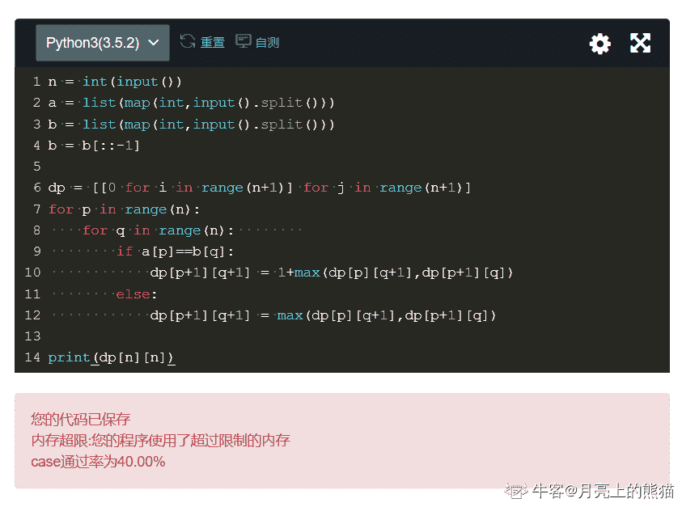
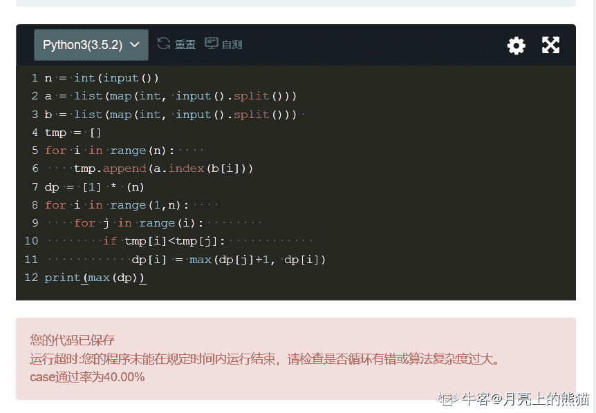
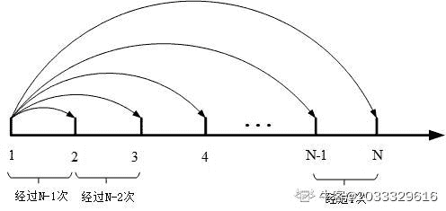

# 三百六十、公司 2019 校招笔试编程题合集

## 1

有一个城市需要修建，给你 N 个民居的坐标 X,Y，问把这么多民居全都包进城市的话，城市所需最小面积是多少（注意，城市为平行于坐标轴的正方形）

本题知识点

Java 工程师 C++工程师 安卓工程师 iOS 工程师 运维工程师 前端工程师 算法工程师 PHP 工程师 测试工程师 360 公司 2019

讨论

[魏魏魏魏什么](https://www.nowcoder.com/profile/102549380)

首先考虑用长方形将所有点包括起来；则长方形左边的边具有最小的 x 值，右边的边具有最大的 x 值；同理，下边的边具有最小的 y 值，上边的边具有最大的 y 值；|maxX-minX|即为横轴方向长方形的边长；|maxY-minY|即为纵轴方向长方形的边长；题目要求正方形，则取上两者较大的那个，平方即得正方形面积。

```cpp
#include<iostream>
using namespace std;
const long long LONG_MIN=(1<<63);
const long long LONG_MAX=(1<<63)-1;
int main()
{
    long long num;
    long long x=0,y=0;
    long long minX=LONG_MAX,minY=LONG_MAX,maxX=LONG_MIN,maxY=LONG_MIN;
    cin>>num;
    for(long long i=0;i<num;i++)
    {
        cin>>x>>y;
        if(x<=minX)
            minX=x;
        if(x>=maxX)
            maxX=x;
        if(y<=minY)
            minY=y;
        if(y>=maxY)
            maxY=y;
    }
    long long xLength=abs(maxX-minX);
    long long yLength=abs(maxY-minY);
    long long edgeLength=xLength >= yLength ? xLength: yLength;
    cout<<edgeLength*edgeLength;
    return 0;
}
```

编辑于 2019-08-20 10:12:12

* * *

[更爱百事可乐](https://www.nowcoder.com/profile/6586649)

```cpp
//大数相乘啊！！！朋友们。。。。
var num = readline();
var house_x = [],house_y = [],tmp;
while(tmp = readline()){
    tmp = tmp.split(' ');
    house_x.push(tmp[0]);
    house_y.push(tmp[1]);
}
if(num == house_x.length && num == house_y.length){
    getArea(house_x,house_y,num);
}

function getArea(house_x,house_y,num){
    if(num<2) {console.log(0);}
    else{
        house_x.sort((a,b)=>{return a-b});
        house_y.sort((a,b)=>{return a-b});
        var x = Math.abs(house_x[num-1]-house_x[0]);
        var y = Math.abs(house_y[num-1]-house_y[0]);
        var side = Math.max(x,y);
        //哦呵呵呵。。。。。居然还有大数相乘这种鬼，查了我一宿
        var result = multi(side.toString(),side.toString())
        console.log(result)
    }

}
function multi(a,b){
    var str1,str2,len1,len2,maxlen,result = [];
    str1 = a.split("").reverse(); 
    str2 = b.split("").reverse();
    len1 = str1.length;
        len2 = str2.length;
//因为要在下一步做累加，如果不初始化为 0，result[]中的值会变为 NaN
//因为未初始化的数组中的值为 undefined
    for(var i = 0;i < len1;i++)
        for(var j = 0;j < len2;j++)
            result[i + j] = 0;
    for(var i = 0;i < len1;i++)
        for(var j = 0;j < len2;j++)
    //根据乘法的手动计算方式，在上下相同位上会有相加
            result[i + j] += parseInt(str1[i]) * parseInt(str2[j]);
    var n = result.length;
    for(var k = 0;k < n-1;k++)
    {
        var temp = result[k];
        if(temp >= 10)
        {
            result[k] = temp % 10;
            //JS 中的"/"不是除法取整，会取得小数，所以要用 Math.floor()
            result[k + 1] +=  parseInt(temp / 10);
        }
    }
    return result.reverse().join("");
}
```

 发表于 2019-08-15 09:50:59

* * *

[『FinalFantasy〗](https://www.nowcoder.com/profile/8631596)

```cpp
import java.util.Arrays;
import java.util.Scanner;

/**
 * @Author：likui
 * @PacakgeName:城市所需最小面积
 * @Description:
 * @Date:Created in 20:37 2019/8/9
 */
public class Main {
    public static long Way(long x[],long y[]){
        Arrays.sort(x);
        Arrays.sort(y);
        if (x.length<2||y.length<2)
            return 0;
        long x_length=Math.abs(x[x.length-1]-x[0]);
        long y_length=Math.abs(y[y.length-1]-y[0]);
        return Math.max(x_length,y_length);
    }
    public static void main(String[] args) {
        Scanner sc=new Scanner(System.in);
        int n=sc.nextInt();
        long X[]=new long[n];
        long Y[]=new long[n];
        for (int i = 0; i <n ; i++) {
            X[i]=sc.nextLong();
            Y[i]=sc.nextLong();
        }
        long res=Way(X,Y);
        System.out.println(res*res);
    }
}
```

得到 x 轴最小和最大值的差，得到 y 轴最小和最大值的差，比较两者，得到最大的那个，用它平方即可

编辑于 2019-08-13 19:47:50

* * *

## 2

圈地运动，就是用很多木棍摆在地上组成一个面积大于 0 的多边形～

小明喜欢圈地运动，于是他需要去小红店里面买一些木棍，期望圈出一块地来。小红想挑战一下小明，所以给小明设置了一些障碍。障碍分别是：

1.如果小明要买第 i 块木棍的话，他就必须把前 i-1 块木棍都买下来。

2.买了的木棍都必须用在圈地运动中。

那么请问小明最少买多少根木棍，才能使得木棍围成的图形是个面积大于 0 多边形呢？

本题知识点

Java 工程师 C++工程师 安卓工程师 iOS 工程师 运维工程师 前端工程师 算法工程师 PHP 工程师 测试工程师 360 公司 2019

讨论

[修改昵称失败](https://www.nowcoder.com/profile/947651)

```cpp
import java.util.ArrayList;
import java.util.Collections;
import java.util.List;
import java.util.Scanner;

public class  {
    public static void main(String[] args) {
        Scanner scanner = new Scanner(System.in);

        // 木棍的个数
        int n = scanner.nextInt();
        if(n < 3){
            System.out.println(-1);
        }
        List<Integer> lengths = new ArrayList<>();
        for (int i=0;i<n;i++){
            int length = scanner.nextInt();
            lengths.add(length);
        }

        for(int i=2;i<lengths.size();i++){
            int sum = 0;
            int max = 0;
            for(int j=0;j<=i;j++){
                if(lengths.get(j) > max){
                    sum = sum + max;
                    max = lengths.get(j);
                }else{
                    sum = sum + lengths.get(j);
                }

            }
            if(max < sum){
                System.out.println(i+1);
                break;
            }else if(i== lengths.size()-1){
                System.out.println(-1);
            }
        }

    }

}

```

发表于 2019-08-05 19:11:11

* * *

[浮生后雪](https://www.nowcoder.com/profile/995843523)

思路： ```cpp
n-1 边的和大于最长边，就能组成封闭多边形
```

JAVA 代码：

```cpp
import java.util.Arrays;
import java.util.Scanner;

public class 圈地问题 {
    public static void main(String[] args) {
        Scanner in = new Scanner(System.in);
        int n = in.nextInt();
        int[] nums = new int[n];
        for (int i = 0; i < n; i++) {
            nums[i] = in.nextInt();
        }
        int res = angleEnable(nums);
        System.out.println(res);

    }

    public static int angleEnable(int[] nums) {
        //如果边长＜2，肯定不能实现
        if (nums == null || nums.length <= 2) return -1;

        //条件： n-1 边的和大于最长边，就能组成封闭多边形

        int sum = 0; //前 N 个数之和
        int max = 0;//前 N 个树中的最大值
        for (int i = 0; i < nums.length ; i++) {
            sum += nums[i];
            max = max > nums[i] ? max : nums[i];
           //如果 i > 1（如果不大于 1，说明只有 2 条边，无论如何都构成不了的）
           //并且 sum - max > max，即前 N 个中不含 Max 的值之和大于 Max，说明找到了，直接返回
            //这个注意 + 1 ，因为 i 从 0 开始
            if (i > 1 && sum > 2 * max) return i + 1;
        }
                //遍历完所有都不存在则说明不存在
        return -1;
    }

}

```

编辑于 2019-09-17 11:59:53

* * *

[洛枫、](https://www.nowcoder.com/profile/1922887)

```cpp
# 思路是 n-1 边的和大于最长边，就能组成封闭多边形；
while 1:
    try:
        nums = int(input())
        lists = list(map(int, input().strip().split(' ')))
        if nums <= 2:
            print('-1')
            exit()
        index = 2
        for i in range(nums-2):
            # 因为在前面的 sum 中，把最长边也加进去了，所以后面的 max 要乘 2；
            result = sum(lists[:index+1]) - max(lists[:index+1])*2
            if result > 0:
                print(index+1)
                exit()
            index += 1
        print('-1')
    except:
        break
```

编辑于 2019-08-13 19:38:21

* * *

## 3

现在有 q 个询问，每次询问想问你在[l,r]区间内，k 进制表示中，k-1 的数量最多的数是哪个数。比如当 k=2 时，9 的二进制就是 1001，那么他就有 2 个 1.

本题知识点

Java 工程师 C++工程师 安卓工程师 iOS 工程师 运维工程师 前端工程师 算法工程师 PHP 工程师 测试工程师 360 公司 2019

讨论

[Stubb](https://www.nowcoder.com/profile/44965266)

用 java 写的，最后还是通过了 但速度有点慢。这都不是关键，具体讲解一下思路。
首先将 start（我用 start 和 end 分别表示左右的边界）转换成 k 进制。将转换后的每一位都存在 arraylist 中（数组和 linklist 也可以，自己选）。然后从低位往高位依次将每一位变成（k-1）。在变换之前，首先看看能不能变，能变则变，不能变表示超过了 end，这个时候直接跳出即可。

```cpp
import java.util.ArrayList;
import java.util.Scanner;
public class Main {

    public static long minNum(int k, long start, long end) {
        ArrayList<Integer> list = new ArrayList<Integer>();
        long tmp = start;
        while (tmp != 0) {
            long rest = tmp % k;
            list.add((int) rest);
            tmp = tmp / k;
        }
        long sum = 1;
        for (int i = 0; i < list.size(); i++) {
            long num = list.get(i);
            num = k - 1 - num;
            long size = (long) (num * sum);
            if (start + size <= end) {
                start = start + size;
            } else {
                return start;
            }
            sum = sum * k;
        }
        while (start < end) {
            long size = (long) ((k - 1) * sum);
            if (start + size <= end) {
                start = start + size;
            } else {
                return start;
            }
            sum = sum * k;
        }
        return start;
    }

    public static void main(String[] args) {
        Scanner in = new Scanner(System.in);
        while (in.hasNextInt()) {
            int time = in.nextInt();
            for (int i = 0; i < time; i++) {
                int k = in.nextInt();
                long start = in.nextLong();
                long end = in.nextLong();
                System.out.println(minNum(k, start, end));
            }
        }
    }
}
```

发表于 2019-08-07 22:30:37

* * *

[零分母](https://www.nowcoder.com/profile/540910)

```cpp
#include <iostream>
#include <vector>

using namespace std;

// 思路 先把 low 和 high 都转换成 k 进制数，然后寻找在[low, high]之间 k 进制中 k-1 最多的数，为方便 k=10
// 123 123456 -> 099999：二者位数不同时, 把 high 最高位变成 0，后面其他位置为 9 即可
// 123 999999 -> 999999 需要注意 high 所有位都为 9 时，ans = high, 玛德这种情况找了好久才找到，sad
// 123456 123556 -> 123499 二者位数相同时，把 low 从位数不同的下一位到最后置为 9 即可
// 123456 123999 -> 123999 需要注意 high 在不同位往后都为 9 时, ans =  high

// 把 number 转换成 k 进制存在 vector 中，高位放在后面 如十进制的 12345 -> 54321
void convertk(vector<int> &v, long number, int k) {
    while (number) {
        v.push_back(number % k);
        number /= k;
    }
}

long query(long low, long high, int k) {
    if (low == high)
        return low;
    vector<int> vecLow, vecHigh, vecAns;
    convertk(vecLow, low, k);
    convertk(vecHigh, high, k);
    int i = vecHigh.size()-1, j = vecLow.size()-1;
    while (i == j && vecHigh[i] == vecLow[j]) {
        i--;
        j--;
    }
    if (i > j) { // low 和 high 位数不同时
        bool allLeftIsK_1 = false;
        if (vecHigh[i] == k-1) {
            allLeftIsK_1 = true;
            for (int l = i; l >= 0; l--) {
                if (vecHigh[l] != k-1) {
                    allLeftIsK_1 = false;
                    break;
                }
            }
        }
        if (allLeftIsK_1) //123 999999 -> 999999 high 所有位上都是 k-1, ans = high
            vecAns = vecHigh;
        else {      //123 123456 -> 099999 最高位置 0，其他位置 k-1
            vecAns = vecHigh;
            vecAns[i] = 0; // 最高位置 0
            i--;
            while (i >= 0) {
                vecAns[i--] = k-1;
            }
        }
    }
    else { // low 和 high 位数相同时
        bool allLeftIsK_1 = false;
        if (vecHigh[j] == k-1) {
            allLeftIsK_1 = true;
            for (int l = j; l >= 0; l--) {
                if (vecHigh[l] != k-1) {
                    allLeftIsK_1 = false;
                    break;
                }
            }
        }
        if (allLeftIsK_1) // 123456 123999 -> 123999 high 与 low 的不同位上都是 k-1, ans = high
            vecAns = vecHigh;
        else {  // 123456 123567 -> 123499 low 从不同位的下一位开始置 k-1
            vecAns = vecLow;
            j--; // 从不同位的下一位置 k-1
            while (j >= 0) {
                vecAns[j--] = k-1;
            }
        }
    }
    long ans = 0;
    long power = 1;
    for (int i = 0; i < vecAns.size(); i++) {
        ans += power * vecAns[i];
        power *= k;
    }
    return ans;
}

int main() {
    int q;
    cin >> q;
    long low, high, ans;
    int k; 
    for (int i = 0; i < q; i++) {
        cin >> k >> low >> high;
        ans = query(low, high, k);
        cout << ans << endl;
    }
    return 0;
}

```

先把 low 和 high 都转换成 k 进制数，然后寻找在[low, high]之间 k 进制中 k-1 最多的数，为方便 k=10 123 123456 -> 099999：二者位数不同时, 把 high 最高位变成 0，后面其他位置为 9 即可 123 999999 -> 999999 需要注意 high 所有位都为 9 时，ans = high, 玛德这种情况找了好久才找到，sad 123456 123556 -> 123499 二者位数相同时，把 low 从位数不同的下一位到最后置为 9 即可 123456 123999 -> 123999 需要注意 high 在不同位往后都为 9 时, ans = high

发表于 2019-08-09 18:03:05

* * *

[微观我的微世界 8023](https://www.nowcoder.com/profile/4241876)

```cpp
q = int(input().strip())

# 将十进制转换为 k 进制，k 进制的每一位，用列表中的一个数表示，注意当 k 大于 10 时，k 进制中的每一位可能为两位数
def dec2k(dec):
    ansk = []
    while dec // k:
        ansk.append(dec % k)
        dec = dec // k
    ansk.append(dec)
    ansk = ansk[::-1]
    return ansk

# 将 k 进制转换为十进制，k 进制的每一位，用列表中的一个数表示，注意当 k 大于 10 时，k 进制中的每一位可能为两位数
def k2dec(rans):
    ansd = 0
    tmp = 1
    for i in range(len(rans)-1, -1, -1):
        ansd += rans[i] * tmp
        tmp *= k
    return ansd
# k 进制表示中，k-1 的数量最多的数，且输出最小的，即 k 进制数每一位均为 k-1 构成
def get_ans():
    if len(lvalue) == 0 or len(rvalue) == 0:
        return
    # 第一种全为(k-1), l <= and <= r
    record, tmp = 0, 0
    while tmp <= r:
        record = tmp
        tmp = tmp * k + (k-1)
    # print("record:", record)
    if record >= l:
        return record

    else:
        ''' # 每判断一下都需要进制转换，复杂度太高，超时，由于每次只更新一位，因此，可以直接修改
        for i in range(len(lvalue)-1, -1, -1):
            t = lvalue[i]
            lvalue[i] = k-1
            if k2dec(lvalue) > r:  # 大于，则还原
                lvalue[i] = t
                return k2dec(lvalue)
        '''

        dec = k2dec(lvalue)
        tmp = 1
        for i in range(len(lvalue) - 1, -1, -1):
            dec = dec + (k - 1 - lvalue[i]) * tmp
            tmp = tmp * k
            t = lvalue[i]
            lvalue[i] = k - 1
            if dec > r:  # 大于，则还原
                lvalue[i] = t
                return k2dec(lvalue)

while q > 0:
    k, l, r = map(int, input().strip().split())
    lvalue = dec2k(l) 
    rvalue = dec2k(r) 
    print(get_ans())
    q -= 1

'''
15
4 8442097414683844 8442097414683844
3 3173466882309064 3173466882309073
4 8527527027194177 8527527027194276
4 2661113491247500 2661113491248499
16 4448712248766526 4448712248776525
13 2684426398058983 2684426398158982
14 6562761408288807 6562761409288806
4 2847109288743406 2847109298743405
12 3011167199031338 3011167299031337
7 8655416323525458 8655417323525457
13 177186968879953 177196968879952
2 4133390730537405 4133490730537404
13 4680075382111731 4681075382111730
11 5341708995347620 5351708995347619
8 114951857079067 214951857079066
'''

```

> 您的代码已保存
> 运行超时:您的程序未能在规定时间内运行结束，请检查是否循环有错或算法复杂度过大。
> case 通过率为 86.67%

在本地跑，测试用例都通过了，不知道是哪里出现问题，我已经将原有的进制转换优化了，复杂度应该是 O(n),难道真的是 Python 运行太慢了？？？有大佬麻烦指点一下，谢谢

发表于 2019-08-05 09:48:28

* * *

## 4

小明有一个花园，花园里面一共有 m 朵花，对于每一朵花，都是不一样的，小明用 1～m 中的一个整数表示每一朵花。

他很喜欢去看这些花，有一天他看了 n 次，并将 n 次他看花的种类是什么按照时间顺序记录下来。

记录用 a[i]表示，表示第 i 次他看了 a[i]这朵花。

小红很好奇，她有 Q 个问题,问[l,r]的时间内，小明一共看了多少朵不同的花儿，小明因为在忙着欣赏他的花儿，所以想请你帮他回答这些问题。

本题知识点

Java 工程师 C++工程师 安卓工程师 iOS 工程师 运维工程师 前端工程师 算法工程师 PHP 工程师 测试工程师 360 公司 2019

讨论

[佘溪源](https://www.nowcoder.com/profile/5539277)

用 cin 通不过的代码，用 scanf 通过了

```cpp

	#include <iostream>
#include <set>
#include <vector>
#include <unordered_set>
using namespace std;
int main(){
    int m,n;
    while(cin >> n >> m){
        vector<int> a(n);
        for(int i = 0; i < n; ++i){
            scanf("%d" , &a[i]);
        }
        vector<vector<int>> ans(n, vector<int>(n, 1)); // ans[i][j] 表示从时间[i + 1， j + 1]看了几种花，其中 i <= j;
        for(int i = 0; i < n; ++i){
            unordered_set<int> set_a;
            set_a.insert(a[i]);
            for(int j = i; j < n; ++j){
                set_a.insert(a[j]);
                ans[i][j] = set_a.size();
            }
        }
        int Q;
        cin >> Q;
        while(Q--){
            int l, r;
            scanf("%d %d" , &l, &r);
            //printf("%d\n",ans[l - 1][r - 1]);
            //cin >> l >> r;
            cout << ans[l - 1][r - 1] << endl;
        }
    }
    return 0;
}

```

编辑于 2019-07-31 15:41:03

* * *

[绵绵 sir](https://www.nowcoder.com/profile/848599673)

Python3 测试通过百分之百我真是使出了浑身解数来优化 - -！思路：明显我们小红的查询时间复杂度必须是 o(1)查询次数大的可怕，我们必须考虑数据结构存储一个 matrix[i][j]  值表示 i, j 区间内一共有多少个不同的花查询的时候我们直接查 matrix 就行了思路对了还需要优化内存：用 sys.stdout.write 代替 print 用上三角矩阵存储可以减少内存开销计算字典 len 值时，使用一个计数器来记录，而不是使用 len()函数，会增加时间开销

```cpp
import sys
from collections import defaultdict
n, m = list(map(int, sys.stdin.readline().split()))
a = list(map(int, sys.stdin.readline().split()))
Q = int(sys.stdin.readline().strip())

class Solution(object):
    def matrix_init(self, n, m, a):
        self.matrix = [[0]*(n-i) for i in range(n)]
        mydic = defaultdict(int)
        cur_type = 0
        for i in range(n):
            if not mydic[a[i]]:
                cur_type += 1
            mydic[a[i]] += 1
            self.matrix[0][i] = cur_type

        for i in range(1, n):
            pop_flag = False
            target_find_flag = False
            mydic[a[i-1]] -= 1
            if not mydic[a[i-1]]:
                mydic.pop(a[i-1])
                pop_flag = True
            for j in range(i, n):
                if a[j] == a[i-1]:
                    target_find_flag = True
                if j == i:
                    self.matrix[i][j-i] = 1
                    continue
                if pop_flag or not target_find_flag:
                    self.matrix[i][j-i] = self.matrix[i-1][j-i+1] - 1
                else:
                    self.matrix[i][j-i] = self.matrix[i-1][j-i+1]

    def print_queries(self):
        for line in sys.stdin:
            l, r = list(map(int, line.split()))
            sys.stdout.write(str(self.matrix[l-1][r-l])+'\n')

if __name__ == '__main__':
    s = Solution()
    s.matrix_init(n, m, a)
    s.print_queries()
```

发表于 2019-08-31 12:49:48

* * *

[你瞅啥瞅](https://www.nowcoder.com/profile/606609448)

```cpp
import java.util.*;
public class Main{
    public static void main(String[] args){
        Scanner sc = new Scanner(System.in);
        int n = sc.nextInt();
        int m = sc.nextInt();
        int []A = new int [n];
        int []B = new int [m];
        for(int i=0;i<n;i++){
            A[i] = sc.nextInt();
        }
        int Q = sc.nextInt();
        int [][]a = new int [Q][2];
        for(int i=0;i<Q;i++){
            a[i][0] = sc.nextInt();
            a[i][1] = sc.nextInt();
        }

        for(int i=0;i<Q;i++){
        	int t=0;
        	for(int j=a[i][0]-1;j<=a[i][1]-1;j++){
        		int dd = A[j];
                if(B[dd-1]!=i+1){
                    B[dd-1]=i+1;
                    t++;
                }

        	}
        	System.out.println(t);

        	}

        }
    }
```

发表于 2019-08-16 16:02:59

* * *

## 5

小红有两个长度为 n 的排列 A 和 B。每个排列由[1,n]数组成，且里面的数字都是不同的。

现在要找到一个新的序列 C，要求这个新序列中任意两个位置(i,j)满足:

如果在 A 数组中 C[i]这个数在 C[j]的后面，那么在 B 数组中需要 C[i]这个数在 C[j]的前面。

请问 C 序列的长度最长为多少呢？

本题知识点

Java 工程师 C++工程师 安卓工程师 iOS 工程师 运维工程师 前端工程师 算法工程师 PHP 工程师 测试工程师 360 公司 2019

讨论

[have_a_try](https://www.nowcoder.com/profile/95749980)

/*思路 1 将 B[1，n]翻转，则问题转化 O(n²)的最长公共子序列问题，注意 dp 数组优化为 O(n)复
杂度的，不然会爆内存只有 40%通过，优化后也只能通过 50%*/
/*思路 2：可以看出来 O(n²)的时间复杂度不是出题想要的，可以用 Map<值 , 位置>将 A 数组
中值与位置对应，如
样例中
5
1 2 4 3 5
5 2 3 4 1
A 数组可以用 Map 对应出:[1,0] [2,1] [4,2] [3,3] [5,4];
则 B 数组中值可以通过 Map 映射为对应值在 A 中位置即 B 数组从[5 2 3 4 1]；映射为
B'=[ 4 1 3 2 0 ]；
由题目要求 C 中任意数 i,j 存在 如果在 A 数组中 C[i]这个数在 C[j]的后面，
那么在 B 数组中需要 C[i]这个数在 C[j]的前面的关系，
则问题就转换为了在 B'中查找最长递减子序列问题-->时间复杂度下降变为 O(nlogn);
*///思路 1

```cpp
import java.util.*;

public class Main
{
    public static void main(String []args)
    {
        Scanner sc = new Scanner(System.in);
        int n = sc.nextInt();

        if(n<=0)
        {
            System.out.println( 0 );
            return;
        }

        int[] an = new int[n];
        int[] bn = new int[n];

        for(  int i = 0 ; i < n ; i++  )
        {
            an[i] = sc.nextInt();
        }
        for(  int i = n-1 ; i >-1 ; i--  )
        {
            bn[i] = sc.nextInt();
        }

        System.out.println(md( an , bn ,n));
    }

    public static int md(  int[] an , int[] bn , int n  )
    {
        if(n==1)return an[0]==bn[0]?1:0;

        int[] res = new int[n];

        for( int i = 0 ; i < n ; i++ )
            for(int j = 0 ; j<n ; j++)
            {
                if( i == 0 )
                {
                    if( j==0 )
                    {
                        res[0] = an[0]==bn[0]?1:0;
                    }else{
                        res[j] = an[i]==bn[j]?1:res[j-1];
                    }

                }else if(j == 0 )
                {
                    res[j] =  res[j]==1?1:( an[i]==bn[j]?1:0  );
                }else{
                    if( an[i] == bn[j] )
                    {
                        res[j] = res[j-1]+1;
                    }else{
                        res[j] = Math.max( res[j] ,res[j-1] );
                    }
                }           
            }
        return res[n-1];
    }
}

```

//思路 2

```cpp
import java.util.*;

public class Main
{
    public static void main(String []args)
    {
        Scanner sc = new Scanner(System.in);
        int n = sc.nextInt();
        int[] b = new int[n];
        HashMap<Integer , Integer> hs  = new HashMap<>();
        for(int i = 0 ; i < n ; i++)
        {
            hs.put( sc.nextInt() , i   );
        }
        for(int i = 0 ; i < n ; i++)
        {
            b[i] = (Integer) hs.get( sc.nextInt() );  
        }
        System.out.println(  md( b , n )  );

    }

    public static int md( int[] an , int n)
    {
        if(n<2)return 1;
        if(n==2)return an[0]>an[1]?2:1;

        int r = 0 ;
        int[] end = new int[n];
        end[r] = an[r];

        for( int i =1 ; i < n ; i++)
        {
            if( an[i] < end[r]  )
            {
                r++;
                end[r] = an[i];
            }else{
                cmp( end , r , an[i]   );
            }
        }
        return r+1;

    }

    public static void cmp( int[] cmp , int r , int target )
    {
        if( cmp[0]<target )
        {
             cmp[0] = target;
             return;
        }
        if(  r==1 )
        {
            cmp[0] =  ( cmp[0]>target?cmp[0]:target  );
        }
        int l = 0 ;
        int m ;
        while(  r-1 > l  )
        {
            m = (l+r)/2;
            if( cmp[m] > target )
            {
                l = m ;
            }else{
                r = m;
            }
        }
        cmp[r] = target;

    }

}

```

发表于 2019-08-28 15:26:57

* * *

[月亮上的熊猫](https://www.nowcoder.com/profile/712421409)

python 动态规划之抱头痛哭...上面的图是我的二维 dp，超内存。思路：把 b 逆序，求 a 和 b 的最长公共子序列，转化为经典动规。下面的图是[小二郎求 offer]的一维 dp，超时。思路：tmp 存储 a 和 b 的关系，即 b 的元素在 a 中的位置。



编辑于 2019-08-20 16:42:17

* * *

[牛客 2817416 号](https://www.nowcoder.com/profile/2817416)

Python

```cpp
n = int(input())
a = list(map(int, input().split()))
b = list(map(int, input().split()))

tmp = []
for i in range(n):
    tmp.append(a.index(b[i]))
dp = [1] * (n)
for i in range(1,n):
    for j in range(i):
        if tmp[i]<tmp[j]:
            dp[i] = max(dp[j]+1, dp[i])
print(max(dp))
```

发表于 2019-08-19 10:01:39

* * *

## 6

众所周知，集合{1 2 3 … N}有 N!种不同的排列，假设第 i 个排列为 P[i]且 P[i,j]是该排列的第 j 个数。将 N 个点放置在 x 轴上，第 i 个点的坐标为 x[i]且所有点的坐标两两不同。对于每个排列（以 P[i]为例），可以将其视为对上述 N 个点的一种遍历顺序，即从第 P[i,1]个点出发，沿直线距离到达第 P[i,2]个点，再沿直线距离到达第 P[i,3]个点，以此类推，最后到达第 P[i,N]个点，将该路线的总长度定义为 L(P[i])，那么所有 N!种路线的总长度之和是多少，即 L(P[1])+L(P[2])+L(P[3])+...+L(P[N!])的结果是多少？

本题知识点

Java 工程师 C++工程师 安卓工程师 iOS 工程师 运维工程师 前端工程师 算法工程师 PHP 工程师 测试工程师 360 公司 2019

讨论

[2033329616](https://www.nowcoder.com/profile/116334094)


       假设从 N 个点中的第一个点出发，可以到达其他的 N-1 个点，可以从上图看出，对于每一个片段经过的次数是不一样的，而将第一个点看做**起点**共有(N-1)!种情况，可以理解为将剩下的 N-1 个点进行排列组合，而 N 个点中每个点都可以作为起点，所以一共有 N*(N-1)!=N!种情况，因此只要统计出以每一个点为出发点时各个片段经过的次数，然后再乘以各个片段的长度就得到了总的距离

|  | part1 | part2 | part3 | ... | partN-1 |
| 1 | N-1 | N-2 | N-3 | ... | 1 |
| 2 | 1 | N-2 | N-3 | ... | 1 |
| 3 | 1 | 2 | N-3 | ... | 1 |
| 4 | 1 | 2 | 3 | ... | 1 |
| ... | ... | ... | ... | ... | ... |
| N | 1 | 2 | 3 | ... | N-1 |

**上面的表格中行代表以哪个点为起点，列代表以当前点为起点每个片段经过的次数**，总共有 N 行 N-1 列个数，对每一列求和然后乘以(N-1)!代表当前片段经过的总次数，设对第 k∈[1,N−1]k∈[1,N−1]列求和，公式如下： 设第 k 段的距离为 dkdk，则总的距离如下： 

```cpp
def factorial(n):                                      # 阶乘
    tmp = 1
    for i in range(1,n+1):
        tmp =  (tmp*i + (10**9 + 7)) % (10**9 + 7)     # 防止溢出
    return tmp
def result():
    n = int(input().strip('\n'))
    num_list = list(map(int, input().strip().split(' ')))
    sum = 0
    for i in range(1, n):
        tmp_distance = num_list[i] - num_list[i-1]
        sum += 2*i* (n - i) * tmp_distance
    sum *=  factorial(n-1)
    out = sum % (10**9 + 7)
    print(out)
result()
```

编辑于 2019-08-17 20:33:25

* * *

[Stubb](https://www.nowcoder.com/profile/44965266)

这道题的思路就是排列组合，但因为计算中的数据过大，随时可能溢出，所以在每一个地方都需要考虑溢出的可能性。
举一个简单的例子讲解思路。
假如四个数分别是 1 2 3 4 那么这四个数的排列组合一共有 24 种
1 2 3 4 - 1 2 4 3 - 1 3 2 4 - 1 3 4 2 - 1 4 2 3 - 1 4 3 2
2 1 3 4 - 2 1 4 3 - 2 3 1 4 - 2 3 4 1 - 2 4 1 3 - 2 4 3 1
3 1 2 4 - 3 1 4 2 - 3 2 1 4 - 3 2 4 1 - 3 4 1 2 - 3 4 2 1
4 1 2 3 - 4 1 3 2 - 4 2 1 3 - 4 2 3 1 - 4 3 1 2 - 4 3 2 1
分别统计 1-2 · 2-1 · 1-3 ·3-1 · 1-4 · 4-1 · 2-3 · 3-2 · 2-4 · 4-2 · 3-4 · 4-3 出现的次数。得出每一种情况都是 6 次
这里的 6 次是怎么来？ 就是利用排列组合中的捆绑法原理
求 1-2 的次数，将 1 2 看成一个数捆绑在一起。那么 1 2 3 4 四个数就变成了三个坑 三个坑中选一个放 1 2，另外两个坑放 3 和 4。
那么一共有 C（3 1）*A（2,2）=A（3,3）=6 种。其他的方式也一样。
另外就是 1-4 和 4-1 是两种不同的组合。但是计算时只需要乘以 2 就可以了。
这道题用 o（n²）的时间复杂度通不过。所有只能进行优化。
例如 1 2 3 4 以 2 3 4 开始的组合分别有（2,1）（3,1）（3,2） （4,1）（4,2）（4,3）（这些组合全都是前面一个数大于后面一个数）
这里以 4 结尾的数为例(4-1)+(4-2)+(4-3)=6=4**3-(1+2+3) 这里 1+2+3 恰好是 4 出现之前所有已出现数之和。
所有我们用一个遍历 temp 表示前 i-1 项的和。那么算法的时间复杂度就可以简化成 o（n）

```cpp
import java.util.Scanner;

public class Main {

    static long mod=1000000007;
    //时间复杂度 o(n²)(这个时间复杂度不能通过测试 附上为了方便大家理解思路)
    public static int result(int arr[]) {

        long sum=0;
        long n=factorial(arr.length-1);
        for (int i = 0; i < arr.length; i++) {
            for (int j = i+1; j < arr.length; j++) {
                int tmp=(arr[j]-arr[i])<<1;
                sum=(sum+tmp)%mod;
            }
        }
        sum=(sum*n)%mod;
        return (int)sum;
    }

    public static int factorial(int n) {
        long result=1;
        for (int i = 1; i <=n; i++) {
            result=(result*i)%mod;
        }
        return (int)result;
    }
    //时间复杂度(o(n))
    public static int SumOfDistence(int arr[]) {
        int n=factorial(arr.length-1);
        long sum=0;
        long tmp=0; 
        long a=0;
        for (int i = 1; i <arr.length; i++) {
            tmp=(tmp+arr[i-1])%mod;
            a=arr[i];
            a=a*i;
            //这里千万不能用 sum=(sum+a[i]*i-tmp)%mod;
            //原因就是计算顺序中会先算 a[i]*i，这两部分的计算结果是 int，会导致溢出。所以只能增加一个 long 变量来进行计算
            sum=(sum+a-tmp)%mod;
        }

        sum=(sum<<1)%mod;
        sum=(sum*n)%mod;
        return (int) sum;
    }

    public static void main(String[] args) {

        Scanner in = new Scanner(System.in);
        while (in.hasNextInt()) {
            int n = in.nextInt();
            int arr[] = new int[n];
            for (int i = 0; i < arr.length; i++) {
                arr[i] = in.nextInt();
            }
            System.out.println(SumOfDistence(arr));
        }
    }
}
```

编辑于 2019-08-16 13:19:32

* * *

[0/0](https://www.nowcoder.com/profile/536969349)

/* 思路
* 对于 N 个数中任意两个数 a,b(a!=b)考虑先后顺序 ， 有(a,b)及(b,a)两种情况
* 对于其中的(a,b)情况有，将其视为一个整体，插入剩下的(N-2)个数中，有(N-1)种插入方法，
*                    进而推出对 N!个序列共有(N-1)*((N-2)!)=(N-1)!种（a,b）相邻情况。
* 同理对(b,a)也有(N-1)!种情况。
* 一共有 C(N,2)对数对，对于(a,b)及(b,a)移动代价相同，所以只需求出 C(N,2)对数的总代价 P
* 最后  P * 2 * ((N-1)!) 即为最终解
* 当然考虑到 对（10⁹+7） 取余
* */
import java.util.Arrays;
import java.util.Scanner;

public class Test6i {
public static void main(String[] args) {
Long yv = (long) (Math.pow(10, 9)+7);
Scanner sc = new Scanner(System.in);
int n = sc.nextInt();
int[] number = new int[n];
for(int i=0;i<n;i++) {
number[i] = sc.nextInt();
}
Arrays.sort(number);//求总代价的过程，特殊操作，以减少时间复杂度
Long sum = 0L;
Long[] sumList = new Long[n];
for(int i=0;i<n;i++) {
if(i==0) {
sumList[i] = 0l;
}else {
sumList[i] = ((long)i*(long)(number[i]-number[i-1])+sumList[i-1]+yv)%yv;
}
}
for(int i=0;i<n;i++) {
sum = (sum + sumList[i] + yv)% yv;
}//总代价求取完毕。
Long muti = 2L;
for(int j=1;j<n;j++) {
muti = (muti * j + yv)%yv;
}
sum = sum * muti;
sum = (sum+yv) % yv;
System.out.println(sum);
}
} 

编辑于 2019-08-14 23:00:27

* * *