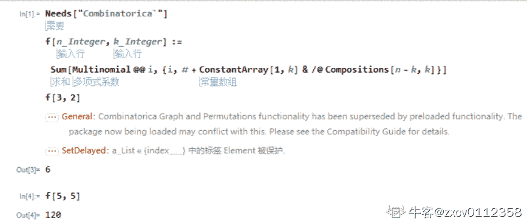
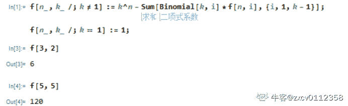

# 三百六十、公司 2018 年春招笔试编程题合集

## 1

沫璃有一个画板，画板可以抽象成有 100 行每行 100 个像素点的正方形。沫璃在画板上画画，她一共画了 n 次，每次将一个矩形涂上颜色。沫璃想知道一共有多少个像素点被她涂过颜色。若一个像素点被涂了 k 次，那么认为有 k 个像素点被涂过颜色。

本题知识点

Java 工程师 C++工程师 安卓工程师 iOS 工程师 运维工程师 前端工程师 算法工程师 PHP 工程师 测试工程师 360 公司 2018

讨论

[技术过硬](https://www.nowcoder.com/profile/9232985)

说实话，没有理解题意！

发表于 2019-07-31 15:53:20

* * *

[中南的小菜鸡](https://www.nowcoder.com/profile/4371282)

```cpp
//我解释一下题意，刚开始我也没读懂题意，以下用题目中用例说明下
/* 输入例子 1: 
 * 2
 * 2
 * 1 1 2 3
 * 2 2 3 3
 * 2 
 * 1 1 3 3
 * 1 1 3 3
 * 
 * 从（1,1）点填涂到（2,3）点，一共涂了 6 个格子（包括了点（1,1），一开始没考虑这个点就懵了，直接跳下一题），
 * 用下图解释下这一操作（0 表示已经涂色，1 表示未涂色）
 * 0 0 0 1 1 1 1...
 * 0 0 0 1 1 1 1... 
 * 1 1 1 1 1 1 1...
 * ..
 * ..
 * 同理从点（2,2）涂到（3,3），一共涂了 4 个格子，所以用例输出 10；第二个用例输出 18.
 */
import java.util.Scanner;
public class Main {
    public static void main(String[] args) {
        Scanner sc = new Scanner(System.in);
        int n = sc.nextInt();
        for (int i = 0; i < n; i++) {
            int t = sc.nextInt();
            int sum=0;
            for (int j = 0; j < t; j++) {
                int x1 = sc.nextInt();
                int y1 = sc.nextInt();
                int x2 = sc.nextInt();
                int y2 = sc.nextInt();
                sum+=(x2-x1+1)*(y2-y1+1);
            }
            System.out.println(sum);
        }
    }
}

```

 发表于 2019-08-15 16:06:29

* * *

[你电瓶车](https://www.nowcoder.com/profile/60568714)

importjava.util.*;publicclassMain{    publicstaticvoidmain(String[] args){        Scanner sc = newScanner(System.in);        intT = sc.nextInt();        intn;        int[] point = newint[4];        for(inti = 0; i < T; i++){            intnum = 0;            n = sc.nextInt();            for(intj = 0; j < n; j++){                for(intk = 0; k < 4; k++){                    point[k] = sc.nextInt();//输入坐标                }                //记录像素点                num = num + (point[2] - point[0] + 1)*(point[3] - point[1] + 1);            }            //输出数据            System.out.println(num);        }    }}

发表于 2019-08-08 21:40:49

* * *

## 2

沫璃发起了一场交易，她将她的 5 个朋友聚在一起准备进行一场交易。交易开始前，大家各有 b(b>0)个硬币，交易后，每个人有 ai 个硬币。由于硬币不方面携带，在交易过程中可能会丢失。现在沫璃想知道是否一定丢失硬币，或者在可能没有丢失硬币的情况下，交易前每个人的硬币数 b。沫璃只是组织者，不参与交易。

本题知识点

Java 工程师 C++工程师 安卓工程师 iOS 工程师 运维工程师 前端工程师 算法工程师 PHP 工程师 测试工程师 360 公司 2018

讨论

[牛客 336918362 号](https://www.nowcoder.com/profile/336918362)

```cpp
T =int(input())
for i in range(T):
    s =list(map(int,input().strip().split()))
    if sum(s)%5==0 and  sum(s)!=0:
        print(sum(s)//5)
    else:
        print(-1)
```

编辑于 2021-08-29 00:33:56

* * *

[Eric1422](https://www.nowcoder.com/profile/995911324)

```cpp
#include <stdio.h>
#include <math.h>
#include <stdlib.h>

int main(void){

    int T;
    int i;
    int a[5];
    int sum;

    while(scanf("%d",&T)!=EOF){
        for(i=0;i<T;i++){
            sum = 0;
            scanf("%d %d %d %d %d",&a[0],&a[1],&a[2],&a[3],&a[4]);
            sum = a[0] + a[1] + a[2] +a[3] + a[4];
            if(sum==0){
                printf("-1\n");
            }else{
                 if(sum%5==0){
                    printf("%d\n",sum/5);
                 }
                 if(sum%5!=0){
                    printf("-1\n");
                 }
            }

        }
    }

    return 0;
}

```

发表于 2019-08-20 00:16:25

* * *

[中南的小菜鸡](https://www.nowcoder.com/profile/4371282)

```cpp
import java.util.Scanner;
 //没啥好说的....能被 5 整除就是 YES，否则为 NO，特殊情况是： 都为 0 的时候是 NO
/**
 * 沫璃发起了一场交易，她将她的 5 个朋友聚在一起准备进行一场交易。交易开始前，大家各有 b(b>0)个硬币，
 * 交易后，每个人有 ai 个硬币。由于硬币不方面携带，在交易过程中可能会丢失。
 * 现在沫璃想知道是否一定丢失硬币，或者在可能没有丢失硬币的情况下，交易前每个人的硬币数 b。沫璃只是组织者，不参与交易。
 */
public class Main {
    public static void main(String[] args) {
        Scanner sc = new Scanner(System.in);
        int n = sc.nextInt();
        for (int i = 0; i < n; i++) {
            int sum =0;
            for (int j = 0; j < 5; j++) {
                int num = sc.nextInt();
                sum+=num;
            }
            if(sum%5==0 && sum!=0){
                System.out.println(sum/5);
            }else {
                System.out.println("-1");
            }
        }
    }
}
```

发表于 2019-08-15 16:10:05

* * *

## 3

沫璃邀请她的朋友参加周末的派对。沫璃买了 3 种颜色的气球，现在她要有这些气球来装饰餐桌，每个餐桌只用恰好 3 个气球装饰，要求 3 个气球的颜色不能完全一样，可以是 2 种或者 3 种颜色。沫璃想知道这些气球最多能装饰多少张餐桌。

本题知识点

Java 工程师 C++工程师 安卓工程师 iOS 工程师 运维工程师 前端工程师 算法工程师 PHP 工程师 测试工程师 360 公司 2018

讨论

[greatllll](https://www.nowcoder.com/profile/307851716)

注意分类讨论的条件，如果最大的比两个小的加起来的两倍还大，那最大的一些气球就用不到，要是没有小的加起来两倍那么大，就都可以取到，直接除以 3 即可。#include <iostream>using namespace std;void sort(long *arr){    for(long t=1;t<3;t++){        for(long i=0;i<3-t;i++){            if(arr[i] > arr[i+1]) swap(arr[i], arr[i+1]);        }    }}int main(){    intT;    cin>>T;    long result;    long arr[3];    for(inti=0;i<T;i++){        cin>>arr[0]>>arr[1]>>arr[2];        sort(arr);        if(arr[2] >= 2*(arr[1]+arr[0])) {            result = arr[1] + arr[0];        } else{            result = (arr[0] + arr[1] + arr[2])/3;        }        cout<<result<<endl;    }    return0;}

发表于 2019-08-02 16:39:18

* * *

[是过来学习的人](https://www.nowcoder.com/profile/823197650)

```cpp
'''
qq 表示各色气球的数量的列表，对 qq 进行排序，
因为要最大化搭配数，所以先从数量最多的气球 qq[2]入手，
第一次搭配：最多颜色的气球 2 个搭配次多颜色的气球 1 个，总个数减去 3 个；
...
第 i 次搭配：最多颜色的气球 2 个搭配次多颜色的气球 1 个，总个数减去 3*i 个；
...
第 n 次：次多颜色的气球数量变成 0 后，搭配结束，此时总个数减去 3*n 个，一共有 n 种搭配。
但是结束的时候颜色最多的气球数量可能还有很多，所以此时考虑两种情况：
1）颜色最多的气球数量 s == 0，1,2 时，s//3==0，所以 n=sum(qq)//3;
1）颜色最多的气球数量 s > 3 时，n=颜色最少的气球数量+颜色次少的气球数量;
'''
N = int(input())
while N > 0:
    qq = list(map(int, input().split()))
    qq.sort()
    if (qq[0]+qq[1])*2 < qq[2]:
        res = qq[0]+qq[1]
    else:
        res = sum(qq)//3
    print(res)
    N -= 1
```

发表于 2019-08-15 09:57:39

* * *

[中南的小菜鸡](https://www.nowcoder.com/profile/4371282)

```cpp
import java.util.Arrays;
import java.util.Scanner;
 //两种情况：
  // 1）最大的那个数是其他两个数之和的两倍，输出最小的和次小的数之和
  // 2）直接三个数除以 3
/**
 * 沫璃邀请她的朋友参加周末的派对。沫璃买了 3 种颜色的气球，现在她要有这些气球来装饰餐桌，
 * 每个餐桌只用恰好 3 个气球装饰，要求 3 个气球的颜色不能完全一样，可以是 2 种或者 3 种颜色。
 * 沫璃想知道这些气球最多能装饰多少张餐桌。
 */
public class Main {
    public static void main(String[] args) {
        Scanner sc = new Scanner(System.in);
        int n = sc.nextInt();
        for (int i = 0; i < n; i++) {
            long[] num = new long[3];
            for (int j = 0; j < 3; j++) {
                num[j] = sc.nextLong();
            }
            Arrays.sort(num);
            if(num[2]/2>=num[0]+num[1]){
                System.out.println(num[0]+num[1]);
            }else
                System.out.println((num[0]+num[1]+num[2])/3);
        }
    }
}
```

 发表于 2019-08-15 16:13:29

* * *

## 4

茉莉有 2n 匹马，每匹马都有一个速度 v，现在茉莉将马分为两个队伍，每个队伍各有 n 匹马，两个队之间进行 n 场比赛，每场比赛两队各派出一匹马参赛，每匹马都恰好出场一次。茉莉想知道是否存在一种分配队伍的方法使得无论怎么安排比赛，第一个队伍都一定能获的全胜，两匹马若速度不同，那么速度快的获胜，若速度一样，则都有可能获胜。 

本题知识点

Java 工程师 C++工程师 安卓工程师 iOS 工程师 运维工程师 前端工程师 算法工程师 PHP 工程师 测试工程师 360 公司 2018

讨论

[中南的小菜鸡](https://www.nowcoder.com/profile/4371282)

```cpp
import java.util.Arrays;
import java.util.Scanner;
 //排下序，第一组最差的马比第二组最强的马强就是 YES，否则 NO
/**
 * ***有 2n 匹马，每匹马都有一个速度 v，现在***将马分为两个队伍，每个队伍各有 n 匹马，
 * 两个队之间进行 n 场比赛，每场比赛两队各派出一匹马参赛，每匹马都恰好出场一次。
 * ***想知道是否存在一种分配队伍的方法使得无论怎么安排比赛，第一个队伍都一定能获的全胜，
 * 两匹马若速度一样，那么速度快的获胜，若速度一样，则都有可能获胜。
 */
public class Main {
    public static void main(String[] args) {
        Scanner sc= new Scanner(System.in);
        int n = sc.nextInt();
        for (int i = 0; i < n; i++) {
            int t = sc.nextInt();
            int[] nums = new int[t*2];
            for (int j = 0; j < t*2; j++) {
                nums[j] = sc.nextInt();
            }
            Arrays.sort(nums);
            if(nums[t]>nums[t-1]){
                System.out.println("YES");
            }else {
                System.out.println("NO");
            }
        }
    }
}
```

发表于 2019-08-15 16:15:11

* * *

[向宁冋桌](https://www.nowcoder.com/profile/55926446)

> 

题目错误，应该是若两匹马速度不一样

发表于 2019-08-15 09:02:22

* * *

[你电瓶车](https://www.nowcoder.com/profile/60568714)

importjava.util.*;publicclassMain{    publicstaticvoidmain(String[] args){        Scanner sc = newScanner(System.in);        intT = sc.nextInt();        for(inti = 0; i < T; i++){            intn = sc.nextInt();            int[] vi = newint[2*n];            for(intj = 0; j < 2*n; j++){                vi[j] = sc.nextInt();            }            Arrays.sort(vi);            if(vi[n] - vi[n-1] > 0){                System.out.println("YES");            }else{                System.out.println("NO");            }        }    }}

发表于 2019-08-08 21:44:39

* * *

## 5

有 K 种不同的玫瑰花，现在要摆放在 N 个位置上，要求每种颜色的花至少出现过一次，请问有多少种不同的方案数呢？，因为答案可能很大，你只需要输出它对 772235 取余后的结果.

本题知识点

Java 工程师 C++工程师 安卓工程师 iOS 工程师 运维工程师 前端工程师 算法工程师 PHP 工程师 测试工程师 360 公司 2018

讨论

[Timbuktu](https://www.nowcoder.com/profile/418595781)

```cpp
import sys
import math

if __name__=="__main__":
    line = list(map(int, sys.stdin.readline().strip().split()))
    k=line[1]
    n=line[0]
    value=[i+1 for i in range(k)]
    for j in range(1,k):
        key=[i+1 for i in range(value[j])]
        sum_=0
        for i in range(j):
            key[i]=math.factorial(value[j])/(math.factorial(value[j]-key[i])*math.factorial(key[i]))
            temp1 = key[i]*value[i]%772235
            sum_+=temp1
            sum_=sum_%772235
        temp2 = pow(value[j],n)%772235+772235
        value[j]=int((temp2-sum_)%772235)
    print(value[k-1])

```

编辑于 2019-08-04 15:55:40

* * *

[zxcv0112358](https://www.nowcoder.com/profile/473856205)

不会。如果是数学题就直接 mma 求和那个显式公式了 

```cpp
Needs["Combinatorica`"]
f[n_Integer, k_Integer] := 
 Sum[Multinomial @@ 
   i, {i, # + ConstantArray[1, k] & /@ Compositions[n - k, k]}]
f[3, 2]
```



作为编程题,反正你显式公式都出来了，猜一个递推公式问题不大(?,我没猜出来)一种是 
第一项对应的是说最后 1 位的颜色在前面未曾出现过，第二项对应的是说最后 1 位的颜色在前面已经出现过

另一种是 
思路很容易懂，把个排列做了分类


```cpp
代码欠着
```

编辑于 2021-04-08 15:03:07

* * *

[牛客 290824795 号](https://www.nowcoder.com/profile/290824795)

为什么排列组合 A(N,K)不对呢 或者 C(N,K)*A(N,K)

发表于 2021-03-27 23:32:58

* * *

## 6

给你一个图，0 节点连接这一个联通块 a，1 节点连接着一个联通块 b,ab 仅由 01 这条边相连。现在我们定义奇异路径为恰好经过 0-1 这条边一次的路径。在这个图中有无数条奇异路径，问第 k 长的奇异路径长度是多少？

本题知识点

Java 工程师 C++工程师 安卓工程师 iOS 工程师 运维工程师 前端工程师 算法工程师 PHP 工程师 测试工程师 360 公司 2018

讨论

[bit_line](https://www.nowcoder.com/profile/8377141)

思路：1\. 因为 0-1 这条边是“桥”，所以任何路径都可以分成左右两段来看，即“断开” 0-1 这条边，分别看 2 边的长度。例如长度为 20 的路径，可以分别考虑从 0 开始，在联通块 a 中长度为 i 的路径数 x_i，在 b 中长度为 j 的路径数 y_j（i 和 j 满足 i+j=19），则长度为 20 的路径共有种，更通用地，长度为 t 的路径数量为。2\. 从长度为 1 开始，假设长度为 1、2、3、4、...的路径数分别有 s_1,s_2,s_3,s_4,...种，则我们希望求出 t，使得且，通俗地说就是前 t 项和“恰好”达到了 k3\. 我们考虑依次枚举 t=1,2,3,...并按 1 中的方法求出对应长度的路径数总和，一旦总和达到 k，此时 t 即为所求 4\. 现在我们考虑怎么求 1 中的，我们可以分别求解和，容易发现，0-1 断开后，a 和 b2 个连通块分别独立。于是问题简化为求解。5\. 设 vis[u][len]表示：从顶点 u 出发，长度为 len 的路径数量，则 ，其中 v_i 表示和顶点 u 相连的第 i 个顶点，即从顶点 u 出发，长度为 len 的路径数，等于从 u 的邻接节点出发，长度为 len-1 的路径数之和。于是问题得解。实际实现时，我们每次可以记录一下当前得到的 vis[u][len]，避免出现重复计算。最后，我们分析一下时间复杂度，包括上述枚举的长度的上界。I. 假设 a 和 b 中，节点 0 和 1 任一点的度（拆开看，将 0-1 这条边除外）大于等于 2，那么我们可以发现 vis[u][len]可以以指数速度扩散，长度为 len 时，路径数至少为，此时 len 的上限是，我们记忆化 vis[u][len]后（否则会有重复计算），计算这一步的空间复杂度为，时间复杂度为，整体时间复杂度为II. 假设 a 和 b 中，0 和 1 任一点的度都不大于 2（为 0 或 1），那么上述求解方***导致时间复杂度退化为 O(k)，所以实际上我们需要对这种情形特殊考虑一下。当然，本题的测试数据并没有特意卡这种 case，我也没在代码中特判，不过还是应该知道这一点

```cpp
#include <cstdio>
#include <cstring>
#include <vector>
using std::vector;

typedef long long ll;

const int MAX = 102;
vector<int> G[MAX];
ll vis[MAX][MAX<<8];
int n, m;
ll k;

ll get(int idx, int len) {
    if (vis[idx][len] > 0) {
        return vis[idx][len];
    }
    if (len == 0) {
//      printf("vis[%d][%d]=1\n", idx, len);
        return vis[idx][len] = 1;
    }
    if (len == 1) {
//      printf("vis[%d][%d]=%d\n", idx, len, G[idx].size());
        return vis[idx][len] = (ll)G[idx].size();
    }

    ll s = 0LL;
    for (auto it: G[idx]) {
        ll val = get(it, len-1);
        s += val;
//      printf("vis[%d][%d]+=<%d,%d,%lld>=%lld\n", idx, len, it, len-1, val, s);
    }
//  printf("vis[%d][%d]=%lld\n", idx, len, s);
    return vis[idx][len] = s;
}

int main() {
    while (~scanf("%d%d%lld", &n, &m, &k)) {
        for (int i = 0; i < n; i++) {
            G[i].clear();
        }
        int u, v;
        for (int i = 0; i < m; i++) {
            scanf("%d%d", &u, &v);
            if ((u == 0 && v == 1) || (u == 1 && v == 0)) {
                continue;
            }
            G[u].push_back(v);
            G[v].push_back(u);
        }
        memset(vis, 0, sizeof(vis));

        if (k == 1) {
            puts("1");
            continue;
        }

        int ans = 0;
        while (k > 0) {
            ans++;
            for (int i = 0; i <= ans-1; i++) {
                k -= get(0, i) * get(1, ans - 1 - i);
//              printf("ans=%d,k=[%lld],i=<%d,%lld>,ans-i=<%d,%lld>\n", ans, k, i, get(0, i), ans-i, get(1, ans-i));
            }
        }
        printf("%d\n", ans);
    }
    return 0;
}
```

编辑于 2019-08-21 01:30:45

* * *

[ac_q](https://www.nowcoder.com/profile/67500173)

我还是不太理解，怎么就无限个奇异路径，样例中不就给了 4 条线吗，

发表于 2020-04-16 12:05:06

* * *