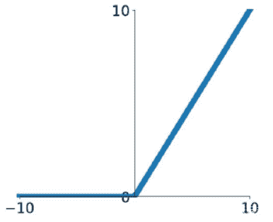
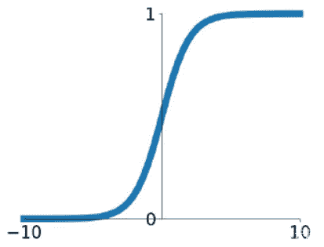
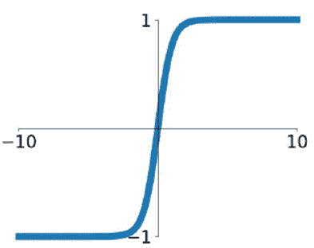

# 瓜子二手车 2019 秋招算法笔试卷 1

## 1

关于 C++中的 new 和 C 语言中的 malloc，以下说法哪几个是正确的：（）

正确答案: A   你的答案: 空 (错误)

```cpp
都是用来申请内存的
```

```cpp
都是函数
```

```cpp
都会调用构造函数
```

```cpp
他们没有区别，都一样
```

本题知识点

Java 工程师 C++工程师 算法工程师 瓜子二手车 C++ 2019

讨论

[我真的不是来学 bug 的](https://www.nowcoder.com/profile/325580003)

这道题选 AB 中 malloc 是库函数，而 new 是操作符 C 是错误的，因为编译器无权调用库函数来执行构造函数和析构，无法满足创造动态对象的要求，所以才有了 new 和 delete

发表于 2019-09-16 11:12:21

* * *

[沐晴 201908291618952](https://www.nowcoder.com/profile/132582046)

A

发表于 2019-09-03 18:04:09

* * *

[1 沃尔克](https://www.nowcoder.com/profile/642523698)

A

发表于 2019-11-09 17:02:49

* * *

## 2

以下属于生成式模型的是：（）

正确答案: C   你的答案: 空 (错误)

```cpp
SVM
```

```cpp
随机森林
```

```cpp
隐马尔可夫模型 HMM
```

```cpp
逻辑回归
```

本题知识点

Java 工程师 C++工程师 算法工程师 瓜子二手车 机器学习 2019

讨论

[dongyingjie](https://www.nowcoder.com/profile/465254870)

典型生成式模型：朴素贝叶斯和隐马尔可夫模型

发表于 2019-08-24 16:30:33

* * *

[小坤儿](https://www.nowcoder.com/profile/563958688)

常见的生成式模型有 隐马尔可夫模型 HMM、朴素贝叶斯模型、高斯混合模型 GMM、LDA 等。

发表于 2020-03-26 19:48:47

* * *

[luna_rayu](https://www.nowcoder.com/profile/104496533)

生成式模型包括 HMM（隐马尔可夫模型），GMM（高斯混合模型），LDA（线性判别模型），朴素贝叶斯模型

发表于 2021-10-25 17:11:37

* * *

## 3

关于快速排序算法的说法中，哪几个是正确的：（）

正确答案: B C   你的答案: 空 (错误)

```cpp
时间复杂度最坏是（nlogn)
```

```cpp
时间复杂度均摊是(nlogn)
```

```cpp
排序是不稳定的
```

本题知识点

Java 工程师 C++工程师 算法工程师 瓜子二手车 排序 *2019* *讨论

[我是一个没有感情的...](https://www.nowcoder.com/profile/176660216)

最差是 n²

发表于 2019-11-23 16:24:19

* * *

[小皮的梦想](https://www.nowcoder.com/profile/586612807)

答案错误

发表于 2020-02-01 16:18:26

* * *

[你永远得不到的祖奶奶](https://www.nowcoder.com/profile/855996890)

快速排序的是不稳定的。
快速排序最优的情况下时间复杂度为：O( nlogn )
快速排序最差的情况下时间复杂度为：O( n² )

发表于 2020-05-23 16:42:23

* * *

## 4

以下哪些机器学习算法可以不对特征做归一化处理：（）

正确答案: A D   你的答案: 空 (错误)

```cpp
随机森林
```

```cpp
逻辑回归
```

```cpp
SVM
```

```cpp
GBDT
```

本题知识点

Java 工程师 C++工程师 算法工程师 瓜子二手车 机器学习 2019

讨论

[Peter_Jiang](https://www.nowcoder.com/profile/5454255)

树模型一般不需要做归一化处理，做归一化处理的目的主要为了使同一特征的取值在同一量纲，降低方差太大带来的影响。树模型并不关心特征的具体取值，只关心特征取值的分布。

发表于 2019-08-23 11:31:35

* * *

[Fratio](https://www.nowcoder.com/profile/5182467)

    树模型本身不需要归一化，因为归一化是为了使梯度下降时损失函数尽快的收敛，而树模型不需要梯度下降,是通过寻找最优切分点来使损失函数下降

发表于 2019-10-24 12:35:56

* * *

[四星](https://www.nowcoder.com/profile/559112270)

归一化不是由方法决定的，而是由数据决定的

发表于 2019-08-09 00:07:21

* * *

## 5

以下可以有效解决过拟合的方法是：（）

正确答案: A B D   你的答案: 空 (错误)

```cpp
增加样本数量
```

```cpp
通过特征选择减少特征数量
```

```cpp
训练更多的迭代次数
```

```cpp
采用正则化方法
```

本题知识点

Java 工程师 C++工程师 算法工程师 瓜子二手车 机器学习 2019

讨论

[stay_foolish](https://www.nowcoder.com/profile/777736105)

过拟合的意思是在训练集上的准确率很高，但是在测试集上泛化能力不强，既然在训练集上已经取得了很好的效果，那么增加训练迭代次数显然不会防止过拟合，增加样本数量可以学习到更多样本的特征，减少不必要的特征数量和采用正则化都可以防止过拟合。

发表于 2019-09-04 09:59:04

* * *

[Snow2021](https://www.nowcoder.com/profile/274464825)

B 正确的原因：去除非共性特征，增强泛化能力，较少过拟合。

发表于 2021-06-17 16:13:39

* * *

[time 言颜](https://www.nowcoder.com/profile/647087179)

D

发表于 2020-03-05 21:10:59

* * *

## 6

在某神经网络的隐层输出中，包含 0.75，那么该神经网络采用的激活函数可能是（）

正确答案: A B C   你的答案: 空 (错误)

```cpp
sigmoid
```

```cpp
tanh
```

```cpp
relu
```

本题知识点

Java 工程师 C++工程师 算法工程师 瓜子二手车 机器学习 2019

讨论

[张云超](https://www.nowcoder.com/profile/3386783)

                    ReLu                                         Sigmoid                                         Tanh 

发表于 2019-08-09 16:49:45

* * *

[不吃鱼的 Jow](https://www.nowcoder.com/profile/185329819)

sigmoid-->tanh--->relu，值域:(0,1)-->(-1,1)-->[0,+∞)

发表于 2021-03-01 17:01:09

* * *

[SnowKingNo1](https://www.nowcoder.com/profile/997354900)

这题考的是值域？

发表于 2019-09-10 13:43:48

* * *

## 7

对于任意一棵二叉树，如果其叶结点数为 N0，而度数为 2 的结点总数为？1

你的答案 (错误)

1 参考答案 (1) N0-1

本题知识点

Java 工程师 C++工程师 算法工程师 瓜子二手车 树 2019

讨论

[K1890](https://www.nowcoder.com/profile/1559168)

证明过程如下：
假设二叉树的 0 度,1 度,2 度结点为 n0,n1,n2,总节点数为 T
则有按照结点求和的
T = n0 + n1 + n2 （1）
按照边求和得：
T = n1 + 2 * n2 + 1 （2）
所以 （2） - （1）可得
n2 + 1 - n0 = 0
所以 n0 = n2 + 1

发表于 2019-08-11 13:16:22

* * *

[零葬](https://www.nowcoder.com/profile/75718849)

特殊值法：既然任意二叉树都满足，那随便举一个满二叉树肯定也满足，假如有一棵有 7 个节点的满二叉树，度为 0 的节点为叶子节点，一共 N0=4 个，度为 2 的节点为非叶子节点，一共 N2=3 个，因此 N2=N0-1

发表于 2021-02-18 21:05:15

* * *

[雄心饽饽且谦恭温逊](https://www.nowcoder.com/profile/637550439)

N0－1

发表于 2020-05-21 22:22:37

* * *

## 8

有 6 个结点的无向图，至少应有 1 条边才能是一个连通图。

你的答案 (错误)

1 参考答案 (1) 5

本题知识点

Java 工程师 C++工程师 算法工程师 瓜子二手车 图 2019

讨论

[零葬](https://www.nowcoder.com/profile/75718849)

当 6 个节点用一条折线连接起来的时候所用的边最少，一共 5 条边

发表于 2021-02-18 21:06:17

* * *

[怦然心动鸭](https://www.nowcoder.com/profile/68151927)

5

发表于 2020-11-28 08:26:20

* * *

[雄心饽饽且谦恭温逊](https://www.nowcoder.com/profile/637550439)

5

发表于 2020-05-21 22:24:33

* * *

## 9

圆桌上有 1 到 1000 号，1 号右手边是 2 号，左手边是 1000 号。1 号开枪打死 2 号，把枪交给 3 号，3 号打死 4 号交给 5 号。。999 号打死 1000 号后把枪交给 1 号，继续循环。最后留下来的是几号？1

你的答案 (错误)

1 参考答案 (1) 977

本题知识点

Java 工程师 C++工程师 算法工程师 瓜子二手车 数学运算 2019

讨论

[top 涛](https://www.nowcoder.com/profile/726074)

1，2，3，4，.....             间隔 1，    1000 个   双数，下轮开头不变 1，3，5，7，.....             间隔 2，    500 个     双数，下轮开头不变 1，5，9，13，....            间隔 4，    250 个     双数，下轮开头不变 1，9，17，...                   间隔 8，    125 个    单数，下轮开头后移 1+16，1+16*2，...           间隔 16，   62 个     双数，下轮开头不变 1+16，...                          间隔 32，  31 个     单数，下轮开头后移 1+16+64，...                    间隔 64，  15 个     单数，下轮开头后移 1+16+64+128，...            间隔 128，7 个       单数，下轮开头后移 1+16+64+128+256          间隔 256，3 个       单数，下轮开头后移 1+16+64+128+256+512  间隔 512，1 个 1+16+64+128+256+512=977

编辑于 2019-09-09 17:23:13

* * *

[offer 祈求者](https://www.nowcoder.com/profile/263499610)

反向思考：假如最初只有一个细胞（细胞 a），它可以在右边分裂出一个，然后将分裂权交给自己的前一个细胞；（模拟杀人的反向流程，最终幸存者即这里的细胞 a）细胞数量变化：1->2, 2->4 , ... , 512->1024***可自己模拟这个过程，会发现细胞 a 始终在队列最左侧，第 1024 个细胞诞生的时候，分裂权也回到细胞 a 手中***由于只需要 1000 个细胞，由分裂权在手的 a 开始正向进行正常游戏的杀人过程（残忍地杀害 24 个，包括最终持枪者在内，整个过程中经过了 24 个活人）将最终持枪者设为 1 号，细胞 a 的编号就是 1 + 1000 - 24 = 977

发表于 2019-08-20 00:02:59

* * *

[Juniii](https://www.nowcoder.com/profile/107741662)

997 号

发表于 2021-05-05 18:51:34

* * *

## 10

若一序列进栈顺序为 a,b,c,d,e，问存在多少种可能的出栈序列 1

你的答案 (错误)

1 参考答案 (1) 42

本题知识点

Java 工程师 C++工程师 算法工程师 瓜子二手车 栈 *2019* *讨论

[漠上花开](https://www.nowcoder.com/profile/1734461)

出栈的种类数：1/(n+1) *C(2n,n)，即 1/6 * C(10,5)=42

发表于 2019-08-16 16:30:52

* * *

[K1890](https://www.nowcoder.com/profile/1559168)

卡特兰数

发表于 2019-08-11 13:38:23

* * *

[日久、长安](https://www.nowcoder.com/profile/2077156)

若有 n 个元素顺序入栈，则对应的出栈次序共有 f(n)=f（0）f（n-1）+f（1）f（n-2）+……+f（n-1）f（0）

(其中 f(0)=1;f(1)=1);f(5)=42

发表于 2019-09-03 16:55:20

* * *

## 11

一个小朋友有 70 个玩具运往目的地，目的地距离小朋友 60 步。每次小朋友最多拿 40 个玩具，每走 2 步会掉一个玩具，则它最多能把 1 个玩具运到目的地

你的答案 (错误)

1 参考答案 (1) 20

本题知识点

Java 工程师 C++工程师 算法工程师 瓜子二手车 数学运算 2019

讨论

[受不鸟了](https://www.nowcoder.com/profile/363212535)

我是个**，完毕


发表于 2019-09-20 00:01:34

* * *

[Matilda201908161952493](https://www.nowcoder.com/profile/193044542)

先拿 40 个走到 30 步，掉 15 和还剩 25 个，放下回去拿剩下的 30 个掉 15 个还剩 15 个。15 加之前的 25，40 个走剩下的 30 步，最后还剩 25 个。

发表于 2019-08-24 14:37:49

* * *

[周阳杰](https://www.nowcoder.com/profile/883405538)

26 个，最后一个玩具会掉在终点

发表于 2020-03-06 18:31:03

* * *

## 12

一个栈的输入序列为 123...n，若输出序列的第一个元素是 n，输出的第 i（1<=i<=n）个元素是 1

你的答案 (错误)

1 参考答案 (1) n-i+1

本题知识点

Java 工程师 C++工程师 算法工程师 瓜子二手车 栈 *2019* *讨论

[零葬](https://www.nowcoder.com/profile/75718849)

第一个出栈的是 n，那么最后一个入栈的一定是 n，所以肯定是按 1,2,3，...，n 的顺序一直入栈，并且在整个过程中没有过出栈。出栈肯定是按 n，n-1，n-2, ..., 2,1 的顺序，第 i 项的通项公式为 n-i+1，也就是第 i 个出栈的元素。

发表于 2021-02-18 21:10:05

* * *

[雄心饽饽且谦恭温逊](https://www.nowcoder.com/profile/637550439)

n－i+1

发表于 2020-05-21 22:31:22

* * *

[漂流一只 Fan](https://www.nowcoder.com/profile/3441785)

n-i+1

发表于 2020-05-15 13:05:39

* * *

## 13

假如马路上每秒钟会有 5 辆车经过, 每 10 辆车里有 1 辆是通过瓜子平台交易的, 瓜子平台的车每 100 辆有 10 辆是大众的。那么在路边 1 秒可以看到 1 辆瓜子平台交易过的大众品牌车？（保留 2 位小数）

你的答案 (错误)

1 参考答案 (1) 20

本题知识点

Java 工程师 C++工程师 算法工程师 瓜子二手车 数学运算 2019

讨论

[菜鸡三号](https://www.nowcoder.com/profile/515363407)

每秒看到所求车辆的概率是 1/10 乘 10/100 乘 5=1/20，所以需要 20 秒

发表于 2019-09-09 14:39:50

* * *

[🍢🍢201902261717919](https://www.nowcoder.com/profile/84124321)

本来想写 20，一看有个保留 2 位小数，就写的 20.00，然后就错了。。。。。真是误导人😕😕

发表于 2019-08-24 00:18:06

* * *

[牛客 785388755 号](https://www.nowcoder.com/profile/785388755)

20

发表于 2020-11-10 20:50:58

* * *

## 14

逻辑回归中，若选 0.5 作为阈值区分正负样本，其决策平面是：1

你的答案 (错误)

1 参考答案 (1) wx+b＝0

本题知识点

Java 工程师 C++工程师 算法工程师 瓜子二手车 机器学习 2019

讨论

[FreddyHu](https://www.nowcoder.com/profile/919809891)

wx+b = 0

发表于 2019-09-11 13:46:21

* * *

[time 言颜](https://www.nowcoder.com/profile/647087179)

wx+b=0

发表于 2020-03-05 21:10:40

* * *

[ouyang001](https://www.nowcoder.com/profile/175018667)

wx+b = 0

发表于 2019-09-03 01:29:54

* * *

## 15

对 K 个不同字符的全排列组成的数组, 面试官从中随机拿走了一个, 剩下的数组作为输入, 请帮忙找出这个被拿走的字符串?
比如[“ABC”, “ACB”, “BAC”, “CAB”, “CBA”] 返回 “BCA”

你的答案

本题知识点

Java 工程师 C++工程师 算法工程师 瓜子二手车 2019

讨论

[张云超](https://www.nowcoder.com/profile/3386783)

```cpp
// 思路：设置一个数组用于接收每个字符串第 i 个位置的个数，一旦发现与其他值不一样那么就是缺少了这个字母，循环 k 次，得到字符
public String findStr(String[] strArray) {
    char[] charArray = strArray[0].toCharArray();
    int strArrayLen = strArray.length;
    int charArrayLen = charArray.length;
    int[] charNumArray = new int[charArrayLen];  // 实际没用到，只用了 temp，和 num。
    int num = 0;                                  //因为只有一个不一样，检查前后值就可以
    String retStr = "";
    for (int i = 0; i < charArrayLen; i++) {
        for (int j = 0; j < charArrayLen; j++ ){
            int temp = 0;
            for (int k = 0; k < strArrayLen; k++){
                if (strArray[k].charAt(i) == charArray[j]) {
                    temp++;
                }
            }
            if (j >= 1) {
                if (temp > num) {
                    retStr += String.valueOf(charArray[j-1]);
                    break;
                }
                if (temp < num) {
                    retStr += String.valueOf(charArray[j]);
                    break;
                }
            }
            num = temp;
            charNumArray[j] = num;
        }

    }
    return retStr;
}

```

编辑于 2019-08-09 16:45:52

* * *

[牛客 675980979 号](https://www.nowcoder.com/profile/675980979)

```cpp
#!/usr/bin/env python3.6.5
# -*- coding: UTF-8 -*-
"""
Author: yanyong
Date: 2020/10/10 20:00
docs: 

"""

#src = ['ABC','ACB','BAC','BCA','CAB','CBA']
src = input().split(',')
res = []
n = int(input())#输入一个数字，有时候也可以不要
for _ in range(n):#这里 n 有时候可以是具体数字
    s = input()
    if s != '':
        #temp_list = [int(j) for j in s.split()]#list int 直接得到 list
        temp_list = [j for j in s.split()]#list str 直接得到 list
        #print('temp_list',temp_list)
        res.append(temp_list[0])
    else:
        break
for ch in src:
    if ch not in res:
        print(ch)
```

发表于 2020-10-10 20:16:46

* * *

[牛客 910256587 号](https://www.nowcoder.com/profile/910256587)

**def hasLetters(result, letters, strs, length):
    if len(result) == length:
        if len(set(result)) == length and result not in strs:
            return result
        return None    for letter in letters:
        temp = result.copy()
        temp.append(letter)
        tempResult = hasLetters(temp, letters, strs, length)
        if tempResult != None:
            return tempResult
    return None
num = int(input())
strs = []
for i in range(num):
    strs.append([var for var in input()])letters = [var for var in strs[0]]
length = len(letters)
for letter in letters:
    result = []
    result += letter    result = hasLetters(result, letters, strs, length)
    if result != None:
        breakprint(''.join(result))**

发表于 2019-12-24 18:59:21

* * *

## 16

句子反转，如“I am a boy.”,反转完为“boy. a am I”

你的答案

本题知识点

Java 工程师 C++工程师 算法工程师 瓜子二手车 2019

讨论

[零葬](https://www.nowcoder.com/profile/75718849)

```cpp
print(input().split(" ")[::-1])
```

发表于 2021-02-18 20:53:40

* * *

[dream_seeker2020](https://www.nowcoder.com/profile/836330035)

```cpp
list1 = str(input())
list2 = [x for x in list1.split(' ')]
list2.reverse()
res = ''
for t in range(len(list2)):
    res = res+' '+(list2[t])
print(list2)
print(res)
```

发表于 2019-09-15 21:13:44

* * *

[北百啊👋吧](https://www.nowcoder.com/profile/2763526)

public static String reverse(String srr){    String[] arr = srr.split(" ");
    for(int i=arr.length-1;i>-1;i++){        if(i==0)
            System.out.print(arr[i]);
        else
            System.out.print(arr[i]+" “);
    }
}

发表于 2019-09-12 18:20:03

* * ****