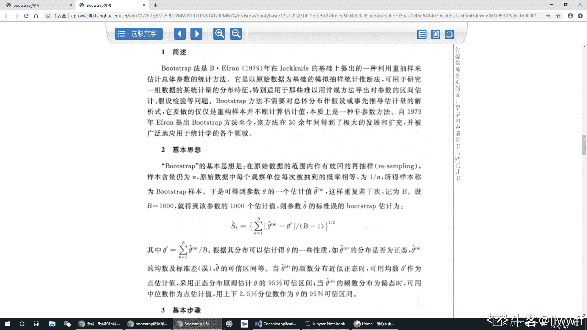
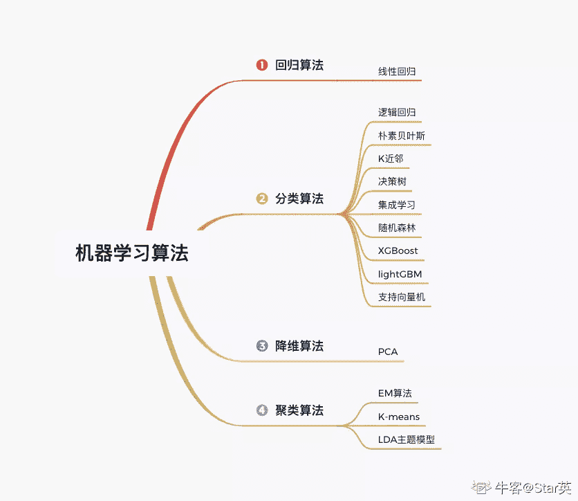
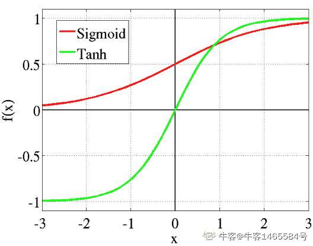
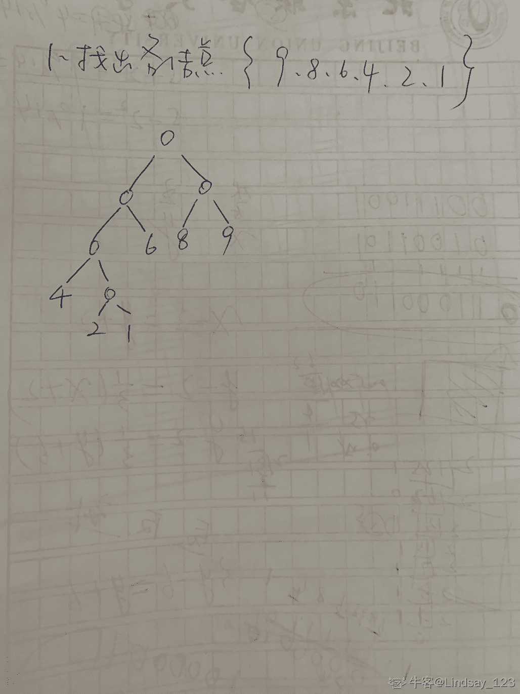

# 瓜子二手车 2019 秋招算法笔试卷 2

## 1

下列属于无监督学习的模型是：（）

正确答案: A   你的答案: 空 (错误)

```cpp
Kmeans
```

```cpp
KNN
```

```cpp
SVM
```

```cpp
决策树
```

本题知识点

Java 工程师 C++工程师 算法工程师 瓜子二手车 机器学习 2019

讨论

[小坤儿](https://www.nowcoder.com/profile/563958688)

有监督（分类，回归） 无监督（聚类，降维）

发表于 2020-03-26 19:33:33

* * *

[laolu](https://www.nowcoder.com/profile/159952392)

AK-means 算法为无监督的聚类算法

发表于 2019-09-07 14:19:50

* * *

[给我 adc 能秀](https://www.nowcoder.com/profile/580209303)

knn 也是无监督

发表于 2020-07-29 00:26:33

* * *

## 2

bootstrap 数据是什么意思？

正确答案: C   你的答案: 空 (错误)

```cpp
有放回地从总共 M 个特征中抽样 m 个特征
```

```cpp
无放回地从总共 M 个特征中抽样 m 个特征
```

```cpp
有放回地从总共 N 个样本中抽样 n 个样本
```

```cpp
无放回地从总共 N 个样本中抽样 n 个样本
```

本题知识点

Java 工程师 C++工程师 算法工程师 瓜子二手车 机器学习 概率统计 *2019 概率论与数理统计* *讨论

[夜是故乡明](https://www.nowcoder.com/profile/6432095)

bootstrap**统计抽样方法**：**有放回地**从总共 N 个样本中抽样 n 个样本。

基于**bootstrap**，有以下常用的机器学习方法

*   boosting
*   bagging
*   random forest（RF, 随机森林）

发表于 2019-09-07 15:25:02

* * *

[my_offers](https://www.nowcoder.com/profile/955911576)

```cpp
**有放回,抽取部分样本 **
```

发表于 2019-10-07 21:03:55

* * *

[皮小雨](https://www.nowcoder.com/profile/240699026)

C

发表于 2019-10-10 00:29:51

* * *

## 3

以下哪些模型是分类模型：（）

正确答案: A C D   你的答案: 空 (错误)

```cpp
KNN
```

```cpp
Kmeans
```

```cpp
Naïve Bayesian
```

```cpp
Logistic Regression
```

本题知识点

Java 工程师 C++工程师 算法工程师 瓜子二手车 机器学习 2019

讨论

[Star 英](https://www.nowcoder.com/profile/955338601)



发表于 2020-08-09 16:24:07

* * *

[DE.Noah](https://www.nowcoder.com/profile/303717846)

聚类不就是无监督分类吗，为啥不能算作分类模型，求解答

发表于 2021-03-15 18:59:05

* * *

[菜鸡准备转岗](https://www.nowcoder.com/profile/836159636)

朴素贝叶斯 不能分类吗。。额

编辑于 2019-08-29 12:52:25

* * *

## 4

以下可以有效解决过拟合的方法是：（）

正确答案: A D   你的答案: 空 (错误)

```cpp
增加样本数量
```

```cpp
增加特征数量
```

```cpp
训练更多的迭代次数
```

```cpp
采用正则化方法
```

本题知识点

Java 工程师 C++工程师 算法工程师 瓜子二手车 机器学习 2019

讨论

[C(❁´ω`❁)](https://www.nowcoder.com/profile/160289460)

过拟合的意思就是，这个模型在你的训练集上表现的特别好（预测准确率高），但是在测试集上表现的不是很好。首先增加样本数量，会让你的模型更加的趋近于真实值，真实的样本越多，你的模型就越好。增加特征会让你的模型更加复杂，其实就是更加过拟合。训练更多的迭代次数也是，会让你的模型，更加偏向于训练集训练出来的结果，而不是测试集的。正则化就是一个减少过拟合的很有效的手段，具体解释很长，涉及到很多数学方面的证明，有兴趣的话可以去搜一搜 L1 L2 正则化，挺有意思的只是一个平时自己瞎看看书的码农，个人拙见，在此分享，欢迎留言讨论

发表于 2019-08-31 18:00:46

* * *

[Peter_Jiang](https://www.nowcoder.com/profile/5454255)

过拟合产生的原因主要有两个 ：样本数量少；模型复杂度高

发表于 2019-08-31 14:57:28

* * *

[小坤儿](https://www.nowcoder.com/profile/563958688)

过拟合：获取更多训练实例； 减少特征数量； 增加正则化成度（拉姆达）。 欠拟合：获得更多特征； 增加多项式特征； 减少正则化（拉姆达）。

发表于 2020-03-26 19:42:15

* * *

## 5

在某神经网络的隐层输出中，包含-1.5，那么该神经网络采用的激活函数不可能是（）

正确答案: A B C   你的答案: 空 (错误)

```cpp
sigmoid
```

```cpp
tanh
```

```cpp
relu
```

本题知识点

Java 工程师 C++工程师 算法工程师 瓜子二手车 机器学习 2019

讨论

[Lindsay_123](https://www.nowcoder.com/profile/988889853)

sigmoid 函数映射之后取值范围为（0，1）tanh 函数映射之后取值范围（-1，1）Relu 函数映射之后取值范围（0，..）大宇等于 0 所以 abc 都不对

发表于 2019-08-15 21:21:41

* * *

[牛客 1465584 号](https://www.nowcoder.com/profile/1465584)

tanh(x)的公式为： 
其图像如下，函数可以将元素的值变换到-1 和 1 之间：


发表于 2020-04-19 19:12:46

* * *

[寒夏](https://www.nowcoder.com/profile/7911594)

sigmoid 函数的取值范围为（0，1）Relu 函数的取值范围为[0, +..)tanh 的取值范围为（-..,+..）因此不可能的应选择 A 与 C 才对啊

发表于 2019-08-17 17:17:03

* * *

## 6

一个小朋友有 70 个玩具运往目的地，目的地距离小朋友 60 步。每次小朋友最多拿 40 个玩具，每走 2 步会掉一个玩具，则它最多能把 1 个玩具运到目的地

你的答案 (错误)

1 参考答案 (1) 20

本题知识点

Java 工程师 C++工程师 算法工程师 瓜子二手车 2019

讨论

[意识流选手](https://www.nowcoder.com/profile/97302105)

"目的地 60 步，每 2 步丢 1 个"可以当作"目的地 30 步，每 1 步丢 1 个"；
小朋友拿 40 个走了 15 步，放下手里剩下的 25 个；
小朋友空手回去拿 30 个，走 15 步后还剩下 15 个；
小朋友拿起剩下一共的 40 个，走完最后 15 步，还剩下 25 个。

有什么问题吗？？？

发表于 2019-08-09 11:16:54

* * *

[时间之外的往事 mrgui](https://www.nowcoder.com/profile/6083332)

掉地上了就不能待会回来捡起来么...好吧，就算不能吧，为啥不是 25？

发表于 2019-08-28 16:14:23

* * *

[大佬求带。。](https://www.nowcoder.com/profile/248966335)

为啥不是 25？？？？？？？？？？？？？

发表于 2019-08-22 15:36:35

* * *

## 7

设哈希表长 m＝14，哈希函数 H（key）＝key％11。表中已有 4 个结点：addr(15)=4，addr(38)=5，addr(61)=6，addr(84)=7，其余地址为空。如果用二次探测再散列处理冲突，关键字为 49 的结点的地址是 1

你的答案 (错误)

1 参考答案 (1) 9

本题知识点

Java 工程师 C++工程师 算法工程师 瓜子二手车 2019

讨论

[跟谁学算法工程师](https://www.nowcoder.com/profile/2397388)

15，38，61，84 用哈希函数 H(key)=key%11 计算后得地址:4,5,6,7
49 计算后为 5,发生冲突.
用二次探测再散列法解决冲突:
1:(key+1²)%11=(49+1)%11=6,仍然发生冲突.
2:(key-1²)%11=(49-1)%11=4,仍然发生冲突.
3:(key+2²)%11=(49+4)%11=9,不再发生冲突.
得出结果为 D

发表于 2019-08-25 12:24:16

* * *

[Turing_Yang](https://www.nowcoder.com/profile/914668845)

1²,-1²,.....k²,-k² 先正后负，搞反了

发表于 2019-08-14 16:49:19

* * *

## 8

X=+0111001,Y=+1001101,求[X-Y]补=1

你的答案 (错误)

1 参考答案 (1) 11101100

本题知识点

Java 工程师 C++工程师 算法工程师 瓜子二手车 2019

讨论

[意识流选手](https://www.nowcoder.com/profile/97302105)

**二进制的原码、反码、补码**
对于有符号数而言：

*   二进制的最高位是符号位：0 表示正数(+)，1 表示负数(-)
*   正数的原码、反码、补码都一样
*   负数的反码 = 它的符号位不变，其他位取反
*   负数的补码 = 它的反码 +1
*   0 的反码、补码都是 0

发表于 2019-08-09 11:24:50

* * *

[讯飞内推官](https://www.nowcoder.com/profile/565311518)

x[补] = 0011 1001；y[补] = 0100 1101，-y[补] = 1011 0011；答案：0011 1001 + 1011 0011 = 1110 1100 

发表于 2019-08-09 10:36:59

* * *

[FearIsUnreal](https://www.nowcoder.com/profile/2825614)

**已知：[X-Y]补 = [X]补-[Y]补 = [X]补+[-Y]补**             Y = **0**100 1101
           -Y = **1**100 1101（负数符号位为 0）
则 [-Y]反 = **1**011  0010（符号位不变，其他位置按位取反）
则 [-Y]补 = **1**011  0011  （反码+1）
      [X]补 = 0011 1001
--------------------------
(相加得)  = 1110  1100

发表于 2019-08-22 23:04:07

* * *

## 9

-125 的反码是多少 1

你的答案 (错误)

1 参考答案 (1) 10000010

本题知识点

Java 工程师 C++工程师 算法工程师 瓜子二手车 2019

讨论

[胖子丟掉](https://www.nowcoder.com/profile/652649055)

-125 的原码为 1111 1101，反码除第一位负位不动外，其他均变成相反，最终为 1000 0010

发表于 2019-08-07 16:22:32

* * *

[大佬求带。。](https://www.nowcoder.com/profile/248966335)

一不小心把答案写成了-2。。。标准答案居然是二进制。。

发表于 2019-08-22 17:28:21

* * *

[sea_sid](https://www.nowcoder.com/profile/304610805)

+125 原码反码补码：01111101

发表于 2019-08-07 10:06:08

* * *

## 10

以数据集{1,6,8,2,9,4}为权值构造一棵赫夫曼树，其带权路径长度为 1

你的答案 (错误)

1 参考答案 (1) 70

本题知识点

Java 工程师 C++工程师 算法工程师 瓜子二手车 2019

讨论

[Lindsay_123](https://www.nowcoder.com/profile/988889853)



发表于 2019-08-16 08:37:20

* * *

[冯海霞](https://www.nowcoder.com/profile/596808863)

构建哈夫曼树的过程——权重越大的结点离树根越近

对于给定的有各自权值的 n 个结点，构建哈夫曼树有一个行之有效的办法：

1.  在 n 个权值中选出两个最小的权值，对应的两个结点组成一个新的二叉树，且新二叉树的根结点的权值为左右孩子权值的和；
2.  在原有的 n 个权值中删除那两个最小的权值，同时将新的权值加入到 n–2 个权值的行列中，以此类推；
3.  重复 1 和 2 ，直到所以的结点构建成了一棵二叉树为止，这棵树就是哈夫曼树。

发表于 2019-08-28 17:22:11

* * *

## 11

组成数字 1 到 1234 的所有数字的各位的总和是 1

你的答案 (错误)

1 参考答案 (1) 15895

本题知识点

Java 工程师 C++工程师 算法工程师 瓜子二手车 2019

讨论

[大佬求带。。](https://www.nowcoder.com/profile/248966335)

1.首先计算 000-999 的各位之和=1000*3*1/10*（0+1+2+..9）=135002.计算 00-99 的各位之和=100*2*1/10*（0+1+...9）=9003.由 2 可以计算出 1000-1199 的各位之和=1*200+1*100+900*2=21004.计算 1200-1229 的各位之和=1*30+2*30+1*10+2*10+（0+1+...9）*3= 2555.计算 1230-1234 的各位之和=1*5+2*5+3*5+0+1+2+3+4=40 综上 1-1234 各位之和为=13500+2100+255+40=15895

发表于 2019-08-22 21:17:14

* * *

[寒夏](https://www.nowcoder.com/profile/7911594)

```cpp
i = 1
list_i = []
while i<=1234:
	list_i.append(i)
	i += 1
sum = 0
for i in range(len(list_i)):
	str_i = str(list_i[i])
	for j in range(len(str_i)):
		sum += int(str_i[j])
print(sum)
```

结果为：15895

发表于 2019-08-17 17:30:19

* * *

[牛客 991352531 号](https://www.nowcoder.com/profile/991352531)

```cpp
        StringBuffer sb = new StringBuffer();
        for (int i = 1; i <= 1234; i++) {
            sb.append(i);
        }
        String s = sb.toString();
        int sum = 0;
        for (int i = 0; i < s.length(); i++) {
            char c = s.charAt(i);
            String ss = String.valueOf(c);
            int j = Integer.valueOf(ss);
            sum+=j;
        }
        System.out.println(sum); 
结果为：15895
```

发表于 2020-10-13 20:04:23

* * *

## 12

小李和小王各有书籍若干本，小李对小王说：“我如果给你 2 本，我们的书将一样多。”小王说：“我如果给你 2 本，我的书籍数量将只有你的三分之一。”请问，小李和小王共有书籍 1

你的答案 (错误)

1 参考答案 (1) 16

本题知识点

Java 工程师 C++工程师 算法工程师 瓜子二手车 2019

讨论

[创始元灵](https://www.nowcoder.com/profile/220889961)

x-2=y+4x+2=3(y-2)y=6x=10

编辑于 2019-08-29 09:08:17

* * *

[老板可乐不加冰](https://www.nowcoder.com/profile/799568095)

可以按照二元一次方程的思路，来解一个二元一次方程。

发表于 2019-08-13 23:29:30

* * *

## 13

有一段楼梯台阶有 100 级台阶，以小明的脚力第 n 步能跨 n 级，请问小明登上这段楼梯需要多少步 1

你的答案 (错误)

1 参考答案 (1) 14

本题知识点

Java 工程师 C++工程师 算法工程师 瓜子二手车 2019

讨论

[大佬求带。。](https://www.nowcoder.com/profile/248966335)

等差数列求和，,n=14

发表于 2019-08-22 17:32:12

* * *

## 14

一颗完全二叉树的节点数量为 666，那么这棵树上的叶子节点数为 1

你的答案 (错误)

1 参考答案 (1) 333

本题知识点

Java 工程师 C++工程师 算法工程师 瓜子二手车 2019

讨论

[你电瓶车](https://www.nowcoder.com/profile/60568714)

总节点个数为偶数：则 no+n1+n2 = 666;n1 = 1;n-1 = 2n2+n1;结果 n0 = 333;总节点个数为奇数：则 no+n1+n2 = n;n1 = 0;n-1 = 2n2+n1;结果 n0;

发表于 2019-08-08 19:52:35

* * *

[大佬求带。。](https://www.nowcoder.com/profile/248966335)

完全二叉树叶子节点数=向上取整

发表于 2019-08-22 17:33:13

* * *

## 15

逻辑回归中，若选 0.5 作为阈值区分正负样本，其决策平面是：1

你的答案 (错误)

1 参考答案 (1) wx+b＝0

本题知识点

Java 工程师 C++工程师 算法工程师 瓜子二手车 机器学习 2019

讨论

[学而复始](https://www.nowcoder.com/profile/284666872)

逻辑回归和 svm 默认的决策超平面都是 wx+b = 0\.逻辑回归中，y = 1/(1+e^(wx+b)),当 0.5 作为划分，y=0.5，e^(wx+b)=1，即 wx+b=0

发表于 2019-08-14 15:33:05

* * *

## 16

有 1 分，2 分，5 分，10 分四种硬币，每种硬币数量无限，给定 n 分钱(n<10000)，有多少中组合可以组成 n 分钱？

你的答案

本题知识点

Java 工程师 C++工程师 算法工程师 瓜子二手车 2019

讨论

[spm](https://www.nowcoder.com/profile/221603674)

应该从硬币种类开始循环，如果是从从每个 n 开始，会出现重复情况，比如计算第三个（n=3）时，依次放入 1 2 和 2 1 是重复得，却计算了 2 次。 

```cpp
def f(n):
    V = [1,2,5,10] A = [0,0,0]
    C = [0 for _ in range(n+1)]
    C[0] = 1  for v in V: for i in range(v,n+1): if i -v >=0:
                C[i] += C[i-v] return C
n = int(input())
C = f(n) print(C[n])

```

发表于 2019-08-15 23:32:47

* * *

[零葬](https://www.nowcoder.com/profile/75718849)

```cpp
n = int(input())
# 背包问题
candidates = [1, 2, 5, 10]
dp = [0]*(n + 1)
for c in candidates:
    for i in range(c, n + 1):
        dp[i] += dp[i - c]
print(dp[n])
```

发表于 2021-02-19 12:04:40

* * *

[林某人](https://www.nowcoder.com/profile/733425463)

# 首先，1 元只有一种表示方式[1]，2 元有两种表示方式[2,  (1)]，5 元有四种表示方式[5, (2)]，10 元有 8 种表示方式[10, (5), (5,2,1), (2), (1)]# 对于任意的 n

```cpp
a = n / 10
b = n % 10
c = b / 5
d = b % 5
e = d / 2
f  =  d  %  2

sum_numb = a*8 + c*4 + e*2 + f
```

发表于 2019-08-21 22:17:25

* * *

## 17

给定 n 个柱面的高度，表示降雨某地 n 块区域的海拔高度。
计算降雨之后该地最大储水面积。如果低于地平线，也就是小于 0，则一定积水

你的答案

本题知识点

Java 工程师 C++工程师 算法工程师 瓜子二手车 2019

讨论

[零葬](https://www.nowcoder.com/profile/75718849)

leetcode 第 42 题——接雨水

```cpp
class Solution {
    public int trap(int[] height) {
        if(height == null || height.length == 0) return 0;
        int left = 0, right = height.length - 1;
        int lmax = height[left], rmax = height[right];
        int result = 0;
        while(left <= right) {
            lmax = Math.max(lmax, height[left]);
            rmax = Math.max(rmax, height[right]);
            if(lmax < rmax){
                result += lmax - height[left];
                left ++;
            }else{
                result += rmax - height[right];
                right --;
            }
        }
        return result;
    }
}
```

发表于 2021-02-19 12:19:02

* * *

[lazywg](https://www.nowcoder.com/profile/962588)

```cpp
/**
	 * [1,3,5,2,6,0,9,10,8,2,7]
	 * 
	 * @param ary
	 * @return
	 */
	public static int caclPonding(int[] ary) {
		int maxIndex = findMaxIndex(ary);
		// 左右分开计算
		int sumLeft = caclLeftPonding(ary, 0, maxIndex);
		int sumRight = caclRightPonding(ary, maxIndex, ary.length - 1);
		return sumLeft + sumRight;
	}

	private static int caclLeftPonding(int[] ary, int startIndex, int endIndex) {
		if (startIndex == endIndex) {// 递归终止
			return 0;
		}
		int leftMaxIndex = findLeftMaxIndex(ary, startIndex, endIndex);
		int ponding = caclPonding(ary, leftMaxIndex, endIndex);
		return ponding + caclLeftPonding(ary, startIndex, leftMaxIndex);
	}

	private static int caclRightPonding(int[] ary, int startIndex, int endIndex) {
		if (startIndex == endIndex) {// 递归终止
			return 0;
		}
		int rightMaxIndex = findRightMaxIndex(ary, startIndex, endIndex);
		int ponding = caclPonding(ary, startIndex, rightMaxIndex);
		return ponding + caclRightPonding(ary, rightMaxIndex, endIndex);
	}

	private static int caclPonding(int[] ary, int startIndex, int endIndex) {
		if (endIndex - startIndex < 2) {
			return 0;
		}
		int width = endIndex - startIndex - 1;// 间隔数
		int height = ary[startIndex] > ary[endIndex] ? ary[endIndex] : ary[startIndex];// 取小值
		int sum = 0;
		// 内部实体面积
		for (int i = (startIndex + 1); i < endIndex; i++) {
			sum += ary[i];
		}
		return width * height - sum;
	}

	public static int findMaxIndex(int[] ary) {
		int maxIndex = 0;
		int max = ary[maxIndex];
		int length = ary.length;
		for (int i = 1; i < length; i++) {
			if (ary[i] > max) {
				max = ary[i];
				maxIndex = i;
			}
		}
		return maxIndex;
	}

	public static int findLeftMaxIndex(int[] ary, int startIndex, int endIndex) {
		int maxIndex = startIndex;
		int max = ary[maxIndex];
		for (int i = startIndex; i < endIndex; i++) {
			if (ary[i] >= max) {// 相等取最新的下标
				max = ary[i];
				maxIndex = i;
			}
		}
		return maxIndex;
	}

	public static int findRightMaxIndex(int[] ary, int startIndex, int endIndex) {
		int maxIndex = endIndex;
		int max = ary[maxIndex];
		for (int i = endIndex; i > startIndex; i--) {
			if (ary[i] >= max) {
				max = ary[i];
				maxIndex = i;
			}
		}
		return maxIndex;
	}
```

发表于 2020-02-13 20:13:54

* * *

[cincin 是菜鸡](https://www.nowcoder.com/profile/936525172)

这是 LeetCode 第 42 题，本质上需要维护一个栈的数据结构，遇到比自己大的数就出栈。

发表于 2019-08-22 13:48:29

* * **