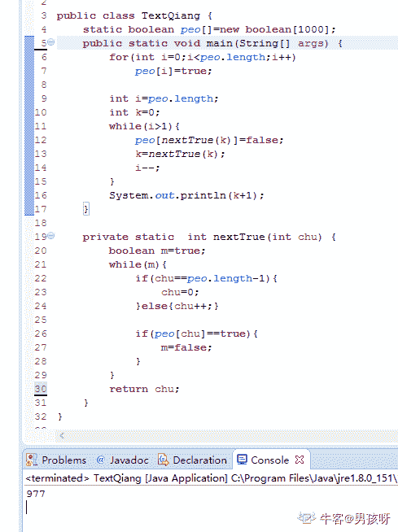

# 瓜子二手车 2019 秋招研发笔试卷 2

## 1

关于 C++中的 new 和 C 语言中的 malloc，以下说法哪几个是正确的：（）

正确答案: A   你的答案: 空 (错误)

```cpp
都是用来申请内存的
```

```cpp
都是函数
```

```cpp
都会调用构造函数
```

```cpp
他们没有区别，都一样
```

本题知识点

Java 工程师 C++工程师 瓜子二手车 C++ 2019

讨论

[我真的不是来学 bug 的](https://www.nowcoder.com/profile/325580003)

这道题选 AB 中 malloc 是库函数，而 new 是操作符 C 是错误的，因为编译器无权调用库函数来执行构造函数和析构，无法满足创造动态对象的要求，所以才有了 new 和 delete

发表于 2019-09-16 11:13:25

* * *

[贝雷帽 keeper](https://www.nowcoder.com/profile/204728944)

**malloc**是 C 语言中的的**标准库函数**，**new**是 C++的**运算符**。它们都可用于申请动态内存和释放内存。由于 malloc 是库函数而不是运算符，不在编译器控制权限之内，不能够把执行构造函数和析构函数的任务强加于 malloc。

发表于 2020-03-07 15:44:18

* * *

[_ 我在这呢](https://www.nowcoder.com/profile/785820120)

这里为附加一些 new 和 malloc 的区别：        1，malloc 是库函数，而 new 是操作符
        2，malloc 需要申请内存大小，new 不需要
        3，malloc 返回的指针类型需要进行强转，但是 new 不需要
        4，malloc 不能进行重载，但是 new 可以
        5，底层实现原理不同：
                malloc 底层原理实现：当开辟的空间小于 128k 时，调用 brk（）函数，当开辟的空间大于 128k 时，调用 mmap（），malloc 采用的是
                                  内存池的管理方式，先申请大块内存作为堆区，然后将堆区分为多个内存块，当用户申请时，就调出一块合适的给用户，
                new 底层原理实现：
                            1，创建一个新的对象
                            2，将构造函数的作用域赋值给这个新的对象
                            3，执行构造函数中的代码
                            4，返回新对象

发表于 2021-11-17 13:22:14

* * *

## 2

关于 CPU load 的说法，哪个是正确的：（）

正确答案: B   你的答案: 空 (错误)

```cpp
是当前系统的进程数量
```

```cpp
是当前系统中所有 ready 和 running 状态的进程数量
```

```cpp
是当前系统中 running 状态的进程数量
```

本题知识点

Java 工程师 C++工程师 瓜子二手车 2019

讨论

[我的天鸭](https://www.nowcoder.com/profile/243498)

CPU load 可以这样来理解：假设一个单核单处理器的 CPU 是一条单向车道，车太多了的话所有车都排成一条线通过如果别人需要知道这条路上的流量到底是多少，一个相当好的指标就是某一时间有多少车在等待：如果没有车在等待，那么新来的车可以直接通过，如果有车在排队了，新来的车就要延迟通过所以我们用 CPU load 来表示这条车道上的车流量：
0.00 表示路上没有任何流量，事实上 0.00 到 1.00 之间的值都表示这条公路上没有任何阻塞 1.00 表示这条路刚好达到最大容量，如果再多一辆车，就要排队了**排队的车就是 ready，路上的车就是 running**

发表于 2019-08-14 17:08:40

* * *

[Thanksfornowcoder](https://www.nowcoder.com/profile/884233164)

 Unix 将 CPU 负载定义为运行队列的长度：当前**正在运行**的进程数与**正在等待****（排队）**的进程数之和。

发表于 2020-05-16 12:27:41

* * *

## 3

关于快速排序算法的说法中，哪几个是正确的：（）

正确答案: B C   你的答案: 空 (错误)

```cpp
时间复杂度最坏是（nlogn)
```

```cpp
时间复杂度均摊是(nlogn)
```

```cpp
排序是不稳定的
```

本题知识点

Java 工程师 C++工程师 瓜子二手车 排序 *2019* *讨论

[陌陌内推官](https://www.nowcoder.com/profile/946487877)

快速排序是一种交换排序。

大致过程：利用分治的思想，将原数列分成两部分，使得左边的元素都小于基准值，右边的元素都大于基准值。分别对左右两边进行递归，直至数列只有一个元素，最后得到的总数列即是有序的。

时间复杂度分析：

由于每次递归都将数列分为两部分，故每次时间复杂度都为 log2n，共有 n 个元素。在这种情况下，时间复杂度为 O（nlog2n）。当数列中的元素全部有序时，快排时间复杂度达到最高 O（n²）。所以它的平均时间复杂度为 O（nlog2n）

快排是一种不稳定的排序算法。

发表于 2019-08-20 10:50:11

* * *

[Juventus-🐂](https://www.nowcoder.com/profile/79434593)

时间复杂度均摊是 nlogn，排序不稳定

发表于 2022-02-16 15:54:48

* * *

[magggigigie](https://www.nowcoder.com/profile/991946954)

B

发表于 2019-11-14 20:03:05

* * *

## 4

关于虚拟内存的说法，正确的是：（）

正确答案: A D   你的答案: 空 (错误)

```cpp
虚拟内存隔离了各个进程的内存空间
```

```cpp
虚拟内存就是 swap 空间
```

```cpp
虚拟内存就是物理内存
```

```cpp
虚拟内存可以防止应用程序直接访问物理地址。
```

本题知识点

Java 工程师 C++工程师 瓜子二手车 操作系统 2019

讨论

[跟谁学算法工程师](https://www.nowcoder.com/profile/2397388)

首先，这两个概念分别对应 windows 和 linux，即：
windows：虚拟内存
linux：swap 分区

windows 即使物理内存没有用完也会去用到虚拟内存，而 Linux 不一样 Linux 只有当物理内存用完的时候才会去动用虚拟内存（即 swap 分区）

swap 类似于 windows 的虚拟内存，不同之处在于，Windows 可以设置在 windows 的任何盘符下面，默认是在 C 盘，可以和系统文件放在一个分区里。而 linux 则是独立占用一个分区，方便由于内存需求不够的情况下，把一部分内容放在 swap 分区里，待内存有空余的情况下再继续执行，也称之为交换分区，交换空间是其中的部分
windows 的虚拟内存是电脑自动设置的
Linux 的 swap 分区是你装系统的时候分好的

发表于 2019-08-26 14:14:24

* * *

[笛安](https://www.nowcoder.com/profile/134084179)

虚拟内存是 windows 下的定义，swap 是 Linux 下的定义，二者有区别

发表于 2019-08-13 23:58:16

* * *

[mercury_mky](https://www.nowcoder.com/profile/3038322)

虚拟内存(虚拟存储器)是**计算机系统内存管理**的一种技术，通常是借用一部分的硬盘空间来充当内存使用，以解决内存不足的问题。A： 正确 B：windows 下叫做虚拟内存，linux 下叫 swap 分区 C：虚拟内存不是物理内存。windows 即使物理内存没有用完也会去用到虚拟内存，而 Linux 不一样 Linux 只有当物理内存用完的时候才会去动用虚拟内存（即 swap 分区）D：正确

发表于 2022-01-05 19:51:54

* * *

## 5

对于任意一棵二叉树，如果其叶结点数为 N0，而度数为 2 的结点总数为 1

你的答案 (错误)

1 参考答案 (1) N0-1

本题知识点

Java 工程师 C++工程师 瓜子二手车 树 2019

讨论

[秃头披风侠 95](https://www.nowcoder.com/profile/911191045)

n=n0+n1+n2 则该二叉树总共会有 n-1 条边(入度总是为 1），度为 2 的结点会延伸出两条边
n-1 = 2*n2 + 1*n1 ，
则计算可知 n0=n2+1。

发表于 2019-08-16 10:38:30

* * *

[仙女培](https://www.nowcoder.com/profile/455710451)

n0-1

发表于 2020-03-27 19:58:18

* * *

[_ 老地方](https://www.nowcoder.com/profile/290616569)

n0-1

发表于 2019-11-14 23:57:43

* * *

## 6

有 6 个结点的无向图，至少应有 1 条边才能是一个连通图。

你的答案 (错误)

1 参考答案 (1) 5

本题知识点

Java 工程师 C++工程师 瓜子二手车 图 2019

讨论

[宇智波亦翼](https://www.nowcoder.com/profile/716891448)

n 个节点的无向图，需要 n-1 条边才是连通图

发表于 2019-08-10 17:06:48

* * *

[怦然心动鸭](https://www.nowcoder.com/profile/68151927)

5

发表于 2020-11-28 08:39:06

* * *

[我不是瑞龙](https://www.nowcoder.com/profile/383904550)

1

发表于 2020-09-28 17:50:13

* * *

## 7

圆桌上有 1 到 1000 号，1 号右手边是 2 号，左手边是 1000 号。1 号开枪打死 2 号，把枪交给 3 号，3 号打死 4 号交给 5 号。。999 号打死 1000 号后把枪交给 1 号，继续循环。最后留下来的是几号？1

你的答案 (错误)

1 参考答案 (1) 977

本题知识点

Java 工程师 C++工程师 瓜子二手车 智力题 数学运算 2019

讨论

[Michael264](https://www.nowcoder.com/profile/54836329)


发表于 2019-08-10 20:52:05

* * *

[男孩呀](https://www.nowcoder.com/profile/363137307)



发表于 2019-09-19 19:02:10

* * *

[Noémieran](https://www.nowcoder.com/profile/725289392)

977

发表于 2020-06-01 18:06:20

* * *

## 8

若一序列进栈顺序为 a,b,c,d,e，问存在多少种可能的出栈序列 1

你的答案 (错误)

1 参考答案 (1) 42

本题知识点

Java 工程师 C++工程师 瓜子二手车 栈 *2019* *讨论

[flyflyH](https://www.nowcoder.com/profile/458193513)


发表于 2019-08-27 21:18:28

* * *

[長歌當行](https://www.nowcoder.com/profile/585514245)

卡特兰数公式为 C(n，2n）/（n+1）

发表于 2019-08-13 14:56:21

* * *

[gdut17](https://www.nowcoder.com/profile/279358190)

C(10,5)/(5+1)=(10*9*8*7*6)/(5*4*3*2*1) / (5+1) = 42

发表于 2020-08-12 10:33:58

* * *

## 9

一个小朋友有 70 个玩具运往目的地，目的地距离小朋友 60 步。每次小朋友最多拿 40 个玩具，每走 2 步会掉一个玩具，则它最多能把 1 个玩具运到目的地(可返回，不可捡掉落的玩具）

你的答案 (错误)

1 参考答案 (1) 25

本题知识点

Java 工程师 C++工程师 瓜子二手车 智力题 数学运算 2019

讨论

[冬青 181](https://www.nowcoder.com/profile/6138478)

总数大于 40 走一步回身拿剩下的玩具,相当于实际走一步消耗 1.5 个玩具 70-1.5x>=4020 步过后只剩下 40 个玩具，还剩 40 步 ，走一步消耗 0.5 个玩具，到终点剩余 20

发表于 2019-09-19 11:12:15

* * *

[飞羽流轩](https://www.nowcoder.com/profile/568032720)

如果中间可以停的情况下应该是 10 个吧，如果可以的话不应该是 25 个么？有详解么？

发表于 2019-08-19 15:17:10

* * *

[snow 雪依](https://www.nowcoder.com/profile/929784969)

25 个 我们把路程分成两半，70 个分两批运 第一次运 40 个，到第 30 步的时候，掉 15 个，还剩 25 个，手动放下(题目说不能捡掉的，但是可以捡自己放下的) 第二次运 30 个，到第 30 步的时候，掉 15 个 ，还剩 15 个，捡起之前的 25 个，还有 40 个，40 个一起，运到最后，掉 15 最后到达目的地 25 个

发表于 2021-08-22 12:57:34

* * *

## 10

java 中 char[] charArr = "https://www.guazi.com/".toCharArray(   ); 那么 charArr.length 的值为 1。

你的答案 (错误)

1 参考答案 (1) 22

本题知识点

Java 工程师 C++工程师 瓜子二手车 Java 2019

讨论

[从前的小余儿](https://www.nowcoder.com/profile/774780169)

char 类型属于每次只能进一个字符，“”String 里面的所有字符都存进去 char 里面，一个一个数吧 22

发表于 2020-03-29 11:11:50

* * *

[偷影子的人 _](https://www.nowcoder.com/profile/870231229)

22 因为 String 还有一个隐含符号/n 占一位

发表于 2019-12-29 11:49:20

* * *

[牛客 843672427 号](https://www.nowcoder.com/profile/843672427)

22

发表于 2021-07-25 18:33:33

* * *

## 11

已知下列字符先后进入栈中，入栈的相对顺序是 A,B,C,D，则出栈的序列共有 1 种情况

你的答案 (错误)

1 参考答案 (1) 14

本题知识点

Java 工程师 C++工程师 瓜子二手车 栈 *2019* *讨论

[_ 老地方](https://www.nowcoder.com/profile/290616569)

14

发表于 2019-11-14 23:53:03

* * *

[顺哥 201908081431420](https://www.nowcoder.com/profile/61714407)


发表于 2019-08-29 11:08:50

* * *

[尼根的猜想](https://www.nowcoder.com/profile/216506739)

8

发表于 2019-12-03 22:23:41

* * *

## 12

一个栈的输入序列为 123...n，若输出序列的第一个元素是 n，输出的第 i（1<=i<=n）个元素是 1

你的答案 (错误)

1 参考答案 (1) n-i+1

本题知识点

Java 工程师 C++工程师 瓜子二手车 栈 *2019* *讨论

[尼根的猜想](https://www.nowcoder.com/profile/216506739)

n+1-i

发表于 2019-12-03 22:26:40

* * *

[_ 老地方](https://www.nowcoder.com/profile/290616569)

n-i+1

发表于 2019-11-14 23:54:03

* * *

[卖女孩的小火柴 20181211163556](https://www.nowcoder.com/profile/98430675)

n-i+1

发表于 2019-10-18 12:53:30

* * *

## 13

ping 程序所使用的协议是：1

你的答案 (错误)

1 参考答案 (1) ICMP

本题知识点

Java 工程师 C++工程师 瓜子二手车 网络基础 2019

讨论

[明光桥顶级学渣](https://www.nowcoder.com/profile/4339036)

[ICMP 协议](https://www.baidu.com/s?wd=ICMP%E5%8D%8F%E8%AE%AE&tn=SE_PcZhidaonwhc_ngpagmjz&rsv_dl=gh_pc_zhidao)，是“Internet Control Message Protocol”（Internet 控制消息协议）的缩写，是[TCP/IP](https://www.baidu.com/s?wd=TCP%2FIP&tn=SE_PcZhidaonwhc_ngpagmjz&rsv_dl=gh_pc_zhidao)协议族的一个子协议，用于在 IP 主机、路由器之间传递控制消息。

发表于 2019-08-12 22:23:56

* * *

[牛客 587145547 号](https://www.nowcoder.com/profile/587145547)

PING （Packet Internet Groper），因特网包探索器，用于测试网络连接量的程序。Ping 是工作在 TCP/IP 网络体系结构中应用层的一个服务命令， 主要是向特定的目的主机发送 ICMP（Internet Control Message Protocol 因特网报文控制协议）Echo 请求报文，测试目的站是否可达及了解其有关状态。

发表于 2020-05-16 10:20:59

* * *

[牛客 230169360 号](https://www.nowcoder.com/profile/230169360)

a

发表于 2021-07-02 12:57:45

* * *

## 14

假如马路上每秒钟会有 5 辆车经过, 每 10 辆车里有 1 辆是通过瓜子平台交易的, 瓜子平台的车每 100 辆有 10 辆是大众的。那么在路边 1 秒可以看到 1 辆瓜子平台交易过的大众品牌车？（保留 2 位小数）

你的答案 (错误)

1 参考答案 (1) 20

本题知识点

Java 工程师 C++工程师 瓜子二手车 智力题 数学运算 2019

讨论

[-_-201902031051605](https://www.nowcoder.com/profile/217691554)

我**你个**保留两位🤬🤬🤬

发表于 2019-08-08 22:18:05

* * *

[Findwithjob](https://www.nowcoder.com/profile/37591475)

我写的 20.00 错了😟

发表于 2019-08-09 17:02:31

* * *

[顺哥 201908081431420](https://www.nowcoder.com/profile/61714407)

被他的保留两位小数误导了，搞的我想复杂了

发表于 2019-08-29 11:02:23

* * *

## 15

假设在某个系统中，24*13=334 成立，那么该系统采用的进制是 1 进制。

你的答案 (错误)

1 参考答案 (1) 8

本题知识点

Java 工程师 C++工程师 瓜子二手车 编程基础 *2019* *讨论

[paleBlueStar](https://www.nowcoder.com/profile/99029886)

设进制数为 x；接下来就是解一个一元二次方程：（2x+4）*（x+3） = 3x²+3x+4;算出答案 x=8

编辑于 2019-08-11 18:06:56

* * *

[如果你总是结伴旅行](https://www.nowcoder.com/profile/883798691)

个位 3x4 是 12，现在结果是 4 肯定就是逢 8 进 1 了，8 进制

发表于 2019-12-01 17:18:49

* * *

[Robin 思源](https://www.nowcoder.com/profile/229149639)

看一眼式子排除 2.4 进制，算一下个位对不上排除十进制，12 进完位写的是 4 就是 8 进制， 想用公式，光对个位列公式就可以 x + 4 =12

发表于 2021-01-30 15:02:54

* * *

## 16

对 K 个不同字符的全排列组成的数组，面试官从中随机拿走了一个，剩下的数组作为输入，请帮忙找出这个被拿走的字符串？比如[“ABC”,"ACB",“BAC”,"CAB","CBA"]返回“BCA”

你的答案

本题知识点

Java 工程师 C++工程师 瓜子二手车 字符串 *2019* *讨论

[沉迷代码无法自拔的小菜鸟](https://www.nowcoder.com/profile/5891707)

全排列每个字母在每一位都是两个，依次遍历每个 index 位的字符，个数为 1 的连起来就是了

发表于 2020-05-13 21:03:38

* * *

[Mr.X-Ray](https://www.nowcoder.com/profile/811465750)

//全排列 ， 递归思想：需要写一个除了第一个都交换的函数 ArrayList<String> res = new ArrayList<>();public String solution(String[] arr,int k){    char[] chars=arr[0].toCharArray();//获得 K 个不同字符，
    for(int i=0;i<k;i++){
       swap(chars,0,i);
        add(chars);//ABCfind(chars,0,k); }         //比较 res 和 arr 没有的字符串 返回；最好情况就是让生成的 res 是按序的，这样好比较   
    int i=0;
    for(String s : res){
        f(s!=arr[i]) return s;
        i++;  }    return "";
}    public void find(char[] chars,int start,int k){//希望先加自己，之后缩小规模，最后规模都加完才换首字母    if(start==k-1) return;//最后一个没得交换    for(int i = start+1;i<k-1;i++){
     char[] nchars=swap(chars,start+1,i+1);//ACB    add(nchars);    find(nchars,start+2,k);//C 到头了没法交换}}public char[] swap(char[] arr,int i,int j){    char tmp = arr[i];
    arr[i] = arr[j];
    arr[j] = tmp;
    return  arr;
}public void add(chars[] arr){     StringBuilder sb = new StringBuilder();    for(int i=0;i<arr.length;I++)[
        sb.append(arr[i]);        res.add(sb.toString());//"ABC"
    }}

发表于 2019-09-03 10:57:20

* * *

[kaixincheng](https://www.nowcoder.com/profile/840379252)

```cpp

```
n=int(input())
din = [] for i in range(n):
    din.append(input()) if len(din[0]) == 2:
    dout = din[0][1]+din[0][0] print(dout) else:
    dout = ''  for k in range(len(din[0])):
        listcur = din[0][k] for i in range(1,n):
            listcur = listcur+din[i][k]
        cnt = [listcur.count(din[0][i]) for i in range(len(din[0]))]
        idx = cnt.index(min(cnt))
        dout = dout+din[0][idx] print(dout)
```cpp

```

编辑于 2019-08-24 01:52:01

* * *

## 17

句子反转，如"I am a boy."，反转完为“boy a am I”

你的答案

本题知识点

Java 工程师 C++工程师 瓜子二手车 C++ Java 2019

讨论

[realme](https://www.nowcoder.com/profile/659186728)

```cpp
public static String reserverString(String s) {
        String[] strs = s.split(" ");
        StringBuffer buffer = new StringBuffer();
        for (int i = strs.length - 1; i >= 0; i--) {
            buffer.append(strs[i] + " ");
        }        
        return buffer.toString();
    }
```

```cpp

            发表于 2019-09-02 11:08:02

            [zherCyber](https://www.nowcoder.com/profile/8496905)

```
import java.util.Scanner;
public class Main {
    public static void main(String[] args){
        Scanner sc = new Scanner(System.in);
        while(sc.hasNext()){
            String s = sc.nextLine();
            System.out.println(reverse(s));
        }
    }

    public static String reverse(String s){
        String[] str = s.split(" ");
        StringBuilder sb = new StringBuilder();
        for (int i = str.length - 1; i > 0; i--) {
           sb.append(str[i]).append(" "); 
        }
        sb.append(str[0]);
        return sb.toString();
    }
}
```cpp

            编辑于 2020-09-02 15:27:47

            [牛客 121266855 号](https://www.nowcoder.com/profile/121266855)

```
 public static String reserveString (String s){
        String[] str = s.split(" ");
        StringBuffer buffer = new StringBuffer();
        for (int i = str.length-1;i>0;i--){
                buffer.append(str[i]+" ");
        }
        buffer.append(str[0]);
        return buffer.toString();
    }
```cpp

            发表于 2021-10-08 08:55:11

```******