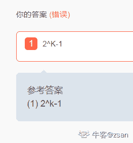
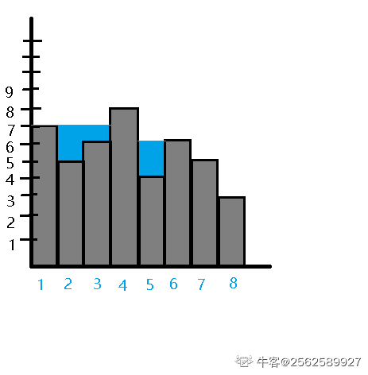

# 瓜子二手车 2019 秋招研发笔试卷 1

## 1

进行数据库提交操作时使用事务（Transaction）是为了?（）

正确答案: B   你的答案: 空 (错误)

```cpp
提高效率
```

```cpp
保证数据一致性
```

```cpp
网络安全
```

```cpp
归档数据文件
```

本题知识点

Java 工程师 C++工程师 瓜子二手车 数据库 2019

讨论

[NoOfferException](https://www.nowcoder.com/profile/1554976)

事务是一组数据库操作集合，要么同时成功要么同时失败，具有原子性，一致性，隔离性，持久性 ACID

发表于 2019-08-20 08:16:19

* * *

[码尚行动](https://www.nowcoder.com/profile/263851872)

一、事务是什么？

简单来说，事务是数据库中执行事件的最小单位，要保证一组数据库操作，要么全部成功，要么全部失败。

**二、事物操作数据库的四大特性(ACID)**

谐音记忆（一致认为原子应该持续隔离。 OS: ***太可怕了，大家一致觉得需要将***  持续地隔离起来，不能用于战争！最好用英文记忆，记不住用谐音加强记忆）

**1.原子性 (Atomicity)**

原子性：就是事物的所包含的所有操作，要么全部成功，要么全部失败回滚。

**2.一致性 (Consistency)**

事务执行的结果必须是使数据库从一个一致性状态变到另一个一致性状态。
一致性是指当事务完成时，必须使所有数据都具有一致的状态。在关系型数据库中，所有的规则必须应用到事务的修改上，以便维护所有数据的完整性。

一致性：简单来说就是在事物执行前和执行后，必须保持数据的一致。

举个例子：A 和 B 之间进行转账，A 和 B 的钱加起来一种是 2000 块钱，那么无论他们之间 进行了多少次的转账操作，最后的钱数加起来应该还是等于 2000。

**3.隔离性 (Isolation)**

隔离性：一个事物执行的过程当中，不能被其他的事物干扰。MySQL 的隔离性主要由锁加 MVCC 实现。
锁：比如有事物 A 和事物 B，相对于 A 来说，你 B 想要执行，要么在我执行之前执行，要么在我执行完毕之后，你再开始执行。
MVCC:多版本并发控制，事务读到的数据总是以自己事务开始时为准，除非是自己对数据做了操作；否则别人的操作对我不可见。

**4\. 持久性 (Durability)**

持久性：事物被提交之后，应被永久的存储到了数据库当中。一经提交，永久有效，不用担心数据的丢失问题。

事物是面试高频常考题，更多干货、知识点可以查看我的数据库笔记[`blog.nowcoder.net/hao2020`](https://blog.nowcoder.net/hao2020)

编辑于 2021-03-08 09:09:51

* * *

[艾木丘](https://www.nowcoder.com/profile/737096731)

b

发表于 2021-10-19 00:00:09

* * *

## 2

关于编译原理，以下文法中，是自顶向下分析的文法是哪几个？（）

正确答案: E   你的答案: 空 (错误)

```cpp
LR(0)
```

```cpp
SLR(1)
```

```cpp
LALR(1)
```

```cpp
LR(1)
```

```cpp
LL(1)
```

本题知识点

Java 工程师 C++工程师 瓜子二手车 编译和体系结构 2019

讨论

[小牛 6757](https://www.nowcoder.com/profile/891262298)

？

发表于 2020-09-24 10:43:13

* * *

[芍子](https://www.nowcoder.com/profile/577633782)

LL(1)分析法是自上而下的分析法。LR(0),LR(1),SLR(1),LALR(1)是自下而上的分析法。

自上而下:从开始符号出发，根据产生式规则推导给定的句子。用的是推导。

自下而上:从给定的句子规约到文法的开始符号。用的是归约

参考：https://blog.csdn.net/zuzhiang/article/details/79047743

发表于 2020-07-01 19:15:18

* * *

[酒泽思](https://www.nowcoder.com/profile/588155683)

笔记：LL(1)分析法是自上而下的分析法。自上而下：从开始符号出发，根据产生式规则推导给定的句子。用的是推导。 LR(0),LR(1),SLR(1),LALR(1)是自下而上的分析法。自下而上:从给定的句子规约到文法的开始符号。用的是归约参考：[`blog.csdn.net/zuzhiang/article/details/79047743`](https://blog.csdn.net/zuzhiang/article/details/79047743)

发表于 2021-05-19 16:18:22

* * *

## 3

以下协议属于网络协议中的应用层的是（）

正确答案: B C   你的答案: 空 (错误)

```cpp
IP
```

```cpp
HTTP
```

```cpp
FTP
```

```cpp
UDP
```

本题知识点

Java 工程师 C++工程师 瓜子二手车 网络基础 2019

讨论

[陌陌内推官](https://www.nowcoder.com/profile/946487877)

数据链路层协议：PPP ARP MAC IEEE802.3

网络层协议：IP BGMP

传输层协议：TCP UDP

应用层协议：HTTP HTTPS FTP Telnet SMTP

发表于 2019-08-11 17:34:15

* * *

[前方呀](https://www.nowcoder.com/profile/304945461)

B HTTP

应用层协议：DHCP ·DNS · FTP · Gopher · HTTP· IMAP4 · IRC · NNTP · XMPP ·POP3 · SIP · SMTP ·SNMP · SSH ·TELNET · RPC · RTCP · RTP ·RTSP· SDP · SOAP · GTP · STUN · NTP· SSDP · BGP 等

发表于 2020-04-13 18:21:55

* * *

[牛客 126148663 号](https://www.nowcoder.com/profile/126148663)

B、C

发表于 2021-11-04 05:39:49

* * *

## 4

以下选项属于进程间通信的是（）

正确答案: A B D   你的答案: 空 (错误)

```cpp
管道
```

```cpp
套接字
```

```cpp
内存
```

```cpp
消息队列
```

本题知识点

Java 工程师 C++工程师 瓜子二手车 操作系统 2019

讨论

[低调的我](https://www.nowcoder.com/profile/4546028)

进程中的几种通信方式：1）管道：管道是一种半双工的通信方式，数据只能单向流动。而且只能在具有血缘关系（父子进程之间）的的进程间使用。2）信号量：信号量是一个计数器，可以用来控制多个进程对共享资源的访问 3）消息队列：消息队列是由消息组成的链表，存放在内核中，并由消息队列标识符标识 4）信号：信号是有一种比较复杂的通信方式，用于通知接收进程某一事件已经发生 5）共享内存：共享内存就是映射一段能被其他进程所访问的内存，这段共享内存由一个进程创建，但多个进程都可以访问 6）套接字：即 Socket，是一种通信机制，凭借这种机制，客户/服务器系统的开发工作既可以在本地单机上进行，也可以跨网络进行

编辑于 2019-08-24 21:19:09

* * *

[诺尔雷顿](https://www.nowcoder.com/profile/4949755)

共享内存不算内存？

发表于 2019-08-17 10:11:53

* * *

[飞鸟与她](https://www.nowcoder.com/profile/9158041)

进程间通信的方式——信号、管道、消息队列、共享内存

发表于 2019-08-08 22:31:42

* * *

## 5

一个小朋友有 70 个玩具运往目的地，目的地距离小朋友 60 步。每次小朋友最多拿 40 个玩具，每走 2 步会掉一个玩具，则它最多能把 1 个玩具运到目的地

你的答案 (错误)

1 参考答案 (1) 20

本题知识点

Java 工程师 C++工程师 瓜子二手车 数学运算 2019

讨论

[哗~啦~啦](https://www.nowcoder.com/profile/817945927)

这题没说清楚，如果可以捡，我掉一个捡一个，不久能把 70 个玩具全部运过去了吗？如果不能减，那就只能一直掉，最终运过去 10 个。。。。

发表于 2019-08-15 10:27:29

* * *

[张云超](https://www.nowcoder.com/profile/3386783)

这题就应该是 70 这题漏洞太多，依据：由题意可得小朋友可以重复此操作，题目没说不能捡，所以拿一个一直重复直接送到终点。**正常分析**（不允许捡，第七十步掉的那个也不捡）：这题思路就是两次一定能运完，而且丢玩具的点是确定的，所以丢玩具点最多有两个玩具，最少有一个玩具（按照常理说），那么就需要一个的越多越好，也就是在某一个点抱着四十个奔向终点，那么前面丢 30 个，每个点丢两个一共十五个点（30 步），后面还剩三十步，丢十五个（按理说应该是 14 个），所以最终就是 70-（（30/2）*2）-（30/2）=25

发表于 2019-08-08 09:46:48

* * *

[Faded201803070955378](https://www.nowcoder.com/profile/7574586)

先拿 40 个走 30 步 在第 30 步剩 25 个 回去再拿 30 个走 30 步 剩 15 个 。这样在第 30 步的位置就是 15+25=40 再把这 40 个从 30 步带到终点(60 步）损失(60-30）/2=15 个 那么到最后还剩 25 个玩具。 以上思路不行吗

发表于 2019-08-08 02:13:53

* * *

## 6

设哈希表长 m＝14，哈希函数 H（key）＝key％11。表中已有 4 个结点：addr(15)=4，addr(38)=5，addr(61)=6，addr(84)=7，其余地址为空。如果用二次探测再散列处理冲突，关键字为 49 的结点的地址是 1

你的答案 (错误)

1 参考答案 (1) 9

本题知识点

Java 工程师 C++工程师 瓜子二手车 哈希 *2019* *讨论

[長歌當行](https://www.nowcoder.com/profile/585514245)

前一段时间做了一个用线性探测再散列的题，今天又补了一下二次探测再散列😂🤣🤣🤣
对于处理冲突数据结构书（C 语言版）上有一个公式：Hi = ( H (key) + di ) MOD  m 其中 i=1,2,3,......k(k<=m-1)、H(key)为哈希函数、m 为哈希表表长；di 为增量序列。当 di=1,2,3,....m-1,称为线性探测再散列；
当 di=(正负)K²(K=1,2,3,...m/2)称为二次探测再散列（先正后负）
题目中哈希表长为 14，所以代入后应该是这样的：H1=(5+1)%14=6  冲突 H1=(5-1)%14=4 冲突 H2=(5+4)%14=9 无冲突所以结果为 9
若有错误，还请路过的大牛们指正，多谢


发表于 2019-08-12 15:38:52

* * *

[张云超](https://www.nowcoder.com/profile/3386783)

这题电击小子回答好像是错的，根据数据结构 Java 实现这本书 5.4.2，二次探测探测的是散列表，而不是在 Hash 值，是取得 Hash 值之后采用 1²、2²、也就是 addr(n)=hash(n)+i² (i 从 0 开始取)，好像也有 addr(n)=hash(n)±i² ，即先实验+1 再实验-1，依次

编辑于 2019-08-08 10:30:21

* * *

[嘿哈 biu](https://www.nowcoder.com/profile/439183465)

插入前 15，38，61，84 的 H(key)分别为:4,5,6,7 存放地址为 4,5,6,7  
49 的 H(key)为 5,发生冲突.  
用二次探测再散列法解决冲突:  
1:(49+1²)%11=(49+1)%11=6,仍然发生冲突.  
2:(49-1²)%11=(49-1)%11=4,仍然发生冲突.  
3:(49+2²)%11=(49+4)%11=9,不再发生冲突.  故选 D。

发表于 2019-08-06 20:43:12

* * *

## 7

X=+0111001,Y=+1001101,求[X-Y]补=1

你的答案 (错误)

1 参考答案 (1) 11101100

本题知识点

Java 工程师 C++工程师 瓜子二手车 编程基础 *2019* *讨论

[I＇＇sOwari](https://www.nowcoder.com/profile/182498296)

[X] = 00111001  [Y] = 01001101[X-Y]补 = [X]补 + [-Y]补[-Y]补 = Y 各位取反+1 = 10110011[X]补      00111001[-Y]补 +  10110011 得           11101100

编辑于 2019-08-21 18:40:28

* * *

[lifan96](https://www.nowcoder.com/profile/4761830)

虽然答错了，是因为自己对原码、反码、补码概念不清楚，在此留贴记忆...[X]=00111001，[Y]=11001101（符号位正数为 0，负数为 1）[Y]反=10110010，（符号位不变，其它位取反）[X]补=00111001，（正数的补码等于它本身，也就是原码）[Y]补=10110011，（负数在反码的基础上+1）相加得 11101100

发表于 2019-08-20 20:50:41

* * *

[宁小葵 _Ning](https://www.nowcoder.com/profile/915700168)

加减法的法则①加法： 整数： [A]补 + [B]补 = [A+B]补 （mod 2^(n+1)） 小数： [A]补 + [B]补 = [A+B]补 （mod 2）②减法： 整数： [A-B]补 = [A]补 + [-B]补 （mod 2^(n+1)） 小数： [A-B]补 = [A]补 + [-B]补（mod 2）注:整数的补码是它本身；[-B]补的求法就是 [B]补的连同符号位在内，每位取反，末位加一。参考：[`blog.csdn.net/qq_40416052/article/details/82746348`](https://blog.csdn.net/qq_40416052/article/details/82746348)

发表于 2019-09-15 20:47:37

* * *

## 8

-125 的反码是多少 1

你的答案 (错误)

1 参考答案 (1) 10000010

本题知识点

Java 工程师 C++工程师 瓜子二手车 编程基础 *2019* *讨论

[飞鸟与她](https://www.nowcoder.com/profile/9158041)

125 的二进制为 1111101 其对应的反码（1->0,0->1）为 0000010，所以-125 的反码为： 10000010 （负数符号位上为 1，即第 8 位）

发表于 2019-08-08 22:35:37

* * *

[lifan96](https://www.nowcoder.com/profile/4761830)

直接写了个-2，哈哈哈，题目也没说用二进制作答呀

发表于 2019-08-20 20:52:25

* * *

[StarEvil](https://www.nowcoder.com/profile/813306125)

-125 的二进制为 -1111101，反码符号位不变，其余去反，则-125 反码为 10000010

发表于 2020-02-16 16:06:34

* * *

## 9

以数据集{1,6,8,2,9,4}为权值构造一棵赫夫曼树，其带权路径长度为 1

你的答案 (错误)

1 参考答案 (1) 70

本题知识点

Java 工程师 C++工程师 瓜子二手车 树 2019

讨论

[飞鸟与她](https://www.nowcoder.com/profile/9158041)

构造后的赫夫曼树如下：                    30       13                    17***6***              7          ***8***       *** 9            --------------  2***          3        ***4                             --------------- 3******       1***   ***2                                     --------------- 4******所以带权路径长度 length =  *(6 + 8 + 9) * 2 + 4 * 3 + (1 + 2) * 4**

发表于 2019-08-09 09:38:59

* * *

[陌陌内推官](https://www.nowcoder.com/profile/946487877)

构造出哈夫曼树，有两种计算方式。

一：带权路径长度=叶子节点权值×（高度-1）之和

二：带权路径长度=非叶子节点权值之和

发表于 2019-08-11 22:05:18

* * *

[_ 老地方](https://www.nowcoder.com/profile/290616569)

70

发表于 2019-11-14 23:51:53

* * *

## 10

组成数字 1 到 1234 的所有数字的各位的总和是 1

你的答案 (错误)

1 参考答案 (1) 15895

本题知识点

Java 工程师 C++工程师 瓜子二手车 编程基础 *2019* *讨论

[冥更](https://www.nowcoder.com/profile/244643828)

千位上出现数字和为 1*235=235 百位上出现数字和为 45*100+1*100+2*35=4670 十位上出现数字和为 45*120+1*10+2*10+3*5=5445 个位上出现数字和为 123*45+4+3+2+1=5545235+4670+5445+5545=15895

发表于 2019-08-21 09:18:39

* * *

[我的天鸭](https://www.nowcoder.com/profile/243498)

```cpp
int sum = 0;
for(int i = 1; i <= 1234; ++i){
    int temp = i;
    while(temp){
        sum += (temp%10);
        temp /= 10;
    }
}
```

发表于 2019-08-12 16:22:16

* * *

[詹姆斯李](https://www.nowcoder.com/profile/455581861)

0~9 各个位数相加是从 0 加到 9--》45
10~19 各个位数相加是从 1~10--》55
20~29 各个位数相加是从 2~11--》65
。。。
90~99===========9~18--》135
得 900
————————————————
100~109==========1~10--》55
。。。
190~199==========10~19--》145
得 1000
————————————————
200~209
。。。
290~299
得 1100
—————————————————1200————————————————————1300——————————————————900~9991800——————————————————注意变化 1000~1099950——————————————————1100~11991050——————————————1200~1234295 找到规律了，自己算有多少，就可以算了，

编辑于 2019-08-21 20:50:20

* * *

## 11

小李和小王各有书籍若干本，小李对小王说：“我如果给你 2 本，我们的书将一样多。”小王说：“我如果给你 2 本，我的书籍数量将只有你的三分之一。”请问，小李和小王共有书籍 1

你的答案 (错误)

1 参考答案 (1) 16

本题知识点

Java 工程师 C++工程师 瓜子二手车 智力题 数学运算 2019

讨论

[lifan96](https://www.nowcoder.com/profile/4761830)

列两个方程：设李为 x，王为 y① x - 2 = y + 2② (x + 2) / 3 = y - 2 式 ① 化简为 x= y + 4，带入 ② 式中 y=6,x=10，共 16 本

发表于 2019-08-20 21:03:46

* * *

[牛客 377126748 号](https://www.nowcoder.com/profile/377126748)

14

发表于 2021-09-30 09:30:34

* * *

[牛客 261680685 号](https://www.nowcoder.com/profile/261680685)

设未知数 共 16

发表于 2021-07-21 13:11:39

* * *

## 12

有一段楼梯台阶有 100 级台阶，以小明的脚力第 n 步能跨 n 级，请问小明登上这段楼梯需要多少步 1

你的答案 (错误)

1 参考答案 (1) 14

本题知识点

Java 工程师 C++工程师 瓜子二手车 数量关系 智力题 数学运算 2019

讨论

[K.K.K.](https://www.nowcoder.com/profile/50590665)

小明***啊

发表于 2020-06-12 12:43:50

* * *

[yannis_chen](https://www.nowcoder.com/profile/976698185)

不应该是 n(n+1) / 2>= 100 吗 n(n+1) >= 20015*14=21014*13=182 所以 n 取了 14

发表于 2019-09-19 15:38:38

* * *

[同福客栈老司机知名人士](https://www.nowcoder.com/profile/861791775)

这相当于一个等差数列求和，n*(a1+an)/2=Sn 此时 n=an , a1=1， Sn=100

发表于 2020-03-27 06:16:33

* * *

## 13

有 K 层的二叉树至多有 1 个节点

你的答案 (错误)

1 参考答案 (1) 2^k-1

本题知识点

Java 工程师 C++工程师 瓜子二手车 树 2019

讨论

[姓名张三](https://www.nowcoder.com/profile/3980870)

???

发表于 2019-08-27 17:32:22

* * *

[张云超](https://www.nowcoder.com/profile/3386783)

K 层二叉树为满二叉树时最多，此时共有 2^k-1 个节点第 i 层有 2^(i-1)个节点叶子节点数为 2^(K-1)如果为完全二叉树，此时一般会考叶子节点数一般设度为零的节点为 n0、度为 1 的节点为 n1、度为 2 的节点为 n2，那么有 n0+n1+n2 = 节点总数 Nn0 = n2+1n1 + 2*n2 = n-1

编辑于 2019-08-08 14:57:16

* * *

[暮落晨风](https://www.nowcoder.com/profile/405918712)

2^k-1

发表于 2020-08-30 23:37:18

* * *

## 14

```cpp
main(  ){
  char c=040;
  printf(“%o\n",c<<1);
}
```

程序的结果是 1

你的答案 (错误)

1 参考答案 (1) 100

本题知识点

Java 工程师 C++工程师 瓜子二手车 C++ 2019

讨论

[Alkaid333](https://www.nowcoder.com/profile/317728556)

X=040，前缀 0 代表八进制，转化为二进制为 100 000，x<<1，左移一位，即 1000 000。%o 表示输出无符号八进制，再将其转化为八进制，为 100

发表于 2019-09-24 13:42:52

* * *

[张云超](https://www.nowcoder.com/profile/3386783)

这题估计是录入问题，%o（欧）而不是%0（零），左移一位等于乘以 2 得 080，因为是八进制，所以进一，0100,输出是按照八进制输出所以输出 100.

发表于 2019-08-08 14:40:38

* * *

[Z3R0](https://www.nowcoder.com/profile/5881784)

c=040,0 开头是八进制表示法，表示十进制数 32。c<<1,c 左移一位，可以先把 c 转为二进制数:100000。左移一位后为 1000000。表示十进制数为 64，转化为八进制为 100

发表于 2019-10-14 00:48:33

* * *

## 15

一颗完全二叉树的节点数量为 666，那么这棵树上的叶子节点数为 1

你的答案 (错误)

1 参考答案 (1) 333

本题知识点

Java 工程师 C++工程师 瓜子二手车 树 2019

讨论

[挪威北](https://www.nowcoder.com/profile/613357033)

设这个完全二叉树有 K 层，前 K-1 层有 2⁹-1=511 个节点，最后一层有 666-511=155 个全是叶子节点；倒数第二层有 2⁸=256 个节点，其中 155/2=77 个有两个孩子，第 78 个有一个孩子，剩 256-78=178 个叶子节点；155+178=333 个

发表于 2019-08-19 23:50:27

* * *

[朱 201908291617938](https://www.nowcoder.com/profile/798782024)

完全二叉树叶子节点数=向上取整

发表于 2019-09-01 10:37:35

* * *

[张云超](https://www.nowcoder.com/profile/3386783)

一般设度为零的节点为 n0、度为 1 的节点为 n1、度为 2 的节点为 n2，那么有 n0+n1+n2 = 666n0 = n2+1n1 + 2*n2 = 665 因为完全二叉树度为 1 的节点数只能为 0 或 1，所以 n1=1 所以 n0=333

编辑于 2019-08-12 08:59:17

* * *

## 16

有 1 分，2 分，5 分，10 分四种硬币，每种硬币数量无限，给定 n 分钱(n<10000)，有多少中组合可以组成 n 分钱？

你的答案

本题知识点

Java 工程师 C++工程师 瓜子二手车 智力题 数学运算 2019

讨论

[无敌爽爽](https://www.nowcoder.com/profile/513859034)

```cpp
import java.util.Scanner;

public class Solution {
    int count = 0;
    int[] arr;

    public int calculateWays(int n) {
        arr = new int[n + 1];
        return calculateWays1(n);
    }
    //记忆化搜索递归
    private int calculateWays1(int n) {
        if (n < 0) 
            throw new IllegalArgumentException("input wrong");
        if (n == 0) 
            return 0;
        if (n == 1)
            return 1;
        if (n == 2 || n == 3)
            return 2;
        if (n == 4 || n == 5 || n == 6 || n == 7 || n == 8 || n == 9)
            return n - 1;
        if (n == 10)
            return 11;
        if (arr[n] != 0)
            return arr[n];
        int res = 0;
        res = Math.max(Math.max(calculateWays1(n - 1) + 1, calculateWays1(n - 2) + 2), Math.max(calculateWays1(n - 5) + 4, calculateWays1(n - 10) + 11));
        arr[n] = res;
        return res;
    }
    public static void main(String[] args) {
        Scanner sc = new Scanner(System.in);
        System.out.println("请输入钱数：");
        int n = sc.nextInt();
        Solution s = new Solution();
        int sum = s.calculateWays(n);
        System.out.println(sum);
    }
}
```

接楼上动态规划法，这是对应的递归解法，思路就是不断递归的寻找比 n 小 1，2，5，10 分的组合数量加组成 1，2，5，10 分的组合数量的最大值，个人认为递归算法更容易理解，但会反复计算很多重复的子问题，所以引入了记忆化搜索减少了计算次数，总体来讲由于递归本身的开销会比动态规划大，但递归思想适应性更广，理解两种解法对解类似的题目会更有帮助。

编辑于 2019-08-23 14:25:56

* * *

[wanly](https://www.nowcoder.com/profile/253333775)

```cpp
public static void main(String[] args) {
		Scanner sc = new Scanner(System.in);
		int n = sc.nextInt();
		sc.close();

		int coins[] = { 1, 2, 5, 10 };

		count(coins, 0, n);
		System.out.println(numcount);
	}

	// 递归
	static int numcount = 0;

	public static void count(int coins[], int index, int aim) {

		if (aim == 0) {
			numcount++;
			return;
		}
		if (index == 4) {
			return;
		}

		for (int i = 0; i * coins[index] <= aim; i++) {
			count(coins, index + 1, aim - i * coins[index]);
		}

	}
```

编辑于 2019-09-12 16:37:52

* * *

[求求你别逼逼了](https://www.nowcoder.com/profile/190283350)

```cpp
n=int(input())
list=[]
for i in range(0,n+1):
    for j in range(0,n+1):
        for k in range(0,n+1):
            for l in range(0,n+1):
               if j*1+k*2+5*k+l*10==n:
                   list.append(j)
print(len(list))
```

发表于 2019-08-17 10:17:27

* * *

## 17

给定 n 个柱面的高度，表示降雨某地 n 块区域的海拔高度。
计算降雨之后该地最大储水面积。如果低于地平线，也就是小于 0，则一定积水。

你的答案

本题知识点

Java 工程师 C++工程师 瓜子二手车 C++ Java 2019

讨论

[2562589927](https://www.nowcoder.com/profile/223040637)

我理解的题目意思就是给个 n 代表将输入多少数，然后给 n 个数代表高度

发表于 2019-08-20 18:05:59

* * *

[DingYu](https://www.nowcoder.com/profile/646808631)

单调栈 leetcode 42 题 接雨水 自己没用编辑器手写了一下 不确定对不对！！！！

```cpp
//单调栈
public int maxArea(int[] heights){
    Stack<Integer> stack = new Stack<>();
    int result = 0;
    for(int i = 0 ;i < heights.length ; i ++){
        while(!stack.isEmpty() && heights[stack.peek()] <= heigths(i)){
            int curIndex = stack.pop();
            if(stack.isEmpty()) break;
            int rigthIndex = i;
            int leftIndex = stack.peek();
            int d = righhtIndex - leftIndex -1;
            int h = Math.min(heights[rightIndex],heights[leftIndex]) - heights[curIndex];
            result += d*h;
        }
        stack.push(i);
    }

    return result;
}
```

发表于 2019-08-11 23:25:55

* * *

[云天青](https://www.nowcoder.com/profile/8781357)

题目没说清楚

发表于 2019-11-01 08:52:35

* * *****