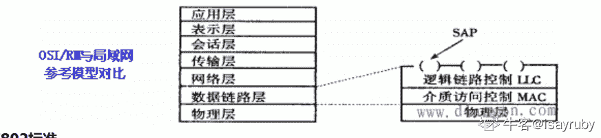

# 恒生公司 2015 秋招开发类笔试题（二）

## 1

一般地，可以将软件开发的生命周期划分为软件项目计划、______、软件设计、编码、测试和运行/维护 6 个阶段。

正确答案: C   你的答案: 空 (错误)

```cpp
可行性分析
```

```cpp
初始调查
```

```cpp
需求分析与定义
```

```cpp
问题分析
```

本题知识点

Java 工程师 C++工程师 iOS 工程师 安卓工程师 运维工程师 前端工程师 c#工程师 golang 工程师 恒生公司 2015

讨论

[牛客 726292042 号](https://www.nowcoder.com/profile/726292042)

为什么没有 A

发表于 2020-04-18 22:50:44

* * *

[牛客 34848897 号](https://www.nowcoder.com/profile/34848897)

不定项答案为什么只有一个呢？

发表于 2020-03-16 22:48:27

* * *

[雨阳最帅](https://www.nowcoder.com/profile/374381247)

c

发表于 2019-09-16 19:06:30

* * *

## 2

对软件系统进行验收测试（确认测试）的任务是验证软件(     ）。

正确答案: A   你的答案: 空 (错误)

```cpp
是否符合用户提出的需求
```

```cpp
是否采用了先进的实现方法
```

```cpp
界面是否美观
```

```cpp
是否适合计算机硬件环境
```

本题知识点

Java 工程师 C++工程师 iOS 工程师 安卓工程师 运维工程师 前端工程师 c#工程师 golang 工程师 恒生公司 2015

讨论

[吃个屁还要打个嗝](https://www.nowcoder.com/profile/627655972)

A   

发表于 2020-03-21 10:51:08

* * *

[牛客 3221988 号](https://www.nowcoder.com/profile/3221988)

A

发表于 2019-09-24 22:38:52

* * *

## 3

已经获得除 CPU 以外的所有所需资源的进程处于 ______ 状态。

正确答案: B   你的答案: 空 (错误)

```cpp
运行状态
```

```cpp
就绪状态
```

```cpp
自由状态
```

```cpp
阻塞状态
```

本题知识点

Java 工程师 C++工程师 iOS 工程师 安卓工程师 运维工程师 前端工程师 c#工程师 golang 工程师 恒生公司 2015

讨论

[skr201901191251267](https://www.nowcoder.com/profile/738368890)

当线程处于就绪状态时，只等待 CPU 分配时间运行，其他的一切都准备 OK

发表于 2019-09-28 23:29:17

* * *

## 4

采用面向对象技术开发的应用系统的特点是（     ）。

正确答案: A   你的答案: 空 (错误)

```cpp
重用性更强
```

```cpp
运行速度更快
```

```cpp
占用存储量小
```

```cpp
维护更复杂
```

本题知识点

Java 工程师 C++工程师 iOS 工程师 安卓工程师 运维工程师 前端工程师 c#工程师 golang 工程师 恒生公司 2015

讨论

[xxf666](https://www.nowcoder.com/profile/97331668)

面向对象方法具有很多其他方法不具备的特点，比如多态，继承等。这些特点都决定了面向对象方法支持软件复用。可重用性是面向对象方法的一个重要特征。

发表于 2019-09-07 10:47:00

* * *

## 5

在一棵二叉树上第 5 层的结点数最多是(     )。

正确答案: B   你的答案: 空 (错误)

```cpp
8
```

```cpp
16
```

```cpp
32
```

```cpp
15
```

本题知识点

Java 工程师 C++工程师 iOS 工程师 安卓工程师 运维工程师 前端工程师 c#工程师 golang 工程师 恒生公司 2015

讨论

[_JK](https://www.nowcoder.com/profile/5994793)

最大的叶子节点数量应该是满二叉树 2∧（n-1）

发表于 2019-08-24 02:13:58

* * *

## 6

以下关于排序算法的叙述中，正确的是(      )。

正确答案: D   你的答案: 空 (错误)

```cpp
冒泡排序法中，元素的交换次数与元素的比较次数一定相同
```

```cpp
冒泡排序法中，元素的交换次数不少于元素的比较次数
```

```cpp
简单选择排序中，关键字相同的记录在排序前后的相对位置一定不变
```

```cpp
简单选择排序中，关键字相同的记录在排序前后的相对位置可能交换
```

本题知识点

Java 工程师 C++工程师 iOS 工程师 安卓工程师 运维工程师 前端工程师 c#工程师 golang 工程师 恒生公司 2015

讨论

[skr201901191251267](https://www.nowcoder.com/profile/738368890)

其实就是问排序是否稳定

发表于 2019-09-28 23:29:59

* * *

## 7

Linux 文件权限 drwxr-xr-- 对应的数字是（     ）。

正确答案: B   你的答案: 空 (错误)

```cpp
766
```

```cpp
754
```

```cpp
755
```

```cpp
645
```

本题知识点

Java 工程师 C++工程师 iOS 工程师 安卓工程师 运维工程师 前端工程师 c#工程师 golang 工程师 恒生公司 2015

讨论

[xxf666](https://www.nowcoder.com/profile/97331668)

在 Linux 中 r 是可读权限，w 是可写权限，x 是 可执行权限。1 表示可执行权限，2 表示可写权限，4 表示可读权限，然后将其相加。所以–rwxr-xr--可以拆分为：rwx 即 4+2+1=7；r-x 即 4+1=5；r 为 4。所以–rwx r-x r-x 转换成权限数字为 754。

编辑于 2019-09-17 19:54:19

* * *

## 8

在一个单链表 HL 中，若要在指针 q 所指结点的后面插入一个由指针 p 所指向的结点，则执行（      ）。

正确答案: D   你的答案: 空 (错误)

```cpp
q-&gt;next=p-&gt;next; p=q;
```

```cpp
p-&gt;next=q-&gt;next; q=p;
```

```cpp
q-&gt;next=p-&gt;next; p-&gt;next=q;
```

```cpp
p-&gt;next=q-&gt;next; q-&gt;next=p;
```

本题知识点

Java 工程师 C++工程师 iOS 工程师 安卓工程师 运维工程师 前端工程师 c#工程师 golang 工程师 恒生公司 2015

讨论

[煎饼果子这个名字已经被占用了](https://www.nowcoder.com/profile/257750734)

```cpp
-&gt; 是 . 的转义
```

发表于 2021-03-09 17:32:28

* * *

[待进阶猿](https://www.nowcoder.com/profile/359407413)

&这个符号不是取地址或引用符号吗 和指针搞上关系了 啥意思

发表于 2019-09-12 09:27:27

* * *

[xxf666](https://www.nowcoder.com/profile/97331668)

一个由指针 p 所指向的结点

编辑于 2019-09-07 10:50:54

* * *

## 9

在局域网模型中，数据链路层分为（     ）。

正确答案: B   你的答案: 空 (错误)

```cpp
逻辑链路控制子层和网络子层
```

```cpp
逻辑链路控制子层和媒体访问控制子层
```

```cpp
网络接口访问控制子层和媒体访问控制子层
```

```cpp
逻辑链路控制子层和网络接口访问控制子层
```

本题知识点

Java 工程师 C++工程师 iOS 工程师 安卓工程师 运维工程师 前端工程师 c#工程师 golang 工程师 恒生公司 2015

讨论

[isayruby](https://www.nowcoder.com/profile/196096777)



发表于 2019-09-16 20:07:15

* * *

[xxf666](https://www.nowcoder.com/profile/97331668)

“数据”

发表于 2019-09-07 10:51:21

* * *

## 10

开发一个逻辑模型：公司有 10 个部门，每个部门有 6-7 名员工，但每个员工可能会为不止一个部门工作。下面所给的模型正确的是（    ）。

正确答案: C   你的答案: 空 (错误)

```cpp
部门和员工之间是一种确定的一对多的关系
```

```cpp
建立一个关联表，从该关联表到员工建立一个一对多的关系，然后再从该关联表到部门表建立一个一对多的关系
```

```cpp
建立一个关联表，从员工表到该关联表建立一个一对多的关系，然后再从部门表到该关联表建立一个一对多的关系
```

```cpp
这种情况不能建立正常的数据库模型
```

本题知识点

Java 工程师 C++工程师 iOS 工程师 安卓工程师 运维工程师 前端工程师 c#工程师 golang 工程师 恒生公司 2015

讨论

[ZebraZ](https://www.nowcoder.com/profile/859746414)

 数据库中的多对多关联关系一般需采用中间表的方式处理，将多对多转化为两个一对多。

发表于 2019-09-26 10:01:40

* * *

[ltx7](https://www.nowcoder.com/profile/823970155)

员工表 ： id ename 部门表 ： id dname 员工部门表： id eid pid

```cpp
员工表到该关联表建立一个一对多的关系
```

发表于 2019-09-29 21:17:25

* * *

[Giskard42](https://www.nowcoder.com/profile/184876435)

对于一对多的关系，外键是由“多”的一方指向“一”的一方对于多对多的关系，外键是由中间表分别指向两个表的主键，外键是多的一方指向一的一方，所以中间表是多

发表于 2020-03-13 21:51:09

* * *

## 11

数字字符 0 的 ASCII 值为 48，若有以下程序

```cpp
int main() {
    char x='1',y='3';
    printf("%c,",y++);
    printf("%d\n",y-x);
}
```

程序运行后的输出结果是（）

正确答案: C   你的答案: 空 (错误)

```cpp
4,3
```

```cpp
51,3
```

```cpp
3,3
```

```cpp
3,2
```

本题知识点

C++工程师 恒生公司 2015 C 语言

讨论

[Xechos](https://www.nowcoder.com/profile/668036805)

char x='1',y='3';    //int：x=49，y=51printf("%c,",y++);    //y++先输出后++，因此输出 3，y=52printf("%d\n",y-x);    //y=52，x=49，y-x=3

发表于 2019-09-25 20:42:06

* * *

[牛客 781121271 号](https://www.nowcoder.com/profile/781121271)

B 中 51 为 ascll 值不是对的?

发表于 2022-02-28 10:34:25

* * *

[13.67](https://www.nowcoder.com/profile/387225214)

坑有 3：1.以 char 的形式定义了 2 个数字，会使初学者迷茫’。但是它上面有提示 ASCII 码值。以后看见 char 定义数字直接往 ASCII 上靠，并记住 0=48（ASCII）；2.在输出行居然也有大坑 y++与++y。牢记谁在前先打印谁 3.第三行以%d 格式输出则 y-x 应为他们的 ASCII 相减输出的也是相减后的值，且注意，此时的 y 已改变值。最后对于答案分布只能说呵呵

发表于 2022-02-27 10:32:49

* * *

## 12

当调用函数时，实参是一个数组名，则向函数传送的是（）

正确答案: B   你的答案: 空 (错误)

```cpp
数组的长度
```

```cpp
数组的首地址
```

```cpp
数组每一个元素的地址
```

```cpp
数组每个元素中的值
```

本题知识点

C++工程师 恒生公司 2015 C 语言

讨论

[xxf666](https://www.nowcoder.com/profile/97331668)

在 C 语言中数组的变量名就是指向其首元地址的指针名。数组的其他元素可以通过首元偏移得到。

发表于 2019-09-07 10:54:21

* * *

[破碎的大厂梦](https://www.nowcoder.com/profile/764338187)

BC 都可以吧 

发表于 2021-02-28 20:39:54

* * *

## 13

设 a、b、c、d、m、n 均为 int 型变量，且 a=5、b=6、c=7、d=8、m=2、n=2，则逻辑表达式 (m=a>b)&&(n=c>d)运算后，n 的值为（）

正确答案: C   你的答案: 空 (错误)

```cpp
0
```

```cpp
1
```

```cpp
2
```

```cpp
3
```

本题知识点

恒生公司 2015 C 语言

讨论

[xxf666](https://www.nowcoder.com/profile/97331668)

a＜b，逻辑与的第一部分判断为 false，第二部分就不会去判断了，取默认值为 false

发表于 2019-09-07 11:02:20

* * *

[王小猛](https://www.nowcoder.com/profile/7454669)

括号运算符得优先级大于短路运算符

发表于 2019-08-23 23:44:03

* * *

[岛岛岛岛屿](https://www.nowcoder.com/profile/364854336)

此逻辑表达式运算：
（m=a＞b）因为赋值运算的优先级最低，先考虑 a＞b；题中 a=5，b=6，显然 a＞b 不成立，结果为假（0），在 C 语言中 m=0。
逻辑运算符&&（与）只有符号两边都成立才为真，当符号前边运算结果为假时，会产生“短路”，所以不再计算后面表达式的值，那么仍然是 n=2

发表于 2020-09-17 17:53:41

* * *

## 14

在顺序表(1,5,8,10,13,15,17,19,25,28,40)中，用二分法查找关键码值 11，所需的关键码比较次数为 _______________

正确答案: C   你的答案: 空 (错误)

```cpp
2
```

```cpp
3
```

```cpp
4
```

```cpp
5
```

本题知识点

Java 工程师 C++工程师 iOS 工程师 安卓工程师 运维工程师 前端工程师 c#工程师 golang 工程师 恒生公司 2015

讨论

[为了你我愿意热爱整个世界](https://www.nowcoder.com/profile/66345862)

二分查找法：先用关键码值与顺序表中的中值比较，若小于中值则继续与中值左侧的数据进行比较，若大于中值，则与中值右侧数据进行比较，此题第一次关键码值先与中值 15 进行比较，小于 15，继续与左侧数据比较即第二次与中值 8 比较，大于 8，继续与右侧数据比较即第三次与 10 进行比较，大于 10，同理第四次与 13 进行比较，查找完成，匹配失败，比较次数为 4 次。

发表于 2019-09-20 20:14:12

* * *

[xxf666](https://www.nowcoder.com/profile/97331668)

15 8 10 13

编辑于 2019-09-07 11:09:42

* * *

[人才库前台](https://www.nowcoder.com/profile/765219110)

log2(10) > 3, 所 3+1 次

发表于 2021-02-22 00:18:53

* * *

## 15

申明以下变量：

```cpp
char ch;
int i;
float f;
double d;
```

则表达式: ch/i + (f*d – i) 的结果类型为（）

正确答案: D   你的答案: 空 (错误)

```cpp
char
```

```cpp
int
```

```cpp
float
```

```cpp
double
```

本题知识点

C++工程师 恒生公司 2015 C++ C 语言

讨论

[xxf666](https://www.nowcoder.com/profile/97331668)

基本数据类型的等级从低到高如下：char int long float double 运算的时候是从低转到高的，表达式的类型会自动提升为参与表达式求值的最上级类

编辑于 2019-09-07 11:12:43

* * *

[牛客 547599477 号](https://www.nowcoder.com/profile/547599477)

🈶️🐱病？？我也知道答案是 double，非整个不定项选择题？

发表于 2020-11-11 09:41:42

* * *

[牛客 637769641 号](https://www.nowcoder.com/profile/637769641)

我知道是 double，但是多选必须选两个怎么回事

发表于 2022-03-06 00:07:02

* * *

## 16

以下哪句关于垃圾回收的陈述是正确的（   ）

正确答案: B   你的答案: 空 (错误)

```cpp
垃圾回收线程的优先级很高，以保证不再使用的内存将被及时回收
```

```cpp
垃圾收集不允许程序开发者明确指定释放哪一个对象
```

```cpp
垃圾回收机制保证了 JAVA 程序不会出现内存溢出
```

```cpp
进入”Dead”状态的线程将被垃圾回收器回收
```

本题知识点

Java 工程师 C++工程师 iOS 工程师 安卓工程师 运维工程师 前端工程师 c#工程师 golang 工程师 恒生公司 2015

讨论

[mumucgq](https://www.nowcoder.com/profile/8940520)

A 首先，当一个程序运行的时候，至少有两个线程在运行，一个是主线程，一个是垃圾回收线程，垃圾回收线程的优先级较低

B 程序员不可以显示指定垃圾回收器回收对象，只能通过 system.gc()来调用最多是推荐释放

C 垃圾回收机制只是回收不再使用的 JVM 内存， 如果程序有严重的 BUG 此时，照样溢出

D 进入死亡状态的线程，还可以恢复，gc 不会回收。

发表于 2021-03-03 14:37:37

* * *

[似有还无](https://www.nowcoder.com/profile/632364961)

jvm 垃圾回收线程的优先级低的超鬼了

发表于 2019-09-14 13:42:41

* * *

## 17

如果希望某个变量只可以被类本身访问和调用,则应该使用下列哪一种访问控制修饰 （   ）

正确答案: A   你的答案: 空 (错误)

```cpp
private
```

```cpp
public
```

```cpp
protected
```

```cpp
static
```

本题知识点

Java 工程师 C++工程师 iOS 工程师 安卓工程师 运维工程师 前端工程师 c#工程师 golang 工程师 恒生公司 2015

讨论

[Java 后端练习生](https://www.nowcoder.com/profile/534037268)

static 不是访问修饰符

发表于 2021-04-04 16:37:24

* * *

## 18

对象 A a = new A()和 B b = new B()，如果 a.equals(b) == true,那么（   ）

正确答案: B C   你的答案: 空 (错误)

```cpp
a==b
```

```cpp
a!=b
```

```cpp
a.hashCode()==b.hashCode()
```

```cpp
a.hashCode()!=b.hashCode()
```

本题知识点

Java 工程师 C++工程师 iOS 工程师 安卓工程师 运维工程师 前端工程师 c#工程师 golang 工程师 恒生公司 2015

讨论

[Cosmark](https://www.nowcoder.com/profile/197184731)

如果两个对象根据 equals(Object)方法是相等的，那么调用二者各自的 hashCode()方法必须产生同一个 integer 结果。

发表于 2019-10-10 22:05:07

* * *

[Java 后端练习生](https://www.nowcoder.com/profile/534037268)

equals 相等的两个对象，hashcode 一定要相等

发表于 2021-04-04 16:38:29

* * *

[hnit2020](https://www.nowcoder.com/profile/714047312)

两个对象 equals 结果相等，那么他们的 hashcode 结果也一定会相等！

发表于 2020-03-15 23:57:55

* * *

## 19

指出下面程序的运行结果:

```cpp
class A{
static{

System.out.print("1");

}

public A(){

System.out.print("2");

}

}

class B extends A{

static{

System.out.print("a");

}

public B(){

System.out.print("b");

}

}

public class Hello{

public static void main(String[] ars){

A ab = new B();

ab = new B();

}

}
```

正确答案: A   你的答案: 空 (错误)

```cpp
1a2b2b
```

```cpp
2b1a2b
```

```cpp
1abb
```

```cpp
2b1a
```

本题知识点

Java 工程师 C++工程师 iOS 工程师 安卓工程师 运维工程师 前端工程师 c#工程师 golang 工程师 恒生公司 2015

讨论

[hnit2020](https://www.nowcoder.com/profile/714047312)

Java 程序的初始化顺序是怎样的？

*   在 Java 语言中，当实例化对象时，对象所在类的成员变量首先要进行初始化，只有所有类成员完成初始化之后，才会调用对象所在类的构造函数创建对象；

*   一般遵循三个原则

    *   静态对象/变量优于非静态对象/变量的初始化，其中静态变量/对象只会初始化一次，非静态变量/对象可能会初始化多次；

    *   父类优先于子类进行初始化;

    *   按照成员变量的定义顺序进行初始化，即使成员变量位于方法内部，他们依然在任何方法调用之前进行初始化，包括构造方法；

**初始化顺序总结：**

父类静态变量-->父类静态代码块-->子类静态变量-->子类静态代码块-->父类非静态变量-->父类非静态代码块-->父类构造方法-->子类非静态变量-->子类非静态代码块-->子类构造函数

* * *

发表于 2020-03-16 00:02:54

* * *

[小小怪的很](https://www.nowcoder.com/profile/37884715)

我用 eclipse 运行的结果是 A

发表于 2019-09-15 22:03:17

* * *

[mumucgq](https://www.nowcoder.com/profile/8940520)

初始化顺序总结：

父类静态变量(父类静态代码块)-->子类静态变量(子类静态代码块)-->父类成员变量(父类成员代码块)-->父类构造方法-->子类成员变量(子类成员代码块)-->子类构造函数

发表于 2021-03-03 14:50:26

* * *

## 20

Collection 的常用子类和接口有(   ）

正确答案: A B D E F   你的答案: 空 (错误)

```cpp
List
```

```cpp
Set
```

```cpp
Map
```

```cpp
Vector
```

```cpp
LinkedList
```

```cpp
HashSet
```

本题知识点

Java 工程师 C++工程师 iOS 工程师 安卓工程师 运维工程师 前端工程师 c#工程师 golang 工程师 恒生公司 2015

讨论

[～哎呦喂～](https://www.nowcoder.com/profile/374100306)

AbstractSet 实现了 Set 接口； HashSet 继承自 AbstractSet 基类

发表于 2019-09-18 00:13:40

* * *

[Rukawalee](https://www.nowcoder.com/profile/4017316)

List,Set 也是子类不是接口吗？

发表于 2019-09-05 08:31:48

* * *

## 21

数据库
假如某系统包括客户信息、账户余额、资金明细表，其表结构如下：

客户信息表“clientinfo”（主键：custid)：

| 客户号 | 客户姓名 |   性别 | 分行号 |
| custid | custname | custsex 男/女 | branchid |

账户余额表“acctbalance”（主键：acctountno,ccycode)：

| 帐号 | 币种 |   当前余额 | 客户号 | 存款利率 |
| accountno | ccycode (‘156’人民币) | currentbalance | custid | interestrate |

资金明细表“funddetail”（主键：transdate,serialno)：

| 交易日期 | 流水编号 |   帐号 | 币种 | 借方金额 |  贷方金额 |
| transdate | serialno  | accountno | ccycode | creditamount | debitamount |

请根据上述提示，完成如下题目：

1)   找出未持有账户的客户信息列表（输出姓名、性别以及所属分行）；

2)   找出在 2013 年有交易发生的账户列表（输出帐号、币种、客户姓名、性别）；

3)   计算分行‘100000’所有账户的存款金额(按币种输出)；

4)   找出 2013 年未发生交易且账户余额小于 300 的客户列表（输出帐号、币种、客户编号);

5)   将账户余额超过 1000000 且属于分行‘300000’的客户存款利率涨 15%；

你的答案

本题知识点

Java 工程师 C++工程师 iOS 工程师 安卓工程师 运维工程师 前端工程师 c#工程师 golang 工程师 恒生公司 2015

讨论

[饭特稀 233](https://www.nowcoder.com/profile/9348417)

1、select * from clientinfo where custid not in(select cusitid from acctibalance)

2、select table1.account, table2.ccycode, table2.custname, table2.custsex from

(select *  where transdate between ‘2013-01-01 00:00:00’and ‘2013-12-31 00:00:00’) as table1 join (select a.*, c.*  from acctibalance a left join clientinfo c on c.custid=a.custid) as table2 where table1.accountno=table2.accountno

3、select ccycode, sum(currentbalance) from

(select * from acctbalance where custid in(select custid from clientinfo where branched=’100000)) group by ccycode

4、select accoutno,ccycode,custid from acctbalance where currentbalance<300 and accountno not in

 (select accoutno from funddetail where trainsdate between‘2013-01-01 00:00:00’and ‘2013-12-31 00:00:00’)

5、update actable set interstrate=insterstrate*1.15 where currentbalance>100000 and custid =( select custid from clientinfo where branched=’300000’)

编辑于 2020-03-19 01:28:27

* * *

[讨厌动态规划](https://www.nowcoder.com/profile/897604656)

答案确定列出了所有的查询方法吗，我的答案虽然跟答案不一样，可是我觉得自己是对的啊，但是又没有办法证明，无语。

发表于 2020-10-07 23:31:54

* * *

[小余同学要努力](https://www.nowcoder.com/profile/41454100)

1)select * from clientinfo where custid not in (select custid from acctbalance)2)select * from funddetail where transdate >=to_date('2019-2-1 00:00:00','yyyy-MM-dd hh24:mi:ss') and transdate <=to_date('2019-3-1 00:00:00','yyyy-MM-dd hh24:mi:ss');3)select ccycode,sum(currentbalance) from
(
select * from acctbalance where custid in (
   select custid from clientinfo where branchid=100000
)
)
group by ccycode;
4)select accountno,ccycode,custid from acctbalance where currentbalance <2000 and accountno not in
(
select accountno from funddetail
where transdate >=to_date('2019-2-1 00:00:00','yyyy-MM-dd hh24:mi:ss') and transdate <=to_date('2019-3-1 00:00:00','yyyy-MM-dd hh24:mi:ss')

)5) 

发表于 2019-09-08 13:58:42

* * *

## 22

编程题

在一个字符串中找到出现指定次数的字符并通过控制台输出。

如输入 abaccdeff 及 1，则通过控制台输出：

b

d

e

如输入 abaccdeff 及 2，则通过控制台输出：

a

c

f

你的答案

本题知识点

Java 工程师 C++工程师 iOS 工程师 安卓工程师 运维工程师 前端工程师 c#工程师 golang 工程师 恒生公司 2015

讨论

[星汉灿烂，若出其里](https://www.nowcoder.com/profile/107694096)

```cpp
public class P1 {
	public static void main(String[] args) {
		// TODO Auto-generated method stub
		Scanner rd=new Scanner(System.in);
		int num;
		String str;
		str=rd.next();
		num=rd.nextInt();
		char list[]=str.toCharArray();
		int arr[]=new int[26];
		int flag;
		for(int i=0;i<list.length;i++)
		{
			arr[list[i]-'a']++;
		}
		for(int i=0;i<26;i++)
		{
			if(arr[i]==num)
			{
				System.out.println((char)(i+'a'));
			}
		}
	}
```

杰不系很简单嘛

发表于 2019-09-16 21:32:58

* * *

[（z_z）](https://www.nowcoder.com/profile/203247156)

```cpp
#include<iostream>
#include<string>
using namespace std;

int main()
{
    string str;
    int num, len, count[256] = {0};
    cin >> str;
    cin >> num;
	len = str.size();
	for(int i=0; i<len; i++)
        count[str[i]] ++;
	for(i=0; i<256; i++)
	{
		if(count[i] == num)
			cout << char(i) << endl;
	}
	return 0;
}
```

发表于 2019-09-22 10:14:00

* * *

[angle——mom](https://www.nowcoder.com/profile/887440005)

```cpp
import java.util.*;
public class test1 {

	public static void main(String[] args) {
		// TODO Auto-generated method stub
		Scanner sc=new Scanner(System.in);
		String str=sc.nextLine();
		char[] arr=str.toCharArray();
		HashMap<Character,Integer> hm=new HashMap<Character,Integer>();
		for(char c:arr) {
			if(!hm.containsKey(c)) {
				hm.put(c,1);
			}else {
				hm.put(c,hm.get(c)+1);
			}
		}
		for(Character key:hm.keySet()) {
			if(hm.get(key)==1) {
				System.out.println(key);
			}
		}
	}
}
```

发表于 2019-09-07 22:06:39

* * *

## 23

算法题

输入一个英文句子，翻转句子中单词的顺序，但单词内字符的顺序不变，句子中单词以单个空格符隔开，为简单起见，不带标点符号。

例如输入“I am a student”，则通过控制台输出“student a am I”

你的答案

本题知识点

Java 工程师 C++工程师 iOS 工程师 安卓工程师 运维工程师 前端工程师 c#工程师 golang 工程师 恒生公司 2015

讨论

[初心 cc](https://www.nowcoder.com/profile/48111292)

```cpp
s = input("输入一个英文句子：").split(" ")
ls = list(s)
ls.reverse()
print(" ".join(ls))
```

Python 代码简单实现：python 是最好用的语言

发表于 2019-09-06 15:05:34

* * *

[angle——mom](https://www.nowcoder.com/profile/887440005)

```cpp
import java.util.*;
public class test2 {
	public static void main(String[] args) {
		// TODO Auto-generated method stub
		Scanner sc=new Scanner(System.in);
		String str=sc.nextLine();
		String[] arrStr=str.split(" ");
		StringBuffer re=new StringBuffer();
		for(int i=arrStr.length-1;i>=0;i--) {
			if(i==0) {//最后一个人单词，前面无需加空格；
				re.append(arrStr[i]);
			}else {
			re.append(arrStr[i]+" ");
		}
	}
		System.out.println(re.toString());
}
}

```

发表于 2019-09-07 22:32:50

* * *

[whoway](https://www.nowcoder.com/profile/258551806)

```cpp
#include<bits/stdc++.h>
using namespace std;

//编译环境 DevC++5.9.2

const int maxn=100000+5;
char solve[maxn];

int main()
{

	while( nullptr!=gets(solve) )
	{
		int len=strlen(solve);
		--len;
		while( len>=0 )
		{

			if( 0==len )
			{
				printf("%s\n",solve+0);
				break;
			}

			if( ' '==solve[len-1] )
			{
				solve[len-1]='\0';
				printf("%s ",solve+len);
				len-=2;
			}
			else
			{
				--len;
			}

		}

	}

	return 0;
 } 
```

发表于 2020-10-29 19:40:04

* * *