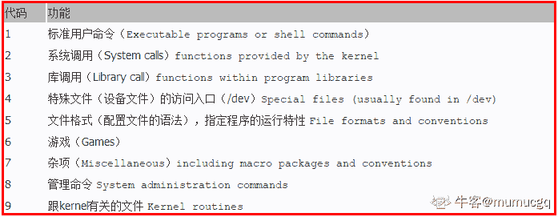
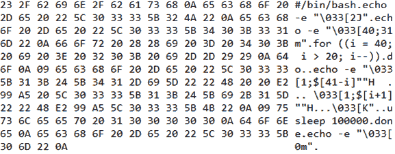

# 恒生公司 2015 秋招开发类笔试题（三）

## 1

下列叙述中正确的是（         ）

正确答案: A   你的答案: 空 (错误)

```cpp
软件测试的主要目的是发现程序中的错误
```

```cpp
软件测试的主要目的是确定程序中错误的位置
```

```cpp
为了提高软件测试的效率，最好由程序编制者自己来完成软件测试的工作
```

```cpp
软件测试是为了证明软件没有错误
```

本题知识点

Java 工程师 C++工程师 iOS 工程师 安卓工程师 运维工程师 前端工程师 c#工程师 golang 工程师 恒生公司 2015

讨论

[Java 后端练习生](https://www.nowcoder.com/profile/534037268)

```cpp
软件测试的主要目的是发现程序中的错误
```

发表于 2021-04-13 15:34:05

* * *

## 2

下列是加密算法的有（            ）

正确答案: B D E   你的答案: 空 (错误)

```cpp
MD5
```

```cpp
DES
```

```cpp
SHA1
```

```cpp
RSA
```

```cpp
RC4
```

本题知识点

Java 工程师 C++工程师 iOS 工程师 安卓工程师 运维工程师 前端工程师 c#工程师 golang 工程师 恒生公司 2015

讨论

[Max,](https://www.nowcoder.com/profile/309215016)

加密算法的目的，在于别人无法成功查看加密后的数据，并且在需要的时候还可以对数据进行解密来重新查看数据。而 MD5 算法是一种哈希算法，哈希算法的设计目标本身就决定了，它在大多数时候都是不可逆的，即你经过哈希算法得出的数据，无法再经过任何算法还原回去。所以，既然不能将数据还原，也就不能称之为可以解密；既然不能解密，那么哈希的过程自然也就不能称作是「加密」了。

发表于 2019-10-10 09:18:15

* * *

[～哎呦喂～](https://www.nowcoder.com/profile/374100306)

RC4 加密算法是大名鼎鼎的 RSA 三人组中的头号人物 Ronald Rivest 在 1987 年设计的密钥长度可变的流加密算法簇。

发表于 2019-09-18 10:33:58

* * *

## 3

Linux 下命令 man 3 sleep 中的参数 3 表示在（          ）章节中查找帮助

正确答案: A   你的答案: 空 (错误)

```cpp
库函数
```

```cpp
标准命令
```

```cpp
系统调用
```

```cpp
其他
```

本题知识点

Java 工程师 C++工程师 iOS 工程师 安卓工程师 运维工程师 前端工程师 c#工程师 golang 工程师 恒生公司 2015

讨论

[mumucgq](https://www.nowcoder.com/profile/8940520)



发表于 2021-03-03 17:51:17

* * *

## 4

在一个单链表中，若要在指针 q 所指节点后面插入一个由指针 p 所指向的节点，则执行（      ）

正确答案: C   你的答案: 空 (错误)

```cpp
p-&gt;next=q-&gt;next; q=p;
```

```cpp
q-&gt;next=p-&gt;next; p-&gt;next=q;
```

```cpp
p-&gt;next=q-&gt;next; q-&gt;next=p;
```

```cpp
q-&gt;next=p-&gt;next; p-&gt;next=q-&gt;next;
```

本题知识点

Java 工程师 C++工程师 iOS 工程师 安卓工程师 运维工程师 前端工程师 c#工程师 golang 工程师 恒生公司 2015

## 5

数组 A[0..5, 0..6]的每个元素占 5 个字节，按行优先次序存储，则元素 A[5, 5]相对 A[0,0]的偏移量是(   )

正确答案: C   你的答案: 空 (错误)

```cpp
175
```

```cpp
180
```

```cpp
200
```

```cpp
205
```

本题知识点

Java 工程师 C++工程师 iOS 工程师 安卓工程师 运维工程师 前端工程师 c#工程师 golang 工程师 恒生公司 2015

讨论

[xxf666](https://www.nowcoder.com/profile/97331668)

0 1 ...0 6 ... 5 0 ...5 5 （6+7*4+6）*5＝200

发表于 2019-09-17 20:08:51

* * *

[牛客 366676512 号](https://www.nowcoder.com/profile/366676512)

6 行 7 列，元素 A[5,5]是第 6 行的第 6 个元素啊，5*7+6 = 41 41*5 不是 205 吗

发表于 2020-10-28 15:37:15

* * *

[远~建](https://www.nowcoder.com/profile/4827882)

6 行 7 列行存储（5*7+5）*5=200

发表于 2019-10-14 10:08:14

* * *

## 6

以下关于数据库中索引的描述正确的是(        )

正确答案: C D   你的答案: 空 (错误)

```cpp
只要允许，任何时候都应该添加索引以加快查询速度
```

```cpp
无论记录多少，使用索引都能给查询带来性能提升
```

```cpp
每次 update/insert/delete 操作都会导致索引被重新更新
```

```cpp
索引可以避免全表扫描
```

本题知识点

Java 工程师 C++工程师 iOS 工程师 安卓工程师 运维工程师 前端工程师 c#工程师 golang 工程师 恒生公司 2015

讨论

[temperament*](https://www.nowcoder.com/profile/441459106)

同样的这道题，前几套都是选 D，到这儿就 CD.....

发表于 2019-09-07 11:40:31

* * *

[北极的小神龙](https://www.nowcoder.com/profile/924130617)

这个题不知道怎么出的

发表于 2019-09-24 08:54:50

* * *

[为了你我愿意热爱整个世界](https://www.nowcoder.com/profile/66345862)

正确答案 CD

发表于 2019-09-20 21:17:23

* * *

## 7

下列哪些可用于进程通信 (        )

正确答案: A B C D   你的答案: 空 (错误)

```cpp
信号
```

```cpp
信号量
```

```cpp
消息队列
```

```cpp
共享内存
```

本题知识点

Java 工程师 C++工程师 iOS 工程师 安卓工程师 运维工程师 前端工程师 c#工程师 golang 工程师 恒生公司 2015

讨论

[Java 后端练习生](https://www.nowcoder.com/profile/534037268)

信号、信号量、消息队列、共享内存可用于进程通信。

发表于 2021-04-13 16:38:19

* * *

## 8

0x12345678 在采用 BigEndian 字节序时在内存中的排列顺序是（  ），在采用 LittleEndian 字节序时在内存中的排列顺序是（  ）

正确答案: A C   你的答案: 空 (错误)

```cpp
12 34 56 78
```

```cpp
34 12 78 56
```

```cpp
78 56 34 12
```

```cpp
56 78 12 34
```

本题知识点

Java 工程师 C++工程师 iOS 工程师 安卓工程师 运维工程师 前端工程师 c#工程师 golang 工程师 恒生公司 2015

讨论

[南风过熙](https://www.nowcoder.com/profile/827484648)

BigEndian 原则是高低高低 字节序高内存地址低 LittleEndian 原则是高高低低  字节序高内存地址高 

编辑于 2019-09-19 17:10:58

* * *

[韵开](https://www.nowcoder.com/profile/934259869)

BigEndian 指数据的低位保存在内存的高地址中，而数据的高位保存在内存的低地址中

LittleEndian 是指数据的低位保存在内存的低地址中，而数据的高位保存在内存的高地址中

发表于 2020-03-20 10:01:22

* * *

## 9

与 UDP 相比，下列哪些是属于 TCP 的特点 (        )

正确答案: A B   你的答案: 空 (错误)

```cpp
需要连接
```

```cpp
流传输
```

```cpp
消息边界保护
```

```cpp
不能保证数据顺序
```

本题知识点

Java 工程师 C++工程师 iOS 工程师 安卓工程师 运维工程师 前端工程师 c#工程师 golang 工程师 恒生公司 2015

## 10

下列关于虚拟内存的说法哪些是正确的 (        )

正确答案: A C   你的答案: 空 (错误)

```cpp
虚拟内存可以比物理内存大
```

```cpp
连续的虚拟内存地址对应连续的物理内存地址
```

```cpp
虚拟内存增加了应用程序可以访问的地址空间
```

```cpp
虚拟内存在物理上扩充了内存容量
```

本题知识点

Java 工程师 C++工程师 iOS 工程师 安卓工程师 运维工程师 前端工程师 c#工程师 golang 工程师 恒生公司 2015

## 11

有变量 char buf[] = ”SH_600570_”;想把其内容修改为 ”SH__600570”，下列哪些语句是正确的 (        )

正确答案:   你的答案: 空 (错误)

```cpp
strcpy(buf + 3, buf + 2);
```

```cpp
strncpy(buf + 3, buf + 2, 7);
```

```cpp
memcpy(buf + 3, buf + 2, 7);
```

本题知识点

Java 工程师 C++工程师 iOS 工程师 安卓工程师 运维工程师 前端工程师 c#工程师 golang 工程师 恒生公司 2015 C++

讨论

[牛客职导官方账号](https://www.nowcoder.com/profile/897353)

【正确答案】D
【解析】str  查看全部)

编辑于 2021-11-19 10:27:09

* * *

[～哎呦喂～](https://www.nowcoder.com/profile/374100306)

memmove() 用来复制内存内容，其原型为： void * memmove(void *dest, const void *src, size_t num); memcpy 函数的功能是从源 src 所指的内存地址的起始位置开始拷贝 N 个字节到目标 dst 所指的内存地址的起始位置中。 memmove 函数的功能同 memcpy 基本一致，但是当 src 区域和 dst 内存区域重叠时，memcpy 可能会出现错误，而 memmove 能正确进行拷贝。

发表于 2019-09-18 17:01:28

* * *

[困兽之斗 V](https://www.nowcoder.com/profile/429817835)

为什么 B 不行呢

发表于 2019-09-22 11:51:05

* * *

## 12

有变量

```cpp
struct{
    char type;
    int num;
    char name[10];
}rec;
```

char 是 1 字节，int 是 4 字节，若按 4 字节对齐，那么 sizeof（rec）等于（）

正确答案: D   你的答案: 空 (错误)

```cpp
15
```

```cpp
16
```

```cpp
18
```

```cpp
20
```

本题知识点

C++工程师 恒生公司 2015 C 语言

讨论

[牛客 462485885 号](https://www.nowcoder.com/profile/462485885)

我的显示多选题

发表于 2022-01-04 10:29:39

* * *

[总是已经被占用](https://www.nowcoder.com/profile/370928276)

要符合最大字节原则  char 要用 int 字节数  char 数组要是 int 4 个字节的倍数 4+4+12=20

发表于 2020-11-06 16:37:26

* * *

[冒泡的大鱼](https://www.nowcoder.com/profile/628320193)

char 占一个字节，int 占 4 个字节，由于字节对齐，前两个元素占 8 个字节，然后 char 数组占 10 个字节，8+10=18,根据字节对齐整数倍，所以为 20 个字节

发表于 2020-03-11 10:47:31

* * *

## 13

函数

```cpp
void foo() {
    static int val;
    ……
}
```

 变量 val 的内存地址位于（）

正确答案: A   你的答案: 空 (错误)

```cpp
未初始化数据段
```

```cpp
已初始化数据段
```

```cpp
堆
```

```cpp
栈
```

本题知识点

C++工程师 恒生公司 2015 C++ C 语言

讨论

[六岁小少年](https://www.nowcoder.com/profile/700975902)

1、栈区（stack）— 由编译器自动分配释放 ，存放函数的参数值，局部变量的值等。2、堆区（heap） — 一般由程序员分配释放， 若程序员不释放，程序结束时可能由 os 回收 。注意它与数据结构中的堆是两回事，分配方式倒是类似于链表。3、全局区（静态区）（static）—全局变量和静态变量的存储是放在一块的，初始化的全局变量和静态变量在一块区域， 未初始化的全局变量和未初始化的静态变量在相邻的另一块区域。程序结束后有系统释放。4、文字常量区 —常量字符串就是放在这里的。 程序结束后由系统释放。5、程序代码区—存放函数体的二进制代码。

编辑于 2020-08-25 16:04:24

* * *

[数组越界师](https://www.nowcoder.com/profile/464453074)

静态变量和全局变量统一储存在一块空间中，其中已经定义的一块，未定义的一块，由系统自动释放

发表于 2020-06-20 19:55:45

* * *

[Despacito007](https://www.nowcoder.com/profile/893487814)

静态变量初始值不是为 0 吗？不明白此题想考察什么内容

发表于 2020-08-29 16:20:22

* * *

## 14

下列关于类的继承描述中，错误的有（          ）

正确答案: A C   你的答案: 空 (错误)

```cpp
派生类可以访问基类的所有数据成员，调用基类的所有成员函数
```

```cpp
派生类继承了基类的全部属性
```

```cpp
可以在派生类中把基类的虚函数重写（override）为非虚函数
```

```cpp
一个基类可以有多个派生类，一个派生类可以有多个基类
```

本题知识点

Java 工程师 C++工程师 iOS 工程师 安卓工程师 运维工程师 前端工程师 c#工程师 golang 工程师 恒生公司 2015

讨论

[Let_Life_Stop](https://www.nowcoder.com/profile/675193179)

继承了，但是无法使用

发表于 2019-09-16 21:29:17

* * *

[Java 后端练习生](https://www.nowcoder.com/profile/534037268)

基类中 private 修饰成员变量和成员函数，可以被继承，但是子类无法使用

发表于 2021-04-13 17:01:36

* * *

[mumucgq](https://www.nowcoder.com/profile/8940520)

基类中 private 修饰成员变量和成员函数，可以被继承，但是子类无法使用

发表于 2021-03-04 08:50:17

* * *

## 15

fun1 和 fun2 都是同一类的两个成员函数，但 fun1 不能直接调用 fun2，这说明（   ）

正确答案: B   你的答案: 空 (错误)

```cpp
fun1 和 fun2 都不是静态函数
```

```cpp
fun1 是静态函数，fun2 不是静态函数
```

```cpp
fun1 和 fun2 都是静态函数
```

```cpp
fun1 不是静态函数，fun2 是静态函数
```

本题知识点

Java 工程师 C++工程师 iOS 工程师 安卓工程师 运维工程师 前端工程师 c#工程师 golang 工程师 恒生公司 2015

讨论

[为了你我愿意热爱整个世界](https://www.nowcoder.com/profile/66345862)

静态方法中不可以调用非静态方法，因为静态方法在类实例化前就写进内存，而非静态成员必须实例化后才写进内存，静态方法可以直接调用，而非静态成员只能用对象来调用。

发表于 2019-09-20 11:17:37

* * *

## 16

下面关于变量及其范围的陈述哪些是不正确的(     )。

正确答案: B   你的答案: 空 (错误)

```cpp
实例变量是类的成员变量
```

```cpp
实例变量用关键字 static 声明
```

```cpp
在方法中定义的局部变量在该方法被执行时创建
```

```cpp
局部变量在使用前必须被初始化
```

本题知识点

Java 工程师 C++工程师 iOS 工程师 安卓工程师 运维工程师 前端工程师 c#工程师 golang 工程师 恒生公司 2015

## 17

下面哪个选项是正确的(     )。String s = “hundsun”;

正确答案: B E   你的答案: 空 (错误)

```cpp
s &gt;&gt;&gt;= 4;
```

```cpp
int i =s.length();
```

```cpp
String short s = s.trim();
```

```cpp
s[3] = “x”;
```

```cpp
String t = “root” + s;
```

本题知识点

Java 工程师 C++工程师 iOS 工程师 安卓工程师 运维工程师 前端工程师 c#工程师 golang 工程师 恒生公司 2015

## 18

下面程序运行之后，关于输出结果的说明正确的是(     )。public  class   Conditional{public  static  void  main(String  args[  ]){int  x=4;System.out.println(“value  is  “+ ((x>4) ? 99.9 :9));}}

正确答案: C   你的答案: 空 (错误)

```cpp
输出结果为：value  is  99.99
```

```cpp
输出结果为：value  is  9
```

```cpp
输出结果为：value  is  9.0
```

```cpp
编译错误
```

本题知识点

Java 工程师 C++工程师 iOS 工程师 安卓工程师 运维工程师 前端工程师 c#工程师 golang 工程师 恒生公司 2015

讨论

[mumucgq](https://www.nowcoder.com/profile/8940520)

在三目运算符 java 开发的环境下可以简单的理解为双目运算符的类型转换问题（便于理解）。其具体规则总结如下：
1）如果定义了数据类型的变量与未定义变量的数值共同参与三元运算符的后双目运算，，那么返回的结果就是范围大（精度高）类型
2）如果两个定义了数据类型的变量共同参与三元运算符的后双目运算，那么返回的结果就是范围大（精度高）类型
3）如果直接进行数值的比较，会自动转型成为范围大（精度高）的数据类型三元操作符必须要返回一个数据。而且类型要确定，不可能条件为真时返回浮点型，条件为假时返回 f 整型，编译器是不允许如此的，所以它就会进行类型转换了. 会根据运算符的精确度类型进行自动类型转换，System.out.println(“value  is  “+ ((x>4) ? 99.9 :9));  由于前面有一个 99.9，所以后面的 9 会被转换成 9.0，所以输出的是 9.0.

发表于 2021-03-04 09:14:49

* * *

[～哎呦喂～](https://www.nowcoder.com/profile/374100306)

冒号后面的值会转变成冒号前面值的类型，不知道为啥，求解释

发表于 2019-09-18 11:55:53

* * *

## 19

关于以下程序代码的说明正确的是(     )。class  HasStatic{private  static  int  x=100；public  static  void  main(String  args[  ]){HasStatic  hs1=new  HasStatic(  );hs1.x++;HasStatic  hs2=new  HasStatic(  );hs2.x++;hs1=new  HasStatic( );hs1.x++;HasStatic.x--;System.out.println(“x=”+x);}}

正确答案: D   你的答案: 空 (错误)

```cpp
5 行不能通过编译，因为引用了私有静态变量
```

```cpp
10 行不能通过编译，因为 x 是私有静态变量
```

```cpp
程序通过编译，输出结果为：x=103
```

```cpp
程序通过编译，输出结果为：x=102
```

本题知识点

Java 工程师 C++工程师 iOS 工程师 安卓工程师 运维工程师 前端工程师 c#工程师 golang 工程师 恒生公司 2015

## 20

下面哪几段代码不会出现编译错误(        )

正确答案: B C D   你的答案: 空 (错误)

```cpp
int i=0; if (i) { System.out.println(“Hi”); }
```

```cpp
boolean b=true; boolean b2=true; if(b==b2) { System.out.println(“So true”); }
```

```cpp
int i=1; int j=2; if(i==1|| j==2) System.out.println(“OK”);
```

```cpp
int i=1; int j=2; if (i==1 &amp;&amp; j==2) System.out.println(“OK”);
```

本题知识点

Java 工程师 C++工程师 iOS 工程师 安卓工程师 运维工程师 前端工程师 c#工程师 golang 工程师 恒生公司 2015

讨论

[angle——mom](https://www.nowcoder.com/profile/887440005)

A 错，if（i）,i 不能从 int 型转为 boolean；应该改为：boolean i=false;
  if(i) {
   System.out.println("hi");
  }

发表于 2019-09-08 10:27:12

* * *

[徐风](https://www.nowcoder.com/profile/503005674)

D 是显示错误了？    &amp;&amp;在代码里直接报红了（这其实是 html 里 & 的转义）&quot; 是 ” 的转义

发表于 2022-02-24 14:29:44

* * *

[xxf666](https://www.nowcoder.com/profile/97331668)

if（i）等价于 if（i！=0） if（！i）等价于 if（i==0）

发表于 2019-09-07 08:02:57

* * *

## 21

数据库

有一个银行存款数据库，包括以下表：

客户信息表 Customer, 客户号为主键

| 客户号 Cid | 客户姓名 CName |

存款交易表 Deposit，每次存款会增加一条记录，流水号为主键

| 存款日期 TradeDate | 流水号 Did | 客户号 Cid | 存款金额 Amount | 营业网点代码 DeptId |

注：存款日期 2009 年 1 月 10 日用整数 20090110 表示

营业网点信息表 Dept, 营业网点代码为主键

| 营业网点代码 DeptId | 网点名称 DName |

写出完成下列要求的 SQL 语句：

1)  查找客户号“88888888”的 2009 全年的存款流水，按日期升序排列

2)  针对上面的查询要求，为 Deposit 表创建一个索引 idx_Deposit

3)  输出整个银行 2009 年全年各网点名称及对应的存款总额。

4)  列出曾经有多笔（2 笔或者大于 2 笔）存款的客户号。

5)  列出客户信息表中没有存款交易的客户，输出客户号和客户姓名。

你的答案

本题知识点

Java 工程师 C++工程师 iOS 工程师 安卓工程师 运维工程师 前端工程师 c#工程师 golang 工程师 恒生公司 2015

讨论

[李世强 0919](https://www.nowcoder.com/profile/158201732)

select Did from Deposit where Cid=88888888 and TradeDate between 20090101 and 20091231 order by TradeDate asc;

发表于 2019-09-29 21:06:38

* * *

[饭特稀 233](https://www.nowcoder.com/profile/9348417)

1、select * from Deposit where cid =’88888888’and tradedate between 20190101 and 20091231 order by asc2、①create index idx_Deposit on table Deposit(cid)   ②alter table Deposit add index idx_Depostit(cid)
3、Select b.DName, count(Amount) from (select a.*, b.DName  from Deposit ajoin Dept b on a.Deptid=b.Deptid) where TradeDate between 20090101 and 200901231 group by b.DName4、Select Cid from Depostit group by Cid having count(Amount)>=25、select a.Cid, a.C.Name from Customer where a.Cid not in (select a.Cid from Customer a left join Deposit b on a.Cid=b.Cid)

编辑于 2020-03-20 17:13:17

* * *

[改个名真 nm 的难](https://www.nowcoder.com/profile/691115983)

说实话看参考答案的第三题每太懂为什么要 min(Dname)和 Group by Deptid 我觉得这样写会容易看懂些 Select DName, sum(Amount) as Amount

from Deposit A, Dept B

Where A.DeptId = B.DeptId

And TradeDate >= 20090101 and TradeDate <= 20091231

Group by DName 结果应该也是对的

发表于 2020-10-08 23:56:10

* * *

## 22

编程题

编写函数把文件以 16 进制方式输出到屏幕，同时以字符方式输出（不可打印的输出为“.”），如：

int dump_file(const char *path);

返回 0 表示成功。

注：C 函数 int isprint(int c);可以用来判断是否可打印。

你的答案

本题知识点

Java 工程师 C++工程师 iOS 工程师 安卓工程师 运维工程师 前端工程师 c#工程师 golang 工程师 恒生公司 2015

讨论

[牛客 227361527 号](https://www.nowcoder.com/profile/227361527)

#include <stdio.h>#include <string.h>

void print_HEX(char *txt)
{
    while(*txt != '\0'){
        if(isprint(*txt)){
            printf("%x ",*txt);
        }else{
            printf(".\n");
        }
        txt++;
    }
}
int main(){
    FILE *fp;
    fp = fopen("test.txt","r");
    char txt[1024] = {'\0'};
    fread(txt,sizeof(char),1024,fp);
    fclose(fp);
    print_HEX(txt);
    return 0;
}

编辑于 2020-09-18 15:16:47

* * *

## 23

算法题

[java]:

    平行的结构转换为树形的结构：

    已知类：TreeNode

| import java.util.ArrayList;import java.util.List;public  class TreeNode {  private String id;  private String parentId;  private List<TreeNode> children; //get/set… } |

    要求：提供一个静态工具方法输入平行结构的 TreeNode 集合，返回梳理好上下级关系后的 TreeNode 集合（需要考虑多个根节点）

    如：输入的结构是：

| [{id:1}, {id:2,parendId:1}, {id:3, parendId:1}] |

输出的结构是：

| [{id:1,children:[{id:3, parendId:1},{id:2, parendId:1}]}] |

    如：id:1,pid:

    一个 N*N 的矩阵，每个元素都是 0 或者 1。把给定坐标 row，col 的元素设置为 1 后，若某元素上下左右 4 个紧邻的元素中有超过 2 个是 1，则该元素也要设置成 1，直到没有需要设置的为止，此时称为“稳定”状态。如：

1 0 0 1 1 0

0 1 0 0 0 0

0 0 0 1 0 0

0 1 0 0 1 0

0 0 1 0 1 0

0 0 1 0 0 1

设置 2,2，最终变为：

1 0 0 1 1 0

0 1 0 0 0 0

0 1 1 1 0 0

0 1 1 1 1 0

0 0 1 1 1 0

0 0 1 0 0 1

假设初始矩阵是稳定的，编程实现下面的函数：

int update_matrix(int matrix[N][N], int row, int col);

返回值是这次设置成 1 的个数。

你的答案

本题知识点

Java 工程师 C++工程师 iOS 工程师 安卓工程师 运维工程师 前端工程师 c#工程师 golang 工程师 恒生公司 2015

讨论

[YHH～(^_^)](https://www.nowcoder.com/profile/572810942)

？？？？？？？？😪😪😪

发表于 2019-09-21 16:40:15

* * *</stdio.h>