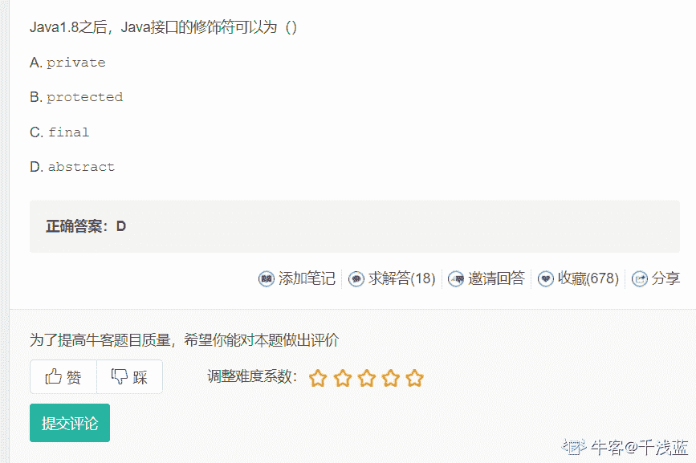

# 恒生公司 2015 秋招开发类笔试题（四）

## 1

给定 C 语言数据结构

```cpp
struct T{
    long w;
    union U {
        char c;
        int i;
        double d;
    } u1;
} T1;
```

假设在 64 位系统下，在不考虑字对齐方式的情况下为存储 T1 结构所需要的存储区域可能为（）字节。

正确答案: C   你的答案: 空 (错误)

```cpp
12
```

```cpp
17
```

```cpp
16
```

```cpp
21
```

```cpp
25
```

本题知识点

C++工程师 恒生公司 2015 C 语言

讨论

[angle——mom](https://www.nowcoder.com/profile/887440005)

c 语言中的 union 是联合体，就是一个多个变量的结构同时使用一块内存区域，区域的取值大小为该结构中长度最大的变量的值;（1）32 位：double 8 字节，long 4 字节，则最终 12 字节；（2）64 位：double8 字节，long8 字节，最终 16 字节

发表于 2019-08-28 22:34:42

* * *

[ZhenyuTan](https://www.nowcoder.com/profile/650543907)

1.  c/c++
2.  32 位编译器  

4.  char ：1 个字节  
5.  char*（即指针变量）: 4 个字节（32 位的寻址空间是 2³², 即 32 个 bit，也就是 4 个字节。同理 64 位编译器）  
6.  short int : 2 个字节  

8.  int：  4 个字节  
9.  unsigned int : 4 个字节  
10.  float:  4 个字节  
11.  double:   8 个字节  
12.  long:   4 个字节  
13.  long long:  8 个字节  
14.  unsigned long:  4 个字节  

16.  64 位编译器  
17.  char ：1 个字节  
18.  char*(即指针变量): 8 个字节  
19.  short int : 2 个字节  
20.  int：  4 个字节  
21.  unsigned int : 4 个字节  
22.  float:  4 个字节  
23.  double:   8 个字节  
24.  long:   8 个字节  
25.  long long:  8 个字节  
26.  unsigned long:  8 个字节

[`blog.csdn.net/sinat_34166518/article/details/80108497`](https://blog.csdn.net/sinat_34166518/article/details/80108497)他说的是 64 系统并不是 64 位编辑器，有可能位 32 位有可能位 64 位

发表于 2019-08-27 18:50:18

* * *

[Rukawalee](https://www.nowcoder.com/profile/4017316)

这题不是都在 64 位下了吗？

发表于 2019-09-04 23:51:32

* * *

## 2

下面哪些是对称加密算法（）

正确答案: A B   你的答案: 空 (错误)

```cpp
DES
```

```cpp
AES
```

```cpp
DSA
```

```cpp
RSA
```

本题知识点

Java 工程师 C++工程师 iOS 工程师 安卓工程师 运维工程师 前端工程师 c#工程师 golang 工程师 恒生公司 2015

讨论

[mumucgq](https://www.nowcoder.com/profile/8940520)

 对称加密算法

指加密和解密使用相同密钥的加密算法。对称加密算法用来对敏感数据等信息进行加密，常用的算法包括 DES、3DES、AES、DESX、Blowfish、、RC4、RC5、RC6。

     DES（Data Encryption Standard）：数据加密标准，速度较快，适用于加密大量数据的场合。

     3DES（Triple DES）：是基于 DES，对一块数据用三个不同的密钥进行三次加密，强度更高。

     AES（Advanced Encryption Standard）：高级加密标准，是下一代的加密算法标准，速度快，安全级别高；

非对称加密算法

 指加密和解密使用不同密钥的加密算法，也称为公私钥加密。假设两个用户要加密交换数据，双方交换公钥，使用时一方用对方的公钥加密，另一方即可用自己的私钥解密。常见的非对称加密算法：RSA、DSA（数字签名用）、ECC（移动设备用）、Diffie-Hellman、El Gamal。

        RSA：由 RSA 公司发明，是一个支持变长密钥的公共密钥算法，需要加密的文件块的长度也是可变的；

        DSA（Digital Signature Algorithm）：数字签名算法，是一种标准的 DSS（数字签名标准）；

        ECC（Elliptic Curves Cryptography）：椭圆曲线密码编码学。

发表于 2021-03-04 18:06:40

* * *

## 3

二叉树是一种树形结构，每个节点至多有两颗子树，下列一定是二叉树的是（）

正确答案: A C   你的答案: 空 (错误)

```cpp
红黑树
```

```cpp
B 树
```

```cpp
AVL 树
```

```cpp
B+树
```

本题知识点

Java 工程师 C++工程师 iOS 工程师 安卓工程师 运维工程师 前端工程师 c#工程师 golang 工程师 恒生公司 2015

讨论

[y 音](https://www.nowcoder.com/profile/272150172)

红黑树和 AVL 树都是自平衡二叉查找树。

发表于 2019-09-19 13:40:22

* * *

## 4

同一进程下的线程可以共享（）

正确答案: B   你的答案: 空 (错误)

```cpp
stack
```

```cpp
data section
```

```cpp
register set
```

```cpp
thread ID
```

本题知识点

Java 工程师 C++工程师 iOS 工程师 安卓工程师 运维工程师 前端工程师 c#工程师 golang 工程师 恒生公司 2015

讨论

[Let_Life_Stop](https://www.nowcoder.com/profile/675193179)

线程共享的是：1\. 文件描述符表 2\. 每种信号的处理方式 3\. 当前工作目录  4\. 用户 ID 和 组 ID 5\. 内存地址空间（.data ,.txt ,.bss ,heap ，共享库）线程不共享的是：1\. 线程 ID 2\. 处理器线程 和 栈指针 3\. 独立的栈空间 4\. errno 变量 5\. 信号屏蔽字 6\. 调度优先级进程共享的是：CPU 和 内存 进程不共享的是：独立的地址空间全局变量写的不全，希望大家继续补充

发表于 2019-09-12 09:24:37

* * *

[牛客 925427491 号](https://www.nowcoder.com/profile/925427491)

《UNIX 环境高级编程》1.6 节说

> All threads within a process share the same address space, file descriptors, stacks, and process-related attributes.

为什么 A 不对？

发表于 2021-03-28 22:40:29

* * *

[不搞笑？](https://www.nowcoder.com/profile/115168205)

线程共享的环境包括：进程代码段、进程的公有数据(利用这些共享的数据，线程很容易的实现相互之间的通讯)、进程打开的文件描述符、信号的处理器、进程的当前目录和进程用户 ID 与进程组 ID

发表于 2019-09-25 21:50:53

* * *

## 5

系统中的“颠簸”是由（）引起的。

正确答案: B   你的答案: 空 (错误)

```cpp
内存容量不足
```

```cpp
缺页率高
```

```cpp
交换信息量大
```

```cpp
缺页率反馈模型不正确
```

本题知识点

Java 工程师 C++工程师 iOS 工程师 安卓工程师 运维工程师 前端工程师 c#工程师 golang 工程师 恒生公司 2015

讨论

[它解](https://www.nowcoder.com/profile/185487004)

操作系统颠簸是指，一个被换出的页，在很快就会再次被访问，影响效率

发表于 2019-08-24 16:35:16

* * *

## 6

下列 HTTP 错误代码描述正确的是：

正确答案: A B   你的答案: 空 (错误)

```cpp
HTTP 502 - 网关错误
```

```cpp
HTTP 403 - 禁止访问
```

```cpp
HTTP 404 - 无法找到文件
```

```cpp
HTTP 500 - 请求无效
```

本题知识点

Java 工程师 C++工程师 iOS 工程师 安卓工程师 运维工程师 前端工程师 c#工程师 golang 工程师 恒生公司 2015

讨论

[xxf666](https://www.nowcoder.com/profile/97331668)

100 - 继续。 101 - 切换协议。 110 重新启动标记答复。 120 服务已就绪，在 nnn 分钟后开始。 125 数据连接已打开，正在开始传输。 150 文件状态正常，准备打开数据连接。 200 - 确定。客户端请求已成功。 201 - 已创建。 202 - 已接受。 203 - 非权威性信息。 204 - 无内容。 205 - 重置内容。 206 - 部分内容。 211 系统状态，或系统帮助答复。 332 需要登录帐户。 350 请求的文件操作正在等待进一步的信息。 400 - 错误的请求。 401 - 访问被拒绝。 401.2 - 服务器配置导致登录失败。 401.3 - 由于 ACL 对资源的限制而未获得授权。 401.4 - 筛选器授权失败。 401.5 - ISAPI/CGI 应用程序授权失败。 401.7 – 访问被 Web 服务器上的 URL 授权策略拒绝。这个错误代码为 IIS 6.0 所专用。 403 - 禁止访问。 404 - 未找到。 405 - 用来访问本页面的 HTTP 谓词不被允许（方法不被允许） 406 - 客户端浏览器不接受所请求页面的 MIME 类型。 415 – 不支持的媒体类型。 417 – 执行失败。 423 – 锁定的错误。 425 无法打开数据连接。 450 未执行请求的文件操作。文件不可用（例如，文件繁忙）。 451 请求的操作异常终止：正在处理本地错误。 452 未执行请求的操作。系统存储空间不够。 500 - 内部服务器错误。

发表于 2019-09-06 22:27:28

* * *

[王小猛](https://www.nowcoder.com/profile/7454669)

502-网关错误

编辑于 2019-10-16 20:47:29

* * *

[享受人生 201806140911863](https://www.nowcoder.com/profile/427252116)

C 为什么错误？难道是表述准确？

发表于 2020-07-15 14:49:01

* * *

## 7

以下程序的输出结果是（）

```cpp
int main() {
    int a[3][3] = {{1, 2}, {3, 4}, {5, 6}}, i, j, s = 0;
    for(i = 1; i < 3; i++)
        for(j = 0; j <= i; j++) s += a[i][j];
    printf("%d\n", s++);
}
```

正确答案: A   你的答案: 空 (错误)

```cpp
18
```

```cpp
19
```

```cpp
20
```

```cpp
21
```

本题知识点

C++工程师 恒生公司 2015 C 语言

讨论

[顾珏](https://www.nowcoder.com/profile/572888309)

s++输出后再执行

发表于 2021-03-17 17:58:16

* * *

[海绵宝宝的牙齿是我](https://www.nowcoder.com/profile/593391942)

i=1，不是从 0 开始

发表于 2020-08-31 10:54:31

* * *

[一阵强风吹过](https://www.nowcoder.com/profile/675553060)

a[3][3] = { 1,2,0

3,4,0

5,6,0};    s = 3+4+5+6+0;

发表于 2019-09-25 17:00:47

* * *

## 8

下列正确的选项是 （）

正确答案: A   你的答案: 空 (错误)

```cpp
继承是创建一个具有别的类的属性和行为的新类的能力
```

```cpp
C 语言支持面向对象的程序设计
```

```cpp
空白符是一种可以被编译的符号
```

```cpp
标示符不宜过长，一般认为 16 个字符以内
```

本题知识点

C++工程师 恒生公司 2015 C++ C 语言

讨论

[Bloncoo](https://www.nowcoder.com/profile/885854554)

C++是一种可以支持面向对象的程序设计语言，C 是面向过程的空白符，包括空格、制表符、换行符，只是用来占位，没有实际内容。对于编译器来说，有点会被忽略（一般是在（）钟）；有的不会被忽略（一般是在“”中）标识符在 C 语言 中一般是 8 字符，在 C++中一般是 32 字符，在 Java 中则没有限制

发表于 2020-03-08 15:34:48

* * *

[问渠那得清](https://www.nowcoder.com/profile/350018007)

面向对象只是一种思想，比如 Linux 源码文件系统等都运用了面向对象，答案不太严谨。

发表于 2021-03-06 21:51:20

* * *

[whoway](https://www.nowcoder.com/profile/258551806)

*   啊这，讲一下 B 选项。应该说不严谨吧，可以支持的啊
*   其实 C 语言是可以支持模拟“面向对象程序设计”的
    比如，某个函数参数用 this 指针可以绑定某个结构体，模拟 C++中的类，用全局函数和 static 模拟 C++中 static 成员函数等。
*   好像有人说过，某 C++编译器啥的，底层就是利用的 C 语言模拟面向对象。
*   此外，具体的还可以看看知乎上这篇关于“[C 语言模拟面向对象](https://www.zhihu.com/question/59292999)”

发表于 2020-11-04 11:13:37

* * *

## 9

int A[2][3] = {1, 2, 3, 4, 5, 6};， 则 A[1][0]和*(*(A+1)+1)的值分别是（）

正确答案: A   你的答案: 空 (错误)

```cpp
4 5
```

```cpp
4 3
```

```cpp
3 5
```

```cpp
3 4
```

本题知识点

C++工程师 恒生公司 2015 C 语言

讨论

[牛客 784901012 号](https://www.nowcoder.com/profile/784901012)

1 2 34 5 6 首先把二维数组看成一个一维数组，其中每一行为一个元素，即 123   456  （123 和 456 各为一的整体）则对 *（*（A+1）+1）进行刨析 A 为（一维数组）首元素地址，即元素 123 的地址。所以（A+1）为元素 456 的地址*（A+1）解引用为数组 4 5 6*（A+1）为数组名，也是首元素地址，而 *（A+1）+1 为元素 5 的地址解引用 *（*（A+1）+1）为 5 

发表于 2021-08-17 10:25:03

* * *

[杨柳缘](https://www.nowcoder.com/profile/214042418)

A 是个二维数组, *(A+1) 可以理解为 取第一维的操作, 即 A[1], 后面的同理, 最终得到 A[1][1]

发表于 2019-09-20 09:41:28

* * *

[xxf666](https://www.nowcoder.com/profile/97331668)

数组 A 一共 2 行 3 列，第 0 行为 123，第 1 行为 456 A[1][0]为第 1 行第 0 列数字 4 *（A+1）指向数组第 1 行第 0 个元素 *（A+1）+1 指向数组第 1 行第 1 个元素 再取*则为第 1 行第 1 个元素的值 5 因此为 4,5

发表于 2019-09-06 22:32:32

* * *

## 10

设有图书管理数据库：图书(总编号 C(6),分类号 C(8),书名 C(16),作者 C(6),出版单位 C(20),单价 N(6,2))读者(借书证号 C(4),单位 C(8),姓名 C(6),性别 C(2),职称 C(6),地址 C(20))借阅(借书证号 C(4),总编号 C(6),借书日期 D(8))对于图书管理数据库，检索借阅了《现代网络技术基础》一书的借书证号。下面 SQL 语句正确的是 ______。SELECT 借书证号 FROM 借阅 WHERE 总编号=;______

正确答案: B   你的答案: 空 (错误)

```cpp
(SELECT 借书证号 FROM 图书 WHERE 书名=&quot;现代网络技术基础&quot;)
```

```cpp
(SELECT 总编号 FROM 图书 WHERE 书名=&quot;现代网络技术基础&quot;)
```

```cpp
(SELECT 借书证号 FROM 借阅 WHERE 书名=&quot;现代网络技术基础&quot;)
```

```cpp
(SELECT 总编号 FROM 借阅 WHERE 书名=&quot;现代网络技术基础&quot;)
```

本题知识点

Java 工程师 C++工程师 iOS 工程师 安卓工程师 运维工程师 前端工程师 c#工程师 golang 工程师 恒生公司 2015

## 11

以下变量的定义，正确的是（）

正确答案: B D   你的答案: 空 (错误)

```cpp
int  3man；
```

```cpp
int  i, *pi；
```

```cpp
int  3man’shoes；
```

```cpp
short int  si；
```

本题知识点

C++工程师 恒生公司 2015 C++ C 语言

讨论

[卯花之佐久夜姬](https://www.nowcoder.com/profile/325225246)

C 语言中，变量开头是不能用数字的，正确答案应该选 BD

发表于 2020-08-03 20:40:22

* * *

[为了你我愿意热爱整个世界](https://www.nowcoder.com/profile/66345862)

正确答案是 BD

发表于 2019-09-20 16:45:46

* * *

[它解](https://www.nowcoder.com/profile/185487004)

上面是在 c 语言里面吗，没看懂啊。在 java 中，那些命名是不可以的啊

发表于 2019-08-24 16:45:17

* * *

## 12

以下描述不正确的是（）

正确答案: D   你的答案: 空 (错误)

```cpp
在 C 程序中，逗号运算符的优先级最低
```

```cpp
在 C 程序中，APH 和 aph 是两个不同的变量
```

```cpp
若 a 和 b 类型相同，在计算了赋值表达式 a=b 后 b 中的值将放入 a 中，而 b 中的值不变
```

```cpp
当从键盘输入数据时，对于整型变量只能输入整型数值，对于实型变量只能输入实型数值
```

本题知识点

C++工程师 恒生公司 2015 C 语言

讨论

[xxf666](https://www.nowcoder.com/profile/97331668)

整型变量可以输入实型数值 例如 int 类型 i，输入浮点型时会隐式转换为整形

发表于 2019-09-06 22:38:32

* * *

[牛客 385115731 号](https://www.nowcoder.com/profile/385115731)

优先级最低的是赋值

发表于 2021-01-15 19:17:10

* * *

[Z_M](https://www.nowcoder.com/profile/102919235)

若两个都是 int 型数组时，c 不就错了

发表于 2021-09-23 16:36:41

* * *

## 13

定义一个共用体变量时，系统分配给他的内存单元是(      )。

正确答案: B   你的答案: 空 (错误)

```cpp
全部成员所需的内存量之和
```

```cpp
全部成员所需的内存量的最大值
```

```cpp
固定的容量
```

```cpp
共用体中第一个成员所需的容量
```

本题知识点

Java 工程师 C++工程师 iOS 工程师 安卓工程师 运维工程师 前端工程师 c#工程师 golang 工程师 恒生公司 2015

讨论

[瀟嚴](https://www.nowcoder.com/profile/659298816)

共用体中的不同变量起始地址都是相同的。
就是说它们只是同一单元的不同别名而已。
共用体的大小由成员中最大的那个成员决定。

发表于 2019-09-10 21:59:57

* * *

## 14

在 C 语言中，关于静态变量的说法，不正确的有（）

正确答案: B C D   你的答案: 空 (错误)

```cpp
函数中的静态变量，在函数退出后不被释放
```

```cpp
静态变量只可以赋值一次，赋值后则不能改变
```

```cpp
静态全局变量的作用域为一个程序的所有源文件
```

```cpp
静态全局变量过大，可能会导致堆栈溢出
```

本题知识点

C++工程师 恒生公司 2015 C 语言

讨论

[小阿花 Minty](https://www.nowcoder.com/profile/724882383)

B 选项：静态全局变量可以重复赋值 C 选项：作用域为当前文件 D 选项：静态全局变量不是存在堆栈里的，所以不存在堆栈溢出

发表于 2020-09-03 22:48:32

* * *

[xxf666](https://www.nowcoder.com/profile/97331668)

静态全局变量，又称全局静态变量，是在全局变量前加一个 static，使该变量只在这个源文件中可用。 全局变量也称为外部变量，它是在函数外部定义的变量。 它不属于哪一个函数，它属于一个源程序文件。其作用域是从定义该变量的位置开始至源文件结束。 全局变量是在所有函数体的外部定义的，程序的所在部分（甚至其它文件中的代码）都可以使用。全局变量不受作用域的影响（也就是说，全局变量的生命期一直到程序的结束）。如果在一个文件中使用 extern 关键字来声明另一个文件中存在的全局变量，那么这个文件可以使用这个数据。

发表于 2019-09-06 22:40:29

* * *

[牛客 908767953 号](https://www.nowcoder.com/profile/908767953)

静态局部变量和静态全局变量都是在静态存储区分配存储单元

发表于 2022-02-21 19:55:50

* * *

## 15

若变量 a 已说明为 float 类型，则能实现将 a 中的数值保留小数点后两位，第三位进行四舍五入运算的表达式是（   ）。

正确答案: C   你的答案: 空 (错误)

```cpp
a=(a*100+0.5)/100.0
```

```cpp
a=(a*100+0.5)/100
```

```cpp
a=(int)(a*100+0.5)/100.0
```

```cpp
a=(a/100+0.5)*100.0
```

本题知识点

Java 工程师 C++工程师 iOS 工程师 安卓工程师 运维工程师 前端工程师 c#工程师 golang 工程师 恒生公司 2015

讨论

[～哎呦喂～](https://www.nowcoder.com/profile/374100306)

java 中这样的语句报错

发表于 2019-09-18 18:06:50

* * *

## 16

已知如下代码，输出结果为（     ）。public class Test {public static void main(String arg[]) {String str = "123tad 恒 utf";System.out.print(str.length());System.out.print(",");System.out.print(str.getBytes().length);}}

正确答案: B D   你的答案: 空 (错误)

```cpp
11,11
```

```cpp
10,12
```

```cpp
11,12
```

```cpp
10,11
```

```cpp
12,12
```

本题知识点

Java 工程师 C++工程师 iOS 工程师 安卓工程师 运维工程师 前端工程师 c#工程师 golang 工程师 恒生公司 2015

讨论

[xxf666](https://www.nowcoder.com/profile/97331668)

String.length() 返回字符串的字符个数，一个中文算一个字符； String.getBytes().length 返回字符串的字节长度，一个中文两个字节； strlen 函数是不包括‘\0’的长度的，sizeof 计算的结果才包括'\0'的长度 JAVA 中 utf 编码下一个汉字占三个字节，gdk 下两个字节

发表于 2019-09-06 22:54:30

* * *

[啊，职位啊](https://www.nowcoder.com/profile/758349753)

java 中，utf 编码下，一个汉字占 3 个字节，gbk 下占两个字节

发表于 2019-09-02 00:28:29

* * *

## 17

Java 接口的修饰符可以为（     ）

正确答案: C D   你的答案: 空 (错误)

```cpp
private
```

```cpp
protected
```

```cpp
final
```

```cpp
abstract
```

本题知识点

Java 工程师 C++工程师 iOS 工程师 安卓工程师 运维工程师 前端工程师 c#工程师 golang 工程师 恒生公司 2015

讨论

[千浅蓝](https://www.nowcoder.com/profile/293907688)



发表于 2020-09-15 22:19:23

* * *

[徐风](https://www.nowcoder.com/profile/503005674)

final  修饰接口， 接口不被实现，我要这个接口干嘛？ 取常量？试了一下，final 不能修饰接口。什么勾吧题目，表述不清楚

发表于 2022-02-23 12:12:14

* * *

[xxf666](https://www.nowcoder.com/profile/97331668)

java 接口的修饰符：abstract 接口中字段的修饰符：public static final（默认不写）  接口中不可以定义变量即定义的变量前都要加上 final 修饰，使之成为常量(没有 final 修饰的是变量，加上 final 修饰就会变成常量)。所以接口的属性默认是 public static final 常量，且必须赋初值。（  final 修饰就是保证接口定义的常量不能被实现类去修改，如果没有 final 的话，由子类随意去修改的话，接口建立这个常量就没有意义了。）

发表于 2019-09-06 22:58:07

* * *

## 18

Jsp 中的内置对象有(     )

正确答案: A B C E F   你的答案: 空 (错误)

```cpp
request
```

```cpp
config
```

```cpp
out
```

```cpp
cookie
```

```cpp
session
```

```cpp
pageContext
```

本题知识点

Java 工程师 C++工程师 iOS 工程师 安卓工程师 运维工程师 前端工程师 c#工程师 golang 工程师 恒生公司 2015

讨论

[xxf666](https://www.nowcoder.com/profile/97331668)

JSP 九大内置对象: request，response，session，application，out，pagecontext，config，page，exception

发表于 2019-09-06 23:01:30

* * *

[_ 过客](https://www.nowcoder.com/profile/465099646)

Acde

发表于 2019-10-24 21:01:01

* * *

## 19

在 Java 中，负责对字节代码解释执行的是(     )

正确答案: B   你的答案: 空 (错误)

```cpp
应用服务器
```

```cpp
虚拟机
```

```cpp
垃圾回收器
```

```cpp
编译器
```

本题知识点

Java 工程师 C++工程师 iOS 工程师 安卓工程师 运维工程师 前端工程师 c#工程师 golang 工程师 恒生公司 2015

讨论

[睡死的](https://www.nowcoder.com/profile/559017826)

B

我们写好的代码文件是 java 文件，虚拟机真正执行的是 class 文件，class 文件即字节码文件。

编译器是把我们的代码编译成 class 文件，javac 命令。

发表于 2020-04-21 12:32:03

* * *

[xxf666](https://www.nowcoder.com/profile/97331668)

java 中负责对字节代码解释执行的是虚拟机，虚拟机将得到的字节代码进行编码运行。 java 程序，是先把 java 源程序通过 javac 命令编译成字节码文件，然后再用 java 命令解释执行。把字节码文件复制到其它计算机上，只要有 java 虚拟机就可以用 java 命令来执行。

发表于 2019-09-06 23:02:57

* * *

## 20

以下哪个方法是线程启动调用的方法(     )。

正确答案: C   你的答案: 空 (错误)

```cpp
init()
```

```cpp
start()
```

```cpp
run()
```

```cpp
main()
```

本题知识点

Java 工程师 C++工程师 iOS 工程师 安卓工程师 运维工程师 前端工程师 c#工程师 golang 工程师 恒生公司 2015

讨论

[xxf666](https://www.nowcoder.com/profile/97331668)

启动线程肯定要用 start()方法。当用 start()开始一个线程后，线程就进入就绪状态，使线程所代表的虚拟处理机处于可运行状态，这意味着它可以由 JVM 调度并执行。这并不意味着线程就会立即运行。当 cpu 分配给它时间时，才开始执行 run()方法(如果有的话)。START()是方法,它调用 RUN()方法.而 RUN()方法是你必须重写的. run()方法中包含的是线程的主体

发表于 2019-09-06 23:05:02

* * *

[～哎呦喂～](https://www.nowcoder.com/profile/374100306)

B

发表于 2019-09-18 18:14:45

* * *

[Zhnan](https://www.nowcoder.com/profile/88037187)

启动就是运行吗？

发表于 2021-03-09 12:03:19

* * *

## 21

一、数据库

下面是两个数据库表，分别记录员工姓名和员工工资：

| T_EMPLOYEE |
| ID | NAME | GMT_CREATE | GMT_MODIFY |
| 2 | 张三 | 2014-03-04 | 2014-03-04 |
| 3 | 李四 | 2014-03-15 | 2014-06-07 |
| 5 | 王五 | 2014-03-04 | 2014-07-04 |
| ····· | ····· | ····· | ····· |

注：NAME 唯一

| T_SALARY |  |
| EMPLOYEE_ID | SALARY | MONTH | GMT_CREATE |
| 2 | 3400 | 201403 | 2014-03-26 |
| 3 | 4300 | 201403 | 2014-03-26 |
| 2 | 3400 | 201404 | 2014-04-26 |
| ····· | ····· | ····· | ····· |

请编写 SQL 解决以下问题：

1)  查询表 T_EMPLOYEE 中 id = 3 的员工记录

2)  查询 2014 年 3 月份所有员工薪水，SALARY 从高到低排列

| NAME | SALARY | MONTH |
|  |  |  |

3)  增加员工“王五”2014 年 5 月份工资为 3000 的记录，GMT_CREATE 时间取数据库系统时间

4)  查询 2014 年 4 月份未发工资的员工姓名

5)  删除员工姓名为“李四”的员工信息和工资信息

你的答案

本题知识点

Java 工程师 C++工程师 iOS 工程师 安卓工程师 运维工程师 前端工程师 c#工程师 golang 工程师 恒生公司 2015

讨论

[为了你我愿意热爱整个世界](https://www.nowcoder.com/profile/66345862)

```cpp
1.
select * 
from T_EMPLOYEE
where id=3;
2.
select te.Name,ts.salary,ts.month
from T_EMPLOYEE te,T_SALARY ts
where te.ID = ts.EMPLOYEE_ID
and ts.month='201403'
order by salary desc;
3.
insert into T_SALARY (EMPLOYEE_ID,SALARY,MONTH,GMT_CREATE)
values((select ID from T_EMPLOYEE E where E.NAME='王五',3000,'201405',curdate()));

4.
select NAME
from T_EMPLOYEE E
where not exists(select 1 from T_SALARY S 
where E.ID=EMPLOYEE_ID 
and S.MONTH='201404');
5.
delete from T_EMPLOYEE E,T_SALARY S
where E.ID = S.EMPLOYEE_ID
and E.NAME='李四';

```

编辑于 2019-10-06 17:52:07

* * *

[～哎呦喂～](https://www.nowcoder.com/profile/374100306)

3、INSERT INTO T_SALARY(EMPLOYEE_ID, SALARY, MONTH, GMT_CREATE) VALUES ((SELECT ID FROM T_EMPLOYEE WHERE NAME='王五'), 3000, 201403, CURDATE()) 4、DELETE T_EMPLOYEE, T_SALARY FROM T_EMPLOYEE A INNER JOIN T_SALARY B ON A.ID=B.EMPLOYEE_ID WHERE A.NAME='李四'

发表于 2019-09-17 17:01:22

* * *

[徐风](https://www.nowcoder.com/profile/503005674)

```cpp
(1)
select *
from T_EMPLOYEE 
where id = 3;

(2)
select name, salary, month
from T_SALARY s, T_EMPLOYEE e
where month = '201405' and
	  s.EMPLOYEE_ID = e.ID
order by salary desc;

(3)
-- mysql  sysdate()  返回时间格式：2012-12-08 15:41:25
insert into T_SALARY(EMPLOYEE_ID, SALARY, MONTH, GMT_CREATE)
values((select id from T_EMPLOYEE where NAME = '王五'), 3000, '201405', sysdate());

-- oracle 获取的时间格式：
insert into T_SALARY(EMPLOYEE_ID, SALARY, MONTH, GMT_CREATE)
values((select id from T_EMPLOYEE where NAME = '王五'), 3000, '201405', sysdate);

-- mysql 符合题目时间格式
insert into T_SALARY(EMPLOYEE_ID, SALARY, MONTH, GMT_CREATE)
values((select id from T_EMPLOYEE where NAME = '王五'), 3000, '201405', current_date());

(4)
select name 
from T_EMPLOYEE
where id not in(select EMPLOYEE_ID
                from T_SALARY
                where MONTH = '201404');

(5)
delete from T_SALARY
where EMPLOYEE_ID = (select ID
                     from T_EMPLOYEE
                     where NAME = '李四');

delete from T_EMPLOYEE
where name = '李四';

-- 添加事务处理(oracle )
delete from T_SALARY
where EMPLOYEE_ID = (select ID
                     from T_EMPLOYEE
                     where NAME = '李四');

delete from T_EMPLOYEE
where name = '李四';

commit;
```

发表于 2022-02-23 14:37:32

* * *

## 22

编程题
功能是将字符串 s1 的内容反转后输出到 s2，比如 s1="12345678",则输出 s2 为"87654321"，实现语言选择一种即可。

1)   C 语言实现时要求不能使用包括 strlen 在内的任何库函数，也不能定义和使用除 s1、s2 以外的其它变量。使用如下原型的 C 函数 void reverse(const char *s1, char *s2);

2)   JAVA 语言实现时不能使用 StringBuffer 等类提供工具方法，自行实现函数定义 void reverse(char s1[])

你的答案

本题知识点

Java 工程师 C++工程师 iOS 工程师 安卓工程师 运维工程师 前端工程师 c#工程师 golang 工程师 恒生公司 2015

讨论

[小小怪的很](https://www.nowcoder.com/profile/37884715)

```cpp
# include<iostream>
# include<string>
using namespace std;
//主方法在最下面

void reverse(const char * p1 , char * p2) {
	//将指针 p1 移向 s1 的尾部
	while (*p1 != '\0') {
		p1++;
	}
	//因为 s1 的尾部是'\0',所以再前回移一个位置，让指针指向 s1 的最后一个字符。
	p1--;

	//利用指针 p2,将数组的首元素置为空。（空和 0 可不是一个概念呦）
	*p2 = '\0';
	//指针后移一个位置
	p2++;
	//利用两个指针，将 s1 中的字符倒着装进数组 s2 中
	while(*p1) {
		*p2 = *p1;
		p2++;
		p1--;
	}
	//已经将 s1 中的字符全部装进数组 s2 中，而且顺序颠倒。此时指针 p2 指向最后一个字符数组元素，下一个位置。
	//将指针指向的数组空间置为'\0'（空）
	*p2 = '\0';
	//将指针向左移动一个位置，让指针指向非空
	p2--;
	//备注：此时数组 s2 中的元素为“'\0'87654321'\0'”,两次置为'\0'是为了遍历是方便

	//将指针左移，让指针指向数组的第一个非空元素。
	while(*p2) {
		p2--;
	}
	//让指针指向数组的第一个非空元素。
	p2++;
	//利用指针，遍历输出数组中储存的字符串儿的字符。
	while(*p2) {
		cout<<*p2<<endl;
		p2++;
	}
}
int main() {
	string s1 = "12345678";
	char s2[100];
	reverse(s1.c_str() , s2);
	return 0;	
}
```

发表于 2019-09-17 16:52:38

* * *

[牛客 164129652 号](https://www.nowcoder.com/profile/164129652)

```cpp
import java.util.Scanner;

public class Main {
    public static void main(String[] args) {
        Scanner in = new Scanner(System.in);
        String s1 = in.next();
        char[] s = new char[s1.length()];
        for(int i = s1.length() - 1;i>=0;i--) {
            s[s1.length()-1-i] = s1.charAt(i);
        }
        String s2 = new String(s);
        System.out.println(s2);
        in.close();
    }
}
```

发表于 2022-03-22 19:10:59

* * *

[牛客 50214709 号](https://www.nowcoder.com/profile/50214709)

```cpp
#include <stdio.h>

void reverse(const char* s1, char* s2)
{
//将指针移到末尾
    while (*s1 != '\0')
    {
        s1++;
    }
 //由于末尾是'\0'，所以再回移一位
    s1 -= 1;
    while (*s1 != *s2)
    {
        //s2 从 8 到 1，s1 指针也是从 8 到 1，最后相等都为 1 时，跳出 while 循环
        *s2 = *s1;
        s2++;
        s1--;
    }
}

int main()
{
    char* s1 = "12345678";
    char s2[9] = { 0 };
    reverse(s1, s2);

    printf("%s\n", s2);
//最后输出为 87654321
    system("pause");
    return 0;
}

```

发表于 2020-09-17 20:25:27

* * *

## 23

算法题

已知一个已经从小到大排列好的数组，说这个数组中的一个平台(Plateau),就是连续的一串值相同的元素，并且这一串元素不能再延伸。例如，在 1,2,2,3,3,3,4,5,5,6 中 1,2.2,3.3.3,4,5.5,6 都是平台。试编写一个程序，接收一个数组，把这个数组中最长的平台找出来。在上面的例子中 3.3.3 是该数组中最长的平台。

【说明】

这个程序十分简单，但是要编写好却不容易，因此在编写程序时应该考虑下面几点：

1)   使用的变量越少越好

2)   能否只把数组的元素每一个都只查一次就得到结果？

3)   程序语句越少越好。

你的答案

本题知识点

Java 工程师 C++工程师 iOS 工程师 安卓工程师 运维工程师 前端工程师 c#工程师 golang 工程师 恒生公司 2015

讨论

[小小怪的很](https://www.nowcoder.com/profile/37884715)

```cpp
# include<iostream>
using namespace std;

int main() {
	int arr[16] = {'1','1','2','2','3','3','3','3','5','5','5','5','5','5','5','5'};
	//i 遍历的时候用
	int i = 1;
	//h 表示长度（初始化为 0）
	int h = 1;
	//maxh 表示最大长度
	int maxh = 1;
	for (i ; i < (sizeof(arr)/sizeof(char)) - 1 ; i++) {
		if(arr[i] == arr[i - 1]) {
			h++;
		}else if(arr[i] != arr[i - 1] && h > maxh) {
			//刷新 maxh
			maxh = h;
			//刷新 h
			h = 1;
		}
		else {
			//刷新 h
			h = 1;
			}
	}
	cout<<maxh<<endl;
	return 0;
}
```

发表于 2019-09-17 16:54:00

* * *

[你好啊、](https://www.nowcoder.com/profile/363353991)

```cpp
package demo1;

public class demo5 {
	public static void main(String[] args) {
		int[] num = {1,1,1,1,1,2,2,3,4,4,5,5,5,7,7};
		plateau(num);
	}
	public static void plateau(int[] num){
		int i = 1,j =0,m =0,n = 0;
		for(int z=1;z<num.length;z++){
			if(num[z] == num[z-1]){
				i++;
				m=num[z];
			}
			if(num[z] != num[z-1]){
				if(i>j){
					j=i;
					n=m;
				}
					i=1;
					m=num[z];
			}	
		}
		if(i>j){
			j=i;
			n=m;
		}
		System.out.print(j+"  "+n);
	}

}

```

发表于 2019-10-04 15:02:29

* * *

[牛客 180069079 号](https://www.nowcoder.com/profile/180069079)

```cpp

```

```cpp
private static void pr(int[] ns)
	{
		// 逐个遍历，遇到相同的计数+1
		int before_length = 1;
		int now_length = 1;
		int num = 0;
		for(int i=0;i<ns.length-1;i++)
		{
			if(ns[i]==ns[i+1])
			{
				now_length ++;
			}
			else
				now_length = 1;
			if(now_length > before_length)
			{
				before_length = now_length;
				num = ns[i];
			}

		}
		System.out.println("num:"+num+"\tlength:"+before_length);
	}
```

```cpp

```

编辑于 2020-03-20 12:06:34

* * *