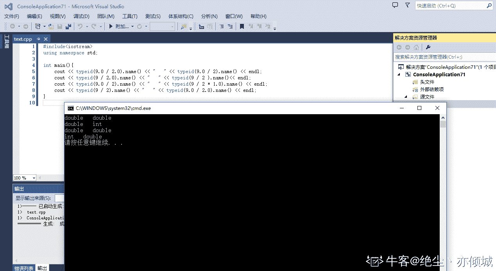
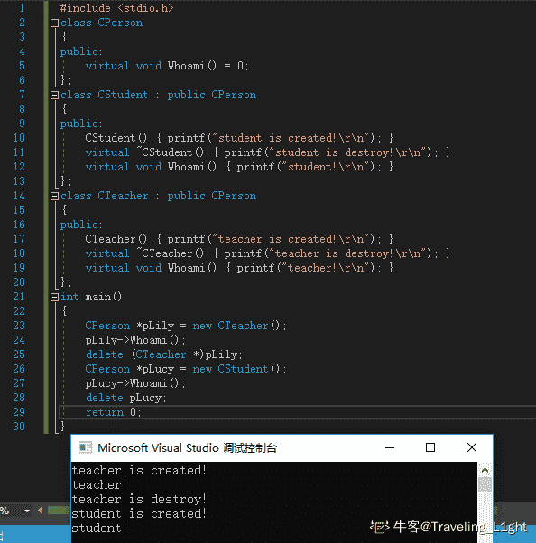
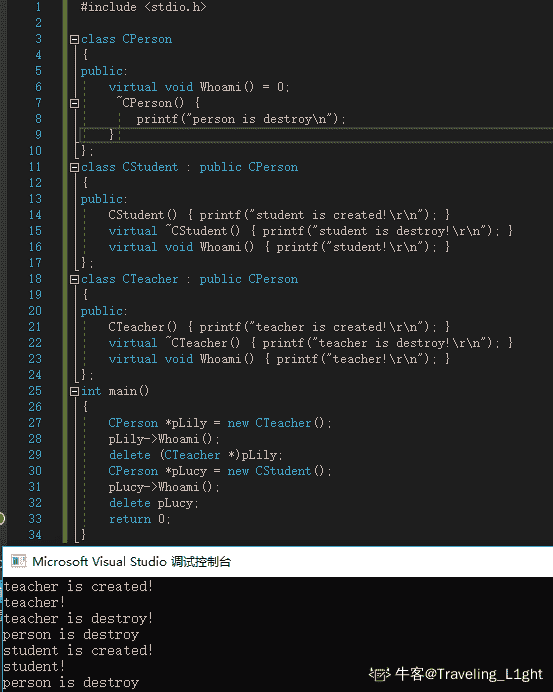
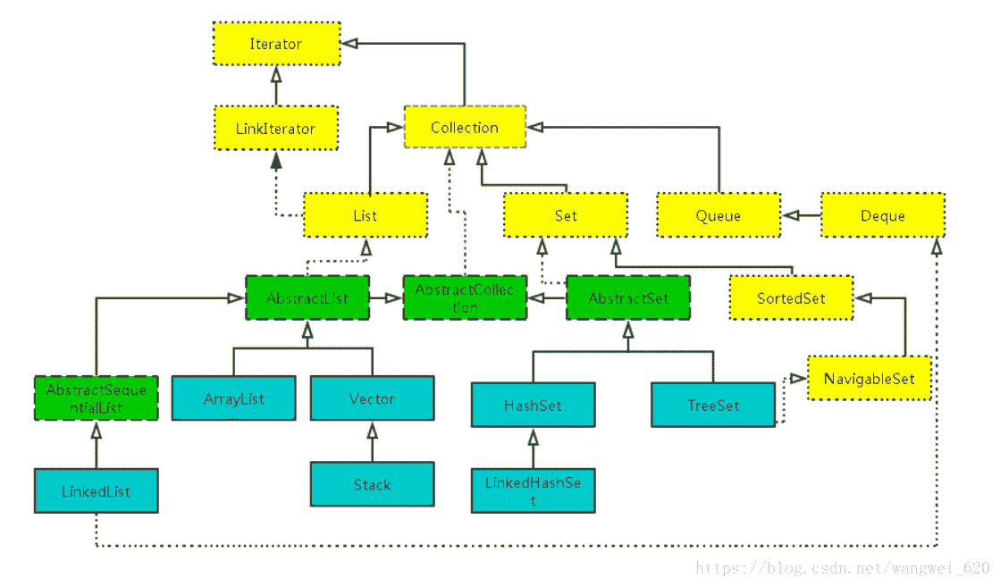
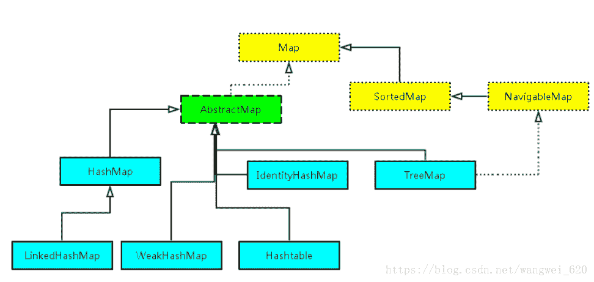
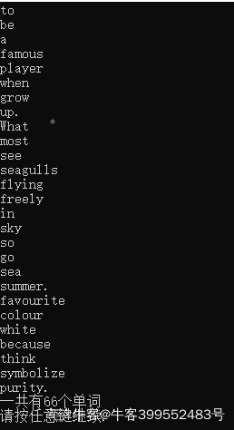

# 恒生公司 2015 秋招开发类笔试题（六）

## 1

下面选项中不属于面向对象程序设计特征的是（         ）

正确答案: C   你的答案: 空 (错误)

```cpp
继承性
```

```cpp
多态性
```

```cpp
类比性
```

```cpp
封装性
```

本题知识点

Java 工程师 C++工程师 iOS 工程师 安卓工程师 运维工程师 前端工程师 c#工程师 golang 工程师 恒生公司 2015

讨论

[李知恩](https://www.nowcoder.com/profile/7014087)

面向对象三大特征难道不是封装继承和多态？？？

发表于 2019-09-17 17:43:09

* * *

## 2

linux 操作系统中，修改用户密码的命令是(         )

正确答案: D   你的答案: 空 (错误)

```cpp
password
```

```cpp
changepwd
```

```cpp
pwd
```

```cpp
passwd
```

本题知识点

Java 工程师 C++工程师 iOS 工程师 安卓工程师 运维工程师 前端工程师 c#工程师 golang 工程师 恒生公司 2015

讨论

[bukun](https://www.nowcoder.com/profile/514169517)

passwd

发表于 2020-10-04 10:22:35

* * *

## 3

linux 操作系统中，文件 myfile 的文件权限为 rw-rw-rw-，修改文件 myfile 的权限为本用户和相同组的用户有读写权限，而其他用户只有读的权限的命令是（          ）

正确答案: C   你的答案: 空 (错误)

```cpp
chmod  -x myfile
```

```cpp
chmod 662 myfile
```

```cpp
chmod 664 myfile
```

```cpp
chmod  o-w myfile
```

本题知识点

Java 工程师 C++工程师 iOS 工程师 安卓工程师 运维工程师 前端工程师 c#工程师 golang 工程师 恒生公司 2015

讨论

[编程小海浪](https://www.nowcoder.com/profile/797024057)

chmod 是一条在[Unix 系统](https://link.jianshu.com/?t=http://zh.wikipedia.org/wiki/Unix)中用于控制用户对文件的权限的命令（changemode 单词前缀的组合）和函数。只有文件所有者和超级用户可以修改文件或目录的权限。可以使用绝对模式，符号模式指定文件的权限。chmod 命令可以使用八进制数来指定权限。文件或目录的权限位是由 9 个权限位来控制，每三位为一组，它们分别是文件所有者(user)的读、写、执行，用户组(group)的读、写、执行以及(other)其它用户的读、写、执行。历史上，文件权限被放在一个比特掩码中，掩码中指定的比特位设为 1，用来说明一个类具有相应的优先级 chmod 的八进制语法的数字说明；

r 4

w 2

x 1

- 0

所有者的权限用数字表达：属主的那三个权限位的数字加起来的总和。如 rwx ，也就是 4+2+1 ，应该是 7。

用户组的权限用数字表达：属组的那个权限位数字的相加的总和。如 rw- ，也就是 4+2+0 ，应该是 6。

其它用户的权限数字表达：其它用户权限位的数字相加的总和。如 r-x ，也就是 4+0+1 ，应该是 5。

本题中，修改文件 myfile 的权限为本***用户和相同组的用户***有读写权限，而其他用户只有读的权限的命令是（4+2,4+2,4  ）[664] 

发表于 2019-09-19 15:21:58

* * *

[低调的我](https://www.nowcoder.com/profile/4546028)

本地用户 用户组 其他用户

r 读权限 read  4

w 写权限 write 2

x 操作权限 execute  1

发表于 2019-08-24 14:08:41

* * *

[牛客 50214709 号](https://www.nowcoder.com/profile/50214709)

D 为什么不对啊，

发表于 2020-09-17 17:53:14

* * *

## 4

在关系数据库系统中，为了简化用户的查询操作，而又不增加数据的存储空间，常用的方法是创建（       ）

正确答案: C   你的答案: 空 (错误)

```cpp
表(table)
```

```cpp
游标(cursor)
```

```cpp
视图(view)
```

```cpp
索引(index)
```

本题知识点

Java 工程师 C++工程师 iOS 工程师 安卓工程师 运维工程师 前端工程师 c#工程师 golang 工程师 恒生公司 2015

讨论

[男孩呀](https://www.nowcoder.com/profile/363137307)

数据库试图具有以下几个作用：简化用户操作；使用户能以多种角度看待同一数据；支持重构数据库的逻辑独立性；视图能够提

供安全保护同时不增加数据的储存空间

发表于 2019-09-17 09:16:59

* * *

[改过行善](https://www.nowcoder.com/profile/4691042)

简化用户查询操作 而不是提高查询速度

发表于 2019-10-09 17:30:07

* * *

## 5

以下关于数据库主键的说法，正确的有（        ）

正确答案: A B D   你的答案: 空 (错误)

```cpp
主键字段的值不为空；
```

```cpp
主键字段的值没有重复；
```

```cpp
作为主键字段的值不能修改
```

```cpp
提高按主键字段进行查询的速度
```

本题知识点

Java 工程师 C++工程师 iOS 工程师 安卓工程师 运维工程师 前端工程师 c#工程师 golang 工程师 恒生公司 2015

讨论

[男孩呀](https://www.nowcoder.com/profile/363137307)

主键是数据库中具有唯一型的字段，也就是说数据表中的任意两条记录都不可能拥有相同的主键字段。主键值不允许为空，不允许重复。在设计数据库时可以靠设置主键来提高数据查询性能。

发表于 2019-09-17 09:17:42

* * *

## 6

运算结果类型相同的（     ）

正确答案: A C   你的答案: 空 (错误)

```cpp
9.0/2.0  9.0/2
```

```cpp
9/2.0  9/2
```

```cpp
9.0/2  9/2*1.0
```

```cpp
9/2  9.0/2.0
```

本题知识点

Java 工程师 C++工程师 iOS 工程师 安卓工程师 运维工程师 前端工程师 c#工程师 golang 工程师 恒生公司 2015 C++

讨论

[情过缘烬](https://www.nowcoder.com/profile/817331981)

A.double/double=double     double/int=doubleB.int/double=double            int/int=intC.double/int=double            int/int*double=doubleD.int/int=int                         double/double=double

发表于 2020-08-01 09:59:17

* * *

[绝尘丶亦倾城](https://www.nowcoder.com/profile/676005571)

毫无疑问这道题有点坑，注意看清题目啊，运算结果 **类 型 **相同😥😥 

发表于 2019-09-08 15:08:19

* * *

[小天 code](https://www.nowcoder.com/profile/403760568)

```cpp
    public static void main(String[] args) {
        System.out.println(getType(9.0/2.0));//Double
        System.out.println(getType(9.0/2));//Double
        System.out.println(getType(9/2.0));//Double
        System.out.println(getType(9/2));//Integer
        System.out.println(getType(9/2*1.0));//Double
    }
    public static String getType(Object o){
        return o.getClass().toString();
    }
```

发表于 2019-09-11 10:38:42

* * *

## 7

在下列说法中，(    )是错误的。

正确答案: A   你的答案: 空 (错误)

```cpp
若进程 A 和进程 B 在临界段上互斥，那么当进程 A 处于该临界段时，它不能被进程 B 中断
```

```cpp
虚拟存储管理中采用对换(swapping)策略后，用户进程可使用的存储空间似乎增加了
```

```cpp
虚拟存储管理中的抖动(thrashing)现象是指页面置换(page replacement)时用于换页的时间远多于执行程序的时间
```

```cpp
进程可以由程序、数据和进程控制块(PCB)描述
```

本题知识点

Java 工程师 C++工程师 iOS 工程师 安卓工程师 运维工程师 前端工程师 c#工程师 golang 工程师 恒生公司 2015

讨论

[男孩呀](https://www.nowcoder.com/profile/363137307)

进程 B 可能打断进程 A 的运行，但是不能进入临界区，因为互斥使用临界区使得进程 A 在不使用完之前不会释放的，从而 B 无法进入临界区。

抖动是页面置换算法的不合理导致了页面频繁地被置换，造成系统大量的时间都花费在了页面置换上

发表于 2019-09-17 17:30:34

* * *

[小天 code](https://www.nowcoder.com/profile/403760568)

可以被打断，但是不能进入临界区

发表于 2019-08-29 16:50:16

* * *

## 8

以下关于子查询和 Group By 的描述正确的有(       )

正确答案: A B C D   你的答案: 空 (错误)

```cpp
没有出现在 Group By 子句后面的列名不能出现在 Select 字句非合计函数表达式中
```

```cpp
在 Select 子句的后面，只能有两种类型的表达式，一种是合计函数，一种是出现在 Group By 子句后面的列名
```

```cpp
不能在子查询中包含 Order By 子句
```

```cpp
如果子查询的结果为空，那么外查询条件始终不会成立
```

本题知识点

Java 工程师 C++工程师 iOS 工程师 安卓工程师 运维工程师 前端工程师 c#工程师 golang 工程师 恒生公司 2015

讨论

[牛逼且带闪电的俊哥](https://www.nowcoder.com/profile/303857769)

group by：在 select 子句中只能有两种类型表达式，一种是合计函数，一种是出现在 group by 子句后面的列名，没有出现在 group by 子句后面   的列名不可以出现在 select 子句的非合计函数表达式中。如果在 select 语句中没有出现 group by 子句，则不能在 select 子句中同时出现单个    列名和合计函数的混合现象。如果要限制分组中的数据，则可以使用 having 子句而不能使用 where 子句

发表于 2020-03-20 16:50:37

* * *

[面临孤独](https://www.nowcoder.com/profile/317499190)

SQL 语法的规定，用了 group by，则 select 之后的字段除了聚集函数外都必须出现在 group by 中，你可以少于 group by 中的字段，但不能包含 group by 中没有的字段（也就是说 select 后面的字段除了函数外都要在 group by 后面）

在默认情况下，系统按照 group by 子句中指定的列升序排列，但是可以使用 order by 子句指定新的排列顺序。答案应该是 ABD

编辑于 2020-09-17 20:16:29

* * *

[徐风](https://www.nowcoder.com/profile/503005674)

子查询：where 子句中的查询，一般结合一些比较符（如 < = > in    not  in  exists 等）一起使用，            如 select xxx from tab where xxx in （select ......）；然后实测 里面的子查询确实不能加 order by ，Oracle 11g 反正时不行 不知道其他的怎么样。然后 D 就不用说了吧，子查询本身就是 where 判断的一部分。

发表于 2022-02-22 12:38:54

* * *

## 9

进程和程序的区别是(   )：

正确答案: A C D   你的答案: 空 (错误)

```cpp
程序是一组有序的静态指令，进程是一次程序的执行过程
```

```cpp
程序只能在前台运行，而进程可以在前台或后台运行
```

```cpp
程序可以长期保存，进程是暂时的
```

```cpp
程序没有状态，而进程是有状态的
```

本题知识点

Java 工程师 C++工程师 iOS 工程师 安卓工程师 运维工程师 前端工程师 c#工程师 golang 工程师 恒生公司 2015

讨论

[liuyong1995](https://www.nowcoder.com/profile/848814784)

这题 D 选项，程序是静态的，进程是动态的，这是进程与程序的本质区别，这里说没有状态是否有点不妥。进程的补充：一、进程的定义：“进程”是操作系统的最基本、最重要的概念之一。但迄今为止对这一概念还没有一个确切的统一的描述。下面给出几种对进程的定义描述。进程是程序的一次执行。进程是可以并行执行的计算。进程是一个程序与其使用的数据在处理机上顺序执行时发生的活动。进程是程序在一个数据集合上的运行过程。它是系统进行资源分配和调度的一个独立单位。二、进程的特征：（1）并发性：可以与其它进程一道在宏观上同时向前推进。
（2）动态性：进程是执行中的程序。此外进程的动态性还体现在如下两个方面：首先，进程是动态产生、动态消亡的；其次，在进程的生存期内，其状态处于经常性的动态变化之中。
（3）独立性：进程是调度的基本单位，它可以获得处理机并参与并发执行。
（4）交往性：进程在运行过程中可能会与其它进程发生直接或间接的相互作用。
（5）异步性：每个进程都以其相对独立、不可预知的速度向前推进。
（6）结构性：每个进程有一个控制块 PCB。 

三、进程与程序的主要区别：

（1）程序是永存的；进程是暂时的，是程序在数据集上的一次执行，有创建有撤销，存在是暂时

（2）程序是静态的观念，进程是动态的观念

（3）进程具有并发性，而程序没有

（4）进程是竞争计算机资源的基本单位，程序不是

（5）进程和程序不是一一对应的： 一个程序可对应多个进程即多个进程可执行同一程序； 一个进程可以执行一个或几个程序

四、进程与程序的相同点：程序是构成进程的组成部分之一，一个进程存在的目的就是执行其所对应的程序，如果没有程序，进程就失去了其存在的意义。

编辑于 2019-09-09 21:02:33

* * *

[hjf49](https://www.nowcoder.com/profile/4426747)

程序是构成进程的组成部分之一，进程是分前台后台的，所以程序是可以在前后台执行的。

发表于 2019-10-03 19:28:18

* * *

## 10

一个栈的入栈顺序是 A,B,C,D,E,则栈不可能的输出顺序是（   ）

正确答案: A D   你的答案: 空 (错误)

```cpp
DCEAB
```

```cpp
ABCDE
```

```cpp
ABEDC
```

```cpp
CDEAB
```

本题知识点

Java 工程师 C++工程师 iOS 工程师 安卓工程师 运维工程师 前端工程师 c#工程师 golang 工程师 恒生公司 2015

讨论

[编程小海浪](https://www.nowcoder.com/profile/797024057)

堆栈讲究先进后出，后进先出。选项 AD 错。**选项 B**是 a 入栈，然后 a 出栈；b 再入栈，b 出栈……依此类推。 **选项 C**是 a 先入栈，然后 a 出栈，b 入栈然后 b 出栈，然后是 cde 入栈，再出栈变为 edc

发表于 2019-09-19 16:04:13

* * *

[wangxuehe](https://www.nowcoder.com/profile/3090798)

先进后出

发表于 2019-09-04 09:47:06

* * *

## 11

下面程序运行之后，x 的值是(   )

```cpp
void swap(int a, int b){
    int t = a;
    a = b;
    b = t;
}

…

int x = 2;

int y = 3;

swap(x, y);
```

正确答案: A   你的答案: 空 (错误)

```cpp
2
```

```cpp
3
```

```cpp
5
```

```cpp
6
```

本题知识点

C++工程师 2015 C++

讨论

[張 _](https://www.nowcoder.com/profile/115461793)

值参数传递不能实现交换两个整数，所以 X 最后还是 2

，想要实现两个值交换可以已数组的形式实现

发表于 2019-08-29 10:53:36

* * *

[进阶中的牛客人](https://www.nowcoder.com/profile/450066322)

将变量名作为实参，这时传给形参的是变量的值，传递是单向的，在执行函数期间形参值发生变化并不传回给实参，因为在调用函数时，形参和实参不是同一个存储单元。

发表于 2020-12-09 15:51:04

* * *

[帅得乱七八糟](https://www.nowcoder.com/profile/148139773)

这里的传参是按值传递，传递的是主函数 x,y 的副本，所以 swap 函数内形参 x，y 除了最初的值和实参 x,y 相同，就没有其他关系了

发表于 2020-08-30 19:44:59

* * *

## 12

下面程序运行输出的结果是（    ），不用考虑 new 失败的情况。

```cpp
#include <stdio.h>
class CPerson{
public:
    virtual void Whoami() = 0;
};
class CStudent : public CPerson{
public:
    CStudent(){printf("student is created!\r\n");}
    virtual ~CStudent(){printf("student is destroy!\r\n");}
    virtual void Whoami(){printf("student!\r\n");}
};
class CTeacher : public CPerson{
public:
    CTeacher(){printf("teacher is created!\r\n");}
    virtual ~CTeacher(){printf("teacher is destroy!\r\n");}
    virtual void Whoami(){printf("teacher!\r\n");}
};
int main(){
    CPerson *pLily = new CTeacher();
    pLily->Whoami();
    delete (CTeacher *)pLily;
    CPerson *pLucy = new CStudent();
    pLucy->Whoami();
    delete pLucy;
return 0;
}
```

正确答案: A   你的答案: 空 (错误)

```cpp
teacher is created!<div>teacher!</div><div>teacher is destroy!</div><div>student is created!</div><div>student!</div>
```

```cpp
teacher is created!<div>teacher!</div><div>teacher is destroy!</div><div>student is created!</div><div>student!</div><div>student is destroy!</div>
```

```cpp
teacher is created!<div>teacher!</div><div>student is created!</div><div>student!</div>
```

```cpp
teacher!<div>student!</div>
```

本题知识点

C++工程师 2015 C++

讨论

[Traveling_L1ght](https://www.nowcoder.com/profile/31501865)

int main(){CPerson *pLily = new CTeacher();//基类指针指向派生类  new 调用 CTeacher 类构造函数 打印 teacher is created!pLily->Whoami();                           //调用 CTeacher 类的 whoami 成员函数 打印 teacher!delete (CTeacher *)pLily;               //强制类型转换为 Cteacher 类指针 调用 Cteacher 类析构函数和抽象基类默认析构函数 打印                                                                                  //teacher is destroy!CPerson *pLucy = new CStudent();pLucy->Whoami();delete pLucy;                                //调用抽象基类默认析构函数，无打印内容 return 0;}基类自定义析构函数结果如下：

编辑于 2019-08-28 18:28:15

* * *

[啦啦啦 jk](https://www.nowcoder.com/profile/576602594)

基类的没有定义析构函数，所以是默认的析构函数（不是虚函数），所以 delete pLucy 调用的是基类默认的析构函数，没有输出：

```cpp
student is destroy!

```

发表于 2020-08-10 15:27:17

* * *

[kumi123](https://www.nowcoder.com/profile/438801212)

[`blog.csdn.net/weicao1990/article/details/81911341`](https://blog.csdn.net/weicao1990/article/details/81911341)

发表于 2020-10-17 15:16:01

* * *

## 13

对于纯虚函数描述正确的是(     )

正确答案: A B   你的答案: 空 (错误)

```cpp
含有纯虚函数的类不能被声明对像，这些类被称为抽象类
```

```cpp
继承抽象类的派生类可以被声明对像，但要在派生类中完全实现基类中所有的纯虚函数
```

```cpp
继承抽象类的派生类可以被声明对像，不需要实现基类中全部纯虚函数，只需要实现在派生类中用到的纯虚函数
```

```cpp
虚函数和纯虚函数是一样的，没什么区别
```

本题知识点

Java 工程师 C++工程师 iOS 工程师 安卓工程师 运维工程师 前端工程师 c#工程师 golang 工程师 恒生公司 2015 C++

讨论

[牛客 112689239 号](https://www.nowcoder.com/profile/112689239)

这题最大的难点是 派生类要全部实现抽象类的纯虚函数

发表于 2021-03-04 19:00:44

* * *

[WS 一直在前进](https://www.nowcoder.com/profile/182303797)

纯虚函数不能有函数实现，虚函数可以

发表于 2020-06-20 11:08:02

* * *

[晓之铭](https://www.nowcoder.com/profile/537625741)

派生类要实现抽象类的所有纯虚函数

发表于 2021-03-23 08:43:08

* * *

## 14

对于指针的描述正确的是（）

正确答案:   你的答案: 空 (错误)

```cpp
指针是存放地址的变量。
```

```cpp
指针不能被加减操作。
```

```cpp
在 32 位操作系统下，指向 char 类型变量的指针所占内存大小是 1 个字节。
```

```cpp
在 32 位操作系统下，指向 int 类型变量的指针所占内存大小是 4 个字节。
```

本题知识点

C++工程师 恒生公司 2015 C++ C 语言

讨论

[牛客职导官方账号](https://www.nowcoder.com/profile/897353)

【正确答案】A D 【解析】A  查看全部)

编辑于 2021-11-18 08:49:26

* * *

[xxf666](https://www.nowcoder.com/profile/97331668)

在 32 位操作系统中，无论指向任何变量的指针占用的字节数都是 4

发表于 2019-09-06 14:48:43

* * *

[古罗马哥哥古巴比伦](https://www.nowcoder.com/profile/705339783)

有问题，指针就是地址，指针变量才是存放地址的

发表于 2020-03-20 17:02:13

* * *

## 15

short a[100]， sizeof(a)的值是（   ）

正确答案: C   你的答案: 空 (错误)

```cpp
2
```

```cpp
100
```

```cpp
200
```

```cpp
400
```

本题知识点

Java 工程师 C++工程师 iOS 工程师 安卓工程师 运维工程师 前端工程师 c#工程师 golang 工程师 恒生公司 2015

讨论

[xxf666](https://www.nowcoder.com/profile/97331668)

一个 short 变量占用 2 字节

发表于 2019-09-06 14:51:01

* * *

[混迹人神魔三界](https://www.nowcoder.com/profile/757036547)

sizeof（）的作用是返回一个对象或者类型所占字节数

发表于 2019-09-03 16:42:19

* * *

## 16

下面程序运行之后，变量 x 的值是（     ）。......//swap 方法的声明 public static void swap(int a,int b){int t=a;a=b;b=t;}//main 方法 public static void main(String args[]){int x=2;int y=3;swap(x,y);}

正确答案: A   你的答案: 空 (错误)

```cpp
2
```

```cpp
3
```

```cpp
4
```

```cpp
6
```

本题知识点

Java 工程师 C++工程师 iOS 工程师 安卓工程师 运维工程师 前端工程师 c#工程师 golang 工程师 恒生公司 2015

讨论

[hnit2020](https://www.nowcoder.com/profile/714047312)

巨坑~

*   main 方法的 x,y 和 swap 方法的 a,b 是不同的变量,它们有自己的内存空间,方法调用,只是把 x,y 的内存的值复制给 swap 方法的 a,b,所以改变 swap 方法的 a,b 只是改变 swap 方法的 a,b 的内存的信息,并不影响 x,y 的内存；
*   如果运用引用传递 swap(&x,&y);,传递的是 x 的地址的话，那就可以进行两数的交换了！！！

发表于 2020-03-17 01:11:39

* * *

[onlycodenoplay](https://www.nowcoder.com/profile/61246992)

因为 java 采取的是值传递的传值方式，对于基本数据类型来说传递的是该变量的一个复制，对于引用类型来说传递的是该值的一个引用，如果实在数组中交换两个位置的值得话，那么就会改变该数组。

发表于 2020-10-05 20:56:58

* * *

[Arthas201908282205855](https://www.nowcoder.com/profile/945704408)

加&

发表于 2019-09-10 15:08:39

* * *

## 17

关于垃圾收集的哪些叙述是正确的(     )。

正确答案: C   你的答案: 空 (错误)

```cpp
程序开发者必须自己创建一个线程进行内存释放的工作
```

```cpp
垃圾收集允许程序开发者明确指定并立即释放该内存
```

```cpp
垃圾收集将检查并释放不再使用的内存
```

```cpp
垃圾收集能够在期望的时间释放被 java 对象使用的内存
```

本题知识点

Java 工程师 C++工程师 iOS 工程师 安卓工程师 运维工程师 前端工程师 c#工程师 golang 工程师 恒生公司 2015

讨论

[xxf666](https://www.nowcoder.com/profile/97331668)

垃圾收集的工作流程： 检验不再被引用的垃圾收集器，释放其所占用的堆空间，运行 finalizer 方法，如果 finalizer 中对象不再被引用，则释放内存 垃圾收集的作用： 1.处理堆碎块，避免不必要的内存浪费，产生内存不足的问题 2.自动释放内存，提高编程效率，避免虚拟机崩溃 垃圾收集算法原理： 1.检测垃圾对象 2.回收垃圾对象所占用的堆空间

发表于 2019-09-06 14:55:24

* * *

## 18

Class X{

    Y b =new Y();

    X(){

        System.out.println(“X”);

    }

}

Class Y{

    Y(){

        System.out.println(“Y”);

    }

}

public class Z extends X{

    Y y= new Y();

    Z(){

        System.out.println(“Z”);

}

public static void main(String[] args){

    new Z();

}

}

正确答案: D   你的答案: 空 (错误)

```cpp
Z
```

```cpp
YZ
```

```cpp
XYZ
```

```cpp
YXYZ
```

本题知识点

Java 工程师 C++工程师 iOS 工程师 安卓工程师 运维工程师 前端工程师 c#工程师 golang 工程师 恒生公司 2015

讨论

[Mr.Ma~](https://www.nowcoder.com/profile/675699712)

new 子类会先调用父类无参构造

发表于 2019-09-05 10:30:19

* * *

[超级无敌星墨瞳](https://www.nowcoder.com/profile/607311407)

先执行父类构造代码块、再执行父类构造函数、接着执行子类构造代码块、然后执行子类构造函数是这样的嘛

发表于 2022-02-20 17:51:30

* * *

[skr201901191251267](https://www.nowcoder.com/profile/738368890)

我觉得这个题的答案有问题 new z（）的时候是会先加载父类 X，而父类中会先执行 static 代码块，之后才会执行成员变量

发表于 2019-10-02 14:24:54

* * *

## 19

需要创建一个应用，其中出现在同一 web 上下文的 servlets 需要访问存储用户注册名的变量。此可如何实现？（      ）

正确答案: A   你的答案: 空 (错误)

```cpp
使用 setAtrribute()函数
```

```cpp
在第一个 servlet 中创建一个静态变量
```

```cpp
实例化第一个 servlet,得到此静态变量的值
```

```cpp
创建一个全局变量
```

本题知识点

Java 工程师 C++工程师 iOS 工程师 安卓工程师 运维工程师 前端工程师 c#工程师 golang 工程师 恒生公司 2015

讨论

[niushuai233](https://www.nowcoder.com/profile/5844599)

此题不知道是不是可以这样理解，
**出现在同一 web 上下文的 servlets 需要访问存储用户注册名的变量**
我不明确是已经存储过用户注册名或者是尚未存储，并且需要对该用户注册名进行存储，如果是需要存储的话，那么使用**访问存储用户注册名的变量**是否不恰当

我个人认为该题存在歧义性，若理解为如何实现让后续出现的 servlet 能够获取用户名，那么该题选择 A
如果理解为后续出现的 servlet 如何获取之前存储的用户名，选择 A 则不可，个人拙见，望各路大神不吝赐教

发表于 2019-09-02 11:49:43

* * *

## 20

下列关于 java 集合类的相关叙述正确的是（   ）

正确答案: C D   你的答案: 空 (错误)

```cpp
Collection 是最基本的集合接口，JDK 中提供的集合类如 List、Map 等都是继承自 Collection 的子接口
```

```cpp
ArrayList 和 LinkedList 都实现了 List 接口，且他们都是线程同步的
```

```cpp
Set 是一种不包含重复的元素的 Collection
```

```cpp
shMap 可以通过 hashcode 对其内容进行快速查找
```

本题知识点

Java 工程师 C++工程师 iOS 工程师 安卓工程师 运维工程师 前端工程师 c#工程师 golang 工程师 恒生公司 2015

讨论

[望明月](https://www.nowcoder.com/profile/354897454)

Collection 是最基本的集合接口，List，Set 是继承自 Collection 的子接口，Map 不是。一个 Collection 代表一组 Object，即 Collection 的元素。Java JDK 不能提供直接继承自 Collection 的类，Java JDK 提供的类都是继承自 Collection 的"子接口"。 

发表于 2020-03-20 14:24:30

* * *

[编程小海浪](https://www.nowcoder.com/profile/797024057)

HashMap 通过 hashcode 对其内容进行快速查找，而 TreeMap 中所有的元素都保持着某种固定的顺序，如果你需要得到一个有序的结果你就应该使用 TreeMap（HashMap 中元素的排列顺序是不固定的）Vector 线程同步，ArrayList、LinkedList 线程不同步。 

发表于 2019-09-19 16:37:33

* * *

[Herion_bo](https://www.nowcoder.com/profile/4433341)



发表于 2019-09-06 14:05:04

* * *

## 21

数据库
Small Bank corporation 有如下的员工数据库，为下面每个查询语句写出 SQL 表达式:

Employee 员工表

| 员工姓名 employee_name | 所住街道 street | 所在城市 city |

Company 公司信息表

| 公司名称 company_name | 所在城市 city |

Works 工作信息表

| 员工姓名 employee_name | 公司名称 company_name | 薪水 salary |

1)  找出所有为 Small Bank corporation 工作且薪金超过 10000 的员工的名字、居住的街道和城市

2)  查找数据库中所有居住城市和公司所在城市相同的员工

3)  找出数据库中所有工资高于 Small Bank corporation 的每一个员工工资的员工姓名

4)  假设一家公司可以在好几个城市有分部，找出所有这样的公司，其所在城市包含了 Small Bank corporation 所在的每一个城市

5)  找出平均工资高于 Small Bank corporation 平均工资的所有公司名字及平均工资

你的答案

本题知识点

Java 工程师 C++工程师 iOS 工程师 安卓工程师 运维工程师 前端工程师 c#工程师 golang 工程师 恒生公司 2015

讨论

[舟轻未惊。](https://www.nowcoder.com/profile/203719885)

这个题目表达不够清楚诶，Small Bank corporation 到底是一个公司的名字呢，还是整个数据库的名，有点争议。为了满足问题要求，我把它当作公司名字来写的。1) select stree,city,employee_name from Employee,Works Where Employee.employee_name=Works.employee_name and Works.company_name='Small Bank corporation' and salary>10000;2) select Employ_name from Employee,(select city,employee_name from Company,Works where Company.company_name= Works.company_name) A where Employ.employee_name = A.employee_name and Employee.city=A.city;3) select emloyee_name from Works where salary > all (select salary from Works where Company_name='Small Bank corporation');4) selec a.company_name from Company a where not exists((select b.city from Company b where b.company_name= 'Small Bank corporation') except (select c.city from Company c where a.company_name = c.company_name));-------参考楼上的 5）select a.company_name avg(salary) from Works a where group by a.company_name having  avg(a.salary) > (select avg(b.salary) from Works b where b.company_name =Small Bank corporation");不知道对了没，欢迎小伙伴们指出问题 

发表于 2020-03-18 15:29:50

* * *

[niushuai233](https://www.nowcoder.com/profile/5844599)

```cpp
SELECT
    a.company_name,
    avg( a.salary ) 
FROM
    works a 
WHERE
    a.company_name <> 'Small Bank corporation' 
HAVING
    avg( a.salary ) > ( SELECT avg( b.salary ) AS salary FROM works b WHERE b.company_name = 'Small Bank corporation' ) 
GROUP BY
    a.company_name
> 1064 - You have an error in your SQL syntax; check the manual that corresponds to your MySQL server version for the right syntax to use near 'GROUP BY
    a.company_name' at line 10
> 时间: 0s

```

我复制了答案输入到 mysql 中执行时 出现错误 错误信息如上在 mysql 中 group by 需要在 having 之前

编辑于 2019-09-02 11:59:44

* * *

[mumucgq](https://www.nowcoder.com/profile/8940520)

参考答案里第五个有点问题，group by 和 having 的顺序有问题，判断不是‘Small Bank corporation’ 也不需要 参考：

```cpp
select wo.company_name ,avg(wo.salary)
from Works wo 
group by wo.company_name 
having avg(wo.salary) > (
	select avg(a.salary) 
	from Works a
	where a.company_name = ‘Small Bank corporation’
);

```

发表于 2021-03-06 20:41:54

* * *

## 22

编程题请编写一个程序，从文件 src.txt 读入一篇英文短文，统计并输出该短文中不同单词出现的次数，然后输出统计结果。

你的答案

本题知识点

Java 工程师 C++工程师 iOS 工程师 安卓工程师 运维工程师 前端工程师 c#工程师 golang 工程师 恒生公司 2015

讨论

[pyCharmSS](https://www.nowcoder.com/profile/3948037)

step1：创建一个正则表达式，作用是用来替换掉文本中出现的逗号，冒号，句号，引号等等 step2：将 str 分割称字符串数组，并用 hashmap 统计每个单词出现的次数。注意数组里面是可能有空字符串的，因为用空格替换掉其它字符后，str 中会存在两个连续空格的请款 step3：遍历 map 并输出

```cpp
import java.io.BufferedReader;
import java.io.File;
import java.io.FileReader;
import java.io.IOException;
import java.util.HashMap;
import java.util.Map;
import java.util.Map.Entry;
import java.util.Set;
import java.util.regex.Pattern;

/**
 * 请编写一个程序，从文件 src.txt 读入一篇英文短文，统计并输出该短文中不同单词出现的次数，然后输出统计结果。
 * @author qiuqi
 *
 */
public class CountNumber {

	public static void main(String[] args) throws IOException {
		// TODO Auto-generated method stub
		File file=new File("sc.txt");
		BufferedReader br=new BufferedReader(new FileReader(file));
		//String testStr=" In the nineteenth century: there was? a huge increase in the spread of English because of the development of new technology and new methods of mass production, transportation and communication. This spread has accelerated into the tweniteth and twenty-first century. Steamships and railways were developed in the first half of the nineteenth century, which brought people into closer contact. Railways carried newspapers across countires and in the second half of the nineteenth century, the telephone and telegraph were invented, making it even easier for people to communicate quickly and across vast distances.";

		Map<String,Integer> map=new HashMap<String,Integer>();
		String regex="\t|\r|\n|\"|\\,|\\.|\\:|\\?";
		String result=null;

		while((result=br.readLine())!=null){
			String s=result.replaceAll(regex, " ");
			System.out.println(s);
			String[] arr=s.split(" ");
			for(int i=0;i<arr.length;i++) {
				if(arr[i].equals("")) continue;
				if(map.containsKey(arr[i])) {
					map.put(arr[i], map.get(arr[i])+1);
				}else {
					map.put(arr[i], 1);
				}
			}

		}

	 Set<Entry<String, Integer>> entrySet = map.entrySet();
	     for(Entry<String, Integer> entry : entrySet){
	     System.out.println(entry.getKey() +":" +entry.getValue());
	     }
	}

}
```

发表于 2019-09-24 18:46:41

* * *

[牛客 399552483 号](https://www.nowcoder.com/profile/399552483)

```cpp
#include<iostream>
#include<vector>
#include<fstream>
#include<string>
#include <sstream>
#include <algorithm>
using namespace std;

int main(){
	ifstream infile;
	infile.open("read.txt");
	string readline;
	vector<string> vec;
	vector<string> word;
	vector<string>word2;
	int num = 0;  //计数单词个数
	//循环读取一行
	while (getline(infile, readline))
	{
		vec.push_back(readline);//将每一行插入容器中
	}
	for (auto it = vec.begin(); it != vec.end(); it++)
	{
		istringstream is(*it);
		string s;
		while (is >> s)
		{
			word.push_back(s);
		}
	}
	//打印出所有单词
	for (auto it = word.begin(); it != word.end(); it++)
	{

		if (find(word2.begin(), word2.end(), *it) != word2.end())//找到相同的单词了
		{
			continue;
		}
		word2.push_back(*it);
		num++;
	}
	for (auto it = word2.begin(); it != word2.end(); it++)
	{
		cout << (*it) << endl;
	}
	cout << "一共有" << num << "个单词" << endl;
	return 0;
}

```



发表于 2021-09-06 11:38:01

* * *

[徐风](https://www.nowcoder.com/profile/503005674)

那我也贡献一下我写的把，处理缩写有问题，其他都 ok（短文就一个连续段的话）：

```cpp
package com.hh.testPrivateStatic;

import java.io.BufferedReader;
import java.io.FileInputStream;
import java.io.IOException;
import java.io.InputStreamReader;
import java.util.HashMap;
import java.util.Map;

// 2015 - 六  22 题
/*
编程题：请编写一个程序，从文件 src.txt 读入一篇英文短文，统计并输出该短文中不同单词出现的次数，然后输出统计结果。

算法思路大致如下：
    （英语短文，它应该是连续的，然后有除大小写英文字母外其他的特殊字符如逗号、句号、双引号等）
    把所有内容读取一个 string，都小写。 把遍历 string，把非字母字符都换成空格，这样可能会多出单个空格或者多个连续的空格。
    循环去多空格
    单空格 split， 这样可以获得单词数组，
    将数组元素放入 map，（如果 map 中已存在则对应 value++，不存在默认为 1）
    最后遍历输出结果。
 */
public class Six_2015_22th {
    public static void main(String[] args) throws IOException {
//        String s = "123 456   789 0";
//        for (String s1 : s.split(" ")) {
//            if (s1.equals("")){ // 空字符串
//                System.out.println(s1 + "length:" + s1.length());
//            }
//        }
        FileInputStream input = new FileInputStream("E:\\IdeaProjects\\try-algorithm\\src\\main\\java\\com\\hh\\article");
        InputStreamReader inputStreamReader = new InputStreamReader(input);
        BufferedReader reader = new BufferedReader(inputStreamReader);
        String[] letters; // 所有字母（包括重复）
        Map<String, Integer> map; // 计算 单词出现次数 map

        String s = reader.readLine();
        if (s != null){
            s = s.toLowerCase();
            StringBuilder builder = new StringBuilder(s);

            // 非字母替换成空格
            for (int i = 0; i < s.length(); i++){
                if (!isLetter(s.charAt(i))){ // 如果不是 字母 则替换成空格
                    builder.setCharAt(i, ' ');
                }
            }

            //多空格化成单空格 去首尾空格 并提取单词
            s = builder.toString();
            s = s.trim();
            while (s.contains("  "))
                s = s.replace("  ", " ");
            letters = s.split(" ");

            //计算单词出现次数
            map = new HashMap<>();
            for (String letter : letters) {
                if (map.containsKey(letter))
                    map.put(letter, map.get(letter)+1);
                else
                    map.put(letter, 1);
            }

            // 循环遍历 map  输出计算结果
            for (Map.Entry<String, Integer> entry : map.entrySet()){
                System.out.println(entry.getKey() + " :" + entry.getValue());
            }

        }

//        String s = "1 2    3  4        5";
////        s = s.replace("  ", " "); //1 2  3 4 5
//        while (s.contains("  ")){
//            s = s.replace("  ", " ");
//        }
//        System.out.println(s);

    }

    public static boolean isLetter(char ch){
        return (ch >= 'a' && ch <= 'z') || (ch >= 'A' && ch <= 'Z');
    }
}

```

发表于 2022-02-24 23:40:51

* * *

## 23

算法题请提供一个函数实现二叉排序树的查找功能。

二叉排序树的定义：

二叉排序树又称二叉查找树，它或者是一棵空树，或者是具有如下性质的二叉树：

1、 若它的左子树非空，则左子树上所有结点的值均小于根结点的值；

2、 若它的右子树非空，则右子树上所有结点的值均大于或等于根结点的值；

3、 左右子树本身就是两棵二叉排序树。

节点的结构定义如下：

typedef struct tagNode

{

    int iKey;   ///结点的键值

    struct tagNode *pLChild;    ///左子树的指针

    struct tagNode *pRChild;    ///右子树的指针

}NODE, *PNODE;

函数定义如下：

PNODE SearchTree(PNODE pRoot, int iKey, PNODE &pFather);

你的答案

本题知识点

Java 工程师 C++工程师 iOS 工程师 安卓工程师 运维工程师 前端工程师 c#工程师 golang 工程师 恒生公司 2015

讨论

[编程小海浪](https://www.nowcoder.com/profile/797024057)

public static boolean sort(BinaryTree root, int key, BinaryTree p){
        if(root == null){
            f = p;
            System.out.println("查找失败！");
            return false;
        }
        else if(root.val == key){
            f = root;
            System.out.println("查找成功！");
            return true;
        }
        else if(root.val >= key)
            return sort(root.left, key, root);
        else 
            return sort(root.right, key, root);
    }

发表于 2019-09-19 17:07:35

* * *

[瀟嚴](https://www.nowcoder.com/profile/659298816)

```cpp
/*在根指针 bst 所指二叉排序树中，递归查找某关键字等于 key 的元素，若查找成功，返回指向该元素结点指针，否则返回空指*/
BSTree  SearchBST(BSTree bst, KeyType key) {
    if (!bst) 
        return NULL;
    else 
        if (bst->key== key)
            return bst;/*查找成功*/

        else {
            if (bst->key> key)
                return SearchBST(bst->lchild, key);/*在左子树继续查找*/
            else 
                return SearchBST(bst->rchild, key);/*在右子树继续查找*/
    }
```

编辑于 2019-09-10 15:28:32

* * *