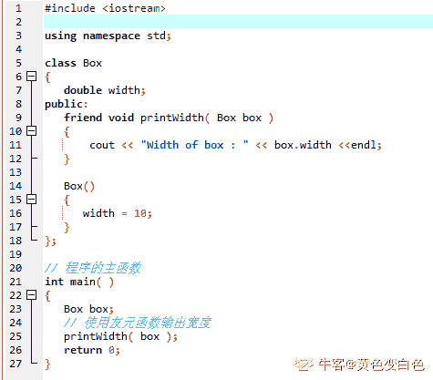

# 恒生公司 2015 秋招开发类笔试题（七）

## 1

对于 int *pa[5] ;的描述，正确的是（）

正确答案: D   你的答案: 空 (错误)

```cpp
pa 是一个指向数组的指针，所指向的数组是 5 个 int 型元素
```

```cpp
pa 是一个指向某个数组第 5 个元素的指针，该元素是 int 型变量
```

```cpp
pa[5]表示某个数组第 5 个元素的值
```

```cpp
pa 是一个具有 5 个元素的指针数组，每个元素是一个 int 型指针
```

本题知识点

C++工程师 恒生公司 2015 C++ C 语言

讨论

[lmxy](https://www.nowcoder.com/profile/2164845)

写个不定项选择很过分啊

发表于 2019-09-01 18:07:12

* * *

[Dts201907261322590](https://www.nowcoder.com/profile/730057260)

*   int * pa[5] 默认[]要先结合，所以先可以得到 pa[5],即 pa 是一个大小为 5 的数组

然后表达式剩下 int * , 即表示数组中存储的是 int 型的指针。

综合就是 pa 是个指针数组，数组大小为 5

*   而对于 int (*pa)[5]，括号优先级别最高 得到（*pa)  ，表示 pa 是一个指针

然后是外部的数组符号，表示 pa 指向的是一个数组，数组的大小是 5

最后是那个 int ,表示数组中存储的是 int 型的数据。

综合就是 pa 是个[数组指针](https://www.baidu.com/s?wd=%E6%95%B0%E7%BB%84%E6%8C%87%E9%92%88&tn=SE_PcZhidaonwhc_ngpagmjz&rsv_dl=gh_pc_zhidao)，指向的数组为 5 个 int 型的元素，这个才会选 A 选项的那个答案。

发表于 2019-09-09 09:02:03

* * *

[爱豆比我瘦](https://www.nowcoder.com/profile/923922192)

int *pa[5]=(int *)(pa[5]) 是一个有 5 个元素的数组指针，每个数组元素的类型为 int *。例如：int *pa[5]={&a,&b,&c,&d,&e}。 int (*pa)[5]是一个指针数组，每个元素的类型为 int，相当于二维数组 int pa[][5]。

发表于 2019-09-08 11:33:16

* * *

## 2

IPV4 中，数据包传播方式包括以下的(    )

正确答案: A B D   你的答案: 空 (错误)

```cpp
广播
```

```cpp
单播
```

```cpp
任播
```

```cpp
组播
```

本题知识点

Java 工程师 C++工程师 iOS 工程师 安卓工程师 运维工程师 前端工程师 c#工程师 golang 工程师 恒生公司 2015

讨论

[墨竹 201809292135523](https://www.nowcoder.com/profile/498772652)

ABD,任播是 IPV6 加入的新技术。

发表于 2019-09-14 12:35:46

* * *

[～哎呦喂～](https://www.nowcoder.com/profile/374100306)

任播是 IPV6 加入的新技术。

发表于 2019-09-11 19:28:51

* * *

## 3

下面有关友元函数的描述中，正确的说法是（    ）

正确答案: A   你的答案: 空 (错误)

```cpp
友元函数是独立于当前类的外部函数
```

```cpp
一个友元函数不可以同时定义为两个类的友元函数
```

```cpp
友元函数必须在类的外部进行定义
```

```cpp
在类的外部定义友元函数时必须加上 friend 关键字
```

本题知识点

Java 工程师 C++工程师 iOS 工程师 安卓工程师 运维工程师 前端工程师 c#工程师 golang 工程师 恒生公司 2015 C++

讨论

[HouJian](https://www.nowcoder.com/profile/5255423)

友元一般定义在类的外部，但需要在类体内进行声明，为了与该类的成员函数加以区分，在说明时前面加以关键字 friend。友元函数不是成员函数，但它可以访问类的私有成员。友元的作用在于提高程序的运行效率，但它破坏了类的封装性和隐藏性，使得非成员函数可以访问类的私有成员。[`blog.csdn.net/weixin_40087851/article/details/82345094`](https://blog.csdn.net/weixin_40087851/article/details/82345094) 

发表于 2020-09-05 10:38:09

* * *

[ZERO201806260018799](https://www.nowcoder.com/profile/718168755)

在 C++中友元函数是独立于当前类的外部函数，一个友元函数可以同时定义为两个类的友元函数，友元函数即可以在类的内部，也可以在类的外部定义；在类的外面定义友元函数时不必加关键字 friend。

发表于 2021-03-22 17:05:27

* * *

[黄色变白色](https://www.nowcoder.com/profile/8547911)



发表于 2019-09-24 07:51:12

* * *

## 4

以下关于数据库中索引的描述正确的是(    )

正确答案: C D   你的答案: 空 (错误)

```cpp
只要允许，任何时候都应该添加索引以加快查询速度
```

```cpp
无论记录多少，使用索引都能给查询带来性能提升
```

```cpp
每次 update/insert/delete 操作都会导致索引被重新更新
```

```cpp
索引可以避免全表扫描
```

本题知识点

Java 工程师 C++工程师 iOS 工程师 安卓工程师 运维工程师 前端工程师 c#工程师 golang 工程师 恒生公司 2015

讨论

[黑暗弥漫](https://www.nowcoder.com/profile/173789474)

这个题我之前练习的时候遇到过是 CD 来着，在这儿咋就成了 D 了啊

发表于 2019-08-29 16:13:26

* * *

[小奶精](https://www.nowcoder.com/profile/930524666)

a 错误。对于表数据量少，插入，更新操作多的表，添加索引可能会使查询速度变慢。 同理 b 也错误。 c 索引并适合表频繁的 update，insert，delete 操作，这样会频繁的修改索引，造成性能低下 索引类似于指针访问，又类似数组的下标访问，所以可以快速定位，避免全局扫描

发表于 2019-08-26 15:47:02

* * *

[徐风](https://www.nowcoder.com/profile/503005674)

我也这么觉得，不知道那些选 cd 的怎么想的，比如 mysql 的 myisam 引擎，非聚集索引，你不改索引字段，怎么影响索引结构啊？！

发表于 2022-02-21 14:46:36

* * *

## 5

事务的原子性是指(    )

正确答案: B   你的答案: 空 (错误)

```cpp
事务一旦提交，对数据库的改变是永久的
```

```cpp
事务中包括的所有操作要么都做，要么都不做
```

```cpp
一个事务内部的操作及使用的数据对并发的其他事务是隔离的
```

```cpp
事务必须使数据库从一个一致性状态变到另一个一致性状态
```

本题知识点

Java 工程师 C++工程师 iOS 工程师 安卓工程师 运维工程师 前端工程师 c#工程师 golang 工程师 恒生公司 2015

讨论

[安晴 _kqr](https://www.nowcoder.com/profile/557934110)

原子性: 一个事务必须被视为一个不可分割的最小工作单元，整个事务中的所有操作要么全部提交成功，要么全部失败回滚，对于一个事务来说，不可能只执行其中的一部分操作，这就是事务的原子性。 一致性: 数据库总是从一个一致性的状态转换到另一个一致性的状态。 隔离性: 通常来说，一个事务所做的修改操作在提交事务之前，对于其他事务来说是不可见的。 持久性: 一旦事务提交，则其所做的修改会永久保存到数据库。

编辑于 2019-09-10 20:10:45

* * *

[月下藏匿人间](https://www.nowcoder.com/profile/269557945)

A 选项是持久性，B 选项是原子性，C 选项是隔离性，D 选项是一致性，故选 B

发表于 2021-09-08 11:46:23

* * *

## 6

时间复杂度为 O(nlog[2]n)的排序算法有（          ）

正确答案: A B   你的答案: 空 (错误)

```cpp
快速排序
```

```cpp
堆排序
```

```cpp
冒泡排序
```

```cpp
折半插入排序
```

本题知识点

Java 工程师 C++工程师 iOS 工程师 安卓工程师 运维工程师 前端工程师 c#工程师 golang 工程师 恒生公司 2015

讨论

[hezxin](https://www.nowcoder.com/profile/947986931)

折半插入排序，时间复杂度不是一样还是 O(n²)吗

发表于 2019-08-30 08:39:01

* * *

[月下藏匿人间](https://www.nowcoder.com/profile/269557945)

平均时间复杂度为 O(n²)：直接插入排序，直接选择排序，冒泡排序平均时间复杂度为 O(nlog[2]n)：希尔排序，堆排序，快速排序，归并排序

发表于 2021-09-08 11:56:04

* * *

[牛客 186879548 号](https://www.nowcoder.com/profile/186879548)

O(N*logN):快速排序、归并排序、堆排序 O(n*2): 冒泡排序、选择排序、插入排序

编辑于 2020-09-15 20:03:04

* * *

## 7

软件工程是一种(    )分阶段实现的软件工程开发的方法。

正确答案: B   你的答案: 空 (错误)

```cpp
自底向上
```

```cpp
自顶向下
```

```cpp
逐步求精
```

```cpp
面向数据流
```

本题知识点

Java 工程师 C++工程师 iOS 工程师 安卓工程师 运维工程师 前端工程师 c#工程师 golang 工程师 恒生公司 2015

讨论

[大厂 offer 砸过来](https://www.nowcoder.com/profile/462805067)

结构化设计思想：自上向下逐步求精

发表于 2019-09-17 15:39:17

* * *

[安晴 _kqr](https://www.nowcoder.com/profile/557934110)

软件工程面向对象和传统的方法

发表于 2019-09-10 20:18:36

* * *

## 8

Linux 操作系统中有如下文件结构：(    )$HOME/aaa$HOME/aaa/bb/a.txt$HOME/aaa/my.c 请问如果要删除 aaa 文件夹,需要执行的操作是：(    )

正确答案: A   你的答案: 空 (错误)

```cpp
rm –rf $HOME/aaa
```

```cpp
rmdir -f $HOME/aaa
```

```cpp
rmdir $HOME/aaa
```

```cpp
rm $HOME/aaa
```

本题知识点

Java 工程师 C++工程师 iOS 工程师 安卓工程师 运维工程师 前端工程师 c#工程师 golang 工程师 恒生公司 2015

讨论

[可爱程序猿](https://www.nowcoder.com/profile/830616137)

我觉得面试官都会 pass 掉那些会 rm -rf 的人吧。

发表于 2019-09-01 17:51:31

* * *

[淼王星](https://www.nowcoder.com/profile/292214448)

C 选项 rmdir 无法删除非空目录 A 选项 -r 表示向下删除所有文件，-f 表示直接删除，不作提示删库跑路，了解一下

发表于 2019-08-26 20:45:07

* * *

[牛客 226084670 号](https://www.nowcoder.com/profile/226084670)

问题：如何删库跑路,下面哪个指令是正确的？A.  rm –rfB. rmdir -fC. rmdf
D.rm

发表于 2021-03-19 18:59:23

* * *

## 9

执行如下程序代码

```cpp
char chr = 127;
int sum = 200;
chr += 1;
sum += chr;
```

后，sum 的值是（）备注：同时考虑 c/c++和 Java 的情况的话

正确答案: A C   你的答案: 空 (错误)

```cpp
72
```

```cpp
99
```

```cpp
328
```

```cpp
327
```

本题知识点

Java 工程师 C++工程师 恒生公司 C++ Java 2015 C 语言

讨论

[赵江涛](https://www.nowcoder.com/profile/646131293)

java 中只有 byte, boolean 是一个字节, char 是两个字节, 所以对于 java 来说 127 不会发生溢出, 输出 328 但是对于 c/c++语言来说, char 是一个字节, 会发生溢出, 对 127 加一发生溢出,  0111 1111 --> 1000 0000, 1000 0000 为补码-128, 所以结果为 200-128=72

发表于 2019-10-17 09:32:31

* * *

[牛客 552044834 号](https://www.nowcoder.com/profile/552044834)

对于 c/c++语言来说：char 是一个字节，第一位是符号位，chr 在计算机中是补码形式存储，而正数的补码就是原码本身：0111 1111，chr+=1 后，chr 变为 1000 0000，实际上已经溢出了，sum 在计算机中存储形式是（假设当前编译器 int 为 16 位）：0000 0000 1100 1000，接着算 sum += chr，sum 是 16 位的而 chr 是 8 位的，chr 会自动转成 16 位的，按照按符号位扩展规则，前面补 1111 1111，chr 变成了 1111 1111 1000 0000，于是在计算机内部是 0000 0000 1100 1000 和 1111 1111 1000 0000 相加，得到(1)0000 0000 0100 1000 ,第一个 1 舍去，1001000 是 72。但是对于我们来说不需要了解那么多，知道补码 1000 0000 代表-128，200-128=72 就完事了。

编辑于 2020-04-07 23:02:34

* * *

[小橙子 _CZ](https://www.nowcoder.com/profile/907807667)

因为 char 类型的数据范围为 0 到 127，127+1 超过了这个范围，而 127 的二进制为 01111111,加 1 后按照有符号输出就为-128，所以 200-128=72

发表于 2019-08-26 23:53:13

* * *

## 10

开发一个逻辑模型：公司有 10 个部门，每个部门有 6-7 名员工，但每个员工可能会为不止一个部门工作。下面所给的模型正确的是（    ）。

正确答案: C   你的答案: 空 (错误)

```cpp
部门和员工之间是一种确定的一对多的关系
```

```cpp
建立一个关联表，从该关联表到员工建立一个一对多的关系，然后再从该关联表到部门表建立一个一对多的关系
```

```cpp
建立一个关联表，从员工表到该关联表建立一个一对多的关系，然后再从部门表到该关联表建立一个一对多的关系
```

```cpp
这种情况不能建立正常的数据库模型
```

本题知识点

Java 工程师 C++工程师 iOS 工程师 安卓工程师 运维工程师 前端工程师 c#工程师 golang 工程师 恒生公司 2015

讨论

[ZebraZ](https://www.nowcoder.com/profile/859746414)

 数据库中的多对多关联关系一般需采用中间表的方式处理，将多对多转化为两个一对多。

发表于 2019-09-26 10:01:40

* * *

[ltx7](https://www.nowcoder.com/profile/823970155)

员工表 ： id ename 部门表 ： id dname 员工部门表： id eid pid

```cpp
员工表到该关联表建立一个一对多的关系
```

发表于 2019-09-29 21:17:25

* * *

[Giskard42](https://www.nowcoder.com/profile/184876435)

对于一对多的关系，外键是由“多”的一方指向“一”的一方对于多对多的关系，外键是由中间表分别指向两个表的主键，外键是多的一方指向一的一方，所以中间表是多

发表于 2020-03-13 21:51:09

* * *

## 11

下面可用于字符串复制的函数有（     ）。

正确答案:   你的答案: 空 (错误)

```cpp
strcpy
```

```cpp
sprint
```

```cpp
strcmp
```

```cpp
strstr
```

```cpp
memcpy
```

本题知识点

Java 工程师 C++工程师 iOS 工程师 安卓工程师 运维工程师 前端工程师 c#工程师 golang 工程师 恒生公司 2015 C++

讨论

[牛客职导官方账号](https://www.nowcoder.com/profile/897353)

【正确答案】A B E
【解析  查看全部)

编辑于 2021-11-19 10:25:30

* * *

[Mr_zhl](https://www.nowcoder.com/profile/253342494)

memcpy()函数

```cpp
从数组 a 复制 k 个元素到数组 b 中：memcpy(b,a,sizeof(int/double)*k)
数组 a 全部复制到数组 b 中：memcpy(b,a,sizeof(a))
```

strcpy()函数

```cpp
char *strcpy(char *destin, char *source);
功能：将 source 指向的字符串拷到 destin，会覆盖之前的，source 包含'\0'
```

strcmp()函数

```cpp
int strcmp(char * str1,char * str2); 
功能: 比较两个字符串 str1,str2
返回: str1<str2,返回负数;str1=str2,返回 0;str1>str2,返回正数,,按位比较
```

strstr()函数

```cpp
char* strstr(char* str1,char* str2);
功能:找出 str2 字符串在 str1 字符串中第一次出现的位置(不包括 str2 的串结束符) 
返回: 返回该位置的指针,如找不到,返回空指针
char b[20]="abcdef";
printf("position:%s\n",strstr(b,"bc"));  //position:bcdef
```

sprintf()函数

```cpp
把信息输出到字符串，保证字符串足够大 
char a[20]; 
memset(a,0,sizeof(a)); 
sprintf(a,"%d%d%d%d",4,5,6,7); for(int i=0;i<sizeof(a);i++){
  printf("%d ",a[i]);
}
//输出 20 位 52 53 54 55 0 0 0 0 0 0 0 0 0 0 0 0 0 0 0 0
```

编辑于 2019-09-26 09:16:50

* * *

[待进阶猿](https://www.nowcoder.com/profile/359407413)

b 是什么鬼 不应该是 sprintf 吗

发表于 2019-10-07 15:28:34

* * *

## 12

指出下列代码的缺陷（      ）。float   f[10];// 假设这里有对 f 进行初始化的代码….//for 循环需要遍历 f 中所有元素 for(int i = 0; i < 10;) {    if( f[++i] == 0 )        break;}

正确答案: B C   你的答案: 空 (错误)

```cpp
for(int i = 0; i < 10;)这一行写错了
```

```cpp
f 是 float 型数据直接做相等判断有风险
```

```cpp
f[++i]应该是 f[i++]
```

```cpp
没有缺陷
```

本题知识点

Java 工程师 C++工程师 iOS 工程师 安卓工程师 运维工程师 前端工程师 c#工程师 golang 工程师 恒生公司 2015 C++ C 语言

讨论

[SChen1024](https://www.nowcoder.com/profile/928646526)

这里使用的  会先执行, 程序会出现从 开始执行, 而且会出现数据访问越界 

发表于 2019-08-27 21:26:43

* * *

[一只有上进心的小白](https://www.nowcoder.com/profile/871520873)

c 为什么也错了，f[0]没有被遍历呐

发表于 2019-09-16 16:55:52

* * *

[牛客 649920872 号](https://www.nowcoder.com/profile/649920872)

float 型数据在计算机中本就不是精确数，而是浮点数。所以不能直接用相等来比较，需要用 fabs 求绝对值，大小在某个范围内，来判断。

发表于 2021-05-18 11:33:02

* * *

## 13

以下对 C 语言函数的有关描述中，正确的有（）

正确答案: B C E   你的答案: 空 (错误)

```cpp
在 C 程序中，函数调用不能出现在表达式语句中
```

```cpp
在 C 语言中，一个函数一般由两个部分组成，它们是函数首部和函数体
```

```cpp
函数的实参和形参可以是相同的名字
```

```cpp
在 main()中定义的变量都可以在其它被调函数中直接使用
```

```cpp
外部类型的变量只能定义一次，但可在不同地方声明多次
```

本题知识点

C++工程师 恒生公司 2015 C 语言

讨论

[kerker](https://www.nowcoder.com/profile/750428253)

所谓声明，就是告诉编译器变量的类型，编译器并不为其分配内存，此变量已经定义过，故声明可以多次进行。例如，声明外部变量 a。

extern int a;

（1）定义创建了变量，并为其分配内存；声明没有分配内存。

（2）一个变量在一定的区域内只能被定义一次，却可以被多次声明。

发表于 2019-10-03 23:37:32

* * *

[牛客 814170611 号](https://www.nowcoder.com/profile/814170611)

c:定义的变量在 main 函数中，调用函数不能直接使用，可以通过指针引用的方式使用。

发表于 2021-03-16 08:50:03

* * *

[进阶中的牛客人](https://www.nowcoder.com/profile/450066322)

在 main 函数中定义的变量也是局部变量，只能在函数内部使用。

发表于 2021-12-24 20:52:10

* * *

## 14

有以下函数，该函数的功能是（）

```cpp
int fun(char *s) {
    char *t = s;
    while(*t++);
    return(t-s);
}
```

正确答案: B   你的答案: 空 (错误)

```cpp
比较两个字符的大小
```

```cpp
计算 s 所指字符串占用内存字节的个数
```

```cpp
计算 s 所指字符串的长度
```

```cpp
将 s 所指字符串复制到字符串 t 中
```

本题知识点

C++工程师 恒生公司 2015 C 语言

讨论

[aircrafts](https://www.nowcoder.com/profile/78269770)

*t++  最后会在\0 后一个位置停止    \0 后一个位置为此时指针指向  尾部减去头部包括\0 就是字节数而 c 答案字符串长度不包括最后的\0

编辑于 2019-09-03 16:58:10

* * *

[牛客 223764122 号](https://www.nowcoder.com/profile/223764122)

1.  *p++的意思是 取出来地址 p 的变量，然后地址 p++，而不是对地址 p 中的元素进行++
2.  （*p）++是对地址 p 中的变量进行++

发表于 2022-03-06 14:19:36

* * *

[牛牛💊💣了](https://www.nowcoder.com/profile/277395112)

为什么是多选题？

发表于 2022-03-05 14:54:05

* * *

## 15

下述程序的运行结果为（）

```cpp
#include<stdio.h>
void abc(char*str) {
    int a, b;
    for(a = b = 0; str[a] != '\0'; a++)
    if(str[a] != 'c')
    str[b++] = str[a];
    str[b] = '\0';
}
int main() {
    char str [] = "abcdef";
    abc(str);
    printf("str[]=%s", str);
}
```

正确答案: A   你的答案: 空 (错误)

```cpp
str[]=abdef
```

```cpp
str[]=abcdef
```

```cpp
str[]=a
```

```cpp
str[]=ab
```

本题知识点

C++工程师 恒生公司 2015 C 语言

讨论

[SoulOH](https://www.nowcoder.com/profile/49125959)

这题代码是真的坑人……实际上它是这个样子

```cpp
#include<stdio.h>
void abc(char* str)
{
    int a, b;
    for(a=b=0; str[a]!='\0'; a++) 
    {
        if(str[a]!='c') 
        {
            str[b++]=str[a];
        }
    }
    str[b]='\0';
}
int main()
{
    char str[]="abcdef";
    abc(str);
    printf("str[]=%s", str);
}
```

发表于 2019-08-26 16:27:54

* * *

[TLL.](https://www.nowcoder.com/profile/800067187)

这题目！！括号呢？按这样输出的是 str[] = a 啊

```cpp
#include<stdio.h>

void abc(char*str)
{
    int a,b;
    for(a=0,b=0;str[a]!='\0';a++)
    {
        if(str[a] != 'c')
        str[b++] = str[a];
        str[b] = '\0';
    }
}
int main ()
{
    char str[] = "abcdef";
    abc(str);
    printf("str[]=%s",str);
    return 0;
}

```

发表于 2019-09-15 16:54:27

* * *

[wwwwxxxx](https://www.nowcoder.com/profile/363259333)

本来选 a 的，看着是个不定项选择，又硬着头皮选了个 c

发表于 2020-09-30 14:39:01

* * *

## 16

JAVA 语言的类间的继承关系是（    ）

正确答案: B   你的答案: 空 (错误)

```cpp
多重的
```

```cpp
单重的
```

```cpp
线程的
```

```cpp
不能继承
```

本题知识点

Java 工程师 C++工程师 iOS 工程师 安卓工程师 运维工程师 前端工程师 c#工程师 golang 工程师 恒生公司 2015

讨论

[阿拉法诺](https://www.nowcoder.com/profile/259617655)

调用多个接口实现多继承

发表于 2019-09-12 16:53:39

* * *

[mumucgq](https://www.nowcoder.com/profile/8940520)

java 中的类是多层继承

发表于 2021-03-07 10:37:22

* * *

## 17

关于抽象类和接口描述不正确的有(     )。

正确答案: B C   你的答案: 空 (错误)

```cpp
抽象类和接口都用于抽象
```

```cpp
抽象类有多重继承的功能
```

```cpp
接口中可以有自己的实现
```

```cpp
接口中定义的变量必须给其初值，实现类中不能重新定义，也不能改变其值
```

本题知识点

Java 工程师 C++工程师 iOS 工程师 安卓工程师 运维工程师 前端工程师 c#工程师 golang 工程师 恒生公司 2015

讨论

[SoulOH](https://www.nowcoder.com/profile/49125959)

0\. 看清楚题,不正确的是 1\. 这个题的 C 选项, Java 8 改掉了/**
 *  可以使用 default 关键字,static 关键字定义接口
 * Java8 新特性:JDK1.8 以前,要定义一个接口,接口中只能定义全局常量和抽象方法
 * Java8 新特性:JDK1.8 以后,接口的定义被打破了,要定义一个接口,接口中不仅可以定义全局常量和抽象方法
 * 接口中还可以使用 default 关键字定义普通方法,这个方法有方法体,而且子类默认继承,不需要必须复写此方法,通过类的实例化对象来调用此方法
 * 接口中还可以使用 static 关键字定义静态/类方法,这个方法有方法体,而且子类继承不了接口中的 static 方法,因此更谈不上子类复写此方法,只能通过接口的名字来调用此方法
 */

发表于 2019-08-26 16:31:19

* * *

[牛客 186879548 号](https://www.nowcoder.com/profile/186879548)

抽象类可以继承一个类和多个接口，接口:子类用 implements 实现接口

发表于 2020-09-15 21:08:04

* * *

[勒由](https://www.nowcoder.com/profile/701294209)

一个类只能继承一个抽象类，但可以继承多个接口

发表于 2019-09-27 17:29:41

* * *

## 18

Java 语言中，下面哪个语句是创建数组的正确语句？(     )

正确答案: A B D E   你的答案: 空 (错误)

```cpp
float f[][] = new float[6][6];
```

```cpp
float []f[] = new float[6][6];
```

```cpp
float f[][] = new float[][6];
```

```cpp
float [][]f = new float[6][6];
```

```cpp
float [][]f = new float[6][];
```

本题知识点

Java 工程师 C++工程师 iOS 工程师 安卓工程师 前端工程师 golang 工程师 恒生公司 Java 运维工程师 c#工程师 2015

讨论

[徐某舰](https://www.nowcoder.com/profile/245128602)

二维数组定义，一维长度必须定义，二维可以后续定义

发表于 2019-10-29 16:08:05

* * *

[吃也吃不胖](https://www.nowcoder.com/profile/7806081)

B 选项怕不是***才那样写哟

发表于 2020-05-08 15:06:08

* * *

[孤单的跟鞋声和你的笑丶](https://www.nowcoder.com/profile/277595)

C 语言中的二维数组，第二个控制列，必须要有值，行可以不要！别记混了 Java 中二维数组定义，一维的长度前面那个框值必须给

编辑于 2020-02-14 11:10:12

* * *

## 19

下列说法错误的有：（   ）

正确答案: A B C   你的答案: 空 (错误)

```cpp
Java 面向对象语言容许单独的过程与函数存在
```

```cpp
Java 面向对象语言容许单独的方法存在
```

```cpp
Java 语言中的方法属于类中的成员（member）
```

```cpp
Java 语言中的方法必定隶属于某一类（对象），调用方法与过程或函数相同
```

本题知识点

Java 工程师 C++工程师 iOS 工程师 安卓工程师 运维工程师 前端工程师 c#工程师 golang 工程师 恒生公司 2015

讨论

[银河里穿梭](https://www.nowcoder.com/profile/415380622)

java 不允许单独的方法，过程或函数存在,需要隶属于某一类中。——AB 错 java 语言中的方法属于对象的成员,而不是类的成员。不过，其中静态方法属于类的成员。——C 错

发表于 2019-08-31 07:35:13

* * *

[…完美搭配い](https://www.nowcoder.com/profile/334768212)

java 语言中的方法属于对象的成员,而不是类的成员，其中静态方法属于类的成员。

发表于 2019-09-05 17:20:13

* * *

[徐风](https://www.nowcoder.com/profile/503005674)

文字游戏是吧

发表于 2022-02-25 12:08:05

* * *

## 20

下述程序执行后输出结果为（    ）。public class TestMain {public int test(){int a = 0;try{a++;throw new Exception("故意的");}catch(Exception exa){a++;return a;}finally{a++;System.out.println("a1 = "+a);}}public static void main(String[] args) {// TODO Auto-generated method stubint a = new TestMain().test();System.out.println("a2 = "+a);}}

正确答案: A   你的答案: 空 (错误)

```cpp
a1 = 3<div>a2 = 2</div>
```

```cpp
a2 = 2<div>a1 = 3</div>
```

```cpp
a2 = 3
```

```cpp
a2 = 2
```

本题知识点

Java 工程师 C++工程师 iOS 工程师 安卓工程师 运维工程师 前端工程师 c#工程师 golang 工程师 恒生公司 2015

讨论

[Vanbee](https://www.nowcoder.com/profile/812148081)

主要考察 try catch finally 的执行情况。main 方法中，进入 test 方法，try 先得 a=1,然后抛出异常，进入 catch 中，a=2，此时要 return，但是发现 finally 中有代码要执行，所以 catch 中的 return 先保留计算好的 a=2 的值，等待 finally 执行后再返回 a=2，finally 中 a=3，而且立马打印出来了：a1=3，main 方法中的 a 接收的是 catch 中 return 的返回值 a=2,然后也打印出来：a2=2; 关键点是，此例子，catch 中的 return 的值不会受到 finally 执行代码的影响，建议不清楚的同学可以多做几道 try catch finally 方面题目，这里面还有其他要注意点，比如说 return 后面跟的是表达式，是先计算完表达式，还是立马执行 finally 语句？

发表于 2019-08-24 23:13:26

* * *

[…完美搭配い](https://www.nowcoder.com/profile/334768212)

catch 中的 return 的值不会受到 finally 执行代码的影响。【这句话是关键】

发表于 2019-09-05 17:22:42

* * *

[淼王星](https://www.nowcoder.com/profile/292214448)

再简单排一下版

```cpp
public class TestMain {
    public int test() {
        int a = 0;
        try {
            a++;
            throw new Exception("故意的");
        }
        catch (Exception exa) {
            a++;
            return a;
        }
        finally{
            a++;
            System.out.println("a1 = " + a);
        }
    }
    public static void main(String[] args) {
        // TODO Auto-generated method stub
        int a = new TestMain().test();
        System.out.println("a2 = " + a);
    }
}
```

编辑于 2019-09-11 19:47:39

* * *

## 21

数据库简答题
1、 请简单回答数据库中 union 和 union all 的区别。

2、 已知关系模式：

S (SNO,SNAME) 学生关系。SNO 为学号，SNAME 为姓名；

C (CNO,CNAME,CTEACHER) 课程关系。CNO 为课程号，CNAME 为课程名，CTEACHER 为任课教师；

SC(SNO,CNO,SCGRADE)选课关系。SCGRADE 为成绩。

1)   找出没有选修过“李明”老师讲授课程的所有学生姓名；

2)   列出有二门以上(含两门)不及格课程的学生姓名及其平均成绩；

3)   列出既学过课程名为“1”的课程，又学过课程名为“2”的课程的所有学生姓名；

4)   列出“1”号课成绩比“2”号课成绩高的所有学生的学号及其“1”号课和“2”号课的成绩。

你的答案

本题知识点

Java 工程师 C++工程师 iOS 工程师 安卓工程师 运维工程师 前端工程师 c#工程师 golang 工程师 恒生公司 2015

讨论

[xiaole](https://www.nowcoder.com/profile/46990949)

2）

```cpp
SELECT s.sname,AVG(scgrade) FROM s,sc
WHERE s.sno=sc.sno AND s.sno IN(
SELECT sno FROM sc
where scgrade<60
GROUP BY sno 
HAVING COUNT(*)>=2)
GROUP BY sc.sno;
```

3） ```cpp
SELECT s.sname FROM s,sc,c
WHERE s.sno = sc.sno AND
			sc.cno = c.cno AND
			c.cname = "english" AND
			s.sname IN (
				SELECT s.sname FROM s,sc,c
				WHERE s.sno = sc.sno AND
					sc.cno = c.cno AND
					c.cname = "math");
```

4）

```cpp
SELECT sc.sno,sc.scgrade '1 号课成绩',b.scgrade '2 号课成绩' FROM sc
JOIN sc AS b
WHERE sc.sno = b.sno AND
			sc.cno = '1' AND
			b.cno = '2' AND
			sc.scgrade>b.scgrade;
```

编辑于 2019-09-12 21:49:23

* * *

[cherish-001](https://www.nowcoder.com/profile/9552627)

| 1 Union：对两个结果集进行并集操作，不包括重复行，同时进行默认规则的排序；Union All：对两个结果集进行并集操作，包括重复行，不进行排序； |
| 2.1 select SNAME from S where not exists(select * from SC, C where SC.CNO = C.CNO AND CNAME = '李明' and SC.SNO = S.SNO); |
| 2.2 select S.SNO, S.SNAME, avg(SC.SCGRADE) AVG_SCGRADE from S, SC, (select SNO from SC where SCGRADE < 60 group by SNO having count(distinct CNO) >= 2)A where S.SNO = A.SNO AND SC.SNO = A.SNO group by S.SNO, S.SNAME; |
| 2.3 select S.SNO, S.SNAME from S, (select SC.SNO from SC, C where SC.CNO = C.CNO and C.CNAME in ('1', '2') group by SNO having count(distinct CNO) = 2)SC where S.SNO = SC.SNO; |
| 2.4 select S.SNO, S.SNAME, SC.1 号课成绩,SC.2 号课成绩 from S, (select SC1.SNO, SC1.SCGRADE 1 号课成绩, SC2.SCGRADE 2 号课成绩 from SC SC1, C C1, SC SC2, C C2 where SC1.CNO = C1.CNO and C1.NAME = '1' and SC2.CNO = C2.CNO and C2.NAME = '2' and SC1.SCGRADE > SC2.SCGRADE)SC where S.SNO = SC.SNO; |

发表于 2019-09-21 22:16:10

* * *

[嗷佛呀](https://www.nowcoder.com/profile/957490519)

//2)
select s.sname, avg(sc.scgrade)
from s
inner join sc
on s.sno = sc.sno
group by s.sno
having count(if (sc.scgrade < 60, 1, 0)) >= 2;

//3)
select s.sname
from
s
inner join sc
on s.sno = sc.sno
inner join sc as s1
on sc.sno = s1.sno
and sc.cno+1 = s1.cno
where sc.cno = '1' and s1.cno = '2';

//4)
select s.sname, sc.scgrade, s1.scgrade
from
s
inner join sc
on s.sno = sc.sno
inner join sc as s1
on sc.sno = s1.sno
and sc.cno+1 = s1.cno
where sc.cno = '1' and s1.cno = '2'
and sc.scgrade > s1.scgrade;

编辑于 2019-09-10 00:08:51

* * *

## 22

编程题编写一个函数，输入参数为三个：主字符串，子字符串，分隔符(例如：主字符串:1,bv,443s,9s9s 子字符串：9s9s 分隔符: ，)。要求在不用类似 strstr(Java 中的 substring 函数)，strtok(Java 中的 StringToken 类)等函数的前提下(遍历字符串来实现)，实现判断子串在住串的存在性。

你的答案

本题知识点

Java 工程师 C++工程师 iOS 工程师 安卓工程师 运维工程师 前端工程师 c#工程师 golang 工程师 恒生公司 2015

讨论

[NoCortY](https://www.nowcoder.com/profile/313073853)

```cpp
public class SolutionSubString {
	public static void main(String[] args) {
		System.out.println(subString("1,bv,443s,9s9s","9s9s",","));
	}
	public static boolean subString(String str,String subString,String split) {
		if(isBlank(str)||isBlank(subString)||isBlank(split)) return false;
		String[] strs = str.split(split);
		for(String s : strs) {
			if(subString.equals(s)) return true;
		}
		return false;
	}
	public static boolean isBlank(String str) {
		if(str.isEmpty()||str.length()<=0||str==null) return true;
		return false;
	}
}

```

发表于 2020-03-15 16:39:33

* * *

[小小怪的很](https://www.nowcoder.com/profile/37884715)

```cpp
bool List(const char * p1 , const char * p2 , const char c1)
{
	//p3 保留住 p2 的初始位置，方便复原 p2 的位置
	const char *p3 = p2;
	while (*p1)
	{
		if(*p2 == '\0') 
		{
			break;
		}
		else if(*p1 == c1 || *p2 != *p1) 
		{
			//重置 p2
			p2 = p3;
		}
		else if(*p1 == *p2) 
		{
			//移动 p2
			p2++;
		}	
		//移动 p1
		p1++;
	}
	if (*p2 != '\0') 
	{
		return false;	
	}
	else
	{
		return true;
	}
}
```

发表于 2019-09-18 16:07:01

* * *

[带薪摸鱼王者](https://www.nowcoder.com/profile/469855048)

```cpp

```
public static  boolean isSubString(String  FStr, String SStr,char f){
            boolean flag=false;
            //遍历父串指针
            int i=0;
            //遍历子串指针
            int j=0;
            while (i< FStr.length()){
               if(FStr.charAt(i)!=f&&SStr.charAt(j)==FStr.charAt(i)){
                   if (j==SStr.length()-1){//字串遍历完成
                       if (FStr.charAt(i+1)==f){//下一位是分隔符
                           flag=true;
                           break;
                       }
                       break ;}
                   i++;
                   j++;
               }else{
                   i++;
                   j=0;
               }
            }
            return flag;
        }
```cpp

```

发表于 2021-03-08 21:00:57

* * *

## 23

算法题

N 个人去旅行，在旅店开了 N 个房间，钥匙挂在大厅的墙上，钥匙上没有标号，每人随手拿一把钥匙，请用程序实现算出所有人都拿错钥匙的可能性有几种。

你的答案

本题知识点

Java 工程师 C++工程师 iOS 工程师 安卓工程师 运维工程师 前端工程师 c#工程师 golang 工程师 恒生公司 2015

讨论

[天生我才至尊宝](https://www.nowcoder.com/profile/560344951)

看了别人的博客，还是觉得这些题太 tm 难了，[`blog.csdn.net/sxh850297968/article/details/39995499`](https://blog.csdn.net/sxh850297968/article/details/39995499)

发表于 2019-08-30 16:01:19

* * *

[D3mi](https://www.nowcoder.com/profile/103347557)

```cpp
public int process(int n) {
    if(n == 0 || n == 1) {
        return 0;
    }
    if(n == 2) {
        return 1;
    }
    return process(n - 1) + process(n - 2);
}
```

发表于 2021-09-23 10:30:04

* * *

[TMAIAM](https://www.nowcoder.com/profile/276612478)

```cpp
#include<iostream>
using namespace std;
/*
错排递推公式：
f(n) = (n-1) * {f(n-1)+f(n-2)}
*/
int f(int n){
    if(n==0 || n==1) return 0;
    if(n==2) return 1;
    return f(n-1)+f(n-2);
}
int main(){
    int n =10;
    cout<< (n-1) * f(n);
    system("pause");
    return 0;
}
```

发表于 2020-10-30 15:46:12

* * *