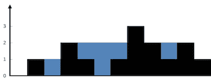
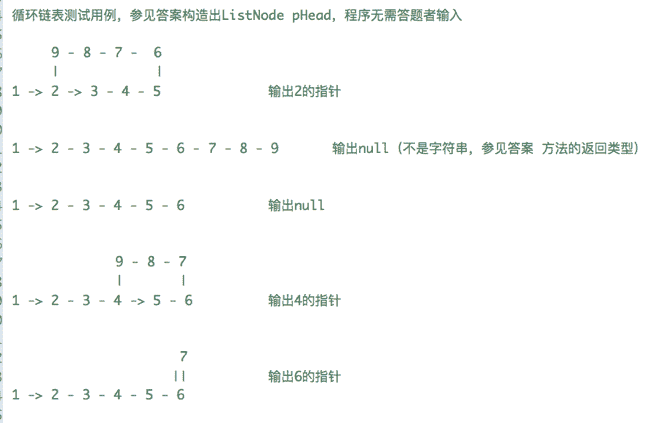

# 瓜子二手车 2019 秋招编程题汇总

## 1

对于一个字符串，请设计一个算法，只在字符串的单词间做逆序调整，也就是说，字符串由一些由空格分隔的部分组成，你需要将这些部分逆序。
给定一个原字符串 A，请返回逆序后的字符串。例，输入"I am a boy!", 输出"boy! a am I"

本题知识点

瓜子二手车 2019

讨论

[亂世丶小虎](https://www.nowcoder.com/profile/35865072)

import java.util.Scanner;public class Main{    public static void main(String[] args) {        String str = new Scanner(System.in).nextLine();        String[] test = str.split(" ");        for(int i = test.length - 1; i >= 0; i--) {            System.out.print(test[i] + " ");        }     }}

编辑于 2019-09-08 13:12:18

* * *

[chinachenhan](https://www.nowcoder.com/profile/907297160)

```cpp
#include<iostream>
#include<string>
using namespace std;

int main(int argc,const char* argv[])
{
    string str;
    getline(cin,str);
    int num = 0;
    const char* ptr = nullptr;
    string::reverse_iterator riter = str.rbegin();
    for( ; riter < str.rend() ; riter++)
    {
        if(*riter == ' ')
        {
            ptr = &(*(riter-1));
            for(int i=0 ; i < num ; i++,ptr++)
            {
                cout<<*ptr;
            }
            cout<<*riter;
            num = -1;
        }
        if(riter == str.rend()-1)
        {
            string::iterator iter = str.begin();
            for(int i=0 ; i < num+1 ; i++,iter++)
            {
                cout<<*iter;
            }
        }
        num++;
    }
    return 0;
}

```

我好菜啊，用一个指针记录正向输出位置，使用逆向迭代器实现翻转输出。。。还是知道题目只会有一个空格。。就不用了那么麻烦的判断了。。

编辑于 2019-09-25 15:47:28

* * *

[。。。201909031231617](https://www.nowcoder.com/profile/346763980)

print(' '.join(input().split()[::-1]))

编辑于 2019-09-04 16:01:25

* * *

## 2

有 1 分，2 分，5 分，10 分四种硬币，每种硬币数量无限，给定 n 分钱(n <= 100000)，有多少中组合可以组成 n 分钱？

本题知识点

Java 工程师 C++工程师 iOS 工程师 安卓工程师 运维工程师 前端工程师 算法工程师 PHP 工程师 测试工程师 安全工程师 c#工程师 数据库工程师 大数据开发工程师 瓜子二手车 2019

讨论

[羡鱼 201907071247985](https://www.nowcoder.com/profile/217613649)

import java.util.Scanner;

public class Main {
    public static void main(String args[]) {
    Scanner input=new Scanner(System.in);
    int n=input.nextInt();
    int coins[]= {1,2,5,10};
    int [] dp=new int[100001];
    dp[0]=1;
    for(int i=0;i<4;i++) {
        for(int j=coins[i];j<=n;j++) {
            dp[j]=(dp[j]+dp[j-coins[i]])%1000000007;
        }
    }
    System.out.println(dp[n]);

    }
}

发表于 2019-09-03 16:09:27

* * *

[执着在一线](https://www.nowcoder.com/profile/658993678)

```cpp
# python3
def change(coins, n):
    len1 = len(coins)
    if len1 == 0 and n < 1 or n > 100000:
        return None
    ways = [0] * (n + 1)  # 初始化
    ways[0] = 1
    for i in range(len1):
        for j in range(coins[i], n + 1):
            # 保证 n 小于等于 100000，为了防止溢出，请将答案 Mod 1000000007
            ways[j] = (ways[j] + ways[j - coins[i]]) % 1000000007
    print(ways[n])

if __name__ == '__main__':
    coins, n = [1, 2, 5, 10], int(input())
    change(coins, n)
```

发表于 2019-09-02 21:04:01

* * *

[卷毛侠](https://www.nowcoder.com/profile/605331088)

#include <iostream>using namespace std;

int countWays(int n) {
        // write code here
        int coins[4]={1,2,5,10};
        int dp[100001] = {0};       
        dp[0] = 1;
        for(int i = 0;i < 4;++i){
            for(int j = coins[i];j <= n;++j){
                dp[j] =(dp[j]+dp[j-coins[i]])%1000000007;               
            }
        }
        return dp[n];
    }
int main()
{
    int n;
    cin>>n;
    cout<<countWays(n)<<endl;
}

发表于 2019-11-05 19:45:59

* * *

## 3

对 K 个不同字符的全排列组成的数组,  面试官从中随机拿走了一个, 剩下的数组作为输入,  请帮忙找出这个被拿走的字符串?
比如[“ABC”, “ACB”, “BAC”, “CAB”, “CBA”] 返回 “BCA”

本题知识点

Java 工程师 C++工程师 iOS 工程师 安卓工程师 运维工程师 前端工程师 算法工程师 PHP 工程师 测试工程师 安全工程师 c#工程师 数据库工程师 大数据开发工程师 瓜子二手车 2019

讨论

[曹操快跑](https://www.nowcoder.com/profile/944386200)

java 100%

```cpp
import java.util.Scanner;

public class Main{
    public static void main(String[] args) {
        Scanner scanner = new Scanner(System.in);
        int lines = scanner.nextInt();
        scanner.nextLine();
        StringBuilder input = new StringBuilder();
        for (int i = 0; i < lines; i++) {
            input.append(scanner.nextLine());
        }
        if (lines == 1) {
            System.out.println(input.substring(1, 2) + input.substring(0, 1));
            return;
        }
        char[] inputCharArray = input.toString().toCharArray();
        int len = inputCharArray.length / lines;//一个字符串有多长
        StringBuilder res = new StringBuilder();
        for (int j = 0; j < len; j++) {
            char temp = 0;
            for (int k = j; k <inputCharArray.length ; k+=len) {
                temp ^= inputCharArray[k];
            }
            res.append(temp);
        }
        System.out.println(res.toString());
    }

}
```

发表于 2019-09-12 23:48:40

* * *

[刘诗歌](https://www.nowcoder.com/profile/406172105)

**C++解法（****字符串异或操作****）**有两点注意事项  ：1\. 对^=进行了重载 2\. 对 n==1 的特例做个判断

```cpp
#include<iostream>
#include<algorithm>
#include<string>
using namespace std;
void operator ^=(string &a, string b)    //^=重载，给 a 一个引用就 ok 了，你要是同时给 b 引用也是 ok 的
{
    int len = a.length();
    for(int i = 0; i < len; ++i)
        a[i] = a[i]^b[i];
}
int main()
{
    int n;
    cin>>n;
    string strOut, temp;
    cin>>temp;
    if(n==1)    //当只给一个字符串的时候，组成字符串的字母一定只有两个，所以你可以调用 algorithm 的 reverse（），或者直接输出 temp[1],temp[0]都是 ok 的
    {
        reverse(temp.begin(), temp.end());
        cout<<temp;
        return 0;
    }
    strOut = temp;
    for(int i = 1; i < n; ++i)
    {
        cin>>temp;
        strOut ^= temp;    //上面我重载了符号^=，如果有不懂得小伙伴去 Google 一下，他其实和函数重载是一样的，只不过有一些硬性要求。
    }
    cout<<strOut;
    return 0;
}
```

发表于 2019-10-25 17:40:05

* * *

[tw2387](https://www.nowcoder.com/profile/681124604)

```cpp
def count_list(in_list, rec_dict={}, rec_list=[]):
    for i in in_list:
        if i in rec_dict:
            rec_dict[i] = rec_dict[i] + 1
        else:
            rec_dict[i] = 1
    for i in rec_dict:
        rec_list.append(rec_dict[i])
    new_dict = {v: k for k, v in rec_dict.items()}
    return new_dict[min(rec_list)]

s = int(input())
temp = []
for i in range(s):
    temp.append(input())

def less_morp(input_list, i):
    temp_result = []
    for j in input_list:
        temp_result.append(j[i])
    result = count_list(temp_result, rec_dict={}, rec_list=[])
    return result

result_list = []
if len(temp) == 1:
    str = temp[0][::-1]
else:
    for x in range(len(temp[0])):
        result_list.append(less_morp(input_list=temp, i=x))
        str = "".join(result_list)
print(str)
```

发表于 2019-09-04 20:40:37

* * *

## 4

已知两颗二叉树，将它们合并成一颗二叉树。合并规则是：都存在的结点，就将结点值加起来，否则空的位置就由另一个树的结点来代替。例如：
两颗二叉树是:
Tree 1  
     1   
    / \   
   3   2
  /      
 5   

Tree 2
   2
  / \
 1   3
  \   \
   4   7

合并后的树为
    3
   / \
  4   5
 / \    \
5  4    7

本题知识点

Java 工程师 C++工程师 iOS 工程师 安卓工程师 运维工程师 前端工程师 算法工程师 PHP 工程师 测试工程师 安全工程师 c#工程师 数据库工程师 大数据开发工程师 瓜子二手车 2019

讨论

[XiaKIsGod](https://www.nowcoder.com/profile/7446963)

//这题难度不大，但是如果想省时间，可以将第一棵树和第二课树的节点统一编址，将第 2 棵树合并到第一颗树，这样的好处是，如果遍历到两颗树的某个相同位置的时侯，如果第 1 棵树的一边孩子不存在，而第二棵树的孩子存在，那么直接将那个孩子连接到第一颗树相应的地方，而不需要再往下便利

```cpp
/**
**      author:XiaKIsGod
**      time:2019.9
**/
#include <bits/stdc++.h>
#define LL long long
#define pb push_back
#define endl "\n"
#define FIN freopen("1.txt","r",stdin)
#define mem(x,v) memset(x,v,sizeof(x))
#define repn(i,a,n) for(int i=a;i<=n;i++)
#define rep(i,a,n) for(int i=a;i<n;i++)
#define per(i,a,n) for(int i=n-1;i>=a;i--)
using namespace std;
inline int read() {char c;int ret = 0, sgn = 1;do { c = getchar(); } while ((c < '0' || c > '9') && c != '-');if (c == '-') sgn = -1; else ret = c - '0';while ((c = getchar()) >= '0' && c <= '9') ret = ret * 10 + (c - '0');return sgn * ret;}
inline LL readl() {char c;LL ret = 0, sgn = 1;do { c = getchar(); } while ((c < '0' || c > '9') && c != '-');if (c == '-') sgn = -1; else ret = c - '0';while ((c = getchar()) >= '0' && c <= '9') ret = ret * 10 + (c - '0');return sgn * ret;}
const int N = 1000;
int n,m;
int val[N],l[N],r[N];
void dfs(int rt1,int rt2){
    val[rt1]+=val[rt2];
    if(l[rt1]&&l[rt2]) dfs(l[rt1],l[rt2]);
    else if(!l[rt1]&&l[rt2]) l[rt1] = l[rt2];
    if(r[rt1]&&r[rt2]) dfs(r[rt1],r[rt2]);
    else if(!r[rt1]&&r[rt2]) r[rt1] = r[rt2];
}
void solve(int u){
    queue<int> q;
    q.push(u);
    while(!q.empty()){
        int v = q.front();q.pop();
        printf("%d ",val[v]);
        if(l[v]) q.push(l[v]);
        if(r[v]) q.push(r[v]);
    }
}
int main()
{
    n = read();m = read();
    repn(i,1,n) l[i]=read(),r[i]=read(),val[i]=read();
    repn(i,n+1,n+m){
        l[i]=read();if(l[i]!=0) l[i]+=n;
        r[i]=read();if(r[i]!=0) r[i]+=n;
        val[i]=read();
    }
    dfs(1,1+n);
    solve(1);
    return 0;
}
```

发表于 2019-09-08 20:19:59

* * *

[LogiCycle](https://www.nowcoder.com/profile/712832073)

这题最难的我觉得是输入，我想了挺久的。

```cpp
import java.util.Scanner;
import java.util.Map;
import java.util.HashMap;
import java.util.Deque;
import java.util.ArrayDeque;

public class Main{
    public static void main(String[] args){
        Scanner sc = new Scanner(System.in);
        int nodeNum1 = sc.nextInt();
        int nodeNum2 = sc.nextInt();

        int[] treeArray1 = new int[3 * nodeNum1];
        int[] treeArray2 = new int[3 * nodeNum2];
        for (int i = 0; i < treeArray1.length; i++)
            treeArray1[i] = sc.nextInt();
        for (int i = 0; i < treeArray2.length; i++)
            treeArray2[i] = sc.nextInt(); 
        sc.close();

        TreeNode t1 = TreeNode.genTree(treeArray1);
        TreeNode t2 = TreeNode.genTree(treeArray2);

        TreeNode merge = mergeTree(t1, t2);
        BFS(merge);

    }

    public static TreeNode mergeTree(TreeNode t1, TreeNode t2){
        if (t1 != null && t2 != null){
            t1.left = mergeTree(t1.left, t2.left);
            t1.right = mergeTree(t1.right, t2.right);
            t1.val += t2.val;
            return t1;
        }
        return t1 == null ? t2 : t1;
    }
    //层次遍历
    public static void BFS(TreeNode root){
        if (root == null)
            return;
        Deque<TreeNode> queue = new ArrayDeque<>();
        queue.offer(root);
        int currentSize = queue.size();
        while (!queue.isEmpty()){
            while (currentSize-- > 0){
                root = queue.poll();
                System.out.print(root.val + " ");
                if (root.left != null || root.right != null){
                    if (root.left != null)
                        queue.offer(root.left);
                    if (root.right != null)
                        queue.offer(root.right);
                }

            }
            currentSize = queue.size();
        }
    }

}

class TreeNode{
    TreeNode left;
    TreeNode right;
    int val;
    public TreeNode(int val){
        this.val = val;
    }
    //生成树
    public static TreeNode genTree(int[] array){
        Map<Integer, TreeNode> tmp = new HashMap<>();
        TreeNode root = new TreeNode(0);
        TreeNode head = root;
        for (int i = 0, layer = 1; i < array.length; i += 3, layer++){

            int left = array[i];
            int right = array[i + 1];
            int val = array[i + 2];

            if (tmp.containsKey(layer))
                root = tmp.get(layer);

            root.val = val;

            if (left == 0)
                root.left = null;
            else {
                root.left = new TreeNode(0);
                tmp.put(left, root.left); //若左子树不为空将编号映射，在对应层数在赋值
            }

            if (right == 0)
                root.right = null;
            else {
                root.right = new TreeNode(0);
                tmp.put(right, root.right);//若右子树不为空将编号映射，在对应层数在赋值
            }
        }
        return head;
    }
}
```

发表于 2019-09-05 19:49:25

* * *

[-bestDragon](https://www.nowcoder.com/profile/348483962)

```cpp
#include<iostream>
#include<vector>
#include<queue>
using namespace std;

struct Flag{//搞一个方便存储数据 
		int LFlag;
		int RFlag;
		int Weight;
	Flag(int lf,int rf,int w):LFlag(lf),RFlag(rf),Weight(w){
	};
};

struct BiTreeNode{
	int flag;//第几个节点
	int weight;//权值
	BiTreeNode *LChild;//左孩子 
	BiTreeNode *RChild;//右孩子 
	BiTreeNode(){
		flag=0;
		weight=0;
		LChild=NULL;
		RChild=NULL;
	}
};

class BiTree{

	private:
		BiTreeNode *root;//根节点
		vector<Flag> treeData;//各节点输出数据  		 
		void creatTree(BiTreeNode *&t,int flag){//建树想法和先序遍历类似
			t->flag=flag;
			t->weight=treeData[flag-1].Weight;
			if(treeData[flag-1].LFlag==0){
				t->LChild=NULL;
			}
			else{
				t->LChild=new BiTreeNode;
				creatTree(t->LChild,treeData[flag-1].LFlag);
			}

		    if(treeData[flag-1].RFlag==0){
				t->RChild=NULL;
			}
			else{
				t->RChild=new BiTreeNode;
				creatTree(t->RChild,treeData[flag-1].RFlag);
			}
		}

		void levelOrder(BiTreeNode *t1){
			queue<BiTreeNode*> tq;
			BiTreeNode *p=t1;
			if(p!=NULL)
				tq.push(p);
			while(!tq.empty()){
				p=tq.front();
				tq.pop();
				cout<<p->weight<<" ";
				if(p->LChild!=NULL)
					tq.push(p->LChild);
				if(p->RChild!=NULL)
					tq.push(p->RChild);

			}
		}

		friend void unite(BiTreeNode *&t1,BiTreeNode *&t2); 
		friend void unite(BiTree *t1,BiTree *t2);
	public:
		BiTree(){
			root=NULL;
		}
		void creatTree(vector<Flag> data){
			int len=data.size();
			for(int i=0;i<len;i++){
				treeData.push_back(data[i]);
			}
			root=new BiTreeNode;
			creatTree(root,1);
		}

		void levelOrder(){//题目是层次遍历 
			levelOrder(root);
		}
}; 

void unite(BiTreeNode *&t1,BiTreeNode *&t2){
	if(t1&&t2){
		t1->weight=t1->weight+t2->weight;//都有就权值相加 
		unite(t1->LChild,t2->LChild);
		unite(t1->RChild,t2->RChild);
	}		
	else if(!t1&&t2){
		t1=new BiTreeNode;
		t1->weight=t2->weight;
		unite(t1->LChild,t2->LChild);
		unite(t1->RChild,t2->RChild);
	}
}

void unite(BiTree *t1,BiTree *t2){
	unite(t1->root,t2->root);
}

int main(){
	int n,m;
	cin>>n>>m;
	int a,b,c;
	vector<Flag> flag;//a
	vector<Flag> flag1;//b
	while(n--){
		cin>>a>>b>>c;
		Flag d(a,b,c);
		flag.push_back(d);
	}
	while(m--){
		cin>>a>>b>>c;
		Flag d(a,b,c);
		flag1.push_back(d);
	}

	BiTree p;
	p.creatTree(flag);
	BiTree p1;
	p1.creatTree(flag1);
	unite(&p,&p1);
	p.levelOrder();
} 
```

发表于 2019-10-22 21:47:51

* * *

## 5

给定 n 个柱面的高度，表示降雨某地 n 块区域的海拔高度。
计算降雨之后该地最大储水面积。如果低于地平线，也就是小于 0，则一定积水


本题知识点

Java 工程师 C++工程师 iOS 工程师 安卓工程师 运维工程师 前端工程师 算法工程师 PHP 工程师 测试工程师 安全工程师 c#工程师 数据库工程师 大数据开发工程师 瓜子二手车 2019

讨论

[{球球 offer}](https://www.nowcoder.com/profile/971225653)

```cpp
//两次遍历分别找到从起始点到该点的最大高度和从终点到该点的最大高度，且高度最低取 0
//再次遍历，每个点的的雨水量等于该点左右最大高度中较低者减去该点高度

#include<iostream>
#include<vector>
using namespace std;
int main() {
	int n;
	cin >> n;
	vector<int>height(n,0);
	vector<int>maxL(n,0);
	vector<int>maxR(n,0);
	int tmp;
	for (int i = 0; i < n; i++) {
		cin >> height[i];
	}
	int max = 0;
	for (int i = 0; i < n; i++) {
		max = height[i] > max ? height[i] : max;
		maxL[i] = max;
	}
	max = 0;
	for (int i = n - 1; i >= 0; i--) {
		max = height[i] > max ? height[i] : max;
		maxR[i] = max;
	}
	int count = 0;
	for (int i = 0; i < n; i++) {
		int small = maxL[i] < maxR[i] ? maxL[i] : maxR[i];
		count += (small - height[i]);
	}
	cout << count;
	system("pause");
	return 0;
}
```

 发表于 2019-09-09 17:33:03

* * *

[木辛木南](https://www.nowcoder.com/profile/795832839)

```cpp
def trap(height):
    def stepv(num):
        temp = 0
        out = 0
        for i in num:
            if i < temp:
                out += temp
            else:
                out += i
                temp = i
        return out, temp

    height2 = height[::-1]
    v1, maxh = stepv(height)
    v2, maxh = stepv(height2)
    return v1 + v2 - len(height) * maxh - sum(height)

n = int(input())
l = list(map(int,input().split(" ")))
print(trap(l))
```

发表于 2019-09-03 11:10:39

* * *

[一语成谶花成空](https://www.nowcoder.com/profile/9929044)

//找到第一个可蓄水凹点的左右两端最高点下标 L、R，使用 L、R 下标对应高度较低的点作为蓄水的最高高度 H，//蓄水体积=（R -L-1）*H - ∑H（i）  (L <i <R),使用 R 作为新的蓄水起始点递归该函数求和 int getWaterVolume(std::vector<int>& water, int index,int length){

    if (index == length -1)
        return 0;

    //凹洞左边的最高点
    int lowTrend = index;
    //凹洞右边的最高点
    int highTrend = index;
    //当前访问的点
    int visitIndex = index;
    //凹洞最低的点
    int lowtestIndex = index;

    while (visitIndex<length)
    {
        //向下降的趋势，则这块有可能积水，且是目前最高点
        if (visitIndex < length-1 &&water[visitIndex] > water[visitIndex + 1])
        {
            lowTrend = visitIndex;
            ++visitIndex;

            //找到最低点
            while (visitIndex < length-1 && water[visitIndex] > water[visitIndex + 1])
            {
                ++visitIndex;
            }
            //没有向上的趋势
            if (visitIndex == length - 1 && water[visitIndex] < water[visitIndex - 1])
            {
                return 0;
            }

            lowtestIndex = visitIndex - 1;

            //找到最高点
            while (visitIndex < length - 1 && water[visitIndex] < water[visitIndex + 1])
            {
                ++visitIndex;
            }

            //最高点

            highTrend = visitIndex;

            //计算坑里面的体积
            int liquidVolume = 0;
            //蓄水高度参照
            int compareNum = 0;
            //比较向下趋势的最高点，与向上趋势的最高点，谁高
            if (water[lowTrend] > water[highTrend])
            {
                compareNum = water[highTrend];
            }
            else 
            {
                compareNum = water[lowTrend];
            }

            for (int addIndex = lowTrend + 1; addIndex < highTrend; ++addIndex)
            {
                liquidVolume += water[addIndex];
            }

            liquidVolume = (highTrend - lowTrend - 1)*compareNum - liquidVolume;

            return liquidVolume + getWaterVolume(water, highTrend, length);

        }
        else//向上升的趋势，则这块无法积水
        {
            ++visitIndex;
        }
    }

    return 0;

}

发表于 2019-09-10 18:54:23

* * *

## 6

判断一个无序数组中是否存在长度为 3 的递增子序列。（不要求连续）（满足 O(n)的时间复杂度和 O(1)的空间复杂度。）

本题知识点

Java 工程师 C++工程师 iOS 工程师 安卓工程师 运维工程师 前端工程师 算法工程师 PHP 工程师 测试工程师 安全工程师 c#工程师 数据库工程师 大数据开发工程师 瓜子二手车 2019

讨论

[封装成帧](https://www.nowcoder.com/profile/321386663)

leetcode334

```cpp
// 动态规划
public boolean increasingTriplet(int[] nums) {
    if (nums == null || nums.length < 3)
        return false;
    int[] dp = new int[nums.length];
    for (int i = 1; i < nums.length; i++) {
        for (int j = 0; j < i; j++) {
            if (nums[i] > nums[j]) {
                dp[i] = Math.max(dp[i], dp[j] + 1);
            }
            if (dp[i] > 1)
                return true;
        }
    }
    return false;
}
// 着眼于中间的那个值
public boolean increasingTriplet_2(int[] nums) {
    if (nums == null || nums.length < 3) {
        return false;
    }
    int min = Integer.MAX_VALUE;
    int mid = Integer.MAX_VALUE;
    for (int i = 0; i < nums.length; i++) {
        if (nums[i] <= min) {
            min = nums[i];
        } else if (nums[i] <= mid) {
            mid = nums[i];
        } else {
            return true;
        }
    }
    return false;
}
```

发表于 2019-12-06 22:25:26

* * *

[{球球 offer}](https://www.nowcoder.com/profile/971225653)

```cpp
//遍历数据，确定从起始点到该点的最小数据值、和左边拥有更小数据的第二小数据中的最小值
//min 记录最小数据，second 记录长度为 2 的递增的最小的第二个值，如果当前遍历的数据大于 second 则存在长度为三的递增

#include<iostream>
using namespace std;
int main() {
	int n;
	cin >> n;
	int tmp, min = 0, second = 0;
	cin >> min;
	while (cin >> tmp) {
		if (tmp > min) {
			second = tmp;
			break;
		}
		else if (tmp < min) {
			min = tmp;
		}
	}
	while (cin >> tmp) {
		if (tmp < min) {
			min = tmp;
		}
		else if (tmp > min) {
			if (tmp > second) {
				cout << "true";
				system("pause");
				return 0;
			}
			if (tmp < second)
				second = tmp;
		}
	}
	cout << "false";
	system("pause");
	return 0;
}
```

发表于 2019-09-09 18:37:17

* * *

## 7

用非递归方式编码对一个二叉树的前、中、后、层次遍历。

本题知识点

Java 工程师 C++工程师 iOS 工程师 安卓工程师 运维工程师 前端工程师 算法工程师 PHP 工程师 测试工程师 安全工程师 c#工程师 数据库工程师 大数据开发工程师 瓜子二手车 2019

讨论

[LeeLdler](https://www.nowcoder.com/profile/425488043)

利用栈求前序，中序，后序遍历，用队列求层序遍历。

```cpp
#include<cstring>
#include<algorithm>
#include<vector>
#include<map>
#include<queue>
#include<cstdio>
#include<stack>
#include<cmath>
#include<iostream>
#define ll long long
#define lowbit(x) x&(-x)
using namespace std;
struct TreeNode
{
	int val;
	int left;
	int right;
}t[1000];
int vis[1000];
int ans[1000];
void preOrder2(TreeNode root) {
    stack<TreeNode> stk;
    stk.push(root);
	int k=0;                                                                                                                                                                      
    while(!stk.empty()) {
        TreeNode pNode = stk.top();
        stk.pop();
        ans[k++]=pNode.val;
        if(pNode.right != 0)
            stk.push(t[pNode.right]);
        if(pNode.left != 0)
            stk.push(t[pNode.left]);
    }
}
void inOrder2(TreeNode root) {

    stack<TreeNode> stk;
    TreeNode pNode = root;
    int k=0;
    while(pNode.val != 0 || !stk.empty()) {
        if(pNode.val  != 0) {
            stk.push(pNode);
            pNode = t[pNode.left];
        }
        else {
            pNode = stk.top();
            stk.pop();
            ans[k++]=pNode.val;
            pNode = t[pNode.right];
        }
    }
}
void postOrder2(TreeNode root) {
    if(root.val == 0)
        return;
        int k=0;
    stack<TreeNode > stk, stk2;
    stk.push(root);
    while(!stk.empty()) {
        TreeNode pNode = stk.top();
        stk.pop();
        stk2.push(pNode);
        if(pNode.left != 0)
            stk.push(t[pNode.left]);
        if(pNode.right != 0)
            stk.push(t[pNode.right]);
    }
    while(!stk2.empty()) {
        ans[k++]=stk2.top().val;
        stk2.pop();
    }
}
int main()
{
	int n;
	while(~scanf("%d",&n))
	{
		memset(vis,0,sizeof(vis));
		for(int i=1;i<=n;i++)
		{
			int a,b;
			scanf("%d%d",&a,&b);

			t[i].left=a;
			t[i].right=b;
			t[i].val=i;
			vis[a]=1;
			vis[b]=1;
		}
		int root;
		for(int i=1;i<=n;i++)
		{
			if(vis[i]==0)
			{
				root=i;
				break;
			}
		}
		preOrder2(t[root]);
		for(int i=0;i<n-1;i++)
		{
			printf("%d ",ans[i]);
		}
		printf("%d\n",ans[n-1]);
		inOrder2(t[root]);
		for(int i=0;i<n-1;i++)
		{
			printf("%d ",ans[i]);
		}
		printf("%d\n",ans[n-1]);
		postOrder2(t[root]);
		for(int i=0;i<n-1;i++)
		{
			printf("%d ",ans[i]);
		}
		printf("%d\n",ans[n-1]);
		queue<TreeNode> q;
		q.push(t[root]);
		int k=0;
		while(!q.empty())
		{
			TreeNode now=q.front();
			q.pop();
			ans[k++]=now.val;
			if(now.left!=0)
			q.push(t[now.left]);
			if(now.right!=0)
			q.push(t[now.right]);
		}
		for(int i=0;i<n-1;i++)
		{
			printf("%d ",ans[i]);
		}
		printf("%d\n",ans[n-1]);
	}
}
```

发表于 2019-09-11 11:17:48

* * *

[{球球 offer}](https://www.nowcoder.com/profile/971225653)

```cpp
//没想出好方法，代码有点长

#include<iostream>
#include<vector>
#include<queue>
#include<stack>
using namespace std;
int main() {
	int n;
	cin >> n;
	vector<int>val(n + 1);
	vector<int>le(n + 1, 0);
	vector<int>ri(n + 1, 0);

	for (int i = 0; i <= n; i++)
		val[i] = i;
	for (int i = 1; i <= n; i++) {
		cin >> le[i] >> ri[i];
	}
	vector<int>lef(le);
	vector<int>rif(ri);
	stack<int>zhan;

	//前序遍历
	lef.assign(le.begin(), le.end());
	rif.assign(ri.begin(), ri.end());

	zhan.push(1);//根节点为 1
	cout << 1 << " ";//前序遍历在节点加入进来时输出
	while (!zhan.empty()) {
		int tmp = zhan.top();
		if (lef[tmp]) {
			zhan.push(lef[tmp]);
			cout << lef[tmp] << " ";
			lef[tmp] = 0;
		}
		else if (rif[tmp]) {
			zhan.push(rif[tmp]);
			cout << rif[tmp] << " ";
			rif[tmp] = 0;
		}
		else
			zhan.pop();
	}
	cout << endl;

	//中序遍历，入栈中左右，输出左中右，没有左右值的出栈
	lef.assign(le.begin(), le.end());
	rif.assign(ri.begin(), ri.end());
	//stack<int>zhan2;
	zhan.push(1);
	while (!zhan.empty()) {
		int tmp = zhan.top();
		if (lef[tmp]) {
			zhan.push(lef[tmp]);
			lef[tmp] = 0;
		}
		else if (rif[tmp]) {//将入栈顺序的中右改为右中
			zhan.pop();
			zhan.push(rif[tmp]);
			zhan.push(tmp);
			rif[tmp] = 0;
		}
		else {
			cout << tmp << " ";
			zhan.pop();
		}
	}
	cout << endl;

	//后序遍历
	lef.assign(le.begin(), le.end());
	rif.assign(ri.begin(), ri.end());
	zhan.push(1);
	while (!zhan.empty()) {
		int tmp = zhan.top();
		if (lef[tmp]) {
			zhan.push(lef[tmp]);
			lef[tmp] = 0;
		}
		else if (rif[tmp]) {
			zhan.push(rif[tmp]);
			rif[tmp] = 0;
		}
		else {
			cout << tmp << " ";
			zhan.pop();
		}
	}
	cout << endl;

	//层序遍历使用队列
	lef.assign(le.begin(), le.end());
	rif.assign(ri.begin(), ri.end());
	queue<int>que;
	que.push(1);//第一层根节点 1
	while (!que.empty()) {
		int tmp = que.front();
		que.pop();
		if (lef[tmp]) {
			que.push(lef[tmp]);
		}
		if (rif[tmp]) {
			que.push(rif[tmp]);
		}
		cout << tmp << " ";
	}
	cout << endl;

	system("pause");
	return 0;
}
```

发表于 2019-09-09 23:37:50

* * *

[乒乓球去学校](https://www.nowcoder.com/profile/797390480)

都说了非递归

发表于 2019-09-05 10:34:42

* * *

## 8

代码实现二叉树的后续遍历。要求：1、不可以用递归；2、不可以用栈；3、自定义树节点的结构；4、给出测试用例；5、语言不限；注意：你的方法的输入为根节点参考方法：定义树结构体如下：struct TreeNode {    int value;    TreeNode* parent;    TreeNode* leftChild;    TreeNode* rightChild;}

本题知识点

Java 工程师 C++工程师 iOS 工程师 安卓工程师 运维工程师 前端工程师 算法工程师 PHP 工程师 测试工程师 安全工程师 c#工程师 数据库工程师 大数据开发工程师 瓜子二手车 2019

讨论

[{球球 offer}](https://www.nowcoder.com/profile/971225653)

```cpp
//我的 TreeNode 中保存了父节点、左子节点、右子节点的输入序号，默认为 0 为空节点
//构造一个 n+1 大小的 TreeNode 数组，下标 0 为空节点，其它下标对应节点的输入序号即 value
//用一个下标指示根节点，按后续遍历顺序找到最先遍历的节点，并将指示下标赋值为该节点
//找到当前树中最先遍历的节点，其左右子节点都为空，输出该节点的下标即 value，并将该节点从树中删除
//删除节点通过将其父节点的指向赋值为 0，当父节点有左子节点时都会先删除左子节点

#include<iostream>
#include<vector>
using namespace std;
struct TreeNode {
	//int value = 0;//输入的序号
	int parent = 0;
	int left = 0;
	int right = 0;
};
int main() {
	int n; 
	cin >> n;

	vector<TreeNode>arr(n+1);
	for (int i = 1; i <= n; i++)
		cin >> arr[i].left >> arr[i].right;

	for (int i = 1; i <= n; i++) {//节点的输入序号即节点的值
		int lef = arr[i].left;
		int rig = arr[i].right;
		arr[lef].parent = i;
		arr[rig].parent = i;
	}

	//后续遍历
	int index = 1;
	int count = 0;
	while (count < n) {
		int lef = arr[index].left;
		if (lef) {
			index = lef;
			continue;
		}
		int rig = arr[index].right;
		if (rig) {
			index = rig;
			continue;
		}
		//左右节点为空
		cout << index << " ";
		index = arr[index].parent;
		if (arr[index].left)
			arr[index].left = 0;
		else
			arr[index].right = 0;

		count++;
	}

	system("pause");
	return 0;
}
```

发表于 2019-09-10 00:45:29

* * *

## 9

给定两个字符串。
定义三种操作：
1.插入一个字符
2.修改一个字符
3.删除一个字符
求最少几步操作使得第一个字符串变成第二个字符串。
例如：第一个字符串 lighten,第二个字符串 fighting
fighten (l->f) 修改
fightin (e->i) 修改
fighting (->g) 插入
一共三步

本题知识点

Java 工程师 C++工程师 iOS 工程师 安卓工程师 运维工程师 前端工程师 算法工程师 PHP 工程师 测试工程师 安全工程师 c#工程师 数据库工程师 大数据开发工程师 瓜子二手车 2019

讨论

[自律](https://www.nowcoder.com/profile/7999460)

这个题目就是动态规划  记 dp[i][j] 表示 i 和 j 相等所需要的修改次数 那么当 a[i] == b[j] 时 dp[i][j]= dp[i - 1][j - 1];当两者不相等的时候 考虑修改的三种情况 1\. 把第 i 位删除掉 那么说明第 i - 1 位和第 j 位是相等的 有：dp[i][j] = min(dp[i - 1][j] + 1,dp[i][j]);；2.在第 i 位前面增加一个数 那么说明第 i 位是和第 j - 1 位相等的 有：dp[i][j] = min(dp[i][j - 1] + 1,dp[i][j]); 3.修改第 i 位，那么这个就很简单了 说明第 i - 1 和第 j - 1 是相等的 有：dp[i][j] = min(dp[i - 1][j - 1] + 1,dp[i][j]);注意对于 dp 初始化的时候要初始化 dp[i][0] = i dp[j][0] = j;

```cpp
#include <bits/stdc++.h>

using namespace std;

const int inf = 0x3f3f3f3f;

char a[1010],b[1010];

int dp[1010][1010]; // a is i pos  b is j pos 

int main()
{
    int n;
    scanf("%s", a + 1);
    int m;
    scanf("%s", b + 1);
    n = strlen(a + 1);
    m = strlen(b + 1);
    for(int i = 0; i <= m; i++) dp[0][i] = i;
    for(int i = 0; i <= n; i++) dp[i][0] = i;
    for(int i = 1; i <= n; i++)
    {
        //dp[i][j] = inf;
        for(int j = 1; j <= m; j++)
        {
            dp[i][j] = inf;
            if(a[i] == b[j])
            {
                dp[i][j]= dp[i - 1][j - 1]; 
            }
            else
            {
                dp[i][j] = min(dp[i - 1][j] + 1,dp[i][j]); // 删除 都是对于第 i 位来看的
                dp[i][j] = min(dp[i][j - 1] + 1,dp[i][j]); // 增加
                dp[i][j] = min(dp[i - 1][j - 1] + 1,dp[i][j]); // 修改 啊难受呀老弟
            }
            //cout<<dp[i][j]<<endl;
        }
    }
    printf("%d\n",dp[n][m]);
    return 0;
}
```

发表于 2019-09-03 17:14:21

* * *

[Songcubi](https://www.nowcoder.com/profile/615156853)

这是用 js-v8 写的，感觉写的好幸酸，js 没有二维数组。

> js 要使用 readline()读取单行输入，用 print 输出。

*   其实想用 java 写，为了练习自己的 js 代码能力，冲！

```cpp
var a=readline();
var b=readline();
var m=a.length;
var n=b.length;
//生成二维数组方法
function DArray(rowLength, colLength) {
            var dArray = new Array(rowLength);
            for (var i = 0; i < rowLength; i++) {
                dArray[i] = new Array(colLength);
            }
            return dArray;
        }

var arr =DArray(m+1,n+1);
arr[0][0]=0;

    for(let i=1;i<=m;i++){
        arr[i][0]=i;
    }
    for(let j=1;j<=n;j++){
        arr[0][j]=j;
    }
    for(var i=1;i<=m;i++){
        for(var j=1;j<=n;j++){
            if(a[i-1]==b[j-1]){
                arr[i][j]=arr[i-1][j-1];
            }else{
                arr[i][j]=Math.min(arr[i-1][j]+1,
                                   arr[i][j-1]+1,
                                   arr[i-1][j-1]+1);

            }
        }
    }
    print(arr[m][n]);
```

编辑于 2021-06-12 21:00:12

* * *

[{球球 offer}](https://www.nowcoder.com/profile/971225653)

```cpp
#include<iostream>
#include<vector>
#include<string>
using namespace std;
int mymin(int a, int b) {
	return a < b ? a : b;
}
int main() {
	string s, t;
	getline(cin, s);
	getline(cin, t);
	int lens = s.size();
	int lent = t.size();
	vector<vector<int>>arr(lens + 1, vector<int>(lent + 1, 0));
	for (int i = 0; i <= lens; i++) {
		arr[i][0] = i;
	}
	for (int i = 1; i <= lent; i++) {
		arr[0][i] = i;
	}

	for (int i = 1; i <= lens; i++) {
		for (int j = 1; j <= lent; j++) {
			if (s[i - 1] == t[j - 1]) {
                                //分别对应不动、删、增
				arr[i][j] = mymin(arr[i - 1][j - 1], mymin(arr[i][j - 1] + 1, arr[i - 1][j] + 1));
			}
			else {
                                //分别对应改、删、增
				arr[i][j] = mymin(arr[i - 1][j - 1]+1, mymin(arr[i][j - 1] + 1, arr[i - 1][j] + 1));
			}
		}
	}
	cout << arr[lens][lent];

	system("pause");
	return 0;
}
```

编辑于 2019-09-10 01:07:13

* * *

## 10

请实现有重复数字的有序数组的二分查找。输出在数组中第一个大于等于查找值的位置，如果数组中不存在这样的数，则输出数组长度加 1。

本题知识点

Java 工程师 C++工程师 iOS 工程师 安卓工程师 运维工程师 前端工程师 算法工程师 PHP 工程师 测试工程师 安全工程师 c#工程师 数据库工程师 大数据开发工程师 瓜子二手车 2019

讨论

[芒果爱泡泡](https://www.nowcoder.com/profile/282702962)

```cpp
n,v=map(int,input().split())
a=list(map(int,input().split()))

left,right=0,n-1
if not a:
    print(1)
Flag=True
while left<=right:
    mid=(left+right)>>1
    if a[mid]>=v:
        right=mid-1
    else: 
        left=mid+1

if left<n and a[left]>=v:
    print(left+1)
else:       
    print(len(a)+1)

```

发表于 2020-08-29 12:47:15

* * *

[gdut17](https://www.nowcoder.com/profile/279358190)

```cpp
#include<iostream>
#include<algorithm>
#include<string>
#include <vector>
using namespace std;
int binaryserch(vector<int>&v,int key){
    int low,high,mid;
    low=0;
    high=v.size()-1;
    while(low<=high){
        mid=(low+high)/2;
        if(v[mid]>=key){
            int j = mid;
            while(j>=0 && v[j]>=key){
                j--;
            }
            return j+1+1;
        }
        //else if(v[mid]>key){
        //     high = mid-1;            

        //}
        else{//v[mid] < key
            low = mid+1;
        }
    }
    return v.size()+1;
}
int main(){
    int n,key;
    vector<int>v;
    cin>>n>>key;
    int i;
    for(i=0;i<n;i++){
        int t;
        cin>>t;
        v.push_back(t);
    }
    cout<<binaryserch(v,key);

}
```

发表于 2020-08-03 10:52:15

* * *

[牛客 7309617 号](https://www.nowcoder.com/profile/7309617)

```cpp
#include<iostream>
#include <vector>

using namespace std;

int binarySearch(std::vector<int> &vec, int target)
{
	int low = 0;
	int high = vec.size();//[low,high)区间搜索
	int mid = 0;
	while (low < high)
	{
		mid = (low + high) / 2;
		if (vec[mid] == target)
		{
			high = mid;//收紧右区间
		}
		else if (vec[mid] < target)
		{
			low = mid + 1;
		}
		else
		{
			high = mid;
		}
	}
	return low+1;
}

int main()
{

	int len = 0;
	int target = 0;

	std::cin >> len;
	std::cin >> target;

	int ele;
	std::vector<int> vec;
	while (std::cin >> ele)
	{
		vec.push_back(ele);
		if (vec.size() == len)
			break;
	}

	std::cout << binarySearch(vec, target);
}
```

编辑于 2020-04-08 23:51:31

* * *

## 11

给一个单向链表，若其中包含环，请完善 EntryNodeOfLoop 方法找出该链表的环的入口结点，否则，输出 null。要求空间复杂度为 O(1)
public class ListNode {  //链表的数据结构
   int val;
   ListNode next = null;
}
public ListNode EntryNodeOfLoop(ListNode pHead) {

}


本题知识点

Java 工程师 C++工程师 iOS 工程师 安卓工程师 运维工程师 前端工程师 算法工程师 PHP 工程师 测试工程师 安全工程师 c#工程师 数据库工程师 大数据开发工程师 瓜子二手车 2019

讨论

[neekity](https://www.nowcoder.com/profile/7732482)

[`blog.csdn.net/weixin_40807247/article/details/91447922`](https://blog.csdn.net/weixin_40807247/article/details/91447922)

发表于 2019-09-16 16:45:10

* * *

[gdut17](https://www.nowcoder.com/profile/279358190)

```cpp
#include<iostream>
#include<algorithm>
#include<string>
#include <vector>
#include<map>
using namespace std;

struct ListNode {
    int val;
    ListNode *next;
};

ListNode* EntryNodeOfLoop(ListNode* pHead) {
    ListNode* p = pHead;
    map<int,int>m;
    while(p){
        if(m.count(p->val)==0){
            m.insert(make_pair(p->val,1));
        }else{
            break;
        }

        p=p->next;
    }
    if(!p){
        return NULL;
    }else{
        ListNode* q = pHead;
        while(q->val != p->val){
            q=q->next;
        }
        return q;
    }

}
int main(){
    int n;
    cin>>n;
    int i;
    struct ListNode*head = NULL;
    struct ListNode*p,*q;
    for(i=0;i<n;i++){
        p = new ListNode;
        cin>>p->val;
        p->next = NULL;
        if(head == NULL){
            head = p;
            q = p;
        }else{
            q->next = p;
            q = p;
        }
    }
    p = EntryNodeOfLoop(head);
    if(p){
        cout<<p->val;
    }else{
        cout<<"NULL";
    }

}
```

编辑于 2020-08-03 11:03:31

* * *

## 12

给定一棵二叉搜索树和一个定值，将该树分成两棵独立的二叉搜索树，要求小于给定值的树节点在一颗树上，不小于给定值的树节点在另一棵二叉树上。语言不限。

本题知识点

Java 工程师 C++工程师 iOS 工程师 安卓工程师 运维工程师 前端工程师 算法工程师 PHP 工程师 测试工程师 安全工程师 c#工程师 数据库工程师 大数据开发工程师 瓜子二手车 2019

讨论

[勇敢牛牛，不怕困难！](https://www.nowcoder.com/profile/840813925)

```cpp
// 没有过全部测试用例（怀疑是用例问题）  仅通过 46.67%
#include <stdio.h>
#include <stdlib.h>
#include <string.h>

typedef struct TreeNode {
  int id, weight;
  struct TreeNode *left, *right;
} TreeNode, *PTreeNode;

typedef struct {
  struct TreeNode* t1; // <
  struct TreeNode* t2; // >=
} Result;

PTreeNode buildTree(int (*data)[3], int index) {
  if (!index) return NULL;
  PTreeNode root = (PTreeNode) malloc(sizeof(TreeNode));
  if (!root) return NULL;

  root->id     = index;
  root->weight = *(*(data + index) + 2);
  root->left   = buildTree(data, **(data + index));
  root->right  = buildTree(data, *(*(data + index) + 1));
  return root;
}

Result split(PTreeNode root, int target) {
  if (!root)
    return (Result) { .t1 = NULL, .t2 = NULL };

  Result res;
  if (root->weight >= target) {
    res = split(root->left, target);
    root->left = res.t2;
    res.t2 = root;
  } else {
    res = split(root->right, target);
    root->right = res.t1;
    res.t1 = root;
  }
  return res;
}

void output(PTreeNode node) {
  printf("{%d %d}, ", (*node).id, (*node).weight);
}

void create_mapping(PTreeNode root, PTreeNode* repos) {
  if (!root) return;
  *(repos + root->id) = root;
  create_mapping(root->left, repos);
  create_mapping(root->right, repos);
}

// debug helper function
void preorder(PTreeNode root, void (*visit) (PTreeNode)) {
  if (!root) return;
  visit(root);
  preorder(root->left, visit);
  preorder(root->right, visit);
}

int main(void) {
  int n, v;
  scanf("%d %d", &n, &v);
  int data[n + 1][3], has_parent[n + 1];
  memset(has_parent, 0x0000, sizeof has_parent);

  int i, l, r, w;
  for (i = 1; i <= n; ++i) {
    scanf("%d %d %d", &l, &r, &w);
    data[i][0] = l;
    data[i][1] = r;
    data[i][2] = w;
    if (l != 0) has_parent[l] = 1;
    if (r != 0) has_parent[r] = 1;
  }

  int root_idx = 1; 
  while (has_parent[root_idx]) ++root_idx;

  PTreeNode root = buildTree(data, root_idx);

  PTreeNode repos[n + 1];
  create_mapping(root, repos);

  split(root, v);

  PTreeNode node;
  for (i = 1; i <= n; ++i) {
    node = *(repos + i);
    l = node->left ? node->left->id : 0;
    r = node->right ? node->right->id : 0;
    printf("%d %d\n", l, r);
  }

  return 0;
}
```

发表于 2021-07-21 14:44:23

* * *

[SLKyrim](https://www.nowcoder.com/profile/326977549)

```cpp
# 思路：仅通过 46.67%
# 将小于给定值的节点的权值和索引放在一个列表内，同理将不小于给定值的节点放在另一个列表内
# 将两个列表按权值排序
# 两棵树全部只有左子树，即最小权值的做叶节点，然后按权值升序给节点找到其父节点
lineone = input().split()
n, v = int(lineone[0]), int(lineone[1])
nodes = []
res = []
for i in range(n):
    linen = input().split()
    nodes.append([int(linen[0]), int(linen[1]), int(linen[2])])
    res.append([])

greater = []
smaller = []
for ind in range(1,len(nodes)+1):
    if nodes[ind-1][-1] < v:
        smaller.append([nodes[ind-1][-1], ind])
    else:
        greater.append([nodes[ind-1][-1], ind])
greater = sorted(greater, key=lambda x: x[0])
smaller = sorted(smaller, key=lambda x: x[0])

temp = 0
for i in range(len(greater)):
    ind = greater[i][1]-1
    if i == 0:
        res[ind].append(0)
        res[ind].append(0)
        temp = ind + 1
    else:
        res[ind].append(temp)
        res[ind].append(0)
        temp = ind + 1

temp = 0
for i in range(len(smaller)):
    ind = smaller[i][1]-1
    if i == 0:
        res[ind].append(0)
        res[ind].append(0)
        temp = ind + 1
    else:
        res[ind].append(temp)
        res[ind].append(0)
        temp = ind + 1

for i in range(len(res)):
    print(str(res[i][0]) + " " + str(res[i][1]))
```

发表于 2019-09-05 21:41:59

* * *

## 13

基于数组实现一个使用一个 FIFO 的队列，支持 push 和 pop 操作。并说明各项操作的复杂度。

本题知识点

Java 工程师 C++工程师 iOS 工程师 安卓工程师 运维工程师 前端工程师 算法工程师 PHP 工程师 测试工程师 安全工程师 c#工程师 数据库工程师 大数据开发工程师 瓜子二手车 2019

讨论

[offer 已确定，还差个对象。](https://www.nowcoder.com/profile/992381860)

```cpp
import java.util.Scanner;

public class Main {
    public static void main(String[] args) {
        int[] fifo = new int[100001];
        int start = 0;
        int end = 0;
        Scanner scanner = new Scanner(System.in);
        int n = scanner.nextInt();
        for (int i = 0; i < n; i++) {
            String s = scanner.next();
            if (s.equals("push")) {
                int p = scanner.nextInt();
                fifo[end++] = p;
            } else if (s.equals("pop")) {
                System.out.println(fifo[start++]);
            }
        }
        scanner.close();
    }
}

```

发表于 2019-09-04 16:27:45

* * *

[归来仍是少年 v](https://www.nowcoder.com/profile/255695337)

```cpp
# -*- coding:utf-8 -*-
import sys

if __name__ == '__main__':
    n = int(input())
    m1 = []
    m2 = []
    while n > 0:
        res = sys.stdin.readline().split()
        if res[0] == 'push':
            m1.append(int(res[1]))
        if res[0] == 'pop':
            m2.append(m1.pop(0))
        n -= 1
    for i in m2:
        print(i)
```

发表于 2019-09-03 11:12:42

* * *

## 14

链表反转： 1->2->3->4->5 通过反转后成为 5->4->3->2->1。说明算法的复杂度。

本题知识点

Java 工程师 C++工程师 iOS 工程师 安卓工程师 运维工程师 前端工程师 算法工程师 PHP 工程师 测试工程师 安全工程师 c#工程师 数据库工程师 大数据开发工程师 瓜子二手车 2019

讨论

[封装成帧](https://www.nowcoder.com/profile/321386663)

三个指针, 分别指 当前节点, 前面的节点, 后面的节点

```cpp
public static ListNode reverse(ListNode root) {
    if (root == null)
        return null;
    ListNode pre = null;
    ListNode curr = root;
    ListNode next;
    while (curr != null) {
        next = curr.next;
        curr.next = pre;
        pre = curr;
        curr = next;
    }
    return pre;
}
```

发表于 2019-12-07 23:00:11

* * *

[gdut17](https://www.nowcoder.com/profile/279358190)

```cpp
#include<iostream>
using namespace std;
struct ListNode {
	int val;
	ListNode *next;
};
int main(){

	int n;
	cin>>n;
	int i;
	struct ListNode*head = NULL;
	struct ListNode*p,*q;
	for(i=0;i<n;i++){
		p = new ListNode;
		cin>>p->val;
		p->next = NULL;
		if(head == NULL){
			head = p;
			q = p;
		}else{
			q->next = p;
			q = p;
		}
	}
	struct ListNode*nhead = NULL;
	q = head;
	while (q)
	{
		if (nhead == NULL)
		{
			nhead = q;
			q = q->next;
			nhead->next = NULL;
		}
		else
		{
			p = q;
			q = q->next;
			p->next = nhead;
			nhead = p;
		}
	}
	q = nhead;
	while (q)
	{
		cout<<q->val<<" ";
		q=q->next;
	}

}
```

发表于 2020-08-03 11:09:18

* * *

[牛客 492718852 号](https://www.nowcoder.com/profile/492718852)

# include <stdio.h># include <malloc.h>
# include <stdlib.h>

typedef struct Node{
int val;
    struct Node * pNext;
}NODE, *PNODE;

PNODE CreateLink();
PNODE ReverseLink(PNODE pHead);
void TraverseLink(PNODE p);

int main(void)
{
    PNODE pHead = CreateLink();
    pHead = ReverseLink(pHead);
    TraverseLink(pHead);
    return 0;
}

void TraverseLink(PNODE pHead)
{
    PNODE p = pHead;
    if (NULL == p)
        return;
    while (p != NULL)
    {
        printf("%d ", p->val);
        p = p->pNext;
    }
    printf("\n");
    return;
}

//单向链表的反转
PNODE ReverseLink(PNODE pHead)
{
    PNODE p = pHead;  // pHead 不变
    PNODE q = pHead->pNext;
    PNODE t = p->pNext;

    if (p == NULL || p->pNext == NULL) //只存在一个元素  不需要进行反转
        return p;
    while (NULL != q->pNext)
        q = q->pNext;
    while (p != q)
    {
        p->pNext = q->pNext;
        q->pNext = p;
        p = t;
        t = t->pNext;
    }
    //需要返回新的头指针
    return p;
}

PNODE CreateLink()
{
    int i;
    int n;
    PNODE pNew;
    PNODE p;
    PNODE pHead = (PNODE)malloc(sizeof(NODE));  //使用了头结点，方便操作, 记得释放
    if (NULL == pHead)
    {
        printf("Fail to allocate memory\n");
        exit(-1);
    }
    pHead->pNext = NULL;

    scanf("%d", &n);
    p = pHead;
    for (i = 0; i < n; i++)
    {
        pNew = (PNODE)malloc(sizeof(NODE));
        if (NULL == pNew)
        {
        printf("Fail to allocate memory\n");
        exit(-1);
        }
        scanf("%d", &pNew->val);
        pNew->pNext = NULL;
        p->pNext = pNew;
        p = pNew;
    }

//注意  小心会有一个字节的泄漏
    p = pHead->pNext;
    free(pHead);
    return p;
}

编辑于 2020-06-07 08:59:22

* * *

## 15

八皇后问题，是一个古老而著名的问题。该问题是国际西洋棋棋手马克斯·贝瑟尔于 1848 年提出：在 8×8 格的国际象棋上摆放八个皇后，使其不能互相攻击，即任意两个皇后都不能处于同一行、同一列或同一斜线上，问有多少种摆法。利用回溯算法我们能很快的得到共有 92 种互不相同的解（独立解有 12 种）。当棋盘变成 n 行，n 列，且皇后也有 n 个的时候（n<=20），问有多少种不同的解？

本题知识点

Java 工程师 C++工程师 iOS 工程师 安卓工程师 运维工程师 前端工程师 算法工程师 PHP 工程师 测试工程师 安全工程师 c#工程师 数据库工程师 大数据开发工程师 瓜子二手车 2019

讨论

[offer 已确定，还差个对象。](https://www.nowcoder.com/profile/992381860)

```cpp
//
// Created by yuanhao on 2019-9-3.
//
#include <iostream>

using namespace std;

class Solution {
    long long n;     //n 个皇后
    long long total; //总共的解法
    int *c;
public:

    explicit Solution(long long n) : n(n), total(0), c(new int[n]) {

    }

    ~Solution() {
        delete[] c;
    }

    long long getTotal() {
        maxQueen(0);
        return total;
    }

    //八皇后问题共有 92 种解法(回溯法、递归实现)
    void maxQueen(int row) {
        if (row == n) {
            total++;
        } else {
            for (int col = 0; col != n; col++) {
                c[row] = col;
                if (isOk(row)) {
                    maxQueen(row + 1); //递归调用，进行下一行的安排
                }
            }
        }
    }

    //判断一个位置是否可以放置皇后
    bool isOk(int row) {
        for (int j = 0; j != row; j++) {
            if ((c[row] == c[j]) || (row - c[row] == j - c[j]) || (row + c[row] == j + c[j]))
                return false;
        }
        return true;
    }
};

//八皇后问题，是一个古老而著名的问题。该问题是国际西洋棋棋手马克斯·贝瑟尔于 1848 年提出：在 8×8 格的国际象棋上摆放八个皇后，使其不能互相攻击，即任意两个皇后都不能处于同一行、同一列或同一斜线上，问有多少种摆法。利用回溯算法我们能很快的得到共有 92 种互不相同的解（独立解有 12 种）。当棋盘变成 n 行，n 列，且皇后也有 n 个的时候（n<=20），问有多少种不同的解？
//
//输入描述:
//一行，一个正整数 n(1<=n<=20)
//
//
//输出描述:
//输出一个整数，代表解的个数。
//示例 1
//输入
//8
//输出
//92
//示例 2
//输入
//20
//输出
//39029188884
int main() {
    long long n = 0;
    cin >> n;
    // Solution s(n);
    // cout << s.getTotal() << endl;
    // 普通的解法肯定超时，最牛的大牛求解 16 皇后都要十几秒时间，更别说一秒钟之内求解 20 皇后问题了
    // 所以，下面是唯一的办法了。。。
    // 查表法，先全部算好，直接查表就行
    // ^(^.^)^
    long long a[20] = {1, 0, 0, 2, 10, 4, 40, 92, 352, 724, 2680, 14200, 73712, 365596, 2279184, 14772512, 95815104,
                       666090624, 4968057848, 39029188884};
    cout << a[n - 1] << endl;
}

```

编辑于 2019-09-03 14:42:36

* * *

[一切都会好起来的吧](https://www.nowcoder.com/profile/8289471)

```cpp
#include<bits/stdc++.h>
using namespace std;
int hashtable[15]={0};
int p[15];
void DFS(int x,int d,int& count){
	if(x==d+1){
		count++;
		return;
	}else{
		for(int i=1;i<=d;i++){
			if(hashtable[i]==false){
				bool flag=true;
				for(int pre=1;pre<x;pre++){
					if(abs(x-pre)==abs(i-p[pre])){
						flag=false;
						break;
					}
				}
				if(flag==true){
					p[x]=i;
					hashtable[i]=true;
					DFS(x+1,d,count);
					hashtable[i]=false;
				}
			}
		}
	}
}
int main(){
	int n;
	cin>>n;
	int count=0; 
	DFS(1,n,count);
	cout<<count<<endl;
}

```

//最简单的回溯法，无悬念的超时了

发表于 2020-03-17 22:23:35

* * *

[fly_god](https://www.nowcoder.com/profile/993815293)

```cpp
/*用循环递归实现
可惜大数还是超时（ac 65%）
*/
import java.util.Scanner;
public class Main{
    public static void main(String []Args)
    {
        Scanner in=new Scanner(System.in);
        int num=in.nextInt();//行数
        int count=0;    //计数
        chess queen=new chess(num);
        int n=0;//当前行号（0~~num-1）
        int m=0;//当前列号
        if(num==1)
        {
            System.out.println("1");
            return ;
        }
        while(!(n==0&&m>=num))//终点为第一行的所有元素都已经用完
        {
            if(m>=num)  //返回时过界(m 进行了+1 动作)
            {
                m=queen.element[--n]+1;
                continue;
            }
            //(1)当前行列号能使用
            if(queen.set(n,m)==true)
            {
                if(n==num-1)//到达最后一行,记录该方式，回退(下一步让前驱值＋1)
                {
                    count++;
                    m=queen.element[--n]+1;//前一值往后走
                    continue;
                }
                else//往下一行走
                {
                    n++;//前进
                    m=0;//后一值重新考虑所有情况
                    continue;
                }
            }
            //(2)当前行列号不能使用
            else
            {
                if(m==num-1)//当前列无可再选，回退
                {
                    if(n==0)//当前 0 行，无可再选
                    {
                        break;
                    }
                    m=queen.element[--n]+1;//前一值往后走
                    continue;
                }
                else{//往下列走
                    m++;
                    continue;
                }
            }
        }
        System.out.println(count);
    }
}
class chess{
    int[]element;
    int length;
    public chess(int n)
    {
        this.element=new int[n];
        this.length=n;
    }
    public boolean set(int n,int m)//判断当前序号下标为 n 的地方能否插入 m
    {
        if(n>=this.length||m>=this.length||n<0||m<0)//边界条件
        {
            return false;
        }
        for(int i=0;i<n;i++)
        {
            if(m==this.element[i]||(m-n)==(this.element[i]-i)||(n+m)==(this.element[i]+i))//斜角及同列判断
            {
                return false;    //当前位置不合适，返回
            }
        }//判断结束，可插入
        this.element[n]=m;
        return true;//当前位置不能插入返回错误
    }

}

```

发表于 2019-10-04 01:54:14

* * *</stdio.h></iostream>