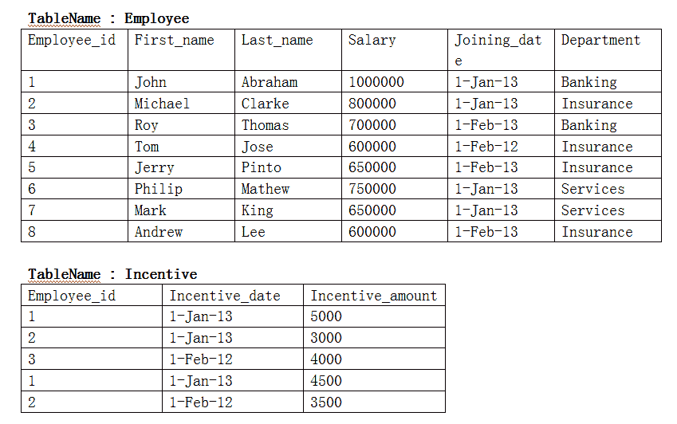
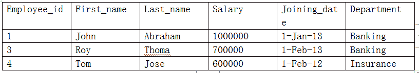
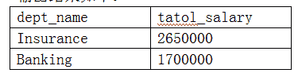
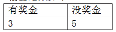

# 货拉拉 2018 秋招大数据中心笔试题

## 1

各观察值均加（或减）同一数后（）

正确答案: B   你的答案: 空 (错误)

```cpp
均值不变，标准差改变
```

```cpp
均值改变，标准差不变
```

```cpp
两者均不变
```

```cpp
两者均改变
```

本题知识点

大数据开发工程师 货拉拉 2018

## 2

为表示某地区男性年龄与薪水的关系，最佳的方式是通过绘制（）来表达

正确答案: C   你的答案: 空 (错误)

```cpp
柱状图
```

```cpp
对数折线图
```

```cpp
散点图
```

```cpp
箱线图
```

本题知识点

大数据开发工程师 货拉拉 2018

## 3

主成分分析（PCA）中各因子的关系是（）

正确答案: A   你的答案: 空 (错误)

```cpp
互相独立
```

```cpp
线性相关
```

```cpp
非线性相关
```

```cpp
都有可能
```

本题知识点

大数据开发工程师 货拉拉 2018

## 4

有 12 个外观一样的球，已知其中 11 个重量相等，1 个坏球和其他重量不等但不知轻重。现在提供一个天平，请问需要多少次称量才能找到坏球？如果是总数是 13 个球，又需要多少次（）

正确答案: A   你的答案: 空 (错误)

```cpp
3,3
```

```cpp
3,4
```

```cpp
4,4
```

```cpp
4,5
```

本题知识点

大数据开发工程师 货拉拉 2018

讨论

[刘成坤](https://www.nowcoder.com/profile/195344996)

从信息论的角度看，“12 个球中，某一个重量和其他的不相同”，该事件发生的概率为 1/12。坏球比好球的重量轻或者是重，该事件发生的概率为 1/2，为确定哪一个是坏球，即要消除两个事件的联合不确定性，由于二者是独立的，因此 I=log12+log2=log24bit。当用天平称量时，有三中可能，轻、相同、重，均为 1/3，因此，天平每次称量时消除的不确定性 为 log3bit。因此，称量的次数为   (log12+log2）/log3=2.9 此所以需要三次即可

发表于 2019-11-04 11:17:35

* * *

[zxcv0112358](https://www.nowcoder.com/profile/473856205)


选择 A

编辑于 2020-06-17 13:57:13

* * *

[阳大龙](https://www.nowcoder.com/profile/518027884)

B
13 个球还是要准确找到那个球的话必须要加一次，因为不知道轻重

发表于 2019-10-28 17:30:37

* * *

## 5

一个家庭有两个小孩，其中一个是女孩，问另一个也是女孩的概率（假定生男生女概率一样）,并写出计算过程。

你的答案

本题知识点

大数据开发工程师 货拉拉 2018

讨论

[零葬](https://www.nowcoder.com/profile/75718849)

根据古典概型，写出所有的事件 A:(男,女)B:(女,男)C:(女,女)D:(男,男)其中一个是女孩有 A,B,C 三个事件满足，而另一个也是女孩仅有事件 C 满足，因此概率 P=1/3

发表于 2021-01-12 19:18:48

* * *

[YoonG201909290031429](https://www.nowcoder.com/profile/503391180)

1/2

发表于 2019-11-02 16:39:12

* * *

## 6

不限定语言，写一个函数，输入 n 输出斐波那契数列的第 n 项。

你的答案

本题知识点

大数据开发工程师 货拉拉 2018

讨论

[零葬](https://www.nowcoder.com/profile/75718849)

```cpp
public class Solution {
    public int Fibonacci(int n) {
        if(n == 0) return 0;
        if(n == 1) return 1;
        return Fibonacci(n - 1) + Fibonacci(n - 2);
    }
}
```

 ```cpp
class Solution:
    def Fibonacci(self, n):
        # write code here
        p, q, r = 0, 1, 1
        if n == 0:
            return p
        if n == 1:
            return q
        for i in range(1, n):
            r = p + q
            p = q
            q = r
        return r
``` 

发表于 2021-01-12 19:21:00

* * *

[MiffyW](https://www.nowcoder.com/profile/536798321)

def get_number(n:int):    if n<=0:        return false    if n==1:        return 0    if n==2:        return 1    if n>=3:        return get_number(n-1)+get_number(n-2)

发表于 2019-11-07 20:47:50

* * *

[乾殇](https://www.nowcoder.com/profile/717759684)

C++（这是暴力版本，要矩阵快速幂的私信窝）

```cpp
inline int F(int n){
	int a=1,b=1,c;
	if (n<=2) return 1;
	for (int i=3;i<=n;i++){
		c=a+b;
		a=b;
		b=c;
	}return c;
} 
```

发表于 2019-10-31 17:00:39

* * *

## 7

缺失值有哪几种类型？一般缺失值有哪些处理方法？

你的答案

本题知识点

大数据开发工程师 货拉拉 2018

讨论

[零葬](https://www.nowcoder.com/profile/75718849)

类型：完全随机缺失，随机缺失，非随机缺失处理方法：1.直接删除含有缺失值的数据，由于数据收集不易，如果不是该条数据缺失很多特征，一般不采取这种方式 2.填充缺失值：(1) 总体均值填充（仅适用于连续型变量）(2) 同类均值填充（仅适用于连续型变量）(3) 总体中值填充（仅适用于连续型变量）(4) 同类中值填充（仅适用于连续型变量）(5) 众数填充(6) 指定值填充(7) 总体随机值填充(8) 同类随机值填充(9) 通过模型进行预测：选择几个相关变量，以目标变量为 label 建立模型进行监督学习，然后用模型预测缺失

发表于 2021-01-13 20:55:48

* * *

[修涯](https://www.nowcoder.com/profile/677978125)

类型：完全随机缺失，随机缺失，非随机缺失处理方法：

1.  删除含有缺失值的个案
2.  可能值插补缺失值

    (1)均值插补

    (2)利用同类均值插补。

    (3)极大似然估计（Max Likelihood ,ML）

    (4)多重插补（Multiple Imputation，MI）

发表于 2019-10-17 19:18:44

* * *

## 8

请列举 3 个你学习大数据及数据分析相关知识技能的网站/APP/论坛/博客。

你的答案

本题知识点

大数据开发工程师 货拉拉 2018

讨论

[牛客 356566423 号](https://www.nowcoder.com/profile/356566423)

b 站知乎人人都是产品经理

发表于 2021-04-14 17:31:13

* * *

[零葬](https://www.nowcoder.com/profile/75718849)

b 站、网易云课堂、腾讯课堂、leetcode、牛客网、阿里天池、博客园、CSDN

发表于 2021-01-13 21:12:19

* * *

[bjyx0905](https://www.nowcoder.com/profile/126246838)

哔哩哔哩知乎人人都是产品经理书籍微信公众号

发表于 2020-09-03 22:14:24

* * *

## 9

如下为数据库的两张表，请根据各小题的输出结果，写出各小题的 sql 语句。
1）输出第一个名字（First_name）包含’o’的所有雇员信息。
输出结果如下：
**SQL:**

2）输出每月的总支出工资大于 1500000 的部门和对应的支出，按高到低排序。

输出结果如下：
**SQL:**

3）输出有奖金(Incentive)和没奖金的人数。

输出结果如下：


**SQL:**

你的答案

本题知识点

大数据开发工程师 货拉拉 2018

讨论

[零葬](https://www.nowcoder.com/profile/75718849)

```cpp
select * from Employee where First_name like '%o%';
```

```cpp

	select

	    dept,

	    sum(total_salary) as total_salary

	from (

	    select

	        b.dept,

	        month(date) as mon,

	        sum(salary) as total_salary

	    from incentive a

	    join employees b on a.emp_id=b.emp_id

	    group by

	    b.dept,

	    month(date)

	    having avg(salary) > 15000000

	) t

	group by dept;

```

```cpp
select
    sum(case when Incentive_amount is not null then 1 else 0 end) as 有奖金,
    sum(case when Incentive_amount is null then 1 else 0 end) as 没奖金
from Employees
left join (select distinct Employee_id, Incentive_amount from Incentive) temp 
on Employees.Employee_id=temp.Employee_id;
```

编辑于 2021-01-14 11:00:23

* * *

[sichengLv](https://www.nowcoder.com/profile/253572)

```cpp
1. 输出第一个名字（First_name）包含’o’的所有雇员信息。
SELECT * FROM employees WHERE first_name LIKE '%o%';
或者
SELECT * FROM employees WHERE locate('o', first_name) > 0;

2. 输出每月的总支出工资大于 1500000 的部门和对应的支出，按高到低排序。
SELECT
    dept,
    SUM(total_amt) AS total_amt
FROM (
-- 每月支出都要求大于 1500000
    SELECT
    b.dept,
    month(date) AS mon,
    SUM(amount) AS total_amt
    FROM incentive a
    JOIN employees b ON a.emp_id = b.emp_id
    GROUP BY
    b.dept,
    month(date)
    HAVING AVG(amount) > 15000000
) t
GROUP BY dept
;

3. 输出有奖金(Incentive)和没奖金的人数。
SELECT
    SUM(IF(b.emp_id IS NOT NULL, 1, 0)) AS `有奖金`,
    SUM(IF(b.emp_id IS NOT NULL, 0, 1)) AS `没奖金`
FROM employees a
LEFT JOIN (
    SELECT emp_id FROM incentive GROUP BY emp_id
) b ON a.emp_id = b.emp_id
;

```

 发表于 2020-07-05 18:40:04

* * *

[lbjmessi](https://www.nowcoder.com/profile/885366902)

select sum(case when m.iid is not null then 1 else 0 end) '有奖金',  sum(case when m.iid is null then 1 else 0 end) '无奖金'from 
(select distinct e.employee_id eid, e.First_name, i.employee_id iid from employee e 
left join incentive i on e.employee_id = i.employee_id) m;

发表于 2019-11-08 15:39:56

* * *

## 10

开放式讨论：

1）以某电商公司为例，请列出，你认为该电商公司 CEO 最关心的 3 个业务指标。

2）以该电商公司为例，请设计指标来描述用户流失，并构建一个预警模型。

3）以该电商公司为例，如果发现某一周订单量有较大的下降，如何定位下降原因，请给出具体的分析思路和步骤，并举实例。

你的答案

本题知识点

大数据开发工程师 货拉拉 2018

讨论

[牛客 716417888 号](https://www.nowcoder.com/profile/716417888)

黏性 活跃 产出

发表于 2020-08-26 20:53:45

* * *

## 11

对一个数据集，有以下 4 种定义：

TP：预测为正，实际为正；

FP：预测为正，实际为负；

TN：预测为负，实际为负；

FN：预测为负，实际为正；

请写出准确率 P 和召回率 R 的公式。

你的答案

本题知识点

大数据开发工程师 货拉拉 2018

讨论

[gogi 原来是圆脸](https://www.nowcoder.com/profile/34448859)

准确率 = （TP+TN）/(TP+FP+TN+FN)召回率= TP/(TP+FN)

发表于 2020-07-30 09:29:54

* * *

[MiffyW](https://www.nowcoder.com/profile/536798321)

P = TP/(TP+FP)R = TP/(TP+FN)

发表于 2019-11-07 20:51:15

* * *

[零葬](https://www.nowcoder.com/profile/75718849)

P = TP/(TP + FP)R = TP/(TP + FN)

发表于 2021-01-13 20:56:37

* * *

## 12

有两个罐子，50 个红球和 50 个白球。将球全部放到两个罐子中，请问如何放使得随机从一个罐子中选一个球是红色概率最大？此时取出红球的概率为多少？

你的答案

本题知识点

大数据开发工程师 货拉拉 2018

讨论

[Elio201907182116619](https://www.nowcoder.com/profile/335356339)

一个罐子放一个红球，另一个罐子放其余全部球。P = 1/2 * 1 + 1/2 * 49/99   = 74/99

发表于 2019-10-27 18:55:34

* * *