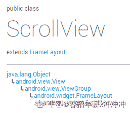

# 货拉拉 2018 秋招 Android 工程师笔试题卷二（B）

## 1

在 Activity 中，如何获取 service 对象（）

正确答案: A   你的答案: 空 (错误)

```cpp
可以通过直接实例化得到
```

```cpp
可以通过绑定得到。
```

```cpp
通过 startService()
```

```cpp
通过 getService()获取。
```

本题知识点

安卓工程师 货拉拉 2018

## 2

进程 a 读取 b 进程中的某个变量（非共享内存），可行的方式有（）

正确答案: A B   你的答案: 空 (错误)

```cpp
b 进程向消息队列写入一个包含变量内容的消息，a 进程从队列中读出
```

```cpp
通过本地环路通信
```

```cpp
如果 a、b 非亲属，那么 a 通过命名管道把这个变量的地址发给 b 进程
```

```cpp
如果 b 是 a 进程的子进程，那么 b 直接读取变量内容即可
```

本题知识点

安卓工程师 货拉拉 2018

## 3

Android 是如何组织 Activity 的（）

正确答案: A   你的答案: 空 (错误)

```cpp
以栈的方式组织 Activity
```

```cpp
以队列的方式组织 Activity
```

```cpp
以树形方式组织 Activity
```

```cpp
以链式方式组织 Activity。
```

本题知识点

安卓工程师 货拉拉 2018

讨论

[没有出口的迷宫](https://www.nowcoder.com/profile/101444365)

一个应用可以有多个 Activity 任务栈。Activity 入栈和出栈的方式有标准（总是新建一个和退出一个）、单顶（顶端不重复新建）、单任务（退栈直接退到目标位置）、单例（独占任务栈）

发表于 2020-09-17 18:29:53

* * *

## 4

onPause 什么时候调用（）

正确答案: C   你的答案: 空 (错误)

```cpp
当界面启动时
```

```cpp
当 onCreate 方法被执行之后
```

```cpp
当界面被隐藏时
```

```cpp
当界面重新显示时
```

本题知识点

安卓工程师 货拉拉 2018

## 5

ScrollView 中，可以直接包含多少个组件（）

正确答案: C   你的答案: 空 (错误)

```cpp
三个
```

```cpp
两个
```

```cpp
一个
```

```cpp
无数个
```

本题知识点

安卓工程师 货拉拉 2018 Android

讨论

[Kaitle](https://www.nowcoder.com/profile/2213693)

ScrollView 只能添加一个子控件，如果添加了多个子控件，则会出现“ScrollView can host only one direct child”异常

发表于 2020-08-21 17:29:14

* * *

[春招年薪 x 冲冲冲](https://www.nowcoder.com/profile/805190040)

本节带来的是 Android 基本 UI 控件中的第十个：**ScrollView**(滚动条)，或者我们应该叫他 竖直滚动条，对应的另外一个水平方向上的滚动条：**HorizontalScrollView**，先来一发官方文档 的链接：[ScrollView](http://androiddoc.qiniudn.com/reference/android/widget/ScrollView.html.com/reference/android/widget/ScrollView.html)，我们可以看到类的结构如下：



嘿嘿，原来是一个 FrameLayout 的容器，不过在他的基础上添加了滚动，允许显示的比实际多的内容！

另外，只能够往里面放置**一个子元素**，可以是单一的组件，又或者一个布局包裹着的复杂的层次结构！

一般对于可能显示不完的情况，我们可以直接在布局的外层套上一个: ScrollView 或者 HorizontalScrollView！就这么简单~！

 发表于 2021-02-04 19:59:53

* * *

[学无止境 2021 加油！](https://www.nowcoder.com/profile/331149976)

Scroll view 的子元素只能有一个

发表于 2021-03-09 11:43:28

* * *

## 6

Matrix 类的作用（）

正确答案: A   你的答案: 空 (错误)

```cpp
可以存储缩小或放大比列
```

```cpp
存储文件中的图片信息
```

```cpp
存储资源中的图片信息
```

```cpp
存储内存中的图片信息
```

本题知识点

安卓工程师 货拉拉 2018

## 7

关于 Activity 说的法不正确的是（）

正确答案: C   你的答案: 空 (错误)

```cpp
Activity 是为用户操作而展示的可视化用户界面
```

```cpp
一个应用程序可以有若干个 Activity
```

```cpp
Activity 可以通过一个别名去访问
```

```cpp
Activity 可以表现为一个漂浮的窗口
```

本题知识点

安卓工程师 货拉拉 2018

## 8

下面有关数据库索引的描述正确的是（）

正确答案: B   你的答案: 空 (错误)

```cpp
建立索引以后，原来的数据库表文件中记录的物理顺序将被改变
```

```cpp
创建索引是创建一个指向数据库表文件记录的指针构成的文件
```

```cpp
索引与数据库表的数据存储在一个文件中
```

```cpp
使用索引并不能加快对表的查询操作
```

本题知识点

安卓工程师 货拉拉 2018

## 9

在使用 SQLiteOpenHelper 这个类时，它的哪一个方法是用来实现版本升级之用的（）

正确答案: A   你的答案: 空 (错误)

```cpp
OnUpgrade（）
```

```cpp
onCreade（）
```

```cpp
onUpdate（）
```

```cpp
onCreate（）
```

本题知识点

安卓工程师 货拉拉 2018

## 10

小组赛，每个小组有 5 支队伍，互相之间打单循环赛，胜一场 3 分，平一场 1 分，输一场不得分，小组前三名出线。平分抽签。问一个队最少拿 1 分就有理论上的出线希望

你的答案 (错误)

1 参考答案 (1) 2

本题知识点

安卓工程师 货拉拉 Java 工程师 2018

讨论

[HXma12138](https://www.nowcoder.com/profile/4790764)

其中三支队互相打平手，且都输给另外两只队，三支队都得 2 分，平分抽签三支队的任意支队都可能出线。

发表于 2019-11-07 11:50:01

* * *

## 11

假设系统中有 5 台设备，有多个进程需要使用 2 个设备，假定每个进程一次只能使用一台，则至多允许 1 个进程来竞争这 5 个资源，而不会发生死锁？

你的答案 (错误)

1 参考答案 (1) 4

本题知识点

安卓工程师 货拉拉 Java 工程师 2018

讨论

[bukun](https://www.nowcoder.com/profile/514169517)

p*(m-1)+1<=r

发表于 2020-09-10 22:37:25

* * *

[love_truth](https://www.nowcoder.com/profile/259223425)

哲学家就餐问题，把筷子变成了设备。 
若有 5 个进程，那么每个进程分配一个设备时，无法满足条件发生死锁， 
若有 4 个进程，每个进程分配一个设备，还剩一个设备，必然有一个进程申请到了 2 个设备，利用完之后释放，不会发生死锁。

发表于 2019-11-15 09:29:24

* * *

## 12

给定学生、课程、成绩的数据库表，写一个 sql 语句求出每门课程的平均分。1

```cpp
学生表 student：student_id、student_name
课程表 course：course_id、course_name
成绩表 score：student_id、course_id、score
```

你的答案 (错误)

1 参考答案 (1) SELECT AVG(score) FROM course GROUP BY course_id;

本题知识点

安卓工程师 货拉拉 2018

讨论

[小马要进步](https://www.nowcoder.com/profile/337343824)

select course_name,avg(score)from score a left join course bon a.course_id = b.course_id group by course_id,course_name

发表于 2020-09-19 08:39:12

* * *

## 13

service 的启动方法有 1 和 2

你的答案 (错误)

12 参考答案 (1) startService
(2) bindService

本题知识点

安卓工程师 货拉拉 2018

讨论

[落地请打代码](https://www.nowcoder.com/profile/524987880)

写反了就***的不对了

发表于 2019-11-30 15:29:18

* * *

[Sohn](https://www.nowcoder.com/profile/721436736)

加个括号就错了，我去

发表于 2019-11-01 21:00:48

* * *

## 14

Activity 的生命周期会回调哪些方法 1，2，3，4，5，6

你的答案 (错误)

123456 参考答案 (1) onCreate
(2) onStart
(3) onResume
(4) onPause
(5) onStop
(6) onDestroy

本题知识点

安卓工程师 货拉拉 2018

讨论

[Primer___](https://www.nowcoder.com/profile/3039649)

全加括号了(/心塞)

发表于 2019-11-19 11:06:58

* * *

[深藏冷瞳](https://www.nowcoder.com/profile/771401651)

(1) onCreate
(2) onStart
(3) onResume
(4) onPause
(5) onStop
(6) onDestroy- - 记住别加括号（加了算错）

发表于 2019-10-23 20:38:01

* * *

## 15

Handler，message，Looper，MessageQueue 之间的是如何协同工作的？。

你的答案

本题知识点

安卓工程师 货拉拉 2018

## 16

货拉拉“拉货节”上设置了一个抽奖游戏，游戏在一个 7*8 的棋盘上进行，上面放着 56 个价值不等的礼物，每个小的棋盘上面放置着一个礼物，游戏者需要从左上角开始游戏，每次只能向下或者向右移动一步，到达右下角停止，一路上的格子里的礼物他都能拿到，请设计一个算法使得游戏者拿到价值最高的礼物。

给定一个 7*8 的矩阵 board，其中每个元素为对应格子的礼物价值,左上角为[0,0],请返回能获得的最大价值，保证每个礼物价值大于 100 小于 1000。

你的答案

本题知识点

安卓工程师 货拉拉 2018