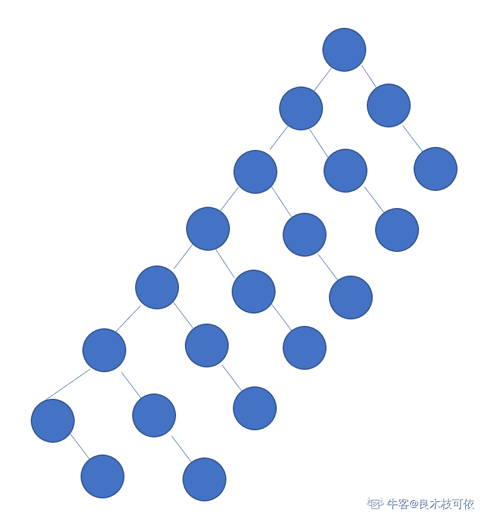

# 货拉拉 2018 秋招 Android 工程师笔试题卷三（B）

## 1

关于 Intent 对象说法错误的是（）

正确答案: D   你的答案: 空 (错误)

```cpp
在 android 中，Intent 对象是用来传递信息
```

```cpp
Intent 对象可以把值传递给广播或 Activity
```

```cpp
利用 Intent 传值时，可以传递一部分值类型
```

```cpp
利用 Intent 传值时，它的 key 值可以是对象
```

本题知识点

安卓工程师 货拉拉 2018

## 2

Android 项目工程下面的 assets 目录的作用是什么（）

正确答案: B   你的答案: 空 (错误)

```cpp
放置应用到的图片资源
```

```cpp
主要放置一些文件资源,这些文件会被原封不动打包到 apk 里面
```

```cpp
放置字符串，颜色，数组等常量数据 res/values
```

```cpp
放置一些与 UI 相应的布局文件，都是 xml 文件 res/layout
```

本题知识点

安卓工程师 货拉拉 2018

## 3

Android 开发中常用的开发与调试工具有很多，下面相关描述不对的是（）

正确答案: A   你的答案: 空 (错误)

```cpp
Android Debug Bridge，简称 adb，它只是一个能用来调试 Android 应 用程序的工具。
```

```cpp
DDMS 的全称是 Dalvik Debug Monitor Service，是 Android 开发环境 中的 Dalvik 虚拟机调试监控服务。
```

```cpp
LogCat 日志记录工具，这个工具很常用，可以理解为 C 或 Java 程序中 的控制台输出，常被用来在手写代码的调试方式中，输出调试信息。
```

```cpp
SDK 的管理器，使用自动更新的方式从 Google 服务器中下载最新的 SDK 版本及工具到本机。
```

本题知识点

安卓工程师 货拉拉 2018

讨论

[深藏冷瞳](https://www.nowcoder.com/profile/771401651)

```cpp
Android 调试桥 (adb) 是一种功能多样的命令行工具，可让您与设备进行通信。adb 命令便于执行各种设备操作（例如安装和调试应用）
，并提供对 Unix shell（可用来在设备上运行各种命令）的访问权限。它是一种客户端-服务器程序，包括以下三个组件：  - 客户端：用于发送命令。客户端在开发计算机上运行。您可以通过发出 adb 命令从命令行终端调用客户端。  - 守护进程 (adbd)：在设备上运行命令。守护进程在每个设备上作为后台进程运行。  - 服务器：管理客户端和守护进程之间的通信。服务器在开发计算机上作为后台进程运行。  adb 包含在 Android SDK 平台工具软件包中。您可以使用 SDK 管理器下载此软件包，
管理器会将此软件包安装在 android_sdk/platform-tools/。或者，如果您需要独立的 Android SDK 平台工具软件包，可以点击此处进行下载。  要了解如何连接设备以进行 adb 通信，包括如何使用 Connection Assistant 对常见问题进行排查，请参阅在硬件设备上运行应用。 

来自谷歌 
```

发表于 2019-10-23 20:17:00

* * *

## 4

下面说法错误的是（）

正确答案: B   你的答案: 空 (错误)

```cpp
Activity Manager（活动管理器）管理各个应用程序生命周期以及通常的导航回退功能。
```

```cpp
Window Manager（窗口管理器）管理所有的移动设备窗口功能。
```

```cpp
Content Provider（内容提供器）使得不同应用程序之间存取或者分享数据。
```

```cpp
View System（视图系统）构建应用程序的基本组件。
```

本题知识点

安卓工程师 货拉拉 2018

## 5

以下关于内存泄漏说法正确的是（）

正确答案: C   你的答案: 空 (错误)

```cpp
内存泄漏是操作系统内存管理出错导致的问题
```

```cpp
单线程程序不可能内存泄漏
```

```cpp
如果一个进程在运行过程中占用的内存无限制上升，那么该进程有内存泄漏
```

```cpp
只要进程在退出之前释放了所有分配的内存，那么就不会内存泄漏
```

```cpp
内存泄漏是仅仅出现在 C/C++程序的问题，Java 程序不会内存泄漏
```

本题知识点

安卓工程师 货拉拉 Java 工程师 iOS 工程师 2018

讨论

[、、20191009173366](https://www.nowcoder.com/profile/714743719)

| A，内存泄露是程序设计的 bug，不是操作系统的问题 B，内存泄露跟线程数无关
C，内存泄露是进程申请了内存却没有释放。导致占用内存无限上升
D，进程退出之前释放申请的内存，不代表进程运行过程中没有内存泄***r /> E，java 是自动管理内存的，但是也会有内存泄露，比如加入 HashMap 的对象 hash 值改变了就无法从 HashMap 中 remove，这就造成了内存泄露      |

发表于 2019-10-29 17:33:22

* * *

[改过行善](https://www.nowcoder.com/profile/4691042)

内存无限上升不是叫做内存溢出吗？

发表于 2019-10-21 14:48:34

* * *

[ChrisChen98](https://www.nowcoder.com/profile/195463291)

在计算机科学中，**内存泄漏**指由于疏忽或错误造成程序未能释放已经不再使用的内存。内存泄漏并非指内存在物理上的消失，而是应用程序分配某段内存后，由于设计错误，导致在释放该段内存之前就失去了对该段内存的控制，从而造成了内存的浪费。

发表于 2019-10-21 17:22:29

* * *

## 6

一棵二叉树有 7 个度为 1 的结点，6 个度为 2 的结点，则该二叉树共有个多少个结点（）

正确答案: A   你的答案: 空 (错误)

```cpp
２０
```

```cpp
１７
```

```cpp
２５
```

```cpp
３１
```

本题知识点

安卓工程师 货拉拉 Java 工程师 iOS 工程师 2018

讨论

[呆吖呆 yu](https://www.nowcoder.com/profile/940767442)

总结点个数=总分枝数目+1 7*1+6*2+1=20

发表于 2019-10-14 15:01:25

* * *

[-ZENGZENG](https://www.nowcoder.com/profile/550026077)

总结点 n=n0+n1+n2;

n0=n2+1;

n=n1+2n2+1;

n= 7+ 2*6 +1= 20

发表于 2019-10-22 11:12:03

* * *

[良木 66](https://www.nowcoder.com/profile/95038880)

20

发表于 2019-11-11 12:41:40

* * *

## 7

当 Activity 被消毁时，如何保存它原来的状态（）

正确答案: C   你的答案: 空 (错误)

```cpp
实现 Activity 的 onInstanceState（）方法
```

```cpp
实现 Activity 的 onSaveInstance（）方法
```

```cpp
实现 Activity 的 onSaveInstanceState（）方法
```

```cpp
实现 Activity 的 onSaveState（）方法
```

本题知识点

安卓工程师 货拉拉 2018

讨论

[嗯哼苏苏](https://www.nowcoder.com/profile/611914025)

被销毁后要保存原来的状态，可以覆写 activity 的 onSaveInstanceState 方法，该方法可接收一个 Bundle 类型的参数，将状态数据存储到 Bundle 中即可。

发表于 2019-10-29 12:56:26

* * *

## 8

下列不属于 android 布局的是（）

正确答案: C   你的答案: 空 (错误)

```cpp
FrameLayout
```

```cpp
LinearLayout
```

```cpp
BorderLayout
```

```cpp
TableLayout
```

```cpp
RelativeLayout
```

本题知识点

安卓工程师 货拉拉 2018

## 9

下面关于 AndroidUI 框架描述的选项中有误的一项是（）

正确答案: C   你的答案: 空 (错误)

```cpp
Android 中所有的 UI（用户界面）元素都是使用 View 和 ViewGroup 对象建立的
```

```cpp
ViewGroup 是一个包含多个的 View 和 ViewGroup 的容器，用来定义 UI 布局
```

```cpp
ViewGroup 是一个可以将一些信息绘制在屏幕上并与用户产生交互的对象
```

```cpp
Android 使用 View 类作为界面开发的超类，所有的界面开发都与 View 有关
```

本题知识点

安卓工程师 货拉拉 2018

## 10

在数据库系统中，产生不一致的根本原因是（）

正确答案: C D   你的答案: 空 (错误)

```cpp
数据存储量太大
```

```cpp
未对数据进行完整性控制
```

```cpp
并发控制不当
```

```cpp
数据冗余
```

本题知识点

安卓工程师 货拉拉 2018

## 11

你有 8 个一样大小的球，其中 7 个的重量是一样的，另一个比较重。用天平将那个重一些的球找出来，至少需要 1 次

你的答案 (错误)

1 参考答案 (1) 2

本题知识点

安卓工程师 货拉拉 Java 工程师 iOS 工程师 2018

讨论

[莫******。](https://www.nowcoder.com/profile/456763647)

把 8 个小球分成 3，3，2 三份，第一次测量 3 和 3 两份一 .若两份不等重，可直接判断重的球在哪一份中，再将 3 个球分成 3 份，再测量一次即可得出二.若两份等重，则重的球在余下的 2 个球中，测量一次找出

发表于 2019-10-15 09:37:05

* * *

[Nia_yu](https://www.nowcoder.com/profile/356621960)

通解：n 个东西，若 3^(a-1)<n<=3^a 则答案为 a

发表于 2019-10-17 15:24:06

* * *

[张牧之吖](https://www.nowcoder.com/profile/921063738)

两个球不相等那直接就能看出来哪个更重了，所以按逻辑来说，最少就一次就足够了

发表于 2019-10-18 20:58:49

* * *

## 12

现有如下任务需要安排在若干机器上并行完成，每个任务都有开始时间和结束时间（开始和结束时间都包括在任务执行时间内）的要求

```cpp
任务名称      开始时间     结束时间
a         　　　 1       7
b         　　　 8       9
c         　　　 2       5
d         　　　 7      11
e          　　　3       6
f         　　　 7        9
g          　　　10      13
```

则最少需要使用的机器数目为 1

你的答案 (错误)

1 参考答案 (1) 3

本题知识点

安卓工程师 货拉拉 Java 工程师 iOS 工程师 2018

讨论

[向天再借五百斤](https://www.nowcoder.com/profile/471027334)

1-7 这段时间内有 a，c，e，三个任务，故 1-7 需要三台机器，7-9 有 b，d，f，9-13 有 g 和 d，可得出至少需要三台机器，但我的答案 3 是错的，应该是(1) ３

发表于 2019-10-15 11:40:19

* * *

[段思维](https://www.nowcoder.com/profile/4305751)

第一个机器 1~7 8~9 10~13 第二个机器 2~5 7~9 第三个机器 3~6 7~11 由于时间不能冲突，所以最少三个机器

发表于 2019-10-15 11:33:36

* * *

[Bangser](https://www.nowcoder.com/profile/180020855)

有木有大佬给分析分析

发表于 2019-10-15 09:18:37

* * *

## 13

service 的启动方法有 1 和 2

你的答案 (错误)

12 参考答案 (1) startService
(2) bindService

本题知识点

安卓工程师 货拉拉 2018

讨论

[落地请打代码](https://www.nowcoder.com/profile/524987880)

写反了就***的不对了

发表于 2019-11-30 15:29:18

* * *

[Sohn](https://www.nowcoder.com/profile/721436736)

加个括号就错了，我去

发表于 2019-11-01 21:00:48

* * *

## 14

Activity 的生命周期会回调哪些方法 1，2，3，4，5，6

你的答案 (错误)

123456 参考答案 (1) onCreate
(2) onStart
(3) onResume
(4) onPause
(5) onStop
(6) onDestroy

本题知识点

安卓工程师 货拉拉 2018

讨论

[Primer___](https://www.nowcoder.com/profile/3039649)

全加括号了(/心塞)

发表于 2019-11-19 11:06:58

* * *

[深藏冷瞳](https://www.nowcoder.com/profile/771401651)

(1) onCreate
(2) onStart
(3) onResume
(4) onPause
(5) onStop
(6) onDestroy- - 记住别加括号（加了算错）

发表于 2019-10-23 20:38:01

* * *

## 15

这里有两个表，请用 SQL 语句查询年龄小于平均年龄的作者姓名(name)，图书名(name)，出版社(press)。

```cpp
图书表 book：id, name, author_id, press, publish_date
作者表 author：id, name, age, sex
```

你的答案

本题知识点

安卓工程师 货拉拉 iOS 工程师 2018

讨论

[zhenchaochaochao](https://www.nowcoder.com/profile/779483920)

图书表 book：id, name, author_id, press, publish_date 作者表 author：id, name, age, sex 查询年龄小于平均年龄的作者姓名(name)，图书名(name)，出版社(press)。
SELECT  a.name as "author name", b.name  as "book name", b.press FROM author AS a INNER JOIN book AS bON a.id=b.author_idWHERE a.age<mean(a.age)

发表于 2019-11-25 05:54:13

* * *

## 16

ANR 产生的原因及解决方法？

你的答案

本题知识点

安卓工程师 货拉拉 2018