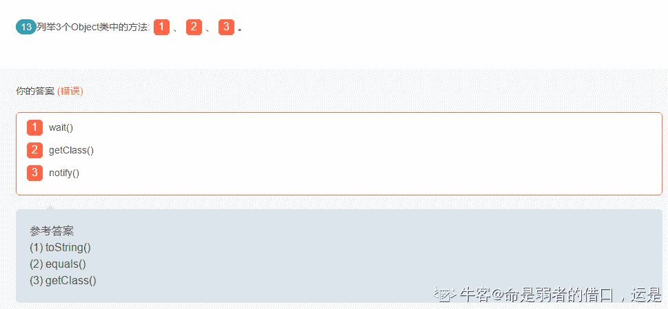

# 货拉拉 2018 秋招 java 工程师笔试题卷一（B）

## 1

以下对于抽象类和接口的描述哪个是错误的（）

正确答案: B   你的答案: 空 (错误)

```cpp
抽象类可以在不提供接口方法实现的情况下实现接口
```

```cpp
接口是绝对抽象的，不可以被实例化。抽象类可以被实例化
```

```cpp
接口所有的方法隐含的都是抽象的,而抽象类则可以同时包含抽象和非抽象的方法
```

```cpp
类可以实现很多个接口，但是只能继承一个抽象类
```

本题知识点

Java 工程师 货拉拉 2018

## 2

下列关于修饰符混用的说法，错误的是（）

正确答案: B   你的答案: 空 (错误)

```cpp
abstract 方法必须在 abstract 类或接口中
```

```cpp
static 方法中能直接处理非 static 的属性
```

```cpp
abstract 不能与 final 并列修饰同一个类
```

```cpp
abstract 类中不建议有 private 的成员
```

本题知识点

Java 工程师 货拉拉 2018

讨论

[萌哒哒汉子](https://www.nowcoder.com/profile/5776456)

被 static 修饰的，都是跟随类的加载而加载，优先于对象存在，所以静态不能调用非静态，但是，对象是后于类，所以非静态可以调用静态

发表于 2019-11-07 08:34:39

* * *

## 3

以下 Java 程序运行的结果是: （）

```cpp
public class Tester{
public static void main(String[] args){
   Integer var1=new Integer(1);
   Integer var2=var1;
   doSomething(var2);
   System.out.print(var1.intValue());
   System.out.print(var1==var2);
}
public static void doSomething(Integer integer){
    integer=new Integer(2);
  }
}

```

正确答案: C   你的答案: 空 (错误)

```cpp
1false
```

```cpp
2false
```

```cpp
1true
```

```cpp
2true
```

本题知识点

Java 工程师 货拉拉 2018

讨论

[打酱油 de 程序员](https://www.nowcoder.com/profile/373947281)

Integer var1=new Integer(1);   Integer var2=var1;将 var1 内存地址的副本给了 var2，两个副本是一样的

发表于 2019-10-22 15:15:01

* * *

## 4

以下关于异常的描述错误的是（）

正确答案: A   你的答案: 空 (错误)

```cpp
throw 关键字可以在方法上声明该方法要抛出的异常
```

```cpp
try 是用于检测被包住的语句块是否出现异常，如果有异常，则抛出异常，并执行 catch 语句。
```

```cpp
RuntimeException：可以不使用 try...catch 进行处理，但是如果有异常产生，则异常将由 JVM 进行处理。
```

```cpp
finally 语句块是不管有没有出现异常都要执行的内容。
```

本题知识点

Java 工程师 货拉拉 2018

讨论

[王阿甘](https://www.nowcoder.com/profile/276429428)

throw 用来抛出一个异常，在方法体内。语法格式为：throw 异常对象

发表于 2019-10-18 00:07:42

* * *

## 5

多线程中栈与堆是公有的还是私有的（）

正确答案: A   你的答案: 空 (错误)

```cpp
栈私有, 堆公有
```

```cpp
栈私有，堆私有
```

```cpp
栈公有, 堆私有
```

```cpp
栈公有，堆公有
```

本题知识点

Java 工程师 货拉拉 2018

讨论

[水漫「心」城](https://www.nowcoder.com/profile/3949274)

在多线程环境下，每个线程拥有一个栈和一个程序计数器。栈和程序计数器用来保存线程的执行历史和线程的执行状态，是线程私有的资源。其他的资源（比如堆、地址空间、全局变量）是由同一个进程内的多个线程共享。

发表于 2019-11-05 09:36:03

* * *

## 6

下面的描述哪一个是正确的（）

正确答案: A   你的答案: 空 (错误)

```cpp
当线程调用了对象的 wait()、notify()、notifyAll()、需要先获得对象的锁。
```

```cpp
wait()、notify()、notifyAll()执行完成后会自动释放锁
```

```cpp
当线程的 interrupt()方法被调用时，线程马上中断。
```

```cpp
当线程调用了 sleep(1000)，线程睡眠 1 秒后可以不通过 cpu 调度马上往下执行。
```

本题知识点

Java 工程师 货拉拉 2018

讨论

[咱啥也不会啊](https://www.nowcoder.com/profile/677592755)

wait 方法返回的前提是获得了调用对象的锁，而 notify 和 notifyAll 都要调用 wait 对对象。

发表于 2019-11-08 11:28:26

* * *

## 7

找出以下关于 float 的不正确的声明（）

正确答案: D   你的答案: 空 (错误)

```cpp
float foo=2.02f;
```

```cpp
float foo=0x0123;
```

```cpp
float foo=-1;
```

```cpp
float foo=1.0;
```

本题知识点

Java 工程师 货拉拉 2018

讨论

[丶 smarter](https://www.nowcoder.com/profile/38083919)

1.0 默认是 double，需要强转

发表于 2019-10-23 14:03:00

* * *

## 8

已知一棵二叉树的前序遍历为 CABEFDHG，中序遍历为 BAFECHD

正确答案: D   你的答案: 空 (错误)

```cpp
BEFACHDG
```

```cpp
BEFAHGDC
```

```cpp
BFEACHDG
```

```cpp
BFEAHGDC
```

本题知识点

Java 工程师 货拉拉 2018

## 9

某公司有数据库,其中有一个表包含几十万个数据,但用户报怨说查询速度太慢，下面哪种方法能提高的查询速度？()

 正确答案: A   你的答案: 空 (错误)

```cpp
建立聚集索引和非聚集索引
```

```cpp
为该表创建外键
```

```cpp
收缩数据库
```

```cpp
减少数据占用空间
```

本题知识点

Java 工程师 货拉拉 2018

## 10

关于线程的特点，描述不正确的是（）

正确答案: B C   你的答案: 空 (错误)

```cpp
线程不能够独立执行，必须依存在应用程序中，由应用程序提供多个线程执行控制
```

```cpp
不同的线程共享相同的栈空间
```

```cpp
线程有自己独立的地址空间
```

```cpp
线程间切换比进程间切换花费的时间短
```

本题知识点

Java 工程师 货拉拉 2018

讨论

[牛客 279370402 号](https://www.nowcoder.com/profile/279370402)

线程没有独立的地址空间，它使用相同的地址空间共享数据

发表于 2020-05-27 15:58:07

* * *

## 11

一群人开舞会，每人头上都戴着一顶帽子。帽子只有黑白两种，黑的至少有一顶。每个人都能看到其它人帽子的颜色，却看不到自己的。主持人先让大家看看别人头上戴的是什幺帽子，然后关灯，如果有人认为自己戴的是黑帽子，就打自己一个耳光。第一次关灯，没有声音。于是再开灯，大家再看一遍，关灯时仍然鸦雀无声。一直到第四次关灯，才有劈劈啪啪打耳光的声音响起。请问有多少人戴着黑帽子？1

你的答案 (错误)

1 参考答案 (1) 4

本题知识点

安卓工程师 货拉拉 Java 工程师 iOS 工程师 2018

讨论

[没 Offer 的渣本苦逼猿](https://www.nowcoder.com/profile/8666260)

假设：
① 有且只有 A 戴着黑帽，那么：
A 会如此思考：A 看到全场都是白帽，马上就意识到自己是黑帽，在[第一次](https://www.baidu.com/s?wd=%E7%AC%AC%E4%B8%80%E6%AC%A1&tn=SE_PcZhidaonwhc_ngpagmjz&rsv_dl=gh_pc_zhidao)关灯的时候就会打自己脸。
其它戴白帽的人会有如此思考：1.只有 A 是黑帽 2.只有我和 A 是黑帽 ；因为不确定，所以[第一次](https://www.baidu.com/s?wd=%E7%AC%AC%E4%B8%80%E6%AC%A1&tn=SE_PcZhidaonwhc_ngpagmjz&rsv_dl=gh_pc_zhidao)关灯不打自己脸，而这时候听到打脸声，就意识到只有 A 是黑帽，排除了情况 2.
得出推理①：当全场有且只有 1 顶黑帽时，[第一次](https://www.baidu.com/s?wd=%E7%AC%AC%E4%B8%80%E6%AC%A1&tn=SE_PcZhidaonwhc_ngpagmjz&rsv_dl=gh_pc_zhidao)关灯会响起打脸声。
② 有且只有 A 和 B 戴着黑帽，那么：
A 会如此思考：1.只有 B 是黑帽 2.只有我和 B 是黑帽 ；然而第一次关灯的时候没有打脸声，通过推理①可以否定只有 1 顶黑帽的情况，A 马上意识到自己也是黑帽，因此第二次关灯的时候回给自己耳光。
B 和 A 是同样的想法
其它戴白帽的人会有如此思考：1.只有 A 和 B 是黑帽 2.只有我和 A 和 B 是黑帽 ；第一次关灯不能确定，第二次关灯的时候听到了打脸声，代入 A、B 的思维就可以知道只有 A 和 B 是黑帽，排除了情况 2.
得出推理②：当全场有且只有 2 顶黑帽时，第二次关灯会响起打脸声。
③ 有且只有 A、B、C 戴着黑帽，那么：
A 会如此思考：1.只有 B、C 是黑帽 2.只有我和 B、C 是黑帽 ；然而第二次关灯的时候没有打脸声，通过推理②可以否定只有 2 顶黑帽的情况，A 马上意识到自己也是黑帽，因此第三次关灯的时候回给自己耳光。
B、C 和 A 是同样的想法
其它戴白帽的人会有如此思考：1.只有 A、B、C 是黑帽 2.只有我和 A、B、C 是黑帽 ；第一、二次关灯不能确定，第三次关灯的时候听到了打脸声，代入 A、B、C 的思维就可以知道只有 A、B、C 是黑帽，排除了情况 2.
得出推理③：当全场有且只有 3 顶黑帽时，第三次关灯会响起打脸声。

同理可以推得：有 n 个黑帽，就会在第 n 次关灯的时候响起打脸声。 源自 https://zhidao.baidu.com/question/981926145729484739.html

发表于 2019-10-19 15:24:23

* * *

## 12

有两个线程，最初 n=0，一个线程执行 n++; n++; 另一个执行 n+=2; 问，最后可能的 n 值？1

你的答案 (错误)

1 参考答案 (1) 2、3、4

本题知识点

安卓工程师 货拉拉 Java 工程师 iOS 工程师 2018

讨论

[牛客 279370402 号](https://www.nowcoder.com/profile/279370402)

你的答案 (错误)

1 2，3，4 参考答案 (1) 2、3、4

发表于 2020-05-27 15:59:05

* * *

[没 Offer 的渣本苦逼猿](https://www.nowcoder.com/profile/8666260)

这题有点毛病吧

发表于 2019-10-19 15:25:20

* * *

[友えがぉ筱糊子](https://www.nowcoder.com/profile/896182101)

难道不会有： 两个线程都没有执行吗? 0 的可能性也是有的吧! 那 1 的可能性呢?

发表于 2019-10-12 17:39:58

* * *

## 13

列举 3 个 Object 类中的方法:1、2、3。

你的答案 (错误)

123 参考答案 (1) toString()
(2) equals()
(3) getClass()

本题知识点

Java 工程师 货拉拉 2018

讨论

[Anxc 有人？](https://www.nowcoder.com/profile/6190954)

1.  [1. getClass 方法](https://fangjian0423.github.io/2016/03/12/java-Object-method/#getClass%E6%96%B9%E6%B3%95)
2.  [2. hashCode 方法](https://fangjian0423.github.io/2016/03/12/java-Object-method/#hashCode%E6%96%B9%E6%B3%95)
3.  [3. equals 方法](https://fangjian0423.github.io/2016/03/12/java-Object-method/#equals%E6%96%B9%E6%B3%95)
4.  [4. clone 方法](https://fangjian0423.github.io/2016/03/12/java-Object-method/#clone%E6%96%B9%E6%B3%95)
5.  [5. toString 方法](https://fangjian0423.github.io/2016/03/12/java-Object-method/#toString%E6%96%B9%E6%B3%95)
6.  [6. notify 方法](https://fangjian0423.github.io/2016/03/12/java-Object-method/#notify%E6%96%B9%E6%B3%95)
7.  [7. notifyAll 方法](https://fangjian0423.github.io/2016/03/12/java-Object-method/#notifyAll%E6%96%B9%E6%B3%95)
8.  [8. wait(long timeout) throws InterruptedException 方法](https://fangjian0423.github.io/2016/03/12/java-Object-method/#wait-long-timeout-throws-InterruptedException%E6%96%B9%E6%B3%95)
9.  [9. wait(long timeout, int nanos) throws InterruptedException 方法](https://fangjian0423.github.io/2016/03/12/java-Object-method/#wait-long-timeout-int-nanos-throws-InterruptedException%E6%96%B9%E6%B3%95)
10.  [10. wait() throws InterruptedException 方法](https://fangjian0423.github.io/2016/03/12/java-Object-method/#wait-throws-InterruptedException%E6%96%B9%E6%B3%95)
11.  [11. finalize 方法](https://fangjian0423.github.io/2016/03/12/java-Object-method/#finalize%E6%96%B9%E6%B3%95)

发表于 2019-10-14 20:30:23

* * *

[肆哑](https://www.nowcoder.com/profile/554186516)

没带括号都不行吗，这又不是编程题

发表于 2019-10-19 13:07:54

* * *

[命是弱者的借口，运是强者的谦词](https://www.nowcoder.com/profile/92788719)

？？？搞什么

发表于 2019-12-25 21:01:13

* * *

## 14

如果一个方法被修饰为 1 方法，则这个方法不能被重写。

你的答案 (错误)

1 参考答案 (1) final

本题知识点

Java 工程师 货拉拉 2018

## 15

优先级高的线程可以在它的 run 方法中调用 1 方法来使自己放弃处理器资源，休眠一段时间。

你的答案 (错误)

1 参考答案 (1) Sleep

本题知识点

Java 工程师 货拉拉 2018

讨论

[不朽传奇](https://www.nowcoder.com/profile/5266718)

我写 sleep 不行，结果是 Sleep...

发表于 2019-10-17 19:14:12

* * *

[老鲜肉](https://www.nowcoder.com/profile/365723757)

小写不行吗？

发表于 2019-11-02 21:44:19

* * *

## 16

1. 货拉拉有下单砸金蛋的活动，每个用户（user）下装修订单的金额达到 n 就可以获得三只金蛋（age），砸金蛋得奖励，同时获得与订单金额等额的积分（point）。 请设计一套 java 接口并实现下单（order）逻辑。 参考（但不局限于）下面的下单逻辑： 

1) 创建订单 

2) 扣减金蛋库存

3) 增加用户积分 

4) 下单成功 

同时请回答： 

1) 数据库表结构如何设计，有哪些表，分别有什么作用？ 

2) 下单过程中哪些地方可能成为瓶颈？如何解决或改善？ 

3) 是否会用到数据库事务，哪些地方会用到？如果不用数据库事务，如何保证数据的一致性？

你的答案

本题知识点

安卓工程师 货拉拉 Java 工程师 2018

讨论

[牛客 159295096 号](https://www.nowcoder.com/profile/159295096)

用户表 userinfo，订单表 orderinfo，积分表 pointinfo，金蛋表 egginfo， userinfo: 用户的基本信息，比如手机号，姓名，账号状态等 orderinfo: 用户 id，下单的内容，下单金额，单的状态，比如是否被接单，是否支付 pointinfo: 用户 id，积分 egginfo: 用户 id，金蛋状态 先插入订单表，得到订单 id 是 orderid， 如果金额达到 n，就在事务里面用乐观所扣除 3 个金蛋数目，批量写入 3 条记录到 egginfo，， 添加积分就异步了，不在事务中同步执行

发表于 2021-05-13 07:53:56

* * *

[uuidfe](https://www.nowcoder.com/profile/4191185)

class User{ //用户实体 private String userId;//用户 idprivate int point ;//用户积分//....用户信息等字段////setter//getter }class Order{//订单实体    private String orderId;//订单编号    private String userNumber;//下单用户 id    private double orderAmmount; //订单金额    //....其他订单信息//    //setter    //getter}class Egg{//金蛋库存实体    private String eggId;//金蛋编号    private String userNumber;//金蛋所属用户    private String orderNumber;//金蛋所属订单编号    private int eggState;//金蛋状态，是否分法给用户    private int eggPoint;//排序字段    private String award;//金蛋奖励}//下单服务@Serviceclass OrderService{    private OrderDao orderDao;    private EggDao eggDao;    private UserDao userDao;    public boolean takeOrder(String userId,String ammount){        //创建订单        Order order = new Order();        order.setOrderId(uuid);        order.setUserNumber(userId);        order.setOrderAmmount(ammount);        int result = orderDao.insert(order);        if(result != -1){//创建成功            if(ammount>n){                List<Egg> eggList = eggDao.getThreeEggIfEnabled();                if(eggList.size()>=3){//如果库存足够分配则分配三个金蛋给用户                     for(Egg e:eggList){                        e.setUserNumber(userId);                    }                    eggDao.batchInsert(eggList);                }else{                    throw new Exception("您来晚了，金蛋库存不足!");                }            }            return true;        }        return false;//下单失败    }    private boolean OpenEgg(String userId,String eggId){        Egg egg = eggDao.selectById(eggId,userId);//userId 验证金蛋是否属于该用户        if(egg != null){            User user = UserDao.selectById(userId);            boolean pointSuccessAdd =  user.setPoint(user.getPoint+egg.getPint);            //boolean awardSuccessAdd = egg.getAward();//奖励返回            if(pointSuccessAdd && awardSuccessAdd){                egg.setEggState(0);//设置金蛋状态失效                return true;//成功开启金丹并获得奖励            }else{                return false;            }        }else{            return false;//该用户没有该金蛋，开启失败        }    }}数据库表设计：用户表(user),订单表(order),金蛋库存表（egg）字段同以上实体类一致金蛋分配会限制用户下单等待时间，将金蛋分配功能剥离出来，延后处理乐观锁

发表于 2020-07-08 12:53:04

* * *

[PuKun](https://www.nowcoder.com/profile/6748664)

1.数据库表：用户表，订单表，金蛋表，奖励表用户表:实现登录用户的功能订单表:记录用户的订单，以及用户下单的金额是否达到规定金额，如果达到，给个字段标注该订单达到规定金蛋表：给达到规定金额的订单，生成 3 个金蛋，给个状态，来标注金蛋是否砸开奖励表：根据金蛋表的 id，来写入砸开金蛋的奖励 2.下单过程中，多线程是一个问题 3\.

发表于 2019-10-30 09:20:48

* * *

## 17

假设菜单树形数据在 MySQL 中是以记录 pid(父级菜单主键)形式存储, 请实现 getMenuTree 方法。

```cpp
public class Menu {
    private int id; // 主键，菜单 id
    private String name; // 菜单名称
    private int pid; // 菜单父 id，根节点 pid=0
    private List<Menu> children; // 下级菜单
    // 省略 set、get 等方法。
}
public Menu getMenuTree(List<Menu> menuList) {
  // TODO
  return rootMenu;
}
```

要求如下：

1. 要有清晰的代码。

getMenuTree 方法最优时间复杂度为 0(n)。

你的答案

本题知识点

Java 工程师 货拉拉 2018

讨论

[test123201910220925479](https://www.nowcoder.com/profile/95945235)

```cpp
//首先将 list 转成 Map，key 为菜单 ID
//遍历 list，将 PID 为 0 的作为根节点，
Map<Integer,Menu> map = list.stream().collect(Collectors.toMap(Menu::getId, v -> v, (k1, k2) -> k1));
Menu rootMenu = null;//根节点
for(Menu menu : list)
{
    if(menu.getPid() == 0){
        rootMenu = menu;
    }else{
        //根据父节 ID 点找出对应父节点
        Menu pMenu = map(menu.getPid());
        pMenu.addChildren(menu);//addChildren 方法要自己写
    }
}

//最后 return 出，根节点
return rootMenu;
```

发表于 2019-10-25 09:22:57

* * *

[人余月半子](https://www.nowcoder.com/profile/514787832)

 public Menu  buildTree(List<Menu> menus){
        Menu permission = Menu();
        Map<Integer,Menu> permissionMap = new HashMap<>();
        for (Menup : menus) {
            permissionMap.put(p.getId(),p);
        }

        for (Menup : menus) {
            Menu child = p;
            if(child.getPid() == 0) {
                permission.add(child);
            }else {
                Menu parent = permissionMap.get(child.getPid());
                parent.getChildren().add(child);
            }
        }
        return permission;
    }

发表于 2020-09-15 14:34:04

* * *

[START201910291526707](https://www.nowcoder.com/profile/597698770)

Menu rootMenu = menuList.stream().sorted(Comparator.comparing(Menu::getId)).collect(Collector.toList()).get(0);

编辑于 2019-10-29 16:38:32

* * *

## 18

试写出 Map 接口的简单实现，接口定义如下：public interface Map<K,V> {
  V get(Object key);
  V put(K key, V value);
}
要求如下：
1\. 要有清晰的数据结构。
2\. get()、put()方法是时间复杂度最优为 O(1)，最坏情况 O(n)。
3\. 不使用第三方库和 java.util.Map 接口下的实现类

你的答案

本题知识点

Java 工程师 货拉拉 2018

讨论

[Mr.MonsterX](https://www.nowcoder.com/profile/638925582)

public  class MyMap implements  Map{

    //默认数组长度

    private  static  int  defaultLength=16;

    private  int  size=0;

    //Entry 数组

    private Entry[] entrys;

    public MyMap(){

        this(defaultLength);

    }

    public MyMap(int length){

        entrys = new Entry[16];

    }

    public Object get(Object key) {

        //根据 key 的 HashCode 获取数组 index

        int index = getHashCode(key);

        Entry entry = entrys[index];

        if(entry!=null){

            //遍历链式 Entry

            while(!entry.key.equals(key)){

                entry = entry.nextEntry;

            }

            return entry.value;

        }

        return  null;

    }

    public Object put(Object key, Object value) {

        //判断是否需要扩展数组长度

        if(entrys!=null&&entrys.length==size){

            Extension();

        }

        int index = getHashCode(key);

        //获取数组下标位置链表

        Entry tempEntry = entrys[index];

        if(tempEntry==null){

            //如果 index 处没有链表

            tempEntry = new Entry(key,value);

            entrys[index]= tempEntry;

            size++;

        }else{

            //如果 index 处有链表

            while(!tempEntry.key.equals(key)){

                //如果链表中没有相同的 key 则追加在尾部

                if(tempEntry.nextEntry==null){

                    tempEntry.nextEntry=new Entry(key,value);

                    return  null;

                }

                tempEntry = tempEntry.nextEntry;

            }

            //有相同的 key 则替换 value

            tempEntry.value = value;

        }

        return  null;

    }

    /***

     * 根据 KEY 获取 hash 值

     * @param key

* @return

     */

    private int getHashCode(Object key){

        if(key!=null){

            return key.toString().hashCode()&(defaultLength-1);

        }

        return 0;

    }

    /**

     * 扩容

     */

    private void Extension(){

        Entry[] newEntry = new Entry[size*2];

        for(int i=0;i<entrys.length;i++){

            newEntry[i]=entrys[i];    

        }

        entrys = newEntry;

        newEntry = null;

    }

}

class Entry{

    public Object key;

    public Object value;

    public Entry nextEntry;

    Entry(Object key,Object value){

        this.key = key;

        this.value = value;

    }

}

发表于 2019-10-16 17:51:46

* * *

[低调的我](https://www.nowcoder.com/profile/4546028)

```cpp
public class MyMap {
    Entry[] array;
    int size;
    public MyMap(){
        this(10);
    }
    public MyMap(int initLength){
        array = new Entry[initLength];
    }
    // 扩容
    public Entry[] expandLength(Entry[] array){
        Entry[] newArray = new Entry[array.length * 2 + 1];
        for (int i = 0; i < array.length; i++){
            newArray[i] = array[i];
        }
        return newArray;
    }
    public boolean put(Object key, Object value){
        if(size == array.length){
            array = expandLength(array);
        }
        // 判断键是否已经存在，存在的话则更新
        for(int i = 0; i < array.length; i++){
            if(array[i].key.equals(key)){
                array[i].value = value;
                return true;
            }
        }
        array[size] = new Entry(key, value);
        size++;
        return true;
    }
    public Object get(Object key){
        if(size != 0){
            for (int i = 0; i < size; i++){
                if(array[i].key.equals(key)){
                    return array[i].value;
                }
            }
        }
        return null;
    }
    public boolean containsKey(Object key){
        for(int i= 0; i < array.length; i++){
            if(array[i].key.equals(key))
                return true;
        }
        return false;
    }
    public boolean containsValue(Object value){
        for (int i = 0; i < array.length; i++){
            if(array[i].value.equals(value)){
                return true;
            }
        }
        return false;
    }
    public void clear(){
        Entry[] newArray = new Entry[array.length];
        array = newArray;
        size = 0;
    }
}
class Entry{
    Object key;
    Object value;
    public Entry(Object key, Object value){
        this.key = key;
        this.value = value;
    }
}

```

百度的

编辑于 2019-10-14 21:14:21

* * *

[雨中飞奔的🐢](https://www.nowcoder.com/profile/894421432)

```cpp
package test;

import org.junit.Test;

/**
 * @Autre beyond
 * @Data 2019/10/19
 */
public class MyMapTest implements Map {

    //1.使用 array 初始数组
    //2.定义一个 Entry 数组类
    Entry [] array;
   //标识当前位置
    int size;
    //3.添加的时候判断是否为空，返回
    //查询默认返回 null
    //注意：数组需要扩容 ExplanArray。添加如果是重复的需要更新

    //设置默认值
    public MyMapTest() {
        this(10);
    }

    public MyMapTest(int size) {
       array=new Entry[size];
    }
    //扩容
    public Entry[] explanArray (Entry[] array){
        //扩容
        Entry []newAarray=new Entry[array.length*2+1];
        //扩容以后需要把原来的数据添加到新的数组中
        for (int i = 0; i <array.length ; i++) {
            newAarray[i]=array[i];
        }
        return newAarray;
    }
    @Override
    public Object get(Object key) {
        for (int i = 0; i <array.length ; i++) {
            if (array[i].key.equals(key)){
                return array[i].value;
            }
        }
        return null;
    }

    @Override
    public Object put(Object key, Object value) {
        //首先判断数组容量，如果太小需要扩容
        if (size==array.length){
           array= explanArray(array);
        }
        //其次判断是否重复
        /*for (int i = 0; i <array.length ; i++) {
            if (array[i].key.equals(key)){
                array[i].value=value;
            }
        }*/
        //不重复添加数据
        array[size]=new Entry(key,value);
        size++;
        return null;
    }
    class Entry{
        Object key;
        Object value;
        public Entry(Object key, Object value) {
            this.key = key;
            this.value = value;
        }
    }

}

package test;

/**
 * @Autre beyond
 * @Data 2019/10/19
 */
public interface Map<K,V> {
    V get(Object key);
    V put(Object key,Object value);
}

/*  MyMapTest myMapTest=new MyMapTest();
        myMapTest.put("chen","zhuang");*/

```

发表于 2019-10-19 11:24:42

* * *