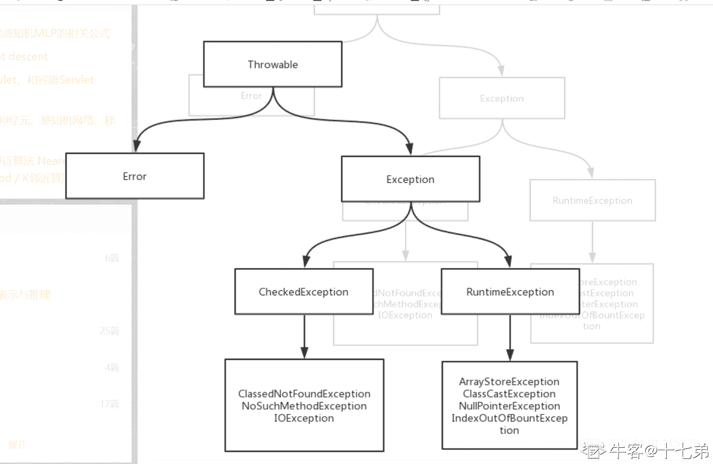
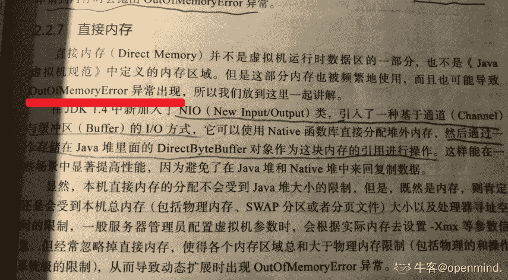
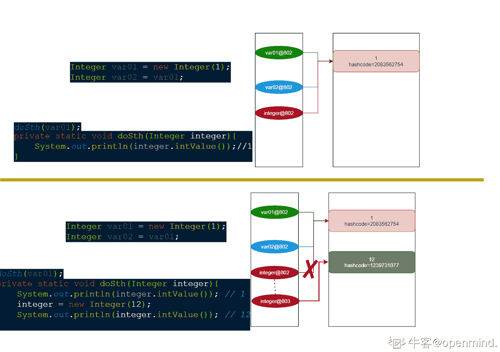
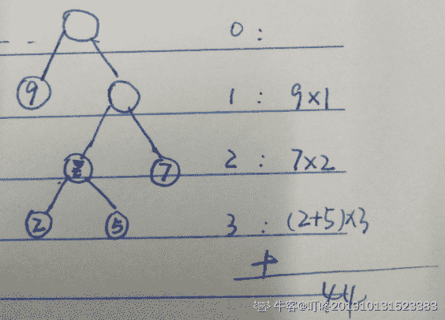

# 货拉拉 2018 秋招 java 工程师笔试题卷二（B）

## 1

下列关于 Java 中类的构造方法的描述，正确的是（）

正确答案: B   你的答案: 空 (错误)

```cpp
构造方法的返回类型为 void
```

```cpp
可以定义一个类而在代码中不写构造方法
```

```cpp
在同一个类中定义的重载构造方法不可以相互调用。
```

```cpp
子类不允许调用父类的构造方法。
```

本题知识点

Java 工程师 货拉拉 2018

讨论

[openmind.](https://www.nowcoder.com/profile/539390139)

构造方法三个特殊性： 

*** 构造方法必须具备和所在类相同的名字；***** 构造方法没有返回值类型，甚至连 void 都没有；***** 构造方法是在创建一个对象使用 new 操作符时调用的。构造方法的作用是初始化对象；***** 构造方法支持重载可以有多个同名的构造方法但要有不同的参数签名（参数类型、参数顺序、参数个数）；**

发表于 2021-09-05 11:54:32

* * *

[jshdhh](https://www.nowcoder.com/profile/307051265)

在 java 中，一个类自动创建一个无参的构造方法

发表于 2019-11-05 15:20:29

* * *

[×－](https://www.nowcoder.com/profile/250506062)

在 java 中一个类是默认带有无参构造的

发表于 2019-11-17 16:45:13

* * *

## 2

下面有关 JAVA 异常类的描述,说法正确的有(）

正确答案: A B C   你的答案: 空 (错误)

```cpp
异常的继承结构:基类为 Throwable, Error 和 Exception 继承 Throwable, RuntimeException 和 IOException 等继承 Exception
```

```cpp
非 RuntimeException 一般是外部错误(不考虑 Error 的情况下),其必须被 try{}catch 语句块所捕获
```

```cpp
Error 类体系描述了 Java 运行系统中的内部错误以及资源耗尽的情形,Error 不需要捕捉
```

```cpp
RuntimeException 体系包括错误的类型转换、数组越界访问和试图访问空指针等等,必须 被 try{}catch 语句块所捕获
```

本题知识点

Java 工程师 货拉拉 2018

讨论

[openmind.](https://www.nowcoder.com/profile/539390139)

**异常基类： Throwable**

**两大子类： Error & Exception**
**  - Error： 描述 Java 运行系统内部错误以及资源耗尽等**
**      - OutOfMemeoryError**
**      - StackOverFlowError**
**      - VirtumachineError**

**  - Exception**
**      - IOException**
**      - SQLException**
**      - ClassNotFoundException**
**      ... **
**      - RuntimeException:**
**        - ClassCastException**
**        - NullPointerException**
**        - ArithmeticException**
**        - ArrayIndexOutOfBoundsException**
**       ... **

发表于 2021-09-05 12:00:45

* * *

[十七弟](https://www.nowcoder.com/profile/247044242)



发表于 2019-11-06 16:06:30

* * *

[牛客 260668830 号](https://www.nowcoder.com/profile/260668830)

非 RuntimeException 一般是外部错误(非 Error)，其必须被 try{}catch 语句块所捕获

发表于 2019-12-17 19:32:41

* * *

## 3

以下关于内存管理描述错误的是：（）

正确答案: D   你的答案: 空 (错误)

```cpp
基本数据类型的变量、对象的引用及函数调用的现场保存都使用内存栈空间
```

```cpp
通过 new 关键字和构造器创建的对象放在堆空间，类信息、常量、静态变量放在方法区
```

```cpp
计数器是唯一一个没有规定任何 OutOfMemoryError 情况的区域
```

```cpp
直接内存的分配不会受到 Java 堆大小的限制，所以不会抛 OutOfMemoryError 异常
```

本题知识点

Java 工程师 货拉拉 2018

讨论

[openmind.](https://www.nowcoder.com/profile/539390139)



发表于 2021-09-05 12:04:55

* * *

[person01](https://www.nowcoder.com/profile/127568977)

感觉 A 选项不太严谨吧。如果是类中声明的成员变量是基本数据类型的时候，就不在虚拟机栈里面了吧？

发表于 2019-11-20 14:00:45

* * *

## 4

下面那些类不是线程安全的（）

正确答案: D   你的答案: 空 (错误)

```cpp
HashTable
```

```cpp
ConcurrentHashMap
```

```cpp
StringBuffer
```

```cpp
HashMap
```

本题知识点

Java 工程师 货拉拉 2018

讨论

[是瑶瑶公主呀](https://www.nowcoder.com/profile/592649258)

StringBuilder 不安全，stringbuffer 安全

hashmap 不安全，hashtable 安全

发表于 2019-10-14 18:43:36

* * *

## 5

有关于反射说法错误的是（）

正确答案: D   你的答案: 空 (错误)

```cpp
使用 Class.forName("com.yy.xxx")方法获取类
```

```cpp
class.newInstance()实例化一个对象
```

```cpp
class.getDeclaredMethods()获取方法列表
```

```cpp
method.invoke(obj, args)不能执行私有方法
```

本题知识点

Java 工程师 货拉拉 2018

讨论

[繁华若梦惜流年丶 201811081927542](https://www.nowcoder.com/profile/427675087)

我觉得这个多多少少有点问题 A、class.forname 获取的应该编译后的 class 对象 B、newInstance 的话相当于是调用了空参构造方法构造，如果类中没有空参构造会报错 C、getDeclaredMethods 获取的是类中所有的方法列表，不包含父类中的方法 D、method.invoke(obj, args)这个想要调用私有方法的话需要暴力反射虽然 D 错的比较离谱，其他的感觉也一般

发表于 2020-10-14 15:21:56

* * *

[大酷头子](https://www.nowcoder.com/profile/113294808)

我不会

发表于 2020-10-14 12:58:24

* * *

## 6

下列关于 Java 中类的构造方法的描述，正确的是（）

正确答案: B   你的答案: 空 (错误)

```cpp
构造方法的返回类型为 void
```

```cpp
可以定义一个类而在代码中不写构造方法
```

```cpp
在同一个类中定义的重载构造方法不可以相互调用
```

```cpp
子类不允许调用父类的构造方法
```

本题知识点

Java 工程师 货拉拉 2018

讨论

[是瑶瑶公主呀](https://www.nowcoder.com/profile/592649258)

没有构造方法时系统会送一个 有了就不送

发表于 2019-10-14 18:44:07

* * *

## 7

以下 Java 程序运行的结果是:（）

```cpp
public class Tester{
public static void main(String[] args){
   Integer var1=new Integer(1);
   Integer var2=var1;
   doSomething(var2);
   System.out.print(var1.intValue());
   System.out.print(var1==var2);
}
public static void doSomething(Integer integer){
    integer=new Integer(2);
  }
}

```

正确答案: D   你的答案: 空 (错误)

```cpp
2false
```

```cpp
2true
```

```cpp
1false
```

```cpp
1true
```

本题知识点

Java 工程师 货拉拉 2018

讨论

[openmind.](https://www.nowcoder.com/profile/539390139)



发表于 2021-09-05 12:29:22

* * *

## 8

由权值为 9,5,2,7 的四个叶子节点构造一棵最优二叉树，该树的带权路径长度为：（）

正确答案: D   你的答案: 空 (错误)

```cpp
23
```

```cpp
27
```

```cpp
37
```

```cpp
44
```

本题知识点

Java 工程师 货拉拉 2018

讨论

[叮咚❀](https://www.nowcoder.com/profile/657988653)

D 带权路径长度=5*3+2*3+7*2+9*1=44 给定 n 个权值作为 n 的 [叶子](http://baike.baidu.com/subview/13699/5079731.htm) 结点，构造一棵二叉树，若带权路径长度达到最小，称这样的二叉树为最优二叉树，也称为哈夫曼树(Huffman Tree)。哈夫曼树是带权路径长度最短的树，权值较大的结点离根较近。 

编辑于 2019-10-24 20:43:17

* * *

[成中鸟](https://www.nowcoder.com/profile/466951756)

D

发表于 2019-10-16 09:52:14

* * *

## 9

关于 final 说法正确的是？ （）

正确答案: B   你的答案: 空 (错误)

```cpp
final 类的方法肯定不能被同一个包的类访问
```

```cpp
final 类的方法能否被同一个包的类访问不是由 final 决定
```

```cpp
final 方法等同于 private 方法
```

```cpp
final 对象本身的引用和值都不能改变
```

本题知识点

Java 工程师 货拉拉 2018

讨论

[rushrushrush](https://www.nowcoder.com/profile/785590865)

A.final 类的方法能否被同一个包访问不由 final 决定 B.正确 C.private 方法不能被任何其他类访问，而 final 方法可以 D.final 对象本身的引用不能改变，但是值可以通过 set 方法改变

发表于 2019-11-01 19:26:10

* * *

## 10

下面有关数据库索引的描述正确的是（）

正确答案: D   你的答案: 空 (错误)

```cpp
建立索引以后，原来的数据库表文件中记录的物理顺序将被改变
```

```cpp
使用索引并不能加快对表的查询操作
```

```cpp
索引与数据库表的数据存储在一个文件中
```

```cpp
创建索引是创建一个指向数据库表文件记录的指针构成的文件
```

本题知识点

Java 工程师 货拉拉 2018

讨论

[小豆 201911081528787](https://www.nowcoder.com/profile/231181729)

添加索引是为了优化数据库的查询

发表于 2019-11-08 16:31:00

* * *

## 11

进程 a 读取 b 进程中的某个变量（非共享内存），可行的方式有（）

正确答案: C D   你的答案: 空 (错误)

```cpp
如果 a、b 非亲属，那么 a 通过命名管道把这个变量的地址发给 b 进程
```

```cpp
如果 b 是 a 进程的子进程，那么 b 直接读取变量内容即可
```

```cpp
b 进程向消息队列写入一个包含变量内容的消息，a 进程从队列中读出
```

```cpp
通过本地环路通信
```

本题知识点

Java 工程师 货拉拉 2018

讨论

[大酷头子](https://www.nowcoder.com/profile/113294808)

求大佬解析

发表于 2020-10-14 13:00:21

* * *

## 12

列举 3 个 Object 类中的方法:1、2、3。

你的答案 (错误)

123 参考答案 (1) toString()
(2) equals()
(3) getClass()

本题知识点

Java 工程师 货拉拉 2018

讨论

[Anxc 有人？](https://www.nowcoder.com/profile/6190954)

1.  [1. getClass 方法](https://fangjian0423.github.io/2016/03/12/java-Object-method/#getClass%E6%96%B9%E6%B3%95)
2.  [2. hashCode 方法](https://fangjian0423.github.io/2016/03/12/java-Object-method/#hashCode%E6%96%B9%E6%B3%95)
3.  [3. equals 方法](https://fangjian0423.github.io/2016/03/12/java-Object-method/#equals%E6%96%B9%E6%B3%95)
4.  [4. clone 方法](https://fangjian0423.github.io/2016/03/12/java-Object-method/#clone%E6%96%B9%E6%B3%95)
5.  [5. toString 方法](https://fangjian0423.github.io/2016/03/12/java-Object-method/#toString%E6%96%B9%E6%B3%95)
6.  [6. notify 方法](https://fangjian0423.github.io/2016/03/12/java-Object-method/#notify%E6%96%B9%E6%B3%95)
7.  [7. notifyAll 方法](https://fangjian0423.github.io/2016/03/12/java-Object-method/#notifyAll%E6%96%B9%E6%B3%95)
8.  [8. wait(long timeout) throws InterruptedException 方法](https://fangjian0423.github.io/2016/03/12/java-Object-method/#wait-long-timeout-throws-InterruptedException%E6%96%B9%E6%B3%95)
9.  [9. wait(long timeout, int nanos) throws InterruptedException 方法](https://fangjian0423.github.io/2016/03/12/java-Object-method/#wait-long-timeout-int-nanos-throws-InterruptedException%E6%96%B9%E6%B3%95)
10.  [10. wait() throws InterruptedException 方法](https://fangjian0423.github.io/2016/03/12/java-Object-method/#wait-throws-InterruptedException%E6%96%B9%E6%B3%95)
11.  [11. finalize 方法](https://fangjian0423.github.io/2016/03/12/java-Object-method/#finalize%E6%96%B9%E6%B3%95)

发表于 2019-10-14 20:30:23

* * *

[肆哑](https://www.nowcoder.com/profile/554186516)

没带括号都不行吗，这又不是编程题

发表于 2019-10-19 13:07:54

* * *

[命是弱者的借口，运是强者的谦词](https://www.nowcoder.com/profile/92788719)

？？？搞什么

发表于 2019-12-25 21:01:13

* * *

## 13

如果一个类被修饰为 1，则这个类不能被继承。

你的答案 (错误)

1 参考答案 (1) final

本题知识点

Java 工程师 货拉拉 2018

## 14

可以通过使用 1 关键词修改方法来同步化对方法的访问。

你的答案 (错误)

1 参考答案 (1) synchronized

本题知识点

Java 工程师 货拉拉 2018

讨论

[HAHAHAHAHA!!!](https://www.nowcoder.com/profile/1321466)

同步锁 synchronized

发表于 2019-11-03 17:59:19

* * *

## 15

假设菜单树形数据在 MySQL 中是以记录 pid(父级菜单主键)形式存储, 请实现 getMenuTree 方法。

```cpp
public class Menu {
    private int id; // 主键，菜单 id
    private String name; // 菜单名称
    private int pid; // 菜单父 id，根节点 pid=0
    private List<Menu> children; // 下级菜单
    // 省略 set、get 等方法。
}
public Menu getMenuTree(List<Menu> menuList) {
  // TODO
  return rootMenu;
}
```

要求如下：

1. 要有清晰的代码。

getMenuTree 方法最优时间复杂度为 0(n)。

你的答案

本题知识点

Java 工程师 货拉拉 2018

讨论

[test123201910220925479](https://www.nowcoder.com/profile/95945235)

```cpp
//首先将 list 转成 Map，key 为菜单 ID
//遍历 list，将 PID 为 0 的作为根节点，
Map<Integer,Menu> map = list.stream().collect(Collectors.toMap(Menu::getId, v -> v, (k1, k2) -> k1));
Menu rootMenu = null;//根节点
for(Menu menu : list)
{
    if(menu.getPid() == 0){
        rootMenu = menu;
    }else{
        //根据父节 ID 点找出对应父节点
        Menu pMenu = map(menu.getPid());
        pMenu.addChildren(menu);//addChildren 方法要自己写
    }
}

//最后 return 出，根节点
return rootMenu;
```

发表于 2019-10-25 09:22:57

* * *

[人余月半子](https://www.nowcoder.com/profile/514787832)

 public Menu  buildTree(List<Menu> menus){
        Menu permission = Menu();
        Map<Integer,Menu> permissionMap = new HashMap<>();
        for (Menup : menus) {
            permissionMap.put(p.getId(),p);
        }

        for (Menup : menus) {
            Menu child = p;
            if(child.getPid() == 0) {
                permission.add(child);
            }else {
                Menu parent = permissionMap.get(child.getPid());
                parent.getChildren().add(child);
            }
        }
        return permission;
    }

发表于 2020-09-15 14:34:04

* * *

[START201910291526707](https://www.nowcoder.com/profile/597698770)

Menu rootMenu = menuList.stream().sorted(Comparator.comparing(Menu::getId)).collect(Collector.toList()).get(0);

编辑于 2019-10-29 16:38:32

* * *

## 16

试写出 Map 接口的简单实现，接口定义如下：public interface Map<K,V> {
  V get(Object key);
  V put(K key, V value);
}
要求如下：
1\. 要有清晰的数据结构。
2\. get()、put()方法是时间复杂度最优为 O(1)，最坏情况 O(n)。
3\. 不使用第三方库和 java.util.Map 接口下的实现类

你的答案

本题知识点

Java 工程师 货拉拉 2018

讨论

[Mr.MonsterX](https://www.nowcoder.com/profile/638925582)

public  class MyMap implements  Map{

    //默认数组长度

    private  static  int  defaultLength=16;

    private  int  size=0;

    //Entry 数组

    private Entry[] entrys;

    public MyMap(){

        this(defaultLength);

    }

    public MyMap(int length){

        entrys = new Entry[16];

    }

    public Object get(Object key) {

        //根据 key 的 HashCode 获取数组 index

        int index = getHashCode(key);

        Entry entry = entrys[index];

        if(entry!=null){

            //遍历链式 Entry

            while(!entry.key.equals(key)){

                entry = entry.nextEntry;

            }

            return entry.value;

        }

        return  null;

    }

    public Object put(Object key, Object value) {

        //判断是否需要扩展数组长度

        if(entrys!=null&&entrys.length==size){

            Extension();

        }

        int index = getHashCode(key);

        //获取数组下标位置链表

        Entry tempEntry = entrys[index];

        if(tempEntry==null){

            //如果 index 处没有链表

            tempEntry = new Entry(key,value);

            entrys[index]= tempEntry;

            size++;

        }else{

            //如果 index 处有链表

            while(!tempEntry.key.equals(key)){

                //如果链表中没有相同的 key 则追加在尾部

                if(tempEntry.nextEntry==null){

                    tempEntry.nextEntry=new Entry(key,value);

                    return  null;

                }

                tempEntry = tempEntry.nextEntry;

            }

            //有相同的 key 则替换 value

            tempEntry.value = value;

        }

        return  null;

    }

    /***

     * 根据 KEY 获取 hash 值

     * @param key

* @return

     */

    private int getHashCode(Object key){

        if(key!=null){

            return key.toString().hashCode()&(defaultLength-1);

        }

        return 0;

    }

    /**

     * 扩容

     */

    private void Extension(){

        Entry[] newEntry = new Entry[size*2];

        for(int i=0;i<entrys.length;i++){

            newEntry[i]=entrys[i];    

        }

        entrys = newEntry;

        newEntry = null;

    }

}

class Entry{

    public Object key;

    public Object value;

    public Entry nextEntry;

    Entry(Object key,Object value){

        this.key = key;

        this.value = value;

    }

}

发表于 2019-10-16 17:51:46

* * *

[低调的我](https://www.nowcoder.com/profile/4546028)

```cpp
public class MyMap {
    Entry[] array;
    int size;
    public MyMap(){
        this(10);
    }
    public MyMap(int initLength){
        array = new Entry[initLength];
    }
    // 扩容
    public Entry[] expandLength(Entry[] array){
        Entry[] newArray = new Entry[array.length * 2 + 1];
        for (int i = 0; i < array.length; i++){
            newArray[i] = array[i];
        }
        return newArray;
    }
    public boolean put(Object key, Object value){
        if(size == array.length){
            array = expandLength(array);
        }
        // 判断键是否已经存在，存在的话则更新
        for(int i = 0; i < array.length; i++){
            if(array[i].key.equals(key)){
                array[i].value = value;
                return true;
            }
        }
        array[size] = new Entry(key, value);
        size++;
        return true;
    }
    public Object get(Object key){
        if(size != 0){
            for (int i = 0; i < size; i++){
                if(array[i].key.equals(key)){
                    return array[i].value;
                }
            }
        }
        return null;
    }
    public boolean containsKey(Object key){
        for(int i= 0; i < array.length; i++){
            if(array[i].key.equals(key))
                return true;
        }
        return false;
    }
    public boolean containsValue(Object value){
        for (int i = 0; i < array.length; i++){
            if(array[i].value.equals(value)){
                return true;
            }
        }
        return false;
    }
    public void clear(){
        Entry[] newArray = new Entry[array.length];
        array = newArray;
        size = 0;
    }
}
class Entry{
    Object key;
    Object value;
    public Entry(Object key, Object value){
        this.key = key;
        this.value = value;
    }
}

```

百度的

编辑于 2019-10-14 21:14:21

* * *

[雨中飞奔的🐢](https://www.nowcoder.com/profile/894421432)

```cpp
package test;

import org.junit.Test;

/**
 * @Autre beyond
 * @Data 2019/10/19
 */
public class MyMapTest implements Map {

    //1.使用 array 初始数组
    //2.定义一个 Entry 数组类
    Entry [] array;
   //标识当前位置
    int size;
    //3.添加的时候判断是否为空，返回
    //查询默认返回 null
    //注意：数组需要扩容 ExplanArray。添加如果是重复的需要更新

    //设置默认值
    public MyMapTest() {
        this(10);
    }

    public MyMapTest(int size) {
       array=new Entry[size];
    }
    //扩容
    public Entry[] explanArray (Entry[] array){
        //扩容
        Entry []newAarray=new Entry[array.length*2+1];
        //扩容以后需要把原来的数据添加到新的数组中
        for (int i = 0; i <array.length ; i++) {
            newAarray[i]=array[i];
        }
        return newAarray;
    }
    @Override
    public Object get(Object key) {
        for (int i = 0; i <array.length ; i++) {
            if (array[i].key.equals(key)){
                return array[i].value;
            }
        }
        return null;
    }

    @Override
    public Object put(Object key, Object value) {
        //首先判断数组容量，如果太小需要扩容
        if (size==array.length){
           array= explanArray(array);
        }
        //其次判断是否重复
        /*for (int i = 0; i <array.length ; i++) {
            if (array[i].key.equals(key)){
                array[i].value=value;
            }
        }*/
        //不重复添加数据
        array[size]=new Entry(key,value);
        size++;
        return null;
    }
    class Entry{
        Object key;
        Object value;
        public Entry(Object key, Object value) {
            this.key = key;
            this.value = value;
        }
    }

}

package test;

/**
 * @Autre beyond
 * @Data 2019/10/19
 */
public interface Map<K,V> {
    V get(Object key);
    V put(Object key,Object value);
}

/*  MyMapTest myMapTest=new MyMapTest();
        myMapTest.put("chen","zhuang");*/

```

发表于 2019-10-19 11:24:42

* * *