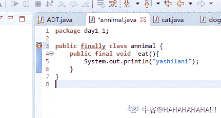

# 货拉拉 2018 秋招 java 工程师笔试题卷三（B）

## 1

以下关于内存泄漏说法正确的是（）

正确答案: C   你的答案: 空 (错误)

```cpp
内存泄漏是操作系统内存管理出错导致的问题
```

```cpp
单线程程序不可能内存泄漏
```

```cpp
如果一个进程在运行过程中占用的内存无限制上升，那么该进程有内存泄漏
```

```cpp
只要进程在退出之前释放了所有分配的内存，那么就不会内存泄漏
```

```cpp
内存泄漏是仅仅出现在 C/C++程序的问题，Java 程序不会内存泄漏
```

本题知识点

安卓工程师 货拉拉 Java 工程师 iOS 工程师 2018

讨论

[、、20191009173366](https://www.nowcoder.com/profile/714743719)

| A，内存泄露是程序设计的 bug，不是操作系统的问题 B，内存泄露跟线程数无关
C，内存泄露是进程申请了内存却没有释放。导致占用内存无限上升
D，进程退出之前释放申请的内存，不代表进程运行过程中没有内存泄***r /> E，java 是自动管理内存的，但是也会有内存泄露，比如加入 HashMap 的对象 hash 值改变了就无法从 HashMap 中 remove，这就造成了内存泄露      |

发表于 2019-10-29 17:33:22

* * *

[改过行善](https://www.nowcoder.com/profile/4691042)

内存无限上升不是叫做内存溢出吗？

发表于 2019-10-21 14:48:34

* * *

[ChrisChen98](https://www.nowcoder.com/profile/195463291)

在计算机科学中，**内存泄漏**指由于疏忽或错误造成程序未能释放已经不再使用的内存。内存泄漏并非指内存在物理上的消失，而是应用程序分配某段内存后，由于设计错误，导致在释放该段内存之前就失去了对该段内存的控制，从而造成了内存的浪费。

发表于 2019-10-21 17:22:29

* * *

## 2

一棵二叉树有 7 个度为 1 的结点，6 个度为 2 的结点，则该二叉树共有个多少个结点（）

正确答案: A   你的答案: 空 (错误)

```cpp
２０
```

```cpp
１７
```

```cpp
２５
```

```cpp
３１
```

本题知识点

安卓工程师 货拉拉 Java 工程师 iOS 工程师 2018

讨论

[呆吖呆 yu](https://www.nowcoder.com/profile/940767442)

总结点个数=总分枝数目+1 7*1+6*2+1=20

发表于 2019-10-14 15:01:25

* * *

[-ZENGZENG](https://www.nowcoder.com/profile/550026077)

总结点 n=n0+n1+n2;

n0=n2+1;

n=n1+2n2+1;

n= 7+ 2*6 +1= 20

发表于 2019-10-22 11:12:03

* * *

[良木 66](https://www.nowcoder.com/profile/95038880)

20

发表于 2019-11-11 12:41:40

* * *

## 3

以下 Java 程序运行的结果是: （）

```cpp
public class Tester{
public static void main(String[] args){
   Integer var1=new Integer(1);
   Integer var2=var1;
   doSomething(var2);
   System.out.print(var1.intValue());
   System.out.print(var1==var2);
}
public static void doSomething(Integer integer){
    integer=new Integer(2);
  }
}

```

正确答案: A   你的答案: 空 (错误)

```cpp
1true
```

```cpp
2true
```

```cpp
1false
```

```cpp
2false
```

本题知识点

Java 工程师 货拉拉 2018

讨论

[昵称已被占用丿](https://www.nowcoder.com/profile/161367350)

推荐看一下 java 值传递，[`github.com/Snailclimb/JavaGuide/blob/master/docs/essential-content-for-interview/MostCommonJavaInterviewQuestions/%E7%AC%AC%E4%B8%80%E5%91%A8%EF%BC%882018-8-7%EF%BC%89.md`](https://github.com/Snailclimb/JavaGuide/blob/master/docs/essential-content-for-interview/MostCommonJavaInterviewQuestions/%E7%AC%AC%E4%B8%80%E5%91%A8%EF%BC%882018-8-7%EF%BC%89.md)

发表于 2019-10-15 15:27:59

* * *

[YxxxxxxY](https://www.nowcoder.com/profile/970984482)

方法中的局部变量最开始所指向的是 V2 所指向的 Integer 对象，如果在此方法内对所指向的对象进行修改，如把对象中的属性值修改，则会影响到原来的对象。但是只是把局部变量修改为指向别的对象，则对原有对象无任何影响。

调用 dosomething 时把 v2 作为实参传进去。实际会在栈内新建变量 integer(形参），也就是方法的局部变量来指向 v2 所指对象。即此时 integer==var2 为 true.

发表于 2019-11-08 13:55:27

* * *

[赌怪](https://www.nowcoder.com/profile/465601689)

方法中是局部变量，作用后会自动释放

发表于 2019-10-14 18:51:17

* * *

## 4

以下对继承的描述错误的是：（）

正确答案: C   你的答案: 空 (错误)

```cpp
Java 中的继承存在着传递性
```

```cpp
父类更具有通用性，子类更具体
```

```cpp
定义为 final 的类可以被继承
```

```cpp
当实例化子类时会递归调用父类中的构造方法
```

本题知识点

Java 工程师 货拉拉 2018

讨论

[是瑶瑶公主呀](https://www.nowcoder.com/profile/592649258)

应该是 final 吧？

发表于 2019-10-14 18:59:55

* * *

[夜笙孤酒](https://www.nowcoder.com/profile/436157521)

final 来定义类表示不能被继承。finally 是异常中 try-catch 中定义的，表示 finally 中的代码一定会被执行

发表于 2020-02-09 20:38:09

* * *

[HAHAHAHAHA!!!](https://www.nowcoder.com/profile/1321466)

finally 不能定义类。。。。极度尴尬

编辑于 2019-11-03 17:42:33

* * *

## 5

关于以下方法调用描述正确的是：（）

```cpp
private static final List<String> list = new ArrayList<>();
public static String test(String j){
    int i = 1, s = 1, f = 1, a = 1, b = 1,c = 1,d = 1,e = 1;
    list.add(new String("11111111111111111111111111111"));
    return test(s+i+f+a+b+c+d+e+"");
}

```

正确答案: B D   你的答案: 空 (错误)

```cpp
一定会发生” OutOfMemoryError: Java heap space”
```

```cpp
一定会发生” StackOverflowError”
```

```cpp
一定会发生” OutOfMemoryError: Java heap space 与 StackOverflowError”
```

```cpp
当发生内存溢出错误时不需要用 try…catch 来捕获，需检查代码及 jvm 参数配置的合理性
```

本题知识点

Java 工程师 货拉拉 2018

讨论

[赵江涛](https://www.nowcoder.com/profile/646131293)

StackOverflowError 原因在于 : 无限调用递归函数, 函数是以栈帧的形式存在于虚拟机栈内存中, 一直创建栈帧, 导致栈溢出.OutOfMemoryError : Java 堆用于存储对象实例, 只要不断地创建对象, 并且保证 GC Roots 到对象之间有可达路径来避免垃圾回收机制来清除这些对象, 那么在对象数量到达最大堆的容量限制后就会产生内存溢出异常. (摘抄自深入理解 java 虚拟机), 所以一直 new String() 并不会造成堆内存溢出.java 异常可以分为 checkedException 和 uncheckedException, 检查异常(不包括 runtimeException 及其子类的 exception 的子类)必须使用 try catch 或者 throws 处理, 而 error 属于非检查异常,非检查异常可以使用 try catch 捕获,但是没必要.

发表于 2019-10-16 20:59:59

* * *

## 6

以下关于 List 删除方法使用错误的是（）

正确答案: C   你的答案: 空 (错误)

```cpp
list 循环外指定 index 删除：list.remove(i);
```

```cpp
list 循环外指定元素删除：list.remove(obj);
```

```cpp
for(Object obj:list){list.remove(obj);}
```

```cpp
for(Iterator it= list.iterator();it.hasNext();){it.next();it.remove();}
```

本题知识点

Java 工程师 货拉拉 2018

讨论

[17 面郎孩](https://www.nowcoder.com/profile/328455)

增强循环其实就是个迭代器的封装。List 维护了一个变量 modcount 修改次数，包括集合的内部结构的更改（set、add、remove），都会是 modcount+1；迭代器中维护了一个变量 expectedmodcount，它的初始值是 expectedmodcount=modcount。迭代器不允许你在我迭代数据的时候受到修改集合的干扰，确实是这样，不然遍历出来的数据就不符合逻辑了。所以迭代器设计了一个 checkForComodification（）方法来检测 final void checkForComodification() {
            if (modCount != expectedModCount)
                throw new ConcurrentModificationException();
        }
该方法在迭代器的 next（）中被调用。一旦 modCount != expectedModCount，就 ConcurrentModificationException 报错。
要修改也必须是迭代器自己修改，因为迭代器在修改完后会重置 expectedmodcount=modcount。

编辑于 2019-10-17 16:03:20

* * *

[夜笙孤酒](https://www.nowcoder.com/profile/436157521)

使用 foreach 遍历时删除会报异常，使用迭代器进行迭代时则不会报异常

发表于 2020-02-09 20:47:50

* * *

[追忆似水流年 201809132107210](https://www.nowcoder.com/profile/954914478)

可能是不能一边查，一边删吧！可能会造成危险吧！

发表于 2019-10-19 23:02:07

* * *

## 7

Java 反射机制的说法错误的是：（）

正确答案: C   你的答案: 空 (错误)

```cpp
在运行时判断对象所属的类
```

```cpp
在运行时判断类所具有的成员变量和方法
```

```cpp
在运行时改变方法的实现
```

```cpp
在运行时调用一个对象的方法
```

本题知识点

Java 工程师 货拉拉 2018

讨论

[呆吖呆 yu](https://www.nowcoder.com/profile/940767442)

Java 反射机制指的是在 Java 程序运行状态下，对于任意一个类，都可以获得这个类的所有属性和方法，对于给定的一个对象都能够调用它的任意一个属性和方法。这种动态的获取类的内容以及调用对象的方法称为反射机制。

发表于 2019-10-14 15:13:43

* * *

[适然](https://www.nowcoder.com/profile/816144437)

有些歧义，使用 Proxy 可以实现 C（在调用者的角度）

发表于 2019-10-19 22:36:58

* * *

## 8

下列哪个对访问修饰符作用范围由大到小排列是正确的？（）

正确答案: A   你的答案: 空 (错误)

```cpp
public>protected>default>private
```

```cpp
public>default>protected>private
```

```cpp
private>protected>default>public
```

```cpp
private>default>protected>public
```

本题知识点

Java 工程师 货拉拉 2018

讨论

[s666](https://www.nowcoder.com/profile/756935193)

default：包内的任何类，重点突出包

protected：包内的任何类及包外继承了该类的子类，重点突出继承

发表于 2019-10-22 03:24:22

* * *

## 9

对于 Java 中异常的描述正确的是（）

正确答案: C   你的答案: 空 (错误)

```cpp
用 throws 定义了方法可能抛出的异常，那么调用此方法时一定会抛出此异常。
```

```cpp
如果 try 块中没有抛出异常，finally 块中的语句将不会被执行。
```

```cpp
可不检测（unchecked）异常:包括运行时异常（RuntimeException 与其子类）和错误（Error）。
```

```cpp
抛出异常意味着程序发生运行时错误，需要调试修改
```

本题知识点

Java 工程师 货拉拉 2018

讨论

[山间晚风](https://www.nowcoder.com/profile/6552473)

D 没毛病啊，文字游戏？

发表于 2019-11-23 18:29:36

* * *

[赵江涛](https://www.nowcoder.com/profile/646131293)

A : 使用 throws 声名异常, 只是可能抛出该异常 B : finally 语句不会执行的三种情况 : (摘抄自别的答案, 具体出处不知道了)    1\. 在执行 finally 语句块之前 JVM 退出或崩溃, (包括调用 System.exit(0); 该函数的作用便是中止 JVM 的调用)
    2\. try 死循环
    3\. 电源断电
C :异常可以分为检查异常和非检查异常.检查异常顾名思义就是需要进行检查的异常, 需要使用 try catch 捕获或者 throws 抛出. (除去 runtimeException 及其子类的 exception 及其子类)非检查异常 : runtimeException 及其子类, 还有 Error(Error 也属于异常, 并且属于非检查异常)D: 只要是异常,都可以进行捕获抛出.(不是只有运行时异常可以抛出)

发表于 2019-10-16 21:16:37

* * *

## 10

在数据库系统中，产生不一致的根本原因是（）

正确答案: B C   你的答案: 空 (错误)

```cpp
数据存储量太大
```

```cpp
并发控制不当
```

```cpp
数据冗余
```

```cpp
未对数据进行完整性控制
```

本题知识点

Java 工程师 货拉拉 2018

讨论

[叮咚❀](https://www.nowcoder.com/profile/657988653)

产生数据不一致的原因主要有三种：一是由于数据冗余；二是由并发控制不当；三是各种故障、错误。但根本原因是数据冗余。第一种情况往往是由于重复存放的数据未能进行一致性地更新造成的。第二种情况是由于多用户共享数据库，而更新操作未能保持同步进行引起的。第三种情况是由于某种原因(如硬件故障或软件故障)而造成数据丢失或数据损坏。

发表于 2019-10-13 17:39:45

* * *

## 11

你有 8 个一样大小的球，其中 7 个的重量是一样的，另一个比较重。用天平将那个重一些的球找出来，至少需要 1 次

你的答案 (错误)

1 参考答案 (1) 2

本题知识点

安卓工程师 货拉拉 Java 工程师 iOS 工程师 2018

讨论

[莫******。](https://www.nowcoder.com/profile/456763647)

把 8 个小球分成 3，3，2 三份，第一次测量 3 和 3 两份一 .若两份不等重，可直接判断重的球在哪一份中，再将 3 个球分成 3 份，再测量一次即可得出二.若两份等重，则重的球在余下的 2 个球中，测量一次找出

发表于 2019-10-15 09:37:05

* * *

[Nia_yu](https://www.nowcoder.com/profile/356621960)

通解：n 个东西，若 3^(a-1)<n<=3^a 则答案为 a

发表于 2019-10-17 15:24:06

* * *

[张牧之吖](https://www.nowcoder.com/profile/921063738)

两个球不相等那直接就能看出来哪个更重了，所以按逻辑来说，最少就一次就足够了

发表于 2019-10-18 20:58:49

* * *

## 12

现有如下任务需要安排在若干机器上并行完成，每个任务都有开始时间和结束时间（开始和结束时间都包括在任务执行时间内）的要求

```cpp
任务名称      开始时间     结束时间
a         　　　 1       7
b         　　　 8       9
c         　　　 2       5
d         　　　 7      11
e          　　　3       6
f         　　　 7        9
g          　　　10      13
```

则最少需要使用的机器数目为 1

你的答案 (错误)

1 参考答案 (1) 3

本题知识点

安卓工程师 货拉拉 Java 工程师 iOS 工程师 2018

讨论

[向天再借五百斤](https://www.nowcoder.com/profile/471027334)

1-7 这段时间内有 a，c，e，三个任务，故 1-7 需要三台机器，7-9 有 b，d，f，9-13 有 g 和 d，可得出至少需要三台机器，但我的答案 3 是错的，应该是(1) ３

发表于 2019-10-15 11:40:19

* * *

[段思维](https://www.nowcoder.com/profile/4305751)

第一个机器 1~7 8~9 10~13 第二个机器 2~5 7~9 第三个机器 3~6 7~11 由于时间不能冲突，所以最少三个机器

发表于 2019-10-15 11:33:36

* * *

[Bangser](https://www.nowcoder.com/profile/180020855)

有木有大佬给分析分析

发表于 2019-10-15 09:18:37

* * *

## 13

列举 3 个 Object 类中的方法:1、2、3。

你的答案 (错误)

123 参考答案 (1) toString()
(2) equals()
(3) getClass()

本题知识点

Java 工程师 货拉拉 2018

讨论

[Anxc 有人？](https://www.nowcoder.com/profile/6190954)

1.  [1. getClass 方法](https://fangjian0423.github.io/2016/03/12/java-Object-method/#getClass%E6%96%B9%E6%B3%95)
2.  [2. hashCode 方法](https://fangjian0423.github.io/2016/03/12/java-Object-method/#hashCode%E6%96%B9%E6%B3%95)
3.  [3. equals 方法](https://fangjian0423.github.io/2016/03/12/java-Object-method/#equals%E6%96%B9%E6%B3%95)
4.  [4. clone 方法](https://fangjian0423.github.io/2016/03/12/java-Object-method/#clone%E6%96%B9%E6%B3%95)
5.  [5. toString 方法](https://fangjian0423.github.io/2016/03/12/java-Object-method/#toString%E6%96%B9%E6%B3%95)
6.  [6. notify 方法](https://fangjian0423.github.io/2016/03/12/java-Object-method/#notify%E6%96%B9%E6%B3%95)
7.  [7. notifyAll 方法](https://fangjian0423.github.io/2016/03/12/java-Object-method/#notifyAll%E6%96%B9%E6%B3%95)
8.  [8. wait(long timeout) throws InterruptedException 方法](https://fangjian0423.github.io/2016/03/12/java-Object-method/#wait-long-timeout-throws-InterruptedException%E6%96%B9%E6%B3%95)
9.  [9. wait(long timeout, int nanos) throws InterruptedException 方法](https://fangjian0423.github.io/2016/03/12/java-Object-method/#wait-long-timeout-int-nanos-throws-InterruptedException%E6%96%B9%E6%B3%95)
10.  [10. wait() throws InterruptedException 方法](https://fangjian0423.github.io/2016/03/12/java-Object-method/#wait-throws-InterruptedException%E6%96%B9%E6%B3%95)
11.  [11. finalize 方法](https://fangjian0423.github.io/2016/03/12/java-Object-method/#finalize%E6%96%B9%E6%B3%95)

发表于 2019-10-14 20:30:23

* * *

[肆哑](https://www.nowcoder.com/profile/554186516)

没带括号都不行吗，这又不是编程题

发表于 2019-10-19 13:07:54

* * *

[命是弱者的借口，运是强者的谦词](https://www.nowcoder.com/profile/92788719)

？？？搞什么

发表于 2019-12-25 21:01:13

* * *

## 14

如果在子类中想使用被子类隐藏的父类的成员变量或方法可以使用关键字 1

你的答案 (错误)

1 参考答案 (1) super

本题知识点

Java 工程师 货拉拉 2018

讨论

[HAHAHAHAHA!!!](https://www.nowcoder.com/profile/1321466)

获取父类隐藏方法或变量用 super.重载父类构造方法用 super()

发表于 2019-11-03 17:17:59

* * *

[Lee·奇 S](https://www.nowcoder.com/profile/328013344)

super

发表于 2019-10-16 01:08:13

* * *

## 15

线程调用了 yield 或 1 方法主动放弃 CPU。

你的答案 (错误)

1 参考答案 (1) sleep

本题知识点

Java 工程师 货拉拉 2018

讨论

[三金七爷](https://www.nowcoder.com/profile/38401358)

这道题应该是在考察线程的方法。wait 方法不是线程的方法，而是每个对象 object 都有的方法

发表于 2019-10-27 10:32:53

* * *

[向天再借五百斤](https://www.nowcoder.com/profile/471027334)

wait 方法也会放弃 CPU 资源吧

发表于 2019-10-15 11:43:23

* * *

[牛客 279370402 号](https://www.nowcoder.com/profile/279370402)

你的答案 (错误)

1 sleep 参考答案 (1) Sleep

发表于 2020-05-27 17:20:17

* * *

## 16

货拉拉分布在全国各大城市的司机小哥，需要从公司出发，去到市内的业主待搬家的家里。已知他的位置以及业主的位置，但是由于城市道路交通的原因，他只能在左右中选定一个方向，在上下中选定一个方向，现在问他有多少种方案到达业主家。

给定一个地图 map 及它的长宽 n 和 m，其中 1 代表设计师位置，2 代表业主位置，-1 代表不能经过的地区，0 代表可以经过的地区，请返回方案数，保证一定存在合法路径。保证矩阵的长宽都小于等于 10。

测试样例：

[[0,1,0],[2,0,0]],2,3

返回：2

你的答案

本题知识点

安卓工程师 货拉拉 Java 工程师 2018

讨论

[凯 201903041803479](https://www.nowcoder.com/profile/97741874)

咋没人解析一波

发表于 2019-10-21 20:22:34

* * *

[牛客 658970523 号](https://www.nowcoder.com/profile/658970523)

```cpp
 ```
import java.io.BufferedReader; import java.io.IOException; import java.io.InputStreamReader;
```cpp

public class Main{ public static void main(String[] args) throws IOException {
        BufferedReader br= new BufferedReader(new InputStreamReader(System.in));
        String[] pram = br.readLine().split(" "); int n=Integer.parseInt(pram[0]); int m=Integer.parseInt(pram[1]);
        String[] sp = br.readLine().split(","); int [][] map=new int[n][m]; int row=0; int col=0; int si=0; int sj=0; for (int i = 0; i <sp.length ; i++) { if (i==m*(row)){
                col=0;
            }
            map[row][col]=Integer.parseInt(sp[i]); if (Integer.parseInt(sp[i])==1){
                si=row;
                sj=col;
            } if (i==m*(row+1)-1){
                row++;
            }
            col++;
        } int ans =process(si,sj,map);
        System.out.println(ans);
    } public static int process(int si ,int sj ,int [][] map){ int n=map.length; int m=map[0].length; if (si<0||si>=n||sj<0||sj>=m||map[si][sj]==-1){ return 0;
        } if (map[si][sj]==2){ return 1;
        }
        map[si][sj]=-1; int f1= process(si-1,sj,map); int f2=process(si+1,sj,map); int f3=process(si,sj-1,map); int f4=process(si,sj+1,map); return f1+f2+f3+f4;
    }
}
```

发表于 2022-02-06 12:51:54

* * *

[mzys1995](https://www.nowcoder.com/profile/451226931)

dfs 可以吗？记录经过的 node 和 node 对应的路径数。

发表于 2020-12-09 10:42:17

* * *

## 17

假设菜单树形数据在 MySQL 中是以记录 pid(父级菜单主键)形式存储, 请实现 getMenuTree 方法。

```cpp
public class Menu {
    private int id; // 主键，菜单 id
    private String name; // 菜单名称
    private int pid; // 菜单父 id，根节点 pid=0
    private List<Menu> children; // 下级菜单
    // 省略 set、get 等方法。
}
public Menu getMenuTree(List<Menu> menuList) {
  // TODO
  return rootMenu;
}
```

要求如下：

1. 要有清晰的代码。

getMenuTree 方法最优时间复杂度为 0(n)。

你的答案

本题知识点

Java 工程师 货拉拉 2018

讨论

[test123201910220925479](https://www.nowcoder.com/profile/95945235)

```cpp
//首先将 list 转成 Map，key 为菜单 ID
//遍历 list，将 PID 为 0 的作为根节点，
Map<Integer,Menu> map = list.stream().collect(Collectors.toMap(Menu::getId, v -> v, (k1, k2) -> k1));
Menu rootMenu = null;//根节点
for(Menu menu : list)
{
    if(menu.getPid() == 0){
        rootMenu = menu;
    }else{
        //根据父节 ID 点找出对应父节点
        Menu pMenu = map(menu.getPid());
        pMenu.addChildren(menu);//addChildren 方法要自己写
    }
}

//最后 return 出，根节点
return rootMenu;
```

发表于 2019-10-25 09:22:57

* * *

[人余月半子](https://www.nowcoder.com/profile/514787832)

 public Menu  buildTree(List<Menu> menus){
        Menu permission = Menu();
        Map<Integer,Menu> permissionMap = new HashMap<>();
        for (Menup : menus) {
            permissionMap.put(p.getId(),p);
        }

        for (Menup : menus) {
            Menu child = p;
            if(child.getPid() == 0) {
                permission.add(child);
            }else {
                Menu parent = permissionMap.get(child.getPid());
                parent.getChildren().add(child);
            }
        }
        return permission;
    }

发表于 2020-09-15 14:34:04

* * *

[START201910291526707](https://www.nowcoder.com/profile/597698770)

Menu rootMenu = menuList.stream().sorted(Comparator.comparing(Menu::getId)).collect(Collector.toList()).get(0);

编辑于 2019-10-29 16:38:32

* * *

## 18

试写出 Map 接口的简单实现，接口定义如下：public interface Map<K,V> {
  V get(Object key);
  V put(K key, V value);
}
要求如下：
1\. 要有清晰的数据结构。
2\. get()、put()方法是时间复杂度最优为 O(1)，最坏情况 O(n)。
3\. 不使用第三方库和 java.util.Map 接口下的实现类

你的答案

本题知识点

Java 工程师 货拉拉 2018

讨论

[Mr.MonsterX](https://www.nowcoder.com/profile/638925582)

public  class MyMap implements  Map{

    //默认数组长度

    private  static  int  defaultLength=16;

    private  int  size=0;

    //Entry 数组

    private Entry[] entrys;

    public MyMap(){

        this(defaultLength);

    }

    public MyMap(int length){

        entrys = new Entry[16];

    }

    public Object get(Object key) {

        //根据 key 的 HashCode 获取数组 index

        int index = getHashCode(key);

        Entry entry = entrys[index];

        if(entry!=null){

            //遍历链式 Entry

            while(!entry.key.equals(key)){

                entry = entry.nextEntry;

            }

            return entry.value;

        }

        return  null;

    }

    public Object put(Object key, Object value) {

        //判断是否需要扩展数组长度

        if(entrys!=null&&entrys.length==size){

            Extension();

        }

        int index = getHashCode(key);

        //获取数组下标位置链表

        Entry tempEntry = entrys[index];

        if(tempEntry==null){

            //如果 index 处没有链表

            tempEntry = new Entry(key,value);

            entrys[index]= tempEntry;

            size++;

        }else{

            //如果 index 处有链表

            while(!tempEntry.key.equals(key)){

                //如果链表中没有相同的 key 则追加在尾部

                if(tempEntry.nextEntry==null){

                    tempEntry.nextEntry=new Entry(key,value);

                    return  null;

                }

                tempEntry = tempEntry.nextEntry;

            }

            //有相同的 key 则替换 value

            tempEntry.value = value;

        }

        return  null;

    }

    /***

     * 根据 KEY 获取 hash 值

     * @param key

* @return

     */

    private int getHashCode(Object key){

        if(key!=null){

            return key.toString().hashCode()&(defaultLength-1);

        }

        return 0;

    }

    /**

     * 扩容

     */

    private void Extension(){

        Entry[] newEntry = new Entry[size*2];

        for(int i=0;i<entrys.length;i++){

            newEntry[i]=entrys[i];    

        }

        entrys = newEntry;

        newEntry = null;

    }

}

class Entry{

    public Object key;

    public Object value;

    public Entry nextEntry;

    Entry(Object key,Object value){

        this.key = key;

        this.value = value;

    }

}

发表于 2019-10-16 17:51:46

* * *

[低调的我](https://www.nowcoder.com/profile/4546028)

```cpp
public class MyMap {
    Entry[] array;
    int size;
    public MyMap(){
        this(10);
    }
    public MyMap(int initLength){
        array = new Entry[initLength];
    }
    // 扩容
    public Entry[] expandLength(Entry[] array){
        Entry[] newArray = new Entry[array.length * 2 + 1];
        for (int i = 0; i < array.length; i++){
            newArray[i] = array[i];
        }
        return newArray;
    }
    public boolean put(Object key, Object value){
        if(size == array.length){
            array = expandLength(array);
        }
        // 判断键是否已经存在，存在的话则更新
        for(int i = 0; i < array.length; i++){
            if(array[i].key.equals(key)){
                array[i].value = value;
                return true;
            }
        }
        array[size] = new Entry(key, value);
        size++;
        return true;
    }
    public Object get(Object key){
        if(size != 0){
            for (int i = 0; i < size; i++){
                if(array[i].key.equals(key)){
                    return array[i].value;
                }
            }
        }
        return null;
    }
    public boolean containsKey(Object key){
        for(int i= 0; i < array.length; i++){
            if(array[i].key.equals(key))
                return true;
        }
        return false;
    }
    public boolean containsValue(Object value){
        for (int i = 0; i < array.length; i++){
            if(array[i].value.equals(value)){
                return true;
            }
        }
        return false;
    }
    public void clear(){
        Entry[] newArray = new Entry[array.length];
        array = newArray;
        size = 0;
    }
}
class Entry{
    Object key;
    Object value;
    public Entry(Object key, Object value){
        this.key = key;
        this.value = value;
    }
}

```

百度的

编辑于 2019-10-14 21:14:21

* * *

[雨中飞奔的🐢](https://www.nowcoder.com/profile/894421432)

```cpp
package test;

import org.junit.Test;

/**
 * @Autre beyond
 * @Data 2019/10/19
 */
public class MyMapTest implements Map {

    //1.使用 array 初始数组
    //2.定义一个 Entry 数组类
    Entry [] array;
   //标识当前位置
    int size;
    //3.添加的时候判断是否为空，返回
    //查询默认返回 null
    //注意：数组需要扩容 ExplanArray。添加如果是重复的需要更新

    //设置默认值
    public MyMapTest() {
        this(10);
    }

    public MyMapTest(int size) {
       array=new Entry[size];
    }
    //扩容
    public Entry[] explanArray (Entry[] array){
        //扩容
        Entry []newAarray=new Entry[array.length*2+1];
        //扩容以后需要把原来的数据添加到新的数组中
        for (int i = 0; i <array.length ; i++) {
            newAarray[i]=array[i];
        }
        return newAarray;
    }
    @Override
    public Object get(Object key) {
        for (int i = 0; i <array.length ; i++) {
            if (array[i].key.equals(key)){
                return array[i].value;
            }
        }
        return null;
    }

    @Override
    public Object put(Object key, Object value) {
        //首先判断数组容量，如果太小需要扩容
        if (size==array.length){
           array= explanArray(array);
        }
        //其次判断是否重复
        /*for (int i = 0; i <array.length ; i++) {
            if (array[i].key.equals(key)){
                array[i].value=value;
            }
        }*/
        //不重复添加数据
        array[size]=new Entry(key,value);
        size++;
        return null;
    }
    class Entry{
        Object key;
        Object value;
        public Entry(Object key, Object value) {
            this.key = key;
            this.value = value;
        }
    }

}

package test;

/**
 * @Autre beyond
 * @Data 2019/10/19
 */
public interface Map<K,V> {
    V get(Object key);
    V put(Object key,Object value);
}

/*  MyMapTest myMapTest=new MyMapTest();
        myMapTest.put("chen","zhuang");*/

```

发表于 2019-10-19 11:24:42

* * *