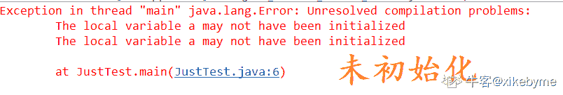
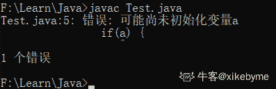
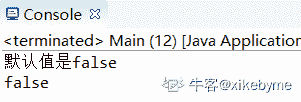
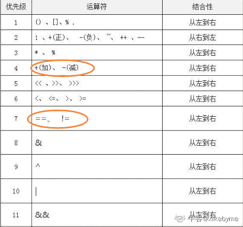
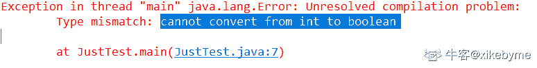
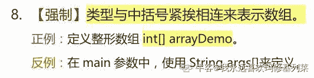
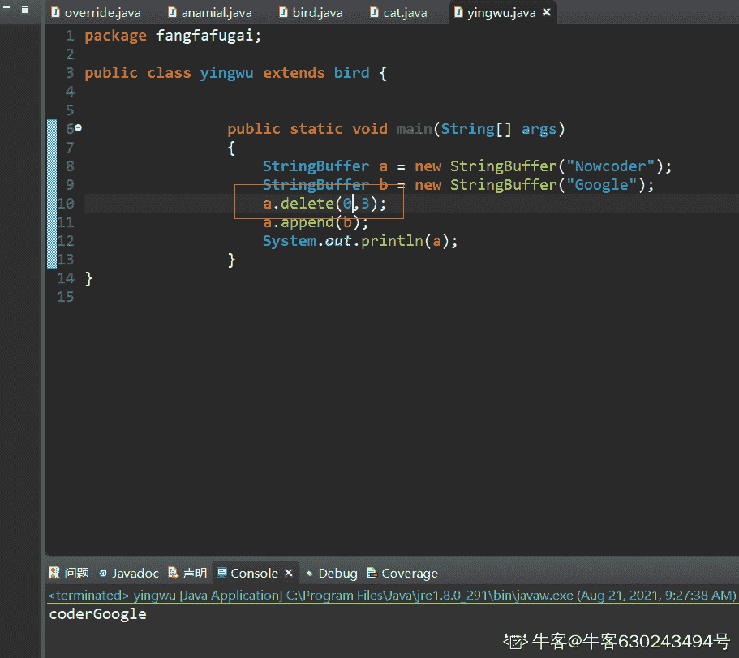

# Java 测验 1

## 1

以下哪个单词不是 Java 的关键字？

正确答案: B   你的答案: 空 (错误)

```cpp
static
```

```cpp
Boolean
```

```cpp
void
```

```cpp
private
```

本题知识点

Java 工程师

讨论

[上善若水 2560](https://www.nowcoder.com/profile/179366738)

java 关键字均为小写

发表于 2020-06-25 22:53:30

* * *

[Poison_I](https://www.nowcoder.com/profile/384232455)

Boolean 是 java 的封装类，属于标识符不属于关键字，标识符的定义:用于变量，方法名，类的命名的符号

发表于 2019-10-19 10:04:09

* * *

[牛客 763824126 号](https://www.nowcoder.com/profile/763824126)

1\. 标识符
规则：
（1）标识符由字母、下划线、美元符号和数字组成，长度不受限制。
（2）标识符的第一个字不能是数字字符。
（3）标识符不能是关键字
（4）标识符不能是 true、false 和 null（尽管 true、false 和 null 不是 Java 关键字）。

2\. 关键字
以下是 java 的 50 个关键字：
abstract，assert，boolean，break，byte，case，catch，char，class，const，continue，default，do，double，else，
enum，extends，final，finally，float，for，goto，if，implements，import，instanceof，int，interface，long，native，new，package，private，protected，public，return，short，static，strictfp，super，switch，synchronized，this，throw，throws，transient，try，void，volatile，while

发表于 2020-04-16 22:12:58

* * *

## 2

java main 函数写法正确的是？

正确答案: C   你的答案: 空 (错误)

```cpp
public static void main()
```

```cpp
public void main(String[] args)
```

```cpp
public static void main(String[] args)
```

```cpp
static void main(String[] args)
```

本题知识点

Java 工程师

## 3

boolean 类型的默认值为？

正确答案: B   你的答案: 空 (错误)

```cpp
true
```

```cpp
false
```

```cpp
null
```

```cpp
未定义
```

本题知识点

Java 工程师

讨论

[枸杞很好](https://www.nowcoder.com/profile/1977533)

怎么回事？？？

```cpp
public class JustTest {
    public static void main(String[] args) {
        boolean a;
        if(a) {
            System.out.println("成功");
        }
        System.out.println(a);
    }
}
```



命令行也是这样



但其实我错了，boolean a 后面啥都不写是基础 的语法层面的错误，不能这样写，编译时就错了，就谈不上默认值了。

可以这样写，写在类里才能看出默认值：

```cpp
class A{
    public static boolean var;
}
public class Main {

    public static void main(String[] args) {
        if(A.var) {
            System.out.println("默认值是 true");
        }else {
            System.out.println("默认值是 false");
        }
        System.out.println(A.var);
    }
}
```



编辑于 2020-03-10 19:35:04

* * *

[英语六级](https://www.nowcoder.com/profile/171218)

static 修饰的 boolean 变量默认是 false

发表于 2020-01-05 22:24:57

* * *

[牛客 832103836 号](https://www.nowcoder.com/profile/832103836)

记错

发表于 2020-03-29 23:31:02

* * *

## 4

以下代码输出正确的是？

```cpp
public class Test {
    public static void main(String[] args) {
        String s1 = "nowcoder";
        String s2 = "nowcoder";
        System.out.println("s1 == s2 is:" + s1 == s2);
    }
}

```

正确答案: D   你的答案: 空 (错误)

```cpp
ture
```

```cpp
s1 == s2 is:false
```

```cpp
s1 == s2 is:true
```

```cpp
false
```

本题知识点

Java 工程师

讨论

[hello~~world](https://www.nowcoder.com/profile/605384240)

"s1 == s2 is:" + s1 == s2 中，是先执行"s1 == s2 is:" + s1，结果为 s1 == s2 is:nowcoder，后再与 s2 进行比较，所以两边字符不同，输出为 false

发表于 2019-10-16 17:05:08

* * *

[枸杞很好](https://www.nowcoder.com/profile/1977533)

加号的优先级高于 “==”号，先执行

发表于 2019-11-16 19:38:31

* * *

[斯沃福德](https://www.nowcoder.com/profile/265831332)

关系运算符〉逻辑运算符 ！

发表于 2021-09-16 23:44:20

* * *

## 5

以下语句访问数组 arrOne 的第一个元素的是（）

正确答案: A   你的答案: 空 (错误)

```cpp
arrOne[0]
```

```cpp
arrOne[1]
```

```cpp
arrOne[2]
```

```cpp
arrOne[3]
```

本题知识点

Java 工程师 C++ C 语言

讨论

[牛客 288782177 号](https://www.nowcoder.com/profile/288782177)

生活中的第一个是 arrOne［0］ C 语言中的第一个是 arrOne［1］

发表于 2020-10-16 17:33:39

* * *

[长沙的雨](https://www.nowcoder.com/profile/492720615)

数组的索引从 0 开始

发表于 2019-12-23 12:41:05

* * *

[SpringOpen](https://www.nowcoder.com/profile/533169893)

Dfasdfasdfaaaaaaaaaaaa

编辑于 2021-11-09 17:37:12

* * *

## 6

以下代码，输出结果为：

```cpp
public class Test {
    public static void main(String args[]) { 
        int x=4; 
        System.out.println(x++); 
    } 
}

```

正确答案: D   你的答案: 空 (错误)

```cpp
output=0
```

```cpp
output=6
```

```cpp
output=5
```

```cpp
output=4
```

本题知识点

Java 工程师

讨论

[长沙的雨](https://www.nowcoder.com/profile/492720615)

前++是先做运算，后++是先出结果在做运算

发表于 2019-12-23 12:41:58

* * *

[程序员段誉](https://www.nowcoder.com/profile/6668929)

x++ 4
++x 5

发表于 2021-04-12 19:54:34

* * *

## 7

以下代码输出结果为：

```cpp
public class IfTest{
    public static void main(string[]args){
        int x=3;
        int y=1;
        if(x=y)
            System.out.println("不相等");
        else
            System.out.println("相等");
     }
}

```

正确答案: C   你的答案: 空 (错误)

```cpp
不相等
```

```cpp
相等
```

```cpp
第五行代码会引起编译错误
```

```cpp
程序正常执行，但没有输出结果
```

本题知识点

Java 工程师

讨论

[Poison_I](https://www.nowcoder.com/profile/384232455)

结果： 类型不匹配：不能从 int 转换为 boolean 解析： 1、java 中，赋值语句是有返回值的，赋值什么值就返回什么值。（x=y 赋值语句中，返回的是 int 1） 2、java 跟 C 的区别 （1）C 中赋值后，会与 0 进行比较，如果大于 0，if 为 true，否则返回 false； （2）而 java 中不会于 0 进行比较，而是直接把赋值后的结果放入括号中，而 if（存放 boolean 类型）。x=y 赋值语句中，返回的是 1，是 int 不能转化为 boolean

发表于 2019-10-19 10:11:52

* * *

[牛客 262828638 号](https://www.nowcoder.com/profile/262828638)

除了第五行编译错误之外，第二行的 public static void main(String[] args)也错了

发表于 2020-05-08 15:53:25

* * *

[枸杞很好](https://www.nowcoder.com/profile/1977533)

cannot convert from int to boolean

发表于 2019-11-16 19:42:10

* * *

## 8

float 变量的默认值为？

正确答案: B   你的答案: 空 (错误)

```cpp
0.0d
```

```cpp
0.0f
```

```cpp
0
```

```cpp
未定义
```

本题知识点

Java 工程师

讨论

[牛客 967562286 号](https://www.nowcoder.com/profile/967562286)

1 、整数类型（byte、short、int、long）的基本类型变量的默认值为 0。 2、单精度浮点型（float）的基本类型变量的默认值为 0.0f。 3、双精度浮点型（double）的基本类型变量的默认值为 0.0d。 4、字符型（char）的基本类型变量的默认为 “/u0000”。 5、布尔性的基本类型变量的默认值为 false。 6、引用类型的变量是默认值为 null。 7、数组引用类型的变量的默认值为 null。春关键数组变量的实例后，如果没有没有显示的为每个元素赋值，Java 就会把该数组的所有元素初始化为其相应类型的默认值。

发表于 2021-10-01 08:10:28

* * *

## 9

以下代码输出结果为？

```cpp
public class Test {
    public static void main(String[] args) {
        char c = 65;
        System.out.println("c = "+c);
    }
}

```

正确答案: C   你的答案: 空 (错误)

```cpp
c = 65
```

```cpp
执行错误
```

```cpp
c = A
```

本题知识点

Java 工程师

讨论

[枸杞很好](https://www.nowcoder.com/profile/1977533)

char c = 'A'+1; 最后 c 为'B'
int i = 'A' + 1 ; 最后 i 为 66char 类型以 int 存储，但和 int 的范围不一致，整数 65 对应 ASCALL 码中的‘A’

发表于 2019-11-16 19:48:18

* * *

[ZlineLL](https://www.nowcoder.com/profile/354956093)

注意看定义的是 char 类型，不是 int！！！！！！！

发表于 2021-09-18 11:07:45

* * *

[牛客 766017441 号](https://www.nowcoder.com/profile/766017441)

char 类型以 int 存储

发表于 2021-05-24 08:59:58

* * *

## 10

以下初始化 Java 数组的代码哪一个是正确的。

正确答案: D   你的答案: 空 (错误)

```cpp
int [] myArray = {"1","2","3"};
```

```cpp
int [] myArray = (5, 4, 3);
```

```cpp
int myArray [] [] = {1,2,3,4};
```

```cpp
int myArray [] = {1, 3, 5};
```

本题知识点

Java 工程师

讨论

[牛客 920460794 号](https://www.nowcoder.com/profile/920460794)

B 是小括号，需要大括号

发表于 2020-10-21 12:04:17

* * *

[TwoQL 强子](https://www.nowcoder.com/profile/230851597)

数组 array 里面的数据只需要逗号隔开就行了

发表于 2020-03-10 18:12:30

* * *

[菜鸡一条](https://www.nowcoder.com/profile/746544449)

A 是字符串。。。我傻了关于这个数组初始化，阿里 Java 规约里面建议写成 int[] myArray = {1，2，3}这种形式；

发表于 2021-03-15 11:48:43

* * *

## 11

以下代码输出结果为？

```cpp
class Test
{
    public static void main(String[] args)
    {
        StringBuffer a = new StringBuffer("Nowcoder");
        StringBuffer b = new StringBuffer("Google");
        a.delete(1,3);
        a.append(b);
        System.out.println(a);
    }
}

```

正确答案: B   你的答案: 空 (错误)

```cpp
coderGoogle
```

```cpp
NcoderGoogle
```

```cpp
NderGoogle
```

```cpp
NoderGoogle
```

本题知识点

Java 工程师

讨论

[秦时明月😹](https://www.nowcoder.com/profile/47942979)

 a.delete(1,3);  进行删除时是左包含右不包含,类似于随机数

发表于 2019-10-26 15:16:39

* * *

[牛客 630243494 号](https://www.nowcoder.com/profile/630243494)

a.delete(1,3)删除的是"Nowcoder"中第 2 个、第 3 个字符；结果是"Ncoder“如果换成 a.delete(0,3)，删除的是"Nowcoder"中第 1 个、第 2 个、第 3 个字符 coder" 意思就是从左边的数字+1 处开始删除，一直到右边数字结束。 

编辑于 2021-08-21 09:28:39

* * *

[BugCodingCoder](https://www.nowcoder.com/profile/3410418)

public StringBuffer delete(int start, int end)start  - 起始索引(包括)。end - 结束索引(不包括)。

发表于 2021-09-17 14:00:15

* * *