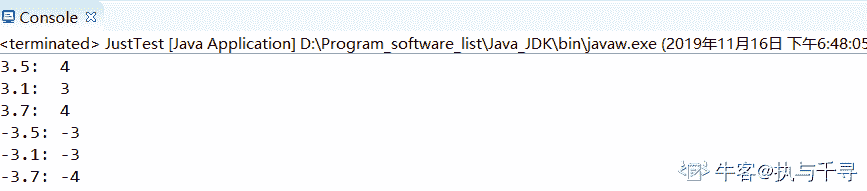

# Java 测验 2

## 1

以下哪个类可以访问所有（子类与超类）的 public 和 protected 方法 ?

正确答案: C   你的答案: 空 (错误)

```cpp
内部类
```

```cpp
外部类
```

```cpp
子类
```

```cpp
超类
```

本题知识点

Java 工程师

讨论

[耿锐](https://www.nowcoder.com/profile/113789748)

protected 为保护类型，同一个包里和 public 一样，都可以访问到。但在不同包里 protected 类型的成员变量只能通过子类来访问，方法可通过 super.方法名调用。

发表于 2020-03-01 11:18:48

* * *

## 2

哪个修饰符定义了方法与属性只能在同一个类中访问？

正确答案: D   你的答案: 空 (错误)

```cpp
Public
```

```cpp
Protected
```

```cpp
Default
```

```cpp
Private
```

本题知识点

Java 工程师

## 3

Java 中 float 类型的在内存中的大小为多少字节？

正确答案: B   你的答案: 空 (错误)

```cpp
8
```

```cpp
4
```

```cpp
2
```

```cpp
16
```

本题知识点

Java 工程师

讨论

[枸杞很好](https://www.nowcoder.com/profile/1977533)

8 bits 是一个字节

| 基本类型 | 大小 | 最小值 | 最大值 | 包装器类型 |
| --- | --- | --- | --- | --- |
| boolean | - | - | - | Boolean |
| char | 16-bit | Unicode 0 | Unicode 2¹⁶-1 | Character |
| byte | 8 bits | -128 | +127 | Byte |
| short | 16 bits | -2¹⁵ | +2¹⁵-1 | Short |
| int | 32 bits | -2³¹ | +2³¹-1 | Integer |
| long | 64 bits | -2⁶³ | +2⁶³-1 | Long |
| float | 32 bits | IEEE754 | IEEE754 | Float |
| double | 64 bits | IEEE754 | IEEE754 | Double |
| void | - | - | - | Void |

发表于 2019-11-16 18:23:45

* * *

[青春渐离](https://www.nowcoder.com/profile/883163570)

8bits 为一个字姐

发表于 2019-11-15 14:44:03

* * *

## 4

以下实例，输出结果为：

```cpp
public class Test { 
    public static void main(String args[]) { 
        int x=4; 
        System.out.println(x++); 
    } 
}

```

正确答案: D   你的答案: 空 (错误)

```cpp
0
```

```cpp
6
```

```cpp
5
```

```cpp
4
```

本题知识点

Java 工程师

讨论

[牛客 471915723 号](https://www.nowcoder.com/profile/471915723)

先输出，后运算

发表于 2020-02-28 12:05:05

* * *

## 5

Java 中变量不一定要初始化？

正确答案: B   你的答案: 空 (错误)

```cpp
正确
```

```cpp
错误
```

本题知识点

Java 工程师

讨论

[_ 仅此、而已](https://www.nowcoder.com/profile/6824766)

没初始化会自动初始化,可以提高代码的安全性

发表于 2019-11-07 20:50:06

* * *

[大雄二](https://www.nowcoder.com/profile/703567468)

这题谁出的，垃圾

发表于 2021-04-20 11:47:05

* * *

[刷题狂魔啊](https://www.nowcoder.com/profile/5258558)

局部变量一定要初始化  成员变量不需要初始化

发表于 2020-11-30 18:25:01

* * *

## 6

Java 中一个类可以继承多个类（extends 后面跟上多个类）？

正确答案: B   你的答案: 空 (错误)

```cpp
正确
```

```cpp
错误
```

本题知识点

Java 工程师

讨论

[枸杞很好](https://www.nowcoder.com/profile/1977533)

java 中的类只能单继承，即一个父类可以有多个子类，但是一个子类只能有一个父类

发表于 2019-11-16 19:13:37

* * *

## 7

Math.round(3.7) 输出结果为？

正确答案: A   你的答案: 空 (错误)

```cpp
4
```

```cpp
3.7
```

```cpp
3
```

```cpp
0
```

本题知识点

Java 工程师

讨论

[五叨](https://www.nowcoder.com/profile/476670053)

round()----四舍五入 ceil()---向上取整，整数部分加 1floor()---向下取整，只留整数部分

发表于 2021-06-12 13:46:39

* * *

[枸杞很好](https://www.nowcoder.com/profile/1977533)

解析：


> double 参数用的多，是返回与参数最接近的 long 值,如果有两个距离相同，取较大的那个。如 3.5 距离 3 和 4 相同，但是 4 更大，就是 4

代码展示

```cpp
public class JustTest {
    public static void main(String[] args) {
        System.out.println("3.5:  " + Math.round(3.5));
        System.out.println("3.1:  " + Math.round(3.1));
        System.out.println("3.7:  " + Math.round(3.7));
        System.out.println("-3.5: " + Math.round(-3.5));
        System.out.println("-3.1: " + Math.round(-3.1));
        System.out.println("-3.7: " + Math.round(-3.7));
    }
}
```



发表于 2019-11-16 18:56:55

* * *

[牛客 832103836 号](https://www.nowcoder.com/profile/832103836)

加 0.5 向下取整

发表于 2020-03-29 23:36:52

* * *

## 8

Java 支持 goto 关键字吗？

正确答案: B   你的答案: 空 (错误)

```cpp
支持
```

```cpp
不支持
```

本题知识点

Java 工程师

讨论

[枸杞很好](https://www.nowcoder.com/profile/1977533)

在 java 语言中，goto 这个词只是作为了保留字（关键字），但不能使用

发表于 2019-11-16 19:17:03

* * *

## 9

线程结束后可以重新 start 吗？

正确答案: B   你的答案: 空 (错误)

```cpp
可以
```

```cpp
不可以
```

本题知识点

Java 工程师

讨论

[牛客 948945747 号](https://www.nowcoder.com/profile/948945747)

线程生命周期：新建，就绪，执行，阻塞，死亡。死亡后释放 cpu 资源，不能重复启动

发表于 2020-08-14 13:27:46

* * *

[枸杞很好](https://www.nowcoder.com/profile/1977533)

run()方法: 在本线程内调用该 Runnable 对象的 run()方法，可以重复多次调用；
start()方法: 启动一个线程，调用该 Runnable 对象的 run()方法，不能多次启动一个线程

发表于 2019-11-16 19:19:41

* * *

[牛客 409108510 号](https://www.nowcoder.com/profile/409108510)

我是有点没明白,我线程都结束了,我就不能启动这个线程了,线程只能启动一次吗?那这样的我主机宕机了,线程结束了,怎么办?

发表于 2021-10-28 11:08:45

* * *

## 10

实现 Runnable 接口，必须重写 Runnable 的哪个方法？

正确答案: C   你的答案: 空 (错误)

```cpp
start()
```

```cpp
sleep()
```

```cpp
run()
```

```cpp
wait()
```

本题知识点

Java 工程师

## 11

所有异常类的基类是？

正确答案: B   你的答案: 空 (错误)

```cpp
Java.throwable
```

```cpp
Java.Lang.throwable
```

```cpp
Java.Lang.Exception
```

```cpp
Java.Lang.throwables
```

本题知识点

Java 工程师

讨论

[枸杞很好](https://www.nowcoder.com/profile/1977533)

所有异常类都是 Throwable 的子类

发表于 2019-11-16 19:23:53

* * *

[五叨](https://www.nowcoder.com/profile/476670053)

异常类的超类，Throwable 下面的分支是 error---运行时错误，编译器不报错，不需要你管，除非你的编程逻辑出问题了，需要改的局部是一点点了                     Exception--编译期的错误，使用工具的话会报错，这时候需要捕获或者抛出，具体做法如下   1.通过关键字 throws 在类名后抛出   2.通过 try{}catch(){}捕获即可

发表于 2021-06-12 13:52:40

* * *

[耿锐](https://www.nowcoder.com/profile/113789748)

Throwable 是 Error 和 Exception 的父类

发表于 2020-03-01 11:26:16

* * *