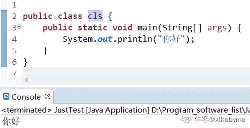

# java 测验 3

## 1

如果条件仅在两个布尔语句全为真时才为真 ，那么在两个布尔语句之间应当放置的正确符号为（）

正确答案: C   你的答案: 空 (错误)

```cpp
！
```

```cpp
||
```

```cpp
&&
```

本题知识点

Java 工程师 C++

讨论

[枸杞很好](https://www.nowcoder.com/profile/1977533)

是与，两者为真，判断表达式才为真

发表于 2019-11-17 10:38:19

* * *

[YHshare](https://www.nowcoder.com/profile/179761260)

C

发表于 2021-03-26 12:23:28

* * *

[牛客 66052432 号](https://www.nowcoder.com/profile/66052432)

c

编辑于 2021-03-22 23:11:32

* * *

## 2

为此值选择适当的数据类型：5.5

正确答案: B   你的答案: 空 (错误)

```cpp
int
```

```cpp
double
```

```cpp
boolean
```

```cpp
String
```

本题知识点

Java 工程师

## 3

面向对象编程意味着……

正确答案: A   你的答案: 空 (错误)

```cpp
根据分析问题时发现的对象设计应用程序
```

```cpp
在编写程序并制定测试计划之前编写算法
```

```cpp
编写由 Java 类组成的程序
```

本题知识点

Java 工程师

讨论

[枸杞很好](https://www.nowcoder.com/profile/1977533)

容易选 C,面向对象编程不一定是用 java 编程

发表于 2019-11-17 10:40:36

* * *

[大同小伙](https://www.nowcoder.com/profile/365025981)

坑·！

发表于 2019-11-14 17:28:23

* * *

## 4

以下哪项不是 Java 关键字？

正确答案: C   你的答案: 空 (错误)

```cpp
static
```

```cpp
try
```

```cpp
Integer
```

```cpp
new
```

本题知识点

Java 工程师

## 5

Java main 方法的正确语法是什么？

正确答案: D   你的答案: 空 (错误)

```cpp
public void main(String[] args)
```

```cpp
public static void main(string[] args)
```

```cpp
public static void main()
```

```cpp
其他都不对
```

本题知识点

Java 工程师

讨论

[炸毛的饭团](https://www.nowcoder.com/profile/685909479)

第二个选项的 string 中的 s 应为大写，很容易一不小心就看错了

发表于 2019-10-21 16:39:58

* * *

[大同小伙](https://www.nowcoder.com/profile/365025981)

坑！！！

发表于 2019-11-14 17:30:23

* * *

[Wawrinka](https://www.nowcoder.com/profile/766753253)

好家伙这考视力呢😊

发表于 2021-11-06 16:11:43

* * *

## 6

一个对象可能是……

正确答案: A   你的答案: 空 (错误)

```cpp
任何事物
```

```cpp
算法
```

```cpp
一个数据容器
```

```cpp
一个程序
```

本题知识点

Java 工程师

讨论

[文昶清](https://www.nowcoder.com/profile/148271741)

万物皆对象

发表于 2019-12-16 20:48:44

* * *

[龙上洪](https://www.nowcoder.com/profile/824985412)

万物皆对象

发表于 2020-09-30 17:47:52

* * *

[为道日损](https://www.nowcoder.com/profile/8232679)

万物皆对象 万物皆对象 万物皆对象

发表于 2020-07-23 17:56:24

* * *

## 7

为此字段选择适当的数据类型：isSwimmer

正确答案: B   你的答案: 空 (错误)

```cpp
double
```

```cpp
boolean
```

```cpp
String
```

```cpp
int
```

本题知识点

Java 工程师

讨论

[haoyuxingchen](https://www.nowcoder.com/profile/352625767)

```cpp
is 开头的命名方式一般用于布尔值判断
```

发表于 2020-02-12 17:08:39

* * *

## 8

Java 关键字不区分大小写。

正确答案: B   你的答案: 空 (错误)

```cpp
True
```

```cpp
False
```

本题知识点

Java 工程师

讨论

[牛客刘永田](https://www.nowcoder.com/profile/923667280)

java 关键字开头均为小写

发表于 2020-03-14 16:54:24

* * *

## 9

空引用可用于访问静态变量或方法 ？

正确答案: A   你的答案: 空 (错误)

```cpp
正确
```

```cpp
错误
```

本题知识点

Java 工程师 C++

讨论

[枸杞很好](https://www.nowcoder.com/profile/1977533)

静态方法属性不属于（依赖）特定的对象，而属于类本身，所以可以用

```cpp
class Myclass{
    public static String name = "小单";
    public static void gain() {
        System.out.println("加油，小伙！");
    }
}
public class JustTest {

    public static void main(String[] args) {
        Myclass my = null;
        System.out.println(my.name);
        my.gain();
    }
}
```


发表于 2019-11-17 10:49:33

* * *

[杉杉来啦](https://www.nowcoder.com/profile/243827773)

1\. 所引用对象是否为 null 无关紧要，因为访问静态方法不需要实例对象。 
2\. 如果引用不为 null，运行时对象类型也无关紧要，因为静态调用不会导致动态调用分派。而是与类相关。

发表于 2020-08-15 11:33:14

* * *

[zephyr_c](https://www.nowcoder.com/profile/254460328)

当我们通过一个对象的引用访问静态成员属性或者方法时 ，访问操作只与所声明的引用类型相关 ；与引用对象是否为 null 无关 ，因为访问静态成员不需要实例化对象 ；即便引用不为 null ，也与运行时多态无关 ，因为静态成员是类相关的 。

发表于 2020-07-04 22:42:06

* * *

## 10

Empty.java 文件名是否是有效的源文件名 ？

正确答案: A   你的答案: 空 (错误)

```cpp
是
```

```cpp
否
```

本题知识点

Java 工程师

讨论

[枸杞很好](https://www.nowcoder.com/profile/1977533)

1.  Java 程序源文件的后缀必须是 .java，不能是其他文件后缀名。
2.  如果 Java 程序源代码里定义了一个 public 类，则该源文件的主文件名必须与该 public 类（也就是该类定义使用了 public 关键字修饰）的类名相同。
3.  如果 Java 程序源代码里没有定义任何 public 类，那么 Java 程序源程序的主文件名可以是任意的。
4.  由于 Java 程序源文件的文件名必须与 public 类的类名相同，因此，一个 Java 源文件里最多只能定义一个 public 类。
    ————————————————
    版权声明：本文为 CSDN 博主「PursueLuo」的原创文章，遵循 CC 4.0 BY-SA 版权协议，转载请附上原文出处链接及本声明。
    原文链接：[`blog.csdn.net/PursueLuo/article/details/81947316`](https://blog.csdn.net/PursueLuo/article/details/81947316)

试了下小写开头的类名，可以，但不建议




发表于 2019-11-17 10:57:49

* * *

[刷题为王](https://www.nowcoder.com/profile/623986222)

Java 中定义类名的规则很宽松。名字必须以字母开头，后面可以跟字母和数字的任意组合。 长度基本上没有限制。但是不能使用 Java 保留字（例如，public 或 class）作为类名。关键字列表(依字母排序共 51 组):abstract, assert,boolean, break, byte, case, catch, char, class, const, continue, default, do, double, else, enum,extends, final, finally, float, for, if, implements, import, instanceof, int, interface, long, native, new,package, private, protected, public, return, short,static, strictfp, super,switch, synchronized,this, throw, throws, transient,try, void, volatile, while。 保留字列表 (依字母排序共 14 组) : Java 保留字是指现有 Java 版本尚未使用但以后版本可能会作为关键字使用。
byValue, cast, false, future, generic, inner, operator, outer, rest, true, var , goto ，const,null。 

发表于 2020-09-03 10:49:03

* * *

[牛客 172720610 号](https://www.nowcoder.com/profile/172720610)

不是不应该有关键字吗

发表于 2020-04-21 23:17:13

* * *

## 11

 确保循环不是无限的必要条件是什么 ？ 

正确答案: D   你的答案: 空 (错误)

```cpp
你的布尔语句在某些时候会是假的
```

```cpp
在代码中的某处有一个布尔语句
```

```cpp
你的布尔语句在某些时候是真的
```

```cpp
以上所有条件
```

本题知识点

Java 工程师

讨论

[Lust1218](https://www.nowcoder.com/profile/893047603)

充分和必要不是两个词吗

发表于 2022-03-21 00:36:00

* * *

[牛客 140896412 号](https://www.nowcoder.com/profile/140896412)

题目问的是必要条件，也就相当于 “已知循环不是无限的，则下列哪个选项可能正确”

发表于 2022-01-07 10:17:12

* * *

[Wawrinka](https://www.nowcoder.com/profile/766753253)

这个是什么题目？无语

发表于 2021-11-06 16:13:08

* * *

## 12

在“for”循环中，循环的哪一部分不包括在“for”之后的括号中 ？

正确答案: B   你的答案: 空 (错误)

```cpp
初始化
```

```cpp
循环体
```

```cpp
布尔表达式
```

```cpp
更新部分
```

本题知识点

Java 工程师

讨论

[牛客刘永田](https://www.nowcoder.com/profile/923667280)

循环提在大括号中

发表于 2020-03-14 16:55:14

* * *

[夏商西周 201712131650409](https://www.nowcoder.com/profile/9944439)

for 里面有 for 有什么问题吗？？？？？？？

发表于 2021-10-21 13:38:07

* * *

## 13

以下选项哪一个不正确 ？

正确答案: C   你的答案: 空 (错误)

```cpp
类在使用之前，一般需要将类实例化为对象
```

```cpp
类运行时内存中存在对象
```

```cpp
类和对象只是同一个东西的不同名称
```

```cpp
对象是一个变量，其类型是用于声明变量的类。
```

本题知识点

Java 工程师

讨论

[牛客 964203338 号](https://www.nowcoder.com/profile/964203338)

类是对象的抽象，对象是类的具体形式

发表于 2021-04-09 14:53:11

* * *

[刷题为王](https://www.nowcoder.com/profile/623986222)

为啥不选 a

发表于 2020-09-03 10:54:50

* * *

[青春渐离](https://www.nowcoder.com/profile/883163570)

类变量，类方法在使用之前也不需要将类实例化为对象啊？

发表于 2019-11-15 14:59:32

* * *

## 14

以下代码将导致：

```cpp
int a1 = 5;     
double a2 =(float)a1;

```

正确答案: C   你的答案: 空 (错误)

```cpp
编译错误
```

```cpp
运行期错误
```

```cpp
没有错误
```

```cpp
运行时异常
```

本题知识点

Java 工程师 C++

讨论

[枸杞很好](https://www.nowcoder.com/profile/1977533)

double 的范围要比 float 的范围大，float 要比 int 的范围大

类型转换分两种：

1.  自动类型转换（隐式）
    *   特点： 代码不需要进行特殊处理，自动完成
    *   规则： 数据范围从小到大
    *   安全性：安全
2.  强制类型转换
    *   特点：代码需要进行特殊的格式处理，不能自动完成
    *   格式：范围小的类型 范围小的变量名 = (范围小的类型) 原本范围大的数据
    *   安全性：不安全

发表于 2020-08-06 15:25:08

* * *

[一只向前](https://www.nowcoder.com/profile/547009355)

自动类型转换：

发表于 2020-04-23 18:28:17

* * *

[牛客 434938674 号](https://www.nowcoder.com/profile/434938674)

小转大可以不能大转小

发表于 2019-12-20 12:28:42

* * *

## 15

Java 中可以将布尔值与整数进行比较吗 ？

正确答案: B   你的答案: 空 (错误)

```cpp
可以
```

```cpp
不可以
```

本题知识点

Java

讨论

[枸杞很好](https://www.nowcoder.com/profile/1977533)


发表于 2019-11-17 11:05:36

* * *

[努力学习的张先生](https://www.nowcoder.com/profile/973102247)


发表于 2021-05-06 20:17:11

* * *

[执梗](https://www.nowcoder.com/profile/450534637)

**这题目是想让人把 Java 和 C 语言搞混，在 C 语言中，当数字作为判定条件时，默认会把大于 0 的数当成 true，否则为 false。但是 Java 并不支持这一点，谨记！**

发表于 2021-12-10 09:46:17

* * *

## 16

基础数据类型在堆栈上分配？

正确答案: B   你的答案: 空 (错误)

```cpp
是
```

```cpp
否
```

本题知识点

Java 工程师

讨论

[枸杞很好](https://www.nowcoder.com/profile/1977533)

基本数据类型好像直接分配到栈上了，而引用数据类型才是分配到堆栈上

[一个好的博客上---》有解析](https://www.cnblogs.com/qianjinyan/p/10352749.html)

发表于 2019-11-17 11:20:58

* * *

[牛客 576370820 号](https://www.nowcoder.com/profile/576370820)

Java 内存目前我知道的有栈区,堆区,方法区, main 方法中基础数据类型是在战中啊,假如该源文件还有其他的工具类,其中的属性变量也是基础数据类型 那不是在堆中直接分配了吗。

发表于 2022-01-08 22:57:45

* * *

[刷题狂魔啊](https://www.nowcoder.com/profile/5258558)

栈使用的是[一级缓存](https://baike.baidu.com/item/%E4%B8%80%E7%BA%A7%E7%BC%93%E5%AD%98)， 他们通常都是被调用时处于存储空间中，调用完毕立即释放。堆则是存放在[二级缓存](https://baike.baidu.com/item/%E4%BA%8C%E7%BA%A7%E7%BC%93%E5%AD%98)中，生命周期由虚拟机的垃圾回收算法来决定（并不是一旦成为孤儿对象就能被回收）。所以调用这些对象的速度要相对来得低一些。

发表于 2020-11-30 20:39:02

* * *

## 17

以下代码将导致：

```cpp
int num = 6.7

```

正确答案: A   你的答案: 空 (错误)

```cpp
编译错误
```

```cpp
运行期错误
```

```cpp
num 是 6.7
```

```cpp
num 为 6
```

本题知识点

Java 工程师 C++ C 语言

讨论

[牛客 263760302 号](https://www.nowcoder.com/profile/263760302)

分号都成考点了？？

发表于 2020-09-07 20:59:28

* * *

[望尘 gg](https://www.nowcoder.com/profile/468416174)

加了分号的话是运行期错误吧，没有写 mian 函数

发表于 2020-10-24 03:16:29

* * *

[小六喜欢赵小刀](https://www.nowcoder.com/profile/860595925)

注意力全在数字上结果考了分号……！！！

发表于 2020-09-18 14:07:42

* * *