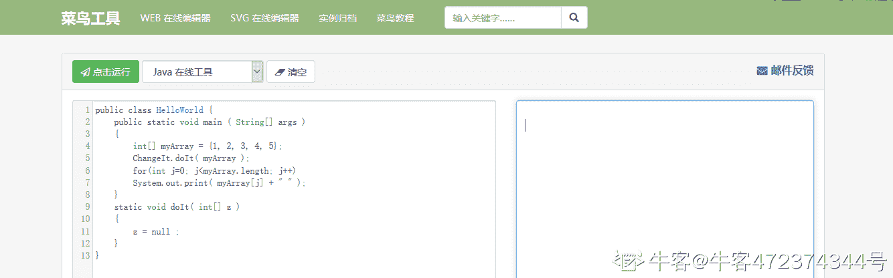
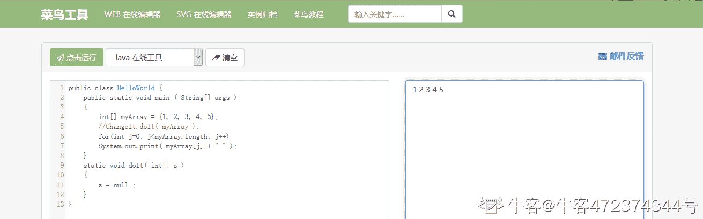
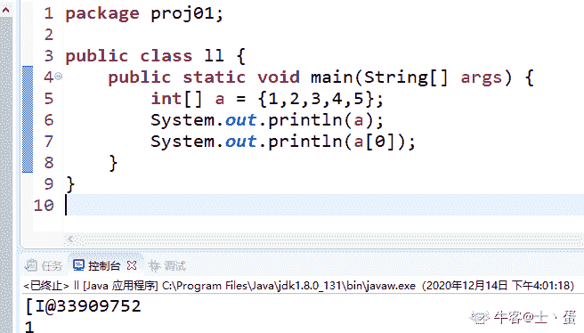
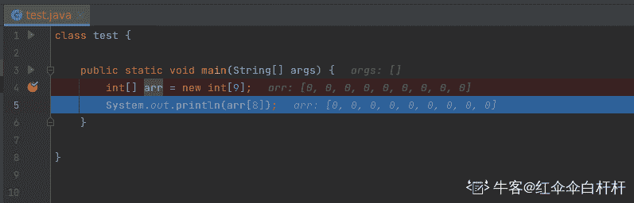

# java 测验 4

## 1

以下输出是什么 ？

```cpp
class TestIt
{
    public static void main ( String[] args )
    {
        int[] myArray = {1, 2, 3, 4, 5};
        ChangeIt.doIt( myArray );
        for(int j=0; j<myArray.length; j++)
            System.out.print( myArray[j] + " " );
    }
}
class ChangeIt
{
    static void doIt( int[] z ) 
    {
        z = null ;
    }
}

```

正确答案: A   你的答案: 空 (错误)

```cpp
1 2 3 4 5
```

```cpp
什么都不会打印出来
```

```cpp
程序将因运行时错误而停止
```

```cpp
0 0 0 0 0
```

本题知识点

Java 工程师

讨论

[牛客 472374344 号](https://www.nowcoder.com/profile/472374344)



发表于 2020-03-11 21:44:21

* * *

[士丶蛋](https://www.nowcoder.com/profile/250474446)

看图，直接输出数组 a 会默认输出数组 a 的地址，而不是值，所以将 null 赋值给 z 其实只是将 z 的地址值改变为 null，而不会影响到原来的数组 myArray 的值，但如果是以数组 a[0]这种形式，则是属于引用，传入的将是一个值。所以第一题数组值不变，第二题则会改变

发表于 2020-12-14 16:16:24

* * *

[幕落](https://www.nowcoder.com/profile/726921981)

java 中只有值传递，所谓的引用传递，实际上是传了一个地址（本质上也是一个值），所以此处我们可以看做 myArray=xxx，z=xxx，他们两个有相同的地址值，然后 z=null，z 的地址值被赋为了空，并不会影响 myArray=xxx

发表于 2020-02-13 23:58:08

* * *

## 2

以下输出是什么 ？

```cpp
class LowHighSwap
{
    static void doIt( int[] z )
    {
        int temp = z[z.length-1];
        z[z.length-1] = z[0];
        z[0] = temp;
    }
}

class TestIt
{
    public static void main( String[] args )
    {
        int[] myArray = {1, 2, 3, 4, 5};
        LowHighSwap.doIt(myArray);
        for (int i = 0; i < myArray.length; i++)
        {
            System.out.print(myArray[i] + " ");
        }
    }
}

```

正确答案: B   你的答案: 空 (错误)

```cpp
1 2 3 4 5
```

```cpp
5 2 3 4 1
```

```cpp
1 2 3 4 1
```

```cpp
5 2 3 4 5
```

本题知识点

Java 工程师

讨论

[Poison_I](https://www.nowcoder.com/profile/384232455)

引用传递改变的是地址中的值，指向的地址是无法改变的

发表于 2019-10-19 10:49:04

* * *

## 3

声明一个数组 ：

```cpp
int [] ar = {1,2,3,4,5};

```

ar [4] 的值是多少 ？

正确答案: D   你的答案: 空 (错误)

```cpp
2
```

```cpp
3
```

```cpp
4
```

```cpp
5
```

本题知识点

Java 工程师

## 4

如果我们声明：

```cpp
int [] ar = {1,2,3,4,5,6};

```

数组 ar 的大小是 ：

正确答案: C   你的答案: 空 (错误)

```cpp
0
```

```cpp
5
```

```cpp
6
```

```cpp
7
```

本题知识点

Java 工程师

讨论

[牛客 6077035 号](https://www.nowcoder.com/profile/6077035)

这个纯属出题的表达不清楚，不是求值的大小，题目问的就是数组的长度

发表于 2020-07-21 17:21:28

* * *

[🌎miss 孙](https://www.nowcoder.com/profile/36934954)

数组大小也就是数组长度，数组长度始终比数组下标多一个，因为数组下标从 0 开始，而数组长度是指数组元素的个数

发表于 2019-10-16 11:13:20

* * *

## 5

以下输出是什么 ？

```cpp
class ChangeIt
{
    static void doIt( int[] z )
    {
        int[] A = z;
        A[0] = 99;
    }
}

class TestIt
{
    public static void main( String[] args )
    {
        int[] myArray = {1, 2, 3, 4, 5};
        ChangeIt.doIt(myArray);
        for (int i = 0; i < myArray.length; i++)
        {
            System.out.print(myArray[i] + " ");
        }
    }
}

```

正确答案: B   你的答案: 空 (错误)

```cpp
1 2 3 4 5
```

```cpp
99 2 3 4 5
```

```cpp
0 2 3 4 5
```

```cpp
99 99 99 99 99
```

本题知识点

Java 工程师

讨论

[XianPeng](https://www.nowcoder.com/profile/164956008)

A 相当于 z 的别名（引用）

发表于 2019-10-17 17:15:20

* * *

[氼乚廾匸](https://www.nowcoder.com/profile/960285202)

```cpp
class ChangeIt
{
    static void doIt( int[] z )
    {
        int[] A = z;
        A[0] = 99;
    }
}
 // 这段代码就相当于是改变了下标 0 的原始数，而其他调用这个类的时候也就改变了相应原位置的数
```

发表于 2020-10-08 18:56:48

* * *

## 6

以下哪个循环将在一个单独的行中显示此数组中的所有数字 ：

```cpp
float [] nums = {1.1f，2.2f，3.3f};

```

正确答案: A   你的答案: 空 (错误)

```cpp
for (int i =0; i &lt; 3; i++) System.out.print( nums[i]);
```

```cpp
for (i = 1; i &lt; 2; i++) System.out.print( nums[i]);
```

```cpp
for (i = 0; i &lt; 2; i++) System.out.print( nums[i]);
```

```cpp
for (i = 1; i &lt; 3; i++) System.out.print(nums[i]);
```

本题知识点

Java 工程师

讨论

[cowoco](https://www.nowcoder.com/profile/613339180)

```cpp
&lt;

```

应该是相当于＜

发表于 2020-04-18 19:53:02

* * *

[De 梦](https://www.nowcoder.com/profile/583846419)

```cpp
  float [] nums = {1.1f,2.2f,3.3f};
        for (int i =0; i < 3; i++) {
            System.out.print( nums[i]);
        }
```

发表于 2022-02-24 16:42:23

* * *

[根本不牛](https://www.nowcoder.com/profile/395525669)

1.lt 相当于<2.i 前面不加 int 不出错吗？

发表于 2020-05-20 23:28:30

* * *

## 7

下面这个方法实现什么功能 ？

```cpp
void blur(char[] z, String st)
{
    if(z.length < st.length()) return;;
    for (int i = 0; i < st.length(); i++) {
        z[i] = st.charAt(i);
    }
}

```

正确答案: D   你的答案: 空 (错误)

```cpp
它确定数组是否包含与 String 相同的字符。
```

```cpp
它将数组中的字符复制到 String。
```

```cpp
它创建一个包含与 String 相同字符的新数组。
```

```cpp
如果数组中有足够的空间，则会将字符串中的字符逐个复制到数组中。
```

本题知识点

Java 工程师

讨论

[菜鸟四号](https://www.nowcoder.com/profile/1366555)

这题我觉得 C 也可以呀，感觉 CD 都是对的，只是 D 在描述上更恰当吧，纠结半天选了 C，结果错了

发表于 2019-10-31 19:38:10

* * *

[牛客 303860747 号](https://www.nowcoder.com/profile/303860747)

这里为啥用 return?返回的是什么？

发表于 2022-02-20 02:43:30

* * *

## 8

哪一个选项可以在索引处找到名为 ar 的数组中的最后一个值？

正确答案: D   你的答案: 空 (错误)

```cpp
0
```

```cpp
1
```

```cpp
ar.length
```

```cpp
ar.length - 1
```

本题知识点

Java 工程师

讨论

[根本不牛](https://www.nowcoder.com/profile/395525669)

a 长度为 2 的话 a[2-1]就是 a[1]才是最后一位

发表于 2020-05-20 23:30:05

* * *

## 9

数组是一个？

正确答案: B   你的答案: 空 (错误)

```cpp
相同数据类型的相同值
```

```cpp
相同的数据类型，值可相同，也可不同
```

```cpp
不同数据类型的相同值
```

```cpp
不同数据类型的不同值
```

本题知识点

Java 工程师

## 10

Java 使用按值调用。 以下方法调用传递给程序的值是多少 ？

```cpp
double[] rats = {1.2, 3.4, 5.6};
routine( rats );

```

 正确答案: C   你的答案: 空 (错误)

```cpp
rats 的副本
```

```cpp
rats 数组元素的值
```

```cpp
rats 数组的引用
```

```cpp
1.2
```

本题知识点

Java 工程师

讨论

[一只弱小的 Kid](https://www.nowcoder.com/profile/1733825)

答案 : C 在 Java 中 数组也是对象 对象中传递的都是引用的复制。

发表于 2021-03-22 18:28:42

* * *

[牛客 624788083 号](https://www.nowcoder.com/profile/624788083)

routine 是已经定义好的方法因为数组是引用类型 给方法  传递的实参（数组对象）是数组的地址

发表于 2021-11-01 14:11:09

* * *

[loong9527](https://www.nowcoder.com/profile/606720402)

这出的什么题，routine 是啥都不知道

发表于 2021-03-22 17:22:24

* * *

## 11

以下代码的输出是什么 ？

```cpp
int[] arr = new int[9];
System.out.println(arr[9]);

```

正确答案: D   你的答案: 空 (错误)

```cpp
0
```

```cpp
9
```

```cpp
错误，因为数组未初始化
```

```cpp
错误，因为索引超出范围
```

本题知识点

Java 工程师

讨论

[牛客 230723698 号](https://www.nowcoder.com/profile/230723698)

这个数组的长度为 9 所以最多就是 arr[8]

发表于 2021-10-07 21:21:55

* * *

[红伞伞白杆杆](https://www.nowcoder.com/profile/50737592)



发表于 2022-02-22 15:22:48

* * *

## 12

以下数组最高索引值是多少 ？

```cpp
byte[] values = new byte[x];

```

正确答案: C   你的答案: 空 (错误)

```cpp
0
```

```cpp
x
```

```cpp
x-1
```

```cpp
x+1
```

本题知识点

Java 工程师

讨论

[为道日损](https://www.nowcoder.com/profile/8232679)

哎，这门简单，我竟然选错了，扇自己一巴掌

发表于 2020-07-23 17:48:55

* * *

## 13

以下程序段的输出是什么 ？

```cpp
int[] num7 = {1, 3, 5, 2, 8, 9, 5, 0};
int x7 = num7[0];
for (int i = 0; i <= num7.length-1; i++)
{
    if(num7[i] < x7)
    {
        x7 = num7[i];
    }
}
System.out.println(x7); 

```

正确答案: C   你的答案: 空 (错误)

```cpp
1
```

```cpp
9
```

```cpp
0
```

```cpp
都不是
```

本题知识点

Java 工程师

讨论

[大同小伙](https://www.nowcoder.com/profile/365025981)

坑！

发表于 2019-11-14 17:50:59

* * *

[Lunatic23](https://www.nowcoder.com/profile/381065537)

我要去看眼科了，数组最后的那个零我竟然没看到

发表于 2020-06-19 16:41:45

* * *

## 14

以下数组的长度是？

```cpp
int[] grades = new int[4];

```

正确答案: C   你的答案: 空 (错误)

```cpp
0
```

```cpp
3
```

```cpp
4
```

```cpp
5
```

本题知识点

Java 工程师

讨论

[牛客 832103836 号](https://www.nowcoder.com/profile/832103836)

坑

发表于 2020-03-30 00:13:35

* * *

## 15

以下代码打印到控制台的数字是多少 ？

```cpp
int[] numbers = {1, 2, 3, 4, 5, 6, 7, 8, 9};
for (int i = 0; i < 8; i++) {
    System.out.println(numbers[i]);
}

```

正确答案: D   你的答案: 空 (错误)

```cpp
0-9
```

```cpp
0-8
```

```cpp
1-9
```

```cpp
1-8
```

本题知识点

Java 工程师

讨论

[氼乚廾匸](https://www.nowcoder.com/profile/960285202)

```cpp
int[] numbers = {1, 2, 3, 4, 5, 6, 7, 8, 9};
for (int i = 0; i <=8; i++) {
    System.out.println(numbers[i]);
}
// 这样打印出来的就是 1-9
```

发表于 2020-10-08 18:51:33

* * *

[想学编程的樱木](https://www.nowcoder.com/profile/475120682)

如果是 1-9 的话，for 循环里面应该是 i<=8.

发表于 2020-04-09 00:20:19

* * *