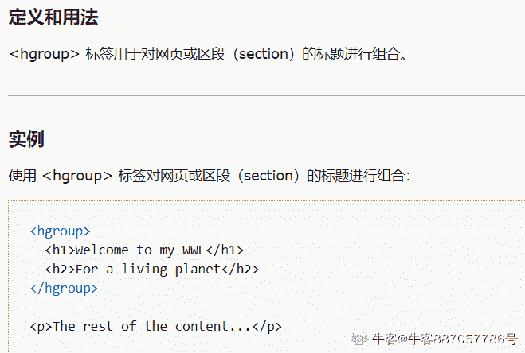

# HTML5 测验一

## 1

HTML5 之前的 HTML 版本是什么？

正确答案: A   你的答案: 空 (错误)

```cpp
HTML 4.01
```

```cpp
HTML 4
```

```cpp
HTML 4.1
```

```cpp
HTML 4.9
```

本题知识点

前端工程师 HTML

讨论

[njnutzhou](https://www.nowcoder.com/profile/960814476)

1.  HTML 的发展版本

HTML 2.0：基于 SGML（Standard Generalized Markup Language，标准广义置标语言，是一套用来描述数字化文档的结构并管理其内容的复杂的规范）中的一个子集演变而来的。HTML 2.0 是 1996 年由 Internet 工程工作小组的 HTML 工作组开发的。HTML 2.0 是过时的 HTML 版本。目前在市场上可以找到的浏览器都依赖于更新版本的 HTML。对于一位 WEB 开发者而言，没有任何必要需要 HTML 2.0 标准。

HTML 3.2：1997 年 1 月 14 日，HTML 3.2 作为 W3C 标准被发布。HTML 3.2 向 HTML 2.0 标准添加了被广泛运用的特性，诸如上标和下标、围绕图像的文本流、表格、applets、字体。但是此次的发布却为 HTML 内容和呈现的分离任务带来了不必要的麻烦。

HTML 4.0：1997 年 12 月 18 日，HTML 4.0 作为一项 W3C 推荐被发布。1998 年 4 月 24 日，修正的第二个版本发布，仅仅进行了一些小改动编辑。HTML 4.0 最重要的特性是引入了样式表（CSS）。

HTML 4.01：1999 年 12 月 24 日，由于 HTML 4.0 存在着漏洞，HTML 4.01 作为一项 W3C 推荐被发布，HTML 4.01 是对 HTML 4.0 的一次较小的更新，对后者进行了修正和漏洞修复。至此，HTML 到达了它得第一个拐点。W3C 不会继续发展 HTML。未来 W3C 的工作会集中在 XHTML 上。

XHTML 1.0(最新版本的 HTML)：2000 年 1 月 20 日，XHTML 1.0 作为一项 W3C 推荐被发布。XHTML 1.0 规范的内容与 HTML 4.01 完全相同，没有添加任何新元素或新属性。这两个规范唯一的差别就是对 HTML 的语法作出了不同的规定。HTML 给予了作者最大的自由度，他们可以按照自己的意愿去写元素和属性，但 XHTML 要求作者遵从 XML 规则，XML 是 W3C 大多数技术规范的基础，是一种更为严格的标记语言。XHTML 1.0 使用 XML 对 HTML 4.01 进行了重新地表示。我们的 W3C XHTML 简介章节总结了 XHTML 是什么。

HTML 5：W3C 于 2008 年 1 月 22 日发布 HTML 5 工作草案。通过制定如何处理所有 HTML 元素以及如何从错误中恢复的精确规则，HTML 5 改进了互操作性，并减少了开发成本。HTML5 目前的状态已经不似先前那么含含糊糊了，但仍然还是不甚明了。与 HTML5 真正有关系的日期应该是 2012 年。这是它预计将会成为“候选标准”的时间。成为“候选标准”，就意味着标准的制定工作结束了。HTML5 并不是一门凭空造出来的新语言。它的标记变化都是革新性的，不是革命性的。无论你现在使用哪个版本的 HTML 创建网站，你都可以说自己已经在使用 HTML5 了。[`blog.csdn.net/weixin_33814685/article/details/89702051`](https://blog.csdn.net/weixin_33814685/article/details/89702051)

发表于 2021-04-16 10:24:44

* * *

[fanpyi](https://www.nowcoder.com/profile/644785746)

这垃圾题考的有意思吗

发表于 2021-09-01 11:40:24

* * *

[牛客 146215262 号](https://www.nowcoder.com/profile/146215262)

HTML5 之前的版本是 HTML 4.01 ，HTML5 版本为当前最新的 HTML 版本。
HTML4.01、HTML5 之间的区别： 声明区别
HTML 有多个不同的版本，只有准确的在页面中指定确切的 HTML 版本，浏览器才能正确无误的显示 HTML 页面。这就是的用处。
不是 HTML 标签，它只是为浏览器提供一项声明，因此它没有闭合/结束标签！

发表于 2020-08-23 16:52:49

* * *

## 2

HTML5 的正确 doctype 是？

正确答案: A   你的答案: 空 (错误)

```cpp
<!DOCTYPE html>
```

```cpp
<!DOCTYPE HTML5>
```

```cpp
<!DOCTYPE HTML PUBLIC "-//W3C//DTD HTML 5.0//EN" "http://www.w3.org/TR/html5/strict.dtd">
```

本题知识点

前端工程师 HTML

讨论

[WEBJ2EE](https://www.nowcoder.com/profile/3930151)

html5，不在需要定义 HTML4 中的 PUBLIC 部分，只有 <!DOCTYPE html>

发表于 2019-12-22 12:58:59

* * *

[无聊★刷刷](https://www.nowcoder.com/profile/875199633)

h5 不需要定义 h4 中的 public 部分，只需要!doctype html h5 将其头部优化简写了

编辑于 2021-04-26 22:39:25

* * *

## 3

在 HTML5 中，哪个元素用于组合标题元素？

正确答案: D   你的答案: 空 (错误)

```cpp
<group>
```

```cpp
<header>
```

```cpp
<headings>
```

```cpp
<hgroup>
```

本题知识点

前端工程师 HTML 360 公司 2021

讨论

[牛客 887057786 号](https://www.nowcoder.com/profile/887057786)



发表于 2021-01-16 19:13:52

* * *

[季雨 Q](https://www.nowcoder.com/profile/911044368)

hgroup 元素是将标题及其子标题进行分组的元素，hgroup 元素通常会将 h1-h6 元素进行分组，比如内容区块的标题及其子元素算一组

发表于 2019-11-26 23:18:52

* * *

[牛客 634373529 号](https://www.nowcoder.com/profile/634373529)

group 标签区域主题 hgroup 用来对网页或区段的标题进行组合，即对网页或区段中连续 <h1> ～<h6>元素进行组合

发表于 2022-03-18 15:04:17

* * *

## 4

HTML5 中不再支持下面哪个元素？

正确答案: D   你的答案: 空 (错误)

```cpp
<q>
```

```cpp
<ins>
```

```cpp
<menu>
```

```cpp
<font>
```

本题知识点

前端工程师 HTML

讨论

[WEBJ2EE](https://www.nowcoder.com/profile/3930151)

HTML5 废了一些纯控制渲染的标签  center 、big、font、strike、b 等

发表于 2019-12-22 12:57:58

* * *

[胡永凯](https://www.nowcoder.com/profile/968491641)

**废除的元素**

1、能用 css 代替的元素  
basefont、big、center、font、s、strike、tt、u。这些元素纯粹是为画面展示服务的，HTML5 中提倡把画面展示性功能放在 css 中统一编辑。

2、不再使用 frame 框架。

frameset、frame、noframes。HTML5 中不支持 frame 框架，只支持 iframe 框架，或者用服务器方创建的由多个页面组成的符合页面的形式，删除以上这三个标签。

3、只有部分浏览器支持的元素

applet、bgsound、blink、marquee 等标签。

发表于 2020-10-05 14:58:36

* * *

[whitebox](https://www.nowcoder.com/profile/703219069)

html5 中不再支持的元素有：
1、acronym(建议 abbr) ： 定义首字母缩写
2、applet(建议 object)： 定义 applet
3、basefont(使用 css 控制)
4、big(使用 css 控制) ：定义大号文本
5、center(使用 css 控制)： 定义居中的文本
6、font(使用 css 控制)
7、strike(使用 del) ：定义加删除线的文本
8、tt（使用 css 控制）： 定义打字机文本。
9、u(使用 css 控制) ：定义下划线文本
10、frame(建议 iframe)： 定义子窗口（框架）。
11、frameset ：定义框架的集
12、noframes ：定义 noframe 部分
13、dir ：定义目录列表
14、<xmp>： 定义预格式文本来源：[html5 中不再支持下面哪个元素?_ 百度知道 (baidu.com)](https://zhidao.baidu.com/question/567990600070416684.html)

发表于 2022-02-14 21:10:59

* * *

## 5

HTML5 中不再支持下面哪个元素？

正确答案: B   你的答案: 空 (错误)

```cpp
<cite>
```

```cpp
<acronym>
```

```cpp
<abbr>
```

```cpp
<base>
```

本题知识点

前端工程师 HTML

讨论

[Jachin-x](https://www.nowcoder.com/profile/519689225)

1\. <cite>:用来定义作品的标题；2\. <abbr>:用来指示标签简写；3.<base>:为页面上的所有的相对链接规定默认 URL 或者默认目标；4.<arconym>已经抛弃。

发表于 2020-12-16 21:24:55

* * *

[牛客 587292331 号](https://www.nowcoder.com/profile/587292331)

背

发表于 2020-08-08 13:03:56

* * *

[季雨 Q](https://www.nowcoder.com/profile/911044368)

<acronym> 标签 - HTML5 中不支持

定义和用法

HTML 5 不支持 <acronym> 标签。请使用 [<abbr>](https://www.w3school.com.cn/html5/tag_abbr.asp) 标签代替它。

在 HTML 4.01 中，<acronym> 标签定义首字母缩略词。

如果首字母缩略词是一个单词，则可以被读出来，例如 NATO、NASA、ASAP、GUI。

发表于 2019-11-23 11:26:05

* * *

## 6

在 HTML5 中，onblur 和 onfocus 是：

正确答案: C   你的答案: 空 (错误)

```cpp
HTML 元素
```

```cpp
样式属性
```

```cpp
事件属性
```

本题知识点

前端工程师 HTML

讨论

[Kaitle](https://www.nowcoder.com/profile/2213693)

onblur 和 onfocus 属于焦点事件：onblur：失去焦点 onfocus：获取焦点

发表于 2020-08-21 11:33:28

* * *

[Katrina123](https://www.nowcoder.com/profile/140543084)

onblur 失去焦点 onfocus 焦点

发表于 2021-11-02 21:24:36

* * *

## 7

用于播放 HTML5 视频文件的正确 HTML5 元素是：

正确答案: C   你的答案: 空 (错误)

```cpp
<movie>
```

```cpp
<media>
```

```cpp
<video>
```

本题知识点

前端工程师

讨论

[WEBJ2EE](https://www.nowcoder.com/profile/3930151)

  C

发表于 2019-12-21 21:53:17

* * *

## 8

用于播放 HTML5 音频文件的正确 HTML5 元素是：

正确答案: B   你的答案: 空 (错误)

```cpp
<mp3>
```

```cpp
<audio>
```

```cpp
<sound>
```

本题知识点

前端工程师 HTML

讨论

[WEBJ2EE](https://www.nowcoder.com/profile/3930151)

B

发表于 2019-12-21 21:52:29

* * *

[小白学前端](https://www.nowcoder.com/profile/272206041)

B

发表于 2019-11-09 00:47:09

* * *

## 9

通常说来，下面哪个是不好的实践

正确答案: A   你的答案: 空 (错误)

```cpp
所有的 bean 都是原型范畴
```

```cpp
让 bean 之间的相互依存关系最小
```

```cpp
持续集成
```

本题知识点

前端工程师 HTML

讨论

[三角函数](https://www.nowcoder.com/profile/132878365)

这题是啥

发表于 2021-03-10 14:50:17

* * *

[非衣 666](https://www.nowcoder.com/profile/749291051)

真不懂 哈哈

发表于 2021-09-11 10:32:20

* * *

[WD-Coke](https://www.nowcoder.com/profile/971446194)

我以为就我一人懵逼呢

发表于 2021-07-25 18:57:30

* * *

## 10

在 HTML5 中，哪个方法用于获得用户的当前位置？

正确答案: B   你的答案: 空 (错误)

```cpp
getPosition()
```

```cpp
getCurrentPosition()
```

```cpp
getUserPosition()
```

本题知识点

前端工程师 HTML

讨论

[Kinasha](https://www.nowcoder.com/profile/289028402)

[`www.runoob.com/html/html5-geolocation.html`](https://www.runoob.com/html/html5-geolocation.html)H5 使用 getCurrentPosition() 方法来获得用户的位置 但是由于隐私设置你是没法在浏览器里直接测试的

发表于 2020-10-08 10:25:57

* * *

[秃头前端学 C#](https://www.nowcoder.com/profile/559976307)

```cpp
getCurrentPosition(successCallback, errorCallback,PositionOptions);

```

successCallback 是获取用户数据，errorCallback 是返回错误代码，PositionOptions 有三个属性。

发表于 2020-09-19 13:14:41

* * *

[honng](https://www.nowcoder.com/profile/633961032)

在微信小程序里用过。

编辑于 2020-12-29 20:19:06

* * *