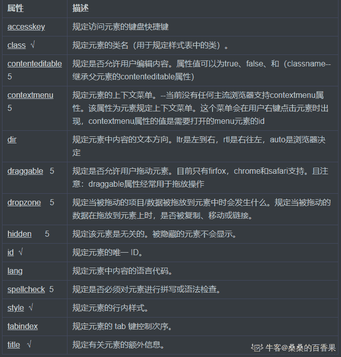
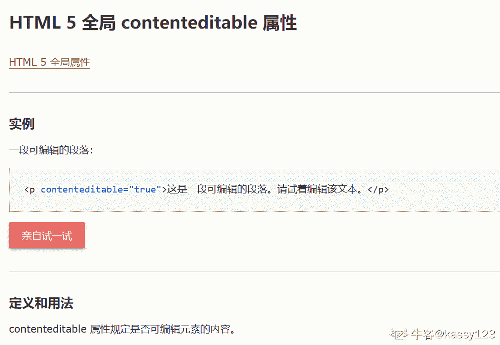

# HTML5 测验二

## 1

新的 HTML5 全局属性，”contenteditable” 用于：

正确答案: B   你的答案: 空 (错误)

```cpp
规定元素的上下文菜单。该菜单会在用户右键点击元素时出现。
```

```cpp
规定元素内容是否可编辑。
```

```cpp
从服务器升级内容。
```

```cpp
内容在字符串中首次出现的位置。
```

本题知识点

前端工程师 HTML

讨论

[offer 快到碗里来呀~](https://www.nowcoder.com/profile/473630826)



发表于 2020-08-10 09:41:00

* * *

[小旭哥 ya](https://www.nowcoder.com/profile/245063143)

读英文就行，content 内容 edit 编辑 able 能的意思，向 disable 一样去理解就行，disable 就是不能

发表于 2020-08-01 23:42:16

* * *

[kassy123](https://www.nowcoder.com/profile/53666460)



发表于 2021-04-22 23:22:55

* * *

## 2

在 HTML5 中，contextmenu 和 spellcheck 是：

正确答案: A   你的答案: 空 (错误)

```cpp
HTML 属性
```

```cpp
HTML 元素
```

```cpp
事件属性
```

```cpp
样式属性
```

本题知识点

前端工程师 HTML

讨论

[李由](https://www.nowcoder.com/profile/246541022)

官方文档说 contextmenu 是过时属性，不再支持

发表于 2021-08-10 08:50:44

* * *

[牛客 503168731 号](https://www.nowcoder.com/profile/503168731)

oncontextmenu 事件在元素中**用户右击鼠标时触发**并**打开上下文菜单。**

注意：所有浏览器都支持 oncontextmenu 事件， [contextmenu](https://www.runoob.com/tags/att-global-contextmenu.html) 元素只有 Firefox 浏览器支持

spellcheck 属性规定是否对元素进行拼写和语法检查。（不是很明白怎么进行检查的）

可以对以下内容进行拼写检查：

*   input 元素中的文本值（非密码）
*   <textarea> 元素中的文本
*   可编辑元素中的文本

发表于 2020-09-13 18:08:35

* * *

[kassy123](https://www.nowcoder.com/profile/53666460)

spellcheck 属性规定是否对元素内容进行拼写检查。contextmenu 属性规定了元素的上下文菜单。当用户右击元素时将显示上下文菜单。 

发表于 2021-05-06 19:27:22

* * *

## 3

在 HTML5 中，您能够直接将 SVG 元素嵌入 HTML 页面中。

正确答案: A   你的答案: 空 (错误)

```cpp
正确
```

```cpp
错误
```

本题知识点

前端工程师 HTML

讨论

[牛客 973162693 号](https://www.nowcoder.com/profile/973162693)

SVG—可缩放矢量图片。1、文件小 2、放大缩小不会失真

发表于 2021-08-21 17:56:33

* * *

[大头喝水](https://www.nowcoder.com/profile/925607368)

SVG 文件可通过以下标签嵌入 HTML 文档：<embed> 、<object> 或者 </object>

发表于 2021-07-05 23:24:13

* * *

[编程牛人](https://www.nowcoder.com/profile/806494251)

svg 查看

发表于 2020-08-09 06:47:02

* * *

## 4

由 SVG 定义的图形是什么格式的？

正确答案: C   你的答案: 空 (错误)

```cpp
CSS
```

```cpp
HTML
```

```cpp
XML
```

本题知识点

前端工程师

## 5

HTML5 中的 <canvas> 元素用于：

正确答案: C   你的答案: 空 (错误)

```cpp
显示数据库记录
```

```cpp
操作 MySQL 中的数据
```

```cpp
绘制图形
```

```cpp
创建可拖动的元素
```

本题知识点

前端工程师 HTML

讨论

[WEBJ2EE](https://www.nowcoder.com/profile/3930151)

C,  canvas 是对 flash 的回应，原生直接支持绘图

发表于 2019-12-22 12:50:37

* * *

[honng](https://www.nowcoder.com/profile/633961032)

打个广告哈：疫情期间我做了一个微信小程序 【头像贴纸加文字】，可以给头像加口罩，国旗，圣诞帽，主要就是用到了 canvas 。

编辑于 2020-12-26 12:34:01

* * *

## 6

哪个 HTML5 内建对象用于在画布上绘制？

正确答案: B   你的答案: 空 (错误)

```cpp
getContent
```

```cpp
getContext
```

```cpp
getGraphics
```

```cpp
getCanvas
```

本题知识点

前端工程师 HTML CSS

讨论

[陈仙生](https://www.nowcoder.com/profile/751972961)

getContext 用于在画布上绘制

发表于 2020-08-09 20:16:07

* * *

[一路向北北北北北](https://www.nowcoder.com/profile/388315320)

A、C、D 不存在 HTML5，js 方法中
getContext() 方法返回一个用于在画布上绘图的环境。

语法

```cpp
Canvas.getContext(*contextID*)
```

参数

参数 *contextID* 指定了您想要在画布上绘制的类型。当前唯一的合法值是 "2d"，它指定了二维绘图，并且导致这个方法返回一个环境对象，该对象导出一个二维绘图 API。

提示：在未来，如果 <canvas> 标签扩展到支持 3D 绘图，getContext() 方法可能允许传递一个 "3d" 字符串参数。

返回值

一个 CanvasRenderingContext2D 对象，使用它可以绘制到 Canvas 元素中。

描述

返回一个表示用来绘制的环境类型的环境。其本意是要为不同的绘制类型（2 维、3 维）提供不同的环境。当前，唯一支持的是 "2d"，它返回一个 CanvasRenderingContext2D 对象，该对象实现了一个画布所使用的大多数方法。

发表于 2021-08-18 16:56:06

* * *

[牛客 880165738 号](https://www.nowcoder.com/profile/880165738)

答案： 选 B1、getContent ： 获取内容

2、getContext：返回一个用于在画布上绘图的环境。

3、request.getContextPath()可以返回当前页面所在的应用的名字;

getGraphics：Java 里面的方法。public Graphics getGraphics()。为组件创建一个图形上下文。如果组件当前是不可显示的，则此方法返回 null。
public void paint(Graphics g)绘制此组件。

4、Canvas 对象的方法就是 getContext()

发表于 2021-09-10 14:38:38

* * *

## 7

在 HTML5 中，哪个属性用于规定输入字段是必填的？

正确答案: A   你的答案: 空 (错误)

```cpp
required
```

```cpp
formvalidate
```

```cpp
validate
```

```cpp
placeholder
```

本题知识点

前端工程师 HTML CSS

讨论

[Jnim](https://www.nowcoder.com/profile/509820987)

required 属性规定必需在提交表单之前填写输入字段。 placeholder 属性规定可描述输入 <input> 字段预期值的简短的提示信息 。上面两个属性都属于 input 标签没找到 formvalidate 和 validate 属性，只有 formnovalidate 属性表示表单验证

发表于 2020-08-11 17:02:11

* * *

[德志](https://www.nowcoder.com/profile/974371261)

只看正确答案不是学习。详细连接：[`developer.mozilla.org/zh-CN/docs/Learn/Forms`](https://www.php.cn/blog/detail/24337.html)常用：required：input 输入必填
placeholder ：可描述输入 <input> 字段预期值的简短的提示信息
pattern：正则验证
autocomplete：自动填充
novalidate：当提交表单时不对其进行验证

发表于 2022-03-03 14:46:30

* * *

[alien13](https://www.nowcoder.com/profile/946294517)

表单属性 required 属性是一个布尔属性该属性规定必须在提交之前填写输入域，不能为空 formnovalidate 属性是一个布尔属性该属性描述了 input 元素在表单提交时无需被验证 placeholder 属性提供一种提示，描述输入域所期待的值

发表于 2021-09-24 01:49:34

* * *

## 8

哪种输入类型定义滑块控件？

正确答案: D   你的答案: 空 (错误)

```cpp
search
```

```cpp
controls
```

```cpp
slider
```

```cpp
range
```

本题知识点

前端工程师 HTML CSS

讨论

[yuakri](https://www.nowcoder.com/profile/839566553)

| button | 定义可点击的按钮（大多与 JavaScript 使用来启动脚本） |
| checkbox | 定义复选框。 |
| color | 定义拾色器。 |
| date | 定义日期字段（带有 calendar 控件） |
| datetime | 定义日期字段（带有 calendar 和 time 控件） |
| datetime-local | 定义日期字段（带有 calendar 和 time 控件） |
| month | 定义日期字段的月（带有 calendar 控件） |
| week | 定义日期字段的周（带有 calendar 控件） |
| time | 定义日期字段的时、分、秒（带有 time 控件） |
| email | 定义用于 e-mail 地址的文本字段 |
| file | 定义输入字段和 "浏览..." 按钮，供文件上传 |
| hidden | 定义隐藏输入字段 |
| image | 定义图像作为提交按钮 |
| number | 定义带有 spinner 控件的数字字段 |
| password | 定义密码字段。字段中的字符会被遮蔽。 |
| radio | 定义单选按钮。 |
| range | 定义带有 slider 控件的数字字段。 |
| reset | 定义重置按钮。重置按钮会将所有表单字段重置为初始值。 |
| search | 定义用于搜索的文本字段。 |
| submit | 定义提交按钮。提交按钮向服务器发送数据。 |
| tel | 定义用于电话号码的文本字段。 |
| text | 默认。定义单行输入字段，用户可在其中输入文本。默认是 20 个字符。 |
| url | 定义用于 URL 的文本字段。 |

发表于 2020-08-04 13:45:03

* * *

[Northnofear](https://www.nowcoder.com/profile/800232704)

Input 类型 - range

range 类型用于应该包含一定范围内数字值的输入域。

range 类型显示为滑动条。

您还能够设定对所接受的数字的限定：

实例

```cpp
<input type="range" name="points" min="1" max="10" />
```

编辑于 2020-08-25 18:26:48

* * *

[牛客 950397400 号](https://www.nowcoder.com/profile/950397400)

button    定义可点击的按钮（大多与 JavaScript 使用来启动脚本）
checkbox    定义复选框。
color    定义拾色器。
date    定义日期字段（带有 calendar 控件）
datetime    定义日期字段（带有 calendar 和 time 控件）
datetime-local    定义日期字段（带有 calendar 和 time 控件）
month    定义日期字段的月（带有 calendar 控件）
week    定义日期字段的周（带有 calendar 控件）
time    定义日期字段的时、分、秒（带有 time 控件）
email    定义用于 e-mail 地址的文本字段
file    定义输入字段和 "浏览..." 按钮，供文件上传
hidden    定义隐藏输入字段
image    定义图像作为提交按钮
number    定义带有 spinner 控件的数字字段
password    定义密码字段。字段中的字符会被遮蔽。
radio    定义单选按钮。
range    定义带有 slider 控件的数字字段。
reset    定义重置按钮。重置按钮会将所有表单字段重置为初始值。
search    定义用于搜索的文本字段。
submit    定义提交按钮。提交按钮向服务器发送数据。
tel    定义用于电话号码的文本字段。
text    默认。定义单行输入字段，用户可在其中输入文本。默认是 20 个字符。
url    定义用于 URL 的文本字段。

发表于 2021-05-03 12:40:40

* * *

## 9

哪种输入类型用于定义周和年控件（无时区）？

正确答案: B   你的答案: 空 (错误)

```cpp
date
```

```cpp
week
```

```cpp
year
```

本题知识点

前端工程师 HTML CSS

讨论

[牛客 445252366 号](https://www.nowcoder.com/profile/445252366)

date 选取日、月、年 month 选取月和年 week 选取周和年 time 选取时间（小时和分钟）

发表于 2020-09-08 10:28:44

* * *

[jexica](https://www.nowcoder.com/profile/554037988)

HTML5 拥有多个新的表单输入类型：
参考：[`www.runoob.com/html/html5-form-input-types.html`](https://www.runoob.com/html/html5-form-input-types.html)

发表于 2021-03-22 21:43:03

* * *

[16 级老腊肉](https://www.nowcoder.com/profile/955823416)

把最小单位作为底层就是，日月年选日，月年选月，周年选周

发表于 2022-03-17 19:57:20

* * *

## 10

哪个 HTML5 元素用于显示已知范围内的标量测量？

正确答案: D   你的答案: 空 (错误)

```cpp
<gauge>
```

```cpp
<range>
```

```cpp
<measure>
```

```cpp
<meter>
```

本题知识点

前端工程师 HTML CSS

讨论

[一个找实习的孩子](https://www.nowcoder.com/profile/938210031)

<meter> 标签定义已知范围或分数值内的标量测量。也被称为 gauge（尺度）。

例子：磁盘用量、查询结果的相关性，等等。

注释：<meter> 标签不应用于指示进度（在进度条中）。如果标记进度条，请使用 <progress> 标签。

发表于 2020-10-14 20:42:24

* * *

[cell_](https://www.nowcoder.com/profile/1621100)

a,c 标签不存在。 meter 标签类似于进度条，按百分比显示。 input 的 type 属性可以设置为 range，范围可调。

发表于 2020-09-20 00:41:25

* * *

[超级高手](https://www.nowcoder.com/profile/688046579)

不知道怎么传图，这是一个像进度条一样的标签 ‖‖‖‖‖‖‖‖‖‖‖‖‖‖‖‖‖‖‖‖‖‖‖‖_________________________ 酱紫

发表于 2020-09-13 22:28:38

* * *