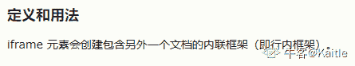
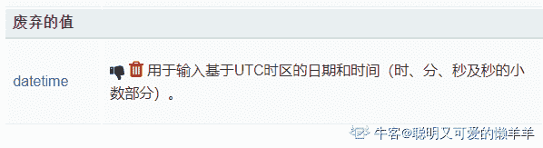
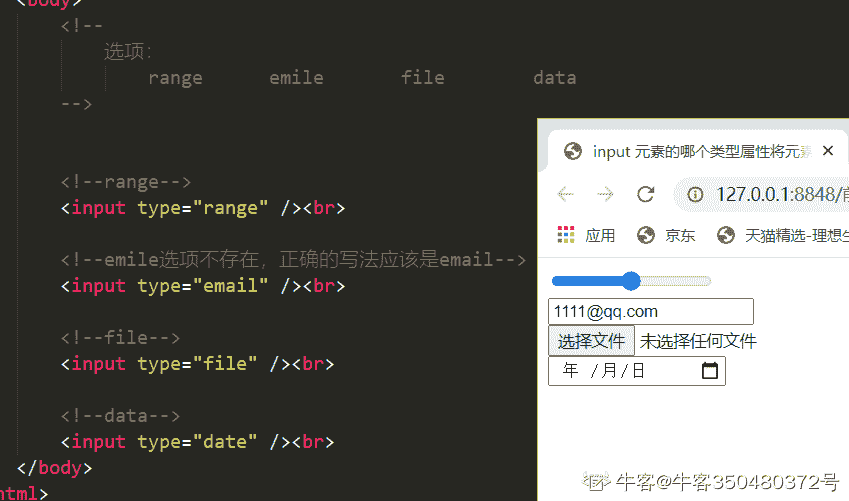

# HTML5 测验三

## 1

___ 标签用于指定内联框架？

正确答案: C   你的答案: 空 (错误)

```cpp
<jframe>
```

```cpp
<frameset>
```

```cpp
<iframe>
```

```cpp
<frame>
```

本题知识点

前端工程师 HTML CSS

讨论

[Kaitle](https://www.nowcoder.com/profile/2213693)



发表于 2020-08-21 11:40:56

* * *

[牛客 467838194 号](https://www.nowcoder.com/profile/467838194)

1.w3c 不建议使用内联框架，但是在开发中很多公司还是会使用内联框架；

2.内联框架的标签是<iframe></iframe>；内联框架用于向网页中引入另一个网页；

<iframe  src=“hello.html”  width=“200px”  height=“400px”  name="ifra"></iframe>

3.<iframe>标签常用属性：

1）src 属性：是在该内联框架中指定一个外部的页面地址；

2）name 属性：是设置 iframe 的名字

发表于 2022-02-22 18:39:12

* * *

[--sgf--](https://www.nowcoder.com/profile/8882859)

背单词

发表于 2021-12-28 17:23:04

* * *

## 2

SVG 有多少种图形对象类型？

正确答案: B   你的答案: 空 (错误)

```cpp
2
```

```cpp
3
```

```cpp
5
```

```cpp
7
```

本题知识点

前端工程师

讨论

[bigbag](https://www.nowcoder.com/profile/1621564)

SVG 有 3 种图形对象类型：矢量图形形状、图像、文本 SVG 有 6 种基本形状：<circle>,<ellipse>,<rect>,<polygon>,<line>,<polyline>，另外有<path>路径元素

发表于 2020-02-24 20:12:43

* * *

## 3

HTML5 支持 HTML4 中的所有表单控件？

正确答案: A   你的答案: 空 (错误)

```cpp
正确
```

```cpp
错误
```

本题知识点

前端工程师 HTML CSS

讨论

[CatBallou](https://www.nowcoder.com/profile/313932721)

我考虑的是 html5 废弃了一些 html4 里的标签，但是为了兼容性，浏览器还支持这些标签

发表于 2020-12-30 00:15:01

* * *

[一锅端攻城狮](https://www.nowcoder.com/profile/502495701)

是表单控件 不是标签🏷️，麻溜了

发表于 2021-05-21 02:42:45

* * *

[刷牛客网使我快乐](https://www.nowcoder.com/profile/320097464)

向上向后兼容

发表于 2020-11-09 18:51:45

* * *

## 4

DHTML 包含以下哪些内容 ？ 1、HTML

2、JavaScript

3、HTML DOM

4、CSS 

正确答案: C   你的答案: 空 (错误)

```cpp
1 和 2
```

```cpp
3 和 4
```

```cpp
都是
```

```cpp
都不是
```

本题知识点

前端工程师 HTML CSS

讨论

[xc_silence](https://www.nowcoder.com/profile/204319422)

干了几年前端了，都没听说过这个技术🤣

发表于 2020-09-10 15:53:12

* * *

[爱上一只小狮子](https://www.nowcoder.com/profile/134342295)

动态 HTML（DHTML）是指允许开发人员创建高度动画和交互式网站的代码标签和语法。 所以上面的技术都需要。

发表于 2020-10-17 11:43:33

* * *

[WEBJ2EE](https://www.nowcoder.com/profile/3930151)

DHTML 并不是新东西，而是技术的组合； HTML+JS+CSS

发表于 2019-12-22 12:45:29

* * *

## 5

以下哪个是 html5 中的 input 类型属性？

(1) search
(2) datetime
(3) week
(4) color
(5) track
(6) placeholder

正确答案: A   你的答案: 空 (错误)

```cpp
1,2,3,4,6
```

```cpp
1,2,3,4,5
```

```cpp
2,3,4,5,6
```

```cpp
1,3,4,5,6
```

本题知识点

前端工程师 HTML CSS

讨论

[小萨](https://www.nowcoder.com/profile/942160498)

答案应该是 1234，5，Track 为 vedio 标签的轨道。例如字幕 6，placeholder 不是类型属性建议屏蔽此题

发表于 2020-08-30 10:41:24

* * *

[聪明又可爱的懒羊羊](https://www.nowcoder.com/profile/157085517)

datetime 不是废弃了吗

发表于 2020-08-26 20:03:02

* * *

[牛客 75024471 号](https://www.nowcoder.com/profile/75024471)

Track 为 vedio 标签的轨道。例如字幕

发表于 2020-08-02 21:13:17

* * *

## 6

Canvas 能够使用 ___ 绘制 2D 图形？

正确答案: C   你的答案: 空 (错误)

```cpp
XML
```

```cpp
HTML
```

```cpp
JavaScript
```

```cpp
XHTML
```

本题知识点

前端工程师 HTML CSS

讨论

[Wo-koo](https://www.nowcoder.com/profile/579982399)

Canvas 是通过 JavaScript 的 API 进行绘图的，SVG 是通过 XML 进行绘图的，这两种绘图方式的应用场景不同。W3C 中有比较详细的讲解。

发表于 2020-09-01 19:49:39

* * *

[kim 一号](https://www.nowcoder.com/profile/141887238)

Canvas 是通过 js 绘图，svg 通过 XML

发表于 2021-08-18 15:45:29

* * *

[小旭哥 ya](https://www.nowcoder.com/profile/245063143)

就是这样，答案记住就行

发表于 2020-08-01 23:20:28

* * *

## 7

以下哪个不是 HTML5 中使用的媒体元素？

正确答案: D   你的答案: 空 (错误)

```cpp
<source>
```

```cpp
<audio>
```

```cpp
<track>
```

```cpp
<time>
```

本题知识点

前端工程师 HTML CSS

讨论

[圈～](https://www.nowcoder.com/profile/5121786)

用 source 元素可以同时指定多个音频视频格式（为了兼容）track 元素是 audio 和 video 的子元素，为多媒体文件添加辅助文本信息，eg:字幕、屏幕阅读器说明和主题等。

发表于 2020-08-19 16:21:40

* * *

[可你一点都不笨](https://www.nowcoder.com/profile/446981097)

<time> 标签定义公历的时间（24 小时制）或日期，时间和时区偏移是可选的。

该元素能够以机器可读的方式对日期和时间进行编码，这样，举例说，用户代理能够把生日提醒或排定的事件添加到用户日程表中，搜索引擎也能够生成更智能的搜索结果。

发表于 2020-08-04 16:53:06

* * *

[啊啊啊啊灿](https://www.nowcoder.com/profile/778425174)

time 是时间

发表于 2022-02-10 02:47:41

* * *

## 8

SVG 是什么意思？

正确答案: C   你的答案: 空 (错误)

```cpp
二级矢量图形
```

```cpp
可伸缩的垂直图形
```

```cpp
可伸缩矢量图形
```

```cpp
三级矢量图形
```

本题知识点

前端工程师

## 9

是否可以将 HTML5 用于移动应用程序？

正确答案: A   你的答案: 空 (错误)

```cpp
可以
```

```cpp
不可以
```

本题知识点

前端工程师 HTML CSS

讨论

[你快乐吗](https://www.nowcoder.com/profile/5271388)

现在有个名词叫做**大前端方向**，包括了 web 前端，App 页面，小程序页面等。

发表于 2020-11-10 10:30:14

* * *

[Frederic18](https://www.nowcoder.com/profile/6738769)

HTML5 适用于所有的 WEB 网站开发,可同时在手机,PC,平板等各屏幕尺寸和各操作系统中正常浏览与显示的

发表于 2020-08-18 23:27:30

* * *

[胡永凯](https://www.nowcoder.com/profile/968491641)

html5 平常方面都可以应用，但是，大量应用于移动应用程序和游戏，因为用 HTML5 的优点主要在于，这个技术可以进行跨平台的使用。

发表于 2020-10-10 20:24:55

* * *

## 10

input 元素的哪个属性将元素的值设置为表示一定范围内的数字？

正确答案: A   你的答案: 空 (错误)

```cpp
range
```

```cpp
emile
```

```cpp
file
```

```cpp
data
```

本题知识点

前端工程师 HTML CSS

讨论

[牛客 350480372 号](https://www.nowcoder.com/profile/350480372)



发表于 2020-11-15 23:27:02

* * *

[sweetBeautifulGirl](https://www.nowcoder.com/profile/80497828)

排除法选择了 A，交卷后却显示错误，显示正确答案是空😓 ，  第二次没有选择，交卷却显示我选择 A 选项，题目还是判红，什么 bug.................

发表于 2020-12-24 10:55:56

* * *

[牛客 383032879 号](https://www.nowcoder.com/profile/383032879)

C 属性是上传文件，B 是邮件，D 没有 data 属性吧，date，所以就 A 了这么想的

发表于 2020-09-04 18:05:34

* * *