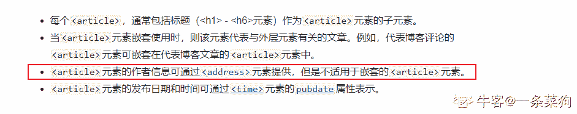
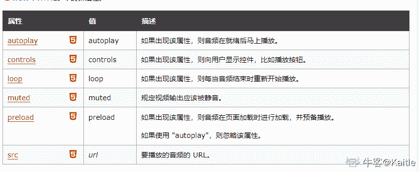

# HTML5 测验四

## 1

input 元素中，下列哪个类型属性定义了输入电话号码的控件？

正确答案: B   你的答案: 空 (错误)

```cpp
mob
```

```cpp
tel
```

```cpp
mobile
```

```cpp
telephone
```

本题知识点

前端工程师 HTML CSS

讨论

[苦衷](https://www.nowcoder.com/profile/570510843)

type = "tel" 是 html 推出的 13 个 input 新特性之一，主要用来表示当前文本框是用来输入电话号码的。这种写法在电脑版网页中不会使用，因为这个 type 是为触屏网页开发服务的。在触屏端点击 type 为 tel 的输入框时，跳出的虚拟键盘为电话键盘（1-9、*、#）。

发表于 2021-12-08 19:10:31

* * *

[你快乐吗](https://www.nowcoder.com/profile/5271388)

tel，背下就行了


发表于 2020-11-10 10:20:18

* * *

[牛客 654005925 号](https://www.nowcoder.com/profile/654005925)

tel

发表于 2021-11-09 21:00:19

* * *

## 2

哪个元素表示用于生成公钥-私钥对的控件？

正确答案: B   你的答案: 空 (错误)

```cpp
ins
```

```cpp
keygen
```

```cpp
key
```

```cpp
command
```

本题知识点

前端工程师 HTML CSS

讨论

[小旭哥 ya](https://www.nowcoder.com/profile/245063143)

老 spicy chicken 题了 1.ins 标签用来定义插入元素的 2.keygen 用于表单的密钥对生成器字段 新的 WEB 标准已经废弃 3.key 不知道是不是 xml 里面的 key 4.用于定义用户可能调用的命令 就支持 ie9

发表于 2020-08-01 23:19:35

* * *

[谭竿霄](https://www.nowcoder.com/profile/966477447)

根据已学知识能稍微推测出 B 吧。 在 git 版本管理工具中，我们每次 push 上传项目到 github 或码云远程仓库时可以选择两种方式： 1）使用 http 上传，这样每次上传都要登录账号(windows 凭据未保存密码)； 2）***h 上传，这时我们需要 ssh-keygen 生成一对公钥(锁)和私钥(钥匙)，公钥设置在远程仓库，私钥留在自己电脑上 C 盘/用户/.../.ssh 中，每次上传文件会自动配对，实现免密码传输。

发表于 2021-03-10 20:50:12

* * *

[牛客 367701588 号](https://www.nowcoder.com/profile/367701588)

H5 新标签， 学习了

发表于 2022-03-07 08:52:21

* * *

## 3

哪个元素表示标记或突出显示的文本以供参考？

正确答案: B   你的答案: 空 (错误)

```cpp
highlight
```

```cpp
mark
```

```cpp
span
```

```cpp
blink
```

本题知识点

前端工程师 HTML CSS

讨论

[兜兜过](https://www.nowcoder.com/profile/714411739)

1) highlight jQuery 中的，突出特效，通过改变背景颜色来隐藏或者显示一个元素 2) mark h5 中的标签，定义带有记号的文本，文本高亮显示 3) strong HTML 中的标签，定义重要文本，用来加粗文本 4) blink 是 js 中的方法，用于显示闪动的字符串，不能用于 ie，Chrome，Safari

编辑于 2020-08-11 20:45:00

* * *

[牛客 950397400 号](https://www.nowcoder.com/profile/950397400)

（1）highlight jQuery 中的，突出特效，通过改变背景颜色来隐藏或者显示一个元素 （2）mark h5 中的标签，定义带有记号的文本，文本高亮显示（3）strong HTML 中的标签，定义重要文本，用来加粗文本 （4）blink 是 js 中的方法，用于显示闪动的字符串，不能用于 ie，Chrome，Safari

发表于 2021-05-03 12:28:37

* * *

[Marsiyn](https://www.nowcoder.com/profile/600503019)

你们在复制个什么劲？

发表于 2021-05-12 11:23:13

* * *

## 4

哪个元素表示导航部分？

正确答案: C   你的答案: 空 (错误)

```cpp
navigation
```

```cpp
anchor tag
```

```cpp
nav
```

```cpp
option
```

本题知识点

前端工程师 HTML CSS

讨论

[努力的衲酱](https://www.nowcoder.com/profile/860250607)

感觉这个题目没有意义，啊

发表于 2020-09-29 01:23:24

* * *

[晴朗的风](https://www.nowcoder.com/profile/634517914)

选了 a 感觉 a 和 c 都对，看来还是练的少了。

发表于 2021-05-07 05:29:44

* * *

## 5

SVG 定义的图形是 _____ 格式的？

正确答案: B   你的答案: 空 (错误)

```cpp
HTML
```

```cpp
XML
```

```cpp
XHTML
```

```cpp
DTD
```

本题知识点

前端工程师

讨论

[矜持的微笑](https://www.nowcoder.com/profile/788113274)

什么是 SVG?
SVG 指可伸缩矢量图形
SVG 用于定义用于网络的基于矢量的图形
SVG 使用 XML 格式定义图形 SVG 图像在放大或改变尺寸的情况下其图形质量不会有损失 SVG 是万维网联盟的标准
SVG 的优势
与其他图像格式相比，SVG 的优势在于：
SVG 图像可通过文本编译器来创建和修改 SVG 图像可被搜索、索引、脚本化或压缩 SVG 是可伸缩的
SVG 图像可在任何的分辨率下被高质量的打印
SVG 可在图像质量不下降的情况下被放大 svg 和 canvas 比较

1.  svg 是一种矢量图，而 canvas 依赖于分辨率。所以 svg 放大不会失真，但是 canvas 绘制的图形会失真。
2.  svg 支持事件处理器，而 canvas 不支持事件处理器。
3.  svg 中的文字独立于图像，文字可保留，可编辑和可搜索，canvas 的文本渲染能力弱。
4.  canvas 适合图像密集型的游戏，频繁地重绘图像，svg 绘制的复杂度高时减慢渲染的速度。
5.  canvas 绘制的图形可以多种格式 (jpg、png) 保存图片，但是 svg 绘制的只能以 .svg 格式保存，使用时可以引入 html 文件。
6.  canvas 适合开发游戏，svg 不适合游戏应用。svg 绘制的是矢量图，放大后不会失真，所以很适合做地图。

发表于 2022-02-20 10:26:17

* * *

## 6

关于 article 元素，下列哪个选项是不正确的？

正确答案: D   你的答案: 空 (错误)

```cpp
文本或嵌入内容
```

```cpp
开始和结束标记都是必需的
```

```cpp
可以用来提供作者信息
```

```cpp
contenteditable 属性不能与 article 元素一起使用
```

本题知识点

前端工程师 HTML

讨论

[viki119](https://www.nowcoder.com/profile/504509497)

题目里的 contenteditable 写错了，这个属性可以设置元素内容是否可以编辑，所有主流浏览器都支持

发表于 2020-09-18 10:12:58

* * *

[一条菜狗](https://www.nowcoder.com/profile/743230950)

发表解析

发表于 2021-04-01 11:20:59

* * *

[机车双猫怪](https://www.nowcoder.com/profile/344692719)

<article> 标签定义外部的内容。

外部内容可以是来自一个外部的新闻提供者的一篇新的文章，或者来自 blog 的文本，或者是来自论坛的文本。亦或是来自其他外部源内容。

发表于 2021-01-13 21:25:08

* * *

## 7

哪个属性将循环播放嵌入到 audio 元素中的音频？

正确答案: C   你的答案: 空 (错误)

```cpp
preload
```

```cpp
control
```

```cpp
loop
```

```cpp
autoplay
```

本题知识点

前端工程师 HTML CSS

讨论

[Kaitle](https://www.nowcoder.com/profile/2213693)

audio 的属性：

发表于 2020-08-21 11:43:02

* * *

[Kim_Yang](https://www.nowcoder.com/profile/7969867)

题目中的连续播放有一点儿误导，我以为是第一个音频播放后立马开始第二个音频
题目描述修改为循环播放可能会更准确

编辑于 2021-01-19 18:36:09

* * *

[牛客 75024471 号](https://www.nowcoder.com/profile/75024471)

Loop 循环播放。autoplay 为自动播放

发表于 2020-08-02 21:47:32

* * *

## 8

下列哪个浏览器可能不支持以下代码来创建矩形:

```cpp
<!DOCTYPE html>
<html>
<body>
<canvas id="myCanvas" width="350" height="200" style="border:1px solid red;">
Your browser does not support the HTML5 canvas tag.
</canvas>
</body>
</html>

```

正确答案: B   你的答案: 空 (错误)

```cpp
Firefox (Gecko) 1.5 (1.8)
```

```cpp
Internet Explorer 7.0
```

```cpp
Opera 9.0
```

本题知识点

前端工程师 HTML CSS

讨论

[申小胖不胖](https://www.nowcoder.com/profile/230546988)

只要和兼容性有关的问题有 ie8 以下的选项，选就完了

发表于 2020-08-08 17:54:16

* * *

[你快乐吗](https://www.nowcoder.com/profile/5271388)

IE：人在家中坐，锅从天上来。

发表于 2020-11-10 15:43:32

* * *

[牛客 632768276 号](https://www.nowcoder.com/profile/632768276)

有问题就是 ie 没毛病

发表于 2020-11-21 10:55:18

* * *

## 9

下面哪个元素被称为媒体元素的子元素？

正确答案: D   你的答案: 空 (错误)

```cpp
<area>
```

```cpp

```

```cpp
<map>
```

```cpp
<track>
```

本题知识点

前端工程师 HTML CSS

讨论

[牛客 690129082 号](https://www.nowcoder.com/profile/690129082)

新多媒体元素有： audio, video, source(定义多媒体资源) embed(定义嵌入的内容，比如插件) track(为,这些元素的媒介规定外部文本轨道)

发表于 2020-08-11 10:13:28

* * *

## 10

哪个元素定义了 <object> 元素的参数？

正确答案: B   你的答案: 空 (错误)

```cpp
<noembed>
```

```cpp
<param>
```

```cpp
<source>
```

```cpp
<embed>
```

本题知识点

前端工程师 HTML

讨论

[Moeyua](https://www.nowcoder.com/profile/278785119)

**HTML <object> 元素（或者称作 HTML 嵌入对象元素）表示引入一个外部资源，这个资源可能是一张图片，一个嵌入的浏览上下文，亦或是一个插件所使用的资源。****[`developer.mozilla.org/zh-CN/docs/Web/HTML/Element/param`](https://developer.mozilla.org/zh-CN/docs/Web/HTML/Element/param)**

发表于 2020-08-24 09:13:14

* * *

[喵十九](https://www.nowcoder.com/profile/999916175)

param 用来为 object 或 applet 元素定义的对象或小程序进行初始化参数设置，param 为 object、applet 的子元素，因此 param 只可以放置在 object、applet 元素的标签内容中。

发表于 2020-08-03 13:46:57

* * *

[牛客 955794565 号](https://www.nowcoder.com/profile/955794565)

**HTML <param>元素**为[<object>](https://developer.mozilla.org/zh-CN/docs/Web/HTML/Element/object)元素定义参数

发表于 2021-09-13 19:13:05

* * *