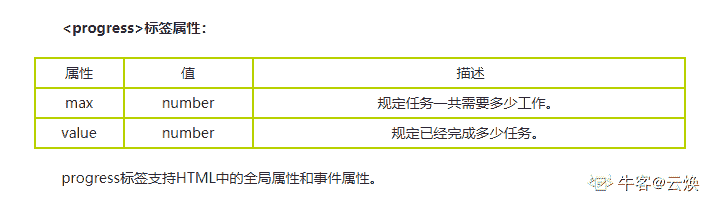
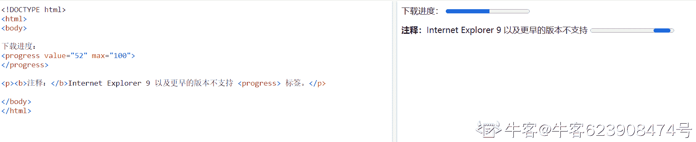

# HTML5 测验五

## 1

下列哪个元素表示外部资源？该元素可以被视为图像、嵌套的浏览上下文或插件要处理的资源。它包括各种属性，如存档、边框、分类、代码库、代码类型等

正确答案: A   你的答案: 空 (错误)

```cpp
<object>
```

```cpp
<source>
```

```cpp
<param>
```

```cpp
<picture>
```

本题知识点

前端工程师 CSS

讨论

[鋠觞佰钰亰](https://www.nowcoder.com/profile/2814591)

难受，看到第一句话下意识选择`<source>`标签。
所有搜了一下`<source>`的作用供大家了解下：

> `<source>` 标签为媒介元素（比如 `<video>` 和 `<audio>`）定义媒介资源。
> `<source>` 标签允许您规定可替换的视频/音频文件供浏览器根据它对媒体类型或者编解码器的支持进行选择。

[`www.w3school.com.cn/tags/tag_source.asp`](https://www.w3school.com.cn/tags/tag_source.asp)

发表于 2020-12-03 09:38:04

* * *

[牛客 445252366 号](https://www.nowcoder.com/profile/445252366)

https://www.cnblogs.com/shihaiying/articles/11829697.html

发表于 2020-09-09 17:11:34

* * *

[JJJenny0607](https://www.nowcoder.com/profile/575589073)

object 可以嵌套 embed

发表于 2021-03-28 11:01:49

* * *

## 2

哪个元素指定多个媒体资源？

正确答案: B   你的答案: 空 (错误)

```cpp
<param>
```

```cpp
<source>
```

```cpp
<object>
```

```cpp
<picture>
```

本题知识点

前端工程师 HTML CSS

讨论

[三杯水儿](https://www.nowcoder.com/profile/90304585)

HTML 中的标签大多数都是见形知意的。source：资源……😂。至于深入的理解，靠后期的实践。

发表于 2020-09-15 20:00:26

* * *

[Spring_Beautiful](https://www.nowcoder.com/profile/828784821)

<source> 元素为 <audio>、<video> 和 <picture> 元素指定多个媒体资源

发表于 2021-11-23 16:02:08

* * *

[颜 2](https://www.nowcoder.com/profile/117503128)

source

发表于 2020-09-15 16:33:15

* * *

## 3

哪个元素不是脚本元素？

正确答案: D   你的答案: 空 (错误)

```cpp
<noscript>
```

```cpp
<canvas>
```

```cpp
<script>
```

```cpp
<image>
```

本题知识点

前端工程师

## 4

哪个元素显示任务的完成进度？

正确答案: A   你的答案: 空 (错误)

```cpp
<progress>
```

```cpp
<option>
```

```cpp
<select>
```

```cpp
<meter>
```

本题知识点

前端工程师 HTML

讨论

[云焕](https://www.nowcoder.com/profile/599549162)

HTML5 progress 标签的作用是标示任务的进度（进程） 

发表于 2020-08-21 19:51:56

* * *

[almostall](https://www.nowcoder.com/profile/623908474)



发表于 2021-07-15 20:28:08

* * *

[Lemon 梦梦](https://www.nowcoder.com/profile/196380127)

option 元素定义下拉列表中的一个选项。浏览器将 option 标签中的内容作为 select 标签的菜单或是滚动列表中的一个元素显示。option 元素位于 select 元素内部。 meter 标签定义已知范围或分数值内的标量测量，如：磁盘用量、查询结果的相关性等等。

发表于 2021-01-15 15:56:57

* * *

## 5

哪个元素创建了一组选项？

正确答案: C   你的答案: 空 (错误)

```cpp
<progress>
```

```cpp
<option>
```

```cpp
<optgroup>
```

```cpp
<select>
```

本题知识点

前端工程师 HTML

讨论

[面朝大海风灿烂](https://www.nowcoder.com/profile/464555905)

<select>  <optgroup label="Swedish Cars">     <option value="volvo">Volvo</option>     <option value="saab">Saab</option>   </optgroup>   <optgroup label="German Cars">     <option value="mercedes">Mercedes</option>     <option value="audi">Audi</option>   </optgroup> </select> 发表于 2021-01-05 17:23:56 Lemon 梦梦 optgroup 元素用于组合选项。当您使用一个长的选项列表时，对相关的选项进行组合会使处理更加容易。 发表于 2021-01-15 16:00:20 牛客 325643157 号 <select name="number"> <option value="1">one</option> <option value="2">two</option> <option value="3">three</option> <option value="4">four</option> </select> 发表于 2020-08-24 10:44:17 6 哪个元素表示给定范围内的标量值 ？ 正确答案: B   你的答案: 空 (错误) <option> <meter> <label> <input> 本题知识点 前端工程师 HTML 讨论 云焕 HTML5 中的 标签用于显示已知范围内的标量测量值。 定义和用法： <meter> 标签定义已知范围或分数值内的标量测量。也被称为 gauge（尺度）。 例子：磁盘用量、查询结果的相关性，等等。 注释：<meter> 标签不应用于指示进度（在进度条中）。如果标记进度条，请使用 <progress> 标签。 浏览器支持:FireFox chrome safari  Opera 不支持 IE，IE 是业界毒瘤。 编辑于 2020-08-21 18:11:36 7 以下哪个元素没有 width 属性？ 正确答案: D   你的答案: 空 (错误) <input> <object> <embed> <textarea> 本题知识点 前端工程师 HTML 讨论 小萨 出题者的意思应该是说：以下元素哪一个没有 width 属性。这样答案就是<textarea>。 但是<textarea>可以设置 cols 属性来控制宽度。 发表于 2020-08-30 09:49:58 mernva embed 标签定义嵌入的内容，比如插件，可以设置高度和宽度，常见属性有 height,src,width,type textarea 定义多行的文本输入控件，默认字体是等宽字体 object 标签定义一个嵌入对象，如图像、视频、音频等，可以设置宽度高度 发表于 2020-08-09 12:56:22 可乐味的若七 定义和用法 <textarea> 标签定义多行的文本输入控件。 文本区中可容纳无限数量的文本，其中的文本的默认字体是等宽字体（通常是 Courier）。 可以通过 cols 和 rows 属性来规定 textarea 的尺寸，不过更好的办法是使用 CSS 的 height 和 width 属性。 注释：在文本输入区内的文本行间，用 "%OD%OA" （回车/换行）进行分隔。 提示：可以通过 <textarea> 标签的 wrap 属性设置文本输入区内的换行模式。 发表于 2020-11-19 21:55:31 8 下列哪个选项显示 JavaScript 中函数耗费时间的进度？ 正确答案: C   你的答案: 空 (错误) <object> <input> <progress> <area> 本题知识点 前端工程师 9 以下哪个是在 HTML5 之前已经引入的特性？ 正确答案: D   你的答案: 空 (错误) canvas/svg video 地理定位 frames 本题知识点 前端工程师 HTML 讨论 镣铐舞者 html5 十大新特性的总结：一、html5 新特性之用于绘画的 canvas 元素二、html5 新特性之更加丰富强大的表单三、html5 新特性之用于媒介的 video 和 audio 元素四、html5 新特性之 html5 地理定位五、html5 新特性之 html5 拖放六：html5 新特性之 html5 Web 存储七、html5 新特性之 html5 应用程序缓存八、html5 新特性之 html5 Web Workers 九、html5 新特性之 html5 服务器发送事件十、html5 新特性之 html5 WebSocket　 发表于 2020-09-20 18:40:04 Piggo h5 的新增特性： 1、拖拽释放(Drap and drop) API ondrop 拖放是一种常见的特性，即抓取对象以后拖到另一个位置 在 HTML5 中，拖放是标准的一部分，任何元素都能够拖放 2、自定义属性 data-id 3、语义化更好的内容标签(header,nav,footer ,aside, article, section) 4、音频 ,视频(audio, video) 如果浏览器不支持自动播放怎么办?在属性中添加 autoplay 5、画布 Canvas 5.1）getContext() 方法返回一个用于在画布上绘图的环境 Canvas.getContext(contextID) 参数 contextID 指定了您想要在画布上绘制的类型。当前唯一的合法值是 “2d”，它指定了 二维绘图，并且导致这个方法返回一个环境对象，该对象导出一个二维绘图 API 5.2）cxt.stroke() 如果没有这一步 线条是不会显示在画布上的 5.3）canvas 和 image 在处理图片的时候有什么区别? image 是通过对象的形式描述图片的,canvas 通过专门的 API 将图片绘制在画布上. 6、 地理(Geolocation) API 7、 本地离线存储 localStorage 长期存储数据 浏览器关闭后数据不丢失 8、 sessionStorage 的数据在浏览器关闭后自动删除 9、 表单控件 calendar , date , time , email , url , search , tel , file , number 10、新的技术 webworker, websocket , Geolocation 发表于 2021-04-24 18:59:14 矜持的微笑 html5 总的来说比 html4 多了十个新特性，但其不支持 ie8 及 ie8 以下版本的浏览器 一、语义标签 html5 语义标签，可以使开发者更方便清晰构建页面的布局 <header>    定义了文档的头部区域 <footer>     定义了文档的尾部区域  <nav>     定义文档的导航   <section>     定义文档中的节  <article>     定义文章  <aside>     定义页面以外的内容  <details>    定义用户可以看到或者隐藏的额外细节  <summary>    标签包含 details 元素的标题   <dialog>    定义对话框  <figure>    定义自包含内容，如图表 <main>    定义文档主内容 <mark>    定义文档的主内容 <time>    定义日期/时间 二、增强型表单 html5 修改一些新的 input 输入特性，改善更好的输入控制和验证 输入类型    描述 color    主要用于选取颜***r /> date    选取日期 datetime    选取日期(UTC 时间) datetime-local    选取日期（无时区） month    选择一个月份 week    选择周和年 time    选择一个时间 email    包含 e-mail 地址的输入域 number    数值的输入域 url    url 地址的输入域 tel    定义输入电话号码和字段 search    用于搜索域 range    一个范围内数字值的输入域  html5 新增了五个表单元素 <datalist>    用户会在他们输入数据时看到域定义选项的下拉列表 <progress>    进度条，展示连接/下载进度 <meter>    刻度值，用于某些计量，例如温度、重量等 <keygen>    提供一种验证用户的可靠方法,生成一个公钥和私钥 <output>    用于不同类型的输出,比如尖酸或脚本输出 html5 新增表单属性 属性    描述 placehoder    输入框默认提示文字 required    要求输入的内容是否可为空 pattern    描述一个正则表达式验证输入的值 min/max    设置元素最小/最大值 step    为输入域规定合法的数字间隔 height/wdith    用于 image 类型<input>标签图像高度/宽度 autofocus    规定在页面加载时，域自动获得焦点 multiple    规定<input>元素中可选择多个值 三、音频和视频 html5 提供了音频和视频文件的标准，既使用<audio>元素。 音频：<audio src=" "></audio> 视频：<video src=" "></video> 四、Canvas 绘图 五、SVG 绘图 什么是 SVG? SVG 指可伸缩矢量图形  SVG 用于定义用于网络的基于矢量的图形 SVG 使用 XML 格式定义图形 SVG 图像在放大或改变尺寸的情况下其图形质量不会有损失  SVG 是万维网联盟的标准 SVG 的优势 与其他图像格式相比，SVG 的优势在于： SVG 图像可通过文本编译器来创建和修改 SVG 图像可被搜索、索引、脚本化或压缩 SVG 是可伸缩的 SVG 图像可在任何的分辨率下被高质量的打印 SVG 可在图像质量不下降的情况下被放大 SVG 与 Canvas 区别 *SVG 适用于描述 XML 中的 2D 图形的语言 *Canvas 随时随地绘制 2D 图形（使用 javaScript） *SVG 是基于 XML 的，意味这可以操作 DOM，渲染速度较慢 *在 SVG 中每个形状都被当做是一个对象，如果 SVG 发生改变，页面就会发生重绘 *Canvas 是一像素一像素地渲染，如果改变某一个位置，整个画布会重绘。 Canvas    SVG 依赖分辨率    不依赖分辨率 不支持事件处理器    支持事件处理器 能够以.png 或.jpg 格式保存结果图像    复杂度会减慢搞渲染速度 文字呈现功能比较简单    适合大型渲染区域的应用程序 最合适图像密集的游戏    不适合游戏应用  六、地理定位 使用 getCurrentPosition()方法来获取用户的位置。以实现“LBS 服务” 七、拖放 API 拖放是一种常见的特性，即捉取对象以后拖到另一个位置。 在 html5 中，拖放是标准的一部分，任何元素都能够拖放。 <div draggable="true"></div> 拖动生命周期    属性名    描述 拖动开始    ondragstart    在拖动操作开始时执行脚本 拖动过程中    ondrag    只要脚本在被拖动就运行脚本 拖动过程中    ondragenter    当元素被拖动到一个合法的防止目标时，执行脚本 拖动过程中    ondragover    只要元素正在合法的防止目标上拖动时，就执行脚本 拖动过程中    ondragleave    当元素离开合法的防止目标时 拖动结束    ondrop    将被拖动元素放在目标元素内时运行脚本 拖动结束    ondragend    在拖动操作结束时运行脚本  八、Web Worker Web Worker 可以通过加载一个脚本文件，进而创建一个独立工作的线程，在主线程之外运行。 Web Worker 的基本原理就是在当前 javascript 的主线程中，使用 Worker 类加载一个 javascript 文件来开辟一个新的线程， 起到互不阻塞执行的效果，并且提供主线程和新县城之间数据交换的接口：postMessage、onmessage。 九、Web Storage WebStorage 是 HTML 新增的本地存储解决方案之一，但并不是取代 cookie 而指定的标准，cookie 作为 HTTP 协议的一部分用来处理客户端和服务器的通信是不可或缺的，session 正式依赖与实现的客户端状态保持。WebSorage 的意图在于解决本来不应该 cookie 做，却不得不用 cookie 的本地存储。 websorage 拥有 5M 的存储容量，而 cookie 却只有 4K，这是完全不能比的。 客户端存储数据有两个对象，其用法基本是一致。 localStorage：没有时间限制的数据存储 sessionStorage:在浏览器关闭的时候就会清除。 localStorage.setItem(key,value);//保存数据 let value = localStorage.getItem(key);//读取数据  localStorage.removeItem(key);//删除单个数据 localStorage.clear();//删除所有数据  let key = localStorage.key(index);//得到某个索引的值  十、WebSocket WebSocket 协议为 web 应用程序客户端和服务端之间提供了一种全双工通信机制。 特点：（1）握手阶段采用 HTTP 协议，默认端口是 80 和 443 （2）建立在 TCP 协议基础之上，和 http 协议同属于应用层 （3）可以发送文本，也可以发送二进制数据。 发表于 2022-02-20 09:59:10 10 如果在 HTML 文档的开始部分没有使用 doctype 怎么办？ 正确答案: A   你的答案: 空 (错误) 怪异模式，浏览器使用自己的怪异模式解析渲染页面 浏览器在标准模式下解析渲染页面 浏览器停止工作 览器显示页面后崩溃 本题知识点 前端工程师 HTML 讨论 Moeyua 在 HTML 中，文档类型 doctype 的声明是必要的。在所有文档的头部，你都将会看到"<!DOCTYPE html>" 的身影。这个声明的目的是防止浏览器在渲染文档时，切换到我们称为“怪异模式(兼容模式)”的渲染模式。“<!DOCTYPE html>" 确保浏览器按照最佳的相关规范进行渲染，而不是使用一个不符合规范的渲染模式。 https://developer.mozilla.org/zh-CN/docs/Glossary/Doctype 发表于 2020-08-31 19:42:32 容王 nim 不是没有定义 doctype 是混杂模式吗？，怪异模式是根据 dtd，浏览器以自身标准进行解析，标准模式是浏览器按 w3c 标准模式进行解析啊 发表于 2020-09-04 11:24:40 矜持的微笑 doctype 声明指出阅读程序应该用什么规则集来解释文档中的标记。在 Web 文档的情况下，“阅读程序”通常是浏览器或者校验器这样的一个程序，“规则”则是 W3C 所发布的一个文档类型定义（DTD）中包含的规则。  (1) 声明位于文档中的最前面的位置，处于标签之前。此标签可告知浏览器文档使用哪种 HTML 或 XHTML 规范。该标签可声明三种 DTD 类型，分别表示严格版本、过渡版本以及基于框架的 HTML 文档。  (2)所谓的标准模式是指，浏览器按 W3C 标准解析执行代码；怪异模式则是使用浏览器自己的方式解析执行代码，因为不同浏览器解析执行的方式不一样，所以我们称之为怪异模式。 严格模式是浏览器根据 web 标准去解析页面，是一种要求严格的 DTD，不允许使用任何表现层的语法，如 。严格模式的排版和 JS 运作模式是以该浏览器支持的最高标准运行混杂模式则是一种向后兼容的解析方法，说的透明点就是可以实现 IE5.5 以下版本浏览器的渲染模式。  (3)浏览器解析时到底使用标准模式还是怪异模式，与你网页中的 DTD 声明直接相关， DTD 声明定义了标准文档的类型（标准模式解析）文档类型，会使浏览器使用相应的方式加载网页并显示，忽略 DTD 声明 ,将使网页进入怪异模式。 发表于 2022-02-20 10:03:10</select>