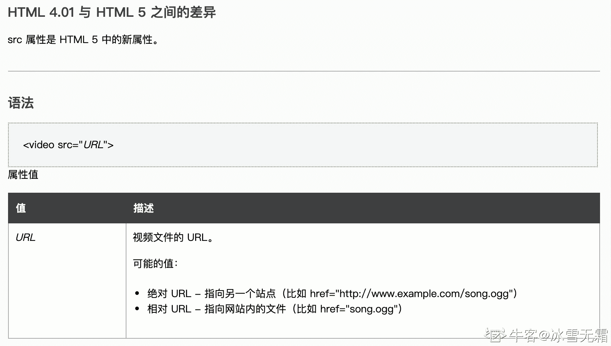

# HTML5 测验六

## 1

HTML5 没有删除哪个元素？

正确答案: C   你的答案: 空 (错误)

```cpp
<strike>
```

```cpp
<center>
```

```cpp
<small>
```

```cpp
<big>
```

本题知识点

前端工程师 HTML

讨论

[明明初见](https://www.nowcoder.com/profile/8495657)

废除了能用 css 代替的元素：basefont、big、center、font、s、strike、tt、u

发表于 2020-08-04 20:40:16

* * *

[鋠觞佰钰亰](https://www.nowcoder.com/profile/2814591)

权当温习下知识点，只要记住以下删除的标签：

*   `<acronym>`：被标记的首字母缩略词
*   `<applet>`：一个嵌入的 Java applet；即能够解析 java 的`class`文件的一个东东
*   `<basefont>`：该标签可以为文档中的所有文本定义默认字体颜色、字体大小和字体系列。参考：[`www.w3school.com.cn/tags/tag_basefont.asp`](https://www.w3school.com.cn/tags/tag_basefont.asp)
*   `<big>`：让文本比常规的字体大一号
*   `<center>`：水平居中
*   `<dir>`：文本方向为从右向左的段落：`<bdo dir="rtl">文本方向从右到左!</bdo>`
*   `<font>`：规定文本的尺寸、字体和颜色
*   `<frame>`：`<frameset>`元素被用来组织一个或者多个`<frame> 元素`
*   `<frameset>`：HTML5 不支持`<frameset>`标签
*   `<noframes>`：noframes 元素可为那些不支持框架的浏览器显示文本。noframes 元素位于 frameset 元素内部。参考：[`www.w3school.com.cn/tags/tag_noframes.asp`](https://www.w3school.com.cn/tags/tag_noframes.asp)
*   `<strike>`：`<strike>`标签可定义加删除线文本定义。参考：[`www.w3school.com.cn/tags/tag_strike.asp`](https://www.w3school.com.cn/tags/tag_strike.asp)
*   `<tt>`：`<tt>`标签呈现类似打字机或者等宽的文本效果。参考：[`www.w3school.com.cn/tags/tag_tt.asp`](https://www.w3school.com.cn/tags/tag_tt.asp)

参考：[`jingyan.baidu.com/article/19192ad8c6ced1e53e57072d.html`](https://jingyan.baidu.com/article/19192ad8c6ced1e53e57072d.html)

发表于 2020-10-29 10:17:14

* * *

[元无心](https://www.nowcoder.com/profile/224444564)

接着上面那位老哥的内容。MDN：“在 HTML5 中，除了它的样式含义，这个元素被重新定义为表示边注释和附属细则，包括版权和法律文本。”感觉上，这个元素被赋予了“小字”的语义，所以存活了下来。不过，MDN 同时指出，虽然 H5 允许使用，但这个元素仍然违反了结构和样式分离的原则。与该标签类似的还有<b> 元素和 <i> 元素，都可以用 CSS 来进行相应的样式上的替换。

发表于 2020-09-28 08:39:11

* * *

## 2

下列哪项定义了作品的标题？

正确答案: A   你的答案: 空 (错误)

```cpp
<cite>
```

```cpp
<hr>
```

```cpp
<a>
```

```cpp
<address>
```

本题知识点

前端工程师 HTML

讨论

[小九咔咔](https://www.nowcoder.com/profile/482576514)

<address> 标签定义文档或文章的作者/拥有者的联系信息。<hr> 标签在 HTML 页面中创建一条水平线。 <a> 标签定义超链接，用于从一张页面链接到另一张页面。 <cite> 标签通常表示它所包含的文本对某个参考文献的引用，比如书籍或者杂志的标题。 D

发表于 2020-07-31 21:25:57

* * *

[牛客 955794565 号](https://www.nowcoder.com/profile/955794565)

<address> 标签定义文档或文章的作者/拥有者的联系信息。<cite> 标签通常表示它所包含的文本对某个参考文献的引用，比如书籍或者杂志的标题。 

发表于 2021-09-14 19:45:58

* * *

[连夜的月光](https://www.nowcoder.com/profile/220262211)

*HTML 引用（ Citation）标签* (**<cite>**) 表示一个作品的引用，且必须包含作品的标题。这个引用可能是一个根据适当的上下文约定关联引用的元数据的缩写。

发表于 2020-02-13 16:08:46

* * *

## 3

下列哪个陈述是正确的？

正确答案: C   你的答案: 空 (错误)

```cpp
canvas 包含内置动画
```

```cpp
svg 需要脚本来绘制元素
```

```cpp
在 canvas 中，绘图是用像素完成的
```

```cpp
svg 不支持事件处理程序
```

本题知识点

前端工程师

## 4

<main> 一般包含什么？

正确答案: C   你的答案: 空 (错误)

```cpp
头部区域
```

```cpp
侧边栏
```

```cpp
文章主题部分
```

```cpp
底部内容
```

本题知识点

前端工程师 HTML

讨论

[冰雪无霜](https://www.nowcoder.com/profile/5840895)

头部：header 侧边栏：slider 主体：main 底部：footer 大概意思是这样的，中文描述的不是专业术语

发表于 2020-10-19 16:30:46

* * *

[ず东隅已逝╊桑榆未晚](https://www.nowcoder.com/profile/1403602)

主题？

发表于 2021-12-16 07:53:38

* * *

[无聊★刷刷](https://www.nowcoder.com/profile/875199633)

头部 header 侧边栏 slier 主体内容 main 尾部 footer

发表于 2021-04-28 22:34:43

* * *

## 5

HTML5 事件可以触发多少次？

正确答案: A   你的答案: 空 (错误)

```cpp
多次
```

```cpp
一次
```

```cpp
仅两次
```

```cpp
零次
```

本题知识点

前端工程师 HTML

讨论

[牛客 255171676 号](https://www.nowcoder.com/profile/255171676)

A:一个页面会有多次的交互，每一次的交互都需要触发一个事件。一个完整的网站交互不会少于两次

发表于 2020-10-24 20:58:18

* * *

[你快乐吗](https://www.nowcoder.com/profile/5271388)

这个也没说什么事件，唉

发表于 2020-11-10 10:21:29

* * *

[Unknow201902110944638](https://www.nowcoder.com/profile/959595461)

真就凭经验得知，没有理论知识支持，有没有大佬解释一下

发表于 2020-09-14 07:59:04

* * *

## 6

HTML5 文档可能包含一个 ______ 元素用于设置文档的标题部分？

正确答案: A   你的答案: 空 (错误)

```cpp
header
```

```cpp
footer
```

```cpp
section
```

```cpp
drive
```

本题知识点

前端工程师 HTML

讨论

[Lemon 梦梦](https://www.nowcoder.com/profile/196380127)

：页眉通常包括网站标志、主导航、全站链接以及搜索框。：标记导航，仅对文档中重要的链接群使用。

<main>：页面主要内容，一个页面只能使用一次。如果是 web 应用，则包围其主要功能。：定义外部的内容，其中的内容独立于文档的其余部分。：定义文档中的节（section、区段）。比如章节、页眉、页脚或文档中的其他部分。</main>

发表于 2021-01-15 15:20:20

* * *

[WXMcomeon](https://www.nowcoder.com/profile/662652834)

header 定义了文档的头部区域 footer 定义 section 或 document 的页脚。section 定义文档中的节（section、区段）

发表于 2020-09-17 15:47:49

* * *

[honng](https://www.nowcoder.com/profile/633961032)

感觉 header 约等于 div class=“header”

标签语义化稍好一点。

编辑于 2020-12-28 09:52:12

* * *

## 7

内容中可以使用哪个元素来表示标签外的内容？

正确答案: A   你的答案: 空 (错误)

```cpp
aside
```

```cpp
cite
```

```cpp
article
```

```cpp
class
```

本题知识点

前端工程师 HTML

讨论

[兰舟啵啵糖](https://www.nowcoder.com/profile/783963494)

article

<article>代表文档，页面或应用程序中独立的，完整的，可以独自被外部引用的内容，也可以嵌套使用。可以是一篇博客或者报刊中的文章，一篇论坛帖子，一段用户评论或者独立的插件，或其他任和独立的内容。

aside

<aside>元素用来表示当前页面或文章的附属信息部分，它可以包含当前页面或主要内容相关的引用，侧边栏，广告，导航条，以及其他类型的有别于主要内容的部分。

发表于 2021-08-17 15:24:57

* * *

[牛客 369274160 号](https://www.nowcoder.com/profile/369274160)

 HTML 5 <aside> 标签 <aside> 标签定义 article 以外的内容。aside 的内容应该与 article 的内容相关。

发表于 2021-04-22 18:58:28

* * *

[牛客 75024471 号](https://www.nowcoder.com/profile/75024471)

这些标签可以理解带有实际意义的 div

发表于 2020-08-02 21:14:07

* * *

## 8

为同一个文件添加多种文件格式的原因是什么 ？

```cpp
<source src="html_5.mp4" type="video/mp4">
<source src="html_5.ogv" type="video/ogg">

```

正确答案: C   你的答案: 空 (错误)

```cpp
提供后备支援
```

```cpp
解决媒体支持问题
```

```cpp
提供备份支持并解决媒体支持问题
```

本题知识点

前端工程师 HTML

讨论

[牛客 892431629 号](https://www.nowcoder.com/profile/892431629)

```cpp
媒体支持问题:不同浏览器及版本可能对文件格式的支持不同，多放几个格式以免浏览器碰到一个文件不能支持 
```

```cpp
提供备份支持：如果浏览器两个格式都能支持，其中一个文件某些原因不能播放了，那还有另外一个文件可用嘛
```

发表于 2020-11-10 14:26:40

* * *

[Hayle](https://www.nowcoder.com/profile/416498138)

提供备份支持：浏览器对两种格式都支持的情况下，若其中一个文件不可用，可以用另外一个格式；提供媒体支持：不同浏览器支持格式可能会有差异

发表于 2021-04-19 09:14:26

* * *

## 9

要插入视频，我们需要使用 video 标签，并设置 source 标签中的 src 属性为本地或远程 URL？

正确答案: A   你的答案: 空 (错误)

```cpp
正确
```

```cpp
错误
```

本题知识点

前端工程师 HTML

讨论

[冰雪无霜](https://www.nowcoder.com/profile/5840895)



发表于 2020-10-19 16:23:48

* * *

[Rangogogo](https://www.nowcoder.com/profile/381990154)

Source 标签什么鬼

发表于 2022-01-05 11:19:20

* * *

[Coder-Lei](https://www.nowcoder.com/profile/392835920)

单一视频源的时候 src 属性只需要放在 video 标签即可，何必加个 source

发表于 2022-02-10 17:35:57

* * *

## 10

在 HTML 音频/视频 DOM 中，_____ 设置是否在页面加载后载入视频

正确答案: A   你的答案: 空 (错误)

```cpp
preload
```

```cpp
autoplay
```

```cpp
buffered
```

```cpp
controller
```

本题知识点

前端工程师 HTML

讨论

[增援未来](https://www.nowcoder.com/profile/282887929)

**autoplay 属性规定一旦视频就绪马上开始播放。**

```cpp
<video controls="controls" autoplay="autoplay">
  <source src="movie.ogg" type="video/ogg" />
  <source src="movie.mp4" type="video/mp4" />
</video>
```

**preload 属性规定是否在页面加载后载入视频。**
**如果设置了 autoplay 属性，则忽略该属性。**

```cpp
<video controls="controls" preload="auto">
  <source src="movie.ogg" type="video/ogg" />
  <source src="movie.mp4" type="video/mp4" />
</video>
```

发表于 2020-08-06 16:41:01

* * *

[Lemon 梦梦](https://www.nowcoder.com/profile/196380127)

preload 属性设置或返回是否在页面加载后立即加载音频/视频。 autoplay 属性设置或返回音视频是否在加载后即开始播放。 buffered 属性返回用户已缓冲音视频的时间范围。 controller 属性返回音视频的当前媒体控制器。

编辑于 2021-01-15 15:38:15

* * *

[牛客 6720436 号](https://www.nowcoder.com/profile/6720436)

preload 属性设置或返回是否在页面加载后立即加载音频/视频。 autoplay 属性设置或返回音视频是否在加载后即开始播放。 buffered 属性返回用户已缓冲音视频的时间范围。 controller 属性返回音视频的当前媒体控制器。

发表于 2021-12-08 20:38:19

* * *

## 11

以下哪个不是 HTML5 标签 ？

正确答案: D   你的答案: 空 (错误)

```cpp
<video>
```

```cpp
<source>
```

```cpp
<track>
```

```cpp
<slider>
```

本题知识点

前端工程师 HTML

讨论

[陈仙生](https://www.nowcoder.com/profile/751972961)

video 定义视频，source 定义媒体资源，track 为音频和视频规定外部文本轨道。

发表于 2020-08-10 11:28:14

* * *

[laterspace](https://www.nowcoder.com/profile/65330907)

video 引入视频；source 定义媒体资源路径；track 定义媒体资源的文本轨道，如字幕；而 slider 是不存在的，但有个像的，叫 aside

发表于 2021-09-08 09:21:09

* * *

[WEBJ2EE](https://www.nowcoder.com/profile/3930151)

source、track 还真不熟悉... 学习了

发表于 2019-12-22 11:33:35

* * *