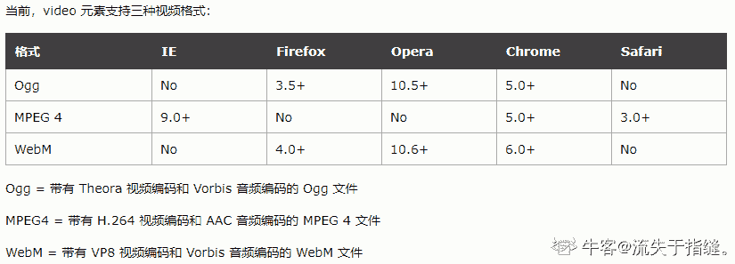
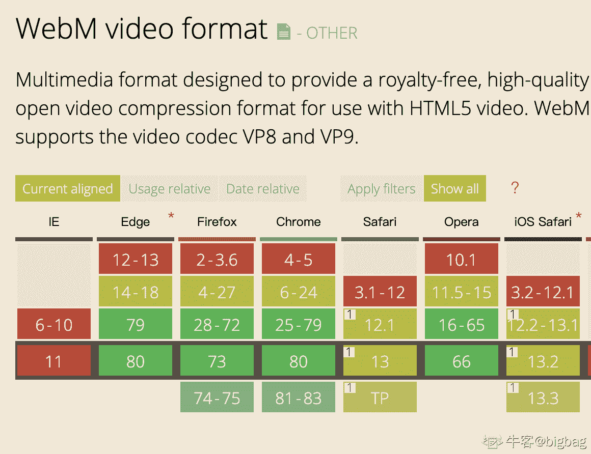
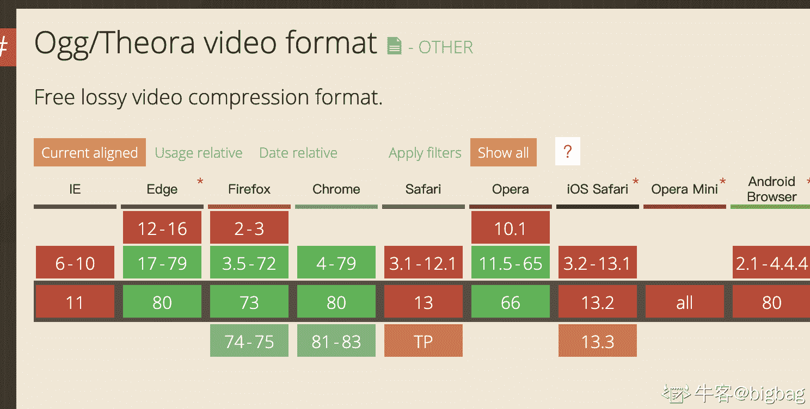
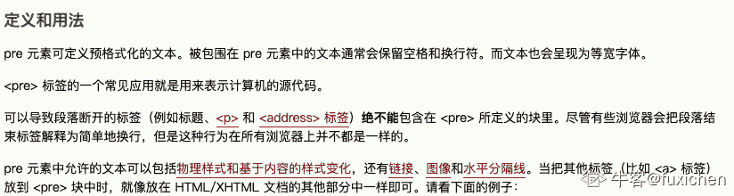
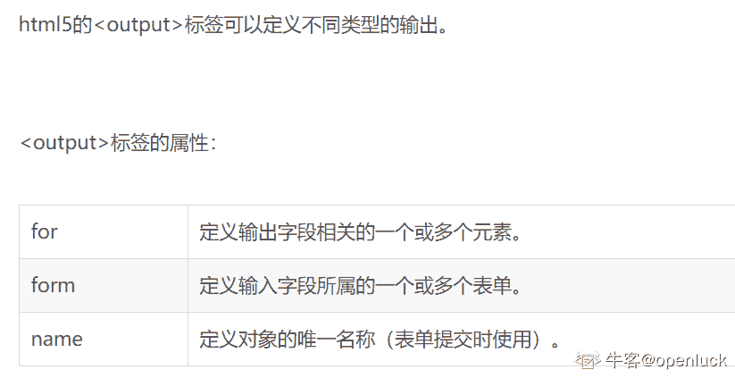

# HTML5 测验七

## 1

如果视频加载时没有设置视频的高度和宽度，会发生什么情况？

正确答案: A   你的答案: 空 (错误)

```cpp
页面闪烁
```

```cpp
页面未加载
```

```cpp
页面崩溃
```

```cpp
页面关闭
```

本题知识点

前端工程师

讨论

[天天喝奶茶](https://www.nowcoder.com/profile/386118523)

A，**浏览器就不知道视频的大小，当视频加载时，页面将发生变化(或闪烁)**

发表于 2019-11-11 18:03:15

* * *

## 2

下列哪种 HTML 视频媒体类型在 IE 中不受支持 ？

正确答案: C   你的答案: 空 (错误)

```cpp
WebM
```

```cpp
MP4
```

```cpp
Ogg
```

```cpp
MP4 FLAC
```

本题知识点

前端工程师

讨论

[流失于指缝。](https://www.nowcoder.com/profile/6249355)



发表于 2019-11-04 16:07:39

* * *

[bigbag](https://www.nowcoder.com/profile/1621564)

webm 和 ogg IE 应该都不支持吧

发表于 2020-02-25 14:08:23

* * *

[连夜的月光](https://www.nowcoder.com/profile/220262211)

没有看到是在 IE 内...

编辑于 2020-02-13 16:19:07

* * *

## 3

在 HTML 音频/视频 DOM 中，_____ 设置或返回音频/视频播放的默认速度？

正确答案: C   你的答案: 空 (错误)

```cpp
currentTime
```

```cpp
duration
```

```cpp
defaultPlaybackRate
```

```cpp
playbackRate
```

本题知识点

前端工程师 HTML

讨论

[牛客 687684794 号](https://www.nowcoder.com/profile/687684794)

currentTime:设置或者返回视频播放的当前位置（以秒计）。当设置该属性时，播放会跳跃到指定的位置。 duration:规定造成过渡效果需要花费的时间 defaultPlaybackRate:设置或者返回音频或者视频播放的默认速度 PlaybackRate：设置或者返回视频当前的播放速度

发表于 2020-09-20 16:08:19

* * *

[默寒 20180417135138](https://www.nowcoder.com/profile/2816131)

翻译翻译什么叫 播放的默认速度

发表于 2021-07-05 17:51:20

* * *

[牛客 318229439 号](https://www.nowcoder.com/profile/318229439)

currentTime 当前播放时间（秒） duration 当前音频的总时长（秒） defaultPlaybackRate 默认播放速度 PlaybackRate 当前播放速度

发表于 2021-08-02 17:40:08

* * *

## 4

哪个元素表示预格式化文本 ？

正确答案: D   你的答案: 空 (错误)

```cpp
<main>
```

```cpp
<dir>
```

```cpp
<dd>
```

```cpp
<pre>
```

本题知识点

前端工程师 HTML

讨论

[Lemon 梦梦](https://www.nowcoder.com/profile/196380127)

main 标签规定文档的主要内容； dir 定义目录列表； dd 为定义列表中项目的描述； pre 可定义预格式化的文本。 补充：定义列表 dl 标签定义了定义列表（definition list），其内又包含了 dt（定义列表中的项目）和 dd（描述列表中的项目）。

编辑于 2021-01-15 14:31:04

* * *

[fuxichen](https://www.nowcoder.com/profile/80456169)

D

发表于 2019-11-05 14:40:24

* * *

[牛客 903214776 号](https://www.nowcoder.com/profile/903214776)

选 D

发表于 2021-10-24 19:31:30

* * *

## 5

HTML5 能向后兼容旧浏览器吗 ？

正确答案: A   你的答案: 空 (错误)

```cpp
正确
```

```cpp
错误
```

本题知识点

前端工程师 HTML

讨论

[天天喝奶茶](https://www.nowcoder.com/profile/386118523)

A，**HTML5 被设计成尽可能向后兼容现有的 web 浏览器**

发表于 2019-11-11 18:07:15

* * *

[糖豆](https://www.nowcoder.com/profile/145122)

支持，兼容加入适配的 js 语句即可

发表于 2019-11-14 13:27:40

* * *

[牛客 463921571 号](https://www.nowcoder.com/profile/463921571)

这问题标题问得有问题吧

发表于 2021-07-05 09:30:29

* * *

## 6

关于 HTML5 中的自定义属性(data-*)，下列哪个选项是正确的 ？

正确答案: C   你的答案: 空 (错误)

```cpp
自定义数据属性以 data 开始，并将根据您的需求进行命名
```

```cpp
您可以使用 JavaScript 获得这些属性的值
```

```cpp
以上都是
```

```cpp
以上都不是
```

本题知识点

前端工程师

讨论

[拾 20190509001620](https://www.nowcoder.com/profile/199639547)

C

发表于 2021-07-19 21:47:39

* * *

[WEBJ2EE](https://www.nowcoder.com/profile/3930151)

C

发表于 2019-12-22 11:28:57

* * *

## 7

以下哪个标签用于表示 HTML5 中不同类型输出的结果 ？

正确答案: A   你的答案: 空 (错误)

```cpp
output
```

```cpp
placeholder
```

```cpp
autofocus
```

```cpp
required
```

本题知识点

前端工程师 HTML

讨论

[xomexome](https://www.nowcoder.com/profile/644772621)

output：<output> 标签定义不同类型的输出，比如脚本的输出。 placeholder：该提示会在输入字段为空时显示，并会在字段获得焦点时消失。autofocus：当页面加载时 input 元素应该自动获得焦点。
required：如果使用该属性，则字段是必填（或必选）的。

发表于 2020-12-25 17:25:24

* * *

[openluck](https://www.nowcoder.com/profile/924289180)



发表于 2019-11-14 16:57:12

* * *

[Lemon 梦梦](https://www.nowcoder.com/profile/196380127)

input 标签定义输入控件。属性有：placeholder 规定帮助用户填写输入字段的提示；required 指示输入字段的值是必需的；autofocus 规定输入字段在页面加载时是否获得焦点。 而 output 标签定义输出的一些类型。

发表于 2021-01-15 14:45:43

* * *

## 8

websocket 的 socket.readystate 属性的哪个值表示连接已建立并且可以进行通信？

正确答案: B   你的答案: 空 (错误)

```cpp
0
```

```cpp
1
```

```cpp
2
```

```cpp
3
```

本题知识点

前端工程师

讨论

[万水千山总是情 _ 给个 offer 行不行](https://www.nowcoder.com/profile/916511032)


发表于 2020-07-08 19:00:37

* * *

## 9

关于 HTML5 中的地理定位 api，下列哪个选项是正确的？

正确答案: D   你的答案: 空 (错误)

```cpp
HTML5 地理定位 API 允许您与您喜爱的 web 站点共享您的位置
```

```cpp
利用 javascript 可以捕获你的纬度和经度，并可以发送到后端 Web 服务器，做一些奇特的位置感知的事情，比如找到本地企业或在地图上显示你的位置
```

```cpp
如今，大多数浏览器和移动设备都支持地理定位 API
```

```cpp
以上都是
```

本题知识点

前端工程师 HTML

讨论

[Lemon 梦梦](https://www.nowcoder.com/profile/196380127)

地理定位是 HTML5 中新增的 API 特性，它允许 JavaScript 程序向浏览器询问用户真实的地理位置。识别地理位置的一些应用就可以使用它来显示地图、导航和其它一些与用户当前位置有关的信息。 Geolocation API 存在于 navigator 对象中，只包含 3 个方法：1、getCurrentPosition //当前位置。2、watchPosition //监视位置。3、clearWatch //清除监视。

编辑于 2021-01-15 14:59:50

* * *

[你快乐吗](https://www.nowcoder.com/profile/5271388)

选项是「全都是」这样描述的，答案一般就是这个选项。

发表于 2020-11-14 09:33:40

* * *

[牛客 245725962 号](https://www.nowcoder.com/profile/245725962)

*   HTML5 地理定位 API 允许您与您喜爱的 web 站点共享您的位置
*   *   ```cpp
        一个 javascript 可以捕获你的纬度和经度，并可以发送到后端 Web 服务器，做一些奇特的位置感知的事情，比如找到本地企业或在地图上显示你的位置
        ```

    *   ```cpp
        如今，大多数浏览器和移动设备都支持地理定位 API
        ```

发表于 2021-03-03 23:58:15

* * *

## 10

下列哪个属性触发中止事件？

正确答案: B   你的答案: 空 (错误)

```cpp
offline
```

```cpp
onabort
```

```cpp
abort
```

```cpp
onbeforeonload
```

本题知识点

前端工程师

讨论

[阿卡卡卡卡不卡](https://www.nowcoder.com/profile/809815906)

正确答案 B：

onabort 事件

定义和用法

onabort 事件会在图像加载被中断时发生。

当用户在图像完成载入之前放弃图像的装载（如单击了 stop 按钮）时，就会调用该句柄。

支持该事件的 HTML 标签：

```cpp

```

支持该事件的 JavaScript 对象：

```cpp
image
```

实例 1

在本例中，如果图像的加载被中断，则会显示一个对话框：

```cpp

```

实例 2

在本例中，如果图像的加载中断，我们将调用一个函数：

```cpp
<html>
<head>
<script type="text/javascript">
function abortImage()
{
alert('Error: Loading of the image was aborted')
}
</script>
</head>

<body>

</body>

</html>
```

发表于 2020-05-29 13:38:59

* * *

## 11

以下哪个属性在触发消息时触发事件？

正确答案: C   你的答案: 空 (错误)

```cpp
onloadedmetadata
```

```cpp
onloadstart
```

```cpp
onmessage
```

```cpp
onoffline
```

本题知识点

前端工程师